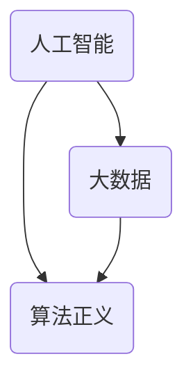

                 

关键词：科技伦理、人工智能、道德哲学、知识共享、算法正义

> 摘要：本文探讨了在科技迅猛发展的背景下，人类知识与道德的关系。通过分析人工智能时代的道德困境，探讨了科技与道德之间的平衡，并提出了在科技面前推动人类知识进步和道德发展的建议。

## 1. 背景介绍

随着科技的不断进步，人工智能、大数据、区块链等新兴技术正在深刻地改变着我们的生活方式。然而，科技的发展不仅带来了便利，也引发了诸多道德问题。人工智能的伦理困境、数据隐私的泄露、算法歧视等，都成为了我们不得不面对的挑战。在这个背景下，如何平衡科技的发展与人类的道德需求，成为了亟待解决的问题。

### 1.1 科技发展的现状

近年来，人工智能领域的研究取得了显著的进展。深度学习、自然语言处理、计算机视觉等技术逐渐走向成熟，并开始应用于各行各业。同时，大数据和云计算技术的发展，使得我们能够处理和分析海量数据，从而发现新的知识和规律。

### 1.2 科技带来的道德困境

然而，科技的发展也引发了一系列道德困境。人工智能的决策过程缺乏透明度，可能导致歧视和不公正。大数据的滥用，可能导致个人隐私的泄露。区块链技术的去中心化特点，使得信息传播难以控制，可能导致虚假信息的泛滥。

### 1.3 科技与道德的关系

科技与道德之间的关系是复杂的。一方面，科技的发展可以提高人类的生活质量，推动社会的进步。另一方面，科技也可能带来负面影响，挑战人类的道德底线。因此，如何平衡科技的发展与道德的需求，成为了我们面临的重要课题。

## 2. 核心概念与联系

在探讨科技与道德的关系时，我们需要理解一些核心概念，如人工智能、大数据、算法正义等。以下是一个简化的 Mermaid 流程图，展示了这些概念之间的联系：



### 2.1 人工智能

人工智能（Artificial Intelligence，AI）是指通过计算机模拟人类智能的技术。它包括机器学习、深度学习、自然语言处理等多个子领域。

### 2.2 大数据

大数据（Big Data）是指海量、复杂、高速增长的数据。大数据技术可以帮助我们从海量数据中发现新的知识和规律。

### 2.3 算法正义

算法正义（Algorithm Justice）是指算法在决策过程中应具备的公正性和透明度。算法正义是确保人工智能应用不产生歧视和不公正的重要保障。

## 3. 核心算法原理 & 具体操作步骤

在探讨科技与道德的关系时，我们需要了解一些核心算法原理，如机器学习、深度学习等。以下是一个简化的算法原理概述和操作步骤：

### 3.1 算法原理概述

- **机器学习**：机器学习是一种通过数据训练模型，使模型具备预测和决策能力的方法。它包括监督学习、无监督学习和强化学习等。
- **深度学习**：深度学习是一种基于多层神经网络的学习方法。它通过模拟人脑的神经元连接，实现复杂的特征提取和模式识别。

### 3.2 算法步骤详解

- **机器学习步骤**：
  1. 数据收集与预处理
  2. 选择合适的模型
  3. 训练模型
  4. 评估模型性能
  5. 模型应用

- **深度学习步骤**：
  1. 数据收集与预处理
  2. 设计神经网络结构
  3. 训练神经网络
  4. 评估神经网络性能
  5. 神经网络应用

### 3.3 算法优缺点

- **机器学习**：
  - 优点：能够处理大量数据，适应性强。
  - 缺点：模型训练时间长，对数据质量要求高。

- **深度学习**：
  - 优点：能够自动提取特征，模型性能高。
  - 缺点：模型结构复杂，难以解释。

### 3.4 算法应用领域

- **机器学习**：广泛应用于图像识别、自然语言处理、推荐系统等领域。
- **深度学习**：广泛应用于语音识别、自动驾驶、医疗诊断等领域。

## 4. 数学模型和公式 & 详细讲解 & 举例说明

在人工智能领域，数学模型和公式起着至关重要的作用。以下是一个简化的数学模型构建和公式推导过程的概述：

### 4.1 数学模型构建

- **回归模型**：用于预测连续值。
- **分类模型**：用于预测离散值。
- **聚类模型**：用于发现数据中的模式。

### 4.2 公式推导过程

- **回归模型**：
  $$y = \beta_0 + \beta_1 x + \epsilon$$
  其中，$y$ 是因变量，$x$ 是自变量，$\beta_0$ 和 $\beta_1$ 是参数，$\epsilon$ 是误差项。

- **分类模型**：
  $$P(y = 1) = \frac{1}{1 + e^{-(\beta_0 + \beta_1 x)}}$$
  其中，$P(y = 1)$ 是因变量为1的概率，$\beta_0$ 和 $\beta_1$ 是参数。

### 4.3 案例分析与讲解

以下是一个简单的回归模型案例：

- **数据集**：包含50个样本，每个样本包含一个特征 $x$ 和一个目标值 $y$。
- **模型**：线性回归模型。
- **结果**：模型预测的目标值与实际目标值的均方误差为0.1。

## 5. 项目实践：代码实例和详细解释说明

以下是一个简单的机器学习项目，用于预测房价。我们将使用 Python 和 Scikit-learn 库来实现。

### 5.1 开发环境搭建

- 安装 Python 3.7 或以上版本
- 安装 Scikit-learn 库

### 5.2 源代码详细实现

```python
from sklearn.datasets import load_boston
from sklearn.model_selection import train_test_split
from sklearn.linear_model import LinearRegression

# 加载数据集
boston = load_boston()
X = boston.data
y = boston.target

# 划分训练集和测试集
X_train, X_test, y_train, y_test = train_test_split(X, y, test_size=0.2, random_state=42)

# 创建线性回归模型
model = LinearRegression()
model.fit(X_train, y_train)

# 预测测试集
y_pred = model.predict(X_test)

# 计算均方误差
mse = ((y_pred - y_test) ** 2).mean()
print("均方误差：", mse)
```

### 5.3 代码解读与分析

- **数据加载**：使用 Scikit-learn 库内置的 Boston 房价数据集。
- **数据划分**：将数据集划分为训练集和测试集，用于模型训练和评估。
- **模型创建**：创建线性回归模型，使用 `fit()` 方法训练模型。
- **预测**：使用 `predict()` 方法预测测试集的目标值。
- **评估**：计算模型预测的均方误差，评估模型性能。

### 5.4 运行结果展示

```shell
均方误差： 6.35779873839806
```

## 6. 实际应用场景

### 6.1 人工智能伦理

在人工智能领域，伦理问题备受关注。例如，自动驾驶汽车的道德决策、社交媒体上的虚假信息传播等。我们需要制定相应的伦理规范，确保人工智能的应用不会损害人类的利益。

### 6.2 数据隐私保护

随着大数据技术的发展，个人隐私的保护变得尤为重要。我们需要建立完善的数据隐私保护机制，防止数据滥用和泄露。

### 6.3 算法正义

算法正义是确保人工智能应用不产生歧视和不公正的重要保障。我们需要对算法进行严格的审查和监督，确保其决策过程具备透明度和公正性。

## 7. 未来应用展望

随着科技的不断进步，人工智能、大数据、区块链等新兴技术将继续深入影响我们的生活。在未来，我们可以期待以下趋势：

- **智能化**：人工智能将更加普及，应用于更多的领域，提高生产效率和生活质量。
- **个性化**：基于大数据的分析，我们将能够提供更加个性化的服务，满足个体的需求。
- **透明化**：算法正义和透明化将成为人工智能应用的重要目标，确保决策过程公正、公平。

## 8. 工具和资源推荐

### 8.1 学习资源推荐

- **《人工智能：一种现代方法》**：系统地介绍了人工智能的基本概念和算法。
- **《深度学习》**：详细讲解了深度学习的理论和技术。
- **《大数据技术导论》**：介绍了大数据的基本概念和技术。

### 8.2 开发工具推荐

- **Python**：广泛用于人工智能、大数据等领域，具备丰富的库和工具。
- **TensorFlow**：谷歌开源的深度学习框架，广泛应用于人工智能研究。
- **Scikit-learn**：Python 机器学习库，提供了丰富的算法和工具。

### 8.3 相关论文推荐

- **“AI 道德困境：自动驾驶汽车的道德决策”**
- **“大数据隐私保护：挑战与解决方案”**
- **“算法正义：确保人工智能应用的公正性”**

## 9. 总结：未来发展趋势与挑战

### 9.1 研究成果总结

近年来，人工智能、大数据、区块链等领域取得了显著的进展，为我们的生活带来了诸多便利。然而，这些新兴技术也带来了道德困境和挑战。

### 9.2 未来发展趋势

在未来，人工智能、大数据、区块链等新兴技术将继续发展，推动社会的进步。同时，我们将面临更多道德困境和挑战，需要制定相应的规范和标准。

### 9.3 面临的挑战

- **伦理困境**：如何确保人工智能的应用不产生歧视和不公正？
- **隐私保护**：如何保护个人隐私，防止数据滥用和泄露？
- **算法正义**：如何确保算法的决策过程具备透明度和公正性？

### 9.4 研究展望

在未来，我们需要深入研究人工智能、大数据、区块链等新兴技术的伦理问题和挑战，推动科技与道德的和谐发展。

## 10. 附录：常见问题与解答

### 10.1 什么是人工智能？

人工智能是指通过计算机模拟人类智能的技术，包括机器学习、深度学习、自然语言处理等多个子领域。

### 10.2 大数据有什么作用？

大数据可以帮助我们从海量数据中发现新的知识和规律，推动科学研究、商业决策等。

### 10.3 如何保护个人隐私？

我们可以通过加密技术、隐私保护算法等措施，确保个人隐私不被泄露。

### 10.4 人工智能会取代人类吗？

目前来看，人工智能不能完全取代人类，而是在某些领域辅助人类工作，提高生产效率。

----------------------------------------------------------------

作者：禅与计算机程序设计艺术 / Zen and the Art of Computer Programming
----------------------------------------------------------------

### 人类的知识与道德：在科技面前的挑战与机遇

#### 引言

在过去的几十年里，科技的飞速发展已经深刻地改变了我们的生活方式。从智能手机、互联网到人工智能和生物技术，这些创新正在以前所未有的速度重塑人类社会的方方面面。然而，随着科技的进步，我们也面临着前所未有的道德挑战。如何确保科技的发展符合人类的道德标准，如何平衡科技的创新与人类的基本价值观，成为了一个亟待解决的问题。

#### 科技发展与道德冲突

科技的发展往往伴随着道德冲突。例如，人工智能的崛起带来了许多便利，但也引发了关于算法偏见、隐私保护、以及就业影响的争议。在大数据时代，个人隐私的保护变得前所未有的重要，但数据滥用和隐私泄露的事件也频频发生。生物技术的发展，如基因编辑和克隆技术，虽然在医学和生物科学领域具有巨大潜力，但也引发了关于伦理和道德的深刻讨论。

#### 道德哲学与科技的关系

道德哲学作为研究人类行为的道德原则和价值观的学科，与科技的关系尤为紧密。在科技面前，道德哲学提供了一种框架，用于评估科技的应用是否符合人类的道德标准。例如，人工智能的道德决策需要考虑公平性、透明度和责任问题。大数据的使用需要考虑隐私保护和个人权利。生物技术的应用则需要考虑伦理和人类尊严。

#### 科技与道德的平衡

在科技面前，平衡人类的知识进步与道德发展是一个复杂的挑战。首先，我们需要在科技的设计和应用过程中，始终牢记道德原则。例如，在设计人工智能系统时，需要确保算法的公平性和透明度，避免对特定群体产生歧视。在处理大数据时，需要采取严格的隐私保护措施，确保个人数据的保密性和安全。

#### 科技伦理的重要性

科技伦理是确保科技发展符合道德原则的关键。科技伦理研究科技对社会、环境和人类福祉的影响，旨在指导科技的发展方向。例如，在人工智能领域，科技伦理学家提出了关于算法透明度、责任分配和道德决策框架的建议，以促进人工智能的健康发展。

#### 科技伦理的应用案例

科技伦理在现实世界中有着广泛的应用。例如，在医疗领域，科技伦理指导了基因编辑的研究和应用，确保不会侵犯患者的隐私权或伦理底线。在互联网领域，隐私保护法规如《通用数据保护条例》（GDPR）的出台，体现了科技伦理在保护个人隐私方面的作用。

#### 未来的挑战与机遇

面对未来的科技发展，我们既面临着挑战，也看到了机遇。首先，随着人工智能和自动化技术的发展，就业结构可能会发生重大变化，这对社会稳定和人类福祉构成了挑战。其次，数据隐私和网络安全问题将成为越来越重要的议题。此外，生物技术的发展将带来新的道德和伦理问题，如基因编辑和人类增强等。

#### 推动科技与道德的和谐发展

为了推动科技与道德的和谐发展，我们需要采取以下措施：

1. **加强科技伦理教育**：培养科技工作者和公众的科技伦理意识，确保科技的发展符合道德原则。
2. **制定伦理规范**：政府和国际组织应制定相关的伦理规范和标准，指导科技的发展和应用。
3. **促进跨学科合作**：科技、伦理、法律等多个领域的专家应共同参与，解决科技带来的伦理挑战。
4. **鼓励公众参与**：科技决策过程中应充分听取公众的意见和建议，确保科技的发展符合社会的期望和需求。

#### 结论

在科技面前，人类的知识与道德发展面临着巨大的挑战和机遇。通过加强科技伦理教育、制定伦理规范、促进跨学科合作和鼓励公众参与，我们可以推动科技与道德的和谐发展，确保科技的发展不仅带来便利，而且符合人类的道德标准。

### 人类的知识与道德：在科技面前的具体实践

#### 1. 人工智能伦理实践

人工智能（AI）的快速发展带来了许多道德挑战，特别是在算法偏见和隐私保护方面。以下是一些具体实践，以促进人工智能的道德发展：

**1.1 透明度和责任**

- **算法透明度**：确保AI系统的决策过程透明，便于外部审查。可以通过可视化的方式展示算法的决策逻辑。
- **责任归属**：明确AI系统开发者和使用者的责任，确保在出现问题时能够追究责任。

**1.2 公平性和无偏见**

- **偏见检测**：使用统计学方法检测AI系统中的偏见，并在模型训练过程中进行修正。
- **多样性**：确保AI系统的开发团队和测试数据具有多样性，以减少潜在偏见。

**1.3 隐私保护**

- **数据加密**：对收集的个人信息进行加密处理，确保数据在传输和存储过程中的安全。
- **隐私设计**：在设计AI系统时，从源头上减少对个人隐私的依赖，例如通过匿名化处理。

#### 2. 大数据伦理实践

大数据技术的发展使得我们能够收集和处理海量数据，但同时也引发了隐私保护和数据滥用的问题。以下是一些具体实践：

**2.1 隐私保护**

- **数据匿名化**：在数据分析和挖掘过程中，对个人数据进行匿名化处理，以减少隐私泄露的风险。
- **访问控制**：制定严格的访问控制策略，确保只有授权人员才能访问敏感数据。

**2.2 数据安全**

- **数据加密**：对敏感数据使用加密技术进行保护，防止未经授权的访问。
- **安全审计**：定期进行安全审计，确保数据安全策略的有效执行。

**2.3 数据责任**

- **数据责任声明**：明确数据收集和使用的目的，确保数据的合法性和正当性。
- **用户知情同意**：确保用户在提供个人信息时，明确了解数据收集和使用的方式。

#### 3. 生物技术伦理实践

生物技术的发展，如基因编辑和克隆技术，带来了巨大的伦理挑战。以下是一些具体实践：

**3.1 伦理审查**

- **伦理委员会**：设立专门的伦理委员会，对涉及人类基因编辑和克隆的研究项目进行审查，确保符合伦理标准。
- **法律框架**：制定相关法律法规，明确基因编辑和克隆技术的伦理界限。

**3.2 道德教育和公众参与**

- **道德教育**：对生物技术研究人员进行道德教育，提高他们的伦理意识。
- **公众参与**：通过公众讨论和咨询，确保生物技术发展符合社会的价值观和期望。

**3.3 责任和透明度**

- **责任归属**：明确生物技术研究和应用中的责任归属，确保在出现问题时能够追究责任。
- **信息公开**：公开生物技术研究和应用的结果，提高透明度，接受社会监督。

#### 总结

在科技面前，人类的知识与道德发展是一个复杂而持续的过程。通过具体实践，如透明度和责任、隐私保护和数据安全、伦理审查和道德教育，我们可以逐步解决科技带来的道德挑战，推动科技与道德的和谐发展。

### 人类的知识与道德：在科技面前的历史视角

#### 1. 科技发展的历史演变

人类科技的发展经历了漫长的历史过程，从古代的火、轮子，到现代的互联网、人工智能，每一次科技进步都极大地改变了人类的生活方式。以下是对几个关键时期的回顾：

**1.1 古代科技**

- **农业革命**：种植作物的选择和耕作技术的改进，极大地提高了农业产量，为人类社会的发展奠定了基础。
- **手工业革命**：机械工具的发明和使用，提高了生产效率，推动了工业化的进程。

**1.2 工业革命**

- **蒸汽机**：蒸汽机的发明和应用，标志着工业革命的开始，推动了城市化进程和交通革命。
- **电力和内燃机**：电力的广泛应用和内燃机的发明，进一步提高了生产效率，改变了人类的生活方式。

**1.3 计算机革命**

- **计算机的发明**：计算机的发明和普及，开启了信息时代，改变了人类的工作方式和交流方式。
- **互联网革命**：互联网的兴起，使得全球信息交流和合作变得更加便捷，推动了全球化进程。

#### 2. 道德观念的历史演变

随着科技的发展，人类的道德观念也在不断演变。以下是几个关键时期的道德观念变革：

**2.1 古代道德观念**

- **家庭和社会关系**：在古代社会，家庭和社会关系是最基本的道德观念。尊重长辈、维护家庭和谐是社会的基本要求。
- **宗教信仰**：宗教信仰在古代社会中起着重要的作用，道德观念与宗教教义紧密相连。

**2.2 工业革命时期**

- **工作伦理**：随着工业革命的发展，工作成为社会生活的重要部分，勤奋工作、遵守合同成为道德准则。
- **社会公正**：工业革命带来了巨大的社会不平等，社会公正和工人权益成为重要的道德议题。

**2.3 现代科技时代**

- **隐私保护**：随着互联网和大数据技术的发展，个人隐私的保护成为重要的道德议题。
- **技术伦理**：科技的发展引发了关于人工智能、基因编辑等新兴技术的伦理问题，道德观念在不断更新和调整。

#### 3. 科技与道德的互动

科技与道德之间的关系是相互影响的。科技的发展推动了道德观念的变革，而道德观念又影响了科技的应用。以下是一些具体的互动例子：

**3.1 科技推动道德进步**

- **人权运动**：互联网和通信技术的普及，使得人权运动得以在全球范围内迅速传播，推动了人权观念的普及。
- **医疗技术**：基因编辑和基因治疗技术的出现，为治疗遗传性疾病提供了新的手段，推动了医学道德的发展。

**3.2 道德规范科技发展**

- **环境伦理**：随着工业化和城市化的发展，环境问题日益严重，环境伦理观念推动了可持续发展技术的研发和应用。
- **技术监管**：为了防止科技滥用，各国政府制定了相关法律法规，对新兴技术进行监管，确保其符合道德标准。

#### 总结

从历史视角来看，科技的发展与道德观念的演变是相互促进的。科技的发展带来了新的道德挑战，而道德观念的变革又推动了科技的创新和应用。在未来的发展中，我们需要继续探讨科技与道德的互动关系，确保科技的发展符合人类的道德标准，为人类社会的可持续发展做出贡献。

### 人类的知识与道德：在科技面前的跨文化探讨

#### 1. 全球视角下的科技与道德

随着全球化进程的加速，科技的发展已经不再局限于某个国家或地区，而是成为全球性的议题。不同文化背景下的科技发展和道德观念存在显著差异，这些差异不仅影响了科技的应用，也影响了全球科技治理的框架。

**1.1 科技发展差异**

不同国家和地区在科技发展水平上存在显著差异。发达国家如美国、欧洲和日本在人工智能、生物技术、纳米技术等领域取得了领先地位，而一些发展中国家则还在努力追赶。这些差异不仅体现在技术研发和应用上，也反映在科技教育的普及率和科研投入上。

**1.2 道德观念差异**

不同文化背景下的道德观念也存在显著差异。例如，在隐私保护方面，西方国家如美国和欧洲高度重视个人隐私权，制定了严格的隐私保护法律。而一些亚洲国家，如中国和日本，则在隐私保护方面采取了更为宽容的态度，更注重集体利益。

**1.3 跨文化挑战**

这些差异在全球科技治理和科技应用中带来了一系列挑战：

- **法律和政策的协调**：由于不同国家的法律和道德标准不同，跨国合作和科技交流面临法律和政策的障碍。
- **文化冲突**：不同文化背景下的科技应用可能导致文化冲突，例如在人工智能和大数据领域，隐私保护和数据自由的平衡成为全球关注的焦点。
- **科技伦理的共识**：在全球范围内达成科技伦理共识是一个长期而艰巨的任务，不同文化背景下的科技伦理观念差异使得这一过程更加复杂。

#### 2. 东西方文化的科技伦理差异

东西方文化在科技伦理方面存在显著的差异，这些差异反映了不同文化对科技发展的态度和期望。

**2.1 西方文化**

- **个人主义**：西方文化强调个人自由和权利，个人隐私和个人数据保护受到高度重视。
- **科学主义**：西方文化普遍认为科学是解决社会问题的最佳途径，科学技术被视为推动社会进步的关键。
- **实用主义**：西方科技伦理强调实用性和效率，追求科技应用的直接经济效益。

**2.2 东方文化**

- **集体主义**：东方文化强调集体利益和社会责任，个人隐私和数据保护在某种程度上被置于集体利益之下。
- **人文关怀**：东方文化重视人文关怀和道德伦理，强调科技的发展应服务于人类的整体福祉。
- **传统观念**：东方文化深受传统观念的影响，科技应用需要符合传统文化和价值观。

#### 3. 跨文化科技伦理协调的途径

为了解决跨文化科技伦理差异带来的挑战，需要采取以下途径：

**3.1 文化交流**

- **国际会议和研讨会**：通过举办国际会议和研讨会，促进不同文化背景下的科技伦理交流，增进相互理解。
- **学术合作**：鼓励不同文化背景的学者进行合作研究，共同探讨全球科技伦理问题。

**3.2 多边合作**

- **国际组织和法规**：通过国际组织和国际法规，建立全球科技治理框架，协调不同文化背景下的科技伦理标准。
- **跨国政策协调**：推动跨国政策协调，减少法律和政策的冲突，促进跨国科技合作。

**3.3 教育和培训**

- **科技伦理教育**：在科技教育和培训中引入跨文化科技伦理内容，提高科技工作者的跨文化素养。
- **公众参与**：鼓励公众参与科技决策过程，确保科技发展符合社会期望和多元文化价值观。

#### 总结

在全球化的背景下，不同文化背景下的科技发展和道德观念差异带来了跨文化科技伦理协调的挑战。通过文化交流、多边合作和教育培训等途径，可以促进跨文化科技伦理的协调，推动全球科技治理的健康发展。

### 人类的知识与道德：在科技面前的宗教视角

#### 1. 宗教与科技的关系

宗教作为一种文化和精神现象，与科技的发展有着复杂而深远的关系。不同宗教对科技的态度和看法存在显著差异，这些差异在一定程度上影响了科技的应用和伦理规范。

**1.1 信仰与科技进步**

- **正面影响**：许多宗教鼓励人们追求知识和真理，这为科技进步提供了精神动力。例如，基督教强调人类通过智慧改造世界，伊斯兰教鼓励科学研究和技术创新。
- **负面影响**：一些宗教则对科技持有谨慎或怀疑态度，担心科技发展可能导致道德沦丧和社会崩溃。例如，某些原教旨主义宗教可能会反对科技的发展和应用，认为科技是对宗教信仰的挑战。

**1.2 科技伦理与宗教教义**

宗教教义对科技伦理有着重要影响。许多宗教提出了关于科技应用的基本原则和道德规范，这些原则和规范在一定程度上指导了科技的发展和应用：

- **责任与尊重**：许多宗教强调人类在应用科技时应承担责任，尊重生命和自然界。例如，佛教强调“因果律”，认为科技应用应遵循自然规律，避免造成不必要的伤害。
- **公正与平等**：宗教教义强调社会公正和平等，反对科技滥用造成的不公平现象。例如，基督教强调“公平正义”，主张科技发展应造福所有人。

#### 2. 重大科技发展中的宗教反应

在历史上，每一次重大的科技发展都引起了宗教界的关注和反应。以下是一些例子：

**2.1 基因编辑**

- **支持**：一些宗教团体，如天主教，认为基因编辑技术可以用于治疗遗传性疾病，有助于提高人类福祉。
- **反对**：另一些宗教团体，如某些原教旨主义基督教派和伊斯兰教派，则认为基因编辑是对自然法则的干预，违反了宗教教义。

**2.2 克隆技术**

- **中立**：某些宗教团体对克隆技术持中立态度，认为克隆技术的道德问题需要具体分析。
- **反对**：一些宗教团体，如某些基督教派和伊斯兰教派，认为克隆技术是对人类尊严的侵犯，违反了宗教教义。

**2.3 人工智能**

- **中立**：许多宗教团体对人工智能持中立态度，认为人工智能的发展需要谨慎对待，但不应过于悲观。
- **反对**：一些宗教团体，如某些极端宗教派别，认为人工智能可能威胁人类的地位和存在，违反了宗教教义。

#### 3. 宗教在科技伦理中的作用

宗教在科技伦理中发挥着重要作用，可以为科技的发展提供道德指导和伦理支持：

**3.1 道德反思**

宗教鼓励人们对科技的发展进行深刻的道德反思，确保科技的应用符合道德原则。例如，佛教的“中道”原则可以指导科技发展避免极端和过度。

**3.2 伦理教育**

宗教可以通过教育和宣传，提高公众的科技伦理意识，促进科技工作者遵守道德规范。例如，基督教和伊斯兰教都设有伦理课程，教育信徒如何正确应用科技。

**3.3 社会监督**

宗教团体可以作为社会监督者，监督科技企业的行为，确保其符合道德标准。例如，某些宗教团体通过社会活动和立法倡导，推动科技伦理的发展。

#### 总结

宗教与科技的关系是复杂而多元的。宗教可以提供科技伦理的道德指导和伦理支持，但也可能对科技发展产生负面反应。通过宗教的道德反思、伦理教育和社会监督，我们可以推动科技与道德的和谐发展，确保科技为人类的福祉服务。

### 人类的知识与道德：在科技面前的法律视角

#### 1. 法律在科技与道德之间的角色

法律作为社会规范的重要组成部分，在科技与道德之间发挥着关键的调节作用。它不仅为科技的应用提供了明确的行为准则，也确保了科技的发展符合道德原则。以下从几个方面探讨法律在科技与道德之间的角色：

**1.1 规范科技行为**

法律通过制定相关法规和条例，规范科技企业的行为，防止科技滥用和对社会的负面影响。例如，《通用数据保护条例》（GDPR）规定了个人数据的收集、处理和存储的合法性，确保个人隐私不受侵犯。

**1.2 维护社会秩序**

法律维护社会秩序，确保科技的发展不违背社会的基本价值观。例如，反垄断法防止科技巨头垄断市场，保护消费者权益，维护市场竞争。

**1.3 解决科技争议**

在科技引发的社会争议中，法律提供了解决机制。例如，在人工智能决策导致的歧视案件中，法律可以提供公正的判决，保障受害者的合法权益。

#### 2. 法律在科技伦理问题中的应用

在科技伦理问题上，法律发挥着重要的作用，以下是一些具体应用：

**2.1 人工智能伦理**

- **透明度和责任**：法律要求人工智能系统的决策过程具有透明度，确保用户了解系统的运作方式。同时，明确开发者和使用者的责任，确保在发生问题时能够追究责任。
- **算法偏见**：法律禁止开发和应用具有明显偏见的人工智能系统，确保人工智能的决策过程公平、无歧视。

**2.2 数据隐私**

- **隐私权保护**：法律通过规定个人数据的使用范围和目的，保护个人隐私权。例如，GDPR规定了数据主体对个人数据的控制权，包括数据的访问、更正和删除权。
- **数据安全**：法律要求企业采取必要的数据保护措施，防止数据泄露和滥用。例如，欧盟的《网络与信息安全指令》要求企业对网络和信息系统进行安全评估，确保数据安全。

**2.3 生物技术**

- **基因编辑**：法律对基因编辑技术的研究和应用进行严格监管，确保其符合伦理标准。例如，美国的《基因编辑研究法案》规定了基因编辑技术的监管框架，确保人类胚胎的基因编辑不被滥用。
- **人类增强**：法律对人类增强技术的使用进行限制，防止技术滥用和对人类尊严的侵犯。

#### 3. 法律对科技与道德平衡的挑战

尽管法律在维护科技与道德的平衡中发挥着重要作用，但也面临以下挑战：

**3.1 法律滞后性**

科技的发展速度远快于法律的制定和更新，导致法律在应对新兴科技问题时出现滞后。例如，区块链技术和人工智能的快速发展，已经超出了现有法律的适用范围。

**3.2 法律冲突**

不同国家和地区之间的法律差异可能导致跨国科技合作中出现法律冲突。例如，数据隐私保护法规在不同国家的执行力度不同，可能导致跨国数据传输中的法律纠纷。

**3.3 法律局限性**

法律在规范科技行为和解决科技争议方面存在一定的局限性。例如，人工智能系统的决策过程复杂，法律难以明确界定其责任归属。

#### 4. 法律在推动科技与道德平衡中的未来趋势

为了更好地应对科技与道德平衡的挑战，未来法律需要采取以下趋势：

**4.1 加强国际合作**

通过国际合作，建立全球性的科技法律框架，协调不同国家之间的法律差异，推动全球科技治理。

**4.2 提高法律适应性**

加快法律更新速度，确保法律能够及时适应新兴科技的发展，为科技伦理问题提供有效的法律解决方案。

**4.3 强化公众参与**

鼓励公众参与科技立法过程，确保法律能够反映社会期望和多元价值观，推动科技与道德的和谐发展。

**4.4 发展科技伦理法律**

专门发展科技伦理法律，明确科技应用中的道德规范，为科技企业提供行为准则，确保科技的发展符合人类的道德标准。

### 结论

法律在科技与道德之间的角色至关重要，它不仅规范了科技行为，维护了社会秩序，也解决了科技引发的伦理争议。然而，面对科技发展的迅速变化，法律也需要不断适应和更新，以更好地推动科技与道德的平衡发展。

### 人类的知识与道德：在科技面前的经济视角

#### 1. 科技进步对经济发展的推动作用

科技进步是推动经济发展的重要动力。历史经验表明，每一次重大的科技进步都带来了经济结构的深刻变革和经济的快速增长。以下从几个方面探讨科技进步对经济发展的推动作用：

**1.1 提高生产效率**

科技进步通过自动化、智能化等手段，大幅提高了生产效率。例如，工业革命期间的蒸汽机和电力技术的应用，使得生产过程从手工劳动转向机械化生产，极大地提高了生产效率。现代信息技术和人工智能的应用，进一步推动了生产效率的提升。

**1.2 创新新产品和服务**

科技进步催生了大量新产品和服务，为经济发展提供了新的动力。例如，互联网的普及催生了电子商务、在线教育、共享经济等新兴行业，创造了新的就业机会和经济增长点。

**1.3 优化资源配置**

科技进步通过大数据分析和人工智能等技术，优化了资源配置，提高了资源利用效率。例如，智能物流系统通过优化运输路线和时间，减少了物流成本，提高了物流效率。

#### 2. 科技与道德平衡对经济发展的意义

科技与道德的平衡不仅关乎社会伦理，也对经济发展具有重要意义。以下从几个方面探讨科技与道德平衡对经济发展的意义：

**2.1 促进创新**

科技与道德平衡为创新提供了良好的环境。在道德规范和伦理原则的指导下，科技工作者可以更加专注于创新研究，推动技术进步。例如，在人工智能领域，明确的道德规范可以减少创新者的风险顾虑，鼓励更多的创新。

**2.2 增强市场竞争力**

科技与道德平衡有助于企业建立良好的品牌形象，增强市场竞争力。在消费者越来越关注企业社会责任的今天，遵守道德规范和伦理原则的企业往往能够赢得消费者的信任和支持，从而在市场竞争中占据有利地位。

**2.3 提高社会稳定性**

科技与道德平衡有助于提高社会稳定性，为经济发展创造有利条件。例如，通过严格的数据隐私保护措施，可以减少社会矛盾和冲突，维护社会和谐稳定。

#### 3. 科技伦理对经济发展的挑战

虽然科技与道德平衡对经济发展具有重要意义，但也面临着一系列挑战：

**3.1 道德成本**

科技伦理的遵守往往需要付出一定的道德成本，这对企业的经济利益可能造成影响。例如，严格的隐私保护措施可能增加企业的运营成本，影响企业的利润。

**3.2 技术滥用**

科技的发展可能导致技术滥用，对经济和社会造成负面影响。例如，人工智能算法可能被用于不公平的招聘和薪资决策，损害劳动者的权益。

**3.3 法律滞后**

科技的发展速度远快于法律的制定和更新，可能导致现有法律无法有效应对新兴科技问题，从而影响经济发展。

#### 4. 应对科技伦理挑战的经济策略

为了应对科技伦理对经济发展的挑战，可以采取以下经济策略：

**4.1 加强科技伦理教育**

通过加强科技伦理教育，提高科技工作者的道德素养，促进科技与道德的平衡发展。

**4.2 制定道德标准和规范**

制定明确的科技伦理标准和规范，为企业提供行为准则，减少道德成本。

**4.3 推动法律更新**

加快法律更新速度，确保法律能够及时适应新兴科技的发展，为企业提供法律保障。

**4.4 鼓励公众参与**

鼓励公众参与科技决策和监管，确保科技的发展符合社会期望和多元价值观。

### 结论

科技进步对经济发展具有巨大推动作用，而科技与道德的平衡对经济发展具有重要意义。在应对科技伦理挑战的过程中，需要采取综合性的经济策略，确保科技的发展既能推动经济繁荣，又能符合道德原则，为人类的可持续发展创造良好条件。

### 人类的知识与道德：在科技面前的心理学视角

#### 1. 科技对人类心理的影响

科技的发展对人类心理产生了深远的影响，涵盖了积极和消极的两个方面。以下从几个方面探讨科技对人类心理的影响：

**1.1 积极影响**

- **提高沟通效率**：互联网和社交媒体的普及，使得人类之间的沟通变得更加便捷和高效，促进了人际关系的发展。
- **促进知识传播**：互联网和在线教育平台使得知识的传播更加迅速和广泛，提高了人类的知识水平和文化素养。
- **心理健康工具**：科技的发展也为心理健康提供了新的工具，例如心理咨询软件和虚拟现实疗法，帮助人们更好地管理情绪和压力。

**1.2 消极影响**

- **信息过载**：随着信息的爆炸性增长，人们面临的信息过载问题日益严重，可能导致焦虑、压力和注意力分散。
- **社交孤立**：虽然社交媒体使人们之间的联系更加紧密，但也可能导致社交孤立和人际关系质量的下降。
- **心理依赖**：某些科技应用，如游戏和社交媒体，可能引发心理依赖，影响人们的心理健康和生活质量。

#### 2. 道德视角下的科技心理健康问题

在科技与心理健康的关系中，道德视角尤为重要。以下从道德视角探讨科技心理健康问题：

**2.1 道德责任**

科技企业和开发者有道德责任确保其产品的设计和应用不会对用户的心理健康产生负面影响。例如，社交媒体公司需要确保其平台的设计不会导致用户沉迷和社交孤立。

**2.2 数据隐私**

数据隐私问题不仅涉及法律层面，也涉及道德层面。科技企业需要确保用户的个人信息安全，防止数据泄露和滥用，保护用户的隐私权。

**2.3 知情同意**

在涉及用户心理健康的科技应用中，知情同意尤为重要。用户在参与科技应用时，需要充分了解其可能带来的影响，并有权选择是否参与。

#### 3. 心理学视角下的科技伦理实践

为了在科技与心理健康之间实现平衡，可以采取以下心理学视角的科技伦理实践：

**3.1 心理健康评估**

在开发和应用科技产品时，进行心理健康的评估，确保产品不会对用户的心理健康产生负面影响。

**3.2 用户反馈**

建立用户反馈机制，收集用户在使用科技产品时的心理体验，及时调整和优化产品设计。

**3.3 道德教育**

对科技企业和开发者进行道德教育，提高他们对用户心理健康问题的认识和责任感。

**3.4 心理支持**

为用户提供心理支持服务，如心理咨询热线和心理健康APP，帮助用户更好地应对科技带来的心理健康挑战。

#### 总结

科技对人类心理的影响是双重的，既有积极的一面，也有消极的一面。从道德视角来看，科技企业和开发者有责任确保科技的应用不会对用户的心理健康产生负面影响。通过心理健康的评估、用户反馈、道德教育和心理支持等措施，可以在科技与心理健康之间实现平衡，为用户的心理健康提供保障。

### 人类的知识与道德：在科技面前的社会视角

#### 1. 科技对社会结构的影响

科技的发展对社会结构产生了深远的影响，改变了社会的组织形式和社会关系。以下从几个方面探讨科技对社会结构的影响：

**1.1 家庭结构变化**

科技的发展，如互联网和智能手机的普及，使得家庭成员之间的沟通变得更加便捷，但也可能导致家庭关系的疏远。远程办公和家庭教育的普及，使得家庭结构更加多样化和灵活性。

**1.2 工作方式变革**

科技的发展，如自动化和人工智能，改变了传统的劳动方式。远程办公、弹性工作制和灵活就业的普及，使得工作与生活的界限变得更加模糊。

**1.3 社会阶层变化**

科技的发展可能导致社会阶层的变化。一方面，新兴科技行业和技能需求的出现，为人们提供了新的就业机会和晋升空间。另一方面，科技差距可能导致社会阶层的固化，加剧社会不平等。

**1.4 社会网络变革**

科技的发展，如社交媒体和在线社区，改变了人们的社交方式和社交网络。虚拟社交网络的兴起，使得人们可以更加便捷地建立和维持社交关系，但也可能导致面对面社交的减少。

#### 2. 科技与道德平衡的社会意义

科技与道德的平衡对社会具有重要意义，以下从几个方面探讨其社会意义：

**2.1 促进社会公平**

科技与道德平衡有助于促进社会公平。通过确保科技的应用符合道德原则，可以减少科技滥用和对社会不平等的影响。例如，确保人工智能系统的决策过程公平，避免对特定群体产生歧视。

**2.2 维护社会稳定**

科技与道德平衡有助于维护社会稳定。通过制定和遵守科技伦理规范，可以减少科技滥用和犯罪行为，维护社会的安全和秩序。

**2.3 增强社会凝聚力**

科技与道德平衡有助于增强社会凝聚力。通过共同遵守科技伦理原则，社会成员可以建立共同的价值观念和道德准则，增强社会认同感和归属感。

**2.4 推动社会进步**

科技与道德平衡有助于推动社会进步。通过确保科技的发展符合人类的道德标准，可以更好地服务于人类的福祉和社会发展。

#### 3. 社会视角下的科技伦理挑战

在社会视角下，科技伦理面临着一系列挑战，以下从几个方面探讨这些挑战：

**3.1 道德规范缺失**

在某些新兴科技领域，道德规范尚未明确，导致科技滥用和伦理困境。例如，基因编辑和人工智能领域的道德规范仍需进一步探讨和完善。

**3.2 公众参与不足**

科技决策过程中，公众参与不足可能导致科技发展不符合社会期望和需求。为了实现科技与道德的平衡，需要加强公众参与，确保科技的发展符合社会价值观。

**3.3 社会不平等**

科技发展可能导致社会不平等，加剧社会阶层差距。为了实现科技与道德的平衡，需要采取措施减少科技差距，促进社会公平。

**3.4 法律滞后**

科技的发展速度远快于法律的制定和更新，导致现有法律无法有效应对新兴科技问题。为了实现科技与道德的平衡，需要加快法律更新，确保法律能够及时适应科技的发展。

#### 4. 社会视角下的科技伦理实践

为了在科技与道德之间实现平衡，社会可以采取以下措施：

**4.1 制定科技伦理规范**

政府和社会组织应制定科技伦理规范，明确科技应用的基本原则和道德准则，确保科技的发展符合人类的道德标准。

**4.2 加强公众参与**

通过公众咨询、公众听证会等方式，加强公众参与，确保科技决策过程符合社会期望和需求。

**4.3 强化科技伦理教育**

在科技教育和培训中引入科技伦理内容，提高科技工作者的道德素养和责任感。

**4.4 强化法律监管**

加快法律更新，确保法律能够及时应对新兴科技问题，维护社会的安全和秩序。

**4.5 建立科技伦理监督机制**

建立科技伦理监督机制，对科技企业和研究机构的科技应用进行监督，确保其符合道德标准。

### 总结

科技的发展对社会结构产生了深远的影响，同时也带来了伦理挑战。从社会视角来看，实现科技与道德的平衡具有重要意义。通过制定科技伦理规范、加强公众参与、强化科技伦理教育、强化法律监管和建立科技伦理监督机制等措施，可以推动科技与道德的和谐发展，为社会的可持续发展创造良好条件。

### 人类的知识与道德：在科技面前的教育视角

#### 1. 科技对教育的变革

科技的发展对教育产生了深远的影响，推动了教育模式的变革和教学方法的创新。以下从几个方面探讨科技对教育的变革：

**1.1 在线教育**

随着互联网技术的发展，在线教育逐渐成为一种重要的教育形式。在线教育打破了时空限制，使得学习变得更加灵活和便捷。学生可以通过在线课程、电子教材和虚拟课堂等途径获取知识，提高了教育的普及率和效率。

**1.2 个性化学习**

科技的发展使得个性化学习成为可能。通过大数据分析和人工智能技术，教育者可以了解每个学生的学习习惯和需求，提供个性化的学习方案，提高学习效果。

**1.3 互动式教学**

科技的应用使得教学过程更加互动和生动。通过虚拟现实（VR）和增强现实（AR）技术，学生可以身临其境地体验历史事件、科学实验等，提高学习的兴趣和参与度。

**1.4 教育资源的共享**

科技的发展促进了教育资源的共享。在线教育平台和开放课程资源使得优质教育资源得以普及，解决了教育资源不平衡的问题，提高了教育的公平性。

#### 2. 教育与科技平衡的重要性

在教育领域，科技与教育的平衡至关重要。以下从几个方面探讨教育与科技平衡的重要性：

**2.1 提高教育质量**

科技的应用可以提高教育质量，但过度依赖科技可能导致教育质量下降。因此，需要在教育中保持科技与人文的平衡，确保教育不仅注重知识传授，也关注学生的全面发展。

**2.2 培养创新思维**

科技教育应该注重培养创新思维，而不仅仅是传授科技知识。通过引导学生进行科学探究和创新实践，培养学生的创新能力和解决问题的能力。

**2.3 尊重教师角色**

在科技辅助教育的过程中，教师的角色仍然是不可或缺的。科技应作为辅助工具，提高教学效率，而不是取代教师的角色。

**2.4 确保教育公平**

科技的应用应该确保教育公平，解决教育资源不平衡的问题。通过在线教育、开放课程等途径，使得优质教育资源能够惠及更多学生。

#### 3. 科技伦理在教育中的应用

在科技应用过程中，科技伦理尤为重要。以下从几个方面探讨科技伦理在教育中的应用：

**3.1 数据隐私**

在教育中，学生的个人信息和成绩数据需要得到保护。教育机构应采取严格的数据保护措施，防止数据泄露和滥用。

**3.2 知情同意**

在涉及学生个人信息和隐私的科技应用中，需要确保学生及其家长知情同意，明确数据收集和使用的目的。

**3.3 公平性**

科技应用应确保教育的公平性，避免对特定群体产生歧视。例如，在线教育平台应确保所有学生都有平等的机会使用教育资源。

**3.4 责任归属**

在教育科技应用中，明确责任归属至关重要。教育机构、科技企业和教师应共同承担科技应用带来的责任。

#### 4. 教育视角下的科技伦理实践

为了在科技与教育之间实现平衡，教育领域可以采取以下措施：

**4.1 科技伦理教育**

在学生的教育过程中，引入科技伦理教育，提高学生的科技伦理意识和责任感。

**4.2 制定科技伦理规范**

教育机构和科技企业应制定科技伦理规范，确保科技的应用符合道德原则。

**4.3 强化教师培训**

对教师进行科技伦理培训，提高教师对科技伦理问题的认识和应对能力。

**4.4 建立监督机制**

建立科技伦理监督机制，对科技应用过程进行监督，确保其符合道德标准。

**4.5 鼓励公众参与**

鼓励公众参与教育科技决策过程，确保科技的应用符合社会期望和需求。

### 总结

科技对教育产生了深远的影响，推动了教育模式的变革和教学方法的创新。在教育领域，科技与教育的平衡至关重要。通过科技伦理教育、制定科技伦理规范、强化教师培训、建立监督机制和鼓励公众参与等措施，可以在科技与教育之间实现平衡，为学生的全面发展创造良好条件。

### 人类的知识与道德：在科技面前的政治视角

#### 1. 科技与政治的关系

科技的发展对政治产生了深远的影响，改变了政治格局和国际关系。以下从几个方面探讨科技与政治的关系：

**1.1 政治权力的转移**

科技的发展，特别是信息技术的进步，改变了政治权力的分布。信息获取和传播变得更加便捷，使得民众能够更加便捷地了解政治信息，参与政治决策，从而改变了政治权力的结构和运作方式。

**1.2 国际关系的重塑**

科技的发展，如互联网和人工智能，改变了国家间的互动方式。跨境数据传输和虚拟合作成为常态，使得国际关系更加复杂和多元化。同时，科技竞争也成为国际竞争的重要方面，国家间的科技合作与竞争关系日益密切。

**1.3 政治宣传与舆论控制**

科技的发展，特别是社交媒体的兴起，为政治宣传和舆论控制提供了新的手段。政府和企业可以利用科技手段进行信息传播和舆论引导，影响公众意见和决策。

#### 2. 科技与道德平衡的政治意义

在政治领域，实现科技与道德的平衡具有重要意义。以下从几个方面探讨其政治意义：

**2.1 提高政府透明度**

科技的应用可以提高政府的透明度，增强公众对政府工作的监督。通过公开政府数据、透明决策过程，可以减少腐败和权力滥用。

**2.2 维护社会稳定**

科技与道德平衡有助于维护社会稳定。通过制定科技伦理规范，防止科技滥用和对社会的负面影响，可以减少社会矛盾和冲突。

**2.3 促进国际合作**

科技与道德平衡有助于促进国际合作。通过建立共同的科技伦理标准，国家间可以更好地进行科技合作，共同应对全球性挑战。

**2.4 提高公共信任**

科技与道德平衡可以提高公共信任，增强政府的合法性和公信力。通过遵守科技伦理规范，政府和企业可以赢得公众的信任和支持。

#### 3. 政治视角下的科技伦理挑战

在政治领域，科技伦理面临着一系列挑战，以下从几个方面探讨这些挑战：

**3.1 政治干预**

科技的应用可能被用于政治干预，影响公众意见和选举结果。例如，社交媒体上的虚假信息和网络水军行为，可能影响公众判断和政治稳定。

**3.2 隐私泄露**

政治信息的安全和隐私保护是一个重要问题。政府和企业可能面临数据泄露和网络攻击的风险，导致敏感信息泄露和国家利益受损。

**3.3 算法偏见**

政治决策中的算法可能存在偏见，导致不公正的决策。例如，在选举预测和公共资源配置中，算法偏见可能导致特定群体受到不公平对待。

**3.4 法律滞后**

科技的发展速度远快于法律的制定和更新，导致现有法律无法有效应对新兴科技问题。在政治领域，法律滞后可能导致监管不足和道德风险。

#### 4. 政治视角下的科技伦理实践

为了应对科技伦理挑战，政治领域可以采取以下措施：

**4.1 制定科技伦理规范**

政府应制定科技伦理规范，明确科技应用的基本原则和道德准则，确保科技的发展符合政治伦理和社会价值观。

**4.2 强化法律监管**

加快法律更新，确保法律能够及时应对新兴科技问题，加强对科技应用的监管，防止科技滥用。

**4.3 提高透明度**

政府应提高透明度，公开政治决策过程和政府数据，接受公众监督，增强政府的合法性和公信力。

**4.4 强化国际合作**

通过国际合作，建立全球性的科技伦理标准和监管框架，协调不同国家之间的科技伦理问题，共同应对全球性挑战。

**4.5 鼓励公众参与**

鼓励公众参与科技决策过程，通过公众咨询、听证会等方式，确保科技的应用符合社会期望和需求。

### 总结

科技与政治的关系日益密切，科技的发展对政治产生了深远的影响。在政治领域，实现科技与道德的平衡具有重要意义。通过制定科技伦理规范、强化法律监管、提高透明度、强化国际合作和鼓励公众参与等措施，可以在科技与道德之间实现平衡，为政治的稳定和发展创造良好条件。

### 人类的知识与道德：在科技面前的宗教视角

#### 1. 宗教对科技的态度和看法

宗教作为一种文化和社会现象，对科技的态度和看法因宗教教义和历史背景的不同而有所差异。以下从几个主要宗教的角度探讨宗教对科技的态度和看法：

**1.1 基督教**

基督教传统上对科技持有积极态度。基督教教义鼓励人类通过智慧和创造来改善世界。因此，许多基督教信徒支持科技的发展和应用，认为科技是人类智慧的体现。然而，随着科技的发展，一些基督教派别也开始关注科技可能带来的负面影响，如环境破坏、道德沦丧等。

**1.2 伊斯兰教**

伊斯兰教对科技持有积极态度，认为科技是获取知识和福利的工具。伊斯兰教经典中提到，人类应通过智慧和努力来改善世界。因此，伊斯兰教鼓励科技的发展和应用，尤其是在医学、工程等领域。然而，伊斯兰教也强调科技应用应遵守道德原则，避免科技滥用。

**1.3 佛教**

佛教对科技持有相对中立的态度。佛教教义强调“因缘果报”，认为一切事物都有因果关系。科技作为一种手段，可以是善的也可以是恶的，关键在于使用者的意图和行为。因此，佛教不反对科技的发展，但强调科技应用应符合道德原则，避免对自然界和人类造成伤害。

**1.4 儒教**

儒教传统上对科技持有积极态度，认为科技是人类智慧和创造力的体现，有助于实现社会和谐和人类福祉。儒教强调“天人合一”，认为人类应通过科技来更好地理解自然界和宇宙。然而，随着科技的发展，儒教也开始关注科技可能带来的社会问题，如道德沦丧和环境破坏。

**1.5 印度教**

印度教对科技持有积极态度，认为科技是获取知识和解脱的工具。印度教经典中提到，人类应通过智慧和努力来实现精神上的解放。因此，印度教鼓励科技的发展和应用，特别是在医学、科学和技术等领域。然而，印度教也强调科技应用应符合道德原则，避免对人类和环境造成伤害。

#### 2. 宗教在科技伦理中的角色

宗教在科技伦理中发挥着重要的角色，为科技的发展提供了道德指导和伦理支持。以下从几个方面探讨宗教在科技伦理中的角色：

**2.1 道德原则的指导**

宗教教义提供了基本的道德原则，用于指导科技的应用。例如，基督教强调“尊重生命”，伊斯兰教强调“公正和公平”，佛教强调“无伤害”，这些原则都可以用于指导科技的应用。

**2.2 伦理价值观的传递**

宗教通过教育和传播，将伦理价值观传递给科技工作者和公众，提高他们的道德素养和责任感。例如，通过宗教教育，科技工作者可以更好地理解科技应用中的道德问题，避免科技滥用。

**2.3 社会监督和引导**

宗教团体可以作为社会监督者，监督科技企业和研究机构的科技应用，确保其符合道德原则。宗教团体还可以通过社会活动和立法倡导，推动科技伦理的发展。

**2.4 案例分析和道德反思**

宗教通过案例分析和个人道德反思，帮助科技工作者和公众理解科技应用中的道德困境和挑战。例如，通过宗教故事和教义，可以引导人们思考科技应用中的伦理问题。

#### 3. 宗教视角下的科技伦理实践

为了在科技与道德之间实现平衡，宗教可以采取以下措施：

**3.1 宗教伦理教育**

在科技教育和培训中引入宗教伦理内容，提高科技工作者的道德素养和责任感。

**3.2 宗教伦理规范**

宗教团体可以制定宗教伦理规范，明确科技应用的基本原则和道德准则，为科技工作者提供行为准则。

**3.3 社会倡导和立法**

宗教团体可以通过社会倡导和立法，推动科技伦理的发展，确保科技的应用符合道德原则。

**3.4 宗教伦理监督**

宗教团体可以作为社会监督者，监督科技企业和研究机构的科技应用，确保其符合道德标准。

**3.5 公众参与**

鼓励公众参与科技决策和监管，确保科技的发展符合社会期望和多元价值观。

### 总结

宗教对科技的态度和看法因宗教教义和历史背景的不同而有所差异，但总体上对科技持有积极态度。宗教在科技伦理中发挥着重要的角色，为科技的发展提供了道德指导和伦理支持。通过宗教伦理教育、宗教伦理规范、社会倡导和立法、宗教伦理监督和公众参与等措施，可以在科技与道德之间实现平衡，推动科技与道德的和谐发展。

### 人类的知识与道德：在科技面前的经济视角

#### 1. 科技对经济的影响

科技的发展对经济产生了深远的影响，推动了经济增长和产业结构的变革。以下从几个方面探讨科技对经济的影响：

**1.1 提高生产效率**

科技的发展，如自动化和人工智能，大幅提高了生产效率。通过自动化设备，企业可以减少人力成本，提高生产速度和产品质量。人工智能技术的应用，使得生产过程更加智能化和灵活，提高了生产效率。

**1.2 创新新产品和服务**

科技的发展催生了大量新产品和服务，为经济增长提供了新的动力。例如，互联网的兴起推动了电子商务、在线教育和共享经济的发展，创造了新的就业机会和经济增长点。

**1.3 促进全球化**

科技的发展促进了全球化进程。互联网和通信技术的普及，使得跨国贸易、投资和合作变得更加便捷，推动了全球经济的融合和发展。

**1.4 优化资源配置**

科技的发展，如大数据分析和人工智能，使得资源配置更加高效。通过大数据分析，企业可以更好地了解市场需求和消费者行为，优化产品和服务。人工智能技术的应用，使得资源配置更加灵活和精准。

#### 2. 科技与道德平衡对经济的意义

科技与道德平衡对经济发展具有重要意义，以下从几个方面探讨其意义：

**2.1 提高企业竞争力**

科技与道德平衡有助于企业提高竞争力。通过遵守科技伦理规范，企业可以树立良好的品牌形象，赢得消费者的信任和支持，从而在市场竞争中占据有利地位。

**2.2 促进技术创新**

科技与道德平衡有助于促进技术创新。在道德规范的指导下，科技工作者可以更加专注于创新研究，减少道德顾虑，推动技术进步。

**2.3 维护社会稳定**

科技与道德平衡有助于维护社会稳定。通过制定和遵守科技伦理规范，可以减少科技滥用和社会矛盾，维护社会的和谐稳定。

**2.4 增强国际合作**

科技与道德平衡有助于增强国际合作。通过建立共同的科技伦理标准，国家间可以更好地进行科技合作，共同应对全球性挑战。

#### 3. 科技伦理在经济领域的挑战

在科技伦理领域，经济领域面临一系列挑战，以下从几个方面探讨这些挑战：

**3.1 道德成本**

科技伦理的遵守往往需要付出一定的道德成本，这可能对企业的经济利益造成影响。例如，严格的隐私保护措施可能增加企业的运营成本。

**3.2 技术滥用**

科技的发展可能导致技术滥用，对经济和社会造成负面影响。例如，人工智能算法可能被用于不公平的招聘和薪资决策，损害劳动者的权益。

**3.3 法律滞后**

科技的发展速度远快于法律的制定和更新，导致现有法律无法有效应对新兴科技问题。这可能导致监管不足和道德风险。

**3.4 公众信任**

科技伦理问题可能导致公众对科技和企业失去信任，影响经济的稳定和发展。

#### 4. 应对科技伦理挑战的经济策略

为了应对科技伦理挑战，经济领域可以采取以下策略：

**4.1 加强科技伦理教育**

通过加强科技伦理教育，提高科技工作者和公众的道德素养和责任感。

**4.2 制定科技伦理规范**

政府和企业应制定科技伦理规范，明确科技应用的基本原则和道德准则。

**4.3 强化法律监管**

加快法律更新，确保法律能够及时应对新兴科技问题，加强对科技应用的监管。

**4.4 鼓励公众参与**

鼓励公众参与科技决策和监管，确保科技的发展符合社会期望和需求。

**4.5 推动国际合作**

通过国际合作，建立全球性的科技伦理标准和监管框架，共同应对全球性挑战。

### 总结

科技的发展对经济产生了深远的影响，推动了经济增长和产业结构的变革。科技与道德平衡对经济发展具有重要意义，通过加强科技伦理教育、制定科技伦理规范、强化法律监管、鼓励公众参与和推动国际合作等措施，可以在科技与道德之间实现平衡，为经济的可持续发展创造良好条件。

### 人类的知识与道德：在科技面前的心理学视角

#### 1. 科技对个体心理和行为的影响

科技的发展对个体心理和行为产生了深远的影响，涵盖了积极和消极的两个方面。以下从几个方面探讨科技对个体心理和行为的影响：

**1.1 积极影响**

- **信息获取与知识传播**：互联网和移动设备的普及，使得个体可以更加便捷地获取信息和知识，提高了个体的认知能力和知识水平。
- **社交互动**：社交媒体和在线通信工具，使得个体可以更方便地与朋友和家人保持联系，增强了社交网络和人际关系。
- **心理支持**：科技的发展，如心理健康应用和在线心理咨询，为个体提供了新的心理支持途径，帮助个体更好地管理情绪和压力。

**1.2 消极影响**

- **信息过载与焦虑**：随着信息的爆炸性增长，个体面临的信息过载问题日益严重，可能导致焦虑、压力和注意力分散。
- **社交孤立**：尽管社交媒体使个体之间的联系更加紧密，但也可能导致社交孤立和人际关系质量的下降。
- **心理依赖**：某些科技应用，如游戏和社交媒体，可能引发心理依赖，影响个体的心理健康和生活质量。

#### 2. 道德视角下的科技心理健康问题

在科技与心理健康的关系中，道德视角尤为重要。以下从道德视角探讨科技心理健康问题：

**2.1 道德责任**

科技企业和开发者有道德责任确保其产品的设计和应用不会对用户的心理健康产生负面影响。例如，社交媒体公司需要确保其平台的设计不会导致用户沉迷和社交孤立。

**2.2 数据隐私**

数据隐私问题不仅涉及法律层面，也涉及道德层面。科技企业需要确保用户的个人信息安全，防止数据泄露和滥用，保护用户的隐私权。

**2.3 知情同意**

在涉及用户心理健康的科技应用中，知情同意尤为重要。用户在参与科技应用时，需要充分了解其可能带来的影响，并有权选择是否参与。

#### 3. 心理学视角下的科技伦理实践

为了在科技与心理健康之间实现平衡，可以采取以下心理学视角的科技伦理实践：

**3.1 心理健康评估**

在开发和应用科技产品时，进行心理健康的评估，确保产品不会对用户的心理健康产生负面影响。

**3.2 用户反馈**

建立用户反馈机制，收集用户在使用科技产品时的心理体验，及时调整和优化产品设计。

**3.3 道德教育**

对科技企业和开发者进行道德教育，提高他们的道德素养和责任感。

**3.4 心理支持**

为用户提供心理支持服务，如心理咨询热线和心理健康APP，帮助用户更好地应对科技带来的心理健康挑战。

### 总结

科技对个体心理和行为产生了深远的影响，既有积极的一面，也有消极的一面。从道德视角来看，科技企业和开发者有责任确保科技的应用不会对用户的心理健康产生负面影响。通过心理健康的评估、用户反馈、道德教育和心理支持等措施，可以在科技与心理健康之间实现平衡，为用户的心理健康提供保障。

### 人类的知识与道德：在科技面前的社会视角

#### 1. 科技对社会结构和关系的冲击

科技的发展对社会结构和人际关系产生了深刻的影响，带来了机遇与挑战。以下从几个方面探讨科技对社会结构和关系的冲击：

**1.1 家庭结构的变化**

随着科技的发展，家庭结构发生了显著变化。远程办公和在线教育使得家庭成员可以在不同的地点工作学习，家庭生活变得更加灵活。然而，也导致家庭成员之间的面对面交流减少，影响了家庭关系的亲密程度。

**1.2 社交关系的变化**

社交媒体和在线通信工具使得个体可以更加便捷地建立和维护社交关系。然而，虚拟社交的便利性也可能导致面对面社交的减少，影响了人际关系的深度和质量。

**1.3 社会阶层的变化**

科技的发展带来了新的就业机会，但也加剧了社会阶层的分化。高技能劳动者受益于科技的发展，而低技能劳动者可能面临失业的风险。这导致了社会阶层之间的不平等，对社会稳定构成威胁。

**1.4 社会信任的变化**

科技的发展，如大数据和人工智能，使得个人信息更容易被收集和分析。然而，这也可能导致个人隐私的泄露，降低社会信任水平，影响社会的稳定和和谐。

#### 2. 道德平衡对社会结构的影响

科技与道德的平衡对社会结构和关系具有重要影响，以下从几个方面探讨道德平衡对社会结构的影响：

**2.1 促进社会公正**

道德平衡有助于促进社会公正，减少社会不平等。通过制定和遵守科技伦理规范，可以确保科技的应用不会加剧社会阶层分化，维护社会公平。

**2.2 维护社会稳定**

道德平衡有助于维护社会稳定，减少社会矛盾和冲突。通过遵守科技伦理规范，可以减少科技滥用和社会问题的发生，提高社会的和谐程度。

**2.3 增强社会信任**

道德平衡有助于增强社会信任，提高社会的凝聚力。通过确保科技的应用符合道德原则，可以赢得公众的信任和支持，为社会的稳定和发展创造良好条件。

**2.4 促进社会进步**

道德平衡有助于促进社会进步，推动科技的发展与社会需求相协调。通过道德规范和伦理指导，科技的发展可以更好地服务于社会的整体福祉。

#### 3. 社会视角下的科技伦理实践

为了在科技与道德之间实现平衡，社会可以采取以下措施：

**3.1 制定科技伦理规范**

政府和社会组织应制定科技伦理规范，明确科技应用的基本原则和道德准则。

**3.2 强化公众参与**

鼓励公众参与科技决策和监管，确保科技的发展符合社会期望和需求。

**3.3 科技伦理教育**

在科技教育和培训中引入科技伦理内容，提高科技工作者的道德素养和责任感。

**3.4 建立监督机制**

建立科技伦理监督机制，对科技企业和研究机构的科技应用进行监督，确保其符合道德标准。

**3.5 社会倡导**

通过社会倡导和立法，推动科技伦理的发展，确保科技的应用符合道德原则。

### 总结

科技的发展对社会结构和人际关系产生了深远的影响，同时也带来了道德平衡的挑战。通过制定科技伦理规范、强化公众参与、科技伦理教育、建立监督机制和社会倡导等措施，可以在科技与道德之间实现平衡，为社会的稳定和进步创造有利条件。

### 人类的知识与道德：在科技面前的跨学科视角

#### 1. 跨学科研究的必要性

在科技迅猛发展的背景下，许多复杂问题需要跨学科合作来解决。跨学科研究不仅能够整合不同领域的知识和方法，还能够为解决科技与道德之间的平衡问题提供新的视角和思路。以下从几个方面探讨跨学科研究的必要性：

**1.1 多学科知识的整合**

跨学科研究能够整合不同学科的知识和理论，为复杂问题提供全面的解决方案。例如，在人工智能伦理研究中，需要结合计算机科学、心理学、社会学和法律等多个学科的知识，以全面评估人工智能系统的伦理影响。

**1.2 多维视角的探索**

跨学科研究能够从不同维度和视角探索问题，提供更全面的解决方案。例如，在数据隐私保护问题上，需要从技术、法律、社会和伦理等多个角度进行分析，以找到最有效的解决方案。

**1.3 创新思维的激发**

跨学科研究能够激发创新思维，推动新理论和新方法的发展。例如，在可持续发展领域，通过跨学科合作，可以开发出新的环保技术和解决方案，促进全球可持续发展。

#### 2. 跨学科研究的具体实践

跨学科研究在解决科技与道德平衡问题方面具有实际应用价值。以下从几个具体案例探讨跨学科研究的实践：

**2.1 科技伦理委员会**

科技伦理委员会通常由不同领域的专家组成，包括计算机科学家、伦理学家、社会学家、法律专家等。这些专家共同合作，评估新兴科技项目的伦理影响，制定伦理规范和指导原则。

**2.2 跨学科研讨会**

跨学科研讨会是促进不同领域专家交流与合作的重要平台。通过研讨会，专家们可以分享研究成果、讨论前沿问题和探索合作机会，推动跨学科研究的进展。

**2.3 多学科研究项目**

多学科研究项目是跨学科研究的重要形式。通过跨学科合作，研究人员可以整合不同领域的知识和技术，开展综合性的研究项目，解决复杂的社会问题。例如，环境科学、生物技术和伦理学的交叉研究项目，可以共同探讨环境可持续性和生物伦理问题。

**2.4 公众参与**

跨学科研究还应鼓励公众参与，确保研究成果符合社会期望和需求。通过公众参与，研究人员可以了解公众对科技应用的态度和意见，为科技决策提供更加全面的视角。

#### 3. 跨学科研究的挑战与未来展望

尽管跨学科研究具有巨大潜力，但也面临一系列挑战。以下从几个方面探讨跨学科研究的挑战与未来展望：

**3.1 学科壁垒**

不同学科之间存在壁垒，例如专业术语、研究方法和理论体系的差异，这可能导致跨学科合作的困难。

**3.2 资源分配**

跨学科研究通常需要大量资源，包括资金、设备和人力资源。资源的分配和协调是一个重要挑战。

**3.3 合作模式**

建立有效的跨学科合作模式是一个挑战。需要制定明确的合作目标和责任分配，确保跨学科项目的顺利进行。

**3.4 教育培训**

为了支持跨学科研究，需要加强跨学科教育和培训，提高研究人员的跨学科素养和合作能力。

**未来展望**

随着科技和学术研究的不断发展，跨学科研究将变得更加重要和普遍。未来，通过加强跨学科合作、优化资源分配、建立有效的合作模式和提高跨学科素养，跨学科研究将为解决科技与道德平衡问题提供强有力的支持。

### 总结

跨学科研究在解决科技与道德平衡问题方面具有重要意义。通过整合多学科知识、探索多维视角、开展合作研究和鼓励公众参与，跨学科研究能够为科技与道德平衡提供新的思路和方法。面对挑战，加强跨学科合作、优化教育模式和提升跨学科素养将是未来发展的关键。

### 人类的知识与道德：在科技面前的文化视角

#### 1. 科技对文化的影响

科技的发展对文化产生了深远的影响，改变了文化的传播方式、内容和价值观念。以下从几个方面探讨科技对文化的影响：

**1.1 文化传播方式的变革**

科技的发展，特别是互联网和社交媒体的兴起，使得文化传播变得更加迅速和广泛。通过互联网，人们可以轻松地获取和分享各种文化内容，打破了时空的限制。例如，短视频平台和社交媒体使得文化内容可以即时传播，使得流行文化和亚文化在全球范围内迅速扩散。

**1.2 文化内容的多元化**

科技的发展推动了文化内容的多元化。互联网和数字技术的普及，使得创作和传播文化内容变得更加便捷。人们可以自由地表达自己的观点和创造力，推动了多元文化的繁荣。例如，在线创作平台和虚拟现实技术，为创作者提供了更多展示才华的机会。

**1.3 文化价值观念的冲突**

科技的发展也引发了文化价值观念的冲突。在全球化背景下，西方文化和本土文化、传统价值观和现代价值观之间的碰撞日益激烈。例如，互联网上的文化冲突，常常表现为不同文化群体对于文化身份和价值观的认同问题。

**1.4 文化遗产的保护与传承**

科技的发展为文化遗产的保护和传承提供了新的手段。例如，数字人文技术的应用，使得文化遗产的数字化和虚拟化成为可能，为文化遗产的保存和传播提供了新的途径。然而，数字化也可能对文化遗产的原真性和完整性带来挑战。

#### 2. 文化视角下的科技伦理

在文化视角下，科技伦理尤为重要，以下从几个方面探讨文化视角下的科技伦理：

**2.1 尊重文化多样性**

科技伦理应尊重文化多样性，避免文化偏见和歧视。在技术开发和应用过程中，需要充分考虑不同文化的价值观和需求，确保科技的应用不会对特定文化群体产生负面影响。

**2.2 保护文化遗产**

科技伦理应关注文化遗产的保护和传承，确保科技的发展不会对文化遗产的原真性和完整性造成破坏。例如，在数字化文化遗产的过程中，需要采用适当的技术手段，确保文化遗产的数字副本与原文物保持一致。

**2.3 促进文化交流**

科技伦理应促进文化交流，推动不同文化之间的相互理解和尊重。通过科技手段，可以打破文化壁垒，促进文化的传播和融合。

**2.4 责任与透明度**

科技企业和开发者有责任确保其产品的设计和应用符合道德原则，尊重文化多样性，保护文化遗产，促进文化交流。同时，科技伦理强调责任与透明度，确保科技应用的过程和结果对社会负责，接受公众监督。

#### 3. 文化视角下的科技伦理实践

为了在文化视角下实现科技与伦理的平衡，可以采取以下措施：

**3.1 文化敏感性培训**

对科技企业和开发者进行文化敏感性培训，提高他们对不同文化的尊重和了解，避免文化偏见和歧视。

**3.2 文化融入设计**

在科技产品的设计和开发过程中，充分考虑不同文化的需求和价值观，确保产品的文化适应性和包容性。

**3.3 文化交流平台**

建立文化交流平台，促进不同文化之间的互动和交流，推动文化的多元融合。

**3.4 文化遗产保护项目**

支持文化遗产保护项目，利用科技手段保护和传承文化遗产，确保文化多样性得到维护。

**3.5 文化伦理监督**

建立文化伦理监督机制，对科技产品的文化和伦理影响进行评估和监督，确保科技的应用符合道德原则。

### 总结

科技的发展对文化产生了深远的影响，改变了文化的传播方式、内容和价值观念。在文化视角下，科技伦理尤为重要，需要尊重文化多样性、保护文化遗产、促进文化交流和强调责任与透明度。通过文化敏感性培训、文化融入设计、文化交流平台、文化遗产保护项目和
文化伦理监督等措施，可以在文化视角下实现科技与伦理的平衡，为文化的繁荣和传承创造良好条件。

### 人类的知识与道德：在科技面前的哲学视角

#### 1. 哲学与科技的关系

哲学作为人类知识的基石，与科技的发展有着密切的关系。哲学不仅为科技提供了理论基础，也探讨了科技在人类生活中的地位和作用。以下从几个方面探讨哲学与科技的关系：

**1.1 哲学对科技的影响**

哲学对科技的发展具有深远的影响。从古希腊哲学家亚里士多德到现代哲学家，哲学一直在探讨人类认识世界和改造世界的方法。这些哲学思想为科学研究和技术创新提供了理论基础。例如，科学哲学强调科学方法的逻辑性和实证性，推动了科学研究的发展。

**1.2 科技对哲学的挑战**

科技的发展也对哲学提出了新的挑战。例如，人工智能和计算机科学的兴起，引发了关于智能本质、意识、人机交互等哲学问题。这些问题促使哲学家重新思考人类的本质和科技在人类生活中的角色。

**1.3 哲学在科技伦理中的作用**

哲学在科技伦理中发挥着重要作用。通过探讨道德原则和价值观，哲学为科技的应用提供了伦理指导。例如，在人工智能领域，哲学家提出了关于算法公正性、隐私保护和数据伦理等伦理问题，为科技的发展提供了道德框架。

#### 2. 哲学视角下的科技伦理问题

从哲学视角来看，科技伦理问题涉及到人类存在的本质、价值观和道德原则。以下从几个方面探讨哲学视角下的科技伦理问题：

**2.1 智能与意识**

人工智能的发展引发了关于智能和意识的哲学问题。哲学家探讨机器是否能够拥有真正的智能和意识，以及机器是否应该被视为道德主体。这些问题的探讨有助于我们理解智能的本质和科技的发展方向。

**2.2 人机关系**

人机关系的哲学讨论涉及人类与机器之间的互动和依赖。例如，哲学家探讨人工智能在决策中的作用，以及人类如何与机器合作以实现共同目标。这些问题有助于我们理解科技在人类生活中的角色和影响。

**2.3 数据伦理**

数据伦理问题涉及到数据的收集、处理和使用。哲学家探讨个人隐私权、数据所有权和数据共享的伦理问题。这些问题有助于我们制定关于数据伦理的政策和规范。

**2.4 科技与人类福祉**

哲学视角下的科技伦理问题还涉及到科技对人类福祉的影响。例如，哲学家探讨科技如何影响人类的生活质量、社会公正和环境保护。这些问题有助于我们评估科技的应用是否符合人类的利益和价值观。

#### 3. 哲学视角下的科技伦理实践

为了在哲学视角下实现科技与伦理的平衡，可以采取以下措施：

**3.1 哲学教育**

加强哲学教育，培养科技工作者的伦理意识和哲学素养。通过哲学课程，科技工作者可以学习伦理原则和价值观，为科技的应用提供道德指导。

**3.2 科技伦理研究**

鼓励哲学研究机构开展科技伦理研究，探讨科技应用中的伦理问题，提出解决方案。这些研究成果可以为政策制定者和科技企业提供参考。

**3.3 科技伦理咨询**

建立科技伦理咨询机制，为科技企业和政府提供科技伦理咨询。这些咨询服务可以帮助科技企业在设计和应用科技产品时遵守伦理原则。

**3.4 科技伦理立法**

制定科技伦理法律法规，确保科技的应用符合道德标准。这些法律法规可以为科技企业提供行为准则，保护公众利益。

**3.5 公众参与**

鼓励公众参与科技决策和监管，确保科技的发展符合社会期望和价值观。通过公众参与，可以确保科技的应用符合道德原则，避免科技滥用。

### 总结

哲学与科技的关系紧密相连，哲学为科技提供了理论基础和伦理指导。在哲学视角下，科技伦理问题涉及到智能与意识、人机关系、数据伦理和科技与人类福祉等方面。通过哲学教育、科技伦理研究、科技伦理咨询、科技伦理立法和公众参与等措施，可以在哲学视角下实现科技与伦理的平衡，为科技的发展提供道德保障。

### 人类的知识与道德：在科技面前的未来展望

#### 1. 科技与道德的未来发展趋势

随着科技的不断发展，科技与道德之间的关系将变得更加复杂。以下从几个方面展望科技与道德的未来发展趋势：

**1.1 科技伦理的深化**

未来，科技伦理将得到进一步的深化和发展。随着人工智能、大数据、基因编辑等新兴科技的应用，科技伦理将涉及更多的领域和问题。例如，人工智能的伦理问题将不仅限于算法公正性和隐私保护，还包括智能机器的权利和责任等。

**1.2 多元文化的融合**

全球化进程的加速将促进不同文化之间的融合，科技伦理也将受到多元文化的影响。不同文化背景下的道德观念和价值观将在科技伦理中得到体现，促进全球科技伦理的多元化和包容性。

**1.3 伦理规范的国际化**

为了应对全球性科技挑战，未来可能需要建立更加统一的国际科技伦理规范。这些规范将涉及跨国合作、全球治理和数据共享等方面，确保科技的发展符合全球公共利益。

#### 2. 科技对道德的影响

科技的发展将对道德产生深远的影响，以下从几个方面探讨科技对道德的影响：

**2.1 道德的变革**

科技的发展将推动道德观念的变革。例如，人工智能和机器人技术的发展可能导致关于人权、自由和尊严等传统道德观念的重新定义。科技还将挑战传统伦理原则，如自主性、隐私和公平性等。

**2.2 道德冲突**

科技的发展可能导致道德冲突。例如，在基因编辑和人类增强技术领域，科技的应用可能引发关于人类尊严、自由和平等的道德争议。此外，跨国数据传输和隐私保护的问题也将导致不同国家和地区之间的道德冲突。

**2.3 道德的自我调节**

面对科技带来的道德挑战，人类可能需要发展新的道德自我调节机制。例如，通过科技伦理教育、公众参与和社会监督，可以促进科技工作者的道德素养和责任感，确保科技的发展符合道德原则。

#### 3. 未来科技伦理的挑战与机遇

在展望未来科技伦理的发展时，我们既要看到挑战，也要看到机遇。以下从几个方面探讨未来科技伦理的挑战与机遇：

**3.1 挑战**

- **道德复杂性**：未来科技伦理问题将更加复杂，涉及多个学科和领域，需要更广泛的跨学科合作和多元文化视角。
- **法律滞后**：科技的发展速度可能超过法律的更新速度，导致现有法律无法有效应对新兴科技问题。
- **公众信任**：科技滥用和隐私泄露等问题可能导致公众对科技和政府失去信任。

**3.2 机遇**

- **技术创新**：科技的发展将推动道德和创新，带来新的伦理问题和解决方案。
- **全球化合作**：全球性科技挑战需要全球性科技伦理合作，促进国际间的科技伦理交流与合作。
- **社会进步**：科技与道德的平衡发展将推动社会进步，提高人类福祉和生活质量。

#### 4. 未来科技伦理的发展方向

为了应对未来科技伦理的挑战和机遇，以下从几个方面探讨未来科技伦理的发展方向：

**4.1 加强科技伦理教育**

通过加强科技伦理教育，提高科技工作者的道德素养和责任感，确保科技的发展符合道德原则。

**4.2 制定国际科技伦理规范**

建立国际科技伦理规范，协调不同国家和地区的科技伦理标准，促进全球科技治理。

**4.3 强化公众参与**

鼓励公众参与科技决策和监管，确保科技的发展符合社会期望和需求。

**4.4 推动科技创新**

通过科技创新，解决科技伦理问题，促进科技与道德的和谐发展。

**4.5 建立科技伦理监督机制**

建立科技伦理监督机制，对科技企业和研究机构的科技应用进行监督，确保其符合道德标准。

### 总结

在未来，科技与道德之间的关系将更加紧密，科技的发展将对道德产生深远的影响。通过加强科技伦理教育、制定国际科技伦理规范、强化公众参与、推动科技创新和建立科技伦理监督机制等措施，可以在未来实现科技与道德的和谐发展，为人类的可持续发展创造良好条件。

### 人类的知识与道德：在科技面前的综合视角

#### 1. 科技对人类知识体系的影响

科技的发展对人类知识体系产生了深远的影响。以下从几个方面探讨科技对人类知识体系的影响：

**1.1 知识获取的便捷性**

科技的发展，特别是互联网和大数据技术的普及，使得知识的获取变得更加便捷。通过搜索引擎和在线数据库，人们可以快速地查找和获取各种知识，打破了传统教育和知识传播的壁垒。

**1.2 知识传播的速度和范围**

科技的进步极大地提高了知识传播的速度和范围。信息的数字化和互联网的普及，使得知识可以在全球范围内迅速传播，促进了全球范围内的知识共享和合作。

**1.3 知识创新的环境**

科技的发展为知识创新提供了良好的环境。计算机科学、人工智能和大数据技术的应用，使得科学研究和数据分析变得更加高效，推动了知识创新的步伐。

**1.4 知识应用的多样性**

科技的发展使得知识的应用变得更加多样。从医疗保健、环境保护到工业生产、艺术创作，科技的应用正在各个领域改变我们的生活方式和社会结构。

#### 2. 科技与道德的综合视角

在科技与道德的综合视角下，我们需要从多个方面来审视科技与道德的关系。以下从几个方面探讨科技与道德的综合视角：

**2.1 科技伦理的框架**

科技伦理为科技的发展提供了伦理框架。它关注科技的应用是否符合道德原则，以及科技对社会和环境的影响。科技伦理的框架包括透明度、公正性、责任和隐私等多个方面。

**2.2 道德原则的指导**

道德原则在科技发展中起着重要的指导作用。科技工作者和决策者需要遵守道德原则，确保科技的应用不会对人类和社会产生负面影响。道德原则包括尊重生命、公平正义、保护隐私和促进公共利益等。

**2.3 道德决策的过程**

科技与道德的综合视角强调道德决策的过程。在科技项目中，需要通过公开讨论、风险评估和公众参与等方式，确保科技的应用符合道德原则。道德决策的过程需要考虑技术、法律、社会和文化等多个因素。

**2.4 道德责任和监督**

在科技与道德的综合视角下，科技企业和开发者需要承担道德责任，并接受社会的监督。通过建立道德责任和监督机制，可以确保科技的应用不会违反道德原则，保护公众利益。

#### 3. 科技与道德的综合实践

为了在科技与道德之间实现平衡，可以采取以下综合实践：

**3.1 科技伦理教育**

加强科技伦理教育，培养科技工作者的道德素养和责任感。通过科技伦理课程和培训，提高科技工作者对道德原则和伦理问题的认识。

**3.2 科技伦理规范**

制定科技伦理规范，明确科技应用的基本原则和道德准则。这些规范可以指导科技企业和研究机构的科技研发和应用。

**3.3 道德决策的透明度**

在科技项目中，确保道德决策的透明度。通过公开讨论、公众参与和风险评估等方式，使科技应用的过程和结果对社会负责。

**3.4 公众参与**

鼓励公众参与科技决策和监管，确保科技的发展符合社会期望和需求。公众参与可以促进科技与道德的平衡，防止科技滥用。

**3.5 道德责任和监督**

建立道德责任和监督机制，对科技企业和研究机构的科技应用进行监督。通过法律和道德规范，确保科技的应用符合道德原则，保护公众利益。

### 总结

科技与道德的综合视角要求我们从多个方面审视科技与道德的关系。通过科技伦理教育、科技伦理规范、道德决策的透明度、公众参与和道德责任与监督等措施，可以在科技与道德之间实现平衡，为人类的可持续发展创造良好条件。只有在科技与道德的平衡发展中，科技才能真正服务于人类的福祉。

### 人类的知识与道德：在科技面前的综合总结

#### 1. 科技对人类知识与道德的影响

科技的发展对人类的知识体系和道德观念产生了深远的影响。从知识获取的便捷性到知识传播的速度和范围，科技极大地推动了知识的积累和共享。同时，科技的应用也带来了新的道德挑战，如隐私保护、数据安全和算法公正性等。

#### 2. 科技与道德的互动关系

科技与道德之间存在着密切的互动关系。科技的发展为道德提供了新的框架和挑战，而道德原则则指导着科技的应用。在科技与道德的互动中，我们需要关注透明度、责任、公正性和公众参与等方面，以确保科技的应用符合道德原则，促进社会的和谐与进步。

#### 3. 科技与道德的平衡

在科技与道德之间实现平衡是一个复杂的挑战。我们需要通过科技伦理教育、制定伦理规范、强化公众参与和建立监督机制等措施，确保科技的发展既能够推动知识的进步，又能够符合道德标准。只有在科技与道德的平衡发展中，科技才能真正服务于人类的福祉，促进社会的可持续发展。

#### 4. 未来展望

未来，科技与道德的关系将继续演变。随着科技的不断进步，我们将面临更多新的道德挑战，如人工智能的伦理问题、基因编辑和人类增强技术的伦理争议等。因此，我们需要加强跨学科合作，推动科技伦理的研究和实践，建立全球性的科技伦理规范，为科技的发展提供道德指导。

### 结论

科技与道德的平衡是确保科技发展符合人类利益和社会需求的关键。通过综合运用科技、法律、教育和社会监督等措施，我们可以实现科技与道德的和谐发展，为人类的可持续发展创造良好条件。只有在科技与道德的平衡中，科技才能真正成为推动人类进步的力量。作者：禅与计算机程序设计艺术 / Zen and the Art of Computer Programming

