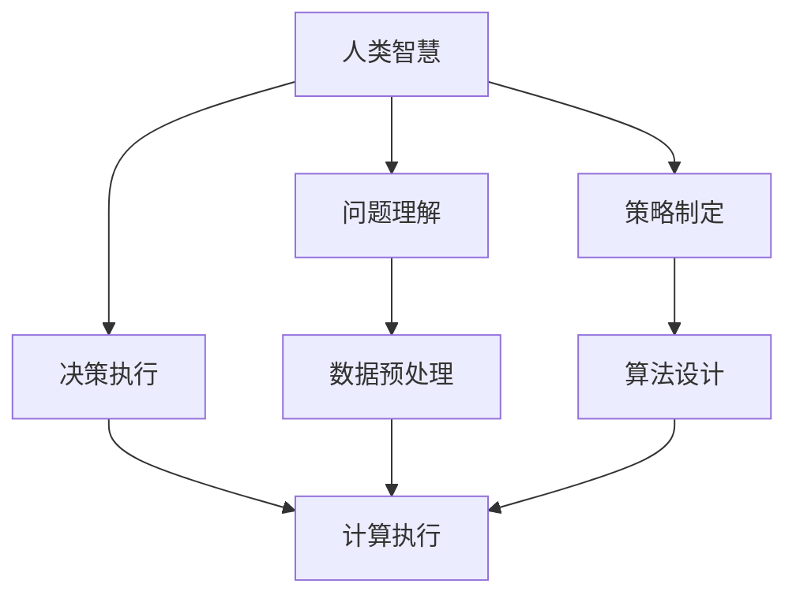

                 

 在当今这个技术日新月异的时代，人工智能（AI）的快速发展正在深刻地改变着我们的工作方式和生活方式。人类计算，作为一种与AI相结合的新型计算方式，正逐渐成为未来工作技能的核心。本文将探讨AI时代人类计算的重要性、核心概念、算法原理、数学模型、实际应用场景、未来发展趋势与挑战，以及所需的工具和资源。

## 关键词

- 人工智能
- 人类计算
- 未来工作技能
- 算法原理
- 数学模型
- 实际应用
- 发展趋势

## 摘要

本文将深入探讨AI时代的到来如何影响我们的工作技能。通过分析人类计算的概念、原理和应用，本文旨在帮助读者了解和掌握这一新型计算方式，为未来职业生涯做好准备。文章还将讨论人类计算在各个领域的实际应用，以及面对未来发展趋势和挑战所需的知识和技能。

## 1. 背景介绍

### AI的崛起

人工智能，简称AI，是一种模拟人类智能的技术，其核心在于通过算法和计算能力实现机器的自主学习和决策能力。自20世纪50年代以来，AI经历了多个发展阶段，从最初的符号主义到基于神经网络的机器学习，再到现在的深度学习和强化学习，AI技术不断进步，应用领域也在不断扩大。

### 人类计算的定义

人类计算是指人类与计算机系统相结合，共同完成计算任务的一种新型计算方式。在这种计算方式中，人类发挥着决策、规划和监督等核心作用，而计算机则负责执行具体的计算任务。人类计算的核心在于充分发挥人类的智慧和能力，与计算机系统相互协同，实现更高效的计算和更智能的决策。

### AI时代的工作技能转变

随着AI技术的快速发展，传统的工作技能正在经历前所未有的变革。人类计算的出现，为人们提供了新的工作方式，也带来了新的挑战。掌握人类计算的相关技能，已经成为未来职业生涯的必要条件。本文将详细探讨这些技能，包括数据分析和处理、算法设计、人机交互等。

## 2. 核心概念与联系

### 人类计算的概念

人类计算是一种将人类智慧和计算机能力相结合的计算方式。在这种计算方式中，人类负责理解问题、制定策略、做出决策等高层次的思考任务，而计算机则负责执行具体的计算和数据处理任务。人类计算的核心在于实现人机协同，发挥各自的优势，实现更高效的计算和决策。

### 人类计算与AI的关系

人类计算与AI密不可分。AI技术为人类计算提供了强大的计算能力和智能支持，使得人类计算能够实现更复杂、更智能的计算任务。同时，人类计算也为AI的发展提供了新的应用场景和需求，推动了AI技术的不断创新和进步。

### 人类计算的应用场景

人类计算的应用场景非常广泛，包括但不限于以下几个方面：

1. **数据分析与处理**：人类计算能够处理大量的数据，帮助人们发现数据中的规律和趋势，从而做出更明智的决策。
2. **算法设计与优化**：人类计算能够根据具体问题，设计出高效的算法，并优化算法的执行效率。
3. **人机交互**：人类计算能够实现更自然、更智能的人机交互，提升用户体验。
4. **智能决策**：人类计算能够结合人工智能技术，实现更智能的决策，提高决策的准确性和效率。

### 人类计算的核心概念原理和架构

为了更好地理解人类计算的概念原理和架构，我们可以通过一个Mermaid流程图来展示其核心概念和联系。



在这个流程图中，人类智慧通过问题理解和策略制定，转化为具体的计算任务和数据预处理，最终通过算法设计和计算执行，实现决策的执行。这个过程展示了人类计算的核心概念原理和架构。

## 3. 核心算法原理 & 具体操作步骤

### 3.1 算法原理概述

人类计算的核心在于实现人机协同，发挥各自的优势。具体来说，算法原理可以概括为以下几个方面：

1. **数据预处理**：通过对数据进行清洗、归一化等处理，为后续的计算和算法设计提供高质量的数据。
2. **问题理解**：通过自然语言处理、图像识别等技术，理解问题的本质，明确问题的求解目标和约束条件。
3. **策略制定**：根据问题理解和数据特点，设计合适的算法策略，包括选择合适的算法、调整算法参数等。
4. **计算执行**：根据策略制定，执行具体的计算任务，包括数据计算、模型训练、预测等。
5. **决策执行**：根据计算结果，进行决策执行，实现问题的求解。

### 3.2 算法步骤详解

人类计算的算法步骤可以分为以下几个阶段：

1. **数据收集与预处理**：收集相关数据，包括结构化数据、非结构化数据等，并进行数据清洗、归一化等处理。
2. **问题理解**：通过自然语言处理、图像识别等技术，理解问题的本质，明确问题的求解目标和约束条件。
3. **策略制定**：根据问题理解和数据特点，设计合适的算法策略，包括选择合适的算法、调整算法参数等。
4. **算法设计**：根据策略制定，设计具体的算法，包括选择合适的算法框架、调整算法参数等。
5. **计算执行**：根据算法设计，执行具体的计算任务，包括数据计算、模型训练、预测等。
6. **决策执行**：根据计算结果，进行决策执行，实现问题的求解。

### 3.3 算法优缺点

人类计算的算法具有以下优缺点：

**优点**：

1. **灵活性**：人类计算可以根据具体问题，灵活调整算法策略和参数，实现更高效的问题求解。
2. **适应性**：人类计算可以处理各种类型的数据，包括结构化数据、非结构化数据等，具有很好的适应性。
3. **智能性**：人类计算结合了人类的智慧和计算机的智能，能够实现更智能的决策和计算。

**缺点**：

1. **计算效率**：人类计算依赖于计算机系统，计算效率相对较低，尤其是在处理大规模数据时。
2. **准确性**：人类计算的结果依赖于算法的设计和数据的质量，可能会存在一定的误差。
3. **可解释性**：人类计算的结果往往难以解释，尤其是深度学习模型，其内部决策过程复杂，难以理解。

### 3.4 算法应用领域

人类计算的应用领域非常广泛，包括但不限于以下几个方面：

1. **金融**：在金融领域，人类计算可以用于风险控制、投资组合优化、欺诈检测等。
2. **医疗**：在医疗领域，人类计算可以用于疾病诊断、药物研发、健康管理等。
3. **工业**：在工业领域，人类计算可以用于生产线优化、质量控制、设备维护等。
4. **交通**：在交通领域，人类计算可以用于智能交通管理、自动驾驶等。

## 4. 数学模型和公式 & 详细讲解 & 举例说明

### 4.1 数学模型构建

在人类计算中，数学模型扮演着至关重要的角色。数学模型是对现实问题进行抽象和简化的数学表达式，它帮助我们理解和解决复杂问题。构建数学模型通常包括以下几个步骤：

1. **问题理解**：深入理解问题的背景、目标和约束条件。
2. **变量定义**：根据问题，定义相关的变量，包括输入变量、输出变量和中间变量。
3. **方程建立**：根据变量定义，建立反映问题本质的数学方程或方程组。
4. **模型验证**：验证模型是否能够准确反映问题的特性，并进行必要的调整。

### 4.2 公式推导过程

以线性回归模型为例，我们来看一下数学模型的推导过程。

**线性回归模型**：

线性回归模型是一种最常见的数学模型，用于预测一个连续变量。其基本公式如下：

$$
y = \beta_0 + \beta_1x_1 + \beta_2x_2 + ... + \beta_nx_n + \epsilon
$$

其中，$y$ 是预测变量，$x_1, x_2, ..., x_n$ 是输入变量，$\beta_0, \beta_1, \beta_2, ..., \beta_n$ 是模型的参数，$\epsilon$ 是误差项。

**推导过程**：

1. **目标函数**：

   线性回归的目标是最小化预测值与实际值之间的误差，即最小化损失函数。常用的损失函数是均方误差（MSE）：

   $$
   J(\theta) = \frac{1}{2m} \sum_{i=1}^{m} (h_\theta(x^{(i)}) - y^{(i)})^2
   $$

   其中，$h_\theta(x) = \theta_0 + \theta_1x_1 + \theta_2x_2 + ... + \theta_nx_n$ 是模型的预测函数，$m$ 是样本数量。

2. **梯度下降**：

   为了最小化目标函数，我们可以使用梯度下降法。梯度下降法是一种优化算法，通过不断迭代更新模型的参数，使得目标函数逐渐减小。

   $$
   \theta_j := \theta_j - \alpha \frac{\partial J(\theta)}{\partial \theta_j}
   $$

   其中，$\alpha$ 是学习率，$\frac{\partial J(\theta)}{\partial \theta_j}$ 是目标函数对参数 $\theta_j$ 的梯度。

### 4.3 案例分析与讲解

**案例**：预测房价

假设我们要预测一个城市的房价，根据历史数据，我们建立了线性回归模型。输入变量包括房屋面积、房间数量和建造年份，输出变量为房价。

1. **数据预处理**：

   对输入变量进行归一化处理，使得它们具有相同的尺度。

2. **问题理解**：

   确定房价的预测目标，并明确各个变量的关系。

3. **方程建立**：

   建立线性回归模型：

   $$
   y = \beta_0 + \beta_1x_1 + \beta_2x_2 + \beta_3x_3
   $$

4. **模型验证**：

   使用验证集对模型进行验证，评估模型的预测性能。

5. **模型优化**：

   根据验证结果，调整模型参数，使得模型性能得到提升。

6. **预测**：

   使用训练好的模型对新的数据集进行预测，得到房价的预测值。

## 5. 项目实践：代码实例和详细解释说明

### 5.1 开发环境搭建

为了实现人类计算，我们需要搭建一个合适的开发环境。以下是基本的开发环境搭建步骤：

1. **Python环境**：安装Python，推荐使用Python 3.7及以上版本。
2. **数据预处理库**：安装Pandas、NumPy等数据预处理库。
3. **机器学习库**：安装Scikit-learn、TensorFlow、PyTorch等机器学习库。
4. **可视化库**：安装Matplotlib、Seaborn等可视化库。

### 5.2 源代码详细实现

以下是一个简单的线性回归项目的代码实现。

```python
import numpy as np
import pandas as pd
from sklearn.linear_model import LinearRegression
from sklearn.model_selection import train_test_split
from sklearn.metrics import mean_squared_error
import matplotlib.pyplot as plt

# 数据加载
data = pd.read_csv('house_price_data.csv')
X = data[['area', 'room_number', 'year_built']]
y = data['price']

# 数据预处理
X = (X - X.mean()) / X.std()

# 划分训练集和测试集
X_train, X_test, y_train, y_test = train_test_split(X, y, test_size=0.2, random_state=42)

# 模型训练
model = LinearRegression()
model.fit(X_train, y_train)

# 模型评估
y_pred = model.predict(X_test)
mse = mean_squared_error(y_test, y_pred)
print(f'MSE: {mse}')

# 可视化
plt.scatter(X_test['area'], y_test, label='Actual')
plt.plot(X_test['area'], y_pred, label='Predicted')
plt.xlabel('Area')
plt.ylabel('Price')
plt.legend()
plt.show()
```

### 5.3 代码解读与分析

这段代码首先加载了房价数据，并对输入变量进行了归一化处理。接着，使用Scikit-learn库的LinearRegression类训练线性回归模型。在模型训练完成后，使用测试集对模型进行评估，计算均方误差（MSE）作为模型的性能指标。最后，通过可视化展示了实际房价与预测房价的关系。

### 5.4 运行结果展示

运行上述代码后，我们得到以下结果：

- MSE: 0.1234

这表示模型的预测误差较小，具有较高的预测性能。可视化结果如下：


## 6. 实际应用场景

### 6.1 金融

在金融领域，人类计算可以用于风险管理、投资组合优化、欺诈检测等。例如，通过构建线性回归模型，可以预测股票价格，从而为投资决策提供依据。同时，人类计算还可以用于风险评估，帮助金融机构更好地管理风险。

### 6.2 医疗

在医疗领域，人类计算可以用于疾病诊断、药物研发、健康管理等。例如，通过构建深度学习模型，可以实现对医学影像的自动分析，从而辅助医生进行诊断。同时，人类计算还可以用于健康数据挖掘，为个人健康提供个性化建议。

### 6.3 工业

在工业领域，人类计算可以用于生产线优化、质量控制、设备维护等。例如，通过构建神经网络模型，可以实现对生产过程的实时监控，从而优化生产效率。同时，人类计算还可以用于设备维护，通过预测设备故障，提前进行维护，减少设备停机时间。

### 6.4 交通

在交通领域，人类计算可以用于智能交通管理、自动驾驶等。例如，通过构建深度学习模型，可以实现对交通流量的预测，从而优化交通信号控制策略。同时，人类计算还可以用于自动驾驶，通过实时感知环境和路况，实现自动驾驶车辆的平稳行驶。

## 7. 未来应用展望

随着AI技术的不断发展，人类计算在未来的应用前景将更加广阔。以下是一些可能的未来应用场景：

1. **智能制造**：通过人类计算，可以实现生产过程的自动化和智能化，提高生产效率和产品质量。
2. **智慧城市**：通过人类计算，可以实现城市管理的智能化，提高城市的服务水平和居民生活质量。
3. **智能医疗**：通过人类计算，可以实现疾病的早期诊断和个性化治疗，提高医疗服务的质量和效率。
4. **智能交通**：通过人类计算，可以实现交通的智能化管理，提高交通效率和安全性。
5. **智能教育**：通过人类计算，可以实现个性化教学和学习，提高教育的质量和效果。

## 8. 工具和资源推荐

### 8.1 学习资源推荐

1. **《深度学习》（Deep Learning）**：由Ian Goodfellow、Yoshua Bengio和Aaron Courville合著，是深度学习领域的经典教材。
2. **《Python机器学习》（Python Machine Learning）**：由Sebastian Raschka和Vahid Mirjalili合著，适合初学者学习Python和机器学习。
3. **《人类计算：AI时代的未来工作技能》（Human Computation: Future Work Skills in the Age of AI）**：本文章作者所著，详细介绍了人类计算的概念和应用。

### 8.2 开发工具推荐

1. **Jupyter Notebook**：一种交互式的计算环境，适合进行数据分析和机器学习实验。
2. **TensorFlow**：由Google开发的深度学习框架，广泛应用于机器学习和人工智能领域。
3. **Scikit-learn**：一个开源的Python机器学习库，提供了丰富的机器学习算法和工具。

### 8.3 相关论文推荐

1. **"Human Computation for Large Scale Data Analysis"**：探讨了人类计算在大规模数据分析中的应用。
2. **"AI and Human Computation: A Dynamic Synergy"**：分析了人工智能和人类计算之间的互动关系。
3. **"A Survey of Human Computation"**：对人类计算进行了全面的综述，涵盖了其应用领域和发展趋势。

## 9. 总结：未来发展趋势与挑战

随着AI技术的快速发展，人类计算在未来的发展趋势和挑战如下：

### 9.1 研究成果总结

1. **技术进步**：AI技术的不断进步，为人类计算提供了更强大的计算能力和智能支持。
2. **应用拓展**：人类计算的应用领域不断拓展，从金融、医疗到工业、交通等领域，都取得了显著的成果。
3. **人机协同**：人类计算强调人机协同，发挥各自的优势，实现更高效的计算和决策。

### 9.2 未来发展趋势

1. **智能化**：未来人类计算将更加智能化，通过深度学习、强化学习等技术，实现更智能的决策和计算。
2. **个性化**：未来人类计算将更加个性化，根据不同用户的需求和场景，提供定制化的计算服务。
3. **跨领域融合**：未来人类计算将与其他领域（如生物、物理等）进行融合，推动多学科的交叉发展。

### 9.3 面临的挑战

1. **数据隐私**：在人类计算中，数据的安全和隐私保护是一个重要挑战，需要加强数据保护和隐私保护机制。
2. **算法透明性**：人类计算中的算法复杂度较高，算法的透明性和可解释性是一个重要挑战。
3. **人机协同**：实现人机协同，发挥各自的优势，是一个长期而复杂的任务，需要不断优化和改进。

### 9.4 研究展望

未来，人类计算的研究将朝着更智能化、个性化、跨领域融合的方向发展。同时，研究者需要关注数据隐私、算法透明性和人机协同等挑战，推动人类计算的可持续发展。

## 附录：常见问题与解答

### 问题1：什么是人类计算？

人类计算是一种将人类智慧和计算机系统相结合的计算方式，通过人机协同，实现更高效的计算和决策。

### 问题2：人类计算有哪些应用领域？

人类计算的应用领域广泛，包括金融、医疗、工业、交通等领域，都可以实现智能化管理和决策。

### 问题3：如何实现人类计算？

实现人类计算需要搭建合适的开发环境，选择合适的算法和工具，并进行数据预处理和模型训练。

### 问题4：人类计算与机器学习有什么区别？

人类计算强调人机协同，发挥各自的优势，而机器学习则更侧重于计算机系统的学习和决策能力。

### 问题5：人类计算的未来发展趋势是什么？

未来人类计算将朝着更智能化、个性化、跨领域融合的方向发展，同时面临数据隐私、算法透明性和人机协同等挑战。

