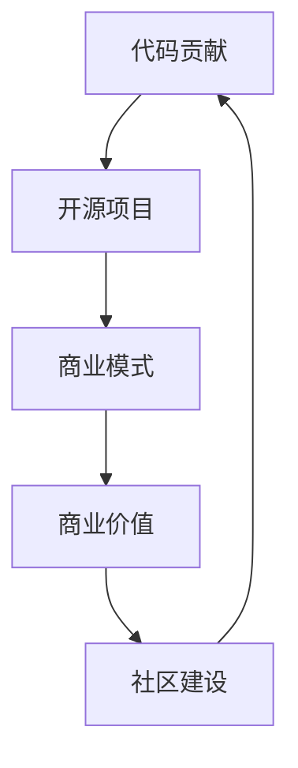

                 

关键词：代码贡献，开源项目，商业模式，商业价值，技术变现，生态系统，社区建设

> 摘要：本文将深入探讨从代码贡献到开源商业化的全过程。我们将分析开源项目的价值，讨论如何通过开源项目构建商业模式，实现技术变现，并探讨开源社区的构建与维护策略。文章还将展望未来开源领域的发展趋势与挑战，为读者提供实用指导。

## 1. 背景介绍

在当今的数字化时代，开源软件已经成为软件开发的一个重要组成部分。越来越多的开发者选择将他们的代码贡献给开源项目，这不仅有助于提高代码质量和促进技术交流，也为软件开发带来了新的商业模式。从代码贡献到开源商业化的过程，不仅需要技术能力，还需要商业洞察和战略规划。

开源项目的价值在于其开放性和共享性，这使得代码可以被更多的人使用和改进。然而，要实现从开源项目到商业化的转化，需要克服诸多挑战，包括如何保护知识产权、如何构建可持续的商业模式、如何吸引和维护社区成员等。

本文将围绕以下主题展开：

1. 开源项目的价值与商业潜力
2. 从代码贡献到商业化的路径
3. 开源商业模式的构建与实现
4. 开源社区的构建与维护
5. 未来开源领域的发展趋势与挑战

## 2. 核心概念与联系

### 2.1 开源项目的价值

开源项目不仅为开发者提供了学习和创新的平台，还具有以下核心价值：

- **共享与创新**：开源项目鼓励开发者共享代码，通过合作和协作实现技术的快速迭代和创新。
- **节省成本**：企业可以通过使用开源软件降低开发成本，将更多资源投入到核心业务开发中。
- **提高质量**：开源项目通常经过广泛的社区审查和测试，因此其质量往往更高。

### 2.2 商业模式的构建

构建开源商业模式的挑战在于如何将开源项目的价值转化为商业收益。以下是一些常见的开源商业模式：

- **订阅服务**：提供专业的技术支持、定制化服务和安全更新。
- **开源增值**：提供基于开源软件的商业版本，增加高级功能或服务。
- **广告赞助**：通过展示广告或赞助商信息来获得收入。
- **培训与咨询**：提供与开源项目相关的培训、认证和咨询服务。

### 2.3 社区的构建与维护

开源社区是开源项目成功的关键因素。一个健康、活跃的社区可以带来以下好处：

- **代码贡献**：社区成员可以贡献代码、测试和文档，提高项目质量。
- **技术支持**：社区成员可以相互帮助，提高项目用户的满意度。
- **品牌建设**：良好的社区形象有助于提高项目知名度和品牌价值。

### 2.4 Mermaid 流程图



## 3. 核心算法原理 & 具体操作步骤

### 3.1 算法原理概述

从代码贡献到开源商业化的过程可以视为一种“生态系统”的建设，其中包含以下关键步骤：

1. **代码贡献**：开发者通过提交代码、修复漏洞、编写文档等方式参与开源项目。
2. **项目维护**：维护者负责管理项目，确保代码库的健康和项目的持续发展。
3. **商业模式构建**：基于开源项目的特点，探索并构建合适的商业模式。
4. **商业化实施**：将商业模式付诸实践，实现商业收益。
5. **社区建设**：吸引和培养社区成员，促进社区活力和项目发展。

### 3.2 算法步骤详解

1. **代码贡献**：
   - **了解项目需求**：开发者首先需要了解开源项目的需求和现状。
   - **代码审查**：提交代码前，开发者应确保代码质量，遵循项目规范。
   - **代码提交**：通过Pull Request等机制，将代码提交给项目维护者。

2. **项目维护**：
   - **持续集成**：确保项目在每次提交后都能正常运行。
   - **代码审查**：维护者应仔细审查提交的代码，确保其质量。
   - **更新文档**：及时更新项目文档，帮助用户更好地理解和使用项目。

3. **商业模式构建**：
   - **市场调研**：分析市场需求，了解潜在的商业机会。
   - **商业模式设计**：基于市场调研结果，设计合适的商业模式。
   - **商业模式验证**：通过试点项目或市场测试，验证商业模式的可行性。

4. **商业化实施**：
   - **产品发布**：将基于开源项目的商业产品推向市场。
   - **销售与营销**：制定销售策略，开展市场推广活动。
   - **客户服务**：提供高质量的技术支持和售后服务。

5. **社区建设**：
   - **建立社区**：创建论坛、社交媒体群组等，为社区成员提供交流平台。
   - **激励机制**：通过奖励、荣誉等方式激励社区成员参与项目。
   - **持续互动**：定期举办活动，维护社区活力。

### 3.3 算法优缺点

- **优点**：
  - 提高代码质量：通过社区审查和协作，提高代码的可维护性和可靠性。
  - 促进技术交流：开源项目为开发者提供了学习和分享的平台。
  - 降低开发成本：企业可以利用开源项目，节省开发成本。
- **缺点**：
  - 知识产权保护：开源项目可能面临知识产权纠纷的风险。
  - 维护成本：项目维护需要投入大量时间和精力。
  - 商业化难度：从开源项目到商业化的转化可能面临挑战。

### 3.4 算法应用领域

- **软件开发**：开源项目在软件开发中具有广泛的应用，例如操作系统、Web 应用程序等。
- **人工智能**：开源项目在人工智能领域发挥着重要作用，为研究人员和开发者提供了丰富的工具和资源。
- **云计算**：开源项目在云计算领域提供了丰富的解决方案，如容器技术、分布式存储等。

## 4. 数学模型和公式 & 详细讲解 & 举例说明

### 4.1 数学模型构建

在构建开源商业模型时，我们可以使用以下数学模型：

- **ROI 模型**：投资回报率（ROI）模型用于评估开源项目的商业可行性。
- **CAC 模型**：客户获取成本（CAC）模型用于计算吸引新客户的成本。
- **LTV 模型**：客户生命周期价值（LTV）模型用于预测客户为公司带来的总收益。

### 4.2 公式推导过程

- **ROI 模型**：

$$ ROI = \frac{净利润}{投资成本} $$

- **CAC 模型**：

$$ CAC = \frac{总营销费用}{新客户数量} $$

- **LTV 模型**：

$$ LTV = \frac{平均订单价值 \times 客户平均购买次数}{客户获取成本} $$

### 4.3 案例分析与讲解

假设一家公司开发了一个开源项目，并希望通过商业模式实现商业化。以下是一个简单的案例分析：

1. **ROI 模型**：

   - 投资成本：$100,000
   - 净利润：$200,000
   - ROI = $200,000 / $100,000 = 2

   该项目的ROI为2，表示每投资1美元，可以获得2美元的回报。

2. **CAC 模型**：

   - 总营销费用：$50,000
   - 新客户数量：50
   - CAC = $50,000 / 50 = $1,000

   该公司的客户获取成本为$1,000。

3. **LTV 模型**：

   - 平均订单价值：$100
   - 客户平均购买次数：2
   - 客户获取成本：$1,000
   - LTV = ($100 \times 2) / $1,000 = 0.2

   该公司的客户生命周期价值为0.2。

通过这些公式，公司可以评估开源项目的商业可行性，并制定相应的商业策略。

## 5. 项目实践：代码实例和详细解释说明

### 5.1 开发环境搭建

要参与开源项目，首先需要搭建一个合适的开发环境。以下是一个简单的步骤：

1. **安装Git**：Git是开源项目的版本控制系统，用于代码的提交、拉取和分支管理等。
2. **创建GitHub账户**：GitHub是当前最流行的开源项目托管平台。
3. **克隆项目仓库**：使用Git命令将开源项目的代码克隆到本地计算机。

### 5.2 源代码详细实现

以下是一个简单的代码示例，用于说明如何向开源项目贡献代码：

```python
# example.py
def calculate_area(radius):
    return 3.14 * radius * radius

if __name__ == "__main__":
    radius = float(input("请输入圆的半径："))
    print("圆的面积是：", calculate_area(radius))
```

1. **代码审查**：在提交代码前，应确保代码符合项目规范，例如代码风格、注释和错误处理等。
2. **提交代码**：使用Git命令将代码提交到本地仓库，并创建一个Pull Request。

### 5.3 代码解读与分析

这段代码实现了一个计算圆面积的函数，并通过输入半径来计算和打印面积。以下是对代码的解读和分析：

- **函数定义**：`calculate_area` 函数接收一个`radius`参数，计算并返回圆的面积。
- **主程序**：主程序通过`input`函数获取用户输入的半径，并调用`calculate_area`函数计算面积，最后打印结果。

### 5.4 运行结果展示

当用户输入半径为5时，程序的输出结果为：

```
请输入圆的半径：5
圆的面积是：78.5
```

这表明程序成功计算并输出了圆的面积。

## 6. 实际应用场景

### 6.1 企业级应用

企业可以通过开源项目来降低开发成本、提高开发效率。例如，一家软件公司可以基于开源的框架和库来构建企业级应用，从而节省大量的研发成本。

### 6.2 创业公司

创业公司可以利用开源项目来吸引人才和投资者。一个成功的开源项目可以为公司带来良好的口碑和品牌价值，从而提高创业的成功率。

### 6.3 研究机构

研究机构可以通过开源项目来分享研究成果和促进学术交流。开源项目提供了一个平台，使研究人员可以共享代码和数据，从而加速研究进展。

### 6.4 教育与培训

开源项目在教育领域具有广泛的应用。教师和学生可以通过参与开源项目来学习编程、团队合作和项目管理等技能。

## 7. 工具和资源推荐

### 7.1 学习资源推荐

- 《Git权威指南》
- 《GitHub入门到实战》
- 《开源软件项目管理》

### 7.2 开发工具推荐

- Visual Studio Code
- GitKraken
- Jupyter Notebook

### 7.3 相关论文推荐

- "The Business of Open Source" by Steve Chicken
- "Open Core Licensing Model" by Dave Neary
- "Building a Successful Open Source Business" by Red Hat

## 8. 总结：未来发展趋势与挑战

### 8.1 研究成果总结

本文从多个角度探讨了从代码贡献到开源商业化的全过程，分析了开源项目的价值、商业模式的构建、社区的建设与维护，以及开源项目在实际应用场景中的表现。

### 8.2 未来发展趋势

- 开源项目将继续在全球范围内得到广泛应用，成为软件开发的重要组成部分。
- 开源商业模式将不断创新，为企业带来更多的商业机会。
- 开源社区将变得更加活跃，成为技术创新的重要推动力量。

### 8.3 面临的挑战

- 知识产权保护：如何平衡开源项目的共享性和知识产权保护是一个挑战。
- 商业化难度：从开源项目到商业化的转化可能面临诸多挑战，如市场竞争、客户获取等。
- 社区管理：如何吸引和维护社区成员，确保社区的健康和活力，是一个重要课题。

### 8.4 研究展望

未来的研究可以关注以下几个方面：

- 开源商业模式的研究：探索新的开源商业模式，提高开源项目的商业可行性。
- 开源社区的构建与维护：研究如何更好地吸引和维护社区成员，提高社区活力。
- 开源技术在特定领域的应用：如人工智能、物联网等，研究开源技术在这些领域的应用前景。

## 9. 附录：常见问题与解答

### 9.1 问题1：如何选择合适的开源项目进行贡献？

**解答**：选择合适的开源项目进行贡献时，可以从以下几个方面考虑：

- **项目活跃度**：查看项目的更新频率和贡献者数量，选择活跃的项目。
- **项目需求**：了解项目的需求，确保你的贡献能够解决实际问题。
- **项目文化**：了解项目的社区文化，确保你的价值观与项目相符。

### 9.2 问题2：如何从开源项目中获得商业机会？

**解答**：从开源项目中获得商业机会可以采取以下策略：

- **提供专业服务**：如技术支持、定制化开发等。
- **开发商业版本**：提供基于开源软件的商业版本，增加高级功能或服务。
- **广告赞助**：通过与项目合作，展示广告或赞助商信息。

### 9.3 问题3：如何维护开源社区？

**解答**：维护开源社区可以从以下几个方面入手：

- **积极沟通**：定期与社区成员互动，解答问题，收集反馈。
- **激励机制**：通过奖励、荣誉等方式激励社区成员参与项目。
- **组织活动**：举办线上或线下的活动，增强社区凝聚力。

---

以上是《从代码贡献到开源商业化之路》的完整内容。希望本文能为读者提供关于开源项目、商业模式和社区建设等方面的有益见解和实用指导。作者：禅与计算机程序设计艺术 / Zen and the Art of Computer Programming。

