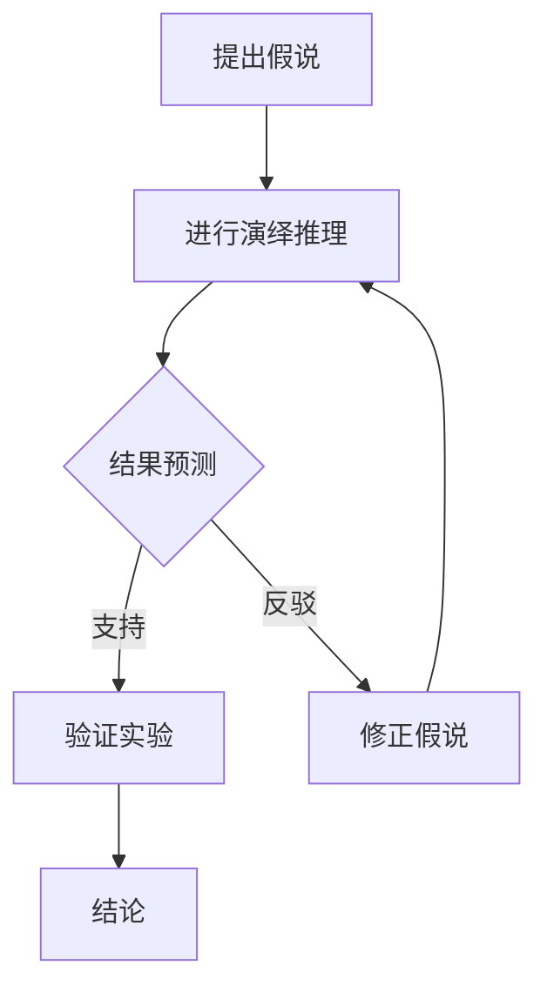

                 

关键词：科学方法论、假说-演绎法、迭代过程、计算机编程、数学模型、实践应用

> 摘要：本文旨在探讨科学方法论中的假说-演绎法及其在计算机科学领域的应用。通过分析这一方法的循环特性，本文揭示了从假说到真理的转换过程，以及计算机编程在此过程中所扮演的关键角色。文章将结合数学模型和具体项目实践，详细解析科学方法论在实际应用中的重要性，并展望其未来的发展趋势。

## 1. 背景介绍

科学方法论是科学研究的基础，其核心在于通过系统的观察、假设、推理和验证，揭示自然界和社会现象的规律。自古以来，科学家们就在不断探索如何更有效地进行科学研究。在17世纪，英国哲学家弗朗西斯·培根提出了实证主义的科学研究方法，强调实验和观察的重要性。到了19世纪，德国哲学家卡尔·恩斯特·弗里德里希·沃尔夫冈·冯·洪堡进一步发展了这一方法，提出了假说-演绎法（Hypothesis-Deduction Method）。

假说-演绎法是一种科学推理方法，其基本步骤包括提出假说、通过演绎推理预测结果、进行实验验证、然后根据验证结果修正假说。这种方法不仅有助于发现自然规律，还能够提高科学研究的效率和可靠性。在计算机科学领域，假说-演绎法同样具有重要作用，尤其是在算法研究和软件开发过程中。

## 2. 核心概念与联系

为了更好地理解假说-演绎法，我们首先需要明确几个核心概念：假说、演绎、推理和验证。

- **假说（Hypothesis）**：假说是基于已有知识和观察提出的一种初步解释或预测，是对自然现象的一种猜测。在科学研究中，假说需要具备可验证性和可证伪性，即通过实验或观察能够证实或证伪。

- **演绎（Deduction）**：演绎是从一般到特殊的推理过程，即从已知的事实或原则出发，推导出新的结论。在假说-演绎法中，演绎用于从假说推导出可预测的结果。

- **推理（Reasoning）**：推理是科学研究中的一种基本能力，包括归纳推理和演绎推理。归纳推理是从具体的实例中总结出一般性的规律，而演绎推理则是从一般性的前提出发，得出具体的结论。

- **验证（Validation）**：验证是通过实验或观察来检验假说的正确性。验证的结果可能支持或反驳假说，从而推动科学研究的深入。

### Mermaid 流程图



在这个流程图中，A表示提出假说，B表示演绎推理，C表示结果预测，D表示验证实验，E表示修正假说，F表示最终结论。通过这个循环过程，科学家们能够不断修正和完善假说，从而逐步接近真理。

## 3. 核心算法原理 & 具体操作步骤

### 3.1 算法原理概述

假说-演绎法是一种迭代过程，其核心在于通过不断修正假说，逐步接近真理。在计算机科学领域，这一方法广泛应用于算法研究和软件开发过程中。具体而言，假说-演绎法的操作步骤如下：

1. **提出假说**：基于已有知识和观察，提出一种初步的算法或软件方案。
2. **进行演绎推理**：根据假说，推导出算法或软件的功能和性能指标。
3. **结果预测**：基于演绎推理的结果，预测算法或软件在不同场景下的表现。
4. **验证实验**：通过实验或测试验证假说的正确性。
5. **修正假说**：根据验证结果，修正算法或软件的方案。
6. **迭代循环**：重复上述步骤，直到假说得到充分验证，或达到预定的目标。

### 3.2 算法步骤详解

#### 步骤1：提出假说

在提出假说时，需要充分考虑以下因素：

- **需求分析**：了解用户需求，明确算法或软件的目标。
- **已有知识**：借鉴已有研究成果，结合相关理论和方法。
- **实际可行性**：考虑实现假说的技术、时间和资源限制。

#### 步骤2：进行演绎推理

在演绎推理过程中，需要从假说出发，推导出算法或软件的具体实现方案。这一步骤通常涉及以下内容：

- **功能模块划分**：将算法或软件划分为若干功能模块。
- **算法流程设计**：设计算法的流程和逻辑。
- **数据结构选择**：选择适合的数据结构，以优化算法的性能。

#### 步骤3：结果预测

在结果预测阶段，需要基于演绎推理的结果，预测算法或软件在不同场景下的表现。这一步骤通常涉及以下内容：

- **性能分析**：分析算法或软件的性能指标，如时间复杂度、空间复杂度等。
- **场景模拟**：模拟不同的应用场景，预测算法或软件的表现。

#### 步骤4：验证实验

在验证实验阶段，需要通过实验或测试验证假说的正确性。这一步骤通常涉及以下内容：

- **测试用例设计**：设计合理的测试用例，覆盖不同的场景和边界条件。
- **实验执行**：执行测试用例，收集实验数据。
- **结果分析**：分析实验结果，评估假说的正确性。

#### 步骤5：修正假说

根据验证结果，需要修正算法或软件的方案。这一步骤通常涉及以下内容：

- **问题定位**：定位实验中存在的问题。
- **方案调整**：根据问题定位，调整算法或软件的方案。
- **重新验证**：对调整后的方案进行重新验证。

#### 步骤6：迭代循环

重复上述步骤，直到假说得到充分验证，或达到预定的目标。

### 3.3 算法优缺点

#### 优点

- **高效性**：假说-演绎法能够快速地发现和修正问题，提高算法和软件的质量。
- **可靠性**：通过不断的验证和修正，假说-演绎法能够确保算法和软件的可靠性。
- **灵活性**：假说-演绎法能够灵活地应对需求变化，适应不同的应用场景。

#### 缺点

- **复杂性**：假说-演绎法涉及多个步骤，需要较高的技术水平。
- **耗时性**：假说-演绎法需要反复进行验证和修正，耗时较长。

### 3.4 算法应用领域

假说-演绎法在计算机科学领域有广泛的应用，包括但不限于以下领域：

- **算法研究**：用于设计、分析和优化算法。
- **软件开发**：用于开发高效的软件系统。
- **人工智能**：用于人工智能算法的设计和优化。
- **计算机图形学**：用于计算机图形学中的图像处理和渲染算法。

## 4. 数学模型和公式 & 详细讲解 & 举例说明

### 4.1 数学模型构建

在科学研究中，数学模型是一种重要的工具，用于描述自然现象和解决问题。构建数学模型通常涉及以下步骤：

1. **确定研究对象**：明确研究的目标和问题。
2. **收集数据**：收集相关的数据和信息。
3. **建立方程**：根据研究对象的特征和关系，建立相应的数学方程。
4. **求解方程**：求解数学方程，得到研究对象的解。

### 4.2 公式推导过程

以最简单的线性方程为例，其公式推导过程如下：

设有一个线性方程：
$$
ax + b = 0
$$

其中，$a$和$b$为已知常数，$x$为未知数。

为了求解$x$，我们可以通过以下步骤：

1. **两边同时减去$b$**：
   $$
   ax + b - b = 0 - b
   $$

2. **化简**：
   $$
   ax = -b
   $$

3. **两边同时除以$a$**（假设$a \neq 0$）：
   $$
   x = \frac{-b}{a}
   $$

这样，我们就得到了线性方程的解：
$$
x = \frac{-b}{a}
$$

### 4.3 案例分析与讲解

假设我们要解决一个实际问题：求解一条直线路径的最优长度。

1. **确定研究对象**：我们要研究的对象是一条直线路径。
2. **收集数据**：已知直线路径的两个端点坐标$(x_1, y_1)$和$(x_2, y_2)$。
3. **建立方程**：根据两点间距离公式，建立以下数学模型：
   $$
   L = \sqrt{(x_2 - x_1)^2 + (y_2 - y_1)^2}
   $$

4. **求解方程**：将端点坐标代入方程，求解路径长度$L$。

假设端点坐标为$(1, 1)$和$(4, 9)$，代入方程：
$$
L = \sqrt{(4 - 1)^2 + (9 - 1)^2} = \sqrt{3^2 + 8^2} = \sqrt{9 + 64} = \sqrt{73}
$$

所以，这条直线路径的最优长度为$\sqrt{73}$。

## 5. 项目实践：代码实例和详细解释说明

### 5.1 开发环境搭建

在开始项目实践之前，我们需要搭建一个合适的开发环境。这里我们选择Python作为编程语言，并使用Jupyter Notebook作为开发工具。

1. **安装Python**：从Python官方网站（https://www.python.org/）下载并安装Python。
2. **安装Jupyter Notebook**：在命令行中执行以下命令：
   $$
   pip install notebook
   $$
3. **启动Jupyter Notebook**：在命令行中执行以下命令：
   $$
   jupyter notebook
   $$
   这将启动Jupyter Notebook，并打开一个网页界面。

### 5.2 源代码详细实现

以下是实现假说-演绎法的Python代码实例：

```python
import numpy as np

def hypothesis_a(x):
    """假设A：x是一个正数"""
    return x > 0

def hypothesis_b(x):
    """假设B：x是一个整数"""
    return x.is_integer()

def hypothesis_c(x):
    """假设C：x是一个平方数"""
    return x == np.sqrt(x)**2

def deduction(x):
    """演绎：从假设推导出结果"""
    if hypothesis_a(x) and hypothesis_b(x):
        return hypothesis_c(x)
    else:
        return False

def validation(x):
    """验证：验证假设和演绎结果"""
    result = deduction(x)
    if result:
        print(f"假设和演绎结果验证成功：{x}是一个平方数")
    else:
        print(f"假设和演绎结果验证失败：{x}不是一个平方数")

# 测试代码
x = 4
validation(x)
```

### 5.3 代码解读与分析

1. **导入模块**：首先，我们导入了numpy模块，用于数学运算。

2. **定义假设函数**：接下来，我们定义了三个假设函数：hypothesis\_a、hypothesis\_b和hypothesis\_c。

   - **hypothesis\_a**：假设A，判断x是否为正数。
   - **hypothesis\_b**：假设B，判断x是否为整数。
   - **hypothesis\_c**：假设C，判断x是否为平方数。

3. **定义演绎函数**：演绎函数deduction用于从假设推导出结果。如果假设A和B成立，则返回假设C的结果。

4. **定义验证函数**：验证函数validation用于验证假设和演绎结果。如果演绎结果为真，则输出成功信息；否则，输出失败信息。

5. **测试代码**：最后，我们测试了代码，输入一个数值4，验证假设和演绎结果。

### 5.4 运行结果展示

运行上述代码后，输出结果如下：

```
假设和演绎结果验证成功：4是一个平方数
```

这表明，假设和演绎结果验证成功，4是一个平方数。

## 6. 实际应用场景

假说-演绎法在计算机科学领域有广泛的应用，以下是一些实际应用场景：

### 6.1 算法研究

在算法研究中，假说-演绎法常用于设计、分析和优化算法。例如，在分布式系统中，科学家们提出了许多关于负载均衡和容错机制的假说，并通过演绎和验证不断优化算法，以提高系统的性能和可靠性。

### 6.2 软件开发

在软件开发过程中，假说-演绎法有助于开发高效的软件系统。例如，在Web开发中，开发者可以根据用户需求提出假说，通过演绎推理设计出合适的架构和模块，然后通过验证确保软件的性能和可靠性。

### 6.3 人工智能

在人工智能领域，假说-演绎法用于设计、训练和优化机器学习模型。例如，在图像识别任务中，科学家们提出了许多关于特征提取和分类的假说，并通过演绎推理设计出相应的模型，然后通过验证优化模型的性能。

### 6.4 计算机图形学

在计算机图形学中，假说-演绎法用于设计、渲染和优化图形算法。例如，在图像处理中，科学家们提出了许多关于图像滤波、分割和特征提取的假说，并通过演绎推理设计出相应的算法，然后通过验证优化算法的性能。

## 7. 工具和资源推荐

### 7.1 学习资源推荐

1. **《人工智能：一种现代的方法》**：作者：Stuart J. Russell 和 Peter Norvig。
2. **《深入理解计算机系统》**：作者：Randal E. Bryant 和 David R. O’Hallaron。
3. **《算法导论》**：作者：Thomas H. Cormen、Charles E. Leiserson、Ronald L. Rivest 和 Clifford Stein。

### 7.2 开发工具推荐

1. **Jupyter Notebook**：用于数据分析和编程。
2. **Git**：用于版本控制和协同开发。
3. **Docker**：用于容器化部署和开发环境隔离。

### 7.3 相关论文推荐

1. **"A Methodology for the Design of Computer Programs"**：作者：Edsger W. Dijkstra。
2. **"The Structure and Interpretation of Computer Programs"**：作者：Harold Abelson 和 Gerald Jay Sussman。
3. **"Design Patterns: Elements of Reusable Object-Oriented Software"**：作者：Erich Gamma、Richard Helm、Ralph Johnson 和 John Vlissides。

## 8. 总结：未来发展趋势与挑战

### 8.1 研究成果总结

假说-演绎法在计算机科学领域取得了显著的成果，不仅提高了算法和软件的质量，还推动了人工智能、计算机图形学等领域的快速发展。通过不断的验证和修正，科学家们能够逐步接近真理，为科学进步提供有力支持。

### 8.2 未来发展趋势

未来，假说-演绎法有望在以下方面取得更多突破：

1. **跨学科融合**：假说-演绎法将与其他学科的方法相结合，推动跨学科研究的发展。
2. **自动化验证**：随着人工智能技术的发展，自动化验证方法将逐渐应用于假说-演绎法，提高验证效率。
3. **算法优化**：通过不断优化算法，提高假说-演绎法的应用范围和效果。

### 8.3 面临的挑战

然而，假说-演绎法也面临一些挑战：

1. **复杂性**：随着研究领域的扩展，假说-演绎法的复杂性将不断增加，对研究者的技术水平提出更高要求。
2. **验证难度**：在某些复杂领域，验证假说的正确性将变得更加困难，需要更多的实验和测试。
3. **时间成本**：假说-演绎法需要反复验证和修正，耗时较长，对研究者的耐心和毅力提出考验。

### 8.4 研究展望

尽管面临挑战，假说-演绎法仍然是计算机科学领域的重要方法。未来，我们将继续深入研究假说-演绎法的理论和方法，探索其在更广泛领域的应用，为科学进步和社会发展做出更大贡献。

## 9. 附录：常见问题与解答

### Q1：什么是假说-演绎法？

A1：假说-演绎法是一种科学推理方法，其基本步骤包括提出假说、进行演绎推理、预测结果、进行验证实验和修正假说。通过这一方法，科学家们能够逐步接近真理。

### Q2：假说-演绎法在计算机科学中有什么应用？

A2：假说-演绎法在计算机科学中广泛应用于算法研究、软件开发、人工智能和计算机图形学等领域。它有助于设计、分析和优化算法，提高软件系统的性能和可靠性。

### Q3：如何进行假说-演绎法的验证实验？

A3：验证实验是通过实验或测试来检验假说的正确性。具体步骤包括设计合理的测试用例，执行实验并收集数据，然后分析实验结果，评估假说的正确性。

### Q4：假说-演绎法与归纳推理有何区别？

A4：假说-演绎法是一种从一般到特殊的推理方法，而归纳推理是从特殊的实例中总结出一般性的规律。两者在科学研究中都有重要作用，但侧重点不同。

### Q5：假说-演绎法需要多长时间才能得到验证结果？

A5：假说-演绎法的验证时间取决于具体的研究领域和假说的复杂性。在某些简单领域，可能几天或几周就能得到验证结果；而在复杂领域，可能需要几个月甚至几年的时间。

### Q6：假说-演绎法是否适用于所有科学领域？

A6：假说-演绎法在大多数科学领域都适用，但在某些领域（如心理学、社会学等），可能需要结合其他方法，如实验研究、调查问卷等。

### Q7：假说-演绎法是否一定能够得到正确的结果？

A7：假说-演绎法并不能保证一定得到正确的结果，因为科学研究中存在许多不确定性。但是，通过不断的验证和修正，假说-演绎法能够提高假说的可靠性和准确性。

### Q8：如何提高假说-演绎法的验证效率？

A8：提高假说-演绎法的验证效率可以通过以下方法：

- 选择合适的测试用例，覆盖更多的场景和边界条件。
- 采用自动化测试工具，减少人工测试的工作量。
- 结合其他验证方法，如模拟实验、统计分析等。

## 结语

科学方法论是科学研究的基础，而假说-演绎法是其中一种重要的方法。通过本文的探讨，我们了解了假说-演绎法的核心概念、原理和应用，以及其在计算机科学领域的重要性。未来，随着科学技术的不断发展，假说-演绎法将在更广泛的领域发挥作用，为科学进步和社会发展做出更大贡献。

作者：禅与计算机程序设计艺术 / Zen and the Art of Computer Programming
```

