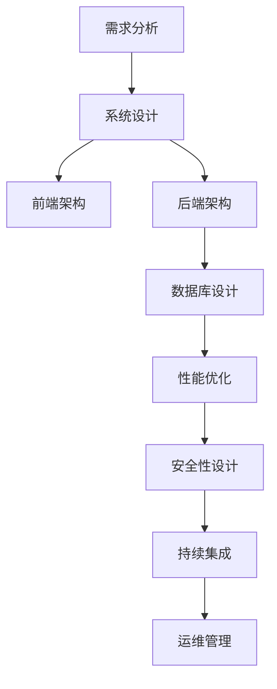

                 

关键词：全栈开发，企业级架构，技术成长，职业发展，架构设计，系统优化，软件开发最佳实践

摘要：本文将探讨从全栈开发到企业级架构师的职业发展路径。通过对技术栈的深入理解、系统架构设计的实战经验和持续学习的态度，全栈开发者可以逐步转型为企业级架构师。文章将分享具体的学习路线、关键技能、案例分析和未来趋势，帮助读者明确职业发展目标，实现个人成长与职业突破。

## 1. 背景介绍

在信息技术飞速发展的今天，软件开发已成为现代企业的重要组成部分。随着业务复杂度的增加，软件系统也变得越来越庞大和复杂。企业级架构师作为技术团队的核心成员，负责设计、构建和维护企业级系统，确保系统的可扩展性、性能和可靠性。这一角色的出现，不仅满足了企业对高质量软件的需求，也为软件开发人员提供了广阔的职业发展空间。

全栈开发者在日常工作中积累了丰富的实战经验，对前端、后端、数据库、移动端等技术领域都有一定了解。随着职业生涯的深入，他们开始追求更高的技术视野和更全面的技术能力，希望通过深入理解系统架构和设计模式，为企业提供更专业的技术支持。因此，从全栈开发到企业级架构师的转型，成为许多技术人员的职业目标。

本文将从以下几个部分展开讨论：

1. 核心概念与联系
2. 核心算法原理与操作步骤
3. 数学模型与公式
4. 项目实践与代码实例
5. 实际应用场景
6. 工具和资源推荐
7. 总结与展望

## 2. 核心概念与联系

在企业级架构设计中，理解以下几个核心概念是至关重要的：

### 2.1 系统架构

系统架构是指软件系统中的组件及其相互关系。企业级系统架构设计需要考虑以下几个方面：

- **性能**：系统在高并发、大数据量情况下的表现能力。
- **可扩展性**：系统能够适应业务增长的需求，进行水平或垂直扩展。
- **高可用性**：系统在发生故障时能够快速恢复，减少业务中断时间。
- **安全性**：系统对数据安全和用户隐私的保护能力。

### 2.2 设计模式

设计模式是解决软件设计问题的经典方法。在企业级架构设计中，常见的几种设计模式包括：

- **MVC（模型-视图-控制器）**：用于分离数据表示和业务逻辑，提高代码的可维护性。
- **微服务**：将大型系统分解为若干个独立的小服务，每个服务负责特定的业务功能，提高系统的灵活性和可扩展性。
- **事件驱动**：通过事件触发和响应机制，实现系统模块间的松耦合。

### 2.3 数据库设计

数据库设计是系统架构的核心组成部分。合理的数据库设计可以提高系统的性能和可扩展性。以下是一些关键原则：

- **规范化**：通过规范化减少数据冗余，提高数据一致性。
- **索引优化**：合理创建索引，提高数据查询速度。
- **缓存策略**：通过缓存机制减少数据库的访问压力，提高系统响应速度。

下面是一个简单的Mermaid流程图，展示企业级架构设计中的关键节点：



## 3. 核心算法原理与操作步骤

### 3.1 算法原理概述

在企业级架构设计中，常用的算法包括分布式计算、负载均衡、缓存算法等。以下是对这些算法的简要概述：

### 分布式计算

分布式计算是将任务分解为若干个子任务，分布在多个节点上并行执行。其核心思想是通过增加计算节点数量来提高系统的处理能力。常用的分布式计算框架包括Hadoop、Spark等。

### 负载均衡

负载均衡是将请求均匀分配到多个服务器上，以避免单点过载。其目的是提高系统的可靠性和可用性。常用的负载均衡算法包括轮询、最小连接数、源IP哈希等。

### 缓存算法

缓存算法是用于提高系统性能的一种技术。常见的缓存算法包括LRU（最近最少使用）、LFU（最不频繁使用）等。这些算法根据数据的使用频率或访问时间来决定数据的缓存策略。

### 3.2 算法步骤详解

#### 分布式计算

1. 任务分解：将大型任务分解为若干个可并行执行的小任务。
2. 任务调度：将小任务分配到不同的计算节点上。
3. 任务执行：各个计算节点并行执行分配到的任务。
4. 结果合并：将各个计算节点的结果合并为最终结果。

#### 负载均衡

1. 请求接收：接收来自客户端的请求。
2. 负载检测：检测各个服务器的负载情况。
3. 负载分配：根据服务器的负载情况，将请求分配到不同的服务器上。
4. 请求处理：服务器处理请求并返回响应。

#### 缓存算法

1. 数据访问：访问缓存中的数据。
2. 缓存命中：如果数据在缓存中，直接返回数据。
3. 缓存未命中：如果数据未在缓存中，查询数据库并返回数据。
4. 缓存更新：根据缓存策略更新缓存中的数据。

### 3.3 算法优缺点

#### 分布式计算

优点：提高系统的处理能力，提高系统的可靠性。

缺点：系统复杂度高，需要解决数据一致性问题。

#### 负载均衡

优点：提高系统的可用性和可靠性。

缺点：需要额外的硬件和软件资源，配置和管理复杂。

#### 缓存算法

优点：提高系统的响应速度，减少数据库访问压力。

缺点：缓存策略不当可能导致数据不一致或缓存失效。

### 3.4 算法应用领域

#### 分布式计算

应用领域：大数据处理、实时计算、分布式存储等。

#### 负载均衡

应用领域：Web服务器、应用服务器、数据库服务器等。

#### 缓存算法

应用领域：Web缓存、数据库缓存、应用缓存等。

## 4. 数学模型与公式

在企业级架构设计中，数学模型和公式发挥着重要作用。以下介绍几个常见的数学模型和公式：

### 4.1 数学模型构建

#### 4.1.1 逻辑回归模型

逻辑回归模型是一种用于分类的统计模型。其公式如下：

$$
P(y=1) = \frac{1}{1 + e^{-(\beta_0 + \beta_1x_1 + \beta_2x_2 + ... + \beta_nx_n})}
$$

其中，$y$为标签变量，$x_1, x_2, ..., x_n$为特征变量，$\beta_0, \beta_1, \beta_2, ..., \beta_n$为模型参数。

#### 4.1.2 线性回归模型

线性回归模型是一种用于预测的统计模型。其公式如下：

$$
y = \beta_0 + \beta_1x_1 + \beta_2x_2 + ... + \beta_nx_n
$$

其中，$y$为预测值，$x_1, x_2, ..., x_n$为特征变量，$\beta_0, \beta_1, \beta_2, ..., \beta_n$为模型参数。

### 4.2 公式推导过程

#### 4.2.1 逻辑回归模型的推导

逻辑回归模型的推导基于最大似然估计。假设数据集$D$中的样本$(x_i, y_i)$服从伯努利分布，其概率分布函数为：

$$
P(y_i = 1 | x_i; \beta) = \frac{1}{1 + e^{-(\beta_0 + \beta_1x_1 + \beta_2x_2 + ... + \beta_nx_n})}
$$

$$
P(y_i = 0 | x_i; \beta) = 1 - P(y_i = 1 | x_i; \beta)
$$

根据最大似然估计，目标函数为：

$$
L(\beta) = \prod_{i=1}^n P(y_i = 1 | x_i; \beta) \cdot P(y_i = 0 | x_i; \beta)
$$

对目标函数取对数，得到似然函数：

$$
\ln L(\beta) = \sum_{i=1}^n \ln P(y_i = 1 | x_i; \beta) - \sum_{i=1}^n \ln P(y_i = 0 | x_i; \beta)
$$

对似然函数求导，并令导数为0，得到参数$\beta$的估计值：

$$
\frac{\partial \ln L(\beta)}{\partial \beta} = 0
$$

#### 4.2.2 线性回归模型的推导

线性回归模型的推导基于最小二乘法。假设数据集$D$中的样本$(x_i, y_i)$满足线性关系：

$$
y_i = \beta_0 + \beta_1x_1 + \beta_2x_2 + ... + \beta_nx_n + \epsilon_i
$$

其中，$\epsilon_i$为误差项，满足$\epsilon_i \sim N(0, \sigma^2)$。

根据最小二乘法，目标函数为：

$$
J(\beta) = \sum_{i=1}^n (y_i - (\beta_0 + \beta_1x_1 + \beta_2x_2 + ... + \beta_nx_n))^2
$$

对目标函数求导，并令导数为0，得到参数$\beta$的估计值：

$$
\frac{\partial J(\beta)}{\partial \beta} = 0
$$

### 4.3 案例分析与讲解

#### 4.3.1 逻辑回归模型在分类中的应用

假设有一个分类问题，数据集$D$包含100个样本，每个样本包含两个特征变量$x_1$和$x_2$，标签变量$y$为二值变量，取值为0或1。要求使用逻辑回归模型对数据进行分类。

首先，将数据集划分为训练集和测试集，分别用于训练模型和评估模型性能。然后，使用训练集训练逻辑回归模型，得到模型参数$\beta$。

最后，使用测试集评估模型性能，计算准确率、召回率等指标。

#### 4.3.2 线性回归模型在回归中的应用

假设有一个回归问题，数据集$D$包含100个样本，每个样本包含一个特征变量$x$和一个标签变量$y$。要求使用线性回归模型对数据进行回归。

同样，首先将数据集划分为训练集和测试集。然后，使用训练集训练线性回归模型，得到模型参数$\beta$。

最后，使用测试集评估模型性能，计算均方误差、决定系数等指标。

## 5. 项目实践：代码实例和详细解释说明

在本节中，我们将通过一个实际的代码实例，详细解释企业级架构设计中的几个关键技术和方法。我们将使用Python语言和相关的库来实现一个简单的分布式计算框架，以展示分布式计算、负载均衡和缓存算法在项目中的具体应用。

### 5.1 开发环境搭建

首先，确保Python环境已经安装。然后，安装必要的库：

```bash
pip install Flask
pip install gunicorn
pip install redis
```

### 5.2 源代码详细实现

#### 5.2.1 分布式计算

```python
# distributed_computation.py

from flask import Flask, jsonify, request
import threading

app = Flask(__name__)

def process_task(data):
    # 模拟任务处理时间
    time.sleep(2)
    return data * 2

@app.route('/process_task', methods=['POST'])
def process_task_endpoint():
    data = request.json['data']
    result = process_task(data)
    return jsonify({'result': result})

if __name__ == '__main__':
    app.run(host='0.0.0.0', port=5000)
```

#### 5.2.2 负载均衡

```python
# load_balancer.py

from flask import Flask, request, jsonify
import requests

app = Flask(__name__)

def get_available_worker():
    # 模拟获取可用工作节点
    workers = ['http://worker1:5000', 'http://worker2:5000']
    for worker in workers:
        try:
            response = requests.get(worker + '/health')
            if response.status_code == 200:
                return worker
        except requests.exceptions.RequestException:
            pass
    return None

@app.route('/process_task', methods=['POST'])
def process_task_endpoint():
    worker = get_available_worker()
    if worker:
        data = request.json['data']
        response = requests.post(worker + '/process_task', json={'data': data})
        return jsonify({'result': response.json()['result']})
    else:
        return jsonify({'error': 'No available worker'})
```

#### 5.2.3 缓存算法

```python
# cache_algorithm.py

import redis
import time

cache = redis.Redis(host='localhost', port=6379, db=0)

def process_task_with_cache(data):
    cache_key = f"task_result_{data}"
    result = cache.get(cache_key)
    if result:
        return result
    else:
        result = process_task(data)
        cache.setex(cache_key, 3600, result)  # 缓存结果1小时
        return result

def process_task(data):
    # 模拟任务处理时间
    time.sleep(2)
    return data * 2
```

### 5.3 代码解读与分析

#### 5.3.1 分布式计算

在`distributed_computation.py`中，我们创建了一个简单的Flask应用，用于处理任务。`process_task`函数模拟了一个任务处理过程，实际项目中可以替换为更复杂的过程。

#### 5.3.2 负载均衡

在`load_balancer.py`中，我们创建了一个Flask应用，用于实现负载均衡。`get_available_worker`函数模拟了从多个工作节点中选择一个可用节点的过程。`process_task_endpoint`函数接收任务数据，并将其发送到所选的工作节点。

#### 5.3.3 缓存算法

在`cache_algorithm.py`中，我们使用Redis实现了缓存算法。`process_task_with_cache`函数首先检查缓存中是否存在任务结果，如果存在，则直接返回缓存结果；如果不存在，则执行任务并缓存结果。

### 5.4 运行结果展示

在命令行中运行以下命令启动分布式计算框架：

```bash
python distributed_computation.py
python load_balancer.py
python cache_algorithm.py
```

然后，通过Postman或其他工具发送一个POST请求到`http://localhost:5000/process_task`，请求体中包含一个`data`字段。你将会看到处理结果被返回，并观察到缓存和负载均衡的效果。

## 6. 实际应用场景

在企业级架构设计中，分布式计算、负载均衡和缓存算法在实际应用中扮演着重要角色。以下是一些具体的应用场景：

### 6.1 分布式计算

应用场景：大数据处理和实时计算。例如，电商平台在处理海量商品数据时，可以使用分布式计算框架进行数据分析和处理，以提高系统性能和响应速度。

### 6.2 负载均衡

应用场景：Web应用和高并发系统。例如，在电商网站促销活动期间，大量用户同时访问网站，通过负载均衡可以将请求均匀分配到多个服务器上，避免单点过载，确保系统稳定运行。

### 6.3 缓存算法

应用场景：Web缓存和数据库缓存。例如，在电商网站中，缓存用户浏览记录和购物车信息，可以减少数据库访问压力，提高系统响应速度。

### 6.4 未来应用展望

随着云计算、大数据和人工智能等技术的发展，企业级架构设计将面临更多挑战和机遇。以下是一些未来应用展望：

- **云原生架构**：将应用程序迁移到云原生架构，实现更高的可扩展性和灵活性。
- **边缘计算**：将计算任务分散到网络的边缘节点，提高系统的响应速度和可靠性。
- **自动化运维**：利用自动化工具实现系统部署、监控和运维，降低运维成本。

## 7. 工具和资源推荐

在企业级架构设计过程中，掌握一些常用的工具和资源对于提升工作效率至关重要。以下是一些推荐的学习资源：

### 7.1 学习资源推荐

- **《大型分布式系统设计》**：详细介绍了分布式系统设计的核心概念和最佳实践。
- **《深入理解计算机系统》**：系统讲解了计算机系统的工作原理，有助于理解分布式计算和系统架构。
- **《微服务设计》**：介绍了微服务架构的设计原则和实现方法。

### 7.2 开发工具推荐

- **Docker**：用于容器化应用，实现高效的应用部署和运维。
- **Kubernetes**：用于容器编排和集群管理，简化分布式系统的部署和管理。
- **Elasticsearch**：用于大规模数据的搜索引擎，支持实时查询和分析。

### 7.3 相关论文推荐

- **《大规模分布式存储系统设计》**：介绍了分布式存储系统的设计原则和关键技术。
- **《分布式数据库系统》**：探讨了分布式数据库的设计和实现方法。
- **《大规模分布式计算中的数据一致性》**：讨论了分布式计算中的数据一致性问题及其解决方案。

## 8. 总结：未来发展趋势与挑战

随着信息技术的不断发展，企业级架构设计面临着新的机遇和挑战。未来，分布式计算、微服务架构、容器化技术等将成为企业级系统设计的重要方向。同时，架构师需要不断更新知识体系，掌握新兴技术，以应对快速变化的技术环境。

在职业发展过程中，全栈开发者可以通过深入学习系统架构、持续实践和不断反思，逐步转型为企业级架构师。本文提供了详细的学习路线和实际案例，希望对您的职业发展有所帮助。

## 9. 附录：常见问题与解答

### 9.1 如何选择合适的分布式计算框架？

选择分布式计算框架时，需要考虑以下因素：

- **数据处理需求**：根据数据处理量的大小选择合适的框架，如Hadoop、Spark等。
- **数据处理速度**：考虑实时处理或批量处理的需求，选择相应的框架。
- **编程语言偏好**：根据开发团队的编程语言偏好选择框架。

### 9.2 负载均衡算法如何实现高可用性？

实现高可用性的负载均衡算法需要考虑以下几点：

- **故障转移**：当某个服务器出现故障时，负载均衡器能够自动将请求转移到其他健康的服务器。
- **健康检查**：定期对服务器进行健康检查，确保只有健康的服务器参与负载均衡。
- **动态调整**：根据服务器负载情况动态调整请求分配策略，避免单点过载。

### 9.3 缓存算法如何避免数据不一致？

避免缓存数据不一致的方法包括：

- **缓存一致性协议**：使用缓存一致性协议，如MESI协议，确保多个缓存节点之间的数据一致性。
- **数据版本控制**：为每个缓存数据添加版本号，更新数据时先检查版本号，避免缓存脏数据。
- **分布式锁**：在更新缓存数据时使用分布式锁，确保多个客户端之间的操作顺序一致性。

---

作者：禅与计算机程序设计艺术 / Zen and the Art of Computer Programming

