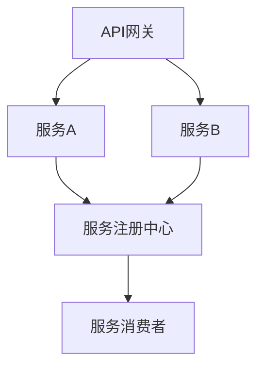

                 

全栈开发是一个越来越受欢迎的职业，它要求开发者掌握前端、后端以及数据库等全方位技能。然而，随着技术的发展和项目的复杂性增加，单一的技能栈已经无法满足企业的需求。微服务架构作为一种应对复杂系统的解决方案，逐渐成为现代软件开发的主流。本文将探讨从全栈开发到微服务架构师的晋升之路，帮助开发者理解这一转型过程，并掌握微服务架构的核心原理和实践。

## 关键词
- 全栈开发
- 微服务架构
- 服务拆分
- API设计
- 分布式系统
- 服务治理
- 持续集成

## 摘要
本文旨在为全栈开发者提供一条清晰的转型路径，从理解微服务架构的概念、原理到具体实践。文章将分为几个部分：首先介绍微服务架构的背景和核心概念；接着深入探讨微服务的设计原则和关键技术；然后通过具体的案例展示微服务架构的实践方法；最后，讨论微服务架构在实际应用中的挑战和未来趋势。希望通过本文，开发者能够更好地掌握微服务架构，提升自身的职业竞争力。

## 1. 背景介绍
### 1.1 全栈开发的局限性
全栈开发者在掌握了前端、后端以及数据库等技术后，通常能够独立完成中小型项目的开发。然而，随着项目的复杂度增加，单一的全栈开发者开始面临以下问题：

- **技术栈压力**：需要不断学习新的技术栈，如前端框架、后端框架、数据库技术等，维护成本高。
- **代码维护**：随着项目规模的扩大，全栈开发者需要处理越来越复杂的代码，维护难度增加。
- **开发效率**：在大型项目中，全栈开发者可能无法同时高效地处理前端、后端等多个模块的开发。

### 1.2 微服务架构的兴起
微服务架构是一种基于服务拆分的架构风格，它将应用程序划分为多个独立的、可部署的服务单元。每个服务负责特定的业务功能，通过轻量级的通信协议（如HTTP/REST）进行交互。

微服务架构的优势在于：

- **模块化**：服务之间的耦合度降低，每个服务可以独立开发、测试和部署。
- **弹性伸缩**：可以根据需求独立扩展或缩减服务实例，提高系统的可伸缩性。
- **技术多样性**：每个服务可以使用不同的技术栈，满足不同的业务需求。
- **故障隔离**：单个服务的故障不会影响整个系统，易于定位和修复。

### 1.3 微服务架构的发展历程
微服务架构并非一夜之间出现的，而是经历了一个长期的发展过程。以下是几个关键阶段：

- **SOA（服务导向架构）**：早在2000年代初期，SOA作为一种面向服务的架构风格，就已经开始流行。它通过Web服务实现了不同系统之间的互操作。
- **DevOps**：DevOps运动的兴起推动了持续集成和持续部署（CI/CD）的实践，为微服务架构的实施提供了基础设施支持。
- **容器化和Kubernetes**：容器技术（如Docker）和容器编排系统（如Kubernetes）的出现，使得微服务架构的部署和管理更加简便和高效。
- **云原生**：随着云计算的发展，微服务架构与云原生技术的结合，使得微服务更加轻量级和可移植。

## 2. 核心概念与联系
### 2.1 微服务的定义
微服务（Microservices）是一种设计架构风格，其核心思想是将一个复杂的单一应用程序分解为多个小型、独立的服务。每个服务代表一个业务功能，可以独立开发、部署和扩展。

### 2.2 微服务的优势
微服务的优势主要体现在以下几个方面：

- **可维护性**：每个服务都是独立的，更容易管理和维护。
- **可扩展性**：可以独立扩展或缩减每个服务的实例，满足不同业务需求。
- **灵活性**：每个服务可以使用不同的编程语言和数据库，提高开发效率和适应不同业务场景。
- **弹性**：单个服务的故障不会影响其他服务，提高了系统的可靠性。

### 2.3 微服务架构的组成
一个典型的微服务架构通常包括以下几个关键组成部分：

- **服务注册与发现**：服务启动时注册到服务注册中心，消费者通过服务注册中心发现服务实例。
- **API网关**：作为外部访问系统的统一入口，处理跨域请求、请求路由和安全性等。
- **服务间通信**：通过轻量级通信协议（如HTTP/REST）进行服务间通信。
- **配置管理**：集中管理服务的配置信息，支持配置的热更新。
- **服务监控与日志**：监控系统性能和健康状态，收集和分析日志数据。
- **分布式存储**：每个服务可以使用自己的数据库，实现数据的分布式存储。

### 2.4 Mermaid 流程图
下面是一个简化的微服务架构的Mermaid流程图，展示了服务注册与发现、API网关、服务间通信等关键环节。



### 2.5 微服务设计原则
微服务架构的成功依赖于以下几个关键设计原则：

- **单一职责**：每个服务只负责一个业务功能，确保服务的职责单一，易于管理和扩展。
- **自治**：每个服务具有独立的开发、部署和运维能力，降低服务的耦合度。
- **解耦**：服务间通过轻量级的通信协议进行解耦，减少直接依赖。
- **高内聚**：服务内部保持高内聚，确保服务的内部复杂度低，易于维护。
- **横向扩展**：服务可以独立扩展或缩减，满足不同业务需求。

## 3. 核心算法原理 & 具体操作步骤
### 3.1 算法原理概述
微服务架构的核心在于服务拆分和分布式系统的构建。以下是几个关键算法原理：

- **服务拆分算法**：基于业务需求和系统架构，将一个复杂的单一应用程序拆分为多个独立的服务。
- **负载均衡算法**：根据服务实例的健康状态和负载情况，将请求分配到不同的服务实例。
- **服务发现算法**：消费者通过服务注册中心发现可用服务实例，并动态更新服务列表。

### 3.2 算法步骤详解
#### 服务拆分算法

1. **业务梳理**：对现有业务系统进行梳理，确定每个业务功能的边界和职责。
2. **功能划分**：根据业务需求，将功能模块划分为多个独立的服务。
3. **服务定义**：为每个服务定义清晰的接口和职责，确保服务的高内聚。
4. **服务部署**：将每个服务部署到独立的容器或虚拟机中，确保服务自治。

#### 负载均衡算法

1. **健康检查**：定期对服务实例进行健康检查，标记异常实例。
2. **负载评估**：根据每个服务实例的负载情况，选择负载较轻的实例。
3. **请求分配**：将请求分配到选择好的服务实例，实现负载均衡。

#### 服务发现算法

1. **服务注册**：服务实例启动时向服务注册中心注册，提供服务实例的地址和端口信息。
2. **服务发现**：消费者从服务注册中心获取服务列表，并建立与服务实例的连接。
3. **服务更新**：服务实例发生变更时，及时更新服务注册中心的记录。

### 3.3 算法优缺点
#### 服务拆分算法

- **优点**：提高系统的可维护性、可扩展性和灵活性。
- **缺点**：增加系统复杂性，需要更多的运维支持。

#### 负载均衡算法

- **优点**：提高系统的性能和可用性，确保服务稳定运行。
- **缺点**：负载均衡算法的优化复杂，需要考虑多种负载情况。

#### 服务发现算法

- **优点**：提高系统的弹性，支持服务的动态调整。
- **缺点**：服务发现引入了一定的延迟和复杂性。

### 3.4 算法应用领域
微服务架构的核心算法广泛应用于以下领域：

- **电子商务**：实现灵活的订单处理、库存管理和用户服务。
- **金融科技**：构建高可用、高并发、可扩展的金融交易系统。
- **物联网**：处理大量的设备接入和数据处理需求。
- **在线教育**：提供灵活的课程管理、用户管理和内容分发服务。

## 4. 数学模型和公式 & 详细讲解 & 举例说明
### 4.1 数学模型构建
在微服务架构中，有几个关键的数学模型和公式用于性能评估和资源分配。

#### 服务响应时间模型
服务响应时间（\( T \)）由以下公式决定：

\[ T = T_{\text{处理}} + T_{\text{通信}} + T_{\text{等待}} \]

- \( T_{\text{处理}} \)：服务内部处理时间。
- \( T_{\text{通信}} \)：服务间通信时间。
- \( T_{\text{等待}} \)：等待其他服务响应的时间。

#### 负载均衡模型
负载均衡器根据以下公式计算服务实例的负载：

\[ \text{负载} = \frac{\text{当前请求量}}{\text{服务实例数}} \]

### 4.2 公式推导过程
我们以服务响应时间模型为例，详细讲解公式推导过程。

1. **服务内部处理时间**：
   \[ T_{\text{处理}} = \frac{\text{处理能力}}{\text{请求速率}} \]

   其中，处理能力表示单位时间内服务能够处理的最大请求量，请求速率表示单位时间内的请求到达率。

2. **服务间通信时间**：
   \[ T_{\text{通信}} = \frac{\text{通信延迟}}{\text{请求速率}} \]

   其中，通信延迟表示服务间通信所需的平均时间。

3. **等待时间**：
   \[ T_{\text{等待}} = \frac{\text{排队长度}}{\text{请求速率}} \]

   其中，排队长度表示当前等待处理的请求数量。

### 4.3 案例分析与讲解
假设一个电商系统包含订单处理、库存管理和用户服务三个微服务。根据以上数学模型，我们可以对每个服务的响应时间进行评估。

#### 订单处理服务

- **处理能力**：1000请求/分钟。
- **通信延迟**：5毫秒。
- **请求速率**：1000请求/分钟。

\[ T_{\text{处理}} = \frac{1000}{1000} = 1 \text{分钟} \]
\[ T_{\text{通信}} = \frac{5}{1000} = 0.00005 \text{分钟} \]
\[ T_{\text{等待}} = \frac{0}{1000} = 0 \text{分钟} \]

总响应时间：1分钟

#### 库存管理服务

- **处理能力**：500请求/分钟。
- **通信延迟**：10毫秒。
- **请求速率**：500请求/分钟。

\[ T_{\text{处理}} = \frac{500}{500} = 1 \text{分钟} \]
\[ T_{\text{通信}} = \frac{10}{500} = 0.002 \text{分钟} \]
\[ T_{\text{等待}} = \frac{0}{500} = 0 \text{分钟} \]

总响应时间：1.002分钟

#### 用户服务

- **处理能力**：1000请求/分钟。
- **通信延迟**：20毫秒。
- **请求速率**：1000请求/分钟。

\[ T_{\text{处理}} = \frac{1000}{1000} = 1 \text{分钟} \]
\[ T_{\text{通信}} = \frac{20}{1000} = 0.02 \text{分钟} \]
\[ T_{\text{等待}} = \frac{0}{1000} = 0 \text{分钟} \]

总响应时间：1.02分钟

通过以上分析，我们可以看到订单处理服务的响应时间最长，是整个系统的瓶颈。为了优化性能，可以考虑增加订单处理服务的实例数量或提升其处理能力。

## 5. 项目实践：代码实例和详细解释说明
### 5.1 开发环境搭建
为了演示微服务架构的实践，我们将使用Spring Boot和Docker进行开发。以下是搭建开发环境的步骤：

1. 安装Java开发环境（JDK 1.8或更高版本）。
2. 安装Docker和Docker Compose。
3. 使用Spring Initializr生成Spring Boot项目。

### 5.2 源代码详细实现
下面是一个简单的订单处理微服务的源代码实现，包括订单创建和查询功能。

```java
@RestController
@RequestMapping("/orders")
public class OrderController {

    @Autowired
    private OrderService orderService;

    @PostMapping
    public ResponseEntity<Order> createOrder(@RequestBody OrderRequest request) {
        Order order = orderService.createOrder(request);
        return ResponseEntity.ok(order);
    }

    @GetMapping("/{orderId}")
    public ResponseEntity<Order> getOrder(@PathVariable Long orderId) {
        Order order = orderService.getOrder(orderId);
        return ResponseEntity.ok(order);
    }
}

@Service
public class OrderService {

    @Autowired
    private OrderRepository orderRepository;

    public Order createOrder(OrderRequest request) {
        Order order = new Order();
        order.setOrderId(request.getOrderId());
        order.setCustomerName(request.getCustomerName());
        order.setProductName(request.getProductName());
        order.setStatus(OrderStatus.NEW);
        orderRepository.save(order);
        return order;
    }

    public Order getOrder(Long orderId) {
        return orderRepository.findById(orderId).orElseThrow(() -> new ResourceNotFoundException("Order not found"));
    }
}

@Entity
public class Order {
    @Id
    @GeneratedValue(strategy = GenerationType.IDENTITY)
    private Long orderId;

    private String customerName;
    private String productName;
    private OrderStatus status;

    // Getters and Setters
}

public enum OrderStatus {
    NEW, PROCESSING, COMPLETE, CANCELLED
}

@Repository
public class OrderRepository extends JpaRepository<Order, Long> {
}

@RestController
@RequestMapping("/orders")
public class OrderController {

    @Autowired
    private OrderService orderService;

    @PostMapping
    public ResponseEntity<Order> createOrder(@RequestBody OrderRequest request) {
        Order order = orderService.createOrder(request);
        return ResponseEntity.ok(order);
    }

    @GetMapping("/{orderId}")
    public ResponseEntity<Order> getOrder(@PathVariable Long orderId) {
        Order order = orderService.getOrder(orderId);
        return ResponseEntity.ok(order);
    }
}

@Service
public class OrderService {

    @Autowired
    private OrderRepository orderRepository;

    public Order createOrder(OrderRequest request) {
        Order order = new Order();
        order.setOrderId(request.getOrderId());
        order.setCustomerName(request.getCustomerName());
        order.setProductName(request.getProductName());
        order.setStatus(OrderStatus.NEW);
        orderRepository.save(order);
        return order;
    }

    public Order getOrder(Long orderId) {
        return orderRepository.findById(orderId).orElseThrow(() -> new ResourceNotFoundException("Order not found"));
    }
}

@Entity
public class Order {
    @Id
    @GeneratedValue(strategy = GenerationType.IDENTITY)
    private Long orderId;

    private String customerName;
    private String productName;
    private OrderStatus status;

    // Getters and Setters
}

public enum OrderStatus {
    NEW, PROCESSING, COMPLETE, CANCELLED
}

@Repository
public class OrderRepository extends JpaRepository<Order, Long> {
}
```

### 5.3 代码解读与分析
上述代码实现了一个简单的订单处理微服务，包括订单创建和查询功能。以下是关键部分的解读：

- **OrderController**：负责接收HTTP请求，调用OrderService处理业务逻辑，并将结果返回给客户端。
- **OrderService**：实现订单的创建和查询功能，调用OrderRepository进行数据库操作。
- **OrderRepository**：继承JpaRepository，实现订单的增删改查功能。

### 5.4 运行结果展示
在本地开发环境中，我们可以使用Docker Compose启动服务，并使用Postman进行测试。

1. 编写Dockerfile和docker-compose.yml文件，配置服务的依赖和启动参数。
2. 执行docker-compose up命令，启动服务。
3. 使用Postman发送HTTP请求，验证服务功能。

```yml
version: '3'
services:
  order-service:
    build: .
    ports:
      - "8080:8080"
    depends_on:
      - database
  database:
    image: postgres:13
    environment:
      POSTGRES_DB: orders
      POSTGRES_USER: orders
      POSTGRES_PASSWORD: orders
    volumes:
      - postgres_data:/var/lib/postgresql/data
volumes:
  postgres_data:
```

```bash
$ docker-compose up
```

```http
POST http://localhost:8080/orders
Content-Type: application/json

{
  "orderId": 1,
  "customerName": "张三",
  "productName": "笔记本电脑"
}

```

响应结果：

```json
{
  "orderId": 1,
  "customerName": "张三",
  "productName": "笔记本电脑",
  "status": "NEW"
}

```

```http
GET http://localhost:8080/orders/1
```

响应结果：

```json
{
  "orderId": 1,
  "customerName": "张三",
  "productName": "笔记本电脑",
  "status": "NEW"
}
```

通过以上测试，我们可以确认订单处理微服务的基本功能正常。

## 6. 实际应用场景
### 6.1 电子商务平台
电子商务平台通常包含商品管理、订单处理、库存管理、用户管理等众多功能。通过微服务架构，可以将这些功能模块拆分为独立的服务，提高系统的可维护性和扩展性。例如，订单处理服务可以独立部署和扩展，以应对高峰期的订单量。

### 6.2 金融系统
金融系统通常涉及大量的业务流程和复杂的数据处理。微服务架构可以帮助金融系统实现灵活的业务处理和高效的数据管理。例如，可以将交易处理、风控管理、账户管理等功能拆分为独立的服务，实现各个模块的独立开发和部署。

### 6.3 物联网平台
物联网平台通常需要处理大量的设备接入和数据收集。微服务架构可以提供高效的设备管理和数据采集功能。例如，可以将设备管理、数据存储、数据分析等功能拆分为独立的服务，实现各个模块的独立开发和部署。

### 6.4 在线教育平台
在线教育平台通常涉及课程管理、用户管理、内容管理等功能。通过微服务架构，可以提供灵活的课程管理和用户服务。例如，可以将课程管理、用户管理、内容管理等功能拆分为独立的服务，实现各个模块的独立开发和部署。

## 7. 未来应用展望
### 7.1 自动化与智能化
随着人工智能和自动化技术的发展，微服务架构将进一步融入自动化和智能化场景。例如，通过机器学习算法对服务性能进行预测和优化，实现智能化的服务管理和调度。

### 7.2 跨平台与云原生
随着云计算和跨平台技术的发展，微服务架构将更加跨平台和云原生。例如，通过容器化和Kubernetes技术，实现微服务的自动化部署、伸缩和管理。

### 7.3 服务网格与边缘计算
服务网格和边缘计算技术的发展，将进一步提升微服务架构的灵活性和可扩展性。例如，通过服务网格实现微服务间的安全通信和流量管理，通过边缘计算实现数据的本地处理和实时分析。

## 8. 工具和资源推荐
### 8.1 学习资源推荐
- 《微服务设计》
- 《云原生应用架构》
- 《Kubernetes实战》
- 《Spring Boot实战》

### 8.2 开发工具推荐
- Spring Boot
- Docker
- Kubernetes
- Postman
- JMeter

### 8.3 相关论文推荐
- "Microservices: A Definition of a New Approach to Application Structure" by Martin Fowler
- "Designing Distributed Systems: Service decomposition" by Mark Richards
- "Docker: Usage, Design, and Management" by Edward Curry
- "Kubernetes: Up and Running: Dive into the Future of Infrastructure" by Kelsey Hightower

## 9. 总结：未来发展趋势与挑战
### 9.1 研究成果总结
微服务架构作为一种应对复杂系统的解决方案，已经在电子商务、金融科技、物联网、在线教育等领域得到广泛应用。通过服务拆分、分布式系统构建和自动化管理，微服务架构提高了系统的可维护性、可扩展性和灵活性。

### 9.2 未来发展趋势
随着人工智能、自动化技术、云计算和边缘计算的发展，微服务架构将继续演进。未来，微服务架构将更加智能化、跨平台和云原生，为各类应用场景提供高效、灵活的解决方案。

### 9.3 面临的挑战
尽管微服务架构具有众多优势，但在实际应用中仍然面临以下挑战：

- **系统复杂性**：随着服务数量的增加，系统的复杂性也随之增加，需要更多的运维支持。
- **分布式事务**：分布式系统中的事务处理相对复杂，需要解决数据一致性问题。
- **服务发现与监控**：服务发现和监控是微服务架构的核心环节，需要高效、可靠的技术支持。

### 9.4 研究展望
未来，微服务架构的研究将重点关注以下几个方面：

- **自动化与智能化**：通过机器学习和自动化技术，实现智能化的服务管理和调度。
- **跨平台与云原生**：进一步融合云计算和跨平台技术，实现微服务的自动化部署、伸缩和管理。
- **服务网格与边缘计算**：通过服务网格和边缘计算技术，实现微服务间的安全通信和实时数据处理。

## 附录：常见问题与解答
### 1. 什么是微服务架构？
微服务架构是一种基于服务拆分的架构风格，将应用程序划分为多个独立的服务单元，每个服务负责特定的业务功能。

### 2. 微服务架构的优势有哪些？
微服务架构的优势包括：模块化、弹性伸缩、技术多样性、故障隔离等。

### 3. 微服务架构的挑战有哪些？
微服务架构的挑战包括：系统复杂性、分布式事务、服务发现与监控等。

### 4. 微服务架构与SOA有什么区别？
微服务架构与SOA都是面向服务的架构风格，但微服务架构更加关注服务的独立性、自治性和分布式系统的构建。

### 5. 如何实现微服务架构？
实现微服务架构的关键步骤包括：服务拆分、服务部署、服务间通信、服务监控等。

### 6. 微服务架构需要哪些技术支持？
微服务架构需要支持服务拆分、服务发现、服务间通信、配置管理、服务监控等关键技术，例如Docker、Kubernetes、Spring Boot等。

### 7. 微服务架构如何保证数据一致性？
微服务架构可以通过分布式事务、最终一致性、消息队列等技术实现数据一致性。

### 8. 微服务架构如何进行性能优化？
微服务架构可以通过负载均衡、缓存、异步处理、服务拆分等技术进行性能优化。

### 9. 微服务架构如何进行安全防护？
微服务架构可以通过API网关、身份认证、访问控制、安全审计等技术进行安全防护。

### 10. 微服务架构如何进行监控和日志管理？
微服务架构可以通过集中监控平台、日志收集和分析工具进行监控和日志管理。

作者：禅与计算机程序设计艺术 / Zen and the Art of Computer Programming
----------------------------------------------------------------
这篇文章从全栈开发的局限性出发，介绍了微服务架构的背景、核心概念、算法原理、数学模型、项目实践、应用场景、未来展望、工具推荐和常见问题解答。文章结构清晰，内容详实，旨在帮助全栈开发者理解微服务架构，并掌握其核心原理和实践方法。希望这篇文章能够对读者在职业发展中起到积极的推动作用。作者禅与计算机程序设计艺术以其深厚的计算机科学功底和对技术发展的深刻洞察，为读者提供了宝贵的指导。

