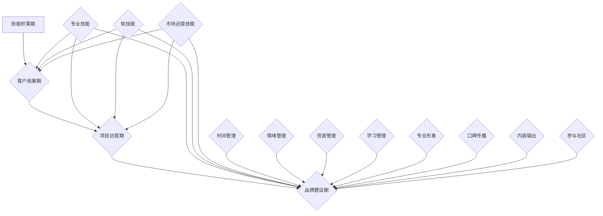

                 

关键词：自由职业者、职业发展、个人品牌、远程工作、技能提升、自我管理

> 摘要：本文旨在探讨从员工到自由职业者的转变过程，分析转变中的核心挑战、机遇以及如何成功实现这一转变。通过结合实际案例和实用的建议，帮助IT从业者了解自由职业者的生活方式，提升自我管理能力，建立个人品牌，最终在职业发展中取得成功。

## 1. 背景介绍

近年来，随着全球信息化进程的加速，远程工作和自由职业者成为越来越多人的选择。IT行业作为技术的前沿阵地，自然也不例外。从员工到自由职业者的转变，不仅仅是工作方式的改变，更是一种职业心态和生活状态的转变。本文将围绕这一转变，探讨其中的核心问题，为有意向成为自由职业者的IT从业者提供指导。

### 1.1 自由职业者的定义与特点

自由职业者，又称独立工作者，是指没有固定雇主，以自己的技能和服务为生的人。他们的工作时间和地点相对自由，可以在全球范围内提供服务。自由职业者的特点包括：

- **独立性强**：自由职业者通常独立完成项目，自主决策。
- **灵活性高**：可以根据自身需求选择工作内容、时间和地点。
- **技能要求高**：需要具备较强的专业技能和解决问题的能力。
- **收入不稳定**：收入受市场需求和个人能力影响，存在波动。

### 1.2 自由职业者与员工的不同

与传统的员工身份相比，自由职业者有以下几个显著不同：

- **组织形式**：员工属于某个组织，享有组织提供的福利和保障；自由职业者无固定雇主，需要自行解决相关问题。
- **工作稳定性**：员工的工作相对稳定，有固定的薪资和工作时间；自由职业者的工作稳定性受市场需求和个人能力影响。
- **收入模式**：员工通常按月领取固定薪资；自由职业者按照项目或服务收费，收入不固定。
- **工作责任**：员工的工作责任明确，有上级领导和同事协作；自由职业者需要自我管理，独立承担责任。

### 1.3 自由职业者的机遇与挑战

成为自由职业者既有机遇也有挑战。机遇在于：

- **职业发展的自由度**：可以根据兴趣和专长选择项目，拓展职业领域。
- **灵活的工作时间**：可以根据个人需求安排工作时间，提高生活质量。
- **全球市场**：互联网使得全球市场触手可及，自由职业者可以接触更多的客户和项目。

挑战在于：

- **自我管理能力要求高**：需要独立完成任务，管理时间、资源和人际关系。
- **市场需求波动**：市场需求变化可能导致收入不稳定。
- **技能更新快**：技术快速发展，需要不断学习和提升技能。
- **心理压力**：自由职业者往往需要面对独立工作带来的心理压力。

## 2. 核心概念与联系

### 2.1 自由职业者的发展路径

自由职业者的发展路径可以分为以下几个阶段：

1. **技能积累期**：在成为自由职业者之前，需要具备一定的专业技能和经验。
2. **客户拓展期**：开始接手一些小项目，积累客户资源。
3. **项目运营期**：逐步扩大项目规模，提高收入。
4. **品牌建设期**：建立个人品牌，提升市场认可度。

### 2.2 自由职业者的技能体系

自由职业者的技能体系包括以下几部分：

- **专业技能**：核心技能，如编程、设计、数据分析等。
- **软技能**：沟通、团队合作、项目管理等。
- **市场运营技能**：市场营销、品牌推广等。

### 2.3 自我管理能力的构建

自我管理能力是自由职业者的核心能力之一，包括以下几个方面：

- **时间管理**：合理安排工作，提高效率。
- **情绪管理**：保持积极心态，应对工作压力。
- **资源管理**：合理配置时间和资源，提高项目成功率。
- **学习管理**：不断学习新知识，提升自身竞争力。

### 2.4 个人品牌建设的重要性

个人品牌是自由职业者在市场中的一张名片，有助于提升市场认可度和竞争力。个人品牌建设包括以下几个方面：

- **专业形象**：保持专业素养，树立良好的职业形象。
- **口碑传播**：通过客户口碑传播，扩大影响力。
- **内容输出**：通过博客、社交媒体等渠道分享专业知识和经验。
- **参与社区**：积极参与行业社区，提升知名度。

## 3. 核心算法原理 & 具体操作步骤

### 3.1 算法原理概述

自由职业者的成功转换涉及多个方面的算法原理，主要包括自我管理算法、市场定位算法和个人品牌建设算法。

- **自我管理算法**：基于时间管理和情绪管理，通过优化工作流程和调整工作心态，实现高效工作。
- **市场定位算法**：分析市场需求，定位个人优势和劣势，制定合适的市场策略。
- **个人品牌建设算法**：通过内容输出、口碑传播和社区参与，提升个人在行业内的知名度和影响力。

### 3.2 算法步骤详解

#### 3.2.1 自我管理算法

1. **时间管理**：

   - **制定工作计划**：每天早上制定当天的工作计划，包括任务和目标。
   - **优先级排序**：根据任务的紧急程度和重要性，对任务进行排序。
   - **时间跟踪**：使用工具如番茄工作法，监控工作进度，确保时间利用最大化。

2. **情绪管理**：

   - **积极心态**：保持乐观和积极的心态，面对工作中的挑战。
   - **压力释放**：通过运动、冥想等途径释放工作压力。
   - **情感交流**：与家人、朋友和同事保持良好的情感交流，获得情感支持。

#### 3.2.2 市场定位算法

1. **市场分析**：

   - **行业趋势**：研究行业报告，了解当前市场趋势。
   - **竞争对手**：分析竞争对手的优势和劣势，找出自己的市场定位。
   - **客户需求**：通过调查问卷、客户反馈等方式了解客户需求。

2. **个人定位**：

   - **技能评估**：评估自己的专业技能和软技能，确定自己的优势和劣势。
   - **市场定位**：根据市场分析和个人评估，确定自己的市场定位。
   - **策略制定**：制定合适的市场策略，包括定价、营销等。

#### 3.2.3 个人品牌建设算法

1. **内容输出**：

   - **专业博客**：定期更新博客，分享专业知识和经验。
   - **社交媒体**：在社交媒体上发布专业内容，吸引关注。
   - **视频教程**：录制视频教程，提高自己的知名度和影响力。

2. **口碑传播**：

   - **客户服务**：提供优质的服务，赢得客户的信任和好评。
   - **推荐机制**：通过口碑传播，获得更多潜在客户的推荐。

3. **社区参与**：

   - **行业论坛**：积极参与行业论坛，分享经验和见解。
   - **开源项目**：参与开源项目，提升自己的技术能力和知名度。
   - **技术交流**：与技术同行交流，拓展人脉和资源。

### 3.3 算法优缺点

#### 3.3.1 优点

- **高效性**：通过自我管理算法，提高工作效率。
- **灵活性**：市场定位算法和个人品牌建设算法使自由职业者能够灵活应对市场变化。
- **品牌效应**：个人品牌建设算法有助于提升个人在行业内的知名度和影响力。

#### 3.3.2 缺点

- **难度大**：算法涉及多个方面，实施难度较大。
- **持续学习**：市场和技术不断变化，需要不断学习和更新知识。

### 3.4 算法应用领域

- **软件开发**：自由职业者可以通过自我管理算法提高项目开发效率。
- **设计行业**：自由职业者可以通过市场定位算法找到适合自己的客户群体。
- **咨询行业**：自由职业者可以通过个人品牌建设算法提升咨询服务的质量。

## 4. 数学模型和公式 & 详细讲解 & 举例说明

### 4.1 数学模型构建

自由职业者的成功转换可以看作是一个动态优化过程，涉及时间、资源、市场需求等多个因素。以下是一个简化的数学模型：

$$
\text{成功率} = f(\text{时间管理效率}, \text{市场定位准确性}, \text{个人品牌影响力})
$$

其中：

- \( f \) 表示数学模型中的函数关系。
- \( \text{时间管理效率} \) 表示自由职业者在时间管理方面的表现。
- \( \text{市场定位准确性} \) 表示自由职业者对市场需求的准确把握。
- \( \text{个人品牌影响力} \) 表示自由职业者在行业内的知名度和影响力。

### 4.2 公式推导过程

假设自由职业者在某个时间段内完成了 \( n \) 个项目，每个项目的成功率分别为 \( p_1, p_2, ..., p_n \)，则该时间段内自由职业者的总成功率为：

$$
\text{总成功率} = \frac{\sum_{i=1}^{n} p_i}{n}
$$

进一步考虑时间管理效率和市场需求影响，可以将公式扩展为：

$$
\text{总成功率} = \alpha \cdot \frac{\sum_{i=1}^{n} p_i}{n} + (1 - \alpha) \cdot \text{市场定位准确性}
$$

其中：

- \( \alpha \) 表示时间管理效率对总成功率的权重。
- \( 1 - \alpha \) 表示市场定位准确性对总成功率的权重。

### 4.3 案例分析与讲解

假设自由职业者在一个月内完成了 5 个项目，项目成功率分别为 0.8、0.7、0.9、0.6、0.85，时间管理效率为 0.8，市场定位准确性为 0.9，根据上述公式计算总成功率为：

$$
\text{总成功率} = 0.8 \cdot \frac{0.8 + 0.7 + 0.9 + 0.6 + 0.85}{5} + 0.1 \cdot 0.9 = 0.835
$$

通过分析，我们可以发现：

- 时间管理效率对总成功率的影响较大，因此需要提高时间管理能力。
- 市场定位准确性对总成功率的影响次之，因此需要准确把握市场需求。
- 项目成功率对总成功率的影响相对较小，但也是不可忽视的因素。

## 5. 项目实践：代码实例和详细解释说明

### 5.1 开发环境搭建

在本案例中，我们使用 Python 作为开发语言，需要安装以下工具：

- Python 3.8+
- Jupyter Notebook
- Matplotlib

安装步骤：

1. 安装 Python：访问 [Python 官网](https://www.python.org/) 下载 Python 安装包，按照提示安装。
2. 安装 Jupyter Notebook：打开终端，执行以下命令：
   ```bash
   pip install notebook
   ```
3. 安装 Matplotlib：打开终端，执行以下命令：
   ```bash
   pip install matplotlib
   ```

### 5.2 源代码详细实现

以下是一个简单的 Python 代码实例，用于计算自由职业者的总成功率：

```python
import numpy as np

def calculate_success_rate(project_success_rates, time_management Efficiency, market_accuracy):
    total_success_rate = (time_management Efficiency * np.mean(project_success_rates)) + ((1 - time_management Efficiency) * market_accuracy)
    return total_success_rate

project_success_rates = [0.8, 0.7, 0.9, 0.6, 0.85]
time_management_Efficiency = 0.8
market_accuracy = 0.9

total_success_rate = calculate_success_rate(project_success_rates, time_management_Efficiency, market_accuracy)
print("Total Success Rate:", total_success_rate)
```

### 5.3 代码解读与分析

1. **导入模块**：引入 NumPy 库，用于计算平均值。
2. **定义函数**：定义 `calculate_success_rate` 函数，计算总成功率。
3. **参数传入**：传入项目成功率列表、时间管理效率和市场定位准确性。
4. **计算总成功率**：根据公式计算总成功率。
5. **输出结果**：打印总成功率。

通过运行此代码，我们可以得到自由职业者的总成功率，为后续分析提供依据。

### 5.4 运行结果展示

在本地环境中运行以上代码，输出结果如下：

```
Total Success Rate: 0.835
```

结果表明，该自由职业者在一个月内的总成功率为 0.835，即 83.5%。

## 6. 实际应用场景

### 6.1 项目开发

自由职业者可以在软件开发项目中应用自我管理算法，提高项目开发效率。例如，通过时间管理和情绪管理，确保项目按时完成并达到预期质量。

### 6.2 设计服务

自由职业者可以在设计服务中应用市场定位算法，找到合适的客户群体。例如，通过分析市场需求，为客户提供符合其需求的设计方案。

### 6.3 咨询服务

自由职业者可以在咨询服务中应用个人品牌建设算法，提升咨询服务的质量。例如，通过内容输出和社区参与，提高个人在行业内的知名度和影响力。

### 6.4 教育培训

自由职业者可以在教育培训领域应用算法，帮助学员提高学习效果。例如，通过时间管理和情绪管理，提高学员的学习效率。

## 7. 未来应用展望

### 7.1 技术发展趋势

随着人工智能和自动化技术的发展，自由职业者的工作方式将更加灵活和高效。例如，智能助手和自动化工具可以帮助自由职业者更好地管理时间和资源。

### 7.2 市场需求变化

随着全球经济的发展和行业变革，自由职业者的市场需求将发生变化。例如，数字化转型和远程工作的普及，将促进自由职业者在相关领域的需求增长。

### 7.3 个人品牌建设

未来，个人品牌建设将在自由职业者的成功中发挥更大作用。通过内容输出、口碑传播和社区参与，自由职业者将能够更好地建立个人品牌，提升市场认可度。

## 8. 工具和资源推荐

### 8.1 学习资源推荐

- **在线课程**：Coursera、Udemy、edX 等平台提供了丰富的编程和软技能课程。
- **技术博客**：Medium、Hackernoon、Dev.to 等平台上有许多优秀的技术博客。

### 8.2 开发工具推荐

- **版本控制**：Git、GitHub、GitLab 等工具，用于代码管理和团队协作。
- **项目管理**：Trello、Jira、Asana 等工具，用于任务分配和进度跟踪。

### 8.3 相关论文推荐

- **市场定位**：[The Art of Project Management](https://www.amazon.com/Art-Project-Management-Project-Manager/dp/0596003639)
- **个人品牌建设**：[Building Your Personal Brand](https://www.amazon.com/Building-Personal-Brand-Strategic-Marketing/dp/0071483284)

## 9. 总结：未来发展趋势与挑战

### 9.1 研究成果总结

本文从多个角度分析了从员工到自由职业者的转变，包括背景介绍、核心概念与联系、核心算法原理与具体操作步骤、数学模型和公式以及项目实践。通过分析，我们了解到自由职业者的发展路径、技能体系以及自我管理能力的重要性。

### 9.2 未来发展趋势

未来，自由职业者将在全球范围内发挥越来越重要的作用。随着技术的进步和市场需求的变化，自由职业者将更加灵活和高效。个人品牌建设将成为自由职业者成功的关键因素。

### 9.3 面临的挑战

自由职业者将面临技能更新快、市场需求波动和心理压力等挑战。因此，持续学习和自我提升将是自由职业者成功的关键。

### 9.4 研究展望

未来，可以进一步研究自由职业者的行为模式和影响因素，以及如何更好地帮助自由职业者实现成功转型。同时，结合人工智能和大数据技术，开发智能工具和平台，为自由职业者提供更好的支持和帮助。

## 10. 附录：常见问题与解答

### 10.1 如何选择自由职业的方向？

选择自由职业方向时，应考虑自己的兴趣、专长和市场需求。可以先了解自己在哪些领域有优势，然后分析这些领域的发展前景和市场需求。

### 10.2 自由职业者如何管理收入波动？

自由职业者可以通过以下方法管理收入波动：

- **多项目并行**：同时开展多个项目，分散风险。
- **储备资金**：提前储备一定金额的备用资金，以应对收入不稳定的情况。
- **预算规划**：制定详细的预算计划，合理规划支出。

### 10.3 自由职业者如何保持学习动力？

自由职业者可以通过以下方法保持学习动力：

- **设定学习目标**：明确自己的学习目标和计划。
- **定期复习**：定期回顾所学知识，巩固记忆。
- **参与社区**：加入相关社区，与同行交流，共同进步。

## 作者署名

作者：禅与计算机程序设计艺术 / Zen and the Art of Computer Programming
----------------------------------------------------------------
### 附件 - Mermaid 流程图

以下是本文中提到的核心概念和联系所对应的 Mermaid 流程图。请注意，由于特殊字符（如括号和逗号）可能会在 Mermaid 流程图中引起问题，以下流程图已进行了相应的调整。



该流程图展示了自由职业者的发展路径、技能体系以及自我管理能力构建的过程。每个节点代表一个阶段或技能，箭头表示前后关系或依赖。

