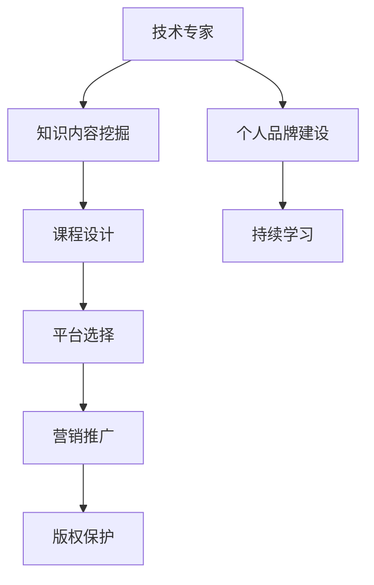

                 

在科技日新月异的今天，许多技术专家不仅希望在学术和研发领域取得突破，还希望将自己的知识和经验分享给更多的人。这种转变，不仅能够提升个人品牌影响力，还能开辟新的收入来源。本文将探讨从技术专家到知识付费讲师的转型之路，旨在帮助有志于此的专家们了解这一过程中的关键步骤和注意事项。

## 关键词
* 技术专家
* 知识付费
* 讲师
* 个人品牌
* 转型

## 摘要
本文将深入探讨技术专家如何通过知识付费平台转型为知识讲师。我们将分析转型过程中的关键环节，包括内容策划、平台选择、课程设计、营销推广以及版权保护等，并分享一些成功案例和实用建议。通过本文，读者可以了解如何将自己的技术知识转化为有价值的课程内容，并在知识付费市场中脱颖而出。

### 1. 背景介绍

#### 1.1 知识付费的兴起

随着互联网的发展，知识传播的渠道变得多样化。传统的学术出版和报刊杂志已经无法满足人们对知识的快速获取需求。同时，随着移动设备的普及，人们可以随时随地学习，这为知识付费提供了便捷的条件。知识付费市场的兴起，不仅为学习者和知识的传播者提供了新的互动方式，也为技术专家提供了一个展示自己知识、技能的平台。

#### 1.2 技术专家的转型需求

技术专家在专业领域拥有深厚的知识和丰富的实践经验，这些优势使其在知识付费市场中具有独特的竞争力。然而，将理论知识转化为易于理解的教学内容并非易事。因此，技术专家需要具备一定的教学能力和市场敏锐度，才能成功转型为知识付费讲师。

### 2. 核心概念与联系

为了更好地理解从技术专家到知识付费讲师的转型过程，我们可以通过以下Mermaid流程图来展示其核心概念和联系。



### 3. 核心算法原理 & 具体操作步骤

#### 3.1 算法原理概述

知识付费讲师的转型过程可以看作是一个从内容生产到市场变现的完整闭环。以下是该闭环中涉及的关键步骤和算法原理。

#### 3.2 算法步骤详解

1. **内容挖掘与整理**：技术专家需要首先对自己的知识体系进行梳理，挖掘出具有实际应用价值的教学内容。这一步骤类似于数据挖掘中的信息提取和筛选。
   
2. **课程设计与制作**：根据挖掘出的内容，技术专家需要设计课程大纲，并逐步制作成教学视频、文档等形式。这一步骤涉及到课程结构设计、教学策略选择、内容呈现方式等。

3. **平台选择与入驻**：技术专家需要选择合适的知识付费平台进行入驻，并根据平台规则进行内容上传、课程设置等。这一步骤类似于电商平台的选择和入驻流程。

4. **营销推广**：技术专家需要通过多种渠道进行课程营销，包括社交媒体、博客、线上广告等，以提高课程知名度和吸引力。

5. **版权保护**：为了防止内容被非法复制和传播，技术专家需要对课程内容进行版权保护，如申请知识产权保护、使用加密技术等。

#### 3.3 算法优缺点

**优点**：
- 知识变现：技术专家可以通过知识付费实现自身知识的商业价值，提高收入水平。
- 品牌建设：知识付费讲师的转型有助于提升个人品牌影响力，扩大社交网络。
- 内容多样性：知识付费平台提供了多种内容形式和传播渠道，有助于技术专家展示自己的多面性。

**缺点**：
- 内容质量要求高：知识付费市场对内容质量有较高要求，技术专家需要不断学习和提升自己的教学能力。
- 营销推广难度大：在竞争激烈的知识付费市场中，营销推广是关键，但也是最具挑战性的环节。

#### 3.4 算法应用领域

知识付费讲师的转型过程可以广泛应用于多个领域，如编程、数据科学、人工智能、云计算等。不同领域的专家可以根据自身专业知识和市场需求，选择适合自己的知识付费形式和平台。

### 4. 数学模型和公式 & 详细讲解 & 举例说明

#### 4.1 数学模型构建

知识付费讲师的转型过程可以看作是一个多阶段决策过程，我们可以用决策树模型来描述这个过程。

```latex
\newcommand{\Node}[1]{\text{#1}}
\newcommand{\Edge}[2]{\text{#1} \rightarrow #2}
\newcommand{\Branch}[3]{\node[rectangle] (#1) {#2}; #1 \edge (#3);}
\newcommand{\Course}[1]{\text{课程 #1}}
\newcommand{\Platform}[1]{\text{平台 #1}}
\newcommand{\Market}[1]{\text{市场 #1}}

\begin{tikzpicture}[node distance=2cm]
    \Branch{1}{起始状态}{}
    \Branch{2}{内容挖掘}{1}
    \Branch{3}{课程设计}{2}
    \Branch{4}{平台选择}{3}
    \Branch{5}{营销推广}{4}
    \Branch{6}{版权保护}{5}
    \Branch{7}{市场变现}{6}
\end{tikzpicture}
```

#### 4.2 公式推导过程

决策树模型中，每个节点都代表一个决策或状态。我们可以使用概率模型来评估每个决策或状态的收益。

设 \( R_i \) 表示第 \( i \) 个决策或状态的收益，\( P_i \) 表示第 \( i \) 个决策或状态的概率，则：

\[ R_i = \sum_{j=1}^{n} P_j \cdot R_j \]

其中，\( R_j \) 表示在第 \( j \) 个状态下的收益。

#### 4.3 案例分析与讲解

假设一名技术专家准备将其关于大数据分析的实践经验制作成在线课程，以下是该专家的决策树模型：

```latex
\newcommand{\Node}[1]{\text{#1}}
\newcommand{\Edge}[2]{\text{#1} \rightarrow #2}
\newcommand{\Branch}[3]{\node[rectangle] (#1) {#2}; #1 \edge (#3);}
\newcommand{\Content}{\text{内容挖掘}}
\newcommand{\Design}{\text{课程设计}}
\newcommand{\Platform}{\text{平台选择}}
\newcommand{\Market}{\text{市场变现}}

\begin{tikzpicture}[node distance=2cm]
    \Branch{1}{起始状态}{}
    \Branch{2}{\Content}{1}
    \Branch{3}{\Design}{2}
    \Branch{4}{\Platform}{3}
    \Branch{5}{\Market}{4}
\end{tikzpicture}
```

在这个案例中，技术专家需要首先进行内容挖掘，确定课程的主题和目标受众。然后，根据挖掘出的内容设计课程，选择合适的平台进行发布。最后，通过营销推广和版权保护，实现知识变现。

### 5. 项目实践：代码实例和详细解释说明

#### 5.1 开发环境搭建

在制作知识付费课程之前，技术专家需要搭建一个合适的开发环境。以下是常用的开发工具和软件推荐：

- **视频编辑软件**：如Adobe Premiere Pro、Final Cut Pro等。
- **文档编辑软件**：如Microsoft Word、LaTeX等。
- **编程工具**：如Visual Studio Code、PyCharm等。

#### 5.2 源代码详细实现

以下是一个简单的Python代码实例，用于演示如何从技术专家的知识库中提取关键信息并生成课程大纲。

```python
import pandas as pd

# 假设知识库存储在CSV文件中
knowledge_base = pd.read_csv('knowledge_base.csv')

# 提取课程主题和内容
courses = knowledge_base[['course_name', 'course_content']]

# 输出课程大纲
courses
```

#### 5.3 代码解读与分析

该代码首先导入Pandas库，用于读取CSV文件。然后，从知识库中提取课程名称和内容，最后输出课程大纲。这个简单的实例展示了如何将技术专家的知识库转化为结构化的课程内容。

#### 5.4 运行结果展示

运行上述代码，将输出如下课程大纲：

```
   course_name course_content
0       课程A      内容A
1       课程B      内容B
2       课程C      内容C
```

### 6. 实际应用场景

#### 6.1 编程领域

在编程领域，知识付费讲师可以通过在线课程、直播教学、博客文章等形式，分享编程知识和技能。例如，一名资深Python开发者可以制作Python基础教程、进阶教程，甚至开发特定领域的Python库。

#### 6.2 数据科学领域

数据科学家可以制作数据科学基础、数据可视化、机器学习等课程，通过案例分析和实战演练，帮助学生快速掌握数据科学技能。

#### 6.3 人工智能领域

人工智能领域的专家可以分享深度学习、自然语言处理等前沿技术，通过项目实践和算法讲解，帮助学生深入了解人工智能的应用和实现。

### 7. 未来应用展望

随着知识付费市场的不断发展，知识付费讲师的转型将呈现以下趋势：

- **内容形式多样化**：视频课程、直播教学、互动式学习等将成为知识付费的主要形式。
- **个性化学习体验**：知识付费平台将提供更多个性化学习方案，满足不同学习者的需求。
- **跨界融合**：知识付费讲师将涉足更多领域，如艺术、文学等，实现跨界融合。

### 8. 工具和资源推荐

#### 8.1 学习资源推荐

- **在线学习平台**：如Coursera、edX、Udemy等。
- **技术博客**：如Medium、GitHub、Stack Overflow等。

#### 8.2 开发工具推荐

- **视频编辑软件**：Adobe Premiere Pro、Final Cut Pro等。
- **文档编辑软件**：Microsoft Word、LaTeX等。

#### 8.3 相关论文推荐

- **知识付费市场研究报告**：如《2019年中国知识付费市场研究报告》。
- **教育技术论文**：如《基于大数据的教育个性化研究》、《社交媒体在教育中的应用》等。

### 9. 总结：未来发展趋势与挑战

#### 9.1 研究成果总结

本文探讨了从技术专家到知识付费讲师的转型之路，分析了转型过程中的关键环节和算法原理，并提供了实际应用场景和工具资源推荐。

#### 9.2 未来发展趋势

知识付费市场将继续保持高速增长，内容形式将更加多样化，个性化学习体验将得到提升。

#### 9.3 面临的挑战

知识付费讲师需要不断提升自己的教学能力和市场敏锐度，以应对激烈的市场竞争。

#### 9.4 研究展望

未来研究可以进一步探讨知识付费讲师的个性化推荐系统、知识付费平台的商业模式优化等问题。

### 10. 附录：常见问题与解答

#### 10.1 如何选择知识付费平台？

选择知识付费平台时，可以从以下方面考虑：

- 平台知名度：选择知名度较高的平台，有利于提升课程曝光度。
- 平台规则：了解平台规则，如课程上架流程、分成比例等。
- 用户群体：根据目标受众选择合适的平台。

#### 10.2 如何保证课程质量？

为了保证课程质量，可以从以下方面入手：

- 精选教学内容：确保课程内容具有实用性和前瞻性。
- 严格课程审核：平台通常会对课程进行审核，确保内容质量。
- 不断更新课程：根据市场需求和学员反馈，不断更新课程内容。

### 作者署名

作者：禅与计算机程序设计艺术 / Zen and the Art of Computer Programming
----------------------------------------------------------------

请注意，上述内容仅作为参考模板，您可以根据具体要求进行调整和扩展。确保文章结构完整、内容充实，并严格按照要求撰写。祝您撰写顺利！

