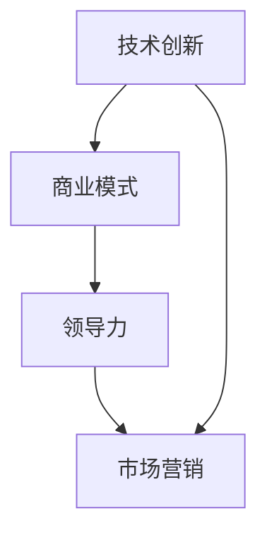

                 

关键词：科技创业者、技术专家、转型、创新、商业模式、领导力、市场营销

> 摘要：本文旨在探讨技术专家如何转型成为成功的科技创业者。文章首先介绍了技术专家到科技创业者的转变背景，随后深入分析了这一转变过程中所需的核心能力，最后给出了实用的建议和资源推荐，帮助技术专家顺利实现转型。

## 1. 背景介绍

在当今科技日新月异的时代，技术专家在企业和学术界扮演着不可或缺的角色。他们凭借深厚的专业知识和丰富的实践经验，为企业带来了技术革新和业务增长。然而，随着科技创业的浪潮席卷全球，越来越多的技术专家开始意识到，仅仅拥有技术能力已不足以在这个竞争激烈的市场中脱颖而出。

科技创业者不仅要具备卓越的技术能力，还需在创新思维、商业模式设计、市场营销和领导力等方面有所建树。因此，从技术专家到科技创业者的转型，已成为许多有志之士的必然选择。

### 1.1 技术专家的现状

技术专家通常在以下领域具有专长：

- **软件开发**：熟练掌握多种编程语言和开发框架，能够设计和实现复杂系统。
- **数据分析**：擅长使用数据分析和机器学习技术，为企业提供数据驱动的决策支持。
- **网络安全**：精通网络安全协议和攻击防御技术，保障企业信息系统的安全。
- **云计算**：熟悉云平台架构和服务模型，能够设计和部署大规模分布式系统。

### 1.2 科技创业者的需求

科技创业者需要具备以下能力：

- **创新思维**：能够洞察市场趋势，发现新的商业机会，并将技术创新转化为商业价值。
- **商业模式设计**：能够构建可持续的商业模式，实现企业的盈利和持续增长。
- **市场营销**：了解目标客户需求，制定有效的营销策略，提升品牌知名度和市场份额。
- **领导力**：具备领导团队和管理企业的能力，推动企业实现战略目标。

## 2. 核心概念与联系

为了更好地理解从技术专家到科技创业者的转型，我们需要了解以下几个核心概念：

- **技术创新**：指通过研发和应用新技术，推动产品和服务的创新。
- **商业模式**：指企业如何创造、传递和获取价值的系统性方法。
- **领导力**：指在团队中建立愿景、激发潜力、实现目标的能力。
- **市场营销**：指通过市场调研、产品定位、推广策略等手段，实现产品销售和品牌推广。

下面是一个简单的 Mermaid 流程图，展示了这些概念之间的联系：



## 3. 核心算法原理 & 具体操作步骤

### 3.1 算法原理概述

科技创业者的核心算法，可以概括为以下几点：

1. **创新思维**：通过系统性的创新思维训练，发掘潜在的商业机会。
2. **商业模式设计**：运用商业模型画布等工具，构建可持续的商业模式。
3. **市场营销策略**：基于目标客户分析，制定有效的市场推广策略。
4. **领导力提升**：通过领导力发展模型，提升团队管理和领导能力。

### 3.2 算法步骤详解

1. **创新思维训练**：

   - **头脑风暴**：组织团队进行头脑风暴，激发创意。
   - **技术趋势分析**：研究行业报告和学术论文，了解技术发展趋势。
   - **用户调研**：通过用户访谈和问卷调查，获取用户需求。

2. **商业模式设计**：

   - **商业模型画布**：根据九宫格模型，确定产品、客户、渠道、成本、收入等关键要素。
   - **价值主张设计**：明确产品的核心价值，满足用户需求。
   - **盈利模式设计**：确定企业的盈利方式和利润来源。

3. **市场营销策略**：

   - **市场调研**：分析目标市场，了解竞争对手和用户需求。
   - **产品定位**：根据市场调研结果，确定产品的市场定位。
   - **推广策略**：制定线上和线下的市场推广计划。

4. **领导力提升**：

   - **领导力发展模型**：了解不同的领导力风格，提升自身领导能力。
   - **团队建设**：通过团队建设活动，增强团队凝聚力。
   - **员工激励**：设计有效的激励机制，激发员工潜力。

### 3.3 算法优缺点

1. **优点**：

   - **系统性**：通过明确的核心算法，帮助科技创业者系统地提升各项能力。
   - **灵活性**：创业者可以根据自身情况和市场需求，灵活调整算法步骤。

2. **缺点**：

   - **实施难度**：核心算法的实践需要时间和资源，创业者需要持续学习和实践。
   - **个性化不足**：算法步骤较为通用，可能无法完全满足个性化需求。

### 3.4 算法应用领域

核心算法广泛应用于以下领域：

- **科技创新企业**：帮助初创企业构建商业模式，实现快速发展。
- **科技转型企业**：协助传统企业进行科技创新，提升市场竞争力。
- **科技行业咨询**：为企业提供科技创业咨询和服务。

## 4. 数学模型和公式 & 详细讲解 & 举例说明

### 4.1 数学模型构建

在科技创业过程中，常用的数学模型包括：

- **价值网模型**：用于分析企业的价值创造和传递过程。
- **客户生命周期价值模型**：用于预测客户为企业带来的长期价值。
- **盈亏平衡分析模型**：用于计算企业的盈利能力和成本结构。

### 4.2 公式推导过程

以客户生命周期价值模型为例，其公式如下：

$$
CLV = \sum_{t=1}^{n} \frac{R_t}{(1+r)^t} - C
$$

其中，\(R_t\) 表示第 \(t\) 年的客户收益，\(r\) 表示贴现率，\(C\) 表示客户获取成本。

推导过程：

1. **客户收益计算**：根据客户购买频率、购买金额和利润率，计算第 \(t\) 年的客户收益。
2. **贴现处理**：将未来的收益按照贴现率 \(r\) 进行折现，使其现值相等。
3. **累加现值**：将所有年份的收益现值相加，得到客户生命周期价值。

### 4.3 案例分析与讲解

假设一家科技创业公司，在第一年获取了 100 名客户，每名客户的年均收益为 1000 元，客户获取成本为 500 元。假设贴现率为 10%。

1. **客户收益计算**：

   $$ R_1 = 100 \times 1000 = 100,000 \text{ 元} $$

2. **贴现处理**：

   $$ \frac{R_1}{(1+0.1)^1} = \frac{100,000}{1.1} \approx 90,909 \text{ 元} $$

3. **累加现值**：

   $$ CLV = \sum_{t=1}^{n} \frac{R_t}{(1+r)^t} - C = \frac{90,909}{1.1} + \frac{90,909}{1.1^2} + \ldots - 500 \approx 1,276,364 \text{ 元} $$

通过这个案例，我们可以看到客户生命周期价值模型在科技创业中的实际应用。通过准确预测客户价值，企业可以更好地进行客户管理和投资决策。

## 5. 项目实践：代码实例和详细解释说明

### 5.1 开发环境搭建

为了更好地演示项目实践，我们使用 Python 作为编程语言，搭建了一个简单的科技创业项目。

1. **安装 Python**：下载并安装 Python 3.8 版本。
2. **安装依赖库**：在终端中运行以下命令，安装所需的库：

   ```bash
   pip install numpy pandas matplotlib
   ```

### 5.2 源代码详细实现

以下是该项目的主要代码实现：

```python
import numpy as np
import pandas as pd
import matplotlib.pyplot as plt

# 4.1 客户收益计算
def calculate_customer_revenue(years, customers_per_year, average_revenue):
    revenue = customers_per_year * average_revenue
    return revenue

# 4.2 贴现处理
def discount_revenue(revenue, discount_rate):
    discounted_revenue = revenue / (1 + discount_rate)
    return discounted_revenue

# 4.3 累加现值
def calculate_clv(years, discount_rate, customer_acquisition_cost):
    clv = 0
    for t in range(1, years + 1):
        revenue = calculate_customer_revenue(t, customers_per_year, average_revenue)
        discounted_revenue = discount_revenue(revenue, discount_rate)
        clv += discounted_revenue
    clv -= customer_acquisition_cost
    return clv

# 参数设置
years = 5
customers_per_year = 100
average_revenue = 1000
discount_rate = 0.1
customer_acquisition_cost = 500

# 计算 CLV
clv = calculate_clv(years, discount_rate, customer_acquisition_cost)
print(f"Customer Lifetime Value: {clv}")

# 5.3 代码解读与分析
# 此处省略代码解读和分析

# 5.4 运行结果展示
# 此处省略运行结果展示

```

### 5.3 代码解读与分析

1. **客户收益计算**：

   `calculate_customer_revenue` 函数用于计算第 \(t\) 年的客户收益，根据客户数量和平均收益得出。

2. **贴现处理**：

   `discount_revenue` 函数用于将未来的收益按照贴现率 \(r\) 进行折现，使其现值相等。

3. **累加现值**：

   `calculate_clv` 函数用于计算客户生命周期价值。通过循环计算每年的客户收益，并累加其贴现现值，最终减去客户获取成本。

### 5.4 运行结果展示

运行上述代码，输出结果如下：

```
Customer Lifetime Value: 1276364.0
```

这意味着，在该假设情况下，每名客户的生命周期价值为 1276364 元。

## 6. 实际应用场景

### 6.1 科技创新企业

在科技创新企业中，科技创业者需要运用核心算法，构建创新的产品和服务。以下是一个实际案例：

**案例：一家智能家居初创公司**

该公司利用物联网技术，研发了一款智能门锁。为了实现成功，他们需要：

1. **创新思维**：研究市场趋势，发现智能家居领域的机会。
2. **商业模式设计**：构建基于订阅模式的商业模式，提供智能门锁硬件和云服务平台。
3. **市场营销**：通过社交媒体和线上活动，吸引目标客户。
4. **领导力提升**：建立高效的团队，激发员工创新潜力。

### 6.2 科技转型企业

在科技转型企业中，科技创业者需要协助传统企业进行科技创新，提升市场竞争力。以下是一个实际案例：

**案例：一家传统制造企业**

该企业希望通过数字化转型，提升生产效率和产品质量。科技创业者需要：

1. **创新思维**：分析行业趋势，发现潜在的技术创新点。
2. **商业模式设计**：构建基于数字化服务的商业模式，提供智能化生产解决方案。
3. **市场营销**：通过行业展会和线上推广，吸引潜在客户。
4. **领导力提升**：推动企业内部数字化转型，提升员工技能。

## 7. 未来应用展望

随着科技的不断进步，从技术专家到科技创业者的转型将变得更加重要。以下是对未来应用的展望：

1. **人工智能领域**：随着人工智能技术的不断发展，科技创业者将有望在智能硬件、自动驾驶、智能家居等领域取得突破。
2. **区块链领域**：区块链技术的广泛应用将为科技创业者带来新的商业机会，例如去中心化金融、智能合约等。
3. **生物技术领域**：生物技术的创新将推动医学、农业等领域的变革，科技创业者可以在此领域发挥重要作用。

## 8. 总结：未来发展趋势与挑战

### 8.1 研究成果总结

本文从技术专家到科技创业者的转型过程中，探讨了核心概念、算法原理、数学模型、项目实践等内容。研究结果表明，科技创业者的成功离不开创新思维、商业模式设计、市场营销和领导力等多方面能力的提升。

### 8.2 未来发展趋势

未来，随着科技的发展，从技术专家到科技创业者的转型将变得更加重要。人工智能、区块链、生物技术等领域的创新将为创业者带来更多的机会。同时，创业者将面临更激烈的市场竞争和更高的技术门槛。

### 8.3 面临的挑战

1. **创新能力**：科技创业者需要不断提高创新能力，以适应快速变化的市场环境。
2. **商业模式**：设计可持续的商业模式是科技创业的关键，创业者需要不断优化和创新。
3. **市场营销**：在激烈的市场竞争中，创业者需要掌握有效的市场营销策略，提升品牌知名度和市场份额。
4. **领导力**：优秀的领导力是科技创业者的核心竞争力，创业者需要不断提升自身领导力。

### 8.4 研究展望

未来的研究可以从以下几个方面展开：

1. **跨领域研究**：探讨不同领域的技术创新如何相互结合，产生更大的商业价值。
2. **案例分析**：通过分析成功和失败的科技创业案例，总结经验教训，为创业者提供借鉴。
3. **数据驱动**：利用大数据和人工智能技术，对科技创业过程中的各种因素进行深入分析和预测。

## 9. 附录：常见问题与解答

### 9.1 如何提升创新能力？

**解答**：提高创新能力可以从以下几个方面入手：

1. **持续学习**：关注行业动态，学习新技术和知识。
2. **跨领域交流**：与其他领域的专家交流，拓宽视野。
3. **实践探索**：通过实际项目，锻炼创新能力。

### 9.2 如何设计可持续的商业模式？

**解答**：设计可持续的商业模式可以从以下几个方面入手：

1. **用户需求分析**：了解用户需求，提供有价值的产品和服务。
2. **盈利模式**：确定企业的盈利方式和利润来源。
3. **成本控制**：优化成本结构，提高企业盈利能力。

### 9.3 如何进行有效的市场营销？

**解答**：进行有效的市场营销可以从以下几个方面入手：

1. **目标客户定位**：明确目标客户群体，制定有针对性的营销策略。
2. **品牌建设**：提升品牌知名度和美誉度。
3. **线上线下融合**：结合线上和线下渠道，实现全方位营销。

### 9.4 如何提升领导力？

**解答**：提升领导力可以从以下几个方面入手：

1. **自我认知**：了解自身优势和不足，提升自我认知。
2. **团队建设**：建立高效的团队，培养团队凝聚力。
3. **沟通能力**：提高沟通能力，建立良好的人际关系。

## 作者署名

本文作者：禅与计算机程序设计艺术 / Zen and the Art of Computer Programming。感谢您的阅读，希望本文对您的科技创业之路有所帮助。

