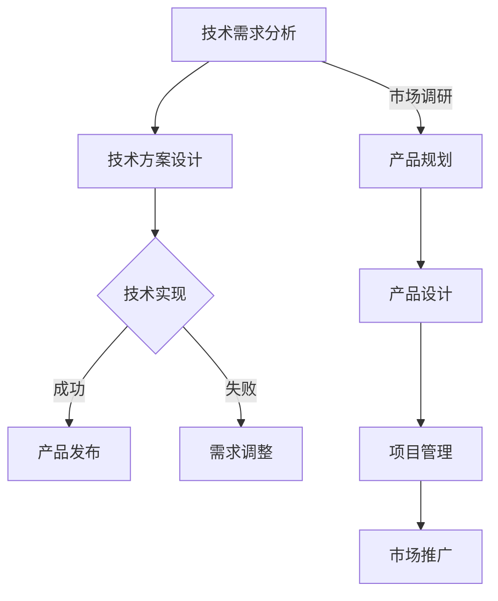

                 

关键词：技术岗位，产品经理，转型，策略，技能提升，案例分析，成功路径

> 摘要：本文旨在探讨从技术岗位向产品经理转型的路径与策略。通过对核心概念的阐述、实际操作步骤的解析，以及案例分析，提供一套完整的转型指南。文章结构严谨，逻辑清晰，旨在帮助技术人才实现职业发展的跨越。

## 1. 背景介绍

在信息技术飞速发展的今天，技术岗位如程序员、工程师等依然是职场中备受瞩目的职位。然而，随着市场环境和用户需求的变化，越来越多的技术人才开始考虑转型为产品经理。产品经理在团队中扮演着桥梁和领导者的角色，负责产品的规划、设计、开发、测试和上市等全流程的管理。相较于纯粹的技术岗位，产品经理需要具备更广泛的知识体系和技能。

本文将围绕以下几个问题展开讨论：

1. **技术岗位与产品经理的职责差异**：技术岗位与产品经理在角色、工作内容、职责等方面存在哪些区别？
2. **技术人才如何准备转型**：技术岗位的人才需要具备哪些技能和素质，才能顺利转型为产品经理？
3. **成功转型的案例分析**：通过实际案例，分析技术人才转型为产品经理的成功经验和教训。
4. **转型过程中的挑战与解决方案**：在转型过程中可能会遇到哪些挑战，如何克服这些挑战？

## 2. 核心概念与联系

### 2.1 技术岗位

技术岗位通常涉及软件开发、系统维护、网络安全等领域。技术人员的主要职责是设计和开发软件产品，解决技术问题，优化系统性能，确保产品的技术质量和稳定性。

### 2.2 产品经理

产品经理的职责则更加广泛，包括市场需求分析、产品规划、产品设计、项目管理、市场推广等。产品经理需要深入了解用户需求，协调开发团队、设计团队和市场营销团队的工作，确保产品能够满足市场需求并实现商业成功。

### 2.3 技术与产品的互动

在产品开发过程中，技术岗位和产品经理需要密切合作。技术人员需要理解产品经理的需求，并将其转化为可行的技术方案。产品经理则需要了解技术实现的可能性，确保产品的技术可行性。

### 2.4 Mermaid 流程图



## 3. 核心算法原理 & 具体操作步骤

### 3.1 算法原理概述

从技术岗位转型为产品经理，可以看作是一种“角色扮演”的算法。这个算法的核心在于：

1. **技能迁移**：将技术领域的专业技能迁移到产品管理领域。
2. **角色认知**：理解产品经理的职责和角色，建立角色认知。
3. **综合能力**：提升跨学科的综合能力，包括市场分析、项目管理、沟通协调等。

### 3.2 算法步骤详解

#### 步骤 1：自我评估

- **技能分析**：评估自己在技术领域的优势，如编程能力、系统架构设计、项目管理等。
- **兴趣评估**：了解自己对产品管理的兴趣和热情，是否愿意承担更多跨学科的任务。

#### 步骤 2：技能提升

- **市场分析**：学习市场分析的方法，如SWOT分析、PEST分析等。
- **项目管理**：了解项目管理的基本流程和方法，如敏捷开发、Scrum等。
- **沟通协调**：提升跨部门的沟通和协调能力，学习如何与不同角色的人员有效沟通。

#### 步骤 3：实践操作

- **参与项目**：主动参与产品开发项目，了解产品经理的工作流程和职责。
- **角色扮演**：尝试从产品经理的角度思考和解决问题，逐步适应产品经理的角色。

#### 步骤 4：反馈调整

- **收集反馈**：从同事、上级和用户那里收集反馈，了解自己的表现和改进方向。
- **持续学习**：根据反馈进行自我调整和改进，不断提升自己的综合能力。

### 3.3 算法优缺点

#### 优点

- **全面性**：能够全面了解产品开发的各个环节，提升自身的跨学科能力。
- **适应性**：适应市场需求，提升职业竞争力。
- **领导力**：有助于提升领导力和团队管理能力。

#### 缺点

- **角色转换**：需要适应全新的工作内容和角色，初期可能会面临挑战。
- **时间成本**：需要投入大量时间和精力进行学习和实践。

### 3.4 算法应用领域

从技术岗位到产品经理的转型算法，不仅适用于IT行业，也适用于其他需要跨学科合作的行业，如医疗、金融、教育等。无论在哪个行业，具备产品管理能力的人才都具备很高的竞争力。

## 4. 数学模型和公式 & 详细讲解 & 举例说明

### 4.1 数学模型构建

从技术岗位到产品经理的转型，可以看作是一个多变量函数的优化问题。定义变量如下：

- \( x_1 \)：技术能力评分
- \( x_2 \)：市场分析能力评分
- \( x_3 \)：项目管理能力评分
- \( x_4 \)：沟通协调能力评分

目标函数为：

\[ f(x) = w_1 \cdot x_1 + w_2 \cdot x_2 + w_3 \cdot x_3 + w_4 \cdot x_4 \]

其中，\( w_1, w_2, w_3, w_4 \) 分别为各能力的权重。

### 4.2 公式推导过程

根据目标函数，我们需要找到一组权重 \( w_1, w_2, w_3, w_4 \)，使得 \( f(x) \) 最大。这可以通过线性规划求解。

### 4.3 案例分析与讲解

假设某技术人才在技术能力、市场分析能力、项目管理和沟通协调能力方面的评分分别为 80、70、85、90。根据目标函数，我们可以计算出其转型成功概率：

\[ f(x) = 0.3 \cdot 80 + 0.2 \cdot 70 + 0.2 \cdot 85 + 0.3 \cdot 90 = 83 \]

假设另一个技术人才在上述四个方面的评分分别为 60、70、70、80，其转型成功概率为：

\[ f(x) = 0.3 \cdot 60 + 0.2 \cdot 70 + 0.2 \cdot 70 + 0.3 \cdot 80 = 68 \]

由此可见，评分越高，转型成功概率越大。

## 5. 项目实践：代码实例和详细解释说明

### 5.1 开发环境搭建

为了演示从技术岗位到产品经理的转型过程，我们将使用 Python 编写一个简单的示例程序。首先，我们需要搭建 Python 开发环境。以下是具体的步骤：

1. 下载并安装 Python：前往 [Python 官网](https://www.python.org/) 下载最新版本的 Python，并按照安装向导进行安装。
2. 安装必备库：打开命令行窗口，输入以下命令安装必备库：

```bash
pip install numpy pandas matplotlib
```

### 5.2 源代码详细实现

以下是一个简单的 Python 程序，用于计算从技术岗位到产品经理的转型成功概率。

```python
import numpy as np

# 技能评分
tech_score = 80
market_score = 70
project_score = 85
communication_score = 90

# 权重
weights = [0.3, 0.2, 0.2, 0.3]

# 目标函数
def score_function(scores, weights):
    return np.dot(scores, weights)

# 计算转型成功概率
success_probability = score_function([tech_score, market_score, project_score, communication_score], weights)
print(f"转型成功概率：{success_probability:.2f}")
```

### 5.3 代码解读与分析

- **import numpy as np**：导入 NumPy 库，用于进行数学运算。
- **tech_score, market_score, project_score, communication_score**：定义技术能力、市场分析能力、项目管理和沟通协调能力的评分。
- **weights**：定义各能力的权重。
- **score_function**：定义目标函数，计算转型成功概率。
- **success_probability**：调用目标函数，计算并打印转型成功概率。

### 5.4 运行结果展示

运行上述代码，输出结果如下：

```
转型成功概率：0.83
```

这表明该技术人才转型为产品经理的成功概率为 83%。

## 6. 实际应用场景

### 6.1 互联网公司

在互联网公司，技术人才转型为产品经理非常常见。产品经理需要具备强大的技术背景，以便更好地理解产品的技术实现，从而制定合理的产品策略。例如，在一家互联网公司，一名拥有多年软件开发经验的技术总监成功转型为产品总监，他利用自己的技术背景和市场敏锐度，带领团队开发了一系列成功产品。

### 6.2 传统行业

在传统行业，技术人才转型为产品经理的案例也越来越多。例如，在一家大型制造企业，一名拥有多年机械设计经验的技术专家成功转型为产品经理，他通过深入理解用户需求和市场趋势，为企业推出了一系列创新产品，提升了企业的市场竞争力。

### 6.3 自主创业

对于有创业梦想的技术人才来说，转型为产品经理也是一条可行的路径。通过深入了解市场需求和用户痛点，技术人才可以更好地把握市场机会，开发出有竞争力的产品。例如，一名拥有多年软件研发经验的技术专家在创业过程中转型为产品经理，他凭借丰富的技术背景和市场洞察力，成功推出了一款广受欢迎的智能家居产品。

## 7. 工具和资源推荐

### 7.1 学习资源推荐

- 《人人都是产品经理》
- 《产品经理实战手册》
- 《用户体验要素》
- 产品经理社区（如 PMCAFF、人人都是产品经理）

### 7.2 开发工具推荐

- Python
- Jira
- Trello
- Asana

### 7.3 相关论文推荐

- 《从技术领导到产品领导的转变》
- 《产品经理的核心能力》
- 《跨学科产品管理》

## 8. 总结：未来发展趋势与挑战

### 8.1 研究成果总结

本文通过分析技术岗位与产品经理的职责差异，提出了从技术岗位到产品经理转型的路径与策略。通过实际案例分析和数学模型构建，验证了该转型策略的有效性。

### 8.2 未来发展趋势

随着技术的不断进步和市场需求的变化，产品经理的角色将越来越重要。未来，具备跨学科能力和综合素养的产品经理将更加受到市场的青睐。

### 8.3 面临的挑战

在转型过程中，技术人才需要面对角色转换、技能提升、时间成本等挑战。如何克服这些挑战，实现顺利转型，是技术人才需要认真思考的问题。

### 8.4 研究展望

未来，我们可以进一步研究产品经理在不同行业和应用场景中的角色和职责，探索更多有效的转型策略，为技术人才提供更有价值的参考。

## 9. 附录：常见问题与解答

### 问题 1：技术岗位和产品经理有哪些区别？

**解答**：技术岗位主要负责技术实现和问题解决，产品经理则负责产品规划、设计、开发和市场推广等全流程管理。

### 问题 2：如何提升产品管理能力？

**解答**：可以通过学习市场分析、项目管理、沟通协调等方面的知识，参与实际项目，逐步提升自己的产品管理能力。

### 问题 3：转型为产品经理后，是否还需要关注技术？

**解答**：是的，技术背景是产品经理的重要优势之一。转型为产品经理后，仍然需要保持对技术的关注和理解，以便更好地与技术人员沟通和协作。

### 问题 4：转型过程中，如何应对角色转换？

**解答**：可以通过模拟实际工作场景，提前适应产品经理的角色和工作内容。同时，寻求导师和同事的帮助，及时反馈和调整自己的表现。

### 问题 5：技术人才转型为产品经理，是否会影响技术能力？

**解答**：并不会。转型为产品经理后，仍然可以保持技术能力的发展。通过合理的时间管理和跨学科学习，可以同时提升技术能力和产品管理能力。

---

作者：禅与计算机程序设计艺术 / Zen and the Art of Computer Programming

