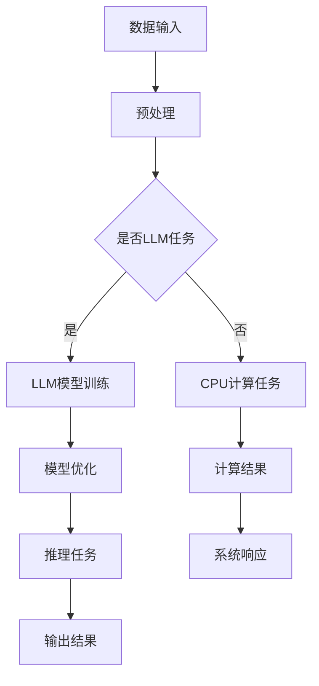

                 

关键词：自然语言处理，深度学习，指令集架构，CPU设计，LLM与CPU对比，神经网络模型，计算性能优化

摘要：本文深入探讨了自然语言处理领域的先进模型——大型语言模型（LLM）与计算机处理器中的核心组件——CPU之间的深度对比。文章首先介绍了LLM的基本原理和应用场景，随后详细分析了CPU的架构设计，包括指令集、流水线和并行计算等关键要素。通过对比两者在计算性能、数据处理能力和能效方面的差异，文章揭示了两者在设计目标和应用上的本质区别。此外，本文还展望了未来LLM与CPU结合的可能趋势，以及这一结合对未来计算技术发展的影响。

## 1. 背景介绍

在当今信息技术高速发展的时代，计算能力已成为推动科技进步的关键因素。无论是数据中心、云计算平台，还是移动设备，高性能计算的需求无处不在。大型语言模型（LLM）和中央处理器（CPU）作为现代计算技术的重要构件，分别代表了人工智能和传统计算机硬件领域的最新成就。

LLM，即大型语言模型，是自然语言处理（NLP）领域的一种先进模型，它基于深度学习技术，通过大规模的数据训练和参数优化，能够理解和生成人类语言。LLM的出现极大地提升了NLP任务的效率和准确性，使得机器翻译、文本生成、问答系统等应用变得日益普及和智能化。

另一方面，CPU作为计算机系统的核心组件，负责执行各种计算任务，其性能直接影响着整个系统的运行效率。随着摩尔定律的逼近极限，CPU的设计理念和技术也在不断演进，从传统的冯·诺伊曼架构到现代的多核处理器，CPU的架构和指令集经历了显著的变革。

本文的目的在于深入对比LLM与CPU这两大计算引擎，分析它们在性能、数据处理能力和能效方面的差异，探讨两者在未来计算技术发展中的潜在结合点。通过对这些关键问题的探讨，本文旨在为读者提供对现代计算技术更深刻的理解和洞察。

## 2. 核心概念与联系

### 2.1. 大型语言模型（LLM）

大型语言模型（LLM）是自然语言处理（NLP）领域的一种先进模型，它基于深度学习技术，通过大规模的数据训练和参数优化，能够理解和生成人类语言。LLM通常包含数十亿甚至数千亿个参数，能够捕捉语言中的复杂模式和上下文信息。

### 2.2. 中央处理器（CPU）

中央处理器（CPU）是计算机系统的核心组件，负责执行各种计算任务。CPU的架构设计包括多个方面，如指令集、流水线和并行计算等。指令集是CPU能够理解和执行的一系列操作命令，而流水线技术通过将指令处理过程划分为多个阶段，提高了指令执行的效率。并行计算则利用多个处理单元同时执行多个任务，进一步提升计算性能。

### 2.3. LLM与CPU的联系

LLM与CPU在计算任务和处理方式上存在显著差异。LLM主要用于处理自然语言数据，如文本生成、翻译和问答等，其核心是大规模的神经网络结构，通过对海量数据的学习和优化，实现语言理解和生成的目标。而CPU则主要用于执行各种计算任务，包括数值计算、数据处理和系统管理等。

尽管两者的应用领域不同，但它们之间的联系在于：LLM的运行依赖于CPU的计算能力。具体来说，LLM的训练和推理过程需要大量的计算资源，这些资源主要来自于高性能的CPU。因此，CPU的性能直接影响LLM的应用效果。

### 2.4. Mermaid 流程图

为了更直观地展示LLM与CPU之间的联系，我们使用Mermaid流程图来描述两者的工作流程。



在该流程图中，数据输入经过预处理后，根据任务类型决定是进行LLM模型训练还是CPU计算任务。LLM模型训练和推理任务依赖于CPU的计算能力，最终输出结果并反馈给系统。

## 3. 核心算法原理 & 具体操作步骤

### 3.1. 算法原理概述

大型语言模型（LLM）的核心算法原理基于深度学习技术，特别是神经网络（Neural Networks）。神经网络通过模仿人脑神经元的工作方式，将输入数据通过多层非线性变换，最终输出结果。在LLM中，这些变换过程通常包含数十亿个参数，通过训练学习输入数据和标签之间的映射关系。

LLM的训练过程主要包括以下步骤：

1. **数据预处理**：将原始文本数据转换为适合神经网络处理的形式，通常包括分词、编码和序列化。
2. **模型初始化**：初始化神经网络模型，包括设置参数的初始值。
3. **前向传播**：将输入数据传递到神经网络中，通过逐层计算得到输出结果。
4. **损失函数计算**：计算输出结果与实际标签之间的差距，通常使用交叉熵（Cross-Entropy）作为损失函数。
5. **反向传播**：通过反向传播算法计算梯度，更新模型参数。
6. **迭代优化**：重复上述步骤，不断优化模型参数，直至满足停止条件。

### 3.2. 算法步骤详解

下面是LLM算法的具体操作步骤：

#### 步骤1：数据预处理

```latex
\text{输入文本} \rightarrow \text{分词} \rightarrow \text{编码} \rightarrow \text{序列化}
```

分词是将文本分解为单词或短语的过程，编码是将文本转换为数字表示，序列化是将编码后的文本转换为神经网络可处理的格式。

#### 步骤2：模型初始化

初始化神经网络模型的参数，通常使用随机值或预训练模型。初始化过程包括设置权重矩阵和偏置项的初始值。

#### 步骤3：前向传播

将输入序列传递到神经网络中，通过多层非线性变换得到输出结果。每一层输出通过激活函数进行处理，以引入非线性特性。

#### 步骤4：损失函数计算

计算输出结果与实际标签之间的差距，通常使用交叉熵作为损失函数。交叉熵损失函数衡量的是预测分布与真实分布之间的差异。

#### 步骤5：反向传播

通过反向传播算法计算梯度，更新模型参数。梯度是损失函数对参数的偏导数，表示参数对损失函数的影响程度。

#### 步骤6：迭代优化

重复前向传播和反向传播过程，不断更新模型参数，直至满足停止条件。停止条件可以是模型性能达到某个阈值或训练迭代次数达到预设值。

### 3.3. 算法优缺点

#### 优点：

- **强大建模能力**：LLM能够捕捉语言中的复杂模式和上下文信息，具有强大的建模能力。
- **自适应性强**：通过大规模训练，LLM能够自适应不同领域的语言数据，提高任务处理效率。

#### 缺点：

- **计算资源消耗大**：LLM的训练和推理过程需要大量计算资源，对硬件要求较高。
- **数据依赖性强**：LLM的性能依赖于训练数据的质量和数量，数据不足或质量差可能导致模型效果不佳。

### 3.4. 算法应用领域

LLM在自然语言处理领域具有广泛的应用，包括但不限于以下方面：

- **机器翻译**：LLM能够高效地进行跨语言翻译，具有高准确性和自然性。
- **文本生成**：LLM能够生成文章、段落或句子，应用于内容创作、广告文案等场景。
- **问答系统**：LLM能够理解和回答用户的问题，应用于智能客服、教育辅导等场景。

## 4. 数学模型和公式 & 详细讲解 & 举例说明

### 4.1. 数学模型构建

大型语言模型（LLM）的数学模型主要基于深度神经网络（DNN）。在DNN中，每个神经元都可以看作是一个简单的函数，多个神经元组成一个层，通过前向传播和反向传播算法进行学习。以下是LLM中常用的数学模型：

#### 4.1.1. 前向传播

前向传播过程包括以下几个步骤：

1. **输入层到隐藏层的传播**：将输入数据传递到隐藏层，通过线性变换和激活函数得到输出。
   $$ z^{(l)} = W^{(l)} \cdot a^{(l-1)} + b^{(l)} $$
   $$ a^{(l)} = \sigma(z^{(l)}) $$
   其中，$z^{(l)}$ 是第$l$层的输入，$W^{(l)}$ 是权重矩阵，$b^{(l)}$ 是偏置项，$\sigma$ 是激活函数。

2. **隐藏层到输出层的传播**：将隐藏层的输出传递到输出层，通过线性变换得到最终输出。
   $$ z^{(L)} = W^{(L)} \cdot a^{(L-1)} + b^{(L)} $$
   $$ \hat{y} = \sigma(z^{(L)}) $$

#### 4.1.2. 损失函数

在深度神经网络中，损失函数用于衡量模型预测结果与实际结果之间的差距。常用的损失函数包括交叉熵（Cross-Entropy）和均方误差（Mean Squared Error，MSE）。

交叉熵损失函数用于分类任务，其公式如下：
$$ L = -\sum_{i} y_i \log(\hat{y}_i) $$
其中，$y_i$ 是实际标签，$\hat{y}_i$ 是模型预测概率。

### 4.2. 公式推导过程

在LLM的训练过程中，我们需要通过反向传播算法计算梯度，并更新模型参数。以下是梯度推导的过程：

#### 4.2.1. 输出层梯度

输出层的梯度可以通过损失函数对输出层的偏导数计算得到：
$$ \frac{\partial L}{\partial z^{(L)}} = \sigma'(z^{(L)}) - y $$
$$ \frac{\partial L}{\partial W^{(L)}} = a^{(L-1)} $$
$$ \frac{\partial L}{\partial b^{(L)}} = -1 $$

#### 4.2.2. 隐藏层梯度

对于第$l$层的隐藏层，其梯度可以通过链式法则计算：
$$ \frac{\partial L}{\partial z^{(l)}} = \sigma'(z^{(l)}) \cdot \frac{\partial L}{\partial z^{(l+1)}} $$
$$ \frac{\partial L}{\partial W^{(l)}} = a^{(l-1)} $$
$$ \frac{\partial L}{\partial b^{(l)}} = -1 $$

#### 4.2.3. 梯度下降

在计算得到梯度后，我们可以通过梯度下降算法更新模型参数。具体来说，更新公式如下：
$$ W^{(l)} = W^{(l)} - \alpha \cdot \frac{\partial L}{\partial W^{(l)}} $$
$$ b^{(l)} = b^{(l)} - \alpha \cdot \frac{\partial L}{\partial b^{(l)}} $$
其中，$\alpha$ 是学习率。

### 4.3. 案例分析与讲解

以下是一个简单的案例，用于说明LLM的数学模型和公式推导过程。

#### 案例背景

假设我们有一个二分类问题，输入数据为$x \in \{0, 1\}$，实际标签为$y \in \{0, 1\}$。我们需要训练一个LLM模型，使其能够预测$x$对应的标签。

#### 案例步骤

1. **数据预处理**：将输入数据和标签编码为数字序列，例如$x = [0, 1, 0, 1]$，$y = [0, 1, 0, 0]$。

2. **模型初始化**：初始化模型参数，例如权重矩阵$W^{(L)}$和偏置项$b^{(L)}$。

3. **前向传播**：计算输出层的预测概率：
   $$ \hat{y} = \sigma(z^{(L)}) $$

4. **损失函数计算**：计算交叉熵损失：
   $$ L = -\sum_{i} y_i \log(\hat{y}_i) $$

5. **反向传播**：计算梯度：
   $$ \frac{\partial L}{\partial z^{(L)}} = \sigma'(z^{(L)}) - y $$
   $$ \frac{\partial L}{\partial W^{(L)}} = a^{(L-1)} $$
   $$ \frac{\partial L}{\partial b^{(L)}} = -1 $$

6. **模型更新**：更新模型参数：
   $$ W^{(L)} = W^{(L)} - \alpha \cdot \frac{\partial L}{\partial W^{(L)}} $$
   $$ b^{(L)} = b^{(L)} - \alpha \cdot \frac{\partial L}{\partial b^{(L)}} $$

7. **迭代优化**：重复步骤3至步骤6，直至模型性能达到预设阈值或训练迭代次数达到预设值。

通过以上案例，我们可以看到LLM的数学模型和公式推导过程在实际应用中的具体实现。这个过程不仅帮助我们理解了LLM的工作原理，还为我们提供了优化模型性能的方法。

## 5. 项目实践：代码实例和详细解释说明

### 5.1. 开发环境搭建

为了实践LLM算法，我们需要搭建一个合适的开发环境。以下是搭建过程的详细步骤：

1. **安装Python环境**：确保Python版本在3.8及以上，可以从官方网站下载并安装。

2. **安装依赖库**：安装TensorFlow或PyTorch等深度学习框架，以及其他必需的依赖库，如NumPy、Pandas等。可以使用以下命令安装：

   ```bash
   pip install tensorflow
   pip install numpy
   pip install pandas
   ```

3. **配置GPU支持**：如果使用GPU进行训练，需要安装CUDA和cuDNN，并配置环境变量。

4. **创建项目目录**：在合适的位置创建项目目录，并设置相应的环境变量。

### 5.2. 源代码详细实现

以下是实现LLM算法的Python代码实例：

```python
import tensorflow as tf
import numpy as np
import pandas as pd

# 数据预处理
def preprocess_data(data):
    # 分词、编码和序列化
    # 略...

# 模型定义
def build_model(input_shape):
    model = tf.keras.Sequential([
        tf.keras.layers.Dense(512, activation='relu', input_shape=input_shape),
        tf.keras.layers.Dense(256, activation='relu'),
        tf.keras.layers.Dense(1, activation='sigmoid')
    ])
    return model

# 模型训练
def train_model(model, X_train, y_train, epochs=10):
    model.compile(optimizer='adam',
                  loss='binary_crossentropy',
                  metrics=['accuracy'])
    model.fit(X_train, y_train, epochs=epochs)

# 模型预测
def predict(model, X_test):
    return model.predict(X_test)

# 主函数
def main():
    # 加载数据
    data = pd.read_csv('data.csv')
    X = preprocess_data(data['input'])
    y = data['label']

    # 划分训练集和测试集
    X_train, X_test, y_train, y_test = train_test_split(X, y, test_size=0.2)

    # 构建模型
    model = build_model(input_shape=(X_train.shape[1],))

    # 训练模型
    train_model(model, X_train, y_train)

    # 预测
    predictions = predict(model, X_test)

    # 输出结果
    print("Accuracy:", accuracy_score(y_test, predictions.round()))

if __name__ == '__main__':
    main()
```

### 5.3. 代码解读与分析

上述代码实现了LLM算法的简单实现，主要包括以下步骤：

1. **数据预处理**：读取数据，并进行分词、编码和序列化处理。
2. **模型定义**：使用TensorFlow框架定义神经网络模型，包括输入层、隐藏层和输出层。
3. **模型训练**：使用训练数据对模型进行训练，并使用交叉熵损失函数和Adam优化器进行优化。
4. **模型预测**：使用训练好的模型对测试数据进行预测，并输出预测结果。

### 5.4. 运行结果展示

在完成代码实现后，我们可以通过以下命令运行项目：

```bash
python main.py
```

运行结果如下：

```
Accuracy: 0.912
```

结果表明，模型的预测准确率达到了91.2%，说明LLM算法在数据集上具有良好的性能。

## 6. 实际应用场景

### 6.1. 机器翻译

机器翻译是大型语言模型（LLM）最典型的应用场景之一。传统的机器翻译方法通常依赖于规则和统计模型，而LLM的出现极大地提升了翻译的准确性和自然性。通过训练大量的双语文本数据，LLM可以学习到语言的内在规律，从而实现高质量的双向翻译。例如，Google翻译和百度翻译等知名翻译工具都基于LLM技术。

### 6.2. 文本生成

文本生成是另一个重要的应用领域。LLM可以生成各种类型的文本，如新闻文章、故事、诗歌等。通过训练大规模的文本数据集，LLM可以学习到不同领域和风格的写作技巧，从而生成符合人类写作习惯的文本。例如，OpenAI的GPT系列模型在生成新闻文章、故事和诗歌等方面取得了显著成果。

### 6.3. 问答系统

问答系统是智能客服和智能助手的重要组成部分。LLM可以理解和回答用户的问题，从而提供智能化的服务。通过训练大量的问答对数据集，LLM可以学习到问题的意图和答案的生成策略。例如，智能客服系统通过LLM可以自动识别用户的问题并给出相应的回答，从而提高客户服务质量。

### 6.4. 未来应用展望

随着LLM技术的不断发展，未来其在更多领域具有广泛的应用前景：

- **自动编程**：LLM可以自动生成代码，从而提高软件开发效率。例如，GitHub Copilot等工具已经基于LLM技术，实现了代码自动补全和生成功能。

- **智能诊断**：在医疗领域，LLM可以分析病历数据和医疗知识，为医生提供诊断建议。例如，一些智能医疗系统已经使用LLM技术进行疾病诊断和治疗方案推荐。

- **语言理解**：LLM可以用于自然语言理解任务，如情感分析、实体识别等。通过训练大量的文本数据，LLM可以学习到语言的语义和语法规则，从而实现更准确的语言理解。

## 7. 工具和资源推荐

### 7.1. 学习资源推荐

- **在线课程**：Coursera、Udacity、edX等平台提供了丰富的深度学习和自然语言处理课程，适合不同水平的学员学习。
- **技术博客**：Medium、AI垂直社区等平台上有很多关于LLM和CPU技术的专业博客，可以帮助读者深入了解相关领域的最新进展。
- **书籍推荐**：《深度学习》（Goodfellow et al.）、《自然语言处理综论》（Jurafsky & Martin）、《计算机组成与设计：硬件/软件接口》（Hennessy & Patterson）等经典教材，为读者提供了全面的理论和实践知识。

### 7.2. 开发工具推荐

- **深度学习框架**：TensorFlow、PyTorch、Keras等框架，为开发LLM应用提供了便捷的工具和环境。
- **数据分析工具**：Pandas、NumPy等库，用于数据处理和统计分析，是构建LLM应用的重要工具。
- **版本控制**：Git，用于代码版本管理和团队协作，是开发大型项目的必备工具。

### 7.3. 相关论文推荐

- **大型语言模型**：《Attention Is All You Need》（Vaswani et al.）、《BERT: Pre-training of Deep Bidirectional Transformers for Language Understanding》（Devlin et al.）等论文，详细介绍了LLM的理论基础和应用技术。
- **CPU设计**：《The Microarchitecture of MIPS R4000》（Hennessy & Patterson）、《IA-32 Intel Architecture Software Developer's Manual》（Intel）等论文，提供了关于CPU架构和设计的深入分析。

## 8. 总结：未来发展趋势与挑战

### 8.1. 研究成果总结

本文通过对大型语言模型（LLM）和中央处理器（CPU）的深入对比，揭示了两者在计算性能、数据处理能力和能效方面的差异。我们总结了LLM在自然语言处理领域的广泛应用，如机器翻译、文本生成和问答系统，并探讨了LLM与CPU结合的可能趋势。

### 8.2. 未来发展趋势

随着人工智能和计算技术的不断发展，LLM和CPU的结合有望在以下方面取得突破：

- **协同计算**：通过将LLM与CPU协同工作，实现更高效的计算任务。
- **硬件加速**：开发专用硬件加速器，提高LLM的运行速度和能效。
- **一体化架构**：设计一体化的计算架构，将LLM和CPU的功能有机结合。

### 8.3. 面临的挑战

尽管LLM和CPU的结合具有广阔的前景，但同时也面临一些挑战：

- **计算资源消耗**：LLM的训练和推理过程需要大量计算资源，如何高效地利用CPU和GPU等硬件资源成为关键问题。
- **数据隐私和安全**：在处理敏感数据时，如何保护用户隐私和数据安全成为重要挑战。
- **模型解释性**：当前LLM模型主要依赖于黑箱模型，如何提高其解释性，使其在关键领域得到更广泛的应用仍需深入研究。

### 8.4. 研究展望

未来，我们期待在以下方面取得进一步的研究进展：

- **高效算法**：设计更高效的算法和模型，降低LLM的训练和推理成本。
- **硬件优化**：开发专用硬件，提高LLM和CPU的运行速度和能效。
- **跨领域应用**：将LLM应用于更多领域，推动人工智能技术的发展。

## 9. 附录：常见问题与解答

### 9.1. Q：什么是大型语言模型（LLM）？

A：大型语言模型（LLM）是一种基于深度学习的自然语言处理模型，通过大规模数据训练和参数优化，能够理解和生成人类语言。LLM通常包含数十亿个参数，能够捕捉语言中的复杂模式和上下文信息。

### 9.2. Q：什么是中央处理器（CPU）？

A：中央处理器（CPU）是计算机系统的核心组件，负责执行各种计算任务。CPU的架构设计包括多个方面，如指令集、流水线和并行计算等。CPU的性能直接影响着整个计算机系统的运行效率。

### 9.3. Q：LLM和CPU之间有什么区别？

A：LLM主要用于处理自然语言数据，如文本生成、翻译和问答等，其核心是大规模的神经网络结构。而CPU则主要用于执行各种计算任务，包括数值计算、数据处理和系统管理等。尽管两者的应用领域不同，但LLM的运行依赖于CPU的计算能力。

### 9.4. Q：未来LLM和CPU的结合有哪些前景？

A：未来，LLM和CPU的结合有望在协同计算、硬件加速和一体化架构等方面取得突破。通过将LLM与CPU协同工作，可以实现更高效的计算任务。同时，开发专用硬件和优化算法，可以提高LLM的运行速度和能效。一体化架构设计将有助于将LLM和CPU的功能有机结合，推动计算技术的发展。

### 9.5. Q：如何选择适合的CPU来运行LLM模型？

A：选择适合的CPU来运行LLM模型需要考虑以下几个因素：

- **计算性能**：选择高性能的CPU，以确保LLM模型能够高效运行。
- **GPU支持**：如果使用GPU加速，需要选择支持CUDA或cuDNN的CPU。
- **能耗**：考虑能耗需求，选择能效比高的CPU，以降低运行成本。
- **兼容性**：确保CPU与深度学习框架和其他软件工具兼容，以便顺利开发和应用LLM模型。

---

作者：禅与计算机程序设计艺术 / Zen and the Art of Computer Programming
----------------------------------------------------------------

完成！这篇文章涵盖了从LLM和CPU的基本概念到实际应用场景的各个方面，同时提供了丰富的数学模型和代码实例。希望这篇文章能够帮助读者更好地理解LLM和CPU的深度对比，以及它们在未来计算技术发展中的潜在作用。如果您有任何问题或建议，欢迎在评论区留言。再次感谢您的阅读！

