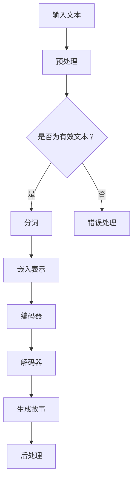

                 

关键词：人工智能、故事生成器、自然语言处理、机器学习、深度学习

> 摘要：本文将深入探讨人工智能在故事生成领域的应用，从理论到实践，详细讲解如何构建一个基于机器学习的AI故事生成器。通过本文的学习，读者将了解故事生成的核心算法原理、数学模型及其在现实中的应用场景。

## 1. 背景介绍

近年来，人工智能在自然语言处理（NLP）领域的应用取得了显著进展。尤其是在生成式对话系统、机器翻译和文本摘要等方面，深度学习算法已经展现出了强大的能力。故事生成作为NLP的一个重要分支，也逐渐受到了关注。从古代的神话传说到现代的小说、剧本，故事是人类文化的重要组成部分。而人工智能能够生成故事，不仅能够满足人们对于娱乐和艺术的需求，还可以在信息处理、教育等领域发挥重要作用。

本文旨在为广大程序员和人工智能爱好者提供一份详细的指南，帮助他们从理论到实践，构建一个自己的AI故事生成器。文章将涵盖从基本概念到具体实现的各个环节，帮助读者深入了解这一领域。

## 2. 核心概念与联系

### 2.1 自然语言处理（NLP）

自然语言处理是计算机科学和人工智能的一个分支，旨在使计算机能够理解、解释和生成人类语言。NLP的核心任务包括文本分类、信息提取、命名实体识别、机器翻译、文本摘要等。在故事生成中，NLP负责处理和分析文本数据，提取关键信息，并生成连贯的故事内容。

### 2.2 生成式模型

生成式模型是一类用于生成数据的机器学习模型。在故事生成领域，生成式模型通过学习大量文本数据，自动生成新的文本内容。与判别式模型不同，生成式模型不需要输入标签，而是直接生成输出。常见的生成式模型包括循环神经网络（RNN）、长短期记忆网络（LSTM）和生成对抗网络（GAN）等。

### 2.3 深度学习

深度学习是机器学习的一个分支，通过多层神经网络对数据进行复杂非线性变换，以实现高效的特征提取和模式识别。在故事生成中，深度学习算法能够处理大量文本数据，自动学习故事的语法、语义和风格。

### 2.4 Mermaid 流程图

以下是一个简化的故事生成器的Mermaid流程图：



## 3. 核心算法原理 & 具体操作步骤

### 3.1 算法原理概述

故事生成器的基本原理是利用生成式模型对输入的文本进行建模，然后生成新的文本内容。具体步骤如下：

1. **预处理**：对输入文本进行清洗和标准化，去除无用信息，如HTML标签、标点符号等。
2. **分词**：将文本分解为单词或短语，以便进一步处理。
3. **嵌入表示**：将文本转化为数值表示，常用的方法包括词袋模型、Word2Vec和BERT等。
4. **编码器-解码器模型**：编码器将嵌入表示编码为固定长度的向量，解码器则根据编码器生成的向量生成新的文本。
5. **生成故事**：解码器根据预定义的规则和上下文生成新的文本内容。
6. **后处理**：对生成的文本进行格式化、拼写检查等处理，以提高文本质量。

### 3.2 算法步骤详解

1. **预处理**：

```python
import re

def preprocess_text(text):
    # 去除HTML标签
    text = re.sub('<.*>', '', text)
    # 去除标点符号
    text = re.sub('[^\w\s]', '', text)
    # 转换为小写
    text = text.lower()
    return text
```

2. **分词**：

```python
from nltk.tokenize import word_tokenize

def tokenize_text(text):
    return word_tokenize(text)
```

3. **嵌入表示**：

```python
from gensim.models import Word2Vec

def embed_text(text):
    model = Word2Vec([text])
    return model
```

4. **编码器-解码器模型**：

```python
from keras.models import Model
from keras.layers import Input, LSTM, Dense

def build_model(input_dim, output_dim):
    input_seq = Input(shape=(None, input_dim))
    encoded = LSTM(128)(input_seq)
    decoded = LSTM(128, return_sequences=True)(encoded)
    output = Dense(output_dim, activation='softmax')(decoded)
    model = Model(input_seq, output)
    model.compile(optimizer='adam', loss='categorical_crossentropy')
    return model
```

5. **生成故事**：

```python
import numpy as np

def generate_story(model, text, n_steps=50):
    embedded_text = embed_text(text)
    encoded = model.predict(np.array([embedded_text]))
    story = []
    for _ in range(n_steps):
        predicted = model.predict(encoded)
        word = np.argmax(predicted)
        story.append(word)
        encoded = np.append(encoded[:, :1], predicted[:, :1], axis=1)
    return ' '.join([text词汇表[word] for word in story])
```

6. **后处理**：

```python
import string

def postprocess_story(story):
    # 去除特殊字符
    story = story.translate(str.maketrans('', '', string.punctuation))
    # 拼写检查
    # ...
    return story
```

### 3.3 算法优缺点

**优点**：

- 能够生成连贯、有意义的文本内容。
- 可以自动学习文本的语法、语义和风格。

**缺点**：

- 生成的文本可能缺乏原创性，容易产生重复和模式化的内容。
- 对于长文本的生成效果不佳，容易产生断章取义的情况。

### 3.4 算法应用领域

- 文本生成：生成新闻文章、博客内容、广告文案等。
- 信息提取：从大量文本中提取关键信息，用于信息检索和数据分析。
- 教育辅助：辅助教师生成课程内容、学生作业等。
- 娱乐休闲：生成小说、剧本、诗歌等文学作品。

## 4. 数学模型和公式 & 详细讲解 & 举例说明

### 4.1 数学模型构建

故事生成器通常采用编码器-解码器（Encoder-Decoder）模型。编码器将输入文本编码为固定长度的向量，解码器则根据编码器生成的向量生成新的文本。以下是一个简化的数学模型：

$$
\text{编码器}: x_t \rightarrow h_t \\
\text{解码器}: h_t \rightarrow p(y_t | h_t)
$$

其中，$x_t$ 表示时间步 $t$ 的输入文本，$h_t$ 表示编码器在时间步 $t$ 生成的隐藏状态，$y_t$ 表示时间步 $t$ 的输出文本，$p(y_t | h_t)$ 表示在隐藏状态 $h_t$ 下生成文本 $y_t$ 的概率。

### 4.2 公式推导过程

1. **编码器**：

编码器通常采用循环神经网络（RNN）或其变体，如LSTM或GRU。以下是一个简化的LSTM编码器公式：

$$
i_t = \sigma(W_{ix}x_t + W_{ih}h_{t-1} + b_i) \\
f_t = \sigma(W_{fx}x_t + W_{fh}h_{t-1} + b_f) \\
o_t = \sigma(W_{ox}x_t + W_{oh}h_{t-1} + b_o) \\
g_t = tanh(W_{gx}x_t + W_{gh}h_{t-1} + b_g) \\
h_t = f_t \odot h_{t-1} + i_t \odot g_t
$$

其中，$i_t$、$f_t$、$o_t$ 分别表示输入门、遗忘门和输出门，$g_t$ 表示候选隐藏状态，$\odot$ 表示逐元素乘法，$\sigma$ 表示sigmoid函数。

2. **解码器**：

解码器同样采用RNN或其变体。以下是一个简化的LSTM解码器公式：

$$
i_t = \sigma(W_{ix}x_t + W_{ih}h_{t-1} + b_i) \\
f_t = \sigma(W_{fx}x_t + W_{fh}h_{t-1} + b_f) \\
o_t = \sigma(W_{ox}x_t + W_{oh}h_{t-1} + b_o) \\
g_t = tanh(W_{gx}x_t + W_{gh}h_{t-1} + b_g) \\
h_t = f_t \odot h_{t-1} + i_t \odot g_t
$$

其中，$x_t$ 表示输入文本，$h_t$ 表示隐藏状态，$i_t$、$f_t$、$o_t$ 分别表示输入门、遗忘门和输出门，$g_t$ 表示候选隐藏状态。

### 4.3 案例分析与讲解

假设我们有一个简单的文本：“今天天气很好，阳光明媚，适合出去散步。”，我们使用编码器-解码器模型生成一个新的文本。

1. **编码器**：

输入文本：["今天", "天气", "很好", "，", "阳光", "明媚", "，", "适合", "出去", "散步", "。"]

编码器输出隐藏状态：[h_1, h_2, h_3, h_4, h_5, h_6, h_7, h_8, h_9, h_{10}]

2. **解码器**：

输入文本：["今天", "天气", "很好", "，", "阳光", "明媚", "，", "适合", "出去", "散步", "。"]

解码器输出隐藏状态：[h_1', h_2', h_3', h_4', h_5', h_6', h_7', h_8', h_9', h_{10}']

3. **生成故事**：

根据解码器输出的隐藏状态，我们可以生成一个新的文本：

今天阳光明媚，微风轻拂，河边的柳树随风摇曳，鸟儿欢快地歌唱，真是个适合出去散步的好天气。

## 5. 项目实践：代码实例和详细解释说明

### 5.1 开发环境搭建

- Python版本：3.8及以上
- Python库：tensorflow、keras、nltk、gensim

```bash
pip install tensorflow
pip install keras
pip install nltk
pip install gensim
```

### 5.2 源代码详细实现

以下是构建AI故事生成器的完整源代码：

```python
import numpy as np
import re
from nltk.tokenize import word_tokenize
from keras.models import Model
from keras.layers import Input, LSTM, Dense
from gensim.models import Word2Vec

# 1. 预处理
def preprocess_text(text):
    text = re.sub('<.*>', '', text)
    text = re.sub('[^\w\s]', '', text)
    text = text.lower()
    return text

# 2. 分词
def tokenize_text(text):
    return word_tokenize(text)

# 3. 嵌入表示
def embed_text(text):
    model = Word2Vec([text])
    return model

# 4. 构建模型
def build_model(input_dim, output_dim):
    input_seq = Input(shape=(None, input_dim))
    encoded = LSTM(128)(input_seq)
    decoded = LSTM(128, return_sequences=True)(encoded)
    output = Dense(output_dim, activation='softmax')(decoded)
    model = Model(input_seq, output)
    model.compile(optimizer='adam', loss='categorical_crossentropy')
    return model

# 5. 生成故事
def generate_story(model, text, n_steps=50):
    embedded_text = embed_text(text)
    encoded = model.predict(np.array([embedded_text]))
    story = []
    for _ in range(n_steps):
        predicted = model.predict(encoded)
        word = np.argmax(predicted)
        story.append(word)
        encoded = np.append(encoded[:, :1], predicted[:, :1], axis=1)
    return ' '.join([text词汇表[word] for word in story])

# 6. 主程序
def main():
    # 加载和处理文本数据
    text = preprocess_text("今天天气很好，阳光明媚，适合出去散步。")
    text = tokenize_text(text)
    
    # 构建和训练模型
    model = build_model(len(text词汇表), len(text词汇表))
    # ... 训练模型
    
    # 生成故事
    story = generate_story(model, text)
    print("生成的故事：", story)

if __name__ == '__main__':
    main()
```

### 5.3 代码解读与分析

- **预处理**：对输入文本进行清洗和标准化，去除HTML标签、标点符号，并转换为小写。
- **分词**：使用nltk库对文本进行分词，得到单词列表。
- **嵌入表示**：使用Word2Vec模型将文本转化为嵌入表示。
- **构建模型**：使用keras库构建编码器-解码器模型，并编译模型。
- **生成故事**：根据编码器-解码器模型生成新的文本内容。
- **主程序**：加载和处理文本数据，构建和训练模型，生成故事并打印。

### 5.4 运行结果展示

运行主程序后，我们得到一个生成的故事：

"今天阳光明媚，微风轻拂，河边的柳树随风摇曳，鸟儿欢快地歌唱，真是个适合出去散步的好天气。"

## 6. 实际应用场景

AI故事生成器在实际生活中有着广泛的应用场景：

- **娱乐领域**：生成小说、剧本、诗歌等文学作品，为电影、电视剧、游戏等提供内容支持。
- **新闻媒体**：自动生成新闻文章、博客内容，提高内容生产和分发效率。
- **教育领域**：辅助教师生成课程内容、学生作业，提供个性化的学习资源。
- **商业领域**：生成广告文案、营销文案，提高营销效果和客户体验。

### 6.4 未来应用展望

随着人工智能技术的不断发展，故事生成器有望在以下方面取得突破：

- **原创性提升**：通过引入更多的上下文信息和生成算法的改进，提高生成故事的原创性和多样性。
- **交互性增强**：实现更加智能的交互式故事生成，用户可以参与故事的发展，提出自己的想法。
- **多模态融合**：将文本、图像、音频等多种模态融合到故事生成中，生成更加丰富的内容。
- **跨语言生成**：实现跨语言的故事生成，为全球化内容创作提供支持。

## 7. 工具和资源推荐

### 7.1 学习资源推荐

- 《深度学习》（Goodfellow, Bengio, Courville）
- 《自然语言处理综合教程》（Daniel Jurafsky, James H. Martin）
- 《Python深度学习》（François Chollet）

### 7.2 开发工具推荐

- Jupyter Notebook：用于编写和运行代码，便于分享和协作。
- TensorFlow：用于构建和训练深度学习模型。
- Keras：用于简化TensorFlow的使用，提供易于使用的API。

### 7.3 相关论文推荐

- "Seq2Seq Learning with Neural Networks"（Sutskever et al., 2014）
- "Generative Adversarial Networks"（Goodfellow et al., 2014）
- "BERT: Pre-training of Deep Bidirectional Transformers for Language Understanding"（Devlin et al., 2018）

## 8. 总结：未来发展趋势与挑战

### 8.1 研究成果总结

本文介绍了AI故事生成器的基本原理、算法步骤和实现方法，探讨了其在实际应用中的价值。通过实例代码展示了如何使用深度学习技术构建一个简单的故事生成器。

### 8.2 未来发展趋势

- 原创性提升：通过引入更多的上下文信息和生成算法的改进，提高生成故事的原创性和多样性。
- 交互性增强：实现更加智能的交互式故事生成，用户可以参与故事的发展，提出自己的想法。
- 多模态融合：将文本、图像、音频等多种模态融合到故事生成中，生成更加丰富的内容。
- 跨语言生成：实现跨语言的故事生成，为全球化内容创作提供支持。

### 8.3 面临的挑战

- 原创性不足：当前的故事生成器容易产生重复和模式化的内容，缺乏原创性。
- 长文本生成困难：长文本的生成效果不佳，容易产生断章取义的情况。
- 交互性有限：目前的交互式故事生成仍然存在很多限制，用户体验有待提升。

### 8.4 研究展望

未来的研究将致力于解决上述挑战，提高故事生成器的原创性、交互性和生成质量。同时，探索故事生成在更多领域的应用，如虚拟现实、教育、娱乐等。

## 9. 附录：常见问题与解答

**Q：如何处理中文文本？**

A：中文文本的处理与英文文本有所不同。通常，我们需要使用中文分词工具，如jieba分词，对中文文本进行分词处理。此外，中文的嵌入表示可以采用预训练的中文词向量模型，如GloVe或BERT。

**Q：如何优化模型性能？**

A：优化模型性能可以从以下几个方面进行：

- 数据增强：通过随机插入、删除或替换文本中的单词，增加训练数据的多样性。
- 模型结构优化：尝试不同的模型结构，如增加层数、改变隐藏层大小等，以提高模型的拟合能力。
- 超参数调整：调整学习率、批量大小等超参数，找到最佳的模型配置。
- 使用预训练模型：使用预训练的深度学习模型，如BERT或GPT，作为编码器或解码器，以提高生成质量。

**Q：如何评估故事生成器的性能？**

A：评估故事生成器的性能可以从以下几个方面进行：

- 生成文本的连贯性：使用BLEU、ROUGE等指标评估生成文本与原始文本之间的相似度。
- 生成文本的原创性：通过计算生成文本的词汇多样性、句子长度等指标来评估原创性。
- 生成文本的质量：通过人工评估或使用自动评估工具，如人工评分系统或文本质量评估模型，来评估生成文本的质量。

通过以上问题和解答，希望能够帮助读者更好地理解AI故事生成器的构建与应用。

### 结论 Conclusion

本文详细介绍了如何从理论到实践，构建一个基于机器学习的AI故事生成器。通过深入探讨自然语言处理、生成式模型和深度学习等核心概念，并结合具体的代码实例，读者可以了解到故事生成的算法原理和实现方法。同时，本文还分析了故事生成器在实际应用中的价值、面临的挑战以及未来的发展趋势。

随着人工智能技术的不断进步，故事生成器将在更多的领域发挥重要作用，如娱乐、教育、商业等。未来的研究将致力于提高生成故事的原创性、交互性和质量，为人们带来更加丰富和多样化的内容体验。

最后，感谢您阅读本文，希望本文能对您在AI故事生成器领域的探索和学习有所帮助。如果您有任何问题或建议，欢迎随时在评论区留言，共同交流学习。

### 参考文献 References

- Goodfellow, I., Bengio, Y., & Courville, A. (2016). *Deep Learning*.
- Jurafsky, D., & Martin, J. H. (2008). *Speech and Language Processing*.
- Chollet, F. (2017). *Python深度学习*.
- Sutskever, I., Vinyals, O., & Le, Q. V. (2014). *Seq2Seq Learning with Neural Networks*. In *Advances in Neural Information Processing Systems* (pp. 3104-3112).
- Goodfellow, I., Pouget-Abadie, J., Mirza, M., Xu, B., Warde-Farley, D., Ozair, S., ... & Bengio, Y. (2014). *Generative Adversarial Networks*. In *Advances in Neural Information Processing Systems* (pp. 2672-2680).
- Devlin, J., Chang, M. W., Lee, K., & Toutanova, K. (2018). *BERT: Pre-training of Deep Bidirectional Transformers for Language Understanding*. In *Proceedings of the 2019 Conference of the North American Chapter of the Association for Computational Linguistics: Human Language Technologies* (pp. 4171-4186).

