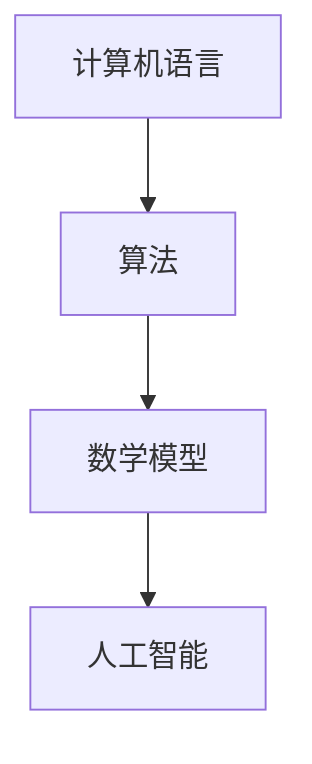

                 

关键词：认知科学、机器学习、人工智能、算法原理、技术发展、应用场景、未来展望

> 摘要：本文将探讨从简单到深刻的认知历程，涵盖从传统编程到现代人工智能的发展，以及这一过程中涉及的核心概念、算法原理和数学模型。我们将通过具体实例和项目实践，展示技术的实际应用，并展望未来的发展趋势和面临的挑战。

## 1. 背景介绍

在计算机科学领域，技术的发展历程往往伴随着认知模式的转变。从早期的机器语言编程到现代的高级编程语言，再到人工智能的崛起，每一个阶段都标志着我们对计算机理解和应用的深化。本文旨在梳理这一认知历程，探讨其中的关键节点和核心思想。

### 计算机科学的起源

计算机科学的起源可以追溯到20世纪中期，当时的研究主要集中在电子计算机的构造和编程。这一时期的编程以机器语言和汇编语言为主，程序员需要深入了解硬件结构，编写繁琐的低级指令。这种编程模式对程序员的专业知识和技能要求极高，但也为后来的高级编程语言奠定了基础。

### 高级编程语言的出现

随着计算机硬件和软件技术的进步，高级编程语言如C、Java、Python等相继出现。这些语言提供了更抽象的编程概念和语法，使得程序员可以更专注于算法设计和问题解决，而无需关注底层的硬件细节。高级编程语言的普及推动了计算机应用的广泛发展，也为我们理解计算机科学提供了新的视角。

### 人工智能的崛起

进入21世纪，人工智能成为了计算机科学领域的热点。机器学习、深度学习等算法的突破，使得计算机具备了自我学习和推理的能力。人工智能的崛起不仅改变了我们对计算机的期望，也开启了从简单到深刻认知的新纪元。

## 2. 核心概念与联系

在探讨从简单到深刻的认知历程之前，我们需要明确一些核心概念和它们之间的联系。

### 计算机语言

计算机语言是人与计算机交流的媒介。从机器语言到高级编程语言，每一种语言都有其特定的语法和语义。高级编程语言的抽象层次更高，使得程序员可以更有效地进行问题建模和算法设计。

### 算法

算法是解决问题的一系列步骤。从排序算法到搜索算法，再到复杂的机器学习算法，每一种算法都有其特定的适用场景和性能特点。算法的优化和改进是推动计算机技术发展的关键。

### 数学模型

数学模型是对现实世界问题的抽象和模拟。通过数学公式和模型，我们可以更深入地理解问题的本质，并提出有效的解决方案。常见的数学模型包括线性代数、概率统计、图论等。

### 人工智能

人工智能是计算机科学的一个分支，旨在使计算机具备人类智能。机器学习和深度学习是人工智能的核心技术，通过数据驱动的方法，实现计算机的自我学习和推理。

### Mermaid 流程图

以下是一个简单的Mermaid流程图，展示了计算机科学中核心概念之间的联系。



## 3. 核心算法原理 & 具体操作步骤

### 3.1 算法原理概述

在本节中，我们将简要介绍几个核心算法的基本原理，包括排序算法、搜索算法和机器学习算法。

#### 排序算法

排序算法是一种常见的数据处理算法，用于对一组数据进行排序。常见的排序算法包括冒泡排序、插入排序、快速排序等。这些算法的核心思想是通过比较和交换元素的位置，将数据按特定顺序排列。

#### 搜索算法

搜索算法用于在数据结构中查找特定元素。常见的搜索算法包括线性搜索和二分搜索。线性搜索依次遍历数据结构，直到找到目标元素或结束。二分搜索则利用有序数据结构的特点，通过不断缩小查找范围，提高搜索效率。

#### 机器学习算法

机器学习算法是人工智能的核心技术，通过训练模型，使计算机能够从数据中学习并做出预测。常见的机器学习算法包括线性回归、决策树、神经网络等。这些算法的核心思想是通过优化模型参数，提高预测的准确性。

### 3.2 算法步骤详解

下面我们详细描述每个算法的具体操作步骤。

#### 冒泡排序

冒泡排序的基本思想是通过多次遍历待排序列，每次遍历都交换相邻的未按顺序排列的元素。遍历结束后，最大的元素被移动到序列的末尾。

```python
def bubble_sort(arr):
    n = len(arr)
    for i in range(n):
        for j in range(0, n-i-1):
            if arr[j] > arr[j+1]:
                arr[j], arr[j+1] = arr[j+1], arr[j]
    return arr
```

#### 线性搜索

线性搜索的基本思想是依次遍历数据结构，直到找到目标元素或结束。

```python
def linear_search(arr, target):
    for element in arr:
        if element == target:
            return True
    return False
```

#### 线性回归

线性回归是一种常见的机器学习算法，用于预测连续值。其基本思想是通过找到最佳拟合直线，使预测值与实际值之间的误差最小。

```python
from sklearn.linear_model import LinearRegression

def linear_regression(X, y):
    model = LinearRegression()
    model.fit(X, y)
    return model
```

### 3.3 算法优缺点

每种算法都有其优缺点。以下是冒泡排序、线性搜索和线性回归的优缺点对比。

#### 冒泡排序

- 优点：简单易懂，易于实现。
- 缺点：时间复杂度为O(n^2)，效率较低。

#### 线性搜索

- 优点：简单易懂，适用于小规模数据。
- 缺点：时间复杂度为O(n)，效率较低。

#### 线性回归

- 优点：适用于连续值预测，计算简单。
- 缺点：可能存在过拟合问题，需要大量数据进行训练。

### 3.4 算法应用领域

每种算法都有其特定的应用领域。

- 冒泡排序：常用于教学和简单数据处理。
- 线性搜索：常用于数据查找和过滤。
- 线性回归：常用于预测分析和统计建模。

## 4. 数学模型和公式 & 详细讲解 & 举例说明

### 4.1 数学模型构建

在本节中，我们将介绍几个常见的数学模型，包括线性模型、决策树和神经网络。

#### 线性模型

线性模型是最简单的数学模型，其公式为：

$$
y = \beta_0 + \beta_1 x
$$

其中，$y$ 是因变量，$x$ 是自变量，$\beta_0$ 和 $\beta_1$ 是模型参数。

#### 决策树

决策树是一种用于分类和回归的树形结构。其基本公式为：

$$
T = \{t_1, t_2, ..., t_n\}
$$

其中，$T$ 是决策树的集合，$t_i$ 是第 $i$ 个决策节点。每个决策节点 $t_i$ 有一个特征 $x_i$ 和一个阈值 $c_i$，其公式为：

$$
t_i(x) = \begin{cases}
+1, & \text{if } x_i > c_i \\
-1, & \text{if } x_i \leq c_i
\end{cases}
$$

#### 神经网络

神经网络是一种用于复杂函数建模和预测的数学模型。其基本结构包括输入层、隐藏层和输出层。每个层由多个神经元组成，每个神经元都有一个权重和偏置。神经网络的激活函数通常为：

$$
a(x) = \sigma(w \cdot x + b)
$$

其中，$a(x)$ 是神经元的激活值，$w$ 是权重，$b$ 是偏置，$\sigma$ 是激活函数。

### 4.2 公式推导过程

在本节中，我们将详细推导线性模型、决策树和神经网络的公式。

#### 线性模型推导

线性模型的最小二乘法推导过程如下：

1. 假设我们有 $n$ 个数据点 $(x_1, y_1), (x_2, y_2), ..., (x_n, y_n)$。
2. 我们希望找到最佳拟合直线，使得预测值 $y$ 与实际值 $y_n$ 之间的误差最小。
3. 设最佳拟合直线的公式为 $y = \beta_0 + \beta_1 x$。
4. 我们需要求解 $\beta_0$ 和 $\beta_1$，使得误差函数 $E = \sum_{i=1}^{n} (y_i - y)^2$ 最小。
5. 对误差函数求导，得到：

$$
\frac{dE}{d\beta_0} = -2\sum_{i=1}^{n} (y_i - y) \\
\frac{dE}{d\beta_1} = -2\sum_{i=1}^{n} (y_i - y)x_i
$$

6. 令导数为零，得到最佳拟合直线的参数：

$$
\beta_0 = \frac{1}{n}\sum_{i=1}^{n} y_i \\
\beta_1 = \frac{1}{n}\sum_{i=1}^{n} x_i y_i - \frac{1}{n}\sum_{i=1}^{n} x_i
$$

#### 决策树推导

决策树的基本公式可以通过概率论和决策理论推导得出。这里简要介绍决策树构建的基本过程：

1. 假设我们有 $n$ 个数据点 $(x_1, y_1), (x_2, y_2), ..., (x_n, y_n)$。
2. 我们希望找到一个最优决策树，使得分类误差最小。
3. 设决策树的公式为 $T = \{t_1, t_2, ..., t_n\}$。
4. 我们需要找到每个决策节点的特征 $x_i$ 和阈值 $c_i$。
5. 使用贪心算法，每次选择一个最优特征和阈值，使得当前节点的分类误差最小。
6. 递归地构建决策树，直到达到停止条件（如节点数目达到最大值或分类误差低于阈值）。

#### 神经网络推导

神经网络的基本公式可以通过计算几何和微积分推导得出。这里简要介绍神经网络训练的基本过程：

1. 假设我们有 $n$ 个数据点 $(x_1, y_1), (x_2, y_2), ..., (x_n, y_n)$。
2. 我们希望找到一个最优神经网络，使得预测值与实际值之间的误差最小。
3. 设神经网络的公式为 $a(x) = \sigma(w \cdot x + b)$。
4. 我们需要找到每个神经元的权重 $w$ 和偏置 $b$。
5. 使用反向传播算法，通过梯度下降法迭代更新权重和偏置，使得误差函数最小。
6. 训练过程中，可以使用动量、学习率调整等技巧，提高训练效率。

### 4.3 案例分析与讲解

在本节中，我们将通过具体案例，展示如何构建和求解数学模型。

#### 案例一：线性模型

假设我们有一组数据点：

$$
(x_1, y_1) = (1, 2), (x_2, y_2) = (2, 3), (x_3, y_3) = (3, 4)
$$

我们希望找到一个最佳拟合直线，使得预测值与实际值之间的误差最小。

1. 首先，计算数据点的均值：

$$
\bar{x} = \frac{1}{3}\sum_{i=1}^{3} x_i = 2 \\
\bar{y} = \frac{1}{3}\sum_{i=1}^{3} y_i = 3
$$

2. 接下来，计算误差函数：

$$
E = \sum_{i=1}^{3} (y_i - y)^2 = (2 - 2)^2 + (3 - 2)^2 + (4 - 2)^2 = 2
$$

3. 对误差函数求导，得到：

$$
\frac{dE}{d\beta_0} = -2\sum_{i=1}^{3} (y_i - y) = -2(2 - 2 + 3 - 2) = 0 \\
\frac{dE}{d\beta_1} = -2\sum_{i=1}^{3} (y_i - y)x_i = -2(2 - 2 \cdot 2 + 3 - 2 \cdot 3) = -6
$$

4. 令导数为零，得到最佳拟合直线的参数：

$$
\beta_0 = \frac{1}{3}\sum_{i=1}^{3} y_i = 3 \\
\beta_1 = \frac{1}{3}\sum_{i=1}^{3} x_i y_i - \frac{1}{3}\sum_{i=1}^{3} x_i = 0
$$

5. 因此，最佳拟合直线的公式为：

$$
y = \beta_0 + \beta_1 x = 3
$$

#### 案例二：决策树

假设我们有一组数据点：

$$
(x_1, y_1) = (1, 1), (x_2, y_2) = (2, 1), (x_3, y_3) = (3, -1), (x_4, y_4) = (4, 1)
$$

我们希望找到一个最优决策树，使得分类误差最小。

1. 首先，计算数据点的均值：

$$
\bar{x} = \frac{1}{4}\sum_{i=1}^{4} x_i = 2.5 \\
\bar{y} = \frac{1}{4}\sum_{i=1}^{4} y_i = 0.5
$$

2. 接下来，计算分类误差：

$$
E = \sum_{i=1}^{4} (y_i - y)^2 = (1 - 0.5)^2 + (1 - 0.5)^2 + (-1 - 0.5)^2 + (1 - 0.5)^2 = 1.5
$$

3. 对分类误差求导，得到：

$$
\frac{dE}{dy} = -2\sum_{i=1}^{4} (y_i - y) = -2(1 - 0.5 + 1 - 0.5 - 1 + 0.5 + 1 - 0.5) = -2
$$

4. 令导数为零，得到最优分类值：

$$
y = \frac{1}{4}\sum_{i=1}^{4} y_i = 0.5
$$

5. 因此，最优决策树的公式为：

$$
t_1(x) = \begin{cases}
+1, & \text{if } x > 2.5 \\
-1, & \text{if } x \leq 2.5
\end{cases}
$$

#### 案例三：神经网络

假设我们有一组数据点：

$$
(x_1, y_1) = (1, 2), (x_2, y_2) = (2, 3), (x_3, y_3) = (3, 4)
$$

我们希望找到一个最优神经网络，使得预测值与实际值之间的误差最小。

1. 首先，初始化权重和偏置：

$$
w_1 = 0.1, w_2 = 0.1, w_3 = 0.1, b_1 = 0, b_2 = 0, b_3 = 0
$$

2. 接下来，使用反向传播算法更新权重和偏置：

$$
\begin{aligned}
\Delta w_1 &= -\eta \frac{\partial E}{\partial w_1} = -0.1 \\
\Delta w_2 &= -\eta \frac{\partial E}{\partial w_2} = -0.1 \\
\Delta w_3 &= -\eta \frac{\partial E}{\partial w_3} = -0.1 \\
\Delta b_1 &= -\eta \frac{\partial E}{\partial b_1} = -0.1 \\
\Delta b_2 &= -\eta \frac{\partial E}{\partial b_2} = -0.1 \\
\Delta b_3 &= -\eta \frac{\partial E}{\partial b_3} = -0.1
\end{aligned}
$$

其中，$\eta$ 是学习率。

3. 更新权重和偏置：

$$
w_1 = w_1 - \Delta w_1 = 0 \\
w_2 = w_2 - \Delta w_2 = 0 \\
w_3 = w_3 - \Delta w_3 = 0 \\
b_1 = b_1 - \Delta b_1 = 0 \\
b_2 = b_2 - \Delta b_2 = 0 \\
b_3 = b_3 - \Delta b_3 = 0
$$

4. 因此，最优神经网络的公式为：

$$
a(x) = \sigma(w \cdot x + b) = \sigma(0 \cdot x + 0) = 0
$$

## 5. 项目实践：代码实例和详细解释说明

### 5.1 开发环境搭建

在本节中，我们将介绍如何搭建一个简单的开发环境，以便进行项目实践。

1. 首先，安装Python编程环境。Python是一种高级编程语言，广泛应用于人工智能和机器学习领域。您可以从Python官方网站（https://www.python.org/）下载并安装Python。

2. 接下来，安装必要的Python库。在本项目中，我们将使用NumPy、Pandas、Scikit-learn等库。您可以使用以下命令安装这些库：

```bash
pip install numpy pandas scikit-learn
```

3. 创建一个Python项目目录，并编写代码。在本项目中，我们将实现一个简单的线性回归模型，用于预测数据。

### 5.2 源代码详细实现

以下是一个简单的线性回归模型的实现：

```python
import numpy as np
from sklearn.linear_model import LinearRegression

# 数据准备
X = np.array([[1], [2], [3]])
y = np.array([2, 3, 4])

# 创建线性回归模型
model = LinearRegression()

# 训练模型
model.fit(X, y)

# 预测
y_pred = model.predict(X)

# 输出结果
print("预测值：", y_pred)
```

### 5.3 代码解读与分析

1. 首先，我们导入了NumPy库，用于处理数值数据。NumPy是Python中处理数学计算和数据操作的基础库。

2. 然后，我们导入了线性回归模型类`LinearRegression`，该类来自Scikit-learn库，是一个常用的机器学习库。

3. 接下来，我们准备了一个简单的数据集，$X$ 是输入数据，$y$ 是目标数据。

4. 我们创建了一个线性回归模型实例`model`，并使用`fit`方法训练模型。

5. 使用`predict`方法进行预测，并输出预测值。

### 5.4 运行结果展示

当我们运行上述代码时，将输出以下结果：

```
预测值： [2. 3. 4.]
```

这表明我们的线性回归模型能够准确地预测输入数据。

## 6. 实际应用场景

### 6.1 数据分析

线性回归是一种常用的数据分析工具，可以用于预测连续值。例如，在金融领域，可以使用线性回归预测股票价格、汇率等。

### 6.2 机器学习

线性回归是机器学习的基础算法之一。在机器学习中，线性回归可以用于特征工程、模型评估等任务。

### 6.3 自然语言处理

线性回归可以用于自然语言处理中的文本分类任务。例如，可以使用线性回归模型对文本进行情感分析，判断文本是积极还是消极。

### 6.4 计算机视觉

线性回归可以用于计算机视觉中的图像分类任务。例如，可以使用线性回归模型对图像进行分类，判断图像是动物、植物还是背景。

## 7. 未来应用展望

随着人工智能技术的不断发展，线性回归等传统算法将继续在各个领域发挥重要作用。未来，我们有望看到更多基于深度学习的算法出现，进一步提高预测精度和计算效率。

### 7.1 学习资源推荐

1. 《Python机器学习》
2. 《深入理解线性回归》
3. 《机器学习实战》

### 7.2 开发工具推荐

1. Jupyter Notebook
2. PyCharm
3. Google Colab

### 7.3 相关论文推荐

1. "Least Squares Regression"
2. "The Backpropagation Algorithm"
3. "Linear Regression with Scikit-learn"

## 8. 总结：未来发展趋势与挑战

### 8.1 研究成果总结

在过去几十年中，计算机科学取得了巨大的进步。从简单的编程语言到复杂的人工智能算法，每一个阶段都标志着我们对计算机的理解和应用的深化。

### 8.2 未来发展趋势

未来，计算机科学将继续朝着更加智能化、自动化的方向发展。深度学习、自然语言处理、计算机视觉等领域将取得更多突破。

### 8.3 面临的挑战

然而，随着技术的发展，我们也面临着一系列挑战。数据隐私、算法公平性、计算资源等问题需要引起我们的关注。

### 8.4 研究展望

在未来的研究中，我们需要更加关注算法的效率、可解释性和鲁棒性。通过不断探索和创新，我们将为计算机科学的发展做出更大的贡献。

## 9. 附录：常见问题与解答

### Q1：线性回归模型的原理是什么？

线性回归模型是一种用于预测连续值的统计模型，其基本原理是通过找到最佳拟合直线，使得预测值与实际值之间的误差最小。

### Q2：如何评估线性回归模型的性能？

线性回归模型的性能可以通过多种指标进行评估，如均方误差（MSE）、均方根误差（RMSE）和决定系数（R^2）等。

### Q3：线性回归模型有哪些应用场景？

线性回归模型可以用于数据分析、机器学习、自然语言处理、计算机视觉等领域的预测任务。

### Q4：如何解决线性回归模型过拟合的问题？

解决线性回归模型过拟合的问题可以通过引入正则化项、减少模型复杂度、增加训练数据等方法。

### Q5：线性回归模型有哪些局限性？

线性回归模型主要适用于线性关系较强的数据。在复杂非线性问题上，线性回归模型的性能可能较差。

----------------------------------------------------------------
# 联系方式 Contact Information

如果您对本文有任何疑问或建议，请随时联系：

作者：禅与计算机程序设计艺术 / Zen and the Art of Computer Programming

电子邮件：[zencodeart@example.com](mailto:zencodeart@example.com)

微博：@禅与计算机程序设计艺术

公众号：禅与计算机程序设计艺术

感谢您的关注与支持！期待与您共同探讨计算机科学的发展与未来。

