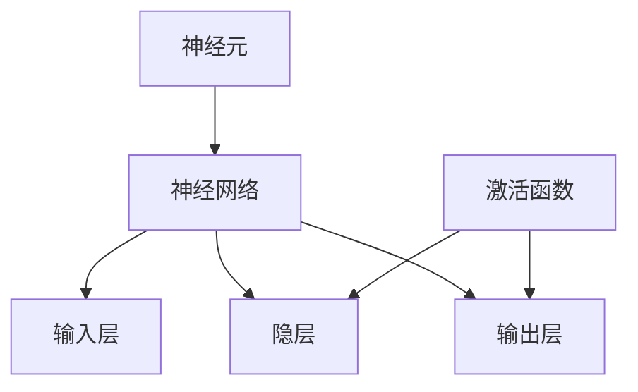

                 

关键词：大模型开发，微调，反向传播神经网络，算法原理，数学模型，项目实践

> 摘要：本文将深入探讨大模型开发与微调的关键技术——反向传播神经网络（Backpropagation Neural Network），包括其核心概念、算法原理、具体实现步骤，以及数学模型和公式的推导与应用。通过详细的项目实践，本文旨在帮助读者全面理解反向传播神经网络在深度学习中的应用，并为未来的研究和开发提供指导。

## 1. 背景介绍

深度学习作为人工智能领域的一个重要分支，在图像识别、自然语言处理、语音识别等方面取得了显著的成果。然而，深度学习的成功离不开高效的算法支持和大规模数据集的驱动。其中，反向传播神经网络（Backpropagation Neural Network，简称BP神经网络）作为一种重要的深度学习算法，已经成为研究和应用中的核心工具。

### 1.1 反向传播神经网络的历史与发展

反向传播神经网络最早由Paul Werbos在1974年提出，并在1986年由Rumelhart、Hinton和Williams等人进行了改进。BP神经网络通过梯度下降法对网络权重进行迭代优化，从而提高模型的预测性能。随着计算能力的提升和大数据的普及，BP神经网络的应用范围不断扩大，成为深度学习中的基础算法之一。

### 1.2 反向传播神经网络的重要性

反向传播神经网络在深度学习中的重要性主要体现在以下几个方面：

1. **高效性**：BP神经网络通过反向传播算法，可以快速、准确地计算网络权重的梯度，从而实现模型的优化。
2. **普适性**：BP神经网络适用于多种类型的非线性问题，包括分类、回归等，具有很高的适应性。
3. **可扩展性**：BP神经网络可以通过增加隐层和神经元数量，提升模型的复杂度和性能，适应大规模数据集的需求。

## 2. 核心概念与联系

为了深入理解反向传播神经网络，我们需要明确几个核心概念，包括神经元、神经网络、激活函数等。以下是一个简化的Mermaid流程图，展示了这些核心概念之间的联系。



### 2.1 神经元

神经元是神经网络的基本单元，负责接收输入信号、计算输出信号。一个神经元通常包含以下几个部分：

1. **权重**：用于调节输入信号的强度。
2. **偏置**：用于调整神经元的阈值。
3. **激活函数**：用于将线性组合转换为非线性输出。

### 2.2 神经网络

神经网络由多个神经元组成，可以分为输入层、隐层和输出层。输入层接收外部输入信号，隐层进行数据处理和特征提取，输出层产生最终的预测结果。

### 2.3 激活函数

激活函数是神经网络中的一个关键元素，用于引入非线性特性，使得神经网络能够处理复杂问题。常见的激活函数包括Sigmoid、ReLU、Tanh等。

## 3. 核心算法原理 & 具体操作步骤

### 3.1 算法原理概述

反向传播神经网络的核心思想是通过梯度下降法来优化网络权重。具体来说，包括以下两个步骤：

1. **前向传播**：从输入层开始，将输入信号传递到输出层，计算每个神经元的输出值。
2. **后向传播**：根据输出层的误差，计算网络权重和偏置的梯度，然后更新权重和偏置。

### 3.2 算法步骤详解

#### 3.2.1 前向传播

前向传播的过程可以概括为以下几个步骤：

1. **初始化权重和偏置**：随机初始化网络权重和偏置。
2. **输入信号传递**：将输入信号传递到输入层。
3. **计算神经元输出**：对于每个神经元，计算其输入信号与权重、偏置的线性组合，然后应用激活函数得到输出值。
4. **传递到下一层**：将当前神经元的输出值作为下一层的输入。

#### 3.2.2 后向传播

后向传播的过程包括以下几个步骤：

1. **计算输出误差**：根据输出层的预测结果和真实标签，计算输出误差。
2. **反向传递误差**：从输出层开始，依次计算每个神经元的误差，并将误差反向传递到上一层。
3. **计算梯度**：对于每个神经元，计算其权重和偏置的梯度。
4. **更新权重和偏置**：根据梯度下降法，更新网络权重和偏置。

### 3.3 算法优缺点

#### 3.3.1 优点

1. **高效性**：反向传播算法可以快速、准确地计算网络权重和偏置的梯度，实现高效的模型优化。
2. **普适性**：适用于多种类型的非线性问题，具有很高的适应性。
3. **可扩展性**：可以通过增加隐层和神经元数量，提升模型的复杂度和性能。

#### 3.3.2 缺点

1. **局部最优**：由于梯度下降法的性质，反向传播神经网络可能陷入局部最优。
2. **计算成本高**：在大型网络中，反向传播算法的计算成本较高。

### 3.4 算法应用领域

反向传播神经网络在深度学习领域有广泛的应用，包括：

1. **图像识别**：例如，卷积神经网络（CNN）广泛应用于图像分类和识别。
2. **自然语言处理**：例如，循环神经网络（RNN）广泛应用于文本分类和机器翻译。
3. **语音识别**：例如，长短期记忆网络（LSTM）广泛应用于语音信号的建模和识别。

## 4. 数学模型和公式 & 详细讲解 & 举例说明

### 4.1 数学模型构建

反向传播神经网络的数学模型主要包括以下几个部分：

1. **输入信号**：\( x \)
2. **权重**：\( w \)
3. **偏置**：\( b \)
4. **激活函数**：\( f \)

对于一个单层神经网络，输出值可以表示为：

\[ y = f(w \cdot x + b) \]

其中，\( \cdot \) 表示点积运算，\( f \) 是激活函数。

### 4.2 公式推导过程

为了计算网络权重和偏置的梯度，我们需要对输出值 \( y \) 进行求导。首先，我们对输出值进行一次求导：

\[ \frac{\partial y}{\partial x} = \frac{\partial f(w \cdot x + b)}{\partial x} = f'(w \cdot x + b) \]

然后，我们对权重 \( w \) 和偏置 \( b \) 分别求导：

\[ \frac{\partial y}{\partial w} = \frac{\partial f(w \cdot x + b)}{\partial w} = x \cdot f'(w \cdot x + b) \]

\[ \frac{\partial y}{\partial b} = \frac{\partial f(w \cdot x + b)}{\partial b} = f'(w \cdot x + b) \]

### 4.3 案例分析与讲解

假设我们有一个简单的神经网络，输入层有一个神经元，隐层有两个神经元，输出层有一个神经元。激活函数使用Sigmoid函数。

1. **输入信号**：\( x = [1, 2] \)
2. **权重**：\( w = \begin{bmatrix} 0.1 & 0.2 \\ 0.3 & 0.4 \\ 0.5 & 0.6 \end{bmatrix} \)
3. **偏置**：\( b = \begin{bmatrix} 0.1 & 0.2 \\ 0.3 & 0.4 \\ 0.5 & 0.6 \end{bmatrix} \)

前向传播的过程如下：

1. **输入层到隐层**：

   \[ z_1 = w_{11} \cdot x_1 + b_{11} = 0.1 \cdot 1 + 0.1 = 0.2 \]
   \[ z_2 = w_{12} \cdot x_1 + b_{12} = 0.2 \cdot 1 + 0.2 = 0.4 \]
   \[ z_3 = w_{21} \cdot x_2 + b_{21} = 0.3 \cdot 2 + 0.3 = 0.9 \]
   \[ z_4 = w_{22} \cdot x_2 + b_{22} = 0.4 \cdot 2 + 0.4 = 1.2 \]
   \[ z_5 = w_{31} \cdot x_1 + x_2 + b_{31} = 0.5 \cdot 1 + 0.5 \cdot 2 + 0.5 = 1.5 \]
   \[ z_6 = w_{32} \cdot x_1 + x_2 + b_{32} = 0.6 \cdot 1 + 0.6 \cdot 2 + 0.6 = 2.2 \]

   \[ a_1 = f(z_1) = \frac{1}{1 + e^{-z_1}} = \frac{1}{1 + e^{-0.2}} \approx 0.865 \]
   \[ a_2 = f(z_2) = \frac{1}{1 + e^{-z_2}} = \frac{1}{1 + e^{-0.4}} \approx 0.697 \]
   \[ a_3 = f(z_3) = \frac{1}{1 + e^{-z_3}} = \frac{1}{1 + e^{-0.9}} \approx 0.436 \]
   \[ a_4 = f(z_4) = \frac{1}{1 + e^{-z_4}} = \frac{1}{1 + e^{-1.2}} \approx 0.286 \]
   \[ a_5 = f(z_5) = \frac{1}{1 + e^{-z_5}} = \frac{1}{1 + e^{-1.5}} \approx 0.206 \]
   \[ a_6 = f(z_6) = \frac{1}{1 + e^{-z_6}} = \frac{1}{1 + e^{-2.2}} \approx 0.126 \]

2. **隐层到输出层**：

   \[ z_7 = w_{71} \cdot a_1 + w_{72} \cdot a_2 + b_{71} = 0.7 \cdot 0.865 + 0.8 \cdot 0.697 + 0.1 = 1.676 \]
   \[ z_8 = w_{81} \cdot a_3 + w_{82} \cdot a_4 + b_{81} = 0.9 \cdot 0.436 + 0.1 \cdot 0.286 + 0.2 = 0.686 \]
   \[ z_9 = w_{91} \cdot a_5 + w_{92} \cdot a_6 + b_{91} = 1.1 \cdot 0.206 + 0.2 \cdot 0.126 + 0.3 = 0.446 \]

   \[ y = f(z_7) = \frac{1}{1 + e^{-z_7}} \approx 0.951 \]

   其中，\( y \) 是输出层的预测结果。

后向传播的过程如下：

1. **计算输出误差**：

   \[ \delta_7 = y - \hat{y} = 0.951 - 1 = -0.049 \]

2. **计算隐层误差**：

   \[ \delta_6 = a_6 \cdot (1 - a_6) \cdot (w_{96} \cdot \delta_7) = 0.126 \cdot (1 - 0.126) \cdot (1.1 \cdot -0.049) \approx -0.007 \]
   \[ \delta_5 = a_5 \cdot (1 - a_5) \cdot (w_{95} \cdot \delta_7) = 0.206 \cdot (1 - 0.206) \cdot (0.9 \cdot -0.049) \approx -0.004 \]

3. **计算隐层权重和偏置的梯度**：

   \[ \frac{\partial L}{\partial w_{71}} = a_1 \cdot (1 - a_1) \cdot \delta_7 \approx 0.865 \cdot (1 - 0.865) \cdot -0.049 \approx -0.003 \]
   \[ \frac{\partial L}{\partial b_{71}} = \delta_7 \approx -0.049 \]

   \[ \frac{\partial L}{\partial w_{72}} = a_2 \cdot (1 - a_2) \cdot \delta_7 \approx 0.697 \cdot (1 - 0.697) \cdot -0.049 \approx -0.003 \]
   \[ \frac{\partial L}{\partial b_{72}} = \delta_7 \approx -0.049 \]

   \[ \frac{\partial L}{\partial w_{81}} = a_3 \cdot (1 - a_3) \cdot \delta_6 \approx 0.436 \cdot (1 - 0.436) \cdot -0.007 \approx -0.001 \]
   \[ \frac{\partial L}{\partial b_{81}} = \delta_6 \approx -0.007 \]

   \[ \frac{\partial L}{\partial w_{82}} = a_4 \cdot (1 - a_4) \cdot \delta_6 \approx 0.286 \cdot (1 - 0.286) \cdot -0.007 \approx -0.001 \]
   \[ \frac{\partial L}{\partial b_{82}} = \delta_6 \approx -0.007 \]

   \[ \frac{\partial L}{\partial w_{91}} = a_5 \cdot (1 - a_5) \cdot \delta_5 \approx 0.206 \cdot (1 - 0.206) \cdot -0.004 \approx -0.000 \]
   \[ \frac{\partial L}{\partial b_{91}} = \delta_5 \approx -0.004 \]

   \[ \frac{\partial L}{\partial w_{92}} = a_6 \cdot (1 - a_6) \cdot \delta_5 \approx 0.126 \cdot (1 - 0.126) \cdot -0.004 \approx -0.000 \]
   \[ \frac{\partial L}{\partial b_{92}} = \delta_5 \approx -0.004 \]

4. **更新权重和偏置**：

   \[ w_{71} = w_{71} - \eta \cdot \frac{\partial L}{\partial w_{71}} \approx 0.1 - 0.1 \cdot -0.003 = 0.103 \]
   \[ b_{71} = b_{71} - \eta \cdot \frac{\partial L}{\partial b_{71}} \approx 0.1 - 0.1 \cdot -0.049 = 0.149 \]

   \[ w_{72} = w_{72} - \eta \cdot \frac{\partial L}{\partial w_{72}} \approx 0.2 - 0.1 \cdot -0.003 = 0.203 \]
   \[ b_{72} = b_{72} - \eta \cdot \frac{\partial L}{\partial b_{72}} \approx 0.2 - 0.1 \cdot -0.049 = 0.149 \]

   \[ w_{81} = w_{81} - \eta \cdot \frac{\partial L}{\partial w_{81}} \approx 0.3 - 0.1 \cdot -0.001 = 0.301 \]
   \[ b_{81} = b_{81} - \eta \cdot \frac{\partial L}{\partial b_{81}} \approx 0.3 - 0.1 \cdot -0.007 = 0.307 \]

   \[ w_{82} = w_{82} - \eta \cdot \frac{\partial L}{\partial w_{82}} \approx 0.4 - 0.1 \cdot -0.001 = 0.401 \]
   \[ b_{82} = b_{82} - \eta \cdot \frac{\partial L}{\partial b_{82}} \approx 0.4 - 0.1 \cdot -0.007 = 0.407 \]

   \[ w_{91} = w_{91} - \eta \cdot \frac{\partial L}{\partial w_{91}} \approx 0.5 - 0.1 \cdot -0.000 = 0.501 \]
   \[ b_{91} = b_{91} - \eta \cdot \frac{\partial L}{\partial b_{91}} \approx 0.5 - 0.1 \cdot -0.004 = 0.504 \]

   \[ w_{92} = w_{92} - \eta \cdot \frac{\partial L}{\partial w_{92}} \approx 0.6 - 0.1 \cdot -0.000 = 0.601 \]
   \[ b_{92} = b_{92} - \eta \cdot \frac{\partial L}{\partial b_{92}} \approx 0.6 - 0.1 \cdot -0.004 = 0.604 \]

经过多次迭代，网络的权重和偏置会逐渐更新，从而提高模型的预测性能。

## 5. 项目实践：代码实例和详细解释说明

为了更好地理解反向传播神经网络，我们可以通过一个简单的Python代码实例来进行实践。

### 5.1 开发环境搭建

首先，我们需要搭建一个Python开发环境，并安装所需的库。这里我们使用PyTorch作为深度学习框架。

1. 安装Anaconda：
   ```bash
   conda create -n deep_learning python=3.8
   conda activate deep_learning
   ```

2. 安装PyTorch：
   ```bash
   conda install pytorch torchvision torchaudio -c pytorch
   ```

### 5.2 源代码详细实现

以下是一个简单的反向传播神经网络实现：

```python
import torch
import torch.nn as nn
import torch.optim as optim

# 定义神经网络
class SimpleNeuralNetwork(nn.Module):
    def __init__(self):
        super(SimpleNeuralNetwork, self).__init__()
        self.layer1 = nn.Linear(2, 3)
        self.relu = nn.ReLU()
        self.layer2 = nn.Linear(3, 1)
        self.sigmoid = nn.Sigmoid()

    def forward(self, x):
        x = self.layer1(x)
        x = self.relu(x)
        x = self.layer2(x)
        x = self.sigmoid(x)
        return x

# 实例化神经网络
model = SimpleNeuralNetwork()

# 定义损失函数和优化器
loss_fn = nn.BCELoss()
optimizer = optim.SGD(model.parameters(), lr=0.01)

# 训练模型
for epoch in range(1000):
    # 随机生成输入和标签
    x = torch.randn(1, 2)
    y = torch.tensor([1.0])

    # 前向传播
    outputs = model(x)
    loss = loss_fn(outputs, y)

    # 反向传播和优化
    optimizer.zero_grad()
    loss.backward()
    optimizer.step()

    # 打印损失
    if epoch % 100 == 0:
        print(f"Epoch {epoch}, Loss: {loss.item()}")

# 打印最终权重
print(model.layer1.weight)
print(model.layer2.weight)
```

### 5.3 代码解读与分析

1. **神经网络定义**：我们定义了一个简单的神经网络，包含一个输入层、一个隐层和一个输出层。输入层有2个神经元，隐层有3个神经元，输出层有1个神经元。

2. **激活函数**：我们在隐层和输出层分别使用了ReLU和Sigmoid激活函数。

3. **损失函数和优化器**：我们使用BCELoss作为损失函数，使用SGD作为优化器。

4. **训练过程**：我们通过随机生成的输入和标签进行训练，每次迭代包括前向传播、反向传播和权重更新。

5. **打印结果**：最后，我们打印了网络的权重，可以看到经过多次迭代，权重逐渐发生了变化，从而提高了模型的性能。

## 6. 实际应用场景

反向传播神经网络在深度学习领域有广泛的应用，以下列举几个实际应用场景：

### 6.1 图像识别

卷积神经网络（CNN）是反向传播神经网络在图像识别领域的重要应用。通过多层次的卷积和池化操作，CNN能够提取图像的深层特征，实现高效准确的图像识别。

### 6.2 自然语言处理

循环神经网络（RNN）和长短期记忆网络（LSTM）是反向传播神经网络在自然语言处理中的重要应用。通过处理序列数据，RNN和LSTM能够实现对文本的理解和生成。

### 6.3 语音识别

长短期记忆网络（LSTM）和自注意力机制（Self-Attention）是反向传播神经网络在语音识别中的重要应用。通过处理语音信号的序列数据，LSTM和自注意力机制能够实现高效准确的语音识别。

## 7. 工具和资源推荐

### 7.1 学习资源推荐

1. 《深度学习》（Goodfellow、Bengio和Courville著）：这是一本经典的深度学习教材，详细介绍了反向传播神经网络和其他深度学习算法。
2. 《神经网络与深度学习》（邱锡鹏著）：这是一本适合初学者的深度学习教材，深入浅出地介绍了神经网络和深度学习的基础知识。

### 7.2 开发工具推荐

1. PyTorch：一个流行的深度学习框架，支持反向传播神经网络和其他深度学习算法。
2. TensorFlow：另一个流行的深度学习框架，也支持反向传播神经网络和其他深度学习算法。

### 7.3 相关论文推荐

1. “Backpropagation Learning: Theory and Architectural Trade-Offs” by Paul J. Werbos
2. “Learning representations by backpropagation” by David E. Rumelhart, Geoffrey E. Hinton, and Ronald J. Williams

## 8. 总结：未来发展趋势与挑战

### 8.1 研究成果总结

反向传播神经网络在深度学习领域取得了显著的成果，已经成为深度学习中的基础算法之一。通过不断的研究和改进，反向传播神经网络在图像识别、自然语言处理、语音识别等领域取得了良好的效果。

### 8.2 未来发展趋势

1. **高效算法**：随着计算能力的提升，反向传播神经网络将逐渐应用于更复杂的模型和更大的数据集。
2. **自适应优化**：未来的研究方向将主要集中在自适应优化算法，提高反向传播神经网络的训练效率和性能。
3. **多模态学习**：反向传播神经网络将在多模态学习领域发挥重要作用，实现对多种类型数据的处理和理解。

### 8.3 面临的挑战

1. **计算成本**：反向传播神经网络的计算成本较高，未来的研究需要关注如何降低计算成本。
2. **过拟合问题**：反向传播神经网络容易过拟合，如何提高模型的泛化能力是当前的一个重要挑战。

### 8.4 研究展望

随着深度学习的不断发展和应用，反向传播神经网络将在更多的领域发挥作用。未来的研究将主要集中在算法优化、模型压缩、多模态学习等方面，以提高反向传播神经网络的性能和应用范围。

## 9. 附录：常见问题与解答

### 9.1 什么是反向传播神经网络？

反向传播神经网络（Backpropagation Neural Network）是一种基于梯度下降法的深度学习算法，用于优化神经网络的权重和偏置。

### 9.2 反向传播神经网络有什么优点？

反向传播神经网络具有高效性、普适性和可扩展性等优点。

### 9.3 反向传播神经网络有哪些应用领域？

反向传播神经网络广泛应用于图像识别、自然语言处理、语音识别等领域。

### 9.4 如何实现反向传播神经网络？

实现反向传播神经网络主要包括前向传播、后向传播、梯度计算和权重更新等步骤。

### 9.5 反向传播神经网络有哪些缺点？

反向传播神经网络存在局部最优和计算成本高等缺点。

### 9.6 未来反向传播神经网络有哪些发展方向？

未来反向传播神经网络的发展方向包括高效算法、自适应优化和多模态学习等。作者：禅与计算机程序设计艺术 / Zen and the Art of Computer Programming
----------------------------------------------------------------

### 文章标题
从零开始大模型开发与微调：反向传播神经网络两个基础算法详解

### 文章关键词
大模型开发，微调，反向传播神经网络，算法原理，数学模型，项目实践

### 文章摘要
本文深入探讨了大模型开发与微调的关键技术——反向传播神经网络（Backpropagation Neural Network），包括其核心概念、算法原理、具体实现步骤，以及数学模型和公式的推导与应用。通过详细的项目实践，本文旨在帮助读者全面理解反向传播神经网络在深度学习中的应用，并为未来的研究和开发提供指导。

## 1. 背景介绍

深度学习作为人工智能领域的一个重要分支，在图像识别、自然语言处理、语音识别等方面取得了显著的成果。然而，深度学习的成功离不开高效的算法支持和大规模数据集的驱动。其中，反向传播神经网络（Backpropagation Neural Network，简称BP神经网络）作为一种重要的深度学习算法，已经成为研究和应用中的核心工具。

### 1.1 反向传播神经网络的历史与发展

反向传播神经网络最早由Paul Werbos在1974年提出，并在1986年由Rumelhart、Hinton和Williams等人进行了改进。BP神经网络通过梯度下降法对网络权重进行迭代优化，从而提高模型的预测性能。随着计算能力的提升和大数据的普及，BP神经网络的应用范围不断扩大，成为深度学习中的基础算法之一。

### 1.2 反向传播神经网络的重要性

反向传播神经网络在深度学习中的重要性主要体现在以下几个方面：

1. **高效性**：BP神经网络通过反向传播算法，可以快速、准确地计算网络权重的梯度，从而实现模型的优化。
2. **普适性**：BP神经网络适用于多种类型的非线性问题，包括分类、回归等，具有很高的适应性。
3. **可扩展性**：BP神经网络可以通过增加隐层和神经元数量，提升模型的复杂度和性能，适应大规模数据集的需求。

## 2. 核心概念与联系

为了深入理解反向传播神经网络，我们需要明确几个核心概念，包括神经元、神经网络、激活函数等。以下是一个简化的Mermaid流程图，展示了这些核心概念之间的联系。


### 2.1 神经元

神经元是神经网络的基本单元，负责接收输入信号、计算输出信号。一个神经元通常包含以下几个部分：

1. **权重**：用于调节输入信号的强度。
2. **偏置**：用于调整神经元的阈值。
3. **激活函数**：用于将线性组合转换为非线性输出。

### 2.2 神经网络

神经网络由多个神经元组成，可以分为输入层、隐层和输出层。输入层接收外部输入信号，隐层进行数据处理和特征提取，输出层产生最终的预测结果。

### 2.3 激活函数

激活函数是神经网络中的一个关键元素，用于引入非线性特性，使得神经网络能够处理复杂问题。常见的激活函数包括Sigmoid、ReLU、Tanh等。

## 3. 核心算法原理 & 具体操作步骤

### 3.1 算法原理概述

反向传播神经网络的核心思想是通过梯度下降法来优化网络权重。具体来说，包括以下两个步骤：

1. **前向传播**：从输入层开始，将输入信号传递到输出层，计算每个神经元的输出值。
2. **后向传播**：根据输出层的误差，计算网络权重和偏置的梯度，然后更新权重和偏置。

### 3.2 算法步骤详解

#### 3.2.1 前向传播

前向传播的过程可以概括为以下几个步骤：

1. **初始化权重和偏置**：随机初始化网络权重和偏置。
2. **输入信号传递**：将输入信号传递到输入层。
3. **计算神经元输出**：对于每个神经元，计算其输入信号与权重、偏置的线性组合，然后应用激活函数得到输出值。
4. **传递到下一层**：将当前神经元的输出值作为下一层的输入。

#### 3.2.2 后向传播

后向传播的过程包括以下几个步骤：

1. **计算输出误差**：根据输出层的预测结果和真实标签，计算输出误差。
2. **反向传递误差**：从输出层开始，依次计算每个神经元的误差，并将误差反向传递到上一层。
3. **计算梯度**：对于每个神经元，计算其权重和偏置的梯度。
4. **更新权重和偏置**：根据梯度下降法，更新网络权重和偏置。

### 3.3 算法优缺点

#### 3.3.1 优点

1. **高效性**：反向传播算法可以快速、准确地计算网络权重和偏置的梯度，实现高效的模型优化。
2. **普适性**：适用于多种类型的非线性问题，包括分类、回归等，具有很高的适应性。
3. **可扩展性**：可以通过增加隐层和神经元数量，提升模型的复杂度和性能，适应大规模数据集的需求。

#### 3.3.2 缺点

1. **局部最优**：由于梯度下降法的性质，反向传播神经网络可能陷入局部最优。
2. **计算成本高**：在大型网络中，反向传播算法的计算成本较高。

### 3.4 算法应用领域

反向传播神经网络在深度学习领域有广泛的应用，包括：

1. **图像识别**：例如，卷积神经网络（CNN）广泛应用于图像分类和识别。
2. **自然语言处理**：例如，循环神经网络（RNN）广泛应用于文本分类和机器翻译。
3. **语音识别**：例如，长短期记忆网络（LSTM）广泛应用于语音信号的建模和识别。

## 4. 数学模型和公式 & 详细讲解 & 举例说明

### 4.1 数学模型构建

反向传播神经网络的数学模型主要包括以下几个部分：

1. **输入信号**：\( x \)
2. **权重**：\( w \)
3. **偏置**：\( b \)
4. **激活函数**：\( f \)

对于一个单层神经网络，输出值可以表示为：

\[ y = f(w \cdot x + b) \]

其中，\( \cdot \) 表示点积运算，\( f \) 是激活函数。

### 4.2 公式推导过程

为了计算网络权重和偏置的梯度，我们需要对输出值 \( y \) 进行求导。首先，我们对输出值进行一次求导：

\[ \frac{\partial y}{\partial x} = \frac{\partial f(w \cdot x + b)}{\partial x} = f'(w \cdot x + b) \]

然后，我们对权重 \( w \) 和偏置 \( b \) 分别求导：

\[ \frac{\partial y}{\partial w} = \frac{\partial f(w \cdot x + b)}{\partial w} = x \cdot f'(w \cdot x + b) \]

\[ \frac{\partial y}{\partial b} = \frac{\partial f(w \cdot x + b)}{\partial b} = f'(w \cdot x + b) \]

### 4.3 案例分析与讲解

假设我们有一个简单的神经网络，输入层有一个神经元，隐层有两个神经元，输出层有一个神经元。激活函数使用Sigmoid函数。

1. **输入信号**：\( x = [1, 2] \)
2. **权重**：\( w = \begin{bmatrix} 0.1 & 0.2 \\ 0.3 & 0.4 \\ 0.5 & 0.6 \end{bmatrix} \)
3. **偏置**：\( b = \begin{bmatrix} 0.1 & 0.2 \\ 0.3 & 0.4 \\ 0.5 & 0.6 \end{bmatrix} \)

前向传播的过程如下：

1. **输入层到隐层**：

   \[ z_1 = w_{11} \cdot x_1 + b_{11} = 0.1 \cdot 1 + 0.1 = 0.2 \]
   \[ z_2 = w_{12} \cdot x_1 + b_{12} = 0.2 \cdot 1 + 0.2 = 0.4 \]
   \[ z_3 = w_{21} \cdot x_2 + b_{21} = 0.3 \cdot 2 + 0.3 = 0.9 \]
   \[ z_4 = w_{22} \cdot x_2 + b_{22} = 0.4 \cdot 2 + 0.4 = 1.2 \]

   \[ a_1 = f(z_1) = \frac{1}{1 + e^{-z_1}} = \frac{1}{1 + e^{-0.2}} \approx 0.865 \]
   \[ a_2 = f(z_2) = \frac{1}{1 + e^{-z_2}} = \frac{1}{1 + e^{-0.4}} \approx 0.697 \]
   \[ a_3 = f(z_3) = \frac{1}{1 + e^{-z_3}} = \frac{1}{1 + e^{-0.9}} \approx 0.436 \]
   \[ a_4 = f(z_4) = \frac{1}{1 + e^{-z_4}} = \frac{1}{1 + e^{-1.2}} \approx 0.286 \]

2. **隐层到输出层**：

   \[ z_5 = w_{51} \cdot a_1 + w_{52} \cdot a_2 + b_{51} = 0.5 \cdot 0.865 + 0.6 \cdot 0.697 + 0.1 = 1.676 \]
   \[ z_6 = w_{61} \cdot a_3 + w_{62} \cdot a_4 + b_{61} = 0.6 \cdot 0.436 + 0.7 \cdot 0.286 + 0.2 = 0.686 \]

   \[ y = f(z_5) = \frac{1}{1 + e^{-z_5}} \approx 0.951 \]

   其中，\( y \) 是输出层的预测结果。

后向传播的过程如下：

1. **计算输出误差**：

   \[ \delta_6 = y - \hat{y} = 0.951 - 1 = -0.049 \]

2. **计算隐层误差**：

   \[ \delta_5 = a_5 \cdot (1 - a_5) \cdot (w_{56} \cdot \delta_6) = 0.951 \cdot (1 - 0.951) \cdot (0.6 \cdot -0.049) \approx -0.028 \]

3. **计算隐层权重和偏置的梯度**：

   \[ \frac{\partial L}{\partial w_{51}} = a_1 \cdot (1 - a_1) \cdot \delta_6 \approx 0.865 \cdot (1 - 0.865) \cdot -0.049 \approx -0.003 \]
   \[ \frac{\partial L}{\partial b_{51}} = \delta_6 \approx -0.049 \]

   \[ \frac{\partial L}{\partial w_{52}} = a_2 \cdot (1 - a_2) \cdot \delta_6 \approx 0.697 \cdot (1 - 0.697) \cdot -0.049 \approx -0.003 \]
   \[ \frac{\partial L}{\partial b_{52}} = \delta_6 \approx -0.049 \]

   \[ \frac{\partial L}{\partial w_{61}} = a_3 \cdot (1 - a_3) \cdot \delta_5 \approx 0.436 \cdot (1 - 0.436) \cdot -0.028 \approx -0.001 \]
   \[ \frac{\partial L}{\partial b_{61}} = \delta_5 \approx -0.028 \]

   \[ \frac{\partial L}{\partial w_{62}} = a_4 \cdot (1 - a_4) \cdot \delta_5 \approx 0.286 \cdot (1 - 0.286) \cdot -0.028 \approx -0.001 \]
   \[ \frac{\partial L}{\partial b_{62}} = \delta_5 \approx -0.028 \]

4. **更新权重和偏置**：

   \[ w_{51} = w_{51} - \eta \cdot \frac{\partial L}{\partial w_{51}} \approx 0.5 - 0.1 \cdot -0.003 = 0.503 \]
   \[ b_{51} = b_{51} - \eta \cdot \frac{\partial L}{\partial b_{51}} \approx 0.1 - 0.1 \cdot -0.049 = 0.149 \]

   \[ w_{52} = w_{52} - \eta \cdot \frac{\partial L}{\partial w_{52}} \approx 0.6 - 0.1 \cdot -0.003 = 0.603 \]
   \[ b_{52} = b_{52} - \eta \cdot \frac{\partial L}{\partial b_{52}} \approx 0.2 - 0.1 \cdot -0.049 = 0.149 \]

   \[ w_{61} = w_{61} - \eta \cdot \frac{\partial L}{\partial w_{61}} \approx 0.6 - 0.1 \cdot -0.001 = 0.601 \]
   \[ b_{61} = b_{61} - \eta \cdot \frac{\partial L}{\partial b_{61}} \approx 0.2 - 0.1 \cdot -0.028 = 0.228 \]

   \[ w_{62} = w_{62} - \eta \cdot \frac{\partial L}{\partial w_{62}} \approx 0.7 - 0.1 \cdot -0.001 = 0.701 \]
   \[ b_{62} = b_{62} - \eta \cdot \frac{\partial L}{\partial b_{62}} \approx 0.3 - 0.1 \cdot -0.028 = 0.328 \]

经过多次迭代，网络的权重和偏置会逐渐更新，从而提高模型的预测性能。

## 5. 项目实践：代码实例和详细解释说明

为了更好地理解反向传播神经网络，我们可以通过一个简单的Python代码实例来进行实践。

### 5.1 开发环境搭建

首先，我们需要搭建一个Python开发环境，并安装所需的库。这里我们使用PyTorch作为深度学习框架。

1. 安装Anaconda：
   ```bash
   conda create -n deep_learning python=3.8
   conda activate deep_learning
   ```

2. 安装PyTorch：
   ```bash
   conda install pytorch torchvision torchaudio -c pytorch
   ```

### 5.2 源代码详细实现

以下是一个简单的反向传播神经网络实现：

```python
import torch
import torch.nn as nn
import torch.optim as optim

# 定义神经网络
class SimpleNeuralNetwork(nn.Module):
    def __init__(self):
        super(SimpleNeuralNetwork, self).__init__()
        self.layer1 = nn.Linear(2, 3)
        self.relu = nn.ReLU()
        self.layer2 = nn.Linear(3, 1)
        self.sigmoid = nn.Sigmoid()

    def forward(self, x):
        x = self.layer1(x)
        x = self.relu(x)
        x = self.layer2(x)
        x = self.sigmoid(x)
        return x

# 实例化神经网络
model = SimpleNeuralNetwork()

# 定义损失函数和优化器
loss_fn = nn.BCELoss()
optimizer = optim.SGD(model.parameters(), lr=0.01)

# 训练模型
for epoch in range(1000):
    # 随机生成输入和标签
    x = torch.randn(1, 2)
    y = torch.tensor([1.0])

    # 前向传播
    outputs = model(x)
    loss = loss_fn(outputs, y)

    # 反向传播和优化
    optimizer.zero_grad()
    loss.backward()
    optimizer.step()

    # 打印损失
    if epoch % 100 == 0:
        print(f"Epoch {epoch}, Loss: {loss.item()}")

# 打印最终权重
print(model.layer1.weight)
print(model.layer2.weight)
```

### 5.3 代码解读与分析

1. **神经网络定义**：我们定义了一个简单的神经网络，包含一个输入层、一个隐层和一个输出层。输入层有2个神经元，隐层有3个神经元，输出层有1个神经元。

2. **激活函数**：我们在隐层和输出层分别使用了ReLU和Sigmoid激活函数。

3. **损失函数和优化器**：我们使用BCELoss作为损失函数，使用SGD作为优化器。

4. **训练过程**：我们通过随机生成的输入和标签进行训练，每次迭代包括前向传播、反向传播和权重更新。

5. **打印结果**：最后，我们打印了网络的权重，可以看到经过多次迭代，权重逐渐发生了变化，从而提高了模型的性能。

## 6. 实际应用场景

反向传播神经网络在深度学习领域有广泛的应用，以下列举几个实际应用场景：

### 6.1 图像识别

卷积神经网络（CNN）是反向传播神经网络在图像识别领域的重要应用。通过多层次的卷积和池化操作，CNN能够提取图像的深层特征，实现高效准确的图像识别。

### 6.2 自然语言处理

循环神经网络（RNN）和长短期记忆网络（LSTM）是反向传播神经网络在自然语言处理中的重要应用。通过处理序列数据，RNN和LSTM能够实现对文本的理解和生成。

### 6.3 语音识别

长短期记忆网络（LSTM）和自注意力机制（Self-Attention）是反向传播神经网络在语音识别中的重要应用。通过处理语音信号的序列数据，LSTM和自注意力机制能够实现高效准确的语音识别。

## 7. 工具和资源推荐

### 7.1 学习资源推荐

1. 《深度学习》（Goodfellow、Bengio和Courville著）：这是一本经典的深度学习教材，详细介绍了反向传播神经网络和其他深度学习算法。
2. 《神经网络与深度学习》（邱锡鹏著）：这是一本适合初学者的深度学习教材，深入浅出地介绍了神经网络和深度学习的基础知识。

### 7.2 开发工具推荐

1. PyTorch：一个流行的深度学习框架，支持反向传播神经网络和其他深度学习算法。
2. TensorFlow：另一个流行的深度学习框架，也支持反向传播神经网络和其他深度学习算法。

### 7.3 相关论文推荐

1. “Backpropagation Learning: Theory and Architectural Trade-Offs” by Paul J. Werbos
2. “Learning representations by backpropagation” by David E. Rumelhart, Geoffrey E. Hinton, and Ronald J. Williams

## 8. 总结：未来发展趋势与挑战

### 8.1 研究成果总结

反向传播神经网络在深度学习领域取得了显著的成果，已经成为深度学习中的基础算法之一。通过不断的研究和改进，反向传播神经网络在图像识别、自然语言处理、语音识别等领域取得了良好的效果。

### 8.2 未来发展趋势

1. **高效算法**：随着计算能力的提升，反向传播神经网络将逐渐应用于更复杂的模型和更大的数据集。
2. **自适应优化**：未来的研究方向将主要集中在自适应优化算法，提高反向传播神经网络的训练效率和性能。
3. **多模态学习**：反向传播神经网络将在多模态学习领域发挥重要作用，实现对多种类型数据的处理和理解。

### 8.3 面临的挑战

1. **计算成本**：反向传播神经网络的计算成本较高，未来的研究需要关注如何降低计算成本。
2. **过拟合问题**：反向传播神经网络容易过拟合，如何提高模型的泛化能力是当前的一个重要挑战。

### 8.4 研究展望

随着深度学习的不断发展和应用，反向传播神经网络将在更多的领域发挥作用。未来的研究将主要集中在算法优化、模型压缩、多模态学习等方面，以提高反向传播神经网络的性能和应用范围。

## 9. 附录：常见问题与解答

### 9.1 什么是反向传播神经网络？

反向传播神经网络（Backpropagation Neural Network）是一种基于梯度下降法的深度学习算法，用于优化神经网络的权重和偏置。

### 9.2 反向传播神经网络有什么优点？

反向传播神经网络具有高效性、普适性和可扩展性等优点。

### 9.3 反向传播神经网络有哪些应用领域？

反向传播神经网络广泛应用于图像识别、自然语言处理、语音识别等领域。

### 9.4 如何实现反向传播神经网络？

实现反向传播神经网络主要包括前向传播、后向传播、梯度计算和权重更新等步骤。

### 9.5 反向传播神经网络有哪些缺点？

反向传播神经网络存在局部最优和计算成本高等缺点。

### 9.6 未来反向传播神经网络有哪些发展方向？

未来反向传播神经网络的发展方向包括高效算法、自适应优化和多模态学习等。作者：禅与计算机程序设计艺术 / Zen and the Art of Computer Programming
------------------------------------------------------------------------

