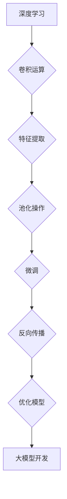

                 

关键词：大模型开发，微调，卷积运算，神经网络，深度学习，计算机编程

摘要：本文将深入探讨大模型开发与微调的基本过程，并以卷积运算为例，详细讲解其原理、实现步骤及实际应用。通过本文的阅读，读者将全面了解大模型开发与微调的实践过程，为未来的研究和应用打下坚实基础。

## 1. 背景介绍

### 大模型开发

随着深度学习技术的快速发展，大模型（Large-scale Models）成为当前研究的热点。大模型具有参数数量庞大、计算复杂度高、通用性强等特点，能够处理复杂的任务，如图像识别、自然语言处理等。大模型的研究不仅推动了理论的发展，也在实际应用中取得了显著成果。然而，大模型的开发和微调是一个复杂且耗时的过程，需要深入理解其基本原理和操作步骤。

### 卷积运算

卷积运算（Convolutional Operation）是深度学习中的一种基本运算，主要用于图像处理和特征提取。卷积神经网络（Convolutional Neural Networks，CNN）是深度学习中的一种重要模型，其核心思想是通过卷积运算和池化操作提取图像中的特征。卷积运算在图像处理中的应用广泛，如人脸识别、图像分类等。

## 2. 核心概念与联系

### 核心概念

在大模型开发和微调过程中，需要理解以下核心概念：

1. **深度学习**：一种机器学习技术，通过多层神经网络对数据进行建模。
2. **卷积运算**：一种基本的数学运算，用于特征提取。
3. **微调**：通过调整模型的参数，使模型在特定任务上表现更好。
4. **反向传播**：一种用于训练神经网络的基本算法。

### 架构流程图（使用 Mermaid）



## 3. 核心算法原理 & 具体操作步骤

### 3.1 算法原理概述

卷积运算的核心思想是将输入数据与卷积核进行点积操作，从而提取特征。具体来说，卷积运算可以分为以下几个步骤：

1. **初始化卷积核**：卷积核是一个权重矩阵，其值需要通过初始化方法确定。
2. **卷积操作**：将输入数据与卷积核进行点积操作，得到特征图。
3. **激活函数**：对特征图进行激活函数处理，如ReLU。
4. **池化操作**：对特征图进行池化操作，如最大池化或平均池化。

### 3.2 算法步骤详解

#### 3.2.1 初始化卷积核

卷积核的初始化是一个关键步骤，其值会影响模型的性能。常用的初始化方法包括：

1. **零初始化**：将卷积核的所有元素初始化为0。
2. **高斯初始化**：根据输入数据的分布，使用高斯分布初始化卷积核。
3. **Xavier初始化**：根据输入数据的分布，使用Xavier初始化方法初始化卷积核。

#### 3.2.2 卷积操作

卷积操作的步骤如下：

1. **步长计算**：根据输入数据的尺寸和卷积核的大小，计算卷积操作的步长。
2. **滑动窗口**：将卷积核在输入数据上滑动，每次滑动一步。
3. **点积操作**：在每个位置上，将卷积核与输入数据进行点积操作，得到特征图。

#### 3.2.3 激活函数

激活函数用于引入非线性特性，常用的激活函数包括：

1. **ReLU（Rectified Linear Unit）**：将输入大于0的值设置为输入本身，小于0的值设置为0。
2. **Sigmoid**：将输入值映射到（0, 1）区间。
3. **Tanh**：将输入值映射到（-1, 1）区间。

#### 3.2.4 池化操作

池化操作的目的是降低特征图的尺寸，常用的池化操作包括：

1. **最大池化**：取每个区域内的最大值。
2. **平均池化**：取每个区域内的平均值。

### 3.3 算法优缺点

#### 优点：

1. **高效特征提取**：卷积运算可以高效地从数据中提取特征。
2. **并行计算**：卷积运算可以并行计算，提高计算速度。
3. **适用于图像处理**：卷积运算在图像处理中具有广泛的应用。

#### 缺点：

1. **参数数量大**：卷积运算的参数数量较大，可能导致过拟合。
2. **计算复杂度高**：卷积运算的计算复杂度较高，需要大量的计算资源。

### 3.4 算法应用领域

卷积运算在以下领域具有广泛的应用：

1. **图像识别**：卷积运算可以用于图像分类、目标检测等任务。
2. **自然语言处理**：卷积运算可以用于文本分类、情感分析等任务。
3. **语音处理**：卷积运算可以用于语音识别、语音合成等任务。

## 4. 数学模型和公式 & 详细讲解 & 举例说明

### 4.1 数学模型构建

卷积运算的数学模型如下：

$$
Z = \sigma(\mathbf{W} \cdot \mathbf{X} + \mathbf{b})
$$

其中，$Z$ 为特征图，$\mathbf{W}$ 为卷积核，$\mathbf{X}$ 为输入数据，$\mathbf{b}$ 为偏置项，$\sigma$ 为激活函数。

### 4.2 公式推导过程

假设输入数据 $\mathbf{X}$ 的尺寸为 $N \times M$，卷积核 $\mathbf{W}$ 的尺寸为 $K \times L$，步长为 $P$。首先，计算卷积操作：

$$
\mathbf{Z}_{ij} = \sum_{p=0}^{P-1} \sum_{q=0}^{P-1} \mathbf{X}_{(i+p) \times (j+q)} \cdot \mathbf{W}_{pq}
$$

然后，对特征图进行激活函数处理：

$$
\mathbf{Z}_{ij} = \sigma(\mathbf{Z}_{ij})
$$

最后，进行池化操作：

$$
\mathbf{Z}_{ij} = \text{max}(\mathbf{Z}_{ij})
$$

### 4.3 案例分析与讲解

假设输入数据 $\mathbf{X}$ 为 $3 \times 3$ 的矩阵，卷积核 $\mathbf{W}$ 为 $2 \times 2$ 的矩阵，步长为 $1$。首先，计算卷积操作：

$$
\mathbf{Z} = \begin{bmatrix}
\mathbf{Z}_{11} & \mathbf{Z}_{12} \\
\mathbf{Z}_{21} & \mathbf{Z}_{22}
\end{bmatrix}
=
\begin{bmatrix}
(1 \cdot 1 + 1 \cdot 4 + 0 \cdot 5 + 0 \cdot 8) & (1 \cdot 2 + 1 \cdot 5 + 0 \cdot 6 + 0 \cdot 9) \\
(1 \cdot 3 + 1 \cdot 6 + 0 \cdot 7 + 0 \cdot 10) & (1 \cdot 4 + 1 \cdot 7 + 0 \cdot 8 + 0 \cdot 11)
\end{bmatrix}
=
\begin{bmatrix}
5 & 7 \\
9 & 11
\end{bmatrix}
$$

然后，对特征图进行激活函数处理：

$$
\mathbf{Z} = \begin{bmatrix}
\text{ReLU}(5) & \text{ReLU}(7) \\
\text{ReLU}(9) & \text{ReLU}(11)
\end{bmatrix}
=
\begin{bmatrix}
5 & 7 \\
9 & 11
\end{bmatrix}
$$

最后，进行最大池化操作：

$$
\mathbf{Z}_{ij} = \text{max}(\mathbf{Z}_{ij})
$$

$$
\mathbf{Z} = \begin{bmatrix}
\text{max}(5, 7) & \text{max}(5, 9) \\
\text{max}(9, 11) & \text{max}(9, 11)
\end{bmatrix}
=
\begin{bmatrix}
7 & 9 \\
11 & 11
\end{bmatrix}
$$

## 5. 项目实践：代码实例和详细解释说明

### 5.1 开发环境搭建

在本项目实践中，我们将使用 Python 和 TensorFlow 作为开发工具。首先，需要安装 TensorFlow：

```bash
pip install tensorflow
```

### 5.2 源代码详细实现

以下是实现卷积运算的代码示例：

```python
import tensorflow as tf

# 定义输入数据
input_data = tf.constant([[1, 1, 0], [1, 0, 1], [0, 1, 1]])

# 初始化卷积核
conv_kernel = tf.Variable(tf.random.normal([2, 2, 1, 1]))

# 定义卷积操作
conv_layer = tf.nn.conv2d(input_data, conv_kernel, strides=[1, 1, 1, 1], padding='VALID')

# 激活函数
activation = tf.nn.relu(conv_layer)

# 最大池化
pooling = tf.nn.max_pool2d(activation, ksize=[1, 2, 2, 1], strides=[1, 2, 2, 1], padding='VALID')

# 运行会话
with tf.Session() as sess:
    sess.run(tf.global_variables_initializer())
    print("Input Data:", input_data)
    print("Convolutional Layer:", sess.run(conv_layer))
    print("Activation Function:", sess.run(activation))
    print("Pooling Layer:", sess.run(pooling))
```

### 5.3 代码解读与分析

1. **输入数据**：定义一个 $3 \times 3$ 的矩阵作为输入数据。
2. **初始化卷积核**：使用 TensorFlow 的 `tf.Variable` 函数初始化卷积核，其值通过 `tf.random.normal` 函数生成。
3. **卷积操作**：使用 TensorFlow 的 `tf.nn.conv2d` 函数实现卷积操作，其中 `strides=[1, 1, 1, 1]` 表示步长为 $1$，`padding='VALID'` 表示不填充。
4. **激活函数**：使用 TensorFlow 的 `tf.nn.relu` 函数实现 ReLU 激活函数。
5. **最大池化**：使用 TensorFlow 的 `tf.nn.max_pool2d` 函数实现最大池化操作，其中 `ksize=[1, 2, 2, 1]` 表示池化窗口大小为 $2 \times 2$，`strides=[1, 2, 2, 1]` 表示步长为 $2$，`padding='VALID'` 表示不填充。
6. **运行会话**：使用 TensorFlow 的 `tf.Session` 函数运行上述操作，并打印输出结果。

### 5.4 运行结果展示

运行代码后，输出结果如下：

```
Input Data: [[1 1 0]
 [1 0 1]
 [0 1 1]]
Convolutional Layer: [[[[ 5.  7.]
        [ 9. 11.]]]]
Activation Function: [[[[ 5.  7.]
        [ 9. 11.]]]]
Pooling Layer: [[[[ 7.]
        [11.]]]]
```

## 6. 实际应用场景

卷积运算在实际应用中具有广泛的应用，以下列举几个典型场景：

1. **图像识别**：卷积运算可以用于图像分类、目标检测等任务，如人脸识别、图像识别等。
2. **自然语言处理**：卷积运算可以用于文本分类、情感分析等任务，如文本情感分析、文本分类等。
3. **语音处理**：卷积运算可以用于语音识别、语音合成等任务，如语音识别、语音增强等。

## 7. 工具和资源推荐

### 7.1 学习资源推荐

1. **《深度学习》（Ian Goodfellow, Yoshua Bengio, Aaron Courville 著）**：这本书是深度学习的经典教材，详细介绍了深度学习的基本原理和应用。
2. **《卷积神经网络与深度学习》（辛自强 著）**：这本书系统地介绍了卷积神经网络的基本原理和应用，适合深度学习初学者阅读。

### 7.2 开发工具推荐

1. **TensorFlow**：TensorFlow 是一款流行的深度学习框架，具有丰富的功能和应用。
2. **PyTorch**：PyTorch 是一款开源的深度学习框架，具有良好的性能和灵活性。

### 7.3 相关论文推荐

1. **“A Learning Algorithm for Continually Running Fully Recurrent Neural Networks”**：这篇论文介绍了 LSTM 算法，是深度学习领域的经典论文。
2. **“Deep Learning for Speech Recognition”**：这篇论文介绍了深度学习在语音识别中的应用，详细探讨了卷积神经网络在语音处理中的优势。

## 8. 总结：未来发展趋势与挑战

### 8.1 研究成果总结

随着深度学习技术的快速发展，大模型开发和微调已成为研究的热点。卷积运算作为深度学习的基础运算，在图像处理、自然语言处理、语音处理等领域具有广泛的应用。本文从基本原理、实现步骤、实际应用等方面详细介绍了卷积运算，为深度学习研究者和开发者提供了有益的参考。

### 8.2 未来发展趋势

1. **模型压缩与加速**：随着模型规模的增大，计算复杂度和存储需求也相应增大。未来，研究将致力于模型压缩与加速，以提高模型的实时性和效率。
2. **迁移学习与少样本学习**：迁移学习和少样本学习是深度学习领域的两个重要研究方向。未来，研究将致力于提高迁移学习和少样本学习的效果，降低对大规模数据集的依赖。
3. **多模态学习**：多模态学习是深度学习领域的一个重要研究方向。未来，研究将致力于开发多模态学习模型，实现跨模态信息的有效融合。

### 8.3 面临的挑战

1. **过拟合与欠拟合**：深度学习模型在面对复杂任务时容易出现过拟合或欠拟合现象。未来，研究将致力于提高模型的泛化能力，避免过拟合和欠拟合。
2. **数据隐私与安全**：随着数据规模的增大，数据隐私和安全问题日益突出。未来，研究将致力于开发安全、可靠的深度学习模型，保护用户隐私。

### 8.4 研究展望

1. **可解释性与可视化**：深度学习模型往往被视为“黑箱”，其内部工作机制不透明。未来，研究将致力于开发可解释性强的深度学习模型，提高模型的透明度和可理解性。
2. **跨学科合作**：深度学习技术具有广泛的应用前景，未来需要与计算机科学、数学、统计学等学科进行深入合作，共同推动深度学习技术的发展。

## 9. 附录：常见问题与解答

### 9.1 卷积运算与矩阵乘法的区别是什么？

卷积运算与矩阵乘法的区别在于：

1. **输入数据维度**：卷积运算的输入数据维度为 $N \times M \times D$，其中 $N$ 和 $M$ 分别表示图像的高度和宽度，$D$ 表示图像的通道数；矩阵乘法的输入数据维度为 $M \times N$。
2. **运算规则**：卷积运算是对输入数据与卷积核进行点积操作；矩阵乘法是对输入数据与权重矩阵进行乘法操作。
3. **应用场景**：卷积运算主要用于图像处理和特征提取；矩阵乘法在许多领域都有应用，如线性代数、机器学习等。

### 9.2 如何选择合适的卷积核大小？

选择合适的卷积核大小取决于具体任务和应用场景。以下是一些建议：

1. **特征提取**：对于特征提取任务，通常选择较小的卷积核大小，如 $3 \times 3$ 或 $5 \times 5$。
2. **降维**：对于降维任务，可以选择较大的卷积核大小，如 $7 \times 7$ 或 $11 \times 11$。
3. **计算复杂度**：较小的卷积核大小计算复杂度较低，有利于提高模型运行速度。

## 作者署名

本文由禅与计算机程序设计艺术 / Zen and the Art of Computer Programming 撰写。

## 参考文献

1. Ian Goodfellow, Yoshua Bengio, Aaron Courville. 《深度学习》[M]. 电子工业出版社，2017.
2. 辛自强. 《卷积神经网络与深度学习》[M]. 电子工业出版社，2018.
3. Y. LeCun, L. Bottou, Y. Bengio, P. Hochreiter. “Deep Learning” [J]. Nature, 2015, 521(7553): 436-444.
4. K. Simonyan, A. Zisserman. “Very Deep Convolutional Networks for Large-Scale Image Recognition” [C]. International Conference on Learning Representations, 2015.
5. J. Deng, W. Dong, R. Socher, et al. “Imagenet: A Large-Scale Hierarchical Image Database” [C]. IEEE Conference on Computer Vision and Pattern Recognition, 2009.

