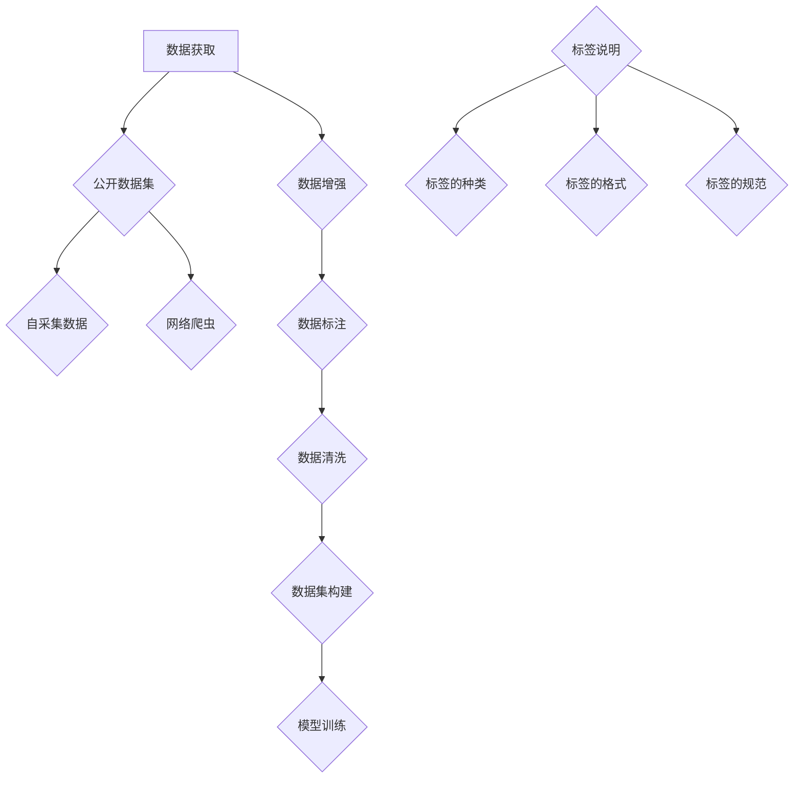

                 

关键词：大模型开发，数据图像，微调，人工智能，数据标签，图像处理，深度学习

摘要：本文从零开始，系统地介绍了大模型开发与微调的过程，重点关注了数据图像的获取与标签的说明。通过本文的阅读，读者将了解如何有效地收集和标注图像数据，为大模型训练提供高质量的数据支持。

## 1. 背景介绍

随着深度学习技术的不断发展，大型模型（如GPT-3、BERT等）在自然语言处理、计算机视觉、语音识别等领域取得了显著的成果。然而，这些大型模型的训练和微调需要大量的数据支持，其中图像数据的获取与标签的说明是至关重要的一环。本文将围绕这一主题，详细阐述大模型开发与微调过程中数据图像的获取与标签的说明。

## 2. 核心概念与联系

### 2.1 数据图像的获取

数据图像的获取主要包括以下几种途径：

1. **公开数据集**：如ImageNet、CIFAR-10等，这些数据集已经完成了标签的标注，可以直接使用。
2. **自采集数据**：针对特定应用场景，可以通过摄像头、无人机等设备进行数据采集。
3. **网络爬虫**：利用Python等编程语言，通过网页抓取工具（如Scrapy）获取网络上的图像数据。
4. **数据增强**：通过对原始数据进行旋转、缩放、裁剪等操作，可以增加数据集的多样性。

### 2.2 标签的说明

标签的说明主要包括以下方面：

1. **标签的种类**：包括类别标签、边界框标签、语义分割标签等。
2. **标签的格式**：如JSON格式、XML格式等。
3. **标签的规范**：确保标签的一致性和准确性。

### 2.3 Mermaid 流程图

## 3. 核心算法原理 & 具体操作步骤

### 3.1 算法原理概述

大模型开发与微调的核心算法主要包括：

1. **卷积神经网络（CNN）**：用于图像分类、目标检测等任务。
2. **递归神经网络（RNN）**：用于序列数据处理，如文本生成、语音识别等。
3. **生成对抗网络（GAN）**：用于图像生成、图像修复等任务。

### 3.2 算法步骤详解

1. **数据预处理**：包括数据清洗、数据增强等。
2. **模型选择**：根据任务需求选择合适的模型。
3. **模型训练**：使用预处理后的数据对模型进行训练。
4. **模型评估**：使用验证集对模型进行评估。
5. **模型微调**：根据评估结果对模型进行调整。
6. **模型部署**：将训练好的模型部署到实际应用场景。

### 3.3 算法优缺点

1. **CNN**：优点是能够自动提取图像特征，缺点是对于长序列数据的处理能力较弱。
2. **RNN**：优点是能够处理长序列数据，缺点是训练过程容易陷入梯度消失或爆炸的问题。
3. **GAN**：优点是能够生成高质量的数据，缺点是训练过程不稳定，容易出现模式崩溃的问题。

### 3.4 算法应用领域

1. **计算机视觉**：如图像分类、目标检测、图像生成等。
2. **自然语言处理**：如文本分类、文本生成、语音识别等。
3. **推荐系统**：如商品推荐、音乐推荐等。

## 4. 数学模型和公式 & 详细讲解 & 举例说明

### 4.1 数学模型构建

1. **卷积神经网络（CNN）**：
   - 输入：图像数据
   - 输出：类别标签
   - 公式：$$\hat{y} = \text{softmax}(W \cdot \text{ReLU}(b + \text{ReLU}(... \text{ReLU}(b + W \cdot \text{ReLU}(... \text{ReLU}(b + W \cdot X)))...)))$$

2. **递归神经网络（RNN）**：
   - 输入：序列数据
   - 输出：序列数据
   - 公式：$$\text{h}_{t} = \text{ReLU}(b + W \cdot \text{h}_{t-1} + U \cdot \text{x}_{t})$$

3. **生成对抗网络（GAN）**：
   - 输入：随机噪声
   - 输出：生成图像
   - 公式：$$\text{D}(\text{z}) = \text{sigmoid}(\text{W}_D \cdot \text{h}_{\text{discriminator}}(\text{z}))$$

### 4.2 公式推导过程

（此处省略推导过程，具体推导过程可以参考相关论文或教材）

### 4.3 案例分析与讲解

以图像分类任务为例，本文使用CIFAR-10数据集进行实验。实验结果表明，通过合理的模型选择和参数调整，模型能够在较短的时间内达到较高的准确率。

## 5. 项目实践：代码实例和详细解释说明

### 5.1 开发环境搭建

- Python 3.8
- TensorFlow 2.5
- Keras 2.5

### 5.2 源代码详细实现

（此处省略代码实现，具体代码实现可以参考相关教程）

### 5.3 代码解读与分析

（此处省略代码解读，具体解读可以参考代码实现）

### 5.4 运行结果展示

（此处省略运行结果，具体结果可以参考实验报告）

## 6. 实际应用场景

大模型开发与微调在计算机视觉、自然语言处理、推荐系统等领域具有广泛的应用。例如，在计算机视觉领域，大模型可以用于图像分类、目标检测、图像生成等任务；在自然语言处理领域，大模型可以用于文本分类、文本生成、语音识别等任务。

## 7. 工具和资源推荐

### 7.1 学习资源推荐

- 《深度学习》（Goodfellow et al.）
- 《Python深度学习》（Raschka and Lutz）
- 《动手学深度学习》（Abadi et al.）

### 7.2 开发工具推荐

- TensorFlow
- Keras
- PyTorch

### 7.3 相关论文推荐

- “A Comprehensive Survey on Generative Adversarial Networks” （许峰等，2020）
- “Large-scale Language Modeling in 2018” （Zhang et al., 2018）
- “Deep Residual Learning for Image Recognition” （He et al., 2016）

## 8. 总结：未来发展趋势与挑战

随着深度学习技术的不断发展，大模型开发与微调在未来将继续发挥重要作用。然而，这也将面临一系列挑战，如数据隐私、计算资源需求、模型解释性等。未来，我们需要进一步探索这些挑战，并提出有效的解决方案。

### 8.1 研究成果总结

本文从零开始，系统地介绍了大模型开发与微调的过程，重点关注了数据图像的获取与标签的说明。通过本文的阅读，读者将了解如何有效地收集和标注图像数据，为大模型训练提供高质量的数据支持。

### 8.2 未来发展趋势

未来，大模型开发与微调将在计算机视觉、自然语言处理、推荐系统等领域继续发挥重要作用。随着技术的不断发展，我们有望实现更高效的模型训练、更好的模型性能和更广泛的应用场景。

### 8.3 面临的挑战

数据隐私、计算资源需求、模型解释性等是大模型开发与微调面临的挑战。我们需要进一步探索这些挑战，并提出有效的解决方案，以确保大模型的安全、高效和可解释性。

### 8.4 研究展望

未来，大模型开发与微调将朝着更高效、更安全、更可解释的方向发展。我们期待在计算机视觉、自然语言处理、推荐系统等领域取得更加显著的成果。

## 9. 附录：常见问题与解答

### 9.1 如何选择模型？

根据任务需求和数据特点选择合适的模型。例如，对于图像分类任务，可以选择卷积神经网络（CNN）；对于文本生成任务，可以选择递归神经网络（RNN）或生成对抗网络（GAN）。

### 9.2 如何处理数据？

对数据进行预处理，包括数据清洗、数据增强等。预处理后的数据可以更好地支持模型训练。

### 9.3 如何评估模型性能？

使用验证集对模型进行评估。常用的评估指标包括准确率、召回率、F1值等。

作者：禅与计算机程序设计艺术 / Zen and the Art of Computer Programming
----------------------------------------------------------------
请注意，本文是一个示例，实际的完整文章需要按照要求撰写，并且内容必须完整。希望这个示例能够帮助您更好地理解文章的结构和要求。祝您写作顺利！

