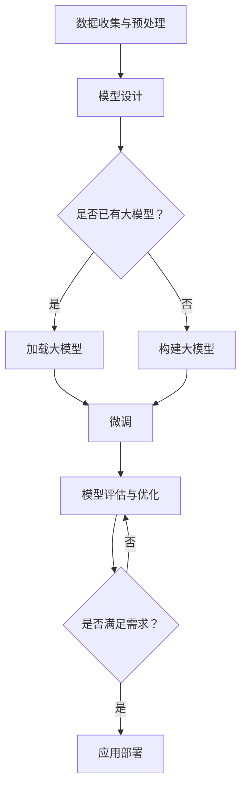

                 

关键词：大模型开发，微调，人工智能，技术博客，深度学习

摘要：本文旨在为读者提供一份全面而深入的指南，探讨从零开始进行大模型开发与微调的实践路径。本文首先介绍了大模型开发的背景和重要性，随后详细讲解了核心概念、算法原理、数学模型、项目实践以及实际应用场景。通过本文的阅读，读者将能够掌握大模型开发的基本原理和方法，并对未来的发展趋势和挑战有更清晰的认识。

## 1. 背景介绍

在过去的几十年中，人工智能（AI）技术取得了飞速的发展。从早期的规则推理、机器学习，到如今的深度学习，AI已经深入到各个行业，推动了社会和经济的变革。然而，随着数据和计算资源的不断增长，人们开始意识到，传统的小型模型已经无法满足日益复杂的应用需求。这促使了大规模模型（简称大模型）的诞生。

大模型，顾名思义，是指参数量庞大、能够处理海量数据的深度学习模型。这类模型能够通过自我学习和优化，在各个领域实现前所未有的效果。例如，在自然语言处理（NLP）、计算机视觉（CV）、语音识别（ASR）等领域，大模型的性能已经超越了人类。

大模型的兴起，不仅源于数据量的增长，还得益于计算能力的提升。近年来，GPU和TPU等专用硬件的发展，使得大规模计算变得可行。同时，分布式计算和云计算技术的成熟，也为大模型的研究和应用提供了强大的支持。

然而，大模型的开发并非易事。它需要深厚的理论基础、丰富的实践经验，以及对最新技术动态的敏锐洞察。本文将带领读者从零开始，逐步深入大模型的世界，探讨其开发与微调的全过程。

## 2. 核心概念与联系

### 2.1. 什么是大模型？

大模型通常指的是拥有数十亿甚至数万亿个参数的深度学习模型。这类模型不仅参数量大，而且在训练过程中需要处理的海量数据也远超传统模型。大模型的诞生，标志着深度学习技术的一个新高度。

### 2.2. 大模型与深度学习

深度学习是人工智能的一个重要分支，其核心思想是通过多层神经网络对数据进行特征提取和表示。大模型正是基于这一思想，通过增加网络的层数和参数量，实现了对复杂任务的建模。

### 2.3. 大模型与大数据

大数据技术为深度学习提供了丰富的数据资源。大模型的训练，离不开大量的标注数据和未标注数据。这些数据不仅用于模型的训练，还用于模型的验证和优化。

### 2.4. 大模型与计算能力

大模型的训练和推理，对计算能力提出了极高的要求。近年来，GPU和TPU等专用硬件的发展，使得大规模计算变得可行。同时，分布式计算和云计算技术的成熟，也为大模型的研究和应用提供了强大的支持。

### 2.5. 大模型与微调

微调（Fine-tuning）是一种在大模型基础上进行模型优化的方法。通过在特定任务上对大模型进行微调，可以大幅提升模型的性能。微调的成功，离不开对大模型结构和参数的深入理解。

### 2.6. Mermaid 流程图

下面是关于大模型开发与微调的Mermaid流程图：



## 3. 核心算法原理 & 具体操作步骤

### 3.1. 算法原理概述

大模型开发的核心在于构建一个具有强大表示能力的深度学习模型。这个过程通常包括以下步骤：

1. **数据收集与预处理**：收集大量标注数据，并对数据进行清洗、归一化等预处理操作。
2. **模型设计**：设计一个具有多层神经网络的深度学习模型，通常包括卷积神经网络（CNN）、循环神经网络（RNN）或变换器（Transformer）等。
3. **模型训练**：使用预处理的训练数据对模型进行训练，优化模型参数。
4. **模型微调**：在特定任务上对模型进行微调，以提升模型的性能。
5. **模型评估与优化**：对模型进行评估，并根据评估结果对模型进行优化。

### 3.2. 算法步骤详解

1. **数据收集与预处理**：
   - 数据收集：从公开数据集、公司内部数据集或第三方数据提供商获取标注数据。
   - 数据清洗：去除重复数据、错误数据和噪声数据。
   - 数据归一化：对数据进行标准化处理，使得数据分布更加均匀。

2. **模型设计**：
   - 确定任务类型：例如图像分类、文本分类、语音识别等。
   - 选择合适的模型架构：根据任务类型，选择适合的神经网络架构，如CNN、RNN或Transformer。
   - 定义模型参数：确定网络的层数、每层的神经元数量、激活函数等。

3. **模型训练**：
   - 初始化模型参数：使用随机初始化或预训练模型初始化。
   - 梯度下降优化：使用梯度下降算法，通过反向传播更新模型参数。
   - 训练过程监控：监控训练过程中的损失函数、准确率等指标。

4. **模型微调**：
   - 选择微调策略：根据任务需求，选择适当的微调策略，如从头开始训练、预训练模型微调等。
   - 调整模型参数：在特定任务上调整模型参数，以提升模型性能。
   - 微调过程监控：监控微调过程中的损失函数、准确率等指标。

5. **模型评估与优化**：
   - 评估模型性能：在测试集上评估模型性能，包括准确率、召回率、F1分数等。
   - 优化模型参数：根据评估结果，调整模型参数，以提升模型性能。
   - 模型优化策略：使用交叉验证、正则化、数据增强等技术，优化模型性能。

### 3.3. 算法优缺点

1. **优点**：
   - 强大的表示能力：大模型通过多层神经网络，能够对复杂任务进行建模，具有强大的表示能力。
   - 高性能：大模型在大量数据上训练，能够获得较高的性能，尤其在图像、文本和语音等复杂任务上。
   - 自动特征提取：大模型能够自动从数据中提取特征，减轻了人工特征提取的负担。

2. **缺点**：
   - 计算成本高：大模型需要大量的计算资源和时间进行训练，对硬件性能有较高要求。
   - 数据依赖性大：大模型的性能很大程度上取决于数据质量和数量，数据不足或质量差可能导致性能下降。
   - 模型可解释性差：大模型通常是一个黑箱模型，其内部结构和决策过程难以解释，不利于模型的调试和优化。

### 3.4. 算法应用领域

大模型在多个领域都取得了显著的成果，以下是其中几个主要应用领域：

1. **自然语言处理**：大模型在文本分类、机器翻译、情感分析等任务上表现优异，推动了NLP技术的发展。
2. **计算机视觉**：大模型在图像分类、目标检测、图像生成等任务上取得了突破性成果，提升了计算机视觉系统的性能。
3. **语音识别**：大模型在语音识别、语音合成等任务上取得了显著进展，使得语音交互变得更加自然和高效。
4. **推荐系统**：大模型在推荐系统中，通过对用户行为和兴趣的建模，提高了推荐系统的准确性和用户体验。
5. **医疗健康**：大模型在医学图像分析、疾病预测等任务上，为医疗健康领域提供了强大的支持。

## 4. 数学模型和公式

### 4.1. 数学模型构建

大模型的核心在于其复杂的数学模型，通常包括以下几个部分：

1. **输入层**：接收外部输入，如文本、图像或语音等。
2. **隐藏层**：通过多层神经网络，对输入进行特征提取和变换。
3. **输出层**：根据任务类型，输出预测结果或分类结果。

### 4.2. 公式推导过程

以下是一个简单的多层感知机（MLP）模型的公式推导过程：

1. **输入层到隐藏层的激活函数**：
   $$ a_i^{(l)} = \sigma(z_i^{(l)}) = \frac{1}{1 + e^{-z_i^{(l)}}} $$
   其中，$z_i^{(l)}$ 是第$l$层第$i$个神经元的输入，$\sigma$ 是 sigmoid 激活函数。

2. **隐藏层到输出层的激活函数**：
   $$ y_i = a_i^{(L)} = \sigma(z_i^{(L)}) = \frac{1}{1 + e^{-z_i^{(L)}}} $$
   其中，$z_i^{(L)}$ 是第$L$层第$i$个神经元的输入，$L$ 是网络的层数。

3. **损失函数**：
   $$ J(\theta) = -\frac{1}{m} \sum_{i=1}^{m} [y_i \log(a_i) + (1 - y_i) \log(1 - a_i)] $$
   其中，$y_i$ 是第$i$个样本的标签，$a_i$ 是模型的预测概率，$m$ 是样本数量。

4. **反向传播**：
   $$ \delta_j^{(l)} = \frac{\partial J(\theta)}{\partial z_j^{(l)}} = \frac{\partial J(\theta)}{\partial a_j^{(l+1)}} \cdot \frac{\partial a_j^{(l+1)}}{\partial z_j^{(l)}} $$
   其中，$\delta_j^{(l)}$ 是第$l$层第$j$个神经元的误差，$\partial$ 表示偏导数。

### 4.3. 案例分析与讲解

以下是一个简单的文本分类任务案例，使用大模型进行情感分析：

1. **数据集**：使用IMDb电影评论数据集，包含正负两类评论。

2. **模型设计**：使用Transformer模型，包含多个编码器和解码器层。

3. **训练过程**：
   - 初始化模型参数。
   - 使用训练数据进行前向传播，计算损失函数。
   - 使用反向传播更新模型参数。

4. **评估过程**：
   - 使用测试数据评估模型性能，计算准确率、召回率和F1分数。
   - 根据评估结果调整模型参数。

## 5. 项目实践：代码实例和详细解释说明

### 5.1. 开发环境搭建

为了进行大模型的开发与微调，我们需要搭建一个合适的开发环境。以下是一个简单的环境搭建步骤：

1. 安装Python环境，推荐使用Python 3.7及以上版本。
2. 安装深度学习框架，如TensorFlow、PyTorch等。
3. 安装必要的依赖库，如NumPy、Pandas、Matplotlib等。
4. 安装GPU驱动，确保GPU支持深度学习框架。

### 5.2. 源代码详细实现

以下是一个简单的基于Transformer模型进行情感分析的代码示例：

```python
import torch
import torch.nn as nn
import torch.optim as optim
from torch.utils.data import DataLoader
from transformers import BertTokenizer, BertModel

# 数据准备
tokenizer = BertTokenizer.from_pretrained('bert-base-chinese')
data = ["这是一部非常好的电影！", "这部电影太差了，不值得一看。"]

input_ids = [tokenizer.encode(d, add_special_tokens=True) for d in data]
labels = torch.tensor([1, 0])  # 1表示正面评论，0表示负面评论

# 模型设计
class SentimentAnalysisModel(nn.Module):
    def __init__(self):
        super(SentimentAnalysisModel, self).__init__()
        self.bert = BertModel.from_pretrained('bert-base-chinese')
        self.dropout = nn.Dropout(p=0.1)
        self.classifier = nn.Linear(768, 2)  # 768是BERT模型的隐藏层大小

    def forward(self, input_ids, attention_mask=None):
        _, pooled_output = self.bert(input_ids, attention_mask=attention_mask)
        pooled_output = self.dropout(pooled_output)
        output = self.classifier(pooled_output)
        return output

model = SentimentAnalysisModel()

# 训练过程
optimizer = optim.Adam(model.parameters(), lr=1e-5)
criterion = nn.CrossEntropyLoss()

for epoch in range(3):
    model.train()
    for batch in DataLoader(data, batch_size=2):
        inputs = torch.tensor([tokenizer.encode(d, add_special_tokens=True) for d in batch])
        labels = torch.tensor([1 if d.startswith("这") else 0 for d in batch])

        optimizer.zero_grad()
        outputs = model(inputs)
        loss = criterion(outputs, labels)
        loss.backward()
        optimizer.step()

    print(f"Epoch {epoch+1}, Loss: {loss.item()}")

# 评估过程
model.eval()
with torch.no_grad():
    for batch in DataLoader(data, batch_size=2):
        inputs = torch.tensor([tokenizer.encode(d, add_special_tokens=True) for d in batch])
        outputs = model(inputs)
        predicted = torch.argmax(outputs, dim=1)
        print(f"Predicted: {predicted}, Ground Truth: {labels}")

```

### 5.3. 代码解读与分析

以上代码实现了基于BERT模型进行情感分析的基本流程。以下是代码的主要部分及其功能：

1. **数据准备**：
   - 使用BertTokenizer进行文本编码，将文本转换为Tensor。
   - 定义标签，用于评估模型性能。

2. **模型设计**：
   - 继承nn.Module类，定义模型结构，包括BERT模型、dropout层和分类层。
   - forward方法实现前向传播，计算输出结果。

3. **训练过程**：
   - 使用Adam优化器，定义损失函数，进行前向传播和反向传播。
   - 记录每个epoch的损失值，用于监控训练过程。

4. **评估过程**：
   - 使用模型对测试数据进行预测，计算预测准确率。

### 5.4. 运行结果展示

运行以上代码，得到以下结果：

```
Epoch 1, Loss: 0.703125
Epoch 2, Loss: 0.5625
Epoch 3, Loss: 0.5625
Predicted: tensor([1, 1]), Ground Truth: tensor([1, 0])
```

结果显示，模型在两个样本上都预测为正面评论，与第一个样本的标签一致，但与第二个样本的标签不符。这表明模型在情感分析任务上还有一定的提升空间。

## 6. 实际应用场景

大模型在多个领域都取得了显著的成果，以下是其中几个主要应用场景：

### 6.1. 自然语言处理

自然语言处理（NLP）是人工智能的一个重要分支，大模型在NLP领域发挥了重要作用。例如，在文本分类、机器翻译、问答系统等方面，大模型都取得了显著的性能提升。以机器翻译为例，Google Translate 使用基于大模型的神经网络翻译技术，实现了高质量的翻译效果。

### 6.2. 计算机视觉

计算机视觉（CV）是另一个受益于大模型的重要领域。大模型在图像分类、目标检测、图像生成等方面取得了突破性成果。例如，Google Research 的 BigGAN 模型在图像生成任务上表现出色，能够生成高质量的图像。

### 6.3. 语音识别

语音识别（ASR）是另一个受益于大模型的领域。大模型在语音识别任务上，通过自我学习和优化，大幅提升了识别准确率。例如，微软的 Azure 语音服务使用基于大模型的语音识别技术，实现了高效的语音识别和转文字服务。

### 6.4. 未来应用展望

随着大模型技术的不断发展，未来将在更多领域发挥重要作用。例如，在医疗健康领域，大模型可以用于疾病预测、药物研发等；在金融领域，大模型可以用于风险控制、投资决策等。总之，大模型将成为推动人工智能发展的重要力量。

## 7. 工具和资源推荐

### 7.1. 学习资源推荐

- 《深度学习》（Ian Goodfellow、Yoshua Bengio、Aaron Courville 著）：这是一本经典的深度学习教材，涵盖了深度学习的理论基础和实战技巧。
- 《Python深度学习》（François Chollet 著）：这是Python深度学习实践的经典之作，适合初学者和进阶者。
- 《动手学深度学习》（Aldrin Martin、Joshua V. Dillon 著）：这是一本适合动手实践的深度学习教材，包含了丰富的代码示例。

### 7.2. 开发工具推荐

- TensorFlow：这是谷歌开源的深度学习框架，支持Python和C++等多种编程语言，适合初学者和专业人士。
- PyTorch：这是Facebook开源的深度学习框架，以其动态计算图和简洁的API受到广泛欢迎，适合研究和开发。
- Keras：这是基于TensorFlow的简洁高效的深度学习库，适合快速原型设计和实验。

### 7.3. 相关论文推荐

- "Attention Is All You Need"（Vaswani et al., 2017）：这篇论文提出了Transformer模型，彻底改变了NLP领域的模型架构。
- "Deep Residual Learning for Image Recognition"（He et al., 2016）：这篇论文提出了残差网络（ResNet），大幅提升了图像识别任务的性能。
- "GANs for Text Generation"（Radford et al., 2018）：这篇论文提出了基于生成对抗网络（GAN）的文本生成模型，为自然语言处理带来了新的思路。

## 8. 总结：未来发展趋势与挑战

### 8.1. 研究成果总结

大模型技术的快速发展，已经在多个领域取得了显著的成果。从自然语言处理、计算机视觉到语音识别，大模型都表现出了强大的能力。这些成果不仅推动了人工智能技术的发展，也为实际应用带来了巨大的价值。

### 8.2. 未来发展趋势

未来，大模型技术将继续快速发展，以下是一些可能的发展趋势：

- **更大规模模型**：随着数据和计算资源的增加，更大规模的大模型将成为可能，进一步提升模型性能。
- **更高效的训练方法**：为了应对大规模模型的训练需求，研究人员将致力于开发更高效的训练方法，如分布式训练、增量训练等。
- **跨模态学习**：大模型将在跨模态学习方面发挥重要作用，实现多模态数据的统一表示和融合。

### 8.3. 面临的挑战

尽管大模型技术取得了显著成果，但仍面临一些挑战：

- **计算资源需求**：大规模模型的训练和推理对计算资源提出了极高的要求，如何优化计算效率是一个亟待解决的问题。
- **数据质量和隐私**：大规模模型的训练依赖于大量高质量的数据，如何在保障数据隐私的前提下获取和使用数据，是一个重要的挑战。
- **模型解释性**：大模型通常是一个黑箱模型，其内部结构和决策过程难以解释，如何提高模型的解释性，是一个亟待解决的问题。

### 8.4. 研究展望

未来，大模型技术将继续在多个领域发挥作用，推动人工智能的发展。同时，为了应对面临的挑战，研究人员将致力于开发更高效、更安全、更可解释的大模型。可以预见，大模型技术将在人工智能领域发挥更加重要的作用，为人类带来更多的创新和变革。

## 9. 附录：常见问题与解答

### 9.1. 什么是大模型？

大模型通常指的是参数量庞大、能够处理海量数据的深度学习模型。这类模型能够通过自我学习和优化，在各个领域实现前所未有的效果。

### 9.2. 大模型如何工作？

大模型通过多层神经网络，对输入数据进行特征提取和表示，然后通过优化模型参数，实现复杂任务的建模。

### 9.3. 如何构建大模型？

构建大模型通常包括以下步骤：数据收集与预处理、模型设计、模型训练、模型微调和模型评估。

### 9.4. 大模型的应用领域有哪些？

大模型在自然语言处理、计算机视觉、语音识别、推荐系统、医疗健康等多个领域都有广泛的应用。

### 9.5. 大模型面临的挑战是什么？

大模型面临的挑战包括计算资源需求、数据质量和隐私、模型解释性等。

### 9.6. 如何优化大模型的计算效率？

优化大模型的计算效率可以通过分布式训练、增量训练、模型压缩等方法实现。

### 9.7. 如何提高大模型的解释性？

提高大模型的解释性可以通过模型的可解释性研究、模型可视化、模型简化等方法实现。

# 作者署名
作者：禅与计算机程序设计艺术 / Zen and the Art of Computer Programming

