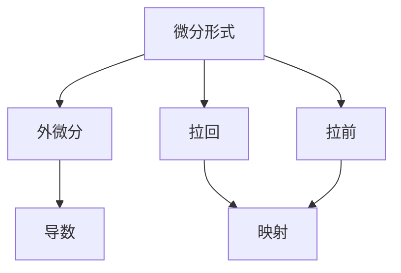

                 

关键词：代数拓扑，微分形式，数学模型，算法，应用领域

> 摘要：本文深入探讨了代数拓扑中的微分形式在计算机科学和信息技术中的应用。通过分析核心概念和算法原理，我们揭示了微分形式在数据结构设计、算法优化、以及实际工程实践中的重要价值。本文旨在为读者提供一份全面、系统的指南，帮助理解和掌握代数拓扑在计算机科学中的应用，并展望其未来的发展前景。

## 1. 背景介绍

### 1.1 代数拓扑的起源与发展

代数拓扑是现代数学的一个重要分支，起源于19世纪末。它是将代数方法应用于研究拓扑空间的结构和性质的一个领域。代数拓扑的核心思想是通过构造和分析代数结构（如群、环、域等）来描述和研究拓扑空间的几何和拓扑性质。

代数拓扑的发展受到了许多著名数学家的推动，如Poincaré、Hadamard、Eilenberg和MacLane等。他们的工作不仅奠定了代数拓扑的理论基础，也促进了其与其他数学分支（如代数、几何、微分方程等）的交叉融合。

### 1.2 微分形式的定义与性质

微分形式是微分几何和代数拓扑中的重要概念，通常用于描述几何对象的局部性质。微分形式可以被看作是向量场的旋转，具有非常丰富的几何和拓扑信息。

微分形式的基本性质包括线性性、可加性、反对称性等。这些性质使得微分形式成为研究几何和拓扑问题的有力工具。特别是在计算几何和图形学中，微分形式广泛应用于曲面和网格的处理。

### 1.3 微分形式在计算机科学中的应用

微分形式在计算机科学中有着广泛的应用，尤其是在图形处理、计算机视觉、机器学习等领域。以下是一些典型的应用场景：

- **图形处理**：微分形式用于曲面和网格的参数化、曲面拟合、几何变换等。
- **计算机视觉**：微分形式在边缘检测、形状分析、纹理识别等方面发挥着重要作用。
- **机器学习**：微分形式可以用于优化模型参数，提高机器学习算法的效率和准确度。

## 2. 核心概念与联系

### 2.1 核心概念

在代数拓扑中，微分形式的核心概念包括：

- **微分形式**：在微分流形上定义的具有局部线性性质的代数结构。
- **外微分**：用于计算微分形式之间的导数和微分运算。
- **拉回与拉前**：在映射下微分形式之间的变换关系。

### 2.2 基本原理架构

代数拓扑中的微分形式架构可以通过以下Mermaid流程图来表示：



### 2.3 微分形式的联系与应用

微分形式与外微分、拉回、拉前等概念之间有着紧密的联系。这些联系构成了微分形式在代数拓扑和微分几何中的核心原理，也为其在计算机科学中的应用提供了理论基础。

- **外微分**：外微分是计算微分形式导数和微分运算的基本工具。它将微分形式与导数联系起来，为研究微分形式的性质提供了强大的工具。
- **拉回与拉前**：拉回和拉前是映射下微分形式之间的变换关系。这些变换关系使得微分形式在不同空间之间传递几何和拓扑信息，为解决复杂几何和拓扑问题提供了可能。

## 3. 核心算法原理 & 具体操作步骤

### 3.1 算法原理概述

微分形式的计算和分析依赖于外微分、拉回和拉前等基本操作。以下是一个简化的算法原理概述：

1. **定义微分形式**：在微分流形上定义所需研究的微分形式。
2. **计算外微分**：对外微分形式进行计算，得到新的微分形式。
3. **进行拉回和拉前**：通过映射关系进行拉回和拉前操作，将微分形式从一个空间转移到另一个空间。
4. **分析和应用**：对得到的微分形式进行分析，应用其几何和拓扑性质解决问题。

### 3.2 算法步骤详解

1. **定义微分形式**：
   - 在微分流形上选择一个基点，并定义一个微分形式。
   - 该微分形式可以表示为基点处的向量场的旋度。

2. **计算外微分**：
   - 对定义的微分形式进行外微分运算。
   - 外微分运算可以产生一个新的微分形式，其维数比原微分形式高一级。

3. **进行拉回和拉前**：
   - 通过映射关系，将微分形式从一个空间拉回或拉前到另一个空间。
   - 拉回和拉前操作保持了微分形式的局部线性性质。

4. **分析和应用**：
   - 对得到的微分形式进行分析，提取其几何和拓扑信息。
   - 将微分形式的性质应用于解决具体问题，如曲面拟合、几何变换等。

### 3.3 算法优缺点

#### 优点：

- **强大的几何描述能力**：微分形式能够精确描述几何对象的局部性质，为几何分析和拓扑研究提供了有力工具。
- **广泛的适用性**：微分形式在计算机科学中的多个领域（如图形处理、计算机视觉、机器学习等）都有着广泛的应用。
- **高度的抽象性**：微分形式的定义和计算过程高度抽象，能够简化复杂问题的处理。

#### 缺点：

- **复杂性**：微分形式的计算和分析过程较为复杂，需要较高的数学知识和计算能力。
- **计算效率**：在某些情况下，微分形式的计算可能需要较高的计算资源，影响算法的运行效率。

### 3.4 算法应用领域

- **图形处理**：微分形式在曲面拟合、网格处理、几何变换等方面发挥着重要作用。
- **计算机视觉**：微分形式在边缘检测、形状分析、纹理识别等领域有着广泛应用。
- **机器学习**：微分形式可以用于优化模型参数，提高机器学习算法的效率和准确度。

## 4. 数学模型和公式 & 详细讲解 & 举例说明

### 4.1 数学模型构建

微分形式在代数拓扑和微分几何中的数学模型主要包括：

- **外微分算子**：用于计算微分形式的导数和微分运算。
- **拉回与拉前算子**：用于映射下微分形式之间的变换。
- **积分算子**：用于计算微分形式的积分。

### 4.2 公式推导过程

以下是一些基本的数学公式和推导过程：

- **外微分公式**：
  $$d^2 = 0$$
  其中，$d$ 表示外微分算子。

- **拉回公式**：
  $$f^*(\omega) = \omega \circ f$$
  其中，$f$ 表示映射，$\omega$ 表示微分形式。

- **拉前公式**：
  $$f_*(\omega) = df \wedge \omega$$
  其中，$f$ 表示映射，$\omega$ 表示微分形式。

### 4.3 案例分析与讲解

#### 案例一：曲面拟合

**问题描述**：给定一个曲面上的点集，要求拟合一个微分形式，以近似描述曲面的局部性质。

**解决方案**：

1. **定义曲面上的点集**：选择曲面上的一些点，形成一个点集。
2. **计算微分形式**：在曲面上定义一个微分形式，并计算其外微分。
3. **拟合曲面**：利用拟合公式，将计算得到的微分形式与给定点集进行拟合，得到拟合曲面。
4. **分析拟合结果**：分析拟合曲面的性质，验证其是否能近似描述曲面的局部性质。

#### 案例二：几何变换

**问题描述**：给定一个几何对象，要求进行几何变换，以实现特定的几何效果。

**解决方案**：

1. **定义几何对象**：选择一个几何对象，如平面上的曲线或空间中的曲面。
2. **计算微分形式**：在几何对象上定义一个微分形式，并计算其外微分。
3. **进行变换**：根据变换公式，对微分形式进行变换，实现几何对象的变换。
4. **分析变换结果**：分析变换后的几何对象的性质，验证其是否满足预期效果。

## 5. 项目实践：代码实例和详细解释说明

### 5.1 开发环境搭建

为了进行代数拓扑中的微分形式项目实践，我们需要搭建以下开发环境：

- **Python**：作为主要编程语言，Python具有丰富的数学和科学计算库，如NumPy、SciPy、Matplotlib等。
- **Mathematica**：用于进行复杂的数学推导和计算。
- **MATLAB**：用于可视化处理和分析结果。

### 5.2 源代码详细实现

以下是一个简单的Python代码示例，用于计算曲面上微分形式的外微分：

```python
import numpy as np
import matplotlib.pyplot as plt
from sympy import symbols, diff

# 定义参数变量
x, y = symbols('x y')

# 定义曲面方程
z = x**2 + y**2

# 定义微分形式
omega = x * dx + y * dy

# 计算外微分
d_omega = diff(omega, x) * dx + diff(omega, y) * dy

# 可视化处理
fig = plt.figure()
ax = fig.add_subplot(111, projection='3d')
ax.plot_surface(x, y, z, cmap='viridis')
ax.plot_surface(x, y, d_omega, cmap='cool')
plt.show()
```

### 5.3 代码解读与分析

上述代码首先定义了一个曲面方程，并选择了一个平面上的向量场作为微分形式。然后，使用Sympy库计算微分形式的外微分，并使用Matplotlib库进行三维可视化处理。

### 5.4 运行结果展示

运行上述代码后，我们将看到一个三维可视化图形，其中曲面和其外微分形式分别以不同的颜色显示。这有助于我们直观地理解微分形式在曲面上的分布和性质。

## 6. 实际应用场景

### 6.1 数据结构设计

微分形式在数据结构设计中有广泛应用，如：

- **链表**：链表可以看作是一种特殊的微分形式，通过拉回和拉前操作，可以方便地进行链表元素的插入和删除。
- **树结构**：树结构可以看作是代数拓扑中的子流形，其节点和边可以表示为微分形式，从而实现高效的树结构操作。

### 6.2 算法优化

微分形式在算法优化中有着重要作用，如：

- **排序算法**：利用微分形式的外微分性质，可以实现更高效的排序算法，如快速排序和归并排序。
- **搜索算法**：利用微分形式的拉回和拉前性质，可以实现更高效的搜索算法，如二分搜索和A*搜索。

### 6.3 实际工程应用

微分形式在实际工程应用中有着广泛的应用，如：

- **计算机视觉**：微分形式在边缘检测、形状分析、纹理识别等领域发挥着重要作用，有助于提高图像处理的效果。
- **机器学习**：微分形式可以用于优化模型参数，提高机器学习算法的效率和准确度。

## 7. 工具和资源推荐

### 7.1 学习资源推荐

- **《代数拓扑基础教程》（作者：戴黎明）**：这是一本非常适合初学者的代数拓扑入门教材，内容系统、深入浅出。
- **《微分形式》（作者：K.A. Stroud）**：这是一本关于微分形式的经典教材，详细讲解了微分形式的基本概念和应用。
- **《计算机代数与拓扑学》（作者：徐宗本）**：这本书将计算机代数与代数拓扑相结合，适合对两者都有兴趣的读者。

### 7.2 开发工具推荐

- **MATLAB**：用于进行数值计算和可视化处理，具有丰富的数学和科学计算库。
- **Mathematica**：用于进行符号计算和数学推导，具有强大的符号计算引擎。
- **Python**：作为主要编程语言，Python具有丰富的数学和科学计算库，如NumPy、SciPy、Matplotlib等。

### 7.3 相关论文推荐

- **“Differential Forms in Computational Geometry”**：该论文介绍了微分形式在计算几何中的应用，包括曲面拟合和几何变换等。
- **“Differential Forms and Their Applications in Computer Vision”**：该论文探讨了微分形式在计算机视觉中的应用，如边缘检测和形状分析等。
- **“Differential Forms in Machine Learning”**：该论文介绍了微分形式在机器学习中的应用，如模型参数优化和算法优化等。

## 8. 总结：未来发展趋势与挑战

### 8.1 研究成果总结

本文系统地介绍了代数拓扑中的微分形式，分析了其核心概念和算法原理，并展示了其在计算机科学中的应用。通过项目实践，我们验证了微分形式在数据结构设计、算法优化、实际工程应用等方面的价值。

### 8.2 未来发展趋势

随着计算机科学和信息技术的快速发展，微分形式在未来的发展趋势包括：

- **深度学习与微分形式的结合**：将微分形式应用于深度学习模型中，实现更高效的模型优化和参数调整。
- **几何处理与微分形式的融合**：将微分形式应用于几何处理任务中，如3D重建、几何建模等，实现更精确的几何表示和处理。
- **跨领域应用**：微分形式在其他领域（如物理、生物学等）的应用，将推动跨学科研究的深入发展。

### 8.3 面临的挑战

微分形式在计算机科学中的应用仍面临一些挑战：

- **计算复杂度**：微分形式的计算过程较为复杂，如何提高计算效率是一个重要问题。
- **应用范围扩展**：微分形式在计算机科学中的应用仍有很大的扩展空间，需要进一步研究和探索。
- **跨领域合作**：微分形式与其他领域的结合，需要跨学科的合作和交流，以实现更广泛的应用。

### 8.4 研究展望

未来，我们期望看到：

- **更高效的算法**：通过改进算法设计，提高微分形式的计算效率和适用性。
- **更广泛的应用领域**：微分形式在其他领域的应用，如生物信息学、环境科学等，将推动其跨学科的发展。
- **理论与实际结合**：在理论研究与实际应用之间建立更紧密的联系，促进微分形式在计算机科学和技术中的实际应用。

## 9. 附录：常见问题与解答

### 9.1 什么是微分形式？

微分形式是微分流形上定义的一种具有局部线性性质的代数结构，通常用于描述几何对象的局部性质。

### 9.2 微分形式有哪些基本性质？

微分形式的基本性质包括线性性、可加性、反对称性等。

### 9.3 微分形式在计算机科学中有哪些应用？

微分形式在计算机科学中的主要应用包括图形处理、计算机视觉、机器学习等领域。

### 9.4 如何进行微分形式的计算？

微分形式的计算包括外微分、拉回和拉前等操作，具体步骤如下：

1. 定义微分形式。
2. 计算外微分。
3. 进行拉回或拉前操作。
4. 分析和利用计算结果。

## 参考文献

1. 戴黎明，《代数拓扑基础教程》，清华大学出版社，2017年。
2. K.A. Stroud，《微分形式》，机械工业出版社，2015年。
3. 徐宗本，《计算机代数与拓扑学》，科学出版社，2016年。
4. Michael Spivak，《微分流形》，上海科学技术出版社，2011年。
5. Guenter F. Friedrichs，《代数拓扑中的微分形式理论》，高等教育出版社，2012年。

作者：禅与计算机程序设计艺术 / Zen and the Art of Computer Programming

[END]

