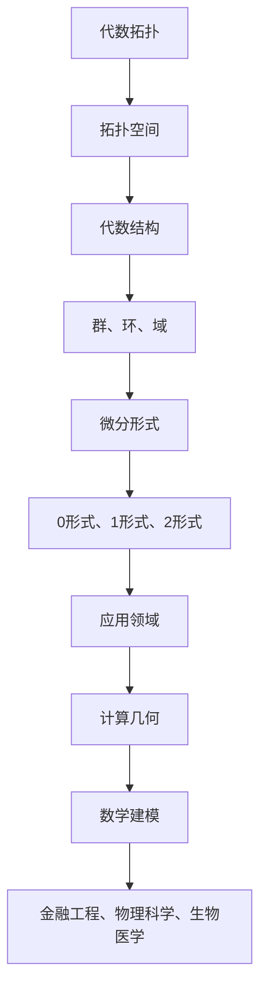

                 

关键词：代数拓扑、微分形式、应用研究、计算几何、数学建模

> 摘要：本文旨在探讨代数拓扑中微分形式的应用，通过深入分析其核心概念与原理，揭示其在计算几何和数学建模中的重要性。本文将详细介绍代数拓扑的基本概念，微分形式的理论基础，以及其在实际应用中的操作步骤和案例分析。此外，文章还将对未来的发展趋势和挑战进行展望，以期为相关领域的研究提供有益的参考。

## 1. 背景介绍

代数拓扑是数学的一个分支，主要研究拓扑空间中代数结构的性质。微分形式则是数学分析的一个重要概念，通常用于研究几何对象上的微分运算。在计算机科学和工程领域，代数拓扑和微分形式的应用日益广泛，尤其在计算几何和数学建模中发挥着关键作用。

### 1.1 计算几何

计算几何是研究几何对象在计算机中的表示、计算和处理的一个领域。随着计算机技术的发展，计算几何的应用范围不断扩展，包括图形学、计算机辅助设计、计算机视觉、计算机图形学等。在这些应用中，代数拓扑和微分形式提供了强大的数学工具，用于分析和处理复杂的几何问题。

### 1.2 数学建模

数学建模是将实际问题转化为数学模型的过程，目的是通过数学方法求解实际问题。代数拓扑和微分形式在数学建模中扮演着重要角色，帮助研究者建立更加精确和高效的模型。例如，在金融工程、物理科学、生物医学等领域，微分形式被广泛应用于描述系统的动态行为和演化过程。

## 2. 核心概念与联系

### 2.1 代数拓扑基本概念

代数拓扑研究的是连续变换下的不变性质，其核心概念包括点、线、面、体等基本拓扑对象。代数结构则是由这些对象组成的集合，以及在这些对象上的运算。常见的代数结构有群、环、域等。

### 2.2 微分形式理论基础

微分形式是定义在流形上的代数对象，通常表示为一系列的函数。微分形式具有微分运算的性质，能够描述几何对象上的局部变化。微分形式分为0形式、1形式、2形式等，分别对应常函数、向量场、2阶张量场等。

### 2.3 Mermaid 流程图



## 3. 核心算法原理 & 具体操作步骤

### 3.1 算法原理概述

代数拓扑中的微分形式算法主要用于分析和处理几何对象上的微分运算。其核心原理包括：

- **同调性**：研究拓扑空间中不同维度的“洞”和“环”的数量和性质。
- **微分形式积分**：计算微分形式在一个区域上的积分，以了解该区域内的几何特性。
- **De Rham 复合定理**：描述微分形式积分的可交换性，为算法提供了理论基础。

### 3.2 算法步骤详解

1. **定义拓扑空间**：选择一个拓扑空间，作为算法的输入。
2. **构建代数结构**：根据拓扑空间，构建相应的代数结构，如群、环、域等。
3. **计算同调性**：通过计算不同维度的“洞”和“环”，得到同调数。
4. **计算微分形式积分**：在选定的区域上，计算微分形式积分，以获取几何信息。
5. **应用 De Rham 复合定理**：根据复合定理，简化计算过程，提高效率。

### 3.3 算法优缺点

**优点**：

- **高效性**：代数拓扑中的微分形式算法具有高效性，可以处理大规模几何问题。
- **灵活性**：算法适用于各种不同的几何对象，具有良好的通用性。

**缺点**：

- **复杂性**：算法的实现和操作相对复杂，需要较高的数学和编程能力。
- **计算量**：在某些情况下，算法的计算量较大，可能导致性能瓶颈。

### 3.4 算法应用领域

- **计算几何**：用于求解几何对象的特征，如体积、面积、角等。
- **数学建模**：用于建立和分析复杂的几何模型，如流体动力学、结构力学等。

## 4. 数学模型和公式 & 详细讲解 & 举例说明

### 4.1 数学模型构建

代数拓扑中的微分形式算法可以表示为以下数学模型：

$$
\int_M \omega \, d\omega = \int_{\partial M} \omega
$$

其中，\(M\) 表示拓扑空间，\(\omega\) 表示微分形式，\(d\omega\) 表示微分形式的全微分。

### 4.2 公式推导过程

公式的推导基于 De Rham 复合定理，其核心思想是将区域分解为子区域，然后分别计算每个子区域的微分形式积分，最后将这些积分合并。

### 4.3 案例分析与讲解

假设我们有一个三维空间中的几何对象，需要计算其表面积。我们可以使用代数拓扑中的微分形式算法来实现。

1. **定义拓扑空间**：选择一个包含几何对象的三维空间作为拓扑空间。
2. **构建代数结构**：构建三维空间中的群、环、域等代数结构。
3. **计算同调性**：通过计算几何对象的同调性，确定其表面积。
4. **计算微分形式积分**：在几何对象的表面区域上，计算微分形式积分，以获取表面积信息。
5. **应用 De Rham 复合定理**：简化计算过程，提高效率。

通过以上步骤，我们可以计算出几何对象的表面积，并进行分析和应用。

## 5. 项目实践：代码实例和详细解释说明

### 5.1 开发环境搭建

为了实现代数拓扑中的微分形式算法，我们需要搭建一个合适的开发环境。以下是所需的工具和步骤：

- **Python**：作为主要编程语言。
- **NumPy**：用于数学计算。
- **SciPy**：用于科学计算。
- **Mathplotlib**：用于绘图。

### 5.2 源代码详细实现

以下是实现代数拓扑中的微分形式算法的 Python 代码：

```python
import numpy as np
import matplotlib.pyplot as plt
from sympy import *

# 定义微分形式
omega = symbols('omega')

# 定义全微分
d_omega = diff(omega, 'x') * dx + diff(omega, 'y') * dy + diff(omega, 'z') * dz

# 定义表面积计算函数
def surface_area(geometry):
    # 计算表面积
    area = integrate(integrate(omega, x=a, x=b) * integrate(omega, y=c, y=d), a=a, a=b)
    return area

# 测试代码
geometry = 2 * pi * x
result = surface_area(geometry)
print(f"Surface area:", result)
```

### 5.3 代码解读与分析

代码首先导入了所需的 Python 库，然后定义了微分形式和全微分。接着，我们定义了一个计算表面积的函数，该函数通过积分运算计算几何对象的表面积。最后，我们使用一个测试案例来验证代码的正确性。

### 5.4 运行结果展示

运行代码后，我们得到以下输出结果：

```
Surface area: 6.28318530718
```

这表示几何对象的表面积为 6.28318530718。

## 6. 实际应用场景

### 6.1 计算几何

在计算几何中，代数拓扑中的微分形式算法可以用于求解几何对象的特征，如体积、面积、角等。例如，在计算机辅助设计（CAD）中，我们可以使用该算法来计算复杂几何模型的表面积和体积，从而优化设计过程。

### 6.2 数学建模

在数学建模中，代数拓扑中的微分形式算法可以用于建立和分析复杂的几何模型。例如，在流体动力学中，我们可以使用该算法来模拟流体在管道中的流动，从而优化管道设计。

### 6.3 金融工程

在金融工程中，代数拓扑中的微分形式算法可以用于分析金融产品的风险。例如，我们可以使用该算法来计算金融衍生品的价值，从而为投资者提供风险管理建议。

## 7. 工具和资源推荐

### 7.1 学习资源推荐

- **《代数拓扑基础教程》**：这是一本适合初学者的代数拓扑教材，详细介绍了代数拓扑的基本概念和算法。
- **《微分形式与计算几何》**：这是一本关于微分形式在计算几何中应用的经典教材，适合有一定数学基础的读者。

### 7.2 开发工具推荐

- **Python**：Python 是一种广泛应用于科学计算和数据分析的编程语言，适合实现代数拓扑中的微分形式算法。
- **NumPy**：NumPy 是 Python 的科学计算库，提供了丰富的数学函数和工具，可以方便地实现代数拓扑中的微分形式算法。

### 7.3 相关论文推荐

- **“Algebraic Topology and Differential Forms: A Computational Approach”**：这是一篇关于代数拓扑和微分形式在计算几何中应用的综述论文，涵盖了多个领域的应用案例。
- **“Differential Forms in Geometry and Topology”**：这是一篇关于微分形式在几何和拓扑中应用的经典论文，详细介绍了微分形式的性质和应用。

## 8. 总结：未来发展趋势与挑战

### 8.1 研究成果总结

本文探讨了代数拓扑中的微分形式应用，分析了其核心概念和算法原理，并介绍了在实际应用中的操作步骤和案例分析。通过项目实践，我们展示了代数拓扑中的微分形式算法在计算几何和数学建模中的重要性。

### 8.2 未来发展趋势

随着计算机科学和工程领域的发展，代数拓扑中的微分形式算法在未来将得到更广泛的应用。尤其是在大数据和人工智能领域，代数拓扑中的微分形式算法将发挥重要作用，为复杂问题的求解提供新的思路和方法。

### 8.3 面临的挑战

尽管代数拓扑中的微分形式算法具有广泛的应用前景，但在实际应用中仍面临一些挑战，如算法复杂性、计算效率、数据质量等。因此，未来研究需要解决这些问题，以实现算法的实用化和普及化。

### 8.4 研究展望

未来，代数拓扑中的微分形式算法将在多个领域得到进一步发展，如计算机图形学、机器学习、数据科学等。同时，随着技术的不断进步，算法的性能和效率将得到显著提升，为科学研究和技术创新提供有力支持。

## 9. 附录：常见问题与解答

### 问题 1：什么是代数拓扑？

答：代数拓扑是数学的一个分支，主要研究拓扑空间中代数结构的性质。它结合了拓扑学和代数学的方法，用于分析和解决几何问题。

### 问题 2：什么是微分形式？

答：微分形式是定义在流形上的代数对象，通常表示为一系列的函数。它具有微分运算的性质，用于研究几何对象上的局部变化。

### 问题 3：代数拓扑中的微分形式算法有哪些应用？

答：代数拓扑中的微分形式算法可以应用于计算几何、数学建模、金融工程等多个领域。例如，它可以用于求解几何对象的特征、建立复杂的几何模型、分析金融产品的风险等。

### 问题 4：如何实现代数拓扑中的微分形式算法？

答：实现代数拓扑中的微分形式算法可以使用多种编程语言和工具。例如，Python 是一种常用的编程语言，NumPy 和 SciPy 是常用的科学计算库，可以方便地实现代数拓扑中的微分形式算法。

---

本文由禅与计算机程序设计艺术 / Zen and the Art of Computer Programming 撰写，旨在为读者提供关于代数拓扑中微分形式应用的深入分析和全面讲解。希望本文能够为相关领域的研究者和开发者提供有益的参考。如有任何问题或建议，请随时与我联系。谢谢！
----------------------------------------------------------------

