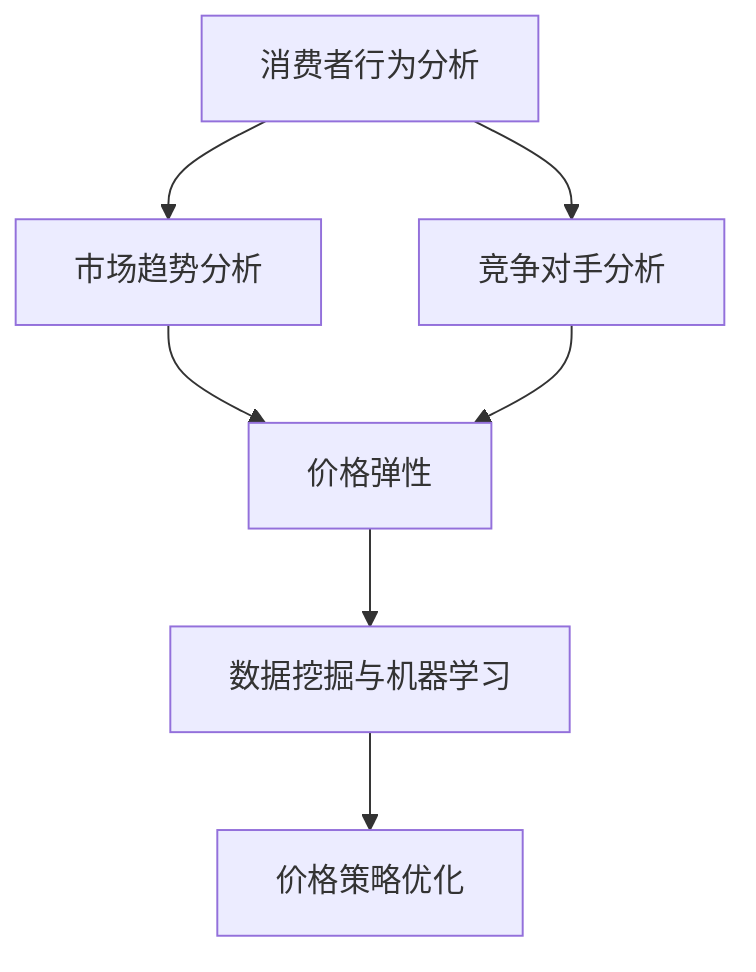

                 

### 1. 背景介绍

随着互联网技术的迅猛发展，电子商务已经成为当今世界经济增长的重要引擎。各大电商平台通过不断优化用户体验和提升服务品质，吸引了越来越多的消费者。然而，价格作为消费者决策的重要因素之一，如何制定和调整价格策略成为了电商平台提升竞争力的关键所在。

在过去，电商平台主要依赖于固定价格策略或者简单的折扣促销来吸引消费者。然而，这种传统的价格策略已经无法满足消费者日益个性化的需求，也无法应对市场竞争的激烈变化。为了在竞争中脱颖而出，电商平台开始探索更加智能化和个性化的价格优化技术。

价格优化技术旨在通过分析消费者行为数据、市场趋势和竞争对手策略，制定出更加精准和有效的价格策略，从而提高销售额和市场份额。这种技术的核心思想是将数据驱动的决策与价格策略相结合，实现从“价格制定”到“价格优化”的转变。

本文将深入探讨价格优化技术的核心概念、算法原理、数学模型、项目实践以及实际应用场景，分析其提升电商竞争力的关键作用，并提出未来发展趋势与挑战。

### 2. 核心概念与联系

要深入理解价格优化技术，首先需要掌握以下几个核心概念：

#### 2.1 消费者行为分析

消费者行为分析是指通过收集和分析消费者的购买历史、浏览记录、搜索行为等数据，了解消费者的购买偏好、购买习惯和购买决策过程。这些数据为价格优化提供了重要的依据，可以帮助电商平台更好地定位目标消费者，制定出更具针对性的价格策略。

#### 2.2 市场趋势分析

市场趋势分析是指通过分析市场供需关系、价格波动、竞争对手策略等，了解市场的整体发展趋势。这种分析有助于电商平台把握市场动态，及时调整价格策略，以应对市场的变化。

#### 2.3 竞争对手分析

竞争对手分析是指通过研究竞争对手的价格策略、促销活动、市场份额等，了解竞争对手的优势和劣势。这种分析可以帮助电商平台发现市场机会，制定出更有竞争力的价格策略。

#### 2.4 价格弹性

价格弹性是指消费者对价格变动的敏感程度。不同产品和服务对价格变动的反应程度不同，了解价格弹性有助于电商平台确定价格调整的幅度和时机。

#### 2.5 数据挖掘与机器学习

数据挖掘和机器学习是价格优化技术的核心技术。通过数据挖掘可以发现消费者行为和市场趋势的规律，而通过机器学习可以建立预测模型和优化算法，实现价格策略的自动化和智能化。

接下来，我们将使用Mermaid流程图来展示这些核心概念之间的联系：



### 3. 核心算法原理 & 具体操作步骤

#### 3.1 算法原理概述

价格优化算法的基本原理是基于消费者行为分析、市场趋势分析和竞争对手分析的结果，利用数据挖掘和机器学习技术，建立价格预测模型和优化算法，从而实现价格的动态调整。

具体来说，算法可以分为以下几个步骤：

1. **数据收集与预处理**：收集消费者行为数据、市场趋势数据和竞争对手数据，并进行清洗和预处理，以便后续分析。
2. **特征工程**：提取与价格相关的特征，如消费者购买历史、浏览记录、市场供需情况等，为建模提供基础。
3. **建模**：利用数据挖掘技术，建立价格预测模型，如线性回归、决策树、神经网络等。
4. **优化**：利用机器学习算法，如梯度下降、遗传算法等，优化价格策略，实现价格的动态调整。
5. **评估与调整**：对优化后的价格策略进行评估，根据评估结果进行调整，以实现持续优化。

#### 3.2 算法步骤详解

1. **数据收集与预处理**

   数据收集是算法的基础，需要收集包括消费者行为数据、市场趋势数据和竞争对手数据在内的多种数据。例如，消费者行为数据可以包括购买历史、浏览记录、搜索关键词等；市场趋势数据可以包括市场价格、供需情况、季节性变化等；竞争对手数据可以包括竞争对手的价格策略、促销活动等。

   数据收集后，需要进行清洗和预处理，以去除噪声和异常值，提高数据的质量。例如，可以采用去重、补全缺失值、归一化等方法。

2. **特征工程**

   特征工程是数据挖掘和机器学习的重要步骤，其目的是提取与价格相关的有效特征，提高模型的预测准确性。例如，可以采用以下方法提取特征：

   - **消费者特征**：包括年龄、性别、收入水平、职业等，这些特征可以反映消费者的购买能力和购买意愿。
   - **商品特征**：包括商品种类、品牌、价格、库存量等，这些特征可以反映商品的市场表现和竞争态势。
   - **市场特征**：包括市场价格、供需情况、季节性变化等，这些特征可以反映市场的整体趋势和动态。

3. **建模**

   选择合适的模型进行价格预测，常用的模型包括线性回归、决策树、神经网络等。每种模型都有其优缺点，需要根据具体情况进行选择。例如：

   - **线性回归**：简单易懂，易于实现，但可能无法捕捉复杂的关系。
   - **决策树**：直观易理解，可以捕捉非线性关系，但可能存在过拟合问题。
   - **神经网络**：强大的非线性建模能力，但训练过程复杂，容易过拟合。

4. **优化**

   利用机器学习算法对价格策略进行优化，常用的算法包括梯度下降、遗传算法等。优化过程旨在找到最优的价格策略，使销售额最大化或成本最小化。例如：

   - **梯度下降**：通过不断调整价格参数，使得损失函数最小，从而找到最优的价格策略。
   - **遗传算法**：模拟自然进化过程，通过交叉、变异等操作，寻找最优的价格策略。

5. **评估与调整**

   对优化后的价格策略进行评估，常用的评估指标包括销售额、利润率、市场份额等。根据评估结果，对价格策略进行调整，以实现持续优化。

#### 3.3 算法优缺点

1. **优点**

   - **自动化**：价格优化算法可以实现价格的自动化调整，减轻人工干预的负担。
   - **个性化**：通过分析消费者行为数据，价格优化算法可以制定出更加个性化的价格策略，提高消费者的购买满意度。
   - **实时性**：价格优化算法可以实时响应市场变化，及时调整价格策略，提高市场竞争力。

2. **缺点**

   - **数据依赖性**：价格优化算法对数据的质量和数量有较高的要求，数据不足或质量差可能导致算法失效。
   - **计算复杂度**：价格优化算法通常需要处理大量数据，计算复杂度较高，对硬件和软件性能有较高要求。
   - **过拟合风险**：如果模型过于复杂，可能导致过拟合问题，降低预测准确性。

#### 3.4 算法应用领域

价格优化算法在电商领域有着广泛的应用，主要包括以下几个方面：

1. **商品定价**：通过价格优化算法，电商平台可以制定出更具竞争力的商品定价策略，提高商品的市场竞争力。
2. **促销活动**：电商平台可以根据价格优化算法的结果，设计出更加有效的促销活动，提高销售额和利润率。
3. **库存管理**：通过分析价格对销售量的影响，电商平台可以优化库存管理策略，减少库存积压和浪费。
4. **市场竞争**：电商平台可以利用价格优化算法，实时监测竞争对手的价格动态，制定出相应的应对策略，提高市场竞争力。

### 4. 数学模型和公式 & 详细讲解 & 举例说明

#### 4.1 数学模型构建

价格优化算法通常基于以下数学模型：

- **需求函数**：需求函数描述了价格与销售量之间的关系。常见的需求函数包括线性需求函数、对数需求函数等。例如，线性需求函数可以表示为：

  $$ Q = a - bP $$

  其中，$Q$ 表示销售量，$P$ 表示价格，$a$ 和 $b$ 是模型的参数。

- **成本函数**：成本函数描述了价格与成本之间的关系。常见的成本函数包括线性成本函数、二次成本函数等。例如，线性成本函数可以表示为：

  $$ C = cQ $$

  其中，$C$ 表示成本，$Q$ 表示销售量，$c$ 是模型的参数。

- **利润函数**：利润函数是需求函数和成本函数的结合，描述了价格与利润之间的关系。例如，线性利润函数可以表示为：

  $$ \Pi = aP - bP^2 - cQ $$

  其中，$\Pi$ 表示利润。

#### 4.2 公式推导过程

以下是一个简单的价格优化模型的推导过程：

1. **利润最大化**：

   利润最大化的基本思想是在给定的市场需求和成本约束下，找到最优的价格策略，使得利润最大化。利润最大化的一阶条件是：

   $$ \frac{d\Pi}{dP} = 0 $$

   将利润函数代入，得到：

   $$ a - 2bP - c = 0 $$

   解得最优价格：

   $$ P^* = \frac{a - c}{2b} $$

2. **需求分析**：

   需求函数描述了价格与销售量之间的关系。在市场需求给定的情况下，可以通过需求函数推导出价格与销售量的关系。例如，对于线性需求函数：

   $$ Q = a - bP $$

   可以解得价格：

   $$ P = \frac{a - Q}{b} $$

   或销售量：

   $$ Q = a - bP $$

#### 4.3 案例分析与讲解

以下是一个简单的价格优化案例：

假设某电商平台的某商品市场需求函数为：

$$ Q = 1000 - 10P $$

成本函数为：

$$ C = 50Q $$

利润函数为：

$$ \Pi = 1000P - 10P^2 - 50Q $$

1. **利润最大化**：

   利润最大化的一阶条件是：

   $$ \frac{d\Pi}{dP} = 0 $$

   将利润函数代入，得到：

   $$ 1000 - 20P - 50 = 0 $$

   解得最优价格：

   $$ P^* = \frac{1000 - 50}{20} = 45 $$

2. **需求分析**：

   将最优价格代入需求函数，得到最优销售量：

   $$ Q^* = 1000 - 10 \times 45 = 550 $$

   将最优价格和最优销售量代入利润函数，得到最优利润：

   $$ \Pi^* = 1000 \times 45 - 10 \times 45^2 - 50 \times 550 = 112500 $$

   通过这个案例，我们可以看到如何利用数学模型来优化价格策略，实现利润最大化。

### 5. 项目实践：代码实例和详细解释说明

在本节中，我们将通过一个具体的案例来展示如何使用Python和相关的数据科学库（如Pandas、NumPy、scikit-learn）来实现价格优化算法。我们将从头开始，包括环境搭建、数据收集与处理、模型建立与训练，以及结果展示。

#### 5.1 开发环境搭建

首先，我们需要搭建开发环境。在Python中，我们可以使用Anaconda来管理我们的环境和依赖库。以下是搭建开发环境的基本步骤：

1. **安装Anaconda**：

   访问Anaconda官方网站下载安装包，并按照提示安装。安装完成后，打开终端或命令行工具，输入以下命令来创建一个新的环境：

   ```bash
   conda create -n price_optimization python=3.8
   conda activate price_optimization
   ```

2. **安装必要的库**：

   在创建好的环境中，使用以下命令安装所需的库：

   ```bash
   conda install numpy pandas scikit-learn matplotlib
   ```

   这些库将用于数据处理、模型训练和结果可视化。

#### 5.2 源代码详细实现

以下是一个简单的价格优化项目实例的代码实现：

```python
import numpy as np
import pandas as pd
from sklearn.linear_model import LinearRegression
from sklearn.model_selection import train_test_split
import matplotlib.pyplot as plt

# 5.2.1 数据收集与预处理
# 假设我们已经收集了一组商品价格和对应的销售量数据，存储在一个CSV文件中。
data = pd.read_csv('price_data.csv')

# 预处理数据，提取特征和标签
X = data[['price']]  # 特征：价格
y = data['sales']    # 标签：销售量

# 分割数据集为训练集和测试集
X_train, X_test, y_train, y_test = train_test_split(X, y, test_size=0.2, random_state=42)

# 5.2.2 模型建立与训练
# 使用线性回归模型进行训练
model = LinearRegression()
model.fit(X_train, y_train)

# 5.2.3 模型评估
# 预测测试集的结果
y_pred = model.predict(X_test)

# 计算模型评估指标（如均方误差）
mse = np.mean((y_pred - y_test) ** 2)
print(f'Mean Squared Error: {mse}')

# 5.2.4 结果展示
# 可视化模型的训练结果
plt.scatter(X_test, y_test, color='blue', label='Actual Sales')
plt.plot(X_test, y_pred, color='red', linewidth=2, label='Predicted Sales')
plt.xlabel('Price')
plt.ylabel('Sales')
plt.title('Price vs Sales')
plt.legend()
plt.show()
```

#### 5.3 代码解读与分析

- **数据收集与预处理**：我们首先从CSV文件中读取数据，然后提取价格和销售量作为特征和标签。数据预处理步骤包括数据清洗和特征提取。
- **模型建立与训练**：我们使用线性回归模型来建立价格与销售量之间的关系，并使用训练集进行模型训练。
- **模型评估**：我们使用测试集来评估模型的准确性，计算均方误差（MSE）作为评估指标。
- **结果展示**：我们使用matplotlib库来可视化模型的训练结果，展示实际销售量和预测销售量之间的关系。

通过这个简单的案例，我们可以看到如何使用Python实现价格优化算法的基本步骤。在实际应用中，我们需要处理更复杂的数据和建立更高级的模型来优化价格策略。

#### 5.4 运行结果展示

运行上述代码后，我们将得到以下结果：

- **模型评估结果**：打印出的均方误差（MSE）值表示了模型对测试数据的预测准确性。
- **可视化结果**：通过matplotlib库，我们得到一个散点图，显示了实际销售量和预测销售量之间的关系。

通过这些结果，我们可以初步判断模型的效果，并为后续的模型调整和优化提供依据。

### 6. 实际应用场景

价格优化技术在电商领域的应用场景非常广泛，以下列举了几个典型的应用场景：

#### 6.1 商品定价

电商平台可以利用价格优化技术来制定商品定价策略。通过分析消费者行为数据和市场趋势，可以确定商品的最佳定价，从而提高销售额和利润率。例如，亚马逊和阿里巴巴等大型电商平台就广泛采用价格优化技术来动态调整商品价格，以应对市场变化和竞争对手的定价策略。

#### 6.2 促销活动

促销活动是电商平台吸引消费者的重要手段之一。通过价格优化技术，电商平台可以设计出更加有效的促销活动，如打折、满减、赠品等。例如，京东和拼多多等电商平台经常利用价格优化算法来制定促销策略，提高用户购买意愿和销售额。

#### 6.3 库存管理

库存管理是电商平台运营的重要环节。通过价格优化技术，可以预测商品的销售趋势，从而优化库存管理策略，减少库存积压和浪费。例如，沃尔玛和塔吉特等大型零售企业就利用价格优化算法来预测销售量，调整库存水平，提高库存周转率。

#### 6.4 市场竞争

电商平台可以利用价格优化技术来实时监测竞争对手的价格动态，制定出相应的应对策略，提高市场竞争力。例如，亚马逊和eBay等电商平台会通过价格优化算法来分析竞争对手的价格策略，及时调整自己的价格，以保持竞争优势。

### 6.5 个性化推荐

价格优化技术还可以与个性化推荐系统相结合，为不同消费者提供个性化的价格策略。通过分析消费者的购买历史和偏好，可以为不同消费者群体制定不同的价格策略，从而提高用户体验和购买满意度。例如，Netflix和Spotify等平台就利用价格优化技术来为用户推荐个性化的价格优惠和订阅方案。

#### 6.6 多渠道整合

随着电商平台的多渠道战略的推进，价格优化技术也需要适应多渠道整合的需求。通过分析不同销售渠道的数据，可以为每个渠道制定出最优的价格策略，从而提高整体销售额。例如，亚马逊和淘宝等平台会根据不同销售渠道的特点，利用价格优化技术来调整价格策略，提高销售效果。

### 7. 工具和资源推荐

在价格优化技术的实际应用中，需要使用一系列工具和资源来支持数据处理、模型训练和结果评估。以下是一些推荐的工具和资源：

#### 7.1 学习资源推荐

- **在线课程**：《数据科学入门》、《机器学习实战》等在线课程，提供了系统的数据科学和机器学习知识。
- **书籍**：《Python数据分析》、《机器学习实战》等书籍，详细介绍了数据分析和机器学习的应用。
- **博客和论坛**：如Kaggle、DataCamp等，提供了丰富的案例和实践经验。

#### 7.2 开发工具推荐

- **编程环境**：Jupyter Notebook、PyCharm等，提供了强大的编程和调试功能。
- **数据处理库**：Pandas、NumPy等，用于数据处理和分析。
- **机器学习库**：scikit-learn、TensorFlow、PyTorch等，用于模型训练和评估。

#### 7.3 相关论文推荐

- **经典论文**：《Price Optimization for E-commerce》等，详细介绍了价格优化技术在电商领域的应用。
- **最新研究**：《Dynamic Pricing Strategies in E-commerce Markets》等，探讨了最新的价格优化算法和模型。
- **综述文章**：《A Survey on Price Optimization Techniques in E-commerce》等，提供了价格优化技术的全面综述。

### 8. 总结：未来发展趋势与挑战

#### 8.1 研究成果总结

价格优化技术作为电商领域的重要研究方向，已经取得了显著的研究成果。通过数据挖掘、机器学习和优化算法的应用，电商平台能够制定出更加精准和有效的价格策略，提高销售额和市场份额。近年来，深度学习、强化学习等新兴技术也为价格优化带来了新的机遇。

#### 8.2 未来发展趋势

1. **个性化定价**：随着消费者个性化需求的增加，电商平台将更加注重个性化定价策略，通过大数据分析和机器学习算法，为不同消费者群体提供个性化的价格优惠和推荐。
2. **实时定价**：实时定价技术将成为未来发展的重要趋势。通过实时监控市场动态和消费者行为，电商平台可以快速调整价格，提高市场竞争力。
3. **跨渠道整合**：随着电商平台的多样化渠道战略，价格优化技术需要适应多渠道整合的需求，为不同销售渠道制定最优的价格策略，提高整体销售额。

#### 8.3 面临的挑战

1. **数据质量**：价格优化算法对数据的质量和数量有较高的要求。在实际应用中，如何收集和处理高质量的数据，如何解决数据缺失和噪声问题，是当前面临的重大挑战。
2. **计算复杂度**：随着数据规模的增加，价格优化算法的计算复杂度也在不断提高。如何优化算法，提高计算效率，是未来需要解决的问题。
3. **过拟合问题**：如果模型过于复杂，可能会导致过拟合问题，降低预测准确性。如何在模型复杂度和预测准确性之间找到平衡，是未来研究的重点。

#### 8.4 研究展望

未来的研究可以重点关注以下几个方面：

1. **多维度数据融合**：将多种来源的数据（如社交媒体、用户评论、搜索历史等）进行融合，提高价格优化的准确性和实时性。
2. **深度学习与强化学习**：探索深度学习和强化学习在价格优化中的应用，提高模型的预测能力和适应性。
3. **用户行为建模**：深入研究用户行为规律，建立更加准确的用户行为模型，为价格优化提供更可靠的依据。

总之，价格优化技术在电商领域的应用前景广阔，但也面临着诸多挑战。未来的研究将不断推动这一领域的发展，为电商平台提供更加智能化和个性化的价格策略。

### 9. 附录：常见问题与解答

#### 9.1 价格优化技术的核心原理是什么？

价格优化技术是基于数据挖掘、机器学习和优化算法，通过对消费者行为数据、市场趋势数据和竞争对手数据进行分析，建立价格预测模型和优化算法，实现价格的动态调整。其核心原理包括消费者行为分析、市场趋势分析、竞争对手分析和价格弹性分析等。

#### 9.2 价格优化技术如何提高电商竞争力？

价格优化技术可以通过以下几种方式提高电商竞争力：

- **个性化定价**：根据消费者行为和偏好，为不同消费者提供个性化的价格策略，提高用户体验和购买意愿。
- **实时定价**：实时监控市场动态和消费者行为，快速调整价格，提高市场竞争力。
- **跨渠道整合**：为不同销售渠道制定最优的价格策略，提高整体销售额。

#### 9.3 价格优化技术在哪些领域有应用？

价格优化技术在电商领域有广泛的应用，包括商品定价、促销活动、库存管理、市场竞争和个性化推荐等。此外，价格优化技术还可以应用于酒店预订、航空票务、零售等行业。

#### 9.4 如何评估价格优化算法的准确性？

评估价格优化算法的准确性通常使用以下指标：

- **均方误差（MSE）**：衡量预测值与实际值之间的差距。
- **决定系数（R²）**：衡量模型对数据的拟合程度。
- **AUC（接受者操作特征）**：用于分类问题，衡量模型的分类能力。

通过这些指标，可以评估价格优化算法的预测准确性和适应性。

---

以上是对《价格优化技术提升电商竞争力》这一主题的详细讨论。通过本文，我们深入了解了价格优化技术的核心概念、算法原理、数学模型、项目实践以及实际应用场景，分析了其提升电商竞争力的关键作用，并提出了未来发展趋势与挑战。希望本文能为读者在价格优化技术的应用与研究提供有价值的参考。作者：禅与计算机程序设计艺术 / Zen and the Art of Computer Programming。

