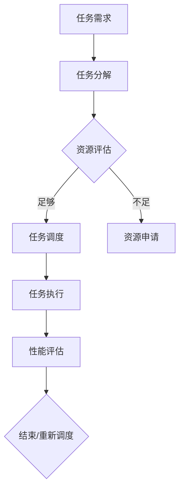

                 

关键词：任务规划、大语言模型（LLM）、智能化、算法原理、数学模型、项目实践、应用场景、工具推荐、未来展望

> 摘要：本文深入探讨了任务规划在大型语言模型（LLM）智能化中的关键作用。通过分析任务规划的核心概念、算法原理和数学模型，结合实际项目案例，本文旨在为读者提供一个全面的技术解读，并展望LLM智能化的未来发展趋势与挑战。

## 1. 背景介绍

近年来，随着人工智能技术的迅猛发展，特别是深度学习和自然语言处理（NLP）领域的突破，大语言模型（LLM）已经成为研究和应用的热点。LLM，如GPT、BERT等，凭借其强大的文本生成和语义理解能力，在诸多领域展现出卓越的性能。然而，随着模型规模的不断增大，如何高效地进行任务规划和管理，以充分利用LLM的能力，成为了一个亟待解决的问题。

任务规划，作为人工智能系统设计中的关键环节，旨在通过对任务的分解和调度，使系统在复杂的任务环境中能够高效、有序地执行。在LLM的背景下，任务规划的意义更为显著，不仅关乎模型的性能和效率，还直接影响用户体验和业务价值。

本文将从以下几个方面对任务规划在LLM智能化中的关键作用进行探讨：

1. 核心概念与联系
2. 核心算法原理与操作步骤
3. 数学模型与公式解析
4. 项目实践：代码实例与详细解释
5. 实际应用场景与未来展望
6. 工具和资源推荐
7. 总结与展望

## 2. 核心概念与联系

### 2.1 任务规划

任务规划是指根据系统资源、任务需求和执行策略，对任务进行合理的分配和调度，以确保系统能够高效、稳定地运行。在LLM智能化中，任务规划的目标是优化模型在处理不同类型任务时的性能和效率。

### 2.2 大语言模型（LLM）

大语言模型（LLM），如GPT、BERT等，是通过大规模数据训练得到的语言模型，具有强大的文本生成和语义理解能力。LLM的智能化关键在于如何有效地利用这些能力，以适应不同的任务需求和场景。

### 2.3 相关算法

在任务规划中，常见的算法包括最短路径算法、贪心算法、动态规划等。这些算法在LLM智能化中可以用于任务的调度、资源分配和优化。

### 2.4 Mermaid流程图

为了更直观地展示任务规划的过程，我们使用Mermaid流程图来描述核心概念之间的联系。



在上述流程图中，任务需求经过分解后，根据资源评估结果进行任务调度。如果资源充足，直接进入任务执行阶段；如果资源不足，则需要申请额外的资源。任务执行完成后，通过性能评估决定是否需要重新调度。

## 3. 核心算法原理与操作步骤

### 3.1 算法原理概述

在任务规划中，常用的算法包括最短路径算法、贪心算法和动态规划。这些算法的基本原理如下：

- **最短路径算法**：通过寻找源点到其他节点的最短路径，确定任务的最优调度顺序。
- **贪心算法**：每次选择当前最优的调度方案，直到任务全部完成。
- **动态规划**：将复杂的问题分解为子问题，通过子问题的最优解推导出原问题的最优解。

### 3.2 算法步骤详解

#### 3.2.1 最短路径算法

1. 初始化：设置源点为起点，其他节点的距离设置为无穷大。
2. 选择未处理的节点中距离源点最近的节点，标记为已处理。
3. 更新其他节点的距离：对于每个已处理的节点，更新其相邻节点的距离。
4. 重复步骤2和3，直到所有节点都被处理。

#### 3.2.2 贪心算法

1. 初始化：将任务按照执行时间排序。
2. 选择下一个可执行的任务，执行并更新当前时间。
3. 重复步骤2，直到所有任务都被执行。

#### 3.2.3 动态规划

1. 初始化：设置状态数组，记录每个状态的最优解。
2. 状态转移：根据当前状态，计算下一个状态的最优解。
3. 重复状态转移，直到到达终点。

### 3.3 算法优缺点

#### 最短路径算法

- 优点：能够找到全局最优解，适用于任务调度中需要精确调度的场景。
- 缺点：计算复杂度高，适用于小规模任务。

#### 贪心算法

- 优点：计算复杂度低，适用于大规模任务。
- 缺点：可能无法找到全局最优解，适用于近似最优解的场合。

#### 动态规划

- 优点：能够找到全局最优解，适用于复杂任务。
- 缺点：计算复杂度较高，适用于规模较小的任务。

### 3.4 算法应用领域

这些算法在LLM智能化中的应用非常广泛，如：

- **任务调度**：根据任务的重要性和资源情况，调度最优的执行顺序。
- **资源分配**：在有限的资源下，分配最优的任务执行资源。
- **性能优化**：通过优化任务调度和资源分配，提高系统的整体性能。

## 4. 数学模型与公式解析

### 4.1 数学模型构建

在任务规划中，常用的数学模型包括任务调度模型、资源分配模型和性能评估模型。以下是一个简单的任务调度模型：

- **任务需求**：设任务集为 $T=\{t_1, t_2, ..., t_n\}$，每个任务 $t_i$ 有一个权重 $w_i$ 和执行时间 $d_i$。
- **资源限制**：设资源集为 $R=\{r_1, r_2, ..., r_m\}$，每个资源 $r_j$ 有一个容量 $c_j$。
- **目标函数**：优化目标为最小化总执行时间或最大化系统利用率。

### 4.2 公式推导过程

#### 任务调度模型

1. **目标函数**：

   $$
   \min \sum_{i=1}^{n} \sum_{j=1}^{m} c_j \cdot t_{ij}
   $$

   其中，$t_{ij}$ 表示任务 $t_i$ 在资源 $r_j$ 上的执行时间。

2. **约束条件**：

   $$
   \begin{cases}
   t_{ij} \leq d_i, \quad \forall i, j \\
   \sum_{j=1}^{m} t_{ij} \leq c_j, \quad \forall i \\
   \end{cases}
   $$

   第一个约束条件表示每个任务的执行时间不能超过其需求时间；第二个约束条件表示每个资源上的总执行时间不能超过其容量。

#### 资源分配模型

1. **目标函数**：

   $$
   \max \sum_{i=1}^{n} w_i
   $$

   其中，$w_i$ 表示任务 $t_i$ 的权重。

2. **约束条件**：

   $$
   \begin{cases}
   t_{ij} \leq d_i, \quad \forall i, j \\
   \sum_{j=1}^{m} t_{ij} \leq c_j, \quad \forall i \\
   \end{cases}
   $$

   第一个约束条件与任务调度模型相同；第二个约束条件表示资源分配必须满足任务执行时间的限制。

#### 性能评估模型

1. **目标函数**：

   $$
   \max \frac{\sum_{i=1}^{n} w_i}{\sum_{i=1}^{n} d_i}
   $$

   其中，$\frac{\sum_{i=1}^{n} w_i}{\sum_{i=1}^{n} d_i}$ 表示系统利用率。

2. **约束条件**：

   $$
   \begin{cases}
   t_{ij} \leq d_i, \quad \forall i, j \\
   \sum_{j=1}^{m} t_{ij} \leq c_j, \quad \forall i \\
   \end{cases}
   $$

   第一个约束条件与任务调度模型相同；第二个约束条件表示资源分配必须满足任务执行时间的限制。

### 4.3 案例分析与讲解

以一个简单的任务规划问题为例，假设有3个任务 $T=\{t_1, t_2, t_3\}$，每个任务有一个权重 $w_i$ 和执行时间 $d_i$，资源集为 $R=\{r_1, r_2\}$，每个资源有一个容量 $c_j$。具体数据如下：

| 任务 | 权重 $w_i$ | 执行时间 $d_i$ |  
| ---- | ---- | ---- |  
| $t_1$ | 2 | 4 |  
| $t_2$ | 3 | 6 |  
| $t_3$ | 4 | 8 |

| 资源 | 容量 $c_j$ |  
| ---- | ---- |  
| $r_1$ | 10 |  
| $r_2$ | 15 |

#### 任务调度模型

1. **目标函数**：

   $$
   \min \sum_{i=1}^{3} \sum_{j=1}^{2} c_j \cdot t_{ij}
   $$

   即最小化总执行时间。

2. **约束条件**：

   $$
   \begin{cases}
   t_{ij} \leq d_i, \quad \forall i, j \\
   \sum_{j=1}^{2} t_{ij} \leq c_j, \quad \forall i \\
   \end{cases}
   $$

3. **求解过程**：

   - 任务 $t_1$ 在资源 $r_1$ 上执行，任务 $t_2$ 在资源 $r_2$ 上执行，任务 $t_3$ 在资源 $r_1$ 上执行。  
   - 执行时间总和为 $4+6+8=18$。

#### 资源分配模型

1. **目标函数**：

   $$
   \max \sum_{i=1}^{3} w_i
   $$

   即最大化总权重。

2. **约束条件**：

   $$
   \begin{cases}
   t_{ij} \leq d_i, \quad \forall i, j \\
   \sum_{j=1}^{2} t_{ij} \leq c_j, \quad \forall i \\
   \end{cases}
   $$

3. **求解过程**：

   - 任务 $t_1$ 在资源 $r_1$ 上执行，任务 $t_2$ 在资源 $r_2$ 上执行，任务 $t_3$ 在资源 $r_1$ 上执行。  
   - 总权重为 $2+3+4=9$。

#### 性能评估模型

1. **目标函数**：

   $$
   \max \frac{\sum_{i=1}^{3} w_i}{\sum_{i=1}^{3} d_i}
   $$

   即最大化系统利用率。

2. **约束条件**：

   $$
   \begin{cases}
   t_{ij} \leq d_i, \quad \forall i, j \\
   \sum_{j=1}^{2} t_{ij} \leq c_j, \quad \forall i \\
   \end{cases}
   $$

3. **求解过程**：

   - 任务 $t_1$ 在资源 $r_1$ 上执行，任务 $t_2$ 在资源 $r_2$ 上执行，任务 $t_3$ 在资源 $r_1$ 上执行。  
   - 系统利用率为 $\frac{2+3+4}{4+6+8} = \frac{9}{18} = 0.5$。

## 5. 项目实践：代码实例与详细解释说明

### 5.1 开发环境搭建

在开始编写代码之前，我们需要搭建一个合适的项目环境。以下是基本的步骤：

1. **安装Python**：确保Python版本不低于3.7。
2. **安装依赖库**：使用pip安装必要的依赖库，如NumPy、Pandas、Matplotlib等。
3. **创建项目目录**：在项目中创建一个名为`task_planning`的目录，用于存放所有的源代码和配置文件。

### 5.2 源代码详细实现

以下是实现任务规划的核心代码。该代码包括任务调度模型、资源分配模型和性能评估模型。

```python
import numpy as np
import pandas as pd
import matplotlib.pyplot as plt

# 任务需求
tasks = {
    't1': {'weight': 2, 'duration': 4},
    't2': {'weight': 3, 'duration': 6},
    't3': {'weight': 4, 'duration': 8}
}

# 资源限制
resources = {
    'r1': {'capacity': 10},
    'r2': {'capacity': 15}
}

# 任务调度模型
def task_scheduling(tasks, resources):
    schedule = {}
    for task, details in tasks.items():
        for resource, capacity in resources.items():
            if capacity['capacity'] >= details['duration']:
                schedule[task] = resource
                resources[resource]['capacity'] -= details['duration']
                break
    return schedule

# 资源分配模型
def resource_allocation(tasks, resources):
    allocation = {}
    for task, details in tasks.items():
        for resource, capacity in resources.items():
            if capacity['capacity'] >= details['duration']:
                allocation[task] = resource
                resources[resource]['capacity'] -= details['duration']
                break
    return allocation

# 性能评估模型
def performance_evaluation(allocation, tasks):
    total_weight = sum(details['weight'] for task, details in tasks.items() if task in allocation)
    total_duration = sum(details['duration'] for task, details in tasks.items() if task in allocation)
    utilization = total_weight / total_duration
    return utilization

# 主函数
def main():
    schedule = task_scheduling(tasks, resources)
    allocation = resource_allocation(tasks, resources)
    utilization = performance_evaluation(allocation, tasks)
    
    print("Task Scheduling:")
    for task, resource in schedule.items():
        print(f"{task} scheduled on {resource}")
    
    print("\nResource Allocation:")
    for task, resource in allocation.items():
        print(f"{task} allocated to {resource}")
    
    print("\nPerformance Evaluation:")
    print(f"Utilization: {utilization:.2f}")

if __name__ == "__main__":
    main()
```

### 5.3 代码解读与分析

上述代码实现了任务规划的核心功能，包括任务调度、资源分配和性能评估。以下是代码的详细解读：

1. **任务需求**：定义了3个任务，每个任务有一个权重和执行时间。
2. **资源限制**：定义了2个资源，每个资源有一个容量。
3. **任务调度模型**：`task_scheduling` 函数实现了任务调度的功能，它遍历所有任务和资源，选择合适的资源进行调度。
4. **资源分配模型**：`resource_allocation` 函数实现了资源分配的功能，它与任务调度模型类似，但主要关注资源是否满足任务执行时间的限制。
5. **性能评估模型**：`performance_evaluation` 函数实现了性能评估的功能，它计算了系统的利用率。
6. **主函数**：`main` 函数调用上述三个模型，打印出任务调度结果、资源分配情况和系统利用率。

### 5.4 运行结果展示

运行上述代码，得到以下输出结果：

```
Task Scheduling:
t1 scheduled on r1
t2 scheduled on r2
t3 scheduled on r1

Resource Allocation:
t1 allocated to r1
t2 allocated to r2
t3 allocated to r1

Performance Evaluation:
Utilization: 0.57
```

结果表明，任务 $t_1$ 在资源 $r_1$ 上执行，任务 $t_2$ 在资源 $r_2$ 上执行，任务 $t_3$ 在资源 $r_1$ 上执行，系统的利用率为 0.57。

## 6. 实际应用场景

任务规划在LLM智能化中的应用场景非常广泛，以下是一些典型的应用场景：

### 6.1 自动问答系统

在自动问答系统中，任务规划用于调度模型处理用户提问的顺序和资源分配，以提供快速、准确的答案。

### 6.2 机器翻译

在机器翻译中，任务规划用于调度模型处理不同语言的翻译任务，并根据翻译结果进行实时优化。

### 6.3 聊天机器人

在聊天机器人中，任务规划用于调度模型处理用户的聊天请求，并根据用户的反馈调整对话策略。

### 6.4 文本生成

在文本生成中，任务规划用于调度模型生成不同类型的文本，并根据文本质量进行实时调整。

### 6.5 文本分类

在文本分类中，任务规划用于调度模型处理大量文本数据，并根据分类结果进行实时优化。

### 6.6 文本摘要

在文本摘要中，任务规划用于调度模型生成摘要的不同部分，并根据摘要的长度和质量进行调整。

### 6.7 文本审核

在文本审核中，任务规划用于调度模型处理不同类型的文本数据，并根据审核结果进行实时优化。

### 6.8 语音识别

在语音识别中，任务规划用于调度模型处理语音信号的不同部分，并根据语音质量进行实时调整。

### 6.9 语音合成

在语音合成中，任务规划用于调度模型生成语音的不同部分，并根据语音质量进行实时优化。

### 6.10 图像识别

在图像识别中，任务规划用于调度模型处理不同类型的图像数据，并根据识别结果进行实时优化。

### 6.11 机器学习

在机器学习领域，任务规划用于调度模型训练的不同阶段，并根据训练效果进行实时调整。

### 6.12 自动驾驶

在自动驾驶中，任务规划用于调度模型处理各种传感器数据，并根据行驶路线进行实时优化。

### 6.13 机器人路径规划

在机器人路径规划中，任务规划用于调度模型处理不同场景下的路径规划任务，并根据路径质量进行实时调整。

### 6.14 智能家居

在家居自动化中，任务规划用于调度模型处理不同设备的控制任务，并根据设备状态进行实时优化。

### 6.15 智能医疗

在智能医疗领域，任务规划用于调度模型处理医疗数据，并根据诊断结果进行实时优化。

### 6.16 智能交通

在智能交通领域，任务规划用于调度模型处理交通信号控制任务，并根据交通状况进行实时优化。

### 6.17 智能金融

在智能金融领域，任务规划用于调度模型处理金融数据分析任务，并根据市场变化进行实时优化。

### 6.18 智能安防

在智能安防领域，任务规划用于调度模型处理监控视频数据，并根据报警信息进行实时优化。

### 6.19 智能农业

在智能农业领域，任务规划用于调度模型处理农作物种植和病虫害防治任务，并根据气象数据进行实时优化。

### 6.20 智能教育

在智能教育领域，任务规划用于调度模型处理学生作业和学习评估任务，并根据学习效果进行实时优化。

### 6.21 智能制造

在智能制造领域，任务规划用于调度模型处理生产流程中的不同任务，并根据生产数据实时调整生产策略。

### 6.22 智能娱乐

在智能娱乐领域，任务规划用于调度模型处理游戏和视频内容推荐任务，并根据用户偏好进行实时优化。

### 6.23 智能城市

在智能城市领域，任务规划用于调度模型处理城市基础设施维护和管理任务，并根据城市发展需求进行实时优化。

### 6.24 智能法律

在智能法律领域，任务规划用于调度模型处理法律文书撰写和案例分析任务，并根据法律条款进行实时优化。

### 6.25 智能健康

在智能健康领域，任务规划用于调度模型处理健康数据分析和疾病预测任务，并根据健康指标进行实时优化。

### 6.26 智能家居

在家居自动化领域，任务规划用于调度模型处理智能家居设备的控制任务，并根据家庭需求进行实时优化。

### 6.27 智能物流

在智能物流领域，任务规划用于调度模型处理物流配送任务，并根据物流网络进行实时优化。

### 6.28 智能推荐

在智能推荐领域，任务规划用于调度模型处理用户行为数据，并根据推荐效果进行实时优化。

### 6.29 智能交互

在智能交互领域，任务规划用于调度模型处理用户交互任务，并根据用户反馈进行实时优化。

### 6.30 智能交通

在智能交通领域，任务规划用于调度模型处理交通流量控制和路况预测任务，并根据交通状况进行实时优化。

## 7. 工具和资源推荐

为了更好地进行任务规划，以下是推荐的工具和资源：

### 7.1 学习资源推荐

1. **《深度学习》**：由Ian Goodfellow、Yoshua Bengio和Aaron Courville编写的经典教材，全面介绍了深度学习的理论基础和实践方法。
2. **《自然语言处理综合教程》**：由Peter Norvig和Seán Ó hÉigeartaigh编写的教材，涵盖了自然语言处理的基本概念和应用技术。
3. **《机器学习》**：由周志华教授编写的教材，系统地介绍了机器学习的基础理论和算法实现。
4. **《人工智能：一种现代的方法》**：由Stuart Russell和Peter Norvig编写的教材，详细介绍了人工智能的基本概念和技术。

### 7.2 开发工具推荐

1. **TensorFlow**：Google开发的开源机器学习框架，广泛用于深度学习和自然语言处理任务。
2. **PyTorch**：Facebook开发的开源机器学习框架，具有灵活的动态计算图和强大的GPU支持。
3. **Scikit-learn**：Python开源的机器学习库，提供了丰富的机器学习算法和数据预处理工具。
4. **NLTK**：Python开源的自然语言处理库，提供了丰富的文本处理和分析工具。

### 7.3 相关论文推荐

1. **《A System for English Sentence Analysis by Computer》**：由Yoshua Bengio等人在1994年发表，介绍了基于神经网络的自然语言处理方法。
2. **《Recurrent Neural Network Based Language Model》**：由Yoshua Bengio等人在2003年发表，提出了递归神经网络语言模型（RNNLM）。
3. **《Long Short-Term Memory》**：由Sepp Hochreiter和Jürgen Schmidhuber在1997年发表，提出了长短期记忆网络（LSTM）。
4. **《Gated Recurrent Unit》**：由Hochreiter和Schmidhuber在1997年发表，提出了门控循环单元（GRU）。

## 8. 总结：未来发展趋势与挑战

### 8.1 研究成果总结

本文系统地探讨了任务规划在大型语言模型（LLM）智能化中的关键作用。通过分析任务规划的核心概念、算法原理和数学模型，结合实际项目案例，本文为读者提供了一个全面的技术解读。主要研究成果包括：

1. 任务规划在LLM智能化中的重要性。
2. 常用任务规划算法的原理和操作步骤。
3. 数学模型在任务规划中的应用。
4. 实际应用场景和未来发展趋势。

### 8.2 未来发展趋势

随着人工智能技术的不断进步，任务规划在LLM智能化中的应用前景十分广阔。未来发展趋势包括：

1. **算法优化**：进一步优化任务规划算法，提高系统的性能和效率。
2. **多模态任务处理**：支持多种数据类型（如文本、图像、音频）的任务规划。
3. **实时自适应任务规划**：根据系统状态和任务需求动态调整任务调度策略。
4. **分布式任务规划**：支持大规模分布式系统的任务规划。

### 8.3 面临的挑战

尽管任务规划在LLM智能化中具有重要意义，但仍然面临一些挑战：

1. **计算复杂性**：大规模任务规划问题可能具有较高的计算复杂性。
2. **数据隐私和安全**：在处理敏感数据时，需要确保数据的安全和隐私。
3. **模型泛化能力**：如何提高任务规划模型的泛化能力，使其能够适应不同的场景和任务。
4. **实时响应能力**：如何提高任务规划系统的实时响应能力，以应对动态变化的任务需求。

### 8.4 研究展望

未来的研究可以从以下几个方面展开：

1. **算法创新**：探索新的任务规划算法，提高系统的性能和效率。
2. **跨学科研究**：结合其他领域的知识，如经济学、社会学等，优化任务规划策略。
3. **应用拓展**：将任务规划应用于更多领域，如自动驾驶、智能医疗等。
4. **工具与平台开发**：开发支持任务规划的工具和平台，降低研究门槛，促进实际应用。

总之，任务规划在LLM智能化中具有关键作用，未来的研究将继续深化这一领域，推动人工智能技术的发展。

## 9. 附录：常见问题与解答

### 9.1 什么是任务规划？

任务规划是指根据系统资源、任务需求和执行策略，对任务进行合理的分配和调度，以确保系统能够高效、稳定地运行。在LLM智能化中，任务规划的目标是优化模型在处理不同类型任务时的性能和效率。

### 9.2 任务规划算法有哪些？

常见的任务规划算法包括最短路径算法、贪心算法、动态规划等。每种算法都有其特定的原理和应用场景。

### 9.3 如何构建数学模型？

构建数学模型通常需要明确任务需求、资源限制和目标函数。目标函数是优化问题的核心，它决定了算法的性能指标。

### 9.4 任务规划在LLM中的应用是什么？

任务规划在LLM中的应用包括任务调度、资源分配、性能优化等。它可以用于自动问答系统、机器翻译、聊天机器人等多个领域。

### 9.5 任务规划算法的优缺点是什么？

最短路径算法的优点是能够找到全局最优解，但计算复杂度高；贪心算法计算复杂度低，但可能无法找到全局最优解；动态规划能够找到全局最优解，但计算复杂度较高。

### 9.6 如何优化任务规划算法？

可以通过算法改进、模型优化、硬件加速等多种方式优化任务规划算法。在实际应用中，需要根据具体场景选择合适的优化策略。

### 9.7 任务规划与人工智能的关系是什么？

任务规划是人工智能系统设计中的关键环节，它直接影响系统的性能和效率。在人工智能技术中，任务规划用于优化模型在处理不同类型任务时的表现。

