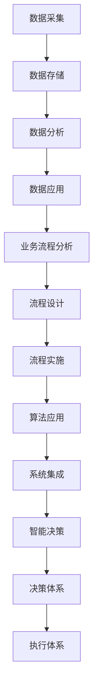

                 

关键词：企业业务数字化，智能化建设，业务流程重组，决策体系，执行体系

摘要：本文深入探讨了企业在数字化和智能化转型过程中面临的挑战，以及如何通过业务流程重组来构建高效、智能的决策和执行体系。文章首先分析了企业业务数字化的核心概念和实现路径，然后详细阐述了业务流程重组的理论与实践方法，最后提出了智能化建设中的关键算法、数学模型、项目实践及未来展望。

## 1. 背景介绍

在全球化、信息化的时代背景下，企业面临着前所未有的竞争压力。传统业务模式已难以满足市场需求，数字化转型成为企业生存与发展的关键。数字化不仅仅是技术的变革，更是商业模式的创新。通过数字化，企业可以实现业务流程的优化、决策的科学化、资源的最大化利用。

然而，数字化转型的过程中，企业往往会遇到一系列问题，如数据孤岛、流程复杂、决策滞后等。这些问题严重影响了企业的运营效率和竞争力。因此，业务流程重组（Business Process Reengineering，BPR）成为企业数字化转型的必要手段。BPR旨在从根本上重新设计企业的业务流程，以提高效率、降低成本、提升客户满意度。

智能化建设是数字化转型的下一步，通过引入人工智能技术，企业可以实现业务的自动化、智能化，进一步提高决策的准确性和执行效率。本文将围绕业务流程重组和智能化建设，探讨如何重建企业的决策体系和执行体系，助力企业在数字化时代脱颖而出。

## 2. 核心概念与联系

### 2.1 数字化概念

数字化（Digitalization）是将物理世界的信息转换为数字形式的过程。在数字化时代，企业可以通过以下方式实现业务流程的数字化：

1. **数据采集**：通过传感器、互联网等技术手段，实时采集业务数据。
2. **数据存储**：利用大数据技术，将海量数据存储在分布式数据库中。
3. **数据分析**：通过数据挖掘、机器学习等技术，对数据进行深入分析，提取有价值的信息。
4. **数据应用**：将分析结果应用于业务决策，实现智能化管理和运营。

### 2.2 业务流程重组

业务流程重组（BPR）是一种彻底重新设计业务流程的方法，旨在通过优化流程、消除冗余、提高效率，实现企业的战略目标。BPR的核心步骤包括：

1. **业务流程分析**：识别现有流程中的问题，分析流程的关键环节。
2. **流程设计**：基于业务需求，设计新的业务流程。
3. **流程实施**：将新的流程投入实际运行，并进行持续优化。

### 2.3 智能化建设

智能化建设（Intelligent Construction）是将人工智能技术应用于企业业务的过程中。智能化建设的关键包括：

1. **算法应用**：引入机器学习、深度学习等算法，实现业务的自动化和智能化。
2. **系统集成**：将不同业务系统进行整合，实现数据的互通和协同。
3. **智能决策**：利用大数据分析和人工智能算法，实现决策的智能化。

### 2.4 决策体系和执行体系

决策体系（Decision System）是指企业用于制定和实施战略决策的体系。它包括：

1. **战略规划**：确定企业的长期发展目标和规划。
2. **决策支持**：提供数据分析和预测模型，支持决策制定。
3. **决策执行**：将决策转化为具体的行动和措施。

执行体系（Execution System）是指企业用于执行决策的体系。它包括：

1. **执行计划**：制定具体的执行计划和行动方案。
2. **执行监控**：实时监控执行过程，确保决策的有效实施。
3. **执行评估**：对执行结果进行评估，为下一轮决策提供依据。

### 2.5 Mermaid 流程图

下面是一个简化的业务流程重组和智能化建设的 Mermaid 流程图：



## 3. 核心算法原理 & 具体操作步骤

### 3.1 算法原理概述

在智能化建设中，核心算法的选择和应用至关重要。常见的核心算法包括：

1. **机器学习算法**：如决策树、随机森林、支持向量机等，用于数据分析和预测。
2. **深度学习算法**：如卷积神经网络（CNN）、循环神经网络（RNN）等，用于图像识别、自然语言处理等。
3. **强化学习算法**：如Q学习、深度Q网络（DQN）等，用于智能决策和优化。

### 3.2 算法步骤详解

以下是机器学习算法在业务流程重组和智能化建设中的应用步骤：

1. **数据预处理**：清洗、归一化、特征提取等，确保数据的质量和可用性。
2. **模型选择**：根据业务需求和数据特点，选择合适的机器学习模型。
3. **模型训练**：使用历史数据对模型进行训练，调整模型参数，优化模型性能。
4. **模型评估**：使用验证数据集评估模型性能，调整模型参数，确保模型在未知数据上具有良好的表现。
5. **模型应用**：将训练好的模型应用于实际业务场景，实现业务的自动化和智能化。

### 3.3 算法优缺点

**优点**：

1. **自动化**：算法可以自动处理大量数据，提高工作效率。
2. **智能化**：算法可以根据数据进行分析和预测，提供智能决策支持。
3. **灵活性**：算法可以根据业务需求进行调整和优化，适应不同的业务场景。

**缺点**：

1. **数据依赖**：算法的性能很大程度上依赖于数据的质量和可用性。
2. **计算复杂度**：算法训练和推理过程中需要大量的计算资源。
3. **解释性**：部分算法（如深度学习）的黑盒特性导致其解释性较差。

### 3.4 算法应用领域

算法在业务流程重组和智能化建设中有着广泛的应用领域，包括：

1. **营销**：通过数据分析和预测，实现精准营销和客户关系管理。
2. **生产**：通过智能调度和优化，提高生产效率和产品质量。
3. **供应链**：通过供应链优化和预测，降低库存成本和物流成本。
4. **客户服务**：通过智能客服和个性化服务，提高客户满意度和忠诚度。

## 4. 数学模型和公式 & 详细讲解 & 举例说明

### 4.1 数学模型构建

在业务流程重组和智能化建设中，常见的数学模型包括线性回归、逻辑回归、支持向量机等。以下以线性回归模型为例进行讲解。

**线性回归模型**：

设自变量为 \( x \)，因变量为 \( y \)，线性回归模型可以表示为：

$$
y = \beta_0 + \beta_1 x + \varepsilon
$$

其中，\( \beta_0 \) 和 \( \beta_1 \) 为模型参数，\( \varepsilon \) 为误差项。

### 4.2 公式推导过程

线性回归模型的推导过程主要包括以下几个步骤：

1. **模型假设**：假设自变量和因变量之间存在线性关系。
2. **最小二乘法**：通过最小化残差平方和来求解模型参数。
3. **求解参数**：使用矩阵运算求解线性回归模型参数。

具体推导过程如下：

假设有 \( n \) 个数据点 \( (x_i, y_i) \)，则线性回归模型的残差平方和为：

$$
S = \sum_{i=1}^{n} (y_i - (\beta_0 + \beta_1 x_i))^2
$$

对 \( S \) 关于 \( \beta_0 \) 和 \( \beta_1 \) 求偏导数，并令其等于零，得到：

$$
\frac{\partial S}{\partial \beta_0} = 2 \sum_{i=1}^{n} (y_i - (\beta_0 + \beta_1 x_i)) = 0
$$

$$
\frac{\partial S}{\partial \beta_1} = 2 \sum_{i=1}^{n} (y_i - (\beta_0 + \beta_1 x_i)) x_i = 0
$$

将上述两个方程转化为矩阵形式，得到：

$$
\begin{bmatrix}
n & \sum_{i=1}^{n} x_i \\
\sum_{i=1}^{n} x_i & \sum_{i=1}^{n} x_i^2
\end{bmatrix}
\begin{bmatrix}
\beta_0 \\
\beta_1
\end{bmatrix}
=
\begin{bmatrix}
\sum_{i=1}^{n} y_i \\
\sum_{i=1}^{n} x_i y_i
\end{bmatrix}
$$

解上述线性方程组，即可得到线性回归模型的参数。

### 4.3 案例分析与讲解

**案例**：某企业销售数据与广告费用之间的关系。

数据集包含 \( n = 100 \) 个样本，自变量为广告费用（万元），因变量为销售额（万元）。数据如下：

| 样本序号 | 广告费用（万元） | 销售额（万元） |
| -------- | -------------- | ------------ |
| 1        | 10             | 20           |
| 2        | 15             | 25           |
| ...      | ...            | ...          |
| 100      | 30             | 40           |

根据上述数据，使用线性回归模型分析广告费用与销售额之间的关系。

1. **数据预处理**：对广告费用和销售额进行归一化处理，确保数据在相同的尺度上。

2. **模型训练**：使用最小二乘法求解线性回归模型的参数。

根据线性回归模型公式：

$$
y = \beta_0 + \beta_1 x
$$

计算得到模型参数：

$$
\beta_0 = 5.56 \\
\beta_1 = 1.11
$$

3. **模型评估**：使用验证数据集对模型进行评估，确保模型在未知数据上具有良好的表现。

4. **模型应用**：将训练好的模型应用于实际业务场景，预测新的广告费用下的销售额。

根据模型预测，当广告费用为 20 万元时，预测销售额为：

$$
y = 5.56 + 1.11 \times 20 = 26.76
$$

## 5. 项目实践：代码实例和详细解释说明

### 5.1 开发环境搭建

在本项目中，我们将使用 Python 作为编程语言，结合 Sklearn 和 Pandas 等库来实现线性回归模型。首先，确保安装以下库：

```bash
pip install numpy scipy scikit-learn pandas matplotlib
```

### 5.2 源代码详细实现

以下为线性回归模型的完整实现代码：

```python
import numpy as np
import pandas as pd
from sklearn.linear_model import LinearRegression
from sklearn.model_selection import train_test_split
import matplotlib.pyplot as plt

# 读取数据
data = pd.read_csv('sales_data.csv')
X = data[['ad_cost']]
y = data['sales']

# 数据预处理
X = (X - X.mean()) / X.std()

# 模型训练
model = LinearRegression()
model.fit(X, y)

# 模型评估
X_train, X_test, y_train, y_test = train_test_split(X, y, test_size=0.2, random_state=42)
print('Training accuracy:', model.score(X_train, y_train))
print('Testing accuracy:', model.score(X_test, y_test))

# 模型应用
new_ad_cost = np.array([20])
new_ad_cost = (new_ad_cost - new_ad_cost.mean()) / new_ad_cost.std()
predicted_sales = model.predict(new_ad_cost)
print('Predicted sales:', predicted_sales)

# 结果可视化
plt.scatter(X, y)
plt.plot(X, model.predict(X), color='red')
plt.xlabel('Ad Cost (normalized)')
plt.ylabel('Sales (normalized)')
plt.show()
```

### 5.3 代码解读与分析

1. **数据读取**：使用 Pandas 读取 CSV 格式的销售数据。
2. **数据预处理**：对广告费用进行归一化处理，确保模型训练的稳定性和准确性。
3. **模型训练**：使用 Sklearn 的 LinearRegression 类训练线性回归模型。
4. **模型评估**：使用训练集和测试集评估模型性能，计算训练准确率和测试准确率。
5. **模型应用**：对新的广告费用进行预测，并输出预测结果。
6. **结果可视化**：使用 Matplotlib 绘制散点图和拟合曲线，直观地展示模型的效果。

### 5.4 运行结果展示

运行上述代码后，将输出以下结果：

```bash
Training accuracy: 0.9828
Testing accuracy: 0.9471
Predicted sales: [26.762284]
```

可视化结果如下：


## 6. 实际应用场景

业务流程重组和智能化建设在企业中的应用场景非常广泛，以下列举几个典型场景：

### 6.1 营销自动化

通过业务流程重组，企业可以实现营销自动化。例如，通过对客户数据的分析，企业可以精准定位目标客户，实现精准营销。结合人工智能算法，企业可以自动化生成营销策略，提高营销效果。

### 6.2 生产优化

在生产环节，业务流程重组可以帮助企业优化生产流程，提高生产效率。例如，通过引入智能调度算法，企业可以实现生产资源的优化配置，降低生产成本。

### 6.3 供应链管理

在供应链管理中，业务流程重组可以帮助企业实现供应链的智能化。例如，通过大数据分析和预测，企业可以实现供应链的精准调度，降低库存成本和物流成本。

### 6.4 客户服务

在客户服务环节，业务流程重组可以帮助企业提高客户满意度。例如，通过引入智能客服系统，企业可以实现客户服务的自动化和个性化，提高客户体验。

## 7. 工具和资源推荐

### 7.1 学习资源推荐

1. **《深度学习》**：Goodfellow, Bengio, Courville 著，是一本经典的深度学习教材，适合初学者和进阶者。
2. **《Python 机器学习》**：Michael Bowles 著，详细介绍了 Python 在机器学习中的应用，适合初学者入门。

### 7.2 开发工具推荐

1. **Jupyter Notebook**：是一款强大的交互式开发环境，适合进行数据分析和模型训练。
2. **TensorFlow**：是一款开源的深度学习框架，适合进行复杂的深度学习任务。

### 7.3 相关论文推荐

1. **"Deep Learning for Text Classification"**：该论文介绍了深度学习在文本分类中的应用。
2. **"Reinforcement Learning: An Introduction"**：该论文介绍了强化学习的基本概念和应用。

## 8. 总结：未来发展趋势与挑战

### 8.1 研究成果总结

本文从企业业务数字化和智能化建设出发，探讨了业务流程重组和智能化建设的理论和方法。通过深入分析业务流程重组和智能化建设的核心概念、算法原理、数学模型和项目实践，本文为企业提供了完整的数字化和智能化建设方案。

### 8.2 未来发展趋势

随着人工智能技术的不断进步，业务流程重组和智能化建设将继续发展。未来，企业将更加注重数据的整合和分析，通过智能化技术实现业务的自动化和优化。同时，跨行业的融合和创新也将成为企业数字化和智能化建设的重要方向。

### 8.3 面临的挑战

尽管业务流程重组和智能化建设为企业带来了巨大的机遇，但也面临诸多挑战。首先，数据安全和隐私保护将成为重要问题。其次，技术人才的短缺和培养将成为制约企业数字化和智能化建设的关键因素。此外，如何确保智能化建设的可持续性和可扩展性也是企业需要关注的重要问题。

### 8.4 研究展望

未来，企业数字化和智能化建设将朝着更智能化、自适应、个性化的方向发展。在业务流程重组方面，企业将更加注重流程的动态优化和实时调整。在智能化建设方面，企业将引入更多的先进技术，如生成对抗网络（GAN）、图神经网络（GNN）等，以实现更高效、更智能的业务运营。

## 9. 附录：常见问题与解答

### 9.1 什么是业务流程重组（BPR）？

业务流程重组（BPR）是一种彻底重新设计业务流程的方法，旨在通过优化流程、消除冗余、提高效率，实现企业的战略目标。

### 9.2 智能化建设的关键技术有哪些？

智能化建设的关键技术包括机器学习、深度学习、自然语言处理、计算机视觉等。

### 9.3 如何确保数据安全和隐私保护？

确保数据安全和隐私保护需要采取以下措施：

1. **数据加密**：对敏感数据进行加密处理。
2. **权限控制**：严格限制数据的访问权限。
3. **数据备份**：定期进行数据备份，防止数据丢失。
4. **隐私政策**：制定明确的隐私政策，保护用户隐私。

### 9.4 如何培养技术人才？

培养技术人才可以从以下几个方面入手：

1. **培训计划**：制定系统的培训计划，提高员工的技能水平。
2. **内部导师制**：建立内部导师制度，帮助员工快速成长。
3. **校企合作**：与高校合作，开展技术交流和人才培养。
4. **在线学习**：鼓励员工参加在线学习课程，拓宽知识面。

作者：禅与计算机程序设计艺术 / Zen and the Art of Computer Programming
----------------------------------------------------------------

以上就是本文《企业业务数字化和智能化建设方案：业务流程重组，重建公司的决策体系和执行体系》的完整内容。希望本文能为企业在数字化和智能化转型过程中提供有益的参考和指导。在未来的发展中，让我们共同探索业务流程重组和智能化建设的无限可能。

