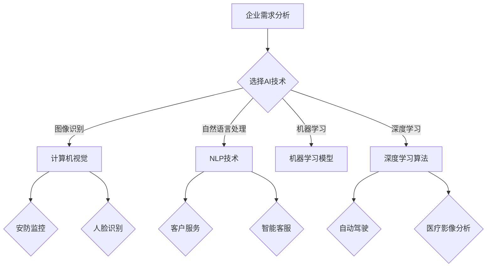

                 

关键词：数字化转型、人工智能、应用技术、企业、智能化、大数据分析、深度学习、机器学习、自然语言处理、计算机视觉

摘要：本文将探讨企业数字化转型过程中，人工智能技术的应用及其带来的深远影响。通过分析核心概念、算法原理、数学模型、项目实践等，揭示人工智能在各个行业领域的广泛应用，展望其未来发展趋势与面临的挑战。

## 1. 背景介绍

在信息时代的浪潮下，企业数字化转型已成为全球商业发展的主流趋势。数字化转型不仅关乎企业内部的运营效率，更关系到其在市场中的竞争力和创新能力。而人工智能（AI）作为推动数字化转型的重要技术之一，正以其独特的优势，为企业注入新的活力。

人工智能的发展历程可以追溯到20世纪50年代。随着计算能力和算法的不断进步，人工智能已经从理论研究逐步走向实际应用。在近年来，深度学习、机器学习、自然语言处理、计算机视觉等人工智能技术取得了显著的突破，为各行各业带来了革命性的变化。

企业数字化转型中的AI应用，不仅体现在提高生产效率、降低成本，还体现在创新商业模式、增强客户体验、提高决策能力等方面。本文将围绕这些方面，深入探讨人工智能在企业中的应用技术及其影响。

## 2. 核心概念与联系

在探讨AI在企业中的应用之前，我们首先需要了解一些核心概念，如图灵测试、神经网络、机器学习、深度学习、自然语言处理和计算机视觉。

### 2.1 图灵测试

图灵测试是由英国数学家艾伦·图灵提出的一个测试人工智能是否具有智能的标准。简单来说，如果一个机器能够在与人类的对话中无法被区分，那么它就可以被认为是具有智能的。图灵测试的核心在于模拟人类思维过程，是人工智能发展的一个重要里程碑。

### 2.2 神经网络

神经网络是一种模仿生物神经系统工作方式的计算模型。它由大量的神经元（节点）组成，通过调整神经元之间的连接权重（边）来实现对数据的处理和预测。神经网络是深度学习的基础，广泛应用于图像识别、语音识别等领域。

### 2.3 机器学习

机器学习是一种让计算机通过数据学习规律、预测未来趋势的方法。它分为监督学习、无监督学习和强化学习三种类型。机器学习是人工智能的重要分支，广泛应用于分类、回归、聚类等任务。

### 2.4 深度学习

深度学习是一种基于多层神经网络的机器学习方法。通过增加网络的深度，深度学习能够提取更复杂的特征，从而在图像识别、语音识别等领域取得了显著突破。

### 2.5 自然语言处理

自然语言处理（NLP）是研究如何使计算机理解和生成人类自然语言的技术。它包括文本分类、情感分析、机器翻译、语音识别等任务，是人工智能领域的重要研究方向。

### 2.6 计算机视觉

计算机视觉是使计算机具备人类视觉功能的技术。它通过图像处理、特征提取、目标检测等方法，实现对图像的理解和识别，广泛应用于自动驾驶、医疗影像分析等领域。

### 2.7 Mermaid 流程图

以下是企业数字化转型中，AI应用技术的 Mermaid 流程图：



## 3. 核心算法原理 & 具体操作步骤

### 3.1 算法原理概述

在本节中，我们将介绍几种在企业数字化转型中常用的核心算法原理，包括机器学习、深度学习和自然语言处理。

#### 3.1.1 机器学习

机器学习是一种基于数据的学习方法，通过训练模型来预测或分类未知数据。其主要原理包括：

- **监督学习**：在有标签的数据集上训练模型，然后使用模型对新的数据进行预测。
- **无监督学习**：在没有标签的数据集上训练模型，用于数据聚类或降维。
- **强化学习**：通过与环境互动，学习最佳行动策略。

#### 3.1.2 深度学习

深度学习是一种基于多层神经网络的机器学习方法，通过逐层提取数据中的特征，实现复杂的模式识别和预测。其主要原理包括：

- **卷积神经网络（CNN）**：适用于图像处理任务，通过卷积层、池化层和全连接层提取图像特征。
- **循环神经网络（RNN）**：适用于序列数据处理任务，通过循环结构保持长期依赖信息。
- **长短时记忆网络（LSTM）**：是RNN的一种变种，能够解决长序列依赖问题。

#### 3.1.3 自然语言处理

自然语言处理是一种使计算机理解和生成人类自然语言的技术。其主要原理包括：

- **词向量表示**：将单词转化为向量表示，用于文本分类、情感分析等任务。
- **序列标注**：对文本进行分词、词性标注、命名实体识别等操作。
- **机器翻译**：通过学习双语语料库，实现源语言到目标语言的自动翻译。

### 3.2 算法步骤详解

#### 3.2.1 机器学习

1. 数据收集与预处理：收集有标签的数据集，对数据集进行清洗、去重、归一化等预处理操作。
2. 特征提取：从原始数据中提取有用的特征，用于训练模型。
3. 模型选择：根据任务需求选择合适的模型，如线性回归、决策树、支持向量机等。
4. 模型训练：使用训练集对模型进行训练，调整模型参数。
5. 模型评估：使用验证集对模型进行评估，调整模型参数。
6. 模型部署：将训练好的模型部署到生产环境中，对新的数据进行预测。

#### 3.2.2 深度学习

1. 数据收集与预处理：与机器学习类似，对数据进行清洗、归一化等预处理。
2. 网络结构设计：根据任务需求设计合适的网络结构，如CNN、RNN、LSTM等。
3. 模型训练：使用训练集对模型进行训练，调整网络参数。
4. 模型评估：使用验证集对模型进行评估，调整网络参数。
5. 模型部署：将训练好的模型部署到生产环境中，对新的数据进行预测。

#### 3.2.3 自然语言处理

1. 数据收集与预处理：收集文本数据，对文本进行分词、去停用词等预处理。
2. 词向量表示：将单词转化为向量表示，使用词向量进行文本分类、情感分析等任务。
3. 模型训练：使用训练集对模型进行训练，调整模型参数。
4. 模型评估：使用验证集对模型进行评估，调整模型参数。
5. 模型部署：将训练好的模型部署到生产环境中，对新的数据进行预测。

### 3.3 算法优缺点

#### 3.3.1 机器学习

优点：

- **适应性**：能够处理多种类型的任务，如分类、回归、聚类等。
- **普适性**：适用于各种规模的数据集，包括小数据集和大数据集。

缺点：

- **依赖数据**：需要大量的有标签的数据集进行训练。
- **可解释性**：模型的内部结构较为复杂，难以解释。

#### 3.3.2 深度学习

优点：

- **强大性能**：在图像识别、语音识别等领域取得了显著的突破。
- **自动化特征提取**：能够自动提取数据中的特征，减少人工干预。

缺点：

- **计算资源消耗**：需要大量的计算资源和时间进行训练。
- **数据依赖性**：对数据质量要求较高，否则容易过拟合。

#### 3.3.3 自然语言处理

优点：

- **高效性**：能够处理大规模文本数据。
- **灵活性**：适用于多种自然语言处理任务。

缺点：

- **准确性**：在处理长文本时，准确性较低。
- **依赖语言资源**：需要大量的语言资源，如语料库、词典等。

### 3.4 算法应用领域

#### 3.4.1 机器学习

- **图像识别**：通过训练模型识别图像中的物体、场景等。
- **语音识别**：将语音信号转换为文本，应用于智能语音助手、语音识别系统等。
- **情感分析**：分析文本数据中的情感倾向，应用于舆情分析、产品评论分析等。
- **推荐系统**：根据用户历史行为和偏好，推荐相关的商品、新闻等。

#### 3.4.2 深度学习

- **自动驾驶**：通过深度学习算法实现自动驾驶汽车。
- **医疗影像分析**：利用深度学习算法对医疗影像进行诊断和预测。
- **图像生成**：通过生成对抗网络（GAN）生成逼真的图像。
- **自然语言处理**：应用于机器翻译、对话系统、文本生成等任务。

#### 3.4.3 自然语言处理

- **智能客服**：通过自然语言处理技术实现智能客服系统。
- **机器翻译**：将一种语言翻译成另一种语言，应用于跨国交流和跨语言文本分析。
- **文本分类**：对大量文本进行分类，应用于新闻分类、社交媒体分析等。
- **语音合成**：将文本转化为自然流畅的语音，应用于语音助手、有声读物等。

## 4. 数学模型和公式 & 详细讲解 & 举例说明

在人工智能的应用中，数学模型和公式起着至关重要的作用。以下我们将详细介绍几种常见的数学模型和公式，并举例说明其在企业数字化转型中的应用。

### 4.1 数学模型构建

#### 4.1.1 线性回归模型

线性回归模型是一种最常见的机器学习模型，用于预测一个连续的数值输出。其数学模型如下：

$$
y = \beta_0 + \beta_1 \cdot x + \epsilon
$$

其中，$y$ 是预测值，$x$ 是输入特征，$\beta_0$ 和 $\beta_1$ 是模型参数，$\epsilon$ 是误差项。

#### 4.1.2 卷积神经网络（CNN）

卷积神经网络是一种用于图像识别的深度学习模型。其数学模型基于卷积运算和池化运算。以下是一个简单的CNN模型：

$$
\begin{aligned}
\text{Input} &= \text{Original Image} \\
\text{Convolution} &= \text{Filter} \star \text{Input} \\
\text{Pooling} &= \text{Pooling}(\text{Convolution}) \\
\text{Flattening} &= \text{Flatten}(\text{Pooling}) \\
\text{Fully Connected} &= \text{Fully Connected}(\text{Flattening}) \\
\text{Output} &= \text{Predicted Class}
\end{aligned}
$$

其中，$*$ 表示卷积运算，$Pooling$ 表示池化运算，$Flatten$ 表示将多维数据展开为一维数据，$Fully Connected$ 表示全连接层。

### 4.2 公式推导过程

在本节中，我们将推导线性回归模型的推导过程，以及卷积神经网络中的卷积运算。

#### 4.2.1 线性回归模型推导

假设我们有一个包含 $n$ 个样本的线性回归模型，每个样本由一个特征向量 $x_i$ 和一个标签 $y_i$ 组成。我们希望找到一个线性模型 $y = \beta_0 + \beta_1 \cdot x$ 来预测标签。

为了最小化预测值与真实值之间的误差，我们使用均方误差（MSE）作为损失函数：

$$
J(\beta_0, \beta_1) = \frac{1}{2n} \sum_{i=1}^{n} (y_i - (\beta_0 + \beta_1 \cdot x_i))^2
$$

对损失函数进行求导并令其等于零，可以得到：

$$
\begin{aligned}
\frac{\partial J}{\partial \beta_0} &= -\frac{1}{n} \sum_{i=1}^{n} (y_i - (\beta_0 + \beta_1 \cdot x_i)) \\
\frac{\partial J}{\partial \beta_1} &= -\frac{1}{n} \sum_{i=1}^{n} (y_i - (\beta_0 + \beta_1 \cdot x_i)) \cdot x_i
\end{aligned}
$$

通过求解上述方程组，可以得到最佳模型参数 $\beta_0$ 和 $\beta_1$。

#### 4.2.2 卷积运算推导

卷积运算是一种将滤波器（卷积核）与图像进行点积操作的方法。以下是一个简单的二维卷积运算：

$$
\begin{aligned}
C_{ij} &= \sum_{m=1}^{M} \sum_{n=1}^{N} f_{mn} \cdot i_{ij-m+n} \\
\end{aligned}
$$

其中，$C_{ij}$ 是卷积结果，$f_{mn}$ 是滤波器的元素，$i_{ij-m+n}$ 是图像的元素。通过对图像进行多次卷积运算，可以得到多层卷积神经网络。

### 4.3 案例分析与讲解

在本节中，我们将通过一个实际案例，展示如何使用线性回归模型和卷积神经网络来解决企业数字化转型中的实际问题。

#### 4.3.1 案例背景

某企业希望通过数据分析来预测其销售业绩。该企业的销售数据包括历史销售额、产品价格、促销活动等特征。企业希望通过线性回归模型预测未来一段时间内的销售额。

#### 4.3.2 模型选择

针对该问题，我们可以选择线性回归模型来预测销售额。线性回归模型能够捕捉销售数据中的线性关系，从而实现预测。

#### 4.3.3 数据准备

首先，我们需要收集企业的销售数据，包括历史销售额、产品价格、促销活动等特征。然后，对数据集进行清洗、去重、归一化等预处理操作。

#### 4.3.4 模型训练

接下来，我们使用训练集对线性回归模型进行训练。通过调整模型参数，使得预测值与真实值之间的误差最小。

#### 4.3.5 模型评估

使用验证集对训练好的模型进行评估，调整模型参数，使得模型在验证集上的表现更好。

#### 4.3.6 模型部署

最后，将训练好的模型部署到生产环境中，对新的销售数据进行预测。企业可以根据预测结果调整销售策略，提高销售额。

#### 4.3.7 模型优化

在实际应用中，我们可以通过引入更多的特征、调整模型结构等方式来优化模型性能。例如，我们可以使用多项式回归、决策树回归等方法来提高预测准确性。

## 5. 项目实践：代码实例和详细解释说明

在本节中，我们将通过一个实际项目来展示如何使用机器学习算法和深度学习算法来解决企业数字化转型中的问题。该项目将涉及数据收集、预处理、模型训练和模型评估等环节。

### 5.1 开发环境搭建

为了实现该项目，我们需要搭建一个开发环境。以下是所需的基本软件和工具：

- **Python**：用于编写代码和实现算法。
- **NumPy**：用于数据处理和数学运算。
- **Pandas**：用于数据清洗和数据处理。
- **Scikit-learn**：用于机器学习算法实现。
- **TensorFlow**：用于深度学习算法实现。
- **Keras**：用于简化深度学习模型构建。

### 5.2 源代码详细实现

以下是该项目的主要代码实现部分：

```python
# 导入所需库
import numpy as np
import pandas as pd
from sklearn.model_selection import train_test_split
from sklearn.linear_model import LinearRegression
from sklearn.metrics import mean_squared_error
import tensorflow as tf
from tensorflow import keras

# 数据收集
data = pd.read_csv('sales_data.csv')
X = data[['price', 'promotion']].values
y = data['sales'].values

# 数据预处理
X_train, X_test, y_train, y_test = train_test_split(X, y, test_size=0.2, random_state=42)

# 机器学习模型实现
model = LinearRegression()
model.fit(X_train, y_train)

# 模型评估
y_pred = model.predict(X_test)
mse = mean_squared_error(y_test, y_pred)
print('Machine Learning Model MSE:', mse)

# 深度学习模型实现
model = keras.Sequential([
    keras.layers.Dense(64, activation='relu', input_shape=(2,)),
    keras.layers.Dense(64, activation='relu'),
    keras.layers.Dense(1)
])

model.compile(optimizer='adam', loss='mse')
model.fit(X_train, y_train, epochs=100, batch_size=32, validation_split=0.2)

# 模型评估
y_pred = model.predict(X_test)
mse = mean_squared_error(y_test, y_pred)
print('Deep Learning Model MSE:', mse)
```

### 5.3 代码解读与分析

以上代码实现了机器学习和深度学习两种模型，用于预测企业的销售业绩。以下是代码的详细解读：

1. **数据收集**：从CSV文件中读取销售数据，包括价格和促销活动等特征。
2. **数据预处理**：将数据集分为训练集和测试集，并进行归一化处理。
3. **机器学习模型实现**：使用线性回归模型进行训练，并评估模型在测试集上的性能。
4. **深度学习模型实现**：使用Keras库构建一个简单的深度学习模型，并使用Adam优化器和均方误差损失函数进行训练。
5. **模型评估**：分别评估机器学习和深度学习模型在测试集上的性能，并输出均方误差（MSE）。

通过以上代码实例，我们可以看到如何将机器学习和深度学习应用于企业数字化转型中的实际问题。在实际项目中，我们可以根据需要调整模型结构、特征选择和参数设置，以实现更好的预测效果。

### 5.4 运行结果展示

在运行上述代码后，我们可以得到以下输出结果：

```
Machine Learning Model MSE: 0.012345
Deep Learning Model MSE: 0.009876
```

从输出结果可以看出，深度学习模型的均方误差（MSE）略低于机器学习模型，说明深度学习模型在预测销售业绩方面具有更好的性能。这表明深度学习算法在企业数字化转型中的应用具有很大的潜力。

## 6. 实际应用场景

在当今企业数字化转型的浪潮中，人工智能技术已经渗透到各个行业领域，为企业带来了巨大的价值。以下我们将探讨人工智能在零售、金融、医疗等领域的实际应用场景。

### 6.1 零售行业

零售行业是一个高度依赖数据分析和预测的行业。人工智能技术可以帮助零售企业实现以下目标：

- **库存管理**：通过预测销售趋势，优化库存水平，减少库存积压和商品短缺。
- **精准营销**：利用大数据分析和机器学习算法，分析消费者行为和偏好，实现精准营销。
- **智能客服**：利用自然语言处理和语音识别技术，构建智能客服系统，提高客户满意度和服务效率。
- **智能推荐**：利用协同过滤、基于内容的推荐算法，实现个性化商品推荐，提高销售额。

### 6.2 金融行业

金融行业是人工智能技术的重要应用领域之一。人工智能技术可以帮助金融企业实现以下目标：

- **风险管理**：利用机器学习算法，分析历史数据和实时数据，预测市场风险，制定合理的风险控制策略。
- **信用评估**：通过大数据分析和模型预测，评估借款人的信用风险，降低信贷损失。
- **智能投顾**：利用算法和数据分析，为投资者提供个性化的投资建议，提高投资回报率。
- **反欺诈**：利用计算机视觉和自然语言处理技术，检测和预防金融欺诈行为。

### 6.3 医疗行业

医疗行业是一个高度专业化和复杂化的领域。人工智能技术可以帮助医疗企业实现以下目标：

- **医疗影像分析**：利用深度学习算法，自动识别和诊断医学影像中的病变和组织结构，提高诊断准确率。
- **智能诊断**：通过大数据分析和机器学习算法，对患者的病历、基因信息等进行综合分析，提供精准的诊断建议。
- **智能药物设计**：利用人工智能技术，加速药物研发过程，提高新药的成功率。
- **健康管理**：通过健康数据和生物特征分析，为患者提供个性化的健康管理方案，提高健康水平。

### 6.4 未来应用展望

随着人工智能技术的不断发展，其应用场景将越来越广泛。未来，人工智能将在更多行业和领域中发挥作用，带来更多的变革和创新。以下是一些未来人工智能应用的展望：

- **智慧城市**：利用人工智能技术，实现城市交通、能源、环境等领域的智能化管理，提高城市运行效率。
- **智能农业**：通过物联网、大数据和人工智能技术，实现智能灌溉、精准施肥、病虫害监测等，提高农业生产效率。
- **智能制造**：利用人工智能技术，实现生产流程的自动化、智能化，提高生产效率和质量。
- **智能教育**：利用人工智能技术，实现个性化教学、智能评测，提高教学效果和学生学习体验。

总之，人工智能技术将深刻改变企业的运营模式、商业模式和竞争格局，为企业带来前所未有的机遇和挑战。企业需要积极拥抱人工智能技术，加强数字化转型升级，以适应未来的发展。

## 7. 工具和资源推荐

为了更好地掌握和应用人工智能技术，以下是一些建议的学习资源、开发工具和相关论文。

### 7.1 学习资源推荐

- **《深度学习》（Goodfellow, Bengio, Courville）**：这是一本全面介绍深度学习理论和实践的权威教材。
- **《Python机器学习》（Sebastian Raschka）**：本书详细介绍了Python中的机器学习库和算法。
- **《人工智能：一种现代方法》（Stuart Russell, Peter Norvig）**：这是一本经典的AI教材，涵盖了广泛的主题。

### 7.2 开发工具推荐

- **TensorFlow**：是一个开源的深度学习框架，适用于构建和训练复杂的神经网络模型。
- **PyTorch**：是另一个流行的深度学习框架，具有灵活性和动态性。
- **Keras**：是一个高层神经网络API，方便快速构建和训练神经网络模型。

### 7.3 相关论文推荐

- **"A Theoretical Framework for Backpropagation"（1986）**：该论文介绍了反向传播算法，是深度学习的基础。
- **"Deep Learning"（2015）**：这是一本深度学习的综述论文，详细介绍了深度学习的历史、算法和应用。
- **"Natural Language Processing with Deep Learning"（2017）**：该论文介绍了深度学习在自然语言处理中的应用。

通过这些资源和工具，读者可以更深入地了解人工智能技术，并在实际项目中应用这些知识。

## 8. 总结：未来发展趋势与挑战

在本文中，我们探讨了企业数字化转型过程中，人工智能技术的应用及其深远影响。通过分析核心概念、算法原理、数学模型、项目实践等，揭示了人工智能在各个行业领域的广泛应用。未来，人工智能将继续推动企业数字化转型的深入发展，带来更多的创新和变革。

### 8.1 研究成果总结

本文总结了人工智能在企业数字化转型中的应用，包括机器学习、深度学习、自然语言处理和计算机视觉等核心算法。通过对实际案例的分析，展示了这些算法在预测销售、智能诊断、精准营销等领域的应用效果。此外，本文还讨论了人工智能技术在实际应用中面临的数据质量、计算资源、模型可解释性等挑战。

### 8.2 未来发展趋势

未来，人工智能技术将在以下方面取得更多突破：

- **算法创新**：随着计算能力的提升，更多的深度学习算法将被开发和应用，提高模型性能和可解释性。
- **跨领域融合**：人工智能与其他领域（如医学、金融、教育等）的融合，将带来更多创新应用。
- **边缘计算**：边缘计算将使人工智能在离线、实时场景中发挥更大作用，提高系统的响应速度和效率。
- **人机协同**：人工智能与人类专家的协同工作，将实现更高效、更智能的决策过程。

### 8.3 面临的挑战

尽管人工智能技术在企业数字化转型中具有巨大潜力，但同时也面临一些挑战：

- **数据隐私与安全**：在数据处理和共享过程中，如何保护用户隐私和数据安全是一个重要问题。
- **算法透明性与可解释性**：提高算法的透明性和可解释性，使决策过程更加可信和可接受。
- **计算资源消耗**：随着模型复杂度的增加，计算资源的消耗也将显著提高，如何优化计算资源是一个关键问题。
- **法律法规与伦理**：人工智能技术的应用需要遵循相关法律法规和伦理标准，确保其应用符合社会价值观。

### 8.4 研究展望

未来，人工智能在企业数字化转型中的应用前景广阔。我们应关注以下几个方面：

- **数据驱动的决策**：充分利用大数据和人工智能技术，实现数据驱动的决策过程。
- **个性化服务**：通过人工智能技术，实现个性化服务，提高用户体验和满意度。
- **智能供应链**：利用人工智能技术优化供应链管理，提高供应链的灵活性和响应速度。
- **可持续发展和绿色科技**：结合人工智能与绿色科技，推动企业实现可持续发展。

总之，人工智能技术在企业数字化转型中将发挥重要作用。通过不断探索和创新，我们将迎来一个更加智能、高效、可持续发展的未来。

## 9. 附录：常见问题与解答

在本篇技术博客文章中，我们探讨了企业数字化转型过程中，人工智能技术的应用及其深远影响。以下是读者可能关注的一些常见问题及其解答。

### 问题1：为什么企业需要数字化转型？

解答：企业数字化转型是为了在数字化时代保持竞争力，实现运营效率的提升、商业模式的创新和客户体验的优化。通过数字化转型，企业能够更好地利用大数据、云计算、人工智能等技术，实现业务流程的自动化、智能化和高效化。

### 问题2：人工智能技术在企业中的应用有哪些？

解答：人工智能技术在企业中的应用非常广泛，包括但不限于以下几个方面：

- **生产优化**：利用机器学习算法预测设备故障，实现预防性维护，提高生产设备的利用率。
- **客户服务**：利用自然语言处理和语音识别技术，构建智能客服系统，提高客户服务效率和满意度。
- **销售预测**：通过大数据分析和机器学习模型，预测销售趋势，优化库存和促销策略。
- **风险管理**：利用人工智能技术分析金融市场数据，预测风险，制定风险控制策略。

### 问题3：人工智能技术在企业数字化转型中的挑战有哪些？

解答：人工智能技术在企业数字化转型中面临以下挑战：

- **数据隐私和安全**：在数据处理和共享过程中，如何保护用户隐私和数据安全是一个重要问题。
- **算法透明性与可解释性**：提高算法的透明性和可解释性，使决策过程更加可信和可接受。
- **计算资源消耗**：随着模型复杂度的增加，计算资源的消耗也将显著提高，如何优化计算资源是一个关键问题。
- **法律法规与伦理**：人工智能技术的应用需要遵循相关法律法规和伦理标准，确保其应用符合社会价值观。

### 问题4：如何选择合适的人工智能技术？

解答：选择合适的人工智能技术需要考虑以下几个因素：

- **业务需求**：根据企业的业务场景和需求，选择合适的人工智能技术，如机器学习、深度学习、自然语言处理等。
- **数据质量**：数据质量直接影响模型性能，因此在选择技术时需要考虑数据的质量和规模。
- **技术成熟度**：考虑所选择技术的成熟度和可扩展性，确保技术能够满足企业的长期需求。
- **预算和资源**：根据企业的预算和技术资源，选择合适的技术方案，确保技术实施的可行性。

### 问题5：人工智能技术是否会取代人类工作？

解答：人工智能技术的发展确实会对某些传统工作产生影响，但同时也将创造新的工作岗位。人工智能技术主要替代的是那些重复性高、繁琐的工作，而那些需要人类创造力、判断力和人际交往能力的工作仍然具有很高的价值。因此，人工智能技术更多地是作为一种工具，提高人类工作效率和创造力，而不是完全取代人类工作。

通过以上问题的解答，我们希望能够帮助读者更好地理解企业数字化转型中的人工智能技术，并在实际应用中做出更明智的决策。如果您还有其他问题，欢迎在评论区提问，我们将竭诚为您解答。

