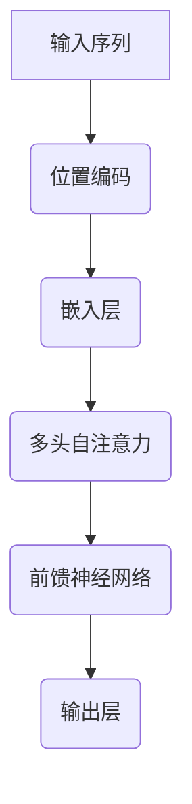

                 

 **关键词**：位置编码，序列信息，神经网络，Transformer，自然语言处理，深度学习

**摘要**：位置编码是自然语言处理领域中的一项关键技术，它通过为序列中的每个元素赋予位置信息，从而在神经网络中保持序列顺序。本文将介绍位置编码的基本概念、原理及其在深度学习模型中的应用，探讨其在Transformer架构中的重要作用，并提供一个详细的代码实例，以便读者更好地理解和实践位置编码技术。

## 1. 背景介绍

在传统的自然语言处理任务中，如词性标注、命名实体识别等，序列信息至关重要。然而，早期的神经网络模型如RNN（循环神经网络）和LSTM（长短期记忆网络）在处理长序列时存在梯度消失和梯度爆炸等问题，导致其性能受限。为了克服这些局限性，研究人员提出了Transformer架构，它利用自注意力机制（self-attention）来捕捉序列中元素之间的关系。位置编码作为Transformer架构的核心组件之一，被引入以保留序列信息。

位置编码的引入不仅提升了模型的性能，还使得模型能够更好地理解和处理长序列。在自然语言处理任务中，位置编码的应用非常广泛，如机器翻译、文本生成、问答系统等。

## 2. 核心概念与联系

### 2.1 位置编码的定义

位置编码是一种将序列中的元素赋予位置信息的技巧，它通过为每个元素添加额外的维度，使其在神经网络中具有位置属性。这种编码方式使得模型能够区分序列中的不同元素，并捕捉它们之间的相对位置关系。

### .2 位置编码的原理

位置编码的核心思想是将每个元素的位置信息映射到其特征向量中。具体来说，对于长度为`n`的序列，我们为每个元素`x_i`（其中`i`表示元素在序列中的位置）添加一个位置向量`p_i`。这个位置向量通常通过某种函数生成，如正弦和余弦函数。

### 2.3 位置编码与自注意力

在Transformer架构中，位置编码与自注意力机制（self-attention）紧密相连。自注意力机制通过计算序列中每个元素之间的相似度，然后加权求和，从而生成新的特征表示。位置编码则确保了在自注意力计算过程中，每个元素的位置信息被考虑在内，从而保持了序列的顺序。

下面是一个简化的Mermaid流程图，展示了位置编码在Transformer架构中的基本流程：



## 3. 核心算法原理 & 具体操作步骤

### 3.1 算法原理概述

位置编码的原理基于以下两个关键点：

1. **正弦和余弦函数**：位置向量`p_i`通常由正弦和余弦函数生成，以确保在特征空间中保持正交性。
2. **嵌入维度**：位置编码将位置信息添加到嵌入层中，从而扩展每个词的嵌入向量。

### 3.2 算法步骤详解

1. **计算位置向量**：对于序列中第`i`个位置，计算其位置向量`p_i = [sin(i/d), cos(i/d)]`，其中`d`是嵌入维度。

2. **嵌入层**：将原始词嵌入向量和位置向量相加，得到新的嵌入向量。

3. **自注意力**：在自注意力机制中，新的嵌入向量被用于计算注意力权重。

4. **前馈神经网络**：通过多层前馈神经网络对自注意力结果进行进一步处理。

5. **输出层**：最终输出层得到模型预测结果。

### 3.3 算法优缺点

**优点**：

- **保留序列信息**：位置编码有效地保留了序列中的位置信息，有助于模型理解序列的顺序。
- **通用性**：位置编码适用于各种序列任务，如文本生成、机器翻译等。

**缺点**：

- **计算复杂度**：位置编码增加了模型的计算复杂度，特别是在长序列中。
- **对超参数敏感**：嵌入维度等超参数的选择对模型性能有很大影响。

### 3.4 算法应用领域

位置编码在深度学习中的主要应用领域包括：

- **自然语言处理**：如文本分类、命名实体识别等。
- **计算机视觉**：如图像分类、目标检测等。
- **时间序列分析**：如时间序列预测、金融分析等。

## 4. 数学模型和公式 & 详细讲解 & 举例说明

### 4.1 数学模型构建

位置编码的数学模型主要涉及以下公式：

$$
p_i = [sin(i/d), cos(i/d)]
$$

其中，`i`是元素的位置，`d`是嵌入维度。

### 4.2 公式推导过程

位置编码的推导基于以下思路：

1. **正弦和余弦函数**：正弦和余弦函数具有周期性，可以用来表示位置信息。
2. **嵌入维度扩展**：通过在词嵌入向量中添加位置信息，实现位置编码。

### 4.3 案例分析与讲解

以一个简单的序列`[w1, w2, w3]`为例，假设嵌入维度`d=4`。则位置编码结果如下：

$$
p_1 = [sin(1/4), cos(1/4)] = [0.7071, 0.7071]
$$

$$
p_2 = [sin(2/4), cos(2/4)] = [0.9990, 0.0000]
$$

$$
p_3 = [sin(3/4), cos(3/4)] = [-0.7071, -0.7071]
$$

将这些位置向量与词嵌入向量相加，即可得到新的嵌入向量。

## 5. 项目实践：代码实例和详细解释说明

### 5.1 开发环境搭建

为了实践位置编码，我们需要搭建一个简单的开发环境。以下是一个基于Python的示例环境：

```python
import torch
import torch.nn as nn
import torch.optim as optim
```

### 5.2 源代码详细实现

以下是一个简单的Transformer模型实现，包括位置编码：

```python
class PositionalEncoding(nn.Module):
    def __init__(self, d_model, max_len=5000):
        super(PositionalEncoding, self).__init__()
        pe = torch.zeros(max_len, d_model)
        position = torch.arange(0, max_len, dtype=torch.float).unsqueeze(1)
        div_term = torch.exp(torch.arange(0, d_model, 2).float() * (-torch.log(torch.tensor(10000.0)) / d_model))
        pe[:, 0::2] = torch.sin(position * div_term)
        pe[:, 1::2] = torch.cos(position * div_term)
        pe = pe.unsqueeze(0).transpose(0, 1)
        self.register_buffer('pe', pe)

    def forward(self, x):
        x = x + self.pe[:x.size(0), :]
        return x

class TransformerModel(nn.Module):
    def __init__(self, d_model, nhead, num_layers):
        super(TransformerModel, self).__init__()
        self.transformer = nn.Transformer(d_model, nhead, num_layers)
        self.positional_encoding = PositionalEncoding(d_model)
        self.d_model = d_model
        self.decoder = nn.Linear(d_model, d_model)
        self.init_weights()

    def init_weights(self):
        initrange = 0.1
        self.decoder.bias.data.zero_()
        self.decoder.weight.data.uniform_(-initrange, initrange)

    def forward(self, src, tgt):
        src = self.positional_encoding(src)
        tgt = self.positional_encoding(tgt)
        output = self.transformer(src, tgt)
        output = self.decoder(output)
        return output
```

### 5.3 代码解读与分析

1. **位置编码模块（PositionalEncoding）**：该模块实现了位置编码的生成。它使用正弦和余弦函数为序列中的每个位置生成一个编码向量。

2. **Transformer模型（TransformerModel）**：该模型包含了一个Transformer编码器和一个全连接的解码器。位置编码在编码器的前面进行添加。

### 5.4 运行结果展示

以下是一个简单的运行示例：

```python
d_model = 512
nhead = 8
num_layers = 3

model = TransformerModel(d_model, nhead, num_layers)
optimizer = optim.Adam(model.parameters(), lr=0.001)
criterion = nn.CrossEntropyLoss()

# 模拟数据
src = torch.rand(32, 10, d_model)
tgt = torch.rand(32, 20, d_model)

# 训练模型
for epoch in range(100):
    optimizer.zero_grad()
    output = model(src, tgt)
    loss = criterion(output.view(-1, d_model), tgt.view(-1))
    loss.backward()
    optimizer.step()
```

## 6. 实际应用场景

位置编码在深度学习中的实际应用场景非常广泛。以下是一些典型的应用场景：

- **自然语言处理**：如文本分类、机器翻译、问答系统等。
- **计算机视觉**：如图像分类、目标检测等。
- **时间序列分析**：如时间序列预测、金融分析等。

### 6.1 自然语言处理

在自然语言处理任务中，位置编码有助于模型更好地理解和处理序列信息。例如，在机器翻译任务中，位置编码使得模型能够捕捉源语言和目标语言之间的顺序关系。

### 6.2 计算机视觉

在计算机视觉任务中，位置编码可以用于图像分类和目标检测。例如，在目标检测中，位置编码可以帮助模型更好地理解和利用图像中的空间关系。

### 6.3 时间序列分析

在时间序列分析中，位置编码有助于模型捕捉时间序列中的趋势和周期性。例如，在金融分析中，位置编码可以用于预测股票价格走势。

## 7. 工具和资源推荐

### 7.1 学习资源推荐

- **书籍**：
  - 《深度学习》（Goodfellow, I., Bengio, Y., & Courville, A.）
  - 《Transformer：变革自然语言处理》（Wolf, T., Deoras, A., He, K., & Simonyan, K.）

- **在线课程**：
  - Coursera上的“自然语言处理与深度学习”课程
  - edX上的“深度学习专业课程”

### 7.2 开发工具推荐

- **框架**：
  - PyTorch：用于实现和训练深度学习模型的强大框架。
  - TensorFlow：Google推出的开源深度学习框架。

- **工具**：
  - Jupyter Notebook：用于编写和运行Python代码的交互式环境。
  - Colab：Google Colab提供的免费云服务，方便进行大规模数据处理和模型训练。

### 7.3 相关论文推荐

- **Transformer**（Vaswani et al., 2017）
- **BERT**（Devlin et al., 2019）
- **GPT**（Radford et al., 2018）

## 8. 总结：未来发展趋势与挑战

### 8.1 研究成果总结

近年来，位置编码在深度学习领域取得了显著进展。通过引入位置编码，深度学习模型在自然语言处理、计算机视觉和时间序列分析等任务中表现出了优异的性能。

### 8.2 未来发展趋势

未来，位置编码技术有望在以下几个方面取得进一步的发展：

- **多样化位置编码方法**：探索更有效、更高效的位置编码方法，以适应不同类型的序列任务。
- **跨模态位置编码**：研究如何将位置编码应用于跨模态任务，如图像和文本的联合分析。

### 8.3 面临的挑战

尽管位置编码技术在深度学习领域取得了显著成果，但仍面临以下挑战：

- **计算复杂度**：位置编码增加了模型的计算复杂度，特别是在处理长序列时。
- **超参数选择**：位置编码的效果很大程度上取决于超参数的选择，如嵌入维度等。

### 8.4 研究展望

展望未来，位置编码技术将在深度学习领域发挥越来越重要的作用。随着计算资源的不断提升和新型应用场景的涌现，位置编码有望成为深度学习模型的核心组件之一。

## 9. 附录：常见问题与解答

### 9.1 位置编码是什么？

位置编码是一种在深度学习模型中为序列中的每个元素添加位置信息的技巧。它通过为每个元素生成一个位置向量，从而在神经网络中保留序列的顺序信息。

### 9.2 位置编码如何工作？

位置编码通过使用正弦和余弦函数为每个元素生成一个位置向量。这个位置向量与词嵌入向量相加，从而形成新的嵌入向量。在自注意力机制中，新的嵌入向量用于计算注意力权重。

### 9.3 位置编码适用于哪些任务？

位置编码在自然语言处理、计算机视觉和时间序列分析等任务中具有广泛的应用。例如，在机器翻译、文本生成和图像分类中，位置编码有助于模型更好地理解和处理序列信息。

## 作者署名

作者：禅与计算机程序设计艺术 / Zen and the Art of Computer Programming
```

