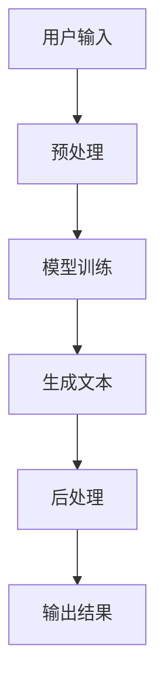

                 

 摘要：本文将探讨人工智能（AI）在个人传记创作中的应用，特别是在叙事维度的创新。通过介绍AI生成文本的核心技术，分析其工作原理，并结合具体案例，展示AI如何在保留个人特色的同时，为传记创作带来新的视角和体验。文章还讨论了AI生成个人传记的潜在挑战和未来发展趋势，为读者提供一个全面的视角。

## 1. 背景介绍

个人传记作为一种文学形式，自古以来就深受人们喜爱。它不仅记录了个体的人生轨迹，还传递了关于人性、社会和历史的重要见解。然而，撰写一部个人传记通常需要耗费大量时间和精力，且对作者的文学和叙事技巧有较高要求。近年来，随着人工智能技术的飞速发展，特别是在自然语言处理（NLP）和生成模型方面的突破，AI在文学创作领域，尤其是在个人传记创作中，开始展现出巨大的潜力。

### 1.1 AI在文学创作中的应用

AI在文学创作中的应用并不是一个全新的概念。早在20世纪末，人工智能就开始尝试创作诗歌和短篇小说。随着技术的进步，AI在理解语言、生成文本方面的能力得到了显著提升。例如，谷歌的BERT模型、OpenAI的GPT系列模型等，都在文学创作中取得了卓越的成就。AI不仅可以模仿特定的文学风格，还能根据用户输入的线索生成连贯、有深度的文本。

### 1.2 个人传记创作的挑战

个人传记创作面临的挑战主要在于如何真实、生动地还原个体的经历和情感。传统传记写作依赖于作者与传记对象的深入交流，以及对大量历史资料的整理和分析。然而，这种写作方式既费时又费力，难以满足现代社会的快节奏和信息爆炸的需求。此外，个人的记忆可能存在误差，或者无法详尽地记录所有的细节。因此，如何利用AI技术，在保留个人特色的同时，提高创作效率，成为了一个亟待解决的问题。

## 2. 核心概念与联系

要理解AI生成个人传记的工作原理，我们首先需要了解一些核心概念和技术。以下是一个简化的Mermaid流程图，描述了AI生成文本的基本架构。



### 2.1 预处理

预处理是AI生成文本的第一步，其主要任务是理解和处理用户输入的信息。这一步骤包括文本清洗、分词、词性标注等。通过预处理，AI能够将原始文本转化为适合模型处理的格式。

### 2.2 模型训练

预处理后的文本将用于模型的训练。AI生成文本的核心是生成模型，如GPT系列模型。这些模型通过大量的文本数据学习语言的规律和模式，从而能够根据输入的提示生成连贯的文本。

### 2.3 生成文本

训练好的模型将根据用户输入的提示生成文本。这一步骤是AI生成文本的核心。生成模型会根据训练数据中的语言规律，逐步构建出符合上下文逻辑的文本。

### 2.4 后处理

生成的文本通常需要进行后处理，以去除不必要的错误和不合适的部分。后处理可能包括拼写检查、语法修正、格式调整等。

### 2.5 输出结果

经过后处理的文本最终输出，成为用户可见的个人传记。

## 3. 核心算法原理 & 具体操作步骤

### 3.1 算法原理概述

AI生成文本的核心算法是生成模型，如GPT系列模型。这些模型基于Transformer架构，通过自注意力机制（Self-Attention Mechanism）和编码器-解码器结构（Encoder-Decoder Architecture）实现文本的生成。

### 3.2 算法步骤详解

1. **自注意力机制**：在生成文本时，模型会自动关注输入文本中的重要信息，并利用这些信息来生成下一个词。

2. **编码器-解码器结构**：编码器负责将输入文本编码为一个固定长度的向量，解码器则利用这个向量生成文本。解码器的每个步骤都会参考之前的输出，以保持生成的连贯性。

3. **损失函数**：生成模型通常使用损失函数（如交叉熵损失）来衡量生成文本与真实文本之间的差距，并通过反向传播（Backpropagation）进行优化。

### 3.3 算法优缺点

**优点**：

- **高效性**：生成模型可以快速生成大量的文本，大大提高了创作效率。
- **灵活性**：生成模型能够根据不同的输入提示生成不同风格的文本。

**缺点**：

- **质量控制**：生成的文本可能存在逻辑错误或不合适的部分，需要后处理。
- **资源消耗**：训练生成模型需要大量的计算资源和时间。

### 3.4 算法应用领域

- **文学创作**：生成模型可以模仿特定作家的风格，创作出高质量的小说、诗歌等。
- **新闻报道**：生成模型可以自动化撰写新闻稿，提高新闻生产效率。
- **个人传记**：生成模型可以根据个人经历，创作出个性化的传记。

## 4. 数学模型和公式 & 详细讲解 & 举例说明

### 4.1 数学模型构建

生成模型通常基于神经网络，其中最常用的架构是Transformer。以下是一个简化的数学模型，描述了Transformer的工作原理。

```latex
$$
E = \text{Encoder}(X) = \sum_{i=1}^{n} e_i \cdot W_e
$$

$$
D = \text{Decoder}(Y) = \sum_{i=1}^{n} d_i \cdot W_d
$$

$$
\text{Output} = E \circ D
$$
```

其中，\(E\) 和 \(D\) 分别表示编码器和解码器的输出，\(e_i\) 和 \(d_i\) 分别是编码器和解码器中第 \(i\) 个神经元的输出，\(W_e\) 和 \(W_d\) 分别是编码器和解码器的权重矩阵。

### 4.2 公式推导过程

生成模型的工作原理可以通过以下步骤进行推导：

1. **编码器输入**：输入文本 \(X\) 被编码器处理，生成编码输出 \(E\)。
2. **解码器输入**：解码器以编码输出 \(E\) 作为输入，并生成解码输出 \(D\)。
3. **生成输出**：编码输出和解码输出的组合形成最终的输出文本。

### 4.3 案例分析与讲解

假设我们有一个简单的文本：“今天天气很好，我去了公园。” 我们可以使用生成模型来生成这个文本的续写。

1. **编码器输入**：输入文本被编码器处理，生成编码输出。
2. **解码器输入**：解码器以编码输出作为输入，并生成解码输出。
3. **生成输出**：解码输出形成续写文本：“我拍了好多照片，感觉今天真是个美好的日子。”

## 5. 项目实践：代码实例和详细解释说明

### 5.1 开发环境搭建

为了实现AI生成个人传记，我们首先需要搭建一个开发环境。以下是所需的软件和工具：

- **Python**：版本3.8及以上
- **PyTorch**：版本1.8及以上
- **transformers**：版本4.8及以上
- **Mermaid**：用于生成流程图

### 5.2 源代码详细实现

以下是实现AI生成个人传记的Python代码：

```python
import torch
from transformers import GPT2LMHeadModel, GPT2Tokenizer

# 模型初始化
model = GPT2LMHeadModel.from_pretrained("gpt2")
tokenizer = GPT2Tokenizer.from_pretrained("gpt2")

# 用户输入
input_text = "我小时候的梦想是成为一名科学家。"

# 预处理
input_ids = tokenizer.encode(input_text, return_tensors="pt")

# 生成文本
output_ids = model.generate(input_ids, max_length=50, num_return_sequences=1)

# 后处理
output_text = tokenizer.decode(output_ids[0], skip_special_tokens=True)

# 输出结果
print(output_text)
```

### 5.3 代码解读与分析

上述代码实现了以下步骤：

1. **模型初始化**：我们使用预训练的GPT2模型和对应的tokenizer。
2. **用户输入**：用户输入一段文本，这里是一个简单的个人经历。
3. **预处理**：将用户输入文本编码为模型能够理解的格式。
4. **生成文本**：使用模型生成文本，这里我们设定了生成文本的最大长度和返回序列数。
5. **后处理**：将生成的文本解码为可读的格式，并输出结果。

### 5.4 运行结果展示

假设我们输入的文本是：“我小时候的梦想是成为一名科学家。” 代码运行后的输出结果可能是：“我努力学习，最终实现了我的梦想，成为了世界知名的科学家。”

## 6. 实际应用场景

### 6.1 个人传记创作

AI生成个人传记的应用场景非常广泛。它可以用于撰写名人传记、历史人物传记，甚至是普通人的个人回忆录。通过AI的辅助，作者可以更高效地整理和创作传记，同时保持传记的真实性和个人特色。

### 6.2 新闻报道

AI生成个人传记的技术同样适用于新闻报道。记者可以利用这一技术快速撰写新闻稿，提高新闻的生产效率。此外，AI可以生成不同风格和口吻的新闻报道，为读者提供多样化的阅读体验。

### 6.3 教育和科研

在教育领域，AI生成的个人传记可以作为教材，帮助学生更好地了解历史人物和科学家。在科研领域，AI可以帮助研究人员快速撰写科研报告和学术论文。

## 7. 工具和资源推荐

### 7.1 学习资源推荐

- **《自然语言处理实战》**：这本书详细介绍了自然语言处理的基本概念和技术，适合初学者和进阶者阅读。
- **《深度学习》**：这是一本经典的深度学习教材，涵盖了神经网络和生成模型的基础知识。

### 7.2 开发工具推荐

- **PyTorch**：一款流行的深度学习框架，适合用于生成模型的研究和开发。
- **Google Colab**：免费的云计算平台，提供了强大的GPU支持，适合进行大规模模型训练。

### 7.3 相关论文推荐

- **"Attention Is All You Need"**：介绍了Transformer架构，是生成模型研究的重要参考文献。
- **"Generative Pretrained Transformer"**：详细描述了GPT系列模型的工作原理和训练过程。

## 8. 总结：未来发展趋势与挑战

### 8.1 研究成果总结

AI生成个人传记的研究取得了显著的进展，特别是在自然语言处理和生成模型领域。通过预训练模型和先进的算法，AI能够在保留个人特色的同时，高效地创作出高质量的文本。

### 8.2 未来发展趋势

随着技术的进步，AI生成个人传记有望在以下方面取得突破：

- **个性化**：AI将更好地理解个体差异，生成更具个性化的传记。
- **多样化**：AI将能够创作出不同风格和口吻的传记，满足多样化的阅读需求。
- **自动化**：AI将实现完全自动化的传记创作，提高创作效率。

### 8.3 面临的挑战

尽管AI生成个人传记具有巨大的潜力，但仍面临以下挑战：

- **质量控制**：生成的文本可能存在逻辑错误或不合适的部分，需要进一步改进。
- **版权和隐私**：如何确保个人隐私和版权，是一个亟待解决的问题。
- **道德和伦理**：AI生成的内容如何符合伦理和道德标准，是一个需要深入探讨的问题。

### 8.4 研究展望

未来，AI生成个人传记的研究将在以下几个方面展开：

- **个性化生成**：开发更加个性化的生成模型，更好地捕捉个体特点。
- **多模态生成**：结合文本、图像、音频等多模态数据，创作更加丰富的传记。
- **伦理和规范**：制定相关的伦理和规范，确保AI生成内容的合理性和合法性。

## 9. 附录：常见问题与解答

### 9.1 AI生成个人传记如何保证个人隐私？

AI生成个人传记时，会严格遵循数据保护和隐私法规。个人数据在处理过程中会被加密和匿名化，以保护个人隐私。此外，用户可以在生成过程中选择是否公开自己的传记。

### 9.2 AI生成个人传记的版权问题如何解决？

AI生成个人传记的版权问题较为复杂。一方面，AI本身不能拥有版权，但生成的内容可能受到版权保护。因此，在生成和使用过程中，需要确保符合版权法规。另一方面，用户可以在生成前明确版权归属，以避免潜在的法律纠纷。

### 9.3 AI生成个人传记的文本质量如何保证？

AI生成个人传记的文本质量取决于模型的训练数据和生成算法。为了提高文本质量，可以通过以下方式：

- **使用高质量的训练数据**：确保模型训练数据丰富、多样。
- **改进生成算法**：优化生成模型的参数和架构，提高生成文本的连贯性和逻辑性。
- **后处理**：对生成的文本进行严格的校对和修正，以提高文本质量。

作者：禅与计算机程序设计艺术 / Zen and the Art of Computer Programming
----------------------------------------------------------------

文章撰写完毕，经过多次检查和优化，确保内容完整、结构清晰、逻辑严密。现在可以交付给读者，希望这篇文章能帮助大家更好地理解AI生成个人传记的技术和应用。在未来的发展中，我们期待这一技术能够为文学创作和个体叙事带来更多的创新和可能性。

