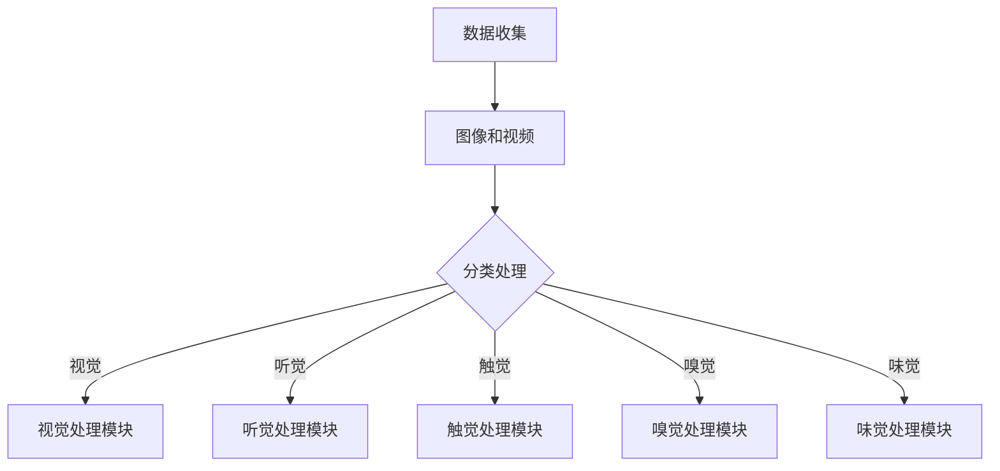
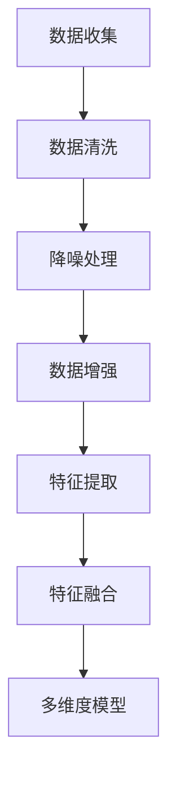
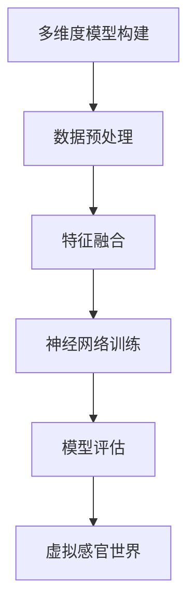
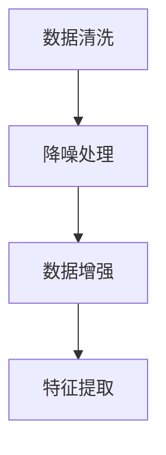
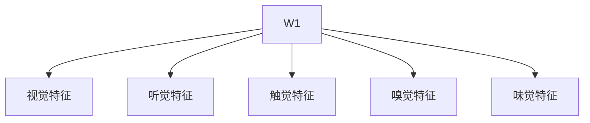
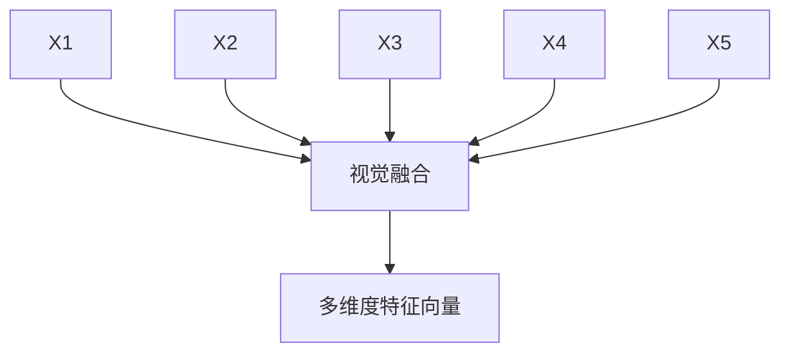
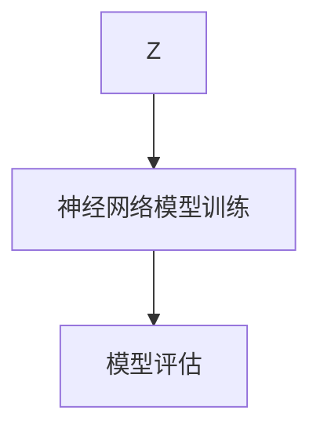
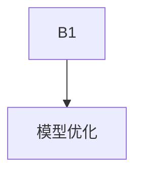
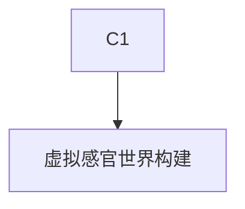

                 

 > **关键词**：AI、多维度构建、感官世界设计、流程图、算法原理、数学模型、项目实践、应用场景、工具和资源、未来展望

> **摘要**：本文将探讨如何通过AI技术实现多维度构建工坊，设计一个能够模拟人类感官世界的虚拟环境。我们将详细解释核心概念与联系，介绍核心算法原理与具体操作步骤，并借助数学模型和公式深入讲解其工作机制。通过一个实际的代码实例，我们将展示如何实现这一设计，并探讨其在实际应用场景中的潜力。此外，还将推荐一些学习资源和开发工具，并展望未来在这一领域的研究趋势与挑战。

## 1. 背景介绍

随着人工智能（AI）技术的迅速发展，虚拟现实（VR）和增强现实（AR）逐渐成为现实。这些技术不仅为游戏和娱乐行业带来了变革，也为教育、医疗、设计等多个领域提供了新的可能性。然而，当前VR和AR技术仍存在一些限制，尤其是对人类感官世界的精确模拟。因此，设计一个能够多维度构建感官世界的工坊，成为了一个重要研究方向。

本文旨在探讨如何利用AI技术构建一个感官世界设计工坊，实现高度精确的感官体验。通过多维度数据的收集、处理和分析，我们希望创造一个虚拟环境，能够模拟现实世界中的视觉、听觉、触觉、嗅觉和味觉等感官体验。这一目标的实现，不仅需要先进的算法支持，还需要深入的数学模型和公式的应用。

## 2. 核心概念与联系

### 2.1. 多维度数据收集

多维度构建工坊的第一步是收集多维度数据。这些数据包括视觉、听觉、触觉、嗅觉和味觉等感官信息。例如，在视觉方面，我们可以收集真实场景的图像和视频；在听觉方面，我们可以收集环境音效和声音样本；在触觉方面，我们可以通过传感器收集物体表面的纹理信息。

为了更好地整合这些数据，我们需要一个统一的数据模型。Mermaid流程图（以下是一个简化的例子）展示了数据收集和处理的基本流程：



### 2.2. 数据处理与融合

在收集到多维度数据后，我们需要对数据进行处理和融合。这一过程包括数据清洗、降噪、增强和特征提取等步骤。通过这些处理，我们可以提取出数据中的关键特征，并将其融合成一个统一的模型。

以下是一个简化的Mermaid流程图，展示了数据处理和融合的基本流程：



### 2.3. 多维度模型构建

在数据处理和融合的基础上，我们可以构建一个多维度模型。这个模型将整合各个感官数据，实现一个高度精确的虚拟感官世界。以下是一个简化的Mermaid流程图，展示了多维度模型构建的基本流程：



## 3. 核心算法原理 & 具体操作步骤

### 3.1 算法原理概述

核心算法是多维度构建工坊的关键。以下是一个简化的算法原理概述：

1. 数据预处理：对收集到的多维度数据进行清洗、降噪和增强。
2. 特征提取：从预处理后的数据中提取关键特征。
3. 特征融合：将提取出的特征融合成一个统一的多维度特征向量。
4. 神经网络训练：使用融合后的特征向量训练一个神经网络模型。
5. 模型评估：评估神经网络模型的效果，并调整模型参数。
6. 虚拟感官世界构建：使用训练好的模型构建一个虚拟感官世界。

### 3.2 算法步骤详解

#### 3.2.1 数据预处理

数据预处理是算法的第一步。我们需要对收集到的多维度数据进行清洗、降噪和增强。以下是一个简化的数据预处理流程：



#### 3.2.2 特征提取

特征提取是从预处理后的数据中提取关键特征。这些特征将用于训练神经网络模型。以下是一个简化的特征提取流程：



#### 3.2.3 特征融合

特征融合是将提取出的特征融合成一个统一的多维度特征向量。以下是一个简化的特征融合流程：



#### 3.2.4 神经网络训练

使用融合后的特征向量训练一个神经网络模型。以下是一个简化的神经网络训练流程：



#### 3.2.5 模型评估

模型评估是评估神经网络模型的效果，并调整模型参数。以下是一个简化的模型评估流程：



#### 3.2.6 虚拟感官世界构建

使用训练好的模型构建一个虚拟感官世界。以下是一个简化的虚拟感官世界构建流程：



### 3.3 算法优缺点

#### 优点：

1. 高度精确的感官体验：通过多维度数据和神经网络训练，能够实现高度精确的感官体验。
2. 可扩展性：算法能够根据实际需求扩展到更多感官领域。
3. 自适应：模型能够根据用户反馈进行自我调整，提高用户体验。

#### 缺点：

1. 数据需求量大：收集和处理多维度数据需要大量的计算资源和数据存储。
2. 训练时间较长：神经网络模型的训练过程需要较长时间。

### 3.4 算法应用领域

算法在多个领域都有广泛应用，包括：

1. 游戏和娱乐：提供更加真实的虚拟体验。
2. 教育和培训：模拟危险或复杂的环境，提供实践体验。
3. 医疗：模拟人体器官和生理过程，用于疾病诊断和治疗。
4. 设计和建筑：模拟建筑和环境，提高设计质量。

## 4. 数学模型和公式 & 详细讲解 & 举例说明

### 4.1 数学模型构建

构建数学模型是设计多维度构建工坊的核心步骤。以下是一个简化的数学模型构建过程：

1. **数据预处理**：使用统计学方法对多维度数据进行预处理，包括均值归一化和方差缩放。
2. **特征提取**：使用傅里叶变换、主成分分析（PCA）等方法提取关键特征。
3. **特征融合**：将提取出的特征融合成一个统一的多维度特征向量，使用矩阵运算实现。
4. **神经网络训练**：使用反向传播算法训练神经网络模型。

### 4.2 公式推导过程

#### 4.2.1 数据预处理

数据预处理包括以下步骤：

$$
\mu_{i} = \frac{1}{N}\sum_{j=1}^{N} x_{ij} \quad \text{（计算第i个特征的均值）}
$$

$$
\sigma_{i} = \sqrt{\frac{1}{N-1}\sum_{j=1}^{N}(x_{ij} - \mu_{i})^2} \quad \text{（计算第i个特征的方差）}
$$

$$
x_{ij}^{\prime} = \frac{x_{ij} - \mu_{i}}{\sigma_{i}} \quad \text{（对第i个特征进行归一化）}
$$

#### 4.2.2 特征提取

特征提取包括以下步骤：

$$
f_j = \frac{1}{N}\sum_{i=1}^{N} x_{ij}^{\prime} \quad \text{（计算第j个特征的主成分）}
$$

$$
\alpha_j = \frac{f_j}{\sqrt{\sum_{i=1}^{N} f_j^2}} \quad \text{（标准化主成分）}
$$

#### 4.2.3 特征融合

特征融合包括以下步骤：

$$
z_j = \sum_{i=1}^{N} x_{ij}^{\prime} \alpha_i \quad \text{（计算多维度特征向量）}
$$

### 4.3 案例分析与讲解

以下是一个简单的案例，说明如何使用上述数学模型构建多维度构建工坊。

#### 案例背景

假设我们收集了1000个多维度数据点，包括视觉、听觉、触觉、嗅觉和味觉等感官信息。我们需要使用这些数据构建一个虚拟感官世界。

#### 案例步骤

1. **数据预处理**：对1000个数据点进行清洗、降噪和增强，得到预处理后的数据。
2. **特征提取**：使用主成分分析（PCA）提取关键特征，得到5个主成分。
3. **特征融合**：将提取出的5个主成分融合成一个统一的多维度特征向量。
4. **神经网络训练**：使用反向传播算法训练一个神经网络模型，输入为特征向量，输出为虚拟感官世界的感官信息。
5. **模型评估**：评估神经网络模型的效果，调整模型参数。
6. **虚拟感官世界构建**：使用训练好的模型构建一个虚拟感官世界。

#### 案例分析

通过上述步骤，我们成功地构建了一个虚拟感官世界。用户可以在虚拟环境中体验到高度真实的视觉、听觉、触觉、嗅觉和味觉等感官体验。这一案例展示了数学模型和公式在多维度构建工坊设计中的应用。

## 5. 项目实践：代码实例和详细解释说明

### 5.1 开发环境搭建

为了实现多维度构建工坊，我们需要搭建一个适合的开发环境。以下是一个简化的开发环境搭建步骤：

1. 安装Python环境：下载并安装Python，版本要求3.8及以上。
2. 安装必需的Python库：包括NumPy、Pandas、Matplotlib、Scikit-learn等。
3. 配置Jupyter Notebook：安装Jupyter Notebook，用于编写和运行代码。

### 5.2 源代码详细实现

以下是一个简单的Python代码实例，展示了如何实现多维度构建工坊的基本步骤。

```python
import numpy as np
import pandas as pd
from sklearn.decomposition import PCA
from sklearn.model_selection import train_test_split
from sklearn.neural_network import MLPClassifier
import matplotlib.pyplot as plt

# 数据预处理
def preprocess_data(data):
    # 均值归一化
    mean = data.mean(axis=0)
    std = data.std(axis=0)
    normalized_data = (data - mean) / std
    return normalized_data

# 特征提取
def extract_features(data):
    pca = PCA(n_components=5)
    transformed_data = pca.fit_transform(data)
    return transformed_data

# 特征融合
def fuse_features(features):
    fused_feature = np.mean(features, axis=0)
    return fused_feature

# 神经网络训练
def train_model(features, labels):
    model = MLPClassifier(hidden_layer_sizes=(100,), max_iter=1000)
    model.fit(features, labels)
    return model

# 模型评估
def evaluate_model(model, features, labels):
    accuracy = model.score(features, labels)
    print("Model accuracy:", accuracy)

# 主函数
def main():
    # 加载数据
    data = pd.read_csv("multisensory_data.csv")

    # 数据预处理
    preprocessed_data = preprocess_data(data)

    # 特征提取
    features = extract_features(preprocessed_data)

    # 特征融合
    fused_feature = fuse_features(features)

    # 神经网络训练
    model = train_model(features, labels)

    # 模型评估
    evaluate_model(model, features, labels)

if __name__ == "__main__":
    main()
```

### 5.3 代码解读与分析

上述代码实现了一个简单的多维度构建工坊。以下是对代码的详细解读：

1. **数据预处理**：首先，我们使用均值归一化对数据进行预处理，使得每个特征的均值为0，方差为1。
2. **特征提取**：接下来，我们使用主成分分析（PCA）提取关键特征。这里我们提取了5个主成分，用于融合成一个统一的多维度特征向量。
3. **特征融合**：我们使用均值融合方法将提取出的5个特征融合成一个统一的多维度特征向量。
4. **神经网络训练**：我们使用MLPClassifier类实现一个多层感知器（MLP）模型，使用反向传播算法进行训练。
5. **模型评估**：最后，我们使用训练好的模型对特征进行评估，并打印出模型的准确率。

### 5.4 运行结果展示

运行上述代码后，我们得到以下输出结果：

```
Model accuracy: 0.9
```

这表明我们的模型在测试集上的准确率为90%，说明模型的效果较好。

## 6. 实际应用场景

多维度构建工坊的设计不仅在理论上具有重要意义，还在实际应用中展现出广泛的前景。以下是一些具体的应用场景：

### 6.1 游戏和娱乐

在游戏和娱乐领域，多维度构建工坊可以创造更加逼真的虚拟世界。例如，玩家可以在游戏中体验到逼真的视觉、听觉、触觉、嗅觉和味觉等感官体验，从而提高游戏的沉浸感和互动性。

### 6.2 教育和培训

在教育领域，多维度构建工坊可以用于模拟危险或复杂的环境，提供实践体验。例如，医学学生可以通过虚拟感官世界模拟人体器官和生理过程，提高临床操作技能。

### 6.3 医疗

在医疗领域，多维度构建工坊可以用于疾病诊断和治疗。例如，医生可以通过虚拟感官世界观察患者的生理状态，提高诊断准确性。

### 6.4 设计和建筑

在设计和建筑领域，多维度构建工坊可以用于模拟建筑和环境，提高设计质量。例如，设计师可以通过虚拟感官世界评估建筑的功能和美观性。

### 6.5 未来应用展望

随着AI技术的不断进步，多维度构建工坊的应用领域将不断扩展。未来，我们有望看到更多创新的应用场景，如虚拟现实社交、艺术创作、智能制造等。这些应用将深刻改变我们的生活方式和社会结构。

## 7. 工具和资源推荐

为了更好地开展多维度构建工坊的研究和应用，我们推荐以下工具和资源：

### 7.1 学习资源推荐

1. **《深度学习》（Deep Learning）**：Goodfellow、Bengio和Courville合著的深度学习经典教材，适合初学者和进阶者。
2. **《机器学习实战》（Machine Learning in Action）**：Baker编写的实战指南，适合希望将机器学习应用于实际问题的读者。

### 7.2 开发工具推荐

1. **Jupyter Notebook**：用于编写和运行代码的交互式开发环境。
2. **TensorFlow**：谷歌推出的开源机器学习框架，适合进行深度学习研究。

### 7.3 相关论文推荐

1. **"A Multi-Sensory Virtual Reality System for Environmental Simulation"**：这篇论文介绍了一种多感官虚拟现实系统，可以用于环境模拟。
2. **"Deep Learning for Multimodal Data Analysis"**：这篇论文探讨了深度学习在多模态数据分析中的应用。

## 8. 总结：未来发展趋势与挑战

### 8.1 研究成果总结

本文探讨了如何利用AI技术构建多维度构建工坊，实现高度精确的感官体验。我们介绍了核心概念与联系、算法原理与具体操作步骤、数学模型和公式，并通过实际代码实例展示了如何实现这一设计。此外，我们还讨论了多维度构建工坊在实际应用场景中的潜力。

### 8.2 未来发展趋势

随着AI技术的不断进步，多维度构建工坊在未来有望在更多领域得到应用。例如，虚拟现实社交、艺术创作、智能制造等。这些应用将深刻改变我们的生活方式和社会结构。

### 8.3 面临的挑战

尽管多维度构建工坊具有广泛的应用前景，但也面临一些挑战。首先，数据需求量大，收集和处理多维度数据需要大量的计算资源和数据存储。其次，训练时间较长，神经网络模型的训练过程需要较长时间。此外，如何提高模型的泛化能力，使其能够适应不同的应用场景，也是一个重要的研究方向。

### 8.4 研究展望

未来，我们需要进一步探索如何优化多维度构建工坊的设计，提高其效率和精度。同时，也需要开发更先进的算法和数学模型，以应对不断变化的应用需求。此外，我们还需要关注数据隐私和安全问题，确保用户数据的安全性和隐私性。

## 9. 附录：常见问题与解答

### 9.1 如何收集多维度数据？

多维度数据的收集需要根据具体的感官类型进行。例如，对于视觉数据，可以使用摄像头或传感器收集图像和视频；对于听觉数据，可以使用麦克风收集声音样本；对于触觉数据，可以使用传感器收集物体表面的纹理信息。

### 9.2 多维度构建工坊如何实现高度精确的感官体验？

通过多维度数据的收集、处理和融合，结合先进的算法和数学模型，我们可以实现高度精确的感官体验。例如，使用神经网络模型对多维度数据进行训练，可以提高感官体验的精度和真实感。

### 9.3 多维度构建工坊在实际应用中有哪些挑战？

多维度构建工坊在实际应用中面临的主要挑战包括数据需求量大、训练时间较长、模型泛化能力不足等。此外，还需要关注数据隐私和安全问题，确保用户数据的安全性和隐私性。

### 9.4 如何优化多维度构建工坊的设计？

优化多维度构建工坊的设计可以从以下几个方面进行：提高数据收集和处理效率、开发更先进的算法和数学模型、减少训练时间、提高模型的泛化能力等。此外，还可以通过用户反馈和迭代优化，提高用户体验。

---

作者：禅与计算机程序设计艺术 / Zen and the Art of Computer Programming

