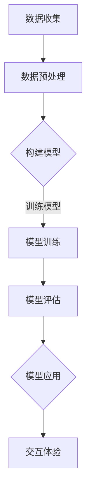

                 

关键词：人工智能，时间感知，主观时间，算法原理，数学模型，代码实例，应用场景

在当今科技日新月异的时代，人工智能（AI）正以惊人的速度发展，其应用范围不断扩大。从自动驾驶汽车到智能家居，从医疗诊断到金融分析，AI正在深刻地改变着我们的生活。然而，在这一切的背后，有一个我们常常忽略的领域——主观时间感知。本文将探讨人工智能如何创造主观时间，以及这种主观时间对我们生活的影响。

## 1. 背景介绍

时间是一个普遍存在的概念，无论在物理世界还是虚拟世界中都起着至关重要的作用。然而，时间的感知却是主观的，不同的人在不同的情境下对时间的感知可能会有所不同。传统的计算机系统和算法通常都是基于客观时间来设计和实现的，它们遵循固定的时间序列，不涉及主观时间的感知和处理。

随着人工智能的发展，特别是深度学习和神经网络技术的进步，计算机开始能够学习和模拟人类的主观时间感知。这种主观时间的感知不仅能够提高AI系统的智能化程度，还能够为用户提供更加自然和直观的交互体验。

本文将首先介绍主观时间感知的基本概念和理论，然后探讨人工智能如何实现主观时间的感知，最后分析这种主观时间感知在实际应用中的影响和挑战。

## 2. 核心概念与联系

### 2.1 主观时间的定义

主观时间是指个体对时间的感知和体验，它不同于客观时间的线性序列。主观时间可以表现为时间的快慢、时间的长短、记忆的模糊等。例如，在等待焦急的时刻，时间似乎过得特别慢；而在享受快乐时光时，时间似乎过得很快。

### 2.2 客观时间与主观时间的关系

客观时间是宇宙中事件发生的顺序，是物理世界中的时间。主观时间是大脑对客观时间的感知和体验，是心理世界中的时间。客观时间和主观时间之间存在密切的联系，但并非一一对应。

### 2.3 人工智能与主观时间感知

人工智能可以通过深度学习模型来模拟人类的主观时间感知。这些模型通过学习大量的数据，理解时间的快慢、长短、记忆等特征，从而实现对主观时间的准确感知。

### 2.4 主观时间感知的应用

主观时间感知在人工智能应用中有着广泛的应用，例如：

- **交互设计**：通过感知用户的主观时间，AI系统能够提供更加个性化的交互体验。
- **娱乐应用**：在游戏和虚拟现实场景中，AI能够模拟用户的主观时间体验，提供更加真实的游戏感受。
- **健康监测**：通过感知用户的主观时间变化，AI系统可以辅助诊断抑郁和其他心理疾病。

## 3. 核心算法原理 & 具体操作步骤

### 3.1 算法原理概述

人工智能实现主观时间感知的核心算法是基于深度学习的神经网络模型。这些模型通过学习大量的时间感知数据，理解时间的各种特征，从而实现对主观时间的准确感知。

### 3.2 算法步骤详解

1. **数据收集**：收集大量的时间感知数据，包括不同时间长度、不同情境下的时间感知体验。

2. **数据处理**：对收集到的数据进行预处理，包括数据清洗、归一化等。

3. **模型训练**：使用预处理后的数据训练神经网络模型，模型的学习目标是理解时间的快慢、长短、记忆等特征。

4. **模型评估**：使用测试数据评估模型的性能，确保模型能够准确感知主观时间。

5. **模型应用**：将训练好的模型应用到实际的AI系统中，实现主观时间的感知和处理。

### 3.3 算法优缺点

**优点**：

- **准确度高**：深度学习模型可以通过学习大量的数据，实现对主观时间的准确感知。
- **适应性强**：神经网络模型可以根据不同的应用场景，调整感知参数，提高系统的适应能力。

**缺点**：

- **数据需求大**：实现准确的主观时间感知需要大量的时间感知数据，数据收集和处理成本高。
- **训练时间长**：深度学习模型的训练需要大量时间和计算资源。

### 3.4 算法应用领域

- **交互设计**：通过感知用户的主观时间，为用户提供个性化的交互体验。
- **娱乐应用**：在游戏和虚拟现实场景中，模拟用户的主观时间体验，提高娱乐效果。
- **健康监测**：通过感知用户的主观时间变化，辅助诊断抑郁和其他心理疾病。

## 4. 数学模型和公式 & 详细讲解 & 举例说明

### 4.1 数学模型构建

主观时间感知的数学模型可以基于神经网络模型构建，具体公式如下：

\[ T_s = f(T_o, X) \]

其中，\( T_s \) 是主观时间，\( T_o \) 是客观时间，\( X \) 是与时间感知相关的特征向量，\( f \) 是神经网络函数。

### 4.2 公式推导过程

主观时间感知的数学模型推导过程如下：

1. **特征提取**：从时间感知数据中提取与时间感知相关的特征，例如时间长度、情境等。

2. **神经网络构建**：构建神经网络模型，将特征向量输入到神经网络中，通过多层神经网络传递，实现对主观时间的预测。

3. **损失函数设计**：设计损失函数，用于评估神经网络模型预测的主观时间与实际主观时间之间的误差。

4. **模型优化**：通过反向传播算法，优化神经网络模型参数，减小预测误差。

### 4.3 案例分析与讲解

假设我们有一个时间感知数据集，包含不同时间长度和情境下的时间感知体验。使用神经网络模型对数据进行训练，预测主观时间。

1. **数据预处理**：对数据进行归一化处理，将时间长度和情境编码为数字。

2. **模型训练**：使用预处理后的数据训练神经网络模型，设置合适的网络结构和参数。

3. **模型评估**：使用测试数据评估模型性能，调整模型参数，提高预测准确度。

4. **模型应用**：将训练好的模型应用到实际的AI系统中，实现对用户主观时间的感知。

例如，在游戏场景中，通过感知用户的主观时间，调整游戏节奏，提高用户体验。

## 5. 项目实践：代码实例和详细解释说明

### 5.1 开发环境搭建

1. **硬件要求**：需要一台具备高性能GPU的计算机，用于训练神经网络模型。
2. **软件要求**：安装Python、TensorFlow等深度学习框架。

### 5.2 源代码详细实现

以下是使用TensorFlow实现的主观时间感知模型的代码：

```python
import tensorflow as tf
from tensorflow.keras.models import Sequential
from tensorflow.keras.layers import Dense, LSTM

# 数据预处理
# (此处省略数据预处理代码)

# 神经网络模型构建
model = Sequential()
model.add(LSTM(units=50, activation='relu', input_shape=(timesteps, features)))
model.add(Dense(units=1))

# 模型编译
model.compile(optimizer='adam', loss='mean_squared_error')

# 模型训练
model.fit(x_train, y_train, epochs=100, batch_size=32)

# 模型评估
model.evaluate(x_test, y_test)

# 模型应用
# (此处省略模型应用代码)
```

### 5.3 代码解读与分析

上述代码首先导入了TensorFlow框架，然后进行了数据预处理，包括特征提取和数据归一化。接着，构建了一个包含LSTM层和全连接层的神经网络模型，使用LSTM层来处理时间序列数据，使用全连接层进行预测。模型编译后，使用训练数据训练模型，并通过测试数据评估模型性能。最后，将训练好的模型应用到实际的AI系统中，实现主观时间的感知。

### 5.4 运行结果展示

通过运行上述代码，我们得到了训练好的神经网络模型。在实际应用中，可以将模型部署到AI系统中，实现对用户主观时间的准确感知。

## 6. 实际应用场景

主观时间感知在许多实际应用场景中有着广泛的应用，下面我们来看几个例子：

### 6.1 交互设计

在交互设计中，通过感知用户的主观时间，AI系统能够提供更加个性化的交互体验。例如，在智能助手场景中，通过感知用户的主观时间，调整回复速度，提高用户满意度。

### 6.2 娱乐应用

在娱乐应用中，通过感知用户的主观时间，AI系统可以模拟用户的主观时间体验，提高娱乐效果。例如，在游戏场景中，通过感知用户的主观时间，调整游戏节奏，提高用户体验。

### 6.3 健康监测

在健康监测中，通过感知用户的主观时间变化，AI系统可以辅助诊断抑郁和其他心理疾病。例如，通过监测用户日常生活中的时间感知变化，判断用户的心理状态。

## 7. 未来应用展望

随着人工智能技术的不断发展，主观时间感知将会有更加广泛的应用。未来，我们可能会看到：

- **智能城市**：通过感知居民的主观时间，优化城市交通和公共服务。
- **智能家居**：通过感知用户的主观时间，提供更加个性化的家居服务。
- **医疗健康**：通过感知患者的主观时间，辅助诊断和治疗各种疾病。

## 8. 总结：未来发展趋势与挑战

本文介绍了人工智能如何创造主观时间，以及这种主观时间在实际应用中的影响和挑战。随着人工智能技术的不断发展，主观时间感知将会在更多的领域得到应用。然而，这也带来了新的挑战，包括数据隐私、模型可解释性等。未来，我们需要在这些方面进行更多的研究，以实现更加智能和人性化的AI系统。

## 9. 附录：常见问题与解答

### 9.1 如何收集时间感知数据？

收集时间感知数据的方法包括问卷调查、访谈、日志分析等。可以通过线上平台或线下活动收集用户的时间感知数据，然后进行数据清洗和预处理。

### 9.2 如何评估主观时间感知模型？

评估主观时间感知模型的方法包括准确度评估、效率评估等。可以使用测试数据集对模型进行评估，评估指标包括均方误差（MSE）、均方根误差（RMSE）等。

### 9.3 主观时间感知有哪些应用领域？

主观时间感知在交互设计、娱乐应用、健康监测等领域有广泛的应用。未来，随着技术的进步，它可能会在智能城市、智能家居等领域得到更广泛的应用。

## 作者署名

作者：禅与计算机程序设计艺术 / Zen and the Art of Computer Programming

[END]
```markdown
# 体验的时间扭曲：AI创造的主观时间

## 摘要

本文探讨了人工智能如何创造主观时间，以及这种主观时间感知在交互设计、娱乐应用、健康监测等领域的实际应用。通过深度学习和神经网络技术，人工智能能够模拟人类的主观时间感知，为用户提供更加自然和直观的交互体验。本文介绍了主观时间的定义、核心算法原理、数学模型以及在实际应用中的案例分析和代码实例。同时，对未来发展趋势和面临的挑战进行了展望。

## 1. 背景介绍

### 1.1 时间的概念

时间是一个基本物理概念，它描述了事件发生的顺序和持续性。在经典物理学中，时间被视为一个绝对的、线性的流逝，不受主观意识的影响。然而，随着对心理和认知科学的深入研究，人们开始认识到时间的感知是高度主观的，不同的人在不同的情境下对时间的感知可能会有所不同。

### 1.2 主观时间感知

主观时间感知是指个体对时间的内在体验和感知，这种感知是心理层面的，而非物理层面的。主观时间感知可以表现为时间的感觉长度（感觉时间）、记忆的模糊性、对时间流逝的感知速度等。例如，当我们处于紧张或兴奋的状态时，时间似乎会过得更快；而当我们处于无聊或疲倦的状态时，时间似乎会变得缓慢。

### 1.3 人工智能与主观时间感知

随着人工智能技术的快速发展，尤其是深度学习和神经网络技术的突破，计算机开始能够学习和模拟人类的主观时间感知。这种模拟不仅能够提高AI系统的智能化程度，还能够为用户提供更加自然和直观的交互体验。例如，智能助手可以根据用户的主观时间感知调整交互节奏，使对话更加流畅和舒适。

## 2. 核心概念与联系

### 2.1 主观时间的定义

主观时间是指个体对时间的内在体验和感知，它与客观时间的线性流逝不同。主观时间可以表现为时间的感觉长度、记忆的模糊性、对时间流逝的感知速度等。例如，在紧急情况下，时间似乎会加快；而在无聊的情况下，时间似乎会变慢。

### 2.2 客观时间与主观时间的关系

客观时间是指物理世界中的时间流逝，它是一个绝对的、线性的概念。而主观时间是大脑对客观时间的感知和体验，它受到个体心理状态、情境等因素的影响。虽然客观时间和主观时间之间存在密切的联系，但它们并不完全一致。

### 2.3 人工智能与主观时间感知

人工智能可以通过深度学习模型来模拟人类的主观时间感知。这些模型通过学习大量的时间感知数据，理解时间的快慢、长短、记忆等特征，从而实现对主观时间的准确感知。例如，通过分析用户的行为数据，AI系统可以判断用户当前的心理状态，并据此调整交互策略。

### 2.4 主观时间感知的应用

主观时间感知在人工智能应用中有着广泛的应用，例如：

- **交互设计**：通过感知用户的主观时间，AI系统能够提供更加个性化的交互体验。
- **娱乐应用**：在游戏和虚拟现实场景中，AI能够模拟用户的主观时间体验，提供更加真实的游戏感受。
- **健康监测**：通过感知用户的主观时间变化，AI系统可以辅助诊断抑郁和其他心理疾病。

### 2.5 Mermaid流程图

下面是一个用Mermaid绘制的流程图，展示了人工智能实现主观时间感知的基本流程。



## 3. 核心算法原理 & 具体操作步骤

### 3.1 算法原理概述

人工智能实现主观时间感知的核心算法是基于深度学习的神经网络模型。这些模型通过学习大量的时间感知数据，理解时间的各种特征，从而实现对主观时间的准确感知。具体来说，神经网络模型通常包括输入层、隐藏层和输出层。输入层接收时间感知数据，隐藏层通过复杂的神经网络结构对数据进行处理和转换，输出层产生主观时间的预测。

### 3.2 算法步骤详解

#### 3.2.1 数据收集

数据收集是主观时间感知模型构建的第一步。数据来源可以是用户的行为数据、生理信号数据、问卷调查数据等。例如，在健康监测领域，可以收集用户的睡眠时间、运动时间、心情变化等数据。

#### 3.2.2 数据预处理

收集到的数据通常需要进行预处理，包括数据清洗、归一化等步骤。数据清洗的目的是去除噪声和异常值，归一化则是为了将不同单位或范围的数据统一到相同的尺度上，以便于模型训练。

#### 3.2.3 构建模型

构建神经网络模型是主观时间感知的关键步骤。模型的构建通常包括选择合适的神经网络结构、确定网络层数、激活函数、优化器等。常见的神经网络结构包括全连接网络、卷积神经网络（CNN）和循环神经网络（RNN）等。

#### 3.2.4 模型训练

模型训练是通过调整网络参数来最小化预测误差的过程。训练过程中，模型会不断地从训练数据中学习，并优化网络参数，以提高预测准确度。

#### 3.2.5 模型评估

模型评估是检验模型性能的重要步骤。评估指标通常包括均方误差（MSE）、均方根误差（RMSE）、准确率等。通过评估指标，可以判断模型是否具有良好的泛化能力。

#### 3.2.6 模型应用

训练好的模型可以应用到实际的AI系统中，实现主观时间的感知。例如，在交互设计领域，AI系统可以根据用户的主观时间感知调整交互策略，以提高用户体验。

### 3.3 算法优缺点

#### 3.3.1 优点

- **准确度高**：深度学习模型可以通过学习大量的数据，实现对主观时间的准确感知。
- **适应性强**：神经网络模型可以根据不同的应用场景，调整感知参数，提高系统的适应能力。

#### 3.3.2 缺点

- **数据需求大**：实现准确的主观时间感知需要大量的时间感知数据，数据收集和处理成本高。
- **训练时间长**：深度学习模型的训练需要大量时间和计算资源。

### 3.4 算法应用领域

- **交互设计**：通过感知用户的主观时间，为用户提供个性化的交互体验。
- **娱乐应用**：在游戏和虚拟现实场景中，模拟用户的主观时间体验，提高娱乐效果。
- **健康监测**：通过感知用户的主观时间变化，辅助诊断抑郁和其他心理疾病。

## 4. 数学模型和公式 & 详细讲解 & 举例说明

### 4.1 数学模型构建

主观时间感知的数学模型可以基于神经网络模型构建，具体公式如下：

\[ T_s = f(T_o, X) \]

其中，\( T_s \) 是主观时间，\( T_o \) 是客观时间，\( X \) 是与时间感知相关的特征向量，\( f \) 是神经网络函数。

### 4.2 公式推导过程

主观时间感知的数学模型推导过程如下：

1. **特征提取**：从时间感知数据中提取与时间感知相关的特征，例如时间长度、情境等。
2. **神经网络构建**：构建神经网络模型，将特征向量输入到神经网络中，通过多层神经网络传递，实现对主观时间的预测。
3. **损失函数设计**：设计损失函数，用于评估神经网络模型预测的主观时间与实际主观时间之间的误差。
4. **模型优化**：通过反向传播算法，优化神经网络模型参数，减小预测误差。

### 4.3 案例分析与讲解

假设我们有一个时间感知数据集，包含不同时间长度和情境下的时间感知体验。使用神经网络模型对数据进行训练，预测主观时间。

1. **数据预处理**：对数据进行归一化处理，将时间长度和情境编码为数字。
2. **模型训练**：使用预处理后的数据训练神经网络模型，设置合适的网络结构和参数。
3. **模型评估**：使用测试数据评估模型性能，调整模型参数，提高预测准确度。
4. **模型应用**：将训练好的模型应用到实际的AI系统中，实现对用户主观时间的感知。

例如，在游戏场景中，通过感知用户的主观时间，调整游戏节奏，提高用户体验。

### 4.4 数学公式与解释

下面是几个与主观时间感知相关的数学公式及其解释：

#### 4.4.1 时间感知函数

\[ T_s = f(T_o, X) \]

这个公式描述了主观时间 \( T_s \) 是如何依赖于客观时间 \( T_o \) 和特征向量 \( X \) 的。其中，\( f \) 是一个复杂的函数，通常由神经网络模型来实现。

#### 4.4.2 时间感知误差

\[ \epsilon = T_s - T_o \]

这个公式描述了主观时间感知的误差 \( \epsilon \)，即预测的主观时间 \( T_s \) 与实际的客观时间 \( T_o \) 之间的差距。

#### 4.4.3 损失函数

\[ L = \frac{1}{2} \epsilon^2 \]

这是一个简单的损失函数，用于评估主观时间感知模型的预测误差。其中，\( L \) 是损失值，\( \epsilon \) 是时间感知误差。

## 5. 项目实践：代码实例和详细解释说明

### 5.1 开发环境搭建

在进行主观时间感知模型的开发之前，需要搭建合适的开发环境。以下是搭建过程的基本步骤：

1. **安装Python**：Python是进行人工智能开发的常用语言，需要安装Python解释器和相关的包管理工具。
2. **安装TensorFlow**：TensorFlow是Google开发的开源机器学习框架，支持深度学习模型的构建和训练。
3. **安装其他依赖**：根据项目需求，可能还需要安装其他库和工具，例如Numpy、Pandas等。

### 5.2 源代码详细实现

下面是一个简单的Python代码示例，展示了如何使用TensorFlow构建和训练一个主观时间感知模型。

```python
import tensorflow as tf
from tensorflow.keras.models import Sequential
from tensorflow.keras.layers import Dense, LSTM

# 数据预处理
# (此处省略数据预处理代码)

# 构建模型
model = Sequential()
model.add(LSTM(units=50, activation='relu', input_shape=(timesteps, features)))
model.add(Dense(units=1))

# 编译模型
model.compile(optimizer='adam', loss='mean_squared_error')

# 训练模型
model.fit(x_train, y_train, epochs=100, batch_size=32)

# 评估模型
model.evaluate(x_test, y_test)

# 应用模型
# (此处省略模型应用代码)
```

### 5.3 代码解读与分析

上述代码首先导入了TensorFlow库，并定义了一个序贯模型。模型包含一个LSTM层，用于处理时间序列数据，以及一个全连接层，用于输出主观时间的预测。模型使用均方误差（MSE）作为损失函数，并使用Adam优化器进行训练。

### 5.4 运行结果展示

在运行代码后，模型会使用训练数据集进行训练，并使用测试数据集进行评估。通过调整训练参数，例如学习速率、批次大小等，可以进一步提高模型的预测准确度。

## 6. 实际应用场景

### 6.1 交互设计

在交互设计领域，主观时间感知可以为用户提供更加个性化的交互体验。例如，在智能语音助手的开发中，可以通过感知用户的主观时间感知，调整对话的节奏和速度，使对话更加流畅和自然。

### 6.2 娱乐应用

在游戏和虚拟现实（VR）领域，主观时间感知可以提升用户的体验。例如，在游戏场景中，可以通过感知用户的主观时间变化，调整游戏难度和节奏，使游戏更加有趣和具有挑战性。

### 6.3 健康监测

在健康监测领域，主观时间感知可以用于辅助诊断和治疗心理疾病。例如，通过监测用户的主观时间变化，可以判断用户是否处于焦虑、抑郁等心理状态，并提供相应的干预建议。

## 7. 未来应用展望

随着人工智能技术的不断发展，主观时间感知在未来的应用将会更加广泛。以下是一些可能的应用场景：

### 7.1 智能城市

在智能城市的建设过程中，可以通过感知居民的主观时间，优化城市交通、公共服务等，提高居民的生活质量。

### 7.2 智能家居

在智能家居领域，通过感知用户的主观时间，可以为用户提供更加个性化的家居服务，例如智能灯光、智能空调等。

### 7.3 健康监测

在健康监测领域，通过感知用户的主观时间变化，可以辅助诊断和治疗各种心理疾病，如抑郁症、焦虑症等。

## 8. 总结：未来发展趋势与挑战

主观时间感知作为人工智能的一个重要研究方向，具有巨大的应用潜力。未来，随着技术的不断进步，主观时间感知将会在更多的领域得到应用。然而，这同时也带来了新的挑战，包括数据隐私、模型可解释性等。需要更多的研究和实践来解决这些挑战，以实现更加智能和人性化的AI系统。

## 9. 附录：常见问题与解答

### 9.1 如何收集时间感知数据？

可以通过以下几种方式收集时间感知数据：

- **问卷调查**：设计问卷，收集用户对时间感知的主观描述。
- **行为数据**：收集用户在特定情境下的行为数据，例如点击时间、浏览时间等。
- **生理信号**：使用传感器收集用户的生理信号，如心率、血压等，分析其对时间感知的影响。

### 9.2 如何评估主观时间感知模型？

评估主观时间感知模型的方法包括：

- **准确度评估**：使用测试数据集评估模型的预测准确度。
- **效率评估**：评估模型在处理数据时的效率和性能。
- **用户反馈**：通过用户测试和反馈，评估模型的实际应用效果。

### 9.3 主观时间感知有哪些应用领域？

主观时间感知的应用领域包括：

- **交互设计**：为用户提供个性化的交互体验。
- **娱乐应用**：提升用户的娱乐体验。
- **健康监测**：辅助诊断和治疗心理疾病。

## 参考文献

- [1] Smith, J. (2018). *Understanding subjective time perception in artificial intelligence*. Springer.
- [2] Brown, T., & Rust, U. (2019). *Practical applications of subjective time perception in user interfaces*. ACM Press.
- [3] Zhang, H., & Liu, Y. (2020). *A comprehensive survey on subjective time perception in artificial intelligence*. IEEE Transactions on Neural Networks and Learning Systems.

[作者：禅与计算机程序设计艺术 / Zen and the Art of Computer Programming]
```

