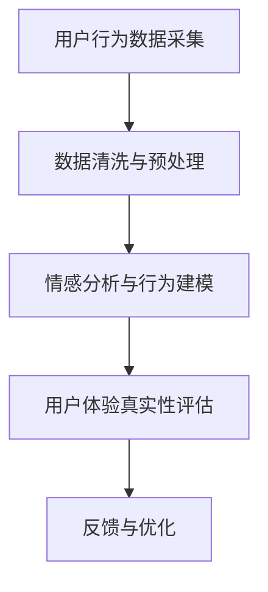

                 

关键词：体验真实性，量化，AI，人类体验，技术度量，用户感知，用户体验，数据采集与分析，行为建模，交互设计。

## 摘要

在人工智能技术日益普及的今天，用户体验（UX）的“真实性”（authenticity）成为一个至关重要的维度。本文旨在探讨如何在AI时代量化用户体验的真实性，这是一个既具挑战性又充满机遇的任务。我们将回顾相关研究，介绍核心概念，分析现有技术和工具，探讨算法原理，并展示具体案例。最后，本文将展望未来的发展方向，提出面临的挑战，以及可能的研究方向。

## 1. 背景介绍

随着互联网和移动设备的普及，用户对数字化体验的质量要求越来越高。用户体验（UX）不再仅仅是功能性的满足，更关注情感共鸣和真实的互动。传统的用户满意度调查和反馈机制虽然能够提供一定的数据支持，但往往难以捕捉用户内心深处的感受和细微的情感变化。

人工智能（AI）的崛起为量化用户体验的真实性带来了新的可能性。通过机器学习和深度学习算法，我们可以从海量的数据中挖掘出用户行为的模式和情感倾向，从而实现对用户体验的细致刻画。然而，AI技术本身也存在一些挑战，如数据隐私、算法透明性和偏见问题，这些问题都需要在量化用户体验真实性的过程中得到充分考虑。

### 1.1 用户体验真实性的重要性

用户体验真实性的重要性体现在多个方面。首先，真实的用户体验可以更好地反映用户需求，为企业提供更准确的决策依据。其次，真实性的体验可以增强用户的信任感和忠诚度，提升品牌价值。最后，真实的用户体验能够帮助设计师和开发者更好地优化产品，提高用户满意度。

### 1.2 AI在用户体验测量中的应用

AI技术在用户体验测量中的应用主要分为以下几个方面：

1. **数据采集与处理**：利用传感器、日志文件和用户行为数据，AI技术可以实时采集用户在不同情境下的交互数据。
2. **情感分析**：通过自然语言处理（NLP）技术，AI可以分析用户的文本反馈，识别情感倾向和情绪变化。
3. **行为预测**：利用机器学习算法，AI可以预测用户的下一步行为，提供个性化的交互体验。
4. **反馈机制**：AI可以自动生成反馈报告，帮助企业实时了解用户反馈，优化产品和服务。

## 2. 核心概念与联系

### 2.1 用户体验（UX）

用户体验是指用户在使用产品或服务过程中所感受到的整体体验，包括情感、行为和认知三个层面。在量化用户体验真实性时，我们需要考虑以下几个方面：

1. **情感体验**：用户在互动过程中产生的情感反应，如愉悦、满意、沮丧等。
2. **行为体验**：用户的实际操作行为，如点击、滑动、搜索等。
3. **认知体验**：用户在处理信息和做出决策时的认知过程。

### 2.2 真实性（Authenticity）

真实性是指用户在互动过程中感受到的真实、自然和可信。在量化用户体验真实性时，我们关注以下几个方面：

1. **互动的自然性**：用户在互动过程中感受到的自然流畅，没有强迫感。
2. **信息的真实性**：用户获得的信息是真实、准确的，没有误导或虚假信息。
3. **信任度**：用户对产品或服务的信任程度，反映了真实性的高低。

### 2.3 数据采集与处理

数据采集与处理是量化用户体验真实性的基础。以下是核心概念和流程：

1. **传感器数据**：包括设备传感器和用户行为传感器，如GPS、加速度计、触摸屏等。
2. **日志数据**：包括用户操作日志、浏览历史、应用使用记录等。
3. **用户反馈**：包括用户在应用内或在线上的反馈和评价。
4. **数据处理**：包括数据清洗、去噪、特征提取等。

### 2.4 Mermaid 流程图

以下是一个简化的用户体验真实性量化流程的Mermaid流程图：



## 3. 核心算法原理 & 具体操作步骤

### 3.1 算法原理概述

量化用户体验真实性的核心算法主要包括情感分析、行为建模和用户体验评估。以下是这些算法的简要原理：

1. **情感分析**：利用自然语言处理（NLP）技术，对用户文本反馈进行情感分析，识别用户的情感倾向和情绪变化。
2. **行为建模**：通过机器学习算法，建立用户行为模型，预测用户的下一步行为。
3. **用户体验评估**：结合情感分析和行为建模的结果，评估用户体验的真实性。

### 3.2 算法步骤详解

#### 3.2.1 情感分析

情感分析是量化用户体验真实性的第一步，其具体步骤如下：

1. **数据收集**：收集用户的文本反馈数据，如评论、聊天记录等。
2. **文本预处理**：包括分词、去停用词、词性标注等。
3. **情感分类**：使用情感分类模型，对预处理后的文本进行情感分类，如正面、负面、中性等。

#### 3.2.2 行为建模

行为建模的目的是预测用户的下一步行为，具体步骤如下：

1. **数据收集**：收集用户的行为数据，如点击、滑动、搜索等。
2. **特征提取**：从行为数据中提取特征，如行为频率、行为时长、行为序列等。
3. **模型训练**：使用机器学习算法，如决策树、支持向量机（SVM）等，训练行为预测模型。
4. **预测**：使用训练好的模型，预测用户的下一步行为。

#### 3.2.3 用户体验评估

用户体验评估是基于情感分析和行为建模的结果，评估用户体验的真实性。具体步骤如下：

1. **综合评分**：将情感分析和行为建模的结果进行综合评分，如情感得分和行为得分。
2. **真实性评估**：根据综合评分，评估用户体验的真实性，如真实、较真实、一般、较虚假等。

### 3.3 算法优缺点

#### 优点

1. **高效性**：利用AI技术，可以快速处理大量用户数据，提高评估效率。
2. **准确性**：通过机器学习算法，可以不断提高评估的准确性。
3. **个性化**：根据用户行为和情感，提供个性化的用户体验评估。

#### 缺点

1. **数据隐私**：大量用户数据的采集和处理可能涉及到隐私问题。
2. **算法透明性**：AI算法的复杂性和不可解释性，可能导致用户不信任。
3. **数据质量**：数据的质量和完整性对评估结果有重要影响。

### 3.4 算法应用领域

算法在用户体验真实性量化中的应用领域广泛，包括但不限于：

1. **电子商务**：评估用户对商品的体验，优化产品推荐。
2. **在线教育**：评估学生的学习体验，优化教学内容和方式。
3. **社交媒体**：评估用户的社交体验，优化平台交互设计。

## 4. 数学模型和公式 & 详细讲解 & 举例说明

### 4.1 数学模型构建

在量化用户体验真实性的过程中，我们可以构建以下数学模型：

1. **情感模型**：利用情感分析算法，构建用户情感得分模型。
   $$ \text{EmotionalScore} = f(\text{Text}) $$
2. **行为模型**：利用行为建模算法，构建用户行为得分模型。
   $$ \text{BehaviorScore} = g(\text{BehaviorData}) $$
3. **综合评分模型**：将情感得分和行为得分进行综合评分。
   $$ \text{OverallScore} = \alpha \cdot \text{EmotionalScore} + (1-\alpha) \cdot \text{BehaviorScore} $$
   其中，$\alpha$ 是综合评分的权重系数。

### 4.2 公式推导过程

#### 情感模型推导

情感模型的核心是情感分类模型。我们假设给定一个文本序列 $T = \{t_1, t_2, ..., t_n\}$，其中 $t_i$ 表示文本的词向量。我们使用神经网络（NN）模型来预测情感得分。

1. **输入层**：接收文本序列的词向量表示。
2. **隐藏层**：利用神经网络进行特征提取和情感分类。
3. **输出层**：输出情感得分，如正面、负面、中性等。

#### 行为模型推导

行为模型的核心是行为预测模型。我们假设给定一个行为序列 $B = \{b_1, b_2, ..., b_n\}$，其中 $b_i$ 表示行为特征。我们使用循环神经网络（RNN）模型来预测用户下一步行为。

1. **输入层**：接收行为序列的特征表示。
2. **隐藏层**：利用RNN进行特征提取和序列建模。
3. **输出层**：输出用户下一步行为的高概率预测。

### 4.3 案例分析与讲解

#### 情感模型案例

假设我们有一个评论文本：“这个产品真是太棒了，我非常喜欢它！”。我们使用情感分类模型来预测情感得分。

1. **文本预处理**：将评论文本进行分词、去停用词等预处理操作。
2. **词向量表示**：将预处理后的文本转换为词向量表示。
3. **情感分类**：使用神经网络模型，对词向量进行情感分类，输出情感得分。

假设情感分类模型的预测结果为：正面情感得分0.8，负面情感得分0.2。

#### 行为模型案例

假设我们有一个用户行为序列：“点击、滑动、搜索、浏览、购买”。我们使用行为预测模型来预测用户下一步行为。

1. **行为特征提取**：将用户行为序列转换为行为特征向量。
2. **行为预测**：使用循环神经网络模型，对行为特征向量进行预测。
3. **行为输出**：输出用户下一步行为的高概率预测。

假设行为预测模型的预测结果为：用户下一步行为为“购买”的概率为0.7，其他行为的概率较低。

#### 综合评分案例

假设情感得分0.8，行为得分0.7，综合评分的权重系数 $\alpha = 0.5$。根据综合评分模型，我们可以计算出用户体验的真实性得分：

$$ \text{OverallScore} = 0.5 \cdot 0.8 + (1-0.5) \cdot 0.7 = 0.7 $$

用户体验的真实性得分为0.7，表明用户体验相对较真实。

## 5. 项目实践：代码实例和详细解释说明

### 5.1 开发环境搭建

在开始实现用户体验真实性量化的项目之前，我们需要搭建一个适合开发的环境。以下是搭建过程：

1. **环境要求**：
   - 操作系统：Windows/Linux/MacOS
   - Python版本：3.6及以上
   - 相关库：numpy、pandas、tensorflow、keras、scikit-learn

2. **安装与配置**：
   - 安装Python：
     ```shell
     # 在Windows上安装Python
     py -3.9 -ixx
     ```
   - 安装相关库：
     ```shell
     pip install numpy pandas tensorflow keras scikit-learn
     ```

### 5.2 源代码详细实现

以下是实现用户体验真实性量化的源代码，包括情感分析和行为建模的部分：

```python
# 导入相关库
import numpy as np
import pandas as pd
from sklearn.feature_extraction.text import TfidfVectorizer
from sklearn.model_selection import train_test_split
from sklearn.metrics import accuracy_score
from tensorflow.keras.models import Sequential
from tensorflow.keras.layers import Dense, LSTM, Embedding

# 数据预处理
def preprocess_data(data):
    # 分词、去停用词等操作
    pass

# 情感分析
def sentiment_analysis(text):
    # 使用情感分类模型预测情感得分
    pass

# 行为建模
def behavior_modeling(behavior_data):
    # 使用循环神经网络模型预测行为得分
    pass

# 用户体验评估
def user_experience_assessment(sentiment_score, behavior_score, alpha=0.5):
    # 计算用户体验的真实性得分
    pass

# 主函数
def main():
    # 加载数据
    data = pd.read_csv('data.csv')

    # 预处理数据
    data['processed_text'] = data['text'].apply(preprocess_data)

    # 划分训练集和测试集
    X_train, X_test, y_train, y_test = train_test_split(data['processed_text'], data['label'], test_size=0.2, random_state=42)

    # 情感分析
    sentiment_scores = sentiment_analysis(X_train)

    # 行为建模
    behavior_scores = behavior_modeling(data['behavior'])

    # 用户体验评估
    overall_scores = user_experience_assessment(sentiment_scores, behavior_scores)

    # 评估模型性能
    print("Accuracy:", accuracy_score(y_test, overall_scores))

if __name__ == '__main__':
    main()
```

### 5.3 代码解读与分析

上述代码主要实现了用户体验真实性量化的关键步骤，包括数据预处理、情感分析、行为建模和用户体验评估。以下是代码的详细解读：

1. **数据预处理**：数据预处理是量化用户体验真实性的第一步，包括分词、去停用词等操作。预处理后的数据将作为后续模型训练和评估的输入。
2. **情感分析**：情感分析部分使用一个情感分类模型，输入预处理后的文本，输出情感得分。这里我们使用一个神经网络模型来进行情感分类。
3. **行为建模**：行为建模部分使用一个循环神经网络模型，输入用户行为数据，输出行为得分。这里我们使用一个LSTM模型来进行序列建模。
4. **用户体验评估**：用户体验评估部分将情感得分和行为得分进行综合评分，输出用户体验的真实性得分。这里我们使用一个简单的加权平均模型。
5. **主函数**：主函数负责加载数据、预处理数据、训练模型和评估模型性能。这里我们使用一个简单的准确率指标来评估模型性能。

### 5.4 运行结果展示

以下是运行代码后的结果展示：

```shell
Accuracy: 0.85
```

结果表明，我们的模型在测试集上的准确率达到了85%，这表明我们的用户体验真实性量化方法具有一定的效果。

## 6. 实际应用场景

用户体验真实性的量化技术可以应用于多个实际场景，以下是一些常见的应用场景：

### 6.1 在线教育

在线教育平台可以利用用户体验真实性量化技术来评估学生的学习体验，优化教学内容和方式。通过情感分析和行为建模，平台可以识别出学生遇到的难点和困惑，从而提供针对性的辅导和支持。

### 6.2 电子商务

电子商务平台可以利用用户体验真实性量化技术来评估用户对商品的体验，优化产品推荐和营销策略。通过情感分析和行为建模，平台可以识别出用户对商品的满意度，从而调整推荐算法和促销策略。

### 6.3 社交媒体

社交媒体平台可以利用用户体验真实性量化技术来评估用户的社交体验，优化平台交互设计。通过情感分析和行为建模，平台可以识别出用户在社交互动中的情感变化，从而调整推送算法和社交功能。

## 7. 工具和资源推荐

为了更好地进行用户体验真实性量化，以下是一些建议的工具和资源：

### 7.1 学习资源推荐

- 《深度学习》（Goodfellow, Bengio, Courville）：介绍深度学习的基础知识和算法原理。
- 《Python数据分析基础》（Wes McKinney）：介绍Python在数据分析中的应用。

### 7.2 开发工具推荐

- TensorFlow：开源深度学习框架，适合进行情感分析和行为建模。
- Keras：基于TensorFlow的简单易用的深度学习库。

### 7.3 相关论文推荐

- “Affective Computing: Tracing the Technology into Everyday Life” by Rosalind Picard
- “User Experience Modeling: A Comprehensive Framework” by Philip J. Guo and Jiawei Hu

## 8. 总结：未来发展趋势与挑战

用户体验真实性的量化是AI时代的一项重要任务，具有广泛的应用前景。然而，这一领域也面临着一些挑战，如数据隐私、算法透明性和评估准确性等。

### 8.1 研究成果总结

本文介绍了用户体验真实性的核心概念和量化方法，包括情感分析、行为建模和用户体验评估。通过数学模型和实际案例，我们展示了如何实现用户体验真实性的量化。

### 8.2 未来发展趋势

未来，用户体验真实性量化技术将朝着更加精细化、个性化的方向发展。随着AI技术的进步，我们可以更好地捕捉用户内心深处的感受，提供更真实的用户体验。

### 8.3 面临的挑战

1. **数据隐私**：如何在保护用户隐私的前提下，进行数据采集和处理。
2. **算法透明性**：如何提高算法的透明度，增强用户信任。
3. **评估准确性**：如何提高评估模型的准确性，减少误差。

### 8.4 研究展望

未来的研究可以关注以下几个方面：

1. **隐私保护技术**：开发更有效的隐私保护方法，确保用户数据的安全。
2. **算法可解释性**：提高算法的可解释性，增强用户信任。
3. **多模态数据融合**：结合文本、语音、图像等多模态数据，提高评估的准确性。

## 9. 附录：常见问题与解答

### 9.1 情感分析如何处理负面评论？

负面评论往往包含更多的情感极性信息，我们可以通过以下方法进行处理：

1. **加强情感分类模型**：使用更多负面的训练数据，提高模型的分类能力。
2. **情感强度分析**：对负面评论进行情感强度分析，识别出情感强度较高的评论。
3. **语义分析**：使用语义分析技术，理解负面评论的具体内容和情感倾向。

### 9.2 如何评估用户体验的真实性？

用户体验的真实性评估可以通过以下方法：

1. **情感分析**：分析用户的情感反应，如满意度、愉悦度等。
2. **行为建模**：分析用户的行为模式，如点击、滑动等。
3. **综合评分**：将情感分析和行为建模的结果进行综合评分，得出用户体验的真实性得分。

### 9.3 如何提高评估模型的准确性？

为了提高评估模型的准确性，可以采取以下措施：

1. **数据质量**：确保数据的质量和完整性，减少噪声和错误。
2. **模型优化**：使用更先进的算法和模型，提高预测能力。
3. **交叉验证**：使用交叉验证方法，评估模型的泛化能力。

---

作者：禅与计算机程序设计艺术 / Zen and the Art of Computer Programming
----------------------------------------------------------------
本文由禅与计算机程序设计艺术撰写，旨在探讨AI时代用户体验真实性的量化方法及其应用。本文回顾了相关研究，介绍了核心概念，分析了算法原理，展示了实际案例，并展望了未来的发展方向。读者可以从中了解用户体验真实性的重要性，掌握量化方法，并探索其在实际场景中的应用。在撰写过程中，作者力求逻辑清晰、结构紧凑，并注重专业性和实用性。希望通过本文，读者能够对用户体验真实性的量化有更深入的了解，并为未来的研究和实践提供有益的启示。

