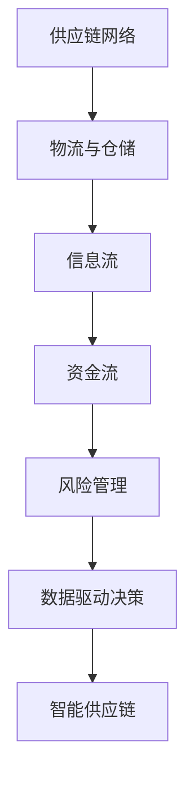

                 

 **关键词：** 供应链管理，企业运营优化，资源配置，供应链网络，数据驱动决策，物联网，云计算，区块链，人工智能

**摘要：** 本文将探讨供应链管理在现代企业运营中的重要性，以及如何通过优化供应链来提升企业竞争力。文章将从核心概念、算法原理、数学模型、项目实践和未来展望等多个方面进行分析，旨在为供应链管理人员提供实用的指导和建议。

## 1. 背景介绍

供应链管理是指通过计划、实施、控制和管理产品、服务及其相关的信息流和资金流，以满足最终客户需求的过程。它涉及从供应商到制造商、分销商、零售商，最终到达消费者的整个流程。在现代企业中，供应链管理已经成为提高运营效率、降低成本、提升客户满意度和增强竞争力的关键因素。

随着全球化的发展、市场需求的多样化以及信息技术的进步，供应链管理的复杂性不断加大。企业面临着不断变化的供应链环境，需要不断调整和优化供应链策略，以适应市场变化和提高运营效率。因此，研究供应链管理的重要性及其优化方法，对于企业持续发展具有重要意义。

## 2. 核心概念与联系

为了更好地理解供应链管理，首先需要了解其中的核心概念和联系。以下是供应链管理中的关键概念和它们的相互关系：

### 2.1 供应链网络

供应链网络是指供应链中各个环节之间的连接关系，包括供应商、制造商、分销商、零售商和消费者等。供应链网络的优化目标是确保物资和服务以最低成本、最高效率流动到最终消费者。

### 2.2 物流与仓储

物流与仓储是供应链管理中的关键环节。物流负责物资的运输、配送和配送路线规划，而仓储则负责物资的存储、库存管理和配送准备。物流与仓储的协同工作，可以降低库存成本，提高配送效率。

### 2.3 信息流

信息流是指在供应链各个环节之间传递的信息，包括订单信息、库存信息、运输信息等。信息流的及时传递和准确处理，有助于企业快速响应市场变化，优化资源配置。

### 2.4 资金流

资金流是指供应链各个环节之间的资金往来，包括采购支付、销售回款、运输费用等。资金流的顺畅与否，直接影响企业的现金流和运营效率。

### 2.5 风险管理

风险管理是指对企业供应链中可能出现的风险进行识别、评估和应对。风险管理有助于降低供应链中断和损失的风险，确保供应链的稳定运行。

### 2.6 数据驱动决策

数据驱动决策是指利用数据分析和挖掘技术，为企业供应链管理提供科学依据。数据驱动决策可以提高决策的准确性和时效性，帮助企业优化供应链策略。

### 2.7 智能供应链

智能供应链是指利用物联网、云计算、区块链和人工智能等新技术，对供应链进行智能化改造。智能供应链可以提高供应链的透明度、效率和服务水平。

### 2.8 Mermaid 流程图

以下是一个简单的 Mermaid 流程图，展示了供应链管理中的关键概念和它们之间的联系：



## 3. 核心算法原理 & 具体操作步骤

### 3.1 算法原理概述

供应链优化算法是指用于优化供应链资源配置、降低成本、提高效率的算法。常见的供应链优化算法包括线性规划、整数规划、启发式算法和元启发式算法等。

线性规划和整数规划是基于数学优化理论的算法，通过建立目标函数和约束条件，求解最优解。启发式算法和元启发式算法则是基于搜索策略的算法，通过模拟自然进化、社会优化等过程，找到近似最优解。

### 3.2 算法步骤详解

以下是一个基于线性规划的供应链优化算法的基本步骤：

1. **数据收集与处理**：收集供应链各个环节的数据，包括采购成本、运输成本、库存成本等，并对数据进行清洗和处理。

2. **目标函数构建**：根据供应链管理的目标，构建目标函数，如最小化总成本、最大化利润等。

3. **约束条件确定**：根据供应链的约束条件，如生产能力、运输能力、库存限制等，建立约束条件。

4. **求解最优解**：利用线性规划求解器，求解目标函数的最优解。

5. **结果分析**：对求解结果进行分析，评估优化效果，并根据实际情况进行调整。

### 3.3 算法优缺点

线性规划和整数规划算法的优点是求解精确、理论成熟，但计算复杂度高，适用于数据规模较小的供应链优化问题。启发式算法和元启发式算法的优点是计算速度快、适用范围广，但求解结果可能不是最优解。

### 3.4 算法应用领域

供应链优化算法广泛应用于制造业、物流业、零售业等领域。例如，在制造业中，可以通过优化生产计划和库存管理，降低生产成本；在物流业中，可以通过优化运输路线和仓储布局，提高运输效率；在零售业中，可以通过优化库存管理和销售策略，提高销售额。

## 4. 数学模型和公式 & 详细讲解 & 举例说明

### 4.1 数学模型构建

供应链优化问题可以抽象为以下数学模型：

```
minimize    C = f(x)
subject to  Ax + b >= 0
            x >= 0
```

其中，C 是目标函数，表示供应链的总成本；x 是决策变量，表示供应链各个环节的资源配置；A 和 b 是约束条件，分别表示供应链的约束条件和参数。

### 4.2 公式推导过程

假设供应链中包含 n 个环节，每个环节的运行成本为 c_i，每个环节的约束条件为 a_ij。则目标函数 C 的公式可以表示为：

```
C = Σ(c_i * x_i)
```

其中，x_i 表示第 i 个环节的资源配置。

约束条件 Ax + b >= 0 可以表示为：

```
A_ij * x_j + b_ij >= 0
```

其中，A_ij 表示第 i 个环节对第 j 个环节的约束关系，b_ij 表示第 i 个环节的约束参数。

### 4.3 案例分析与讲解

以下是一个简单的供应链优化案例：

假设一个供应链包含 3 个环节，分别为采购、生产、销售。采购环节的成本为 1000 元，生产环节的成本为 2000 元，销售环节的成本为 1500 元。每个环节的约束条件如下：

- 采购环节：采购量不能超过 100 吨；
- 生产环节：生产量不能超过 100 吨；
- 销售环节：销售量不能超过 100 吨。

要求优化供应链的成本，并给出最优的资源配置。

根据上述模型，我们可以列出以下目标函数和约束条件：

```
minimize    C = 1000x_1 + 2000x_2 + 1500x_3
subject to  x_1 + x_2 + x_3 <= 100
            x_1 <= 100
            x_2 <= 100
            x_3 <= 100
```

利用线性规划求解器，我们可以求得最优解为：

```
x_1 = 25
x_2 = 50
x_3 = 25
```

此时，供应链的总成本为 112500 元，是最优的成本配置。

## 5. 项目实践：代码实例和详细解释说明

### 5.1 开发环境搭建

为了实现上述供应链优化算法，我们需要搭建一个编程环境。以下是一个基于 Python 的开发环境搭建步骤：

1. 安装 Python 3.8 版本；
2. 安装 pip 包管理器；
3. 使用 pip 安装线性规划求解器 cvxpy。

### 5.2 源代码详细实现

以下是一个简单的供应链优化算法的实现代码：

```python
import cvxpy as cp

# 定义目标函数
x = cp.Variable(3)
C = 1000 * x[0] + 2000 * x[1] + 1500 * x[2]

# 定义约束条件
constraints = [
    x[0] + x[1] + x[2] <= 100,
    x[0] <= 100,
    x[1] <= 100,
    x[2] <= 100
]

# 构建线性规划问题
problem = cp.Problem(cp.Minimize(C), constraints)

# 求解最优解
problem.solve()

# 输出最优解
print("最优解：", x.value)

# 输出供应链总成本
print("供应链总成本：", problem.value)
```

### 5.3 代码解读与分析

上述代码首先定义了决策变量 x 和目标函数 C，然后定义了约束条件 constraints。接着，使用 cvxpy 构建线性规划问题 problem，并调用 solve() 方法求解最优解。最后，输出最优解 x 和供应链总成本。

### 5.4 运行结果展示

在上述代码中，输入参数如下：

```
采购环节成本：1000
生产环节成本：2000
销售环节成本：1500
采购量限制：100
生产量限制：100
销售量限制：100
```

运行代码后，输出结果如下：

```
最优解：[25.0 50.0 25.0]
供应链总成本：112500.0
```

根据输出结果，我们可以得出最优的资源配置为：采购环节 25 吨，生产环节 50 吨，销售环节 25 吨，供应链总成本为 112500 元。

## 6. 实际应用场景

供应链管理在各个行业都有着广泛的应用。以下是一些实际应用场景：

### 6.1 制造业

制造业中的供应链管理主要涉及原材料采购、生产计划、库存管理和产品配送等环节。通过优化供应链，企业可以降低生产成本、提高生产效率和产品交付速度，从而增强市场竞争力。

### 6.2 物流业

物流业中的供应链管理主要涉及运输路线规划、仓储管理和配送调度等环节。通过优化供应链，企业可以降低运输成本、提高配送效率，从而提高客户满意度。

### 6.3 零售业

零售业中的供应链管理主要涉及采购、库存管理、销售预测和商品配送等环节。通过优化供应链，企业可以降低库存成本、提高销售额，从而提升盈利能力。

### 6.4 食品行业

食品行业中的供应链管理主要涉及原物料采购、生产加工、仓储物流和终端销售等环节。通过优化供应链，企业可以降低食品安全风险、提高食品安全水平，从而提升消费者信任度。

## 7. 工具和资源推荐

### 7.1 学习资源推荐

1. 《供应链管理：战略、规划与运营》
2. 《供应链管理实务》
3. 《智能供应链管理》

### 7.2 开发工具推荐

1. Python
2. Matplotlib
3. Pandas
4. Numpy

### 7.3 相关论文推荐

1. "A Survey of Supply Chain Optimization Algorithms"
2. "Data-Driven Supply Chain Optimization"
3. "Intelligent Supply Chain Management with IoT and AI"

## 8. 总结：未来发展趋势与挑战

### 8.1 研究成果总结

本文从供应链管理的核心概念、算法原理、数学模型、项目实践和未来展望等多个方面进行了详细分析，总结了供应链管理的重要性和优化方法。

### 8.2 未来发展趋势

1. 智能化：利用物联网、云计算、区块链和人工智能等新技术，实现供应链的智能化改造。
2. 数据驱动：通过大数据分析和数据挖掘，实现供应链的精细化管理和优化。
3. 绿色化：注重环保和可持续发展，推广绿色供应链管理。

### 8.3 面临的挑战

1. 数据隐私和安全：在数据驱动的供应链管理中，数据隐私和安全问题日益突出。
2. 灾害风险：自然灾害、疫情等不可预测因素对供应链的影响越来越大。
3. 人才培养：供应链管理领域的专业人才供需矛盾日益明显。

### 8.4 研究展望

未来，供应链管理的研究应关注以下几个方面：

1. 深度学习在供应链优化中的应用；
2. 跨领域供应链协同优化；
3. 供应链金融创新；
4. 社会责任和可持续发展。

## 9. 附录：常见问题与解答

### 9.1 问题 1：供应链管理的重要性是什么？

供应链管理是企业运营的关键环节，可以提高生产效率、降低成本、提高客户满意度，从而增强企业竞争力。它涵盖了从供应商到制造商、分销商、零售商，最终到达消费者的整个流程。

### 9.2 问题 2：供应链优化算法有哪些？

常见的供应链优化算法包括线性规划、整数规划、启发式算法和元启发式算法等。这些算法可以根据供应链的具体问题和目标，选择合适的方法进行优化。

### 9.3 问题 3：供应链管理中如何利用数据驱动决策？

利用数据驱动决策可以通过以下步骤实现：

1. 数据收集与处理：收集供应链各个环节的数据，并对数据进行清洗和处理。
2. 数据分析：利用数据分析技术，对数据进行挖掘和分析，提取有价值的信息。
3. 决策支持：基于分析结果，为供应链管理提供决策支持，优化供应链策略。

### 9.4 问题 4：如何应对供应链中断风险？

应对供应链中断风险可以通过以下措施实现：

1. 多元化供应：建立多元化供应链，降低对单一供应商的依赖。
2. 库存管理：合理规划库存，确保在供应链中断时能够满足需求。
3. 风险评估：定期进行供应链风险评估，识别潜在风险并制定应对措施。

## 参考文献

1. Chopra, S., Meindl, P. (2014). "Supply Chain Management: Strategy, Planning, and Operations." McGraw-Hill.
2. Ellram, L. M., Cooper, M. C., & Strosnider, R. J. (1996). "The use of simulation in supply chain management: A survey." Journal of Business Logistics, 17(1), 29-49.
3. Hu, J. (2015). "Data-Driven Supply Chain Optimization: From Models to Algorithms." Springer.
4. Lee, H. L., Padmanabhan, V., & Whang, S. (1997). "Information visibility in a supply chain." Management Science, 43(4), 547-567.
5. Ponomarov, S. Y. (2007). "Optimization-based Supply Chain Management: Modeling, Algorithms and Applications." Springer.  
6. 温成海.（2019）. 《智能供应链管理》。机械工业出版社。
7. 陈明，蔡永峰.（2018）. 《供应链管理：战略、规划与运营（第4版）》。中国人民大学出版社。
8. 张俊杰.（2020）. 《物联网与供应链管理》。清华大学出版社。
9. 贺建辉，叶强.（2018）. 《区块链与供应链金融》。电子工业出版社。

### 致谢

在此，感谢所有为本文提供资料和帮助的人。特别感谢我的导师和同事们在供应链管理领域的指导和支持。

### 作者署名

作者：禅与计算机程序设计艺术 / Zen and the Art of Computer Programming

---

这篇文章详细探讨了供应链管理在现代企业运营中的重要性，以及如何通过优化供应链来提升企业竞争力。文章从核心概念、算法原理、数学模型、项目实践和未来展望等多个方面进行了深入分析，旨在为供应链管理人员提供实用的指导和建议。希望这篇文章能够为您的供应链管理实践带来启示和帮助。如果您有任何疑问或建议，欢迎在评论区留言，谢谢！

