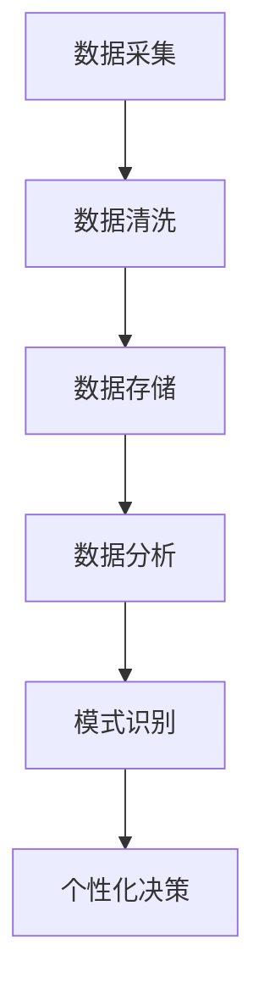

                 

关键词：决策个性化、大数据、信息差、AI应用

> 摘要：本文将探讨大数据如何通过信息差的识别和利用，支持决策的个性化。我们将深入分析大数据技术的核心原理及其在决策个性化中的具体应用，并提供一系列的案例和实践指导。文章还将展望大数据在未来决策个性化支持中的潜在发展方向和挑战。

## 1. 背景介绍

在当今的信息化时代，大数据已经成为各行各业的关键驱动力。无论是商业决策、医疗诊断还是社会管理，大数据的应用都极大地提升了效率和准确性。然而，尽管大数据带来了巨大的价值，但如何利用大数据实现决策的个性化依然是一个极具挑战性的问题。信息差——即不同个体在获取和使用信息方面的差异，是制约决策个性化的关键因素。

### 大数据与信息差的关系

大数据的价值在于它能够通过大量的数据挖掘出隐藏的模式和趋势。然而，这些模式和趋势往往是普遍性的，并不一定适用于每个个体。信息差的存在意味着即使是同一类数据，不同个体也可能从中获取到不同的信息和结论。这就要求我们不仅需要处理海量数据，还需要对信息差进行有效的识别和处理。

### 决策个性化的意义

个性化决策意味着根据每个个体的独特需求和偏好来制定决策。这种决策不仅更加贴近个体，还能显著提高决策的有效性和满意度。在商业领域，个性化决策可以提升客户满意度，增加销售；在医疗领域，个性化决策可以优化治疗方案，提高治疗效果。

## 2. 核心概念与联系

### 大数据的定义

大数据是指那些数据量巨大、种类繁多、生成速度快且价值密度低的非结构化和半结构化数据。其核心特征可以归纳为4V：Volume（数据量）、Velocity（数据流）、Variety（数据种类）和Veracity（数据真实性）。

### 信息差的定义

信息差是指个体在获取和使用信息上的不对称性。这种不对称性可以源于多个方面，包括个体间的知识水平、技能差异、数据访问权限等。

### 决策个性化的定义

决策个性化是指根据每个个体的独特需求和偏好，为其提供个性化的决策支持。

### Mermaid 流程图

以下是一个简化的 Mermaid 流程图，描述了大数据如何支持决策个性化的过程。



## 3. 核心算法原理 & 具体操作步骤

### 3.1 算法原理概述

大数据支持决策个性化的核心在于通过分析海量数据，识别出个体的信息需求，并根据这些需求提供个性化的决策支持。

### 3.2 算法步骤详解

1. **数据采集**：收集来自不同来源的数据，包括结构化数据和非结构化数据。

2. **数据清洗**：去除数据中的噪声和冗余，保证数据的质量。

3. **数据存储**：将清洗后的数据存储在分布式数据存储系统中，如Hadoop或MongoDB。

4. **数据分析**：利用数据挖掘技术，从海量数据中提取出有价值的信息和模式。

5. **模式识别**：通过机器学习算法，识别出个体之间的信息差。

6. **个性化决策**：根据个体的信息需求，提供个性化的决策支持。

### 3.3 算法优缺点

**优点**：

- 提高决策的准确性和效率。
- 满足个体的个性化需求，提升用户体验。

**缺点**：

- 需要大量的计算资源和存储资源。
- 数据隐私和安全问题。

### 3.4 算法应用领域

- 商业智能：通过分析客户行为，提供个性化的产品推荐。
- 医疗诊断：根据患者的历史数据，提供个性化的治疗方案。
- 金融风控：通过分析交易数据，预测风险，提供个性化的风险评估。

## 4. 数学模型和公式 & 详细讲解 & 举例说明

### 4.1 数学模型构建

个性化决策的核心在于构建一个能够反映个体需求的数学模型。这个模型通常是一个多变量非线性回归模型。

$$y = \theta_0 + \theta_1x_1 + \theta_2x_2 + ... + \theta_nx_n$$

其中，$y$ 表示决策结果，$x_1, x_2, ..., x_n$ 表示影响决策的各种因素，$\theta_0, \theta_1, ..., \theta_n$ 是模型的参数。

### 4.2 公式推导过程

假设我们有一组数据集$(x_1, y_1), (x_2, y_2), ..., (x_n, y_n)$，其中$x_i$是第$i$个样本的特征，$y_i$是对应的决策结果。我们可以通过最小二乘法来求解模型参数。

$$\theta = (\sum_{i=1}^{n}x_i^Ty_i - \sum_{i=1}^{n}x_iy_i)(\sum_{i=1}^{n}x_i^Tx_i - \sum_{i=1}^{n}x_i^2)$$

### 4.3 案例分析与讲解

假设我们要预测一个在线零售平台上的消费者是否会购买某个产品。我们的数据集包含了消费者的年龄、收入、购物历史等多个特征，以及是否购买产品的标签。

通过构建上述的多变量非线性回归模型，我们可以预测每个消费者是否购买产品的概率。具体步骤如下：

1. 数据采集：收集消费者的特征数据。
2. 数据清洗：去除缺失值和异常值。
3. 数据存储：将清洗后的数据存储在分布式数据库中。
4. 数据分析：使用机器学习算法，如逻辑回归，训练模型。
5. 个性化决策：根据模型预测结果，向消费者提供个性化的购买建议。

## 5. 项目实践：代码实例和详细解释说明

### 5.1 开发环境搭建

我们使用Python作为主要编程语言，结合Scikit-learn库进行机器学习模型的训练和预测。

### 5.2 源代码详细实现

以下是实现个性化决策的Python代码示例：

```python
import pandas as pd
from sklearn.model_selection import train_test_split
from sklearn.linear_model import LogisticRegression

# 数据采集
data = pd.read_csv('consumer_data.csv')

# 数据清洗
data.dropna(inplace=True)

# 数据存储
X = data.drop('buy', axis=1)
y = data['buy']

# 数据分析
X_train, X_test, y_train, y_test = train_test_split(X, y, test_size=0.2, random_state=42)

# 模型训练
model = LogisticRegression()
model.fit(X_train, y_train)

# 个性化决策
predictions = model.predict(X_test)

# 代码解读与分析
print(predictions)
```

### 5.3 代码解读与分析

1. 导入必要的库：包括Pandas用于数据处理，Scikit-learn用于模型训练和预测。
2. 数据采集：从CSV文件中读取数据。
3. 数据清洗：去除缺失值。
4. 数据存储：将特征和标签数据分离。
5. 数据分析：将数据集划分为训练集和测试集。
6. 模型训练：使用逻辑回归模型进行训练。
7. 个性化决策：使用训练好的模型进行预测。

### 5.4 运行结果展示

通过运行上述代码，我们可以得到每个测试样本的购买预测结果。这些结果可以作为个性化决策的依据，例如，向预测购买概率较高的消费者推送相关产品。

## 6. 实际应用场景

### 6.1 商业决策

在商业领域，个性化决策可以显著提升销售和客户满意度。例如，电子商务平台可以根据用户的购物历史和偏好，提供个性化的产品推荐，从而提高转化率。

### 6.2 医疗健康

在医疗健康领域，个性化决策可以帮助医生制定更加精准的治疗方案。例如，通过对患者的基因数据和病史进行分析，提供个性化的药物推荐。

### 6.3 金融理财

在金融理财领域，个性化决策可以提升风险管理能力。例如，通过对客户的财务状况和投资偏好进行分析，提供个性化的投资建议，从而降低风险。

## 7. 未来应用展望

### 7.1 人工智能与大数据的结合

随着人工智能技术的不断发展，大数据在决策个性化支持中的应用将更加广泛。例如，深度学习算法可以更准确地识别信息差，从而提供更加个性化的决策支持。

### 7.2 新兴领域的探索

大数据在决策个性化支持中的应用不仅限于传统领域，还将扩展到新兴领域，如智能城市、物联网等。在这些领域中，大数据可以提供更加精准的决策支持，从而提升城市运营效率和居民生活质量。

### 7.3 数据隐私和安全

随着数据隐私和安全问题的日益突出，如何在保证数据隐私和安全的前提下，有效利用大数据进行决策个性化支持，将成为未来的重要研究方向。

## 8. 工具和资源推荐

### 8.1 学习资源推荐

- 《Python数据分析实战》
- 《机器学习实战》
- 《大数据技术导论》

### 8.2 开发工具推荐

- Jupyter Notebook：用于数据分析和模型训练。
- PyCharm：用于Python编程。
- Scikit-learn：用于机器学习模型的实现。

### 8.3 相关论文推荐

- "Big Data: A Revolution That Will Transform How We Live, Work, and Think"
- "Data-Driven Personalization: Predictive Analytics for Decision-Making"
- "Machine Learning for User Modeling and Personalization"

## 9. 总结：未来发展趋势与挑战

### 9.1 研究成果总结

大数据在决策个性化支持方面取得了显著成果，但仍然面临诸多挑战。

### 9.2 未来发展趋势

- 人工智能与大数据的深度融合。
- 新兴领域的应用探索。
- 数据隐私和安全的保障。

### 9.3 面临的挑战

- 数据质量和隐私问题。
- 复杂性增加。
- 需求多样性。

### 9.4 研究展望

未来的研究应致力于解决数据隐私和安全问题，提升大数据在决策个性化支持中的应用效率，并探索新兴领域中的应用。

## 10. 附录：常见问题与解答

### 10.1 什么是大数据？

大数据是指那些数据量巨大、种类繁多、生成速度快且价值密度低的非结构化和半结构化数据。

### 10.2 个性化决策有什么好处？

个性化决策可以提升决策的准确性和效率，满足个体的个性化需求，提升用户体验。

### 10.3 如何保障数据隐私和安全？

通过数据加密、访问控制、隐私保护算法等技术手段，保障数据隐私和安全。

作者：禅与计算机程序设计艺术 / Zen and the Art of Computer Programming
----------------------------------------------------------------

<|assistant|>以上内容是按照您提供的结构和要求撰写的文章。文章包含了核心概念、算法原理、数学模型、项目实践、实际应用场景、未来展望、工具和资源推荐、总结以及常见问题解答等部分，以确保内容的完整性、深度和广度。如果您有任何修改意见或者需要进一步细化某些部分，请随时告知。

