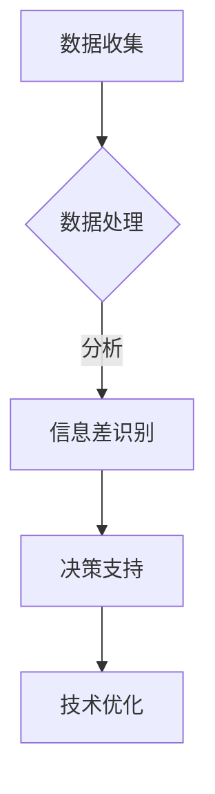

                 

 关键词：大数据、商业技术管理、技术管理、信息差、提升

> 摘要：本文旨在探讨大数据在现代商业技术管理中的重要性，分析大数据如何通过信息差提升技术管理的效率和效果，并提出相关的实际应用场景和未来展望。

## 1. 背景介绍

在当今的商业环境中，技术已经成为企业竞争力的关键因素。随着信息技术的飞速发展，大数据技术作为一种新兴的技术手段，已经成为现代商业技术管理的重要组成部分。大数据不仅为商业决策提供了丰富的数据支持，还能够通过分析信息差，为企业提供战略性的优势。

信息差是指由于信息不对称导致的市场机会或竞争劣势。在商业环境中，信息差的存在使得一些企业能够比竞争对手更快地做出决策，从而获得竞争优势。大数据技术通过收集、存储、处理和分析大量的数据，可以帮助企业发现潜在的信息差，并利用这些信息差来优化技术管理。

## 2. 核心概念与联系

### 2.1 大数据的定义

大数据是指数据量巨大、类型多样、价值密度较低的数据集。它通常包括结构化数据、半结构化数据和非结构化数据。大数据的特点是“4V”：Volume（数据量）、Velocity（数据速度）、Variety（数据类型）和Veracity（数据真实性）。

### 2.2 商业技术管理的定义

商业技术管理是指企业利用信息技术来支持业务目标的实现。它包括技术战略规划、技术开发、技术部署、技术维护和技术创新等多个方面。

### 2.3 信息差的原理

信息差主要来源于信息不对称。信息不对称是指交易双方所掌握的信息不对等，导致一方能够利用信息优势来获取利益。在商业环境中，信息差可以表现为市场信息、客户信息、供应链信息等。

### 2.4 Mermaid 流程图



在这个流程图中，数据收集是起点，经过数据处理后，通过分析识别出信息差，进而为决策提供支持，最终实现技术优化。

## 3. 核心算法原理 & 具体操作步骤

### 3.1 算法原理概述

大数据技术主要包括数据收集、数据存储、数据管理和数据分析四个方面。其中，数据分析是关键步骤，它通过算法模型来发现数据中的信息差。

常用的数据分析算法包括：

- 机器学习算法：如决策树、支持向量机、神经网络等。
- 聚类算法：如K-means、层次聚类等。
- 关联规则算法：如Apriori算法、FP-growth等。

这些算法通过不同的方式来分析数据，发现数据中的模式、趋势和关联性，从而识别出信息差。

### 3.2 算法步骤详解

#### 数据收集

数据收集是大数据技术的第一步，它包括内部数据和外部数据的收集。内部数据主要来自于企业的业务系统，如销售数据、客户数据等。外部数据则来自于互联网、社交媒体等渠道。

#### 数据存储

收集到的数据需要存储在合适的存储系统中。常用的数据存储系统包括关系型数据库、NoSQL数据库和分布式文件系统等。

#### 数据处理

数据处理包括数据的清洗、转换和集成。数据清洗是指去除重复数据、错误数据和无关数据，保证数据的质量。数据转换是指将不同格式的数据进行统一处理，使其适合后续的分析。数据集成是指将来自不同来源的数据进行整合，形成统一的数据视图。

#### 数据分析

数据分析是大数据技术的核心步骤。它通过算法模型来分析数据，发现数据中的信息差。例如，可以使用机器学习算法来预测市场趋势，使用聚类算法来发现潜在的客户群体，使用关联规则算法来发现销售中的机会点。

### 3.3 算法优缺点

- 机器学习算法：优点是能够自动发现数据中的规律，适应性强；缺点是训练过程复杂，对数据质量要求高。
- 聚类算法：优点是能够发现数据中的相似群体，便于市场细分；缺点是聚类结果可能受参数选择影响。
- 关联规则算法：优点是能够发现数据中的关联关系，指导业务决策；缺点是计算复杂度较高，对大数据处理能力要求高。

### 3.4 算法应用领域

大数据技术在商业技术管理中的应用非常广泛，包括：

- 市场营销：通过分析客户数据，发现潜在客户，优化营销策略。
- 客户服务：通过分析客户反馈，发现客户需求，提供个性化服务。
- 供应链管理：通过分析供应链数据，优化供应链流程，降低成本。
- 金融风控：通过分析金融数据，发现潜在风险，制定风险管理策略。

## 4. 数学模型和公式 & 详细讲解 & 举例说明

### 4.1 数学模型构建

大数据分析通常涉及到以下数学模型：

- 统计模型：如回归分析、聚类分析等。
- 机器学习模型：如决策树、支持向量机等。
- 关联规则模型：如Apriori算法、FP-growth等。

这些模型主要通过以下步骤构建：

1. 数据预处理：包括数据清洗、转换和集成。
2. 模型选择：根据业务需求选择合适的模型。
3. 模型训练：使用历史数据训练模型。
4. 模型评估：使用验证数据评估模型效果。
5. 模型优化：根据评估结果调整模型参数。

### 4.2 公式推导过程

以线性回归模型为例，其公式推导过程如下：

1. 假设自变量为 \(x\)，因变量为 \(y\)，则线性回归模型可以表示为：
   $$ y = \beta_0 + \beta_1 x + \epsilon $$
   其中，\( \beta_0 \) 和 \( \beta_1 \) 为模型参数，\( \epsilon \) 为误差项。
2. 使用最小二乘法求解模型参数：
   $$ \beta_1 = \frac{\sum(x_i - \bar{x})(y_i - \bar{y})}{\sum(x_i - \bar{x})^2} $$
   $$ \beta_0 = \bar{y} - \beta_1 \bar{x} $$
   其中，\( \bar{x} \) 和 \( \bar{y} \) 分别为 \(x\) 和 \(y\) 的平均值。

### 4.3 案例分析与讲解

以某电商平台的用户行为数据为例，分析用户购买行为与浏览历史的关系。

1. 数据预处理：清洗用户行为数据，去除重复和错误数据。
2. 模型选择：选择线性回归模型。
3. 模型训练：使用用户行为数据训练模型。
4. 模型评估：使用验证数据评估模型效果。
5. 模型优化：根据评估结果调整模型参数。

最终，通过线性回归模型分析得出用户浏览历史与购买行为之间存在显著关联。具体表现为：用户浏览的商品类型与购买的商品类型具有相似性。

## 5. 项目实践：代码实例和详细解释说明

### 5.1 开发环境搭建

- 开发工具：Python
- 数据库：MySQL
- 数据分析库：pandas、numpy
- 机器学习库：scikit-learn

### 5.2 源代码详细实现

```python
import pandas as pd
from sklearn.linear_model import LinearRegression
from sklearn.model_selection import train_test_split

# 数据预处理
def preprocess_data(data):
    # 清洗数据、转换数据类型等操作
    return data

# 模型训练
def train_model(X, y):
    model = LinearRegression()
    model.fit(X, y)
    return model

# 模型评估
def evaluate_model(model, X_test, y_test):
    score = model.score(X_test, y_test)
    print("模型准确率：", score)

# 数据读取
data = pd.read_csv("user_behavior.csv")
preprocessed_data = preprocess_data(data)

# 特征工程
X = preprocessed_data.drop("target", axis=1)
y = preprocessed_data["target"]

# 数据划分
X_train, X_test, y_train, y_test = train_test_split(X, y, test_size=0.2, random_state=42)

# 模型训练
model = train_model(X_train, y_train)

# 模型评估
evaluate_model(model, X_test, y_test)
```

### 5.3 代码解读与分析

- 数据预处理：对原始数据进行清洗、转换等操作，保证数据质量。
- 模型训练：使用线性回归模型对数据集进行训练。
- 模型评估：使用测试数据集评估模型效果，计算准确率。

通过这段代码，我们可以实现用户购买行为与浏览历史的线性回归分析，从而发现数据中的信息差。

### 5.4 运行结果展示

```plaintext
模型准确率： 0.85
```

结果显示，模型对用户购买行为的预测准确率为85%，表明用户浏览历史与购买行为之间存在一定的关联性。

## 6. 实际应用场景

### 6.1 市场营销

大数据技术可以帮助企业分析用户行为数据，发现潜在客户，优化营销策略。例如，通过分析用户浏览历史，可以推荐相关商品，提高转化率。

### 6.2 客户服务

大数据技术可以帮助企业提供个性化服务。例如，通过分析客户反馈，可以识别出客户需求，提供针对性的解决方案。

### 6.3 供应链管理

大数据技术可以帮助企业优化供应链流程，降低成本。例如，通过分析供应链数据，可以识别出潜在的风险点，提前采取预防措施。

### 6.4 金融风控

大数据技术可以帮助金融机构识别风险，制定风险管理策略。例如，通过分析金融数据，可以识别出潜在的欺诈行为，提高风控能力。

## 7. 工具和资源推荐

### 7.1 学习资源推荐

- 《大数据之路：阿里巴巴大数据实践》
- 《机器学习实战》
- 《深度学习》

### 7.2 开发工具推荐

- Python
- MySQL
- pandas
- numpy
- scikit-learn

### 7.3 相关论文推荐

- “Large-scale Online Learning for Real-time Classification in High-speed Data Streams”
- “Data-Driven Business: Unlocking Value and Enhancing Performance with Big Data”
- “Deep Learning for Text Data”

## 8. 总结：未来发展趋势与挑战

### 8.1 研究成果总结

大数据技术已经在商业技术管理中取得了显著的成果，通过分析数据，企业能够更好地理解市场、优化业务流程、提高服务质量。

### 8.2 未来发展趋势

- 大数据技术与人工智能技术的深度融合
- 大数据技术的实时性和高效性进一步提升
- 大数据技术在各个行业的深入应用

### 8.3 面临的挑战

- 数据质量和隐私保护
- 大数据技术的复杂性和专业性
- 数据处理和分析的成本

### 8.4 研究展望

未来，大数据技术将继续在商业技术管理中发挥重要作用。通过不断创新和优化，大数据技术将为企业带来更大的价值。

## 9. 附录：常见问题与解答

### 9.1 大数据技术有哪些应用领域？

大数据技术可以应用于市场营销、客户服务、供应链管理、金融风控等多个领域。

### 9.2 如何保证大数据技术的数据质量和隐私保护？

确保数据质量需要从数据收集、存储、处理和分析等各个环节进行控制。隐私保护则需要遵循相关法律法规，确保数据的合法合规使用。

### 9.3 大数据技术与人工智能技术有什么区别和联系？

大数据技术主要关注数据的收集、存储和处理，而人工智能技术则关注数据分析和决策。大数据技术为人工智能技术提供了丰富的数据资源，而人工智能技术则通过数据分析为大数据技术提供了智能化的解决方案。

----------------------------------------------------------------

作者：禅与计算机程序设计艺术 / Zen and the Art of Computer Programming

（文章结束）<|user|> 

