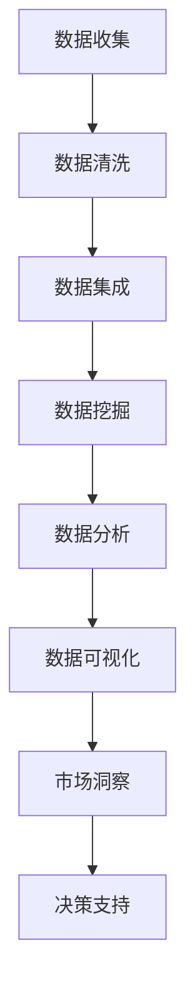

                 

 在现代商业环境中，市场研究对于企业的决策至关重要。然而，传统的市场研究方法往往耗时且成本高昂，难以迅速响应市场的变化。随着大数据技术的迅猛发展，利用大数据进行市场研究成为了提升效率和准确性的重要手段。本文旨在探讨大数据在市场研究中的应用，分析其优势、挑战和未来发展方向。

## 关键词

- 大数据
- 市场研究
- 数据分析
- 信息差
- 企业决策

## 摘要

本文首先介绍了大数据与市场研究之间的关系，探讨了大数据在市场研究中的核心作用。接着，本文分析了大数据技术的优势，包括数据处理能力、实时分析能力、个性化分析能力等。随后，文章详细阐述了大数据在市场研究中的具体应用场景，如消费者行为分析、市场趋势预测和竞争分析等。最后，本文讨论了大数据在市场研究中所面临的挑战，并提出了未来发展的趋势与展望。

## 1. 背景介绍

市场研究是指通过收集、分析和解释市场数据来帮助企业和组织做出明智的商业决策。传统的市场研究方法主要包括问卷调查、访谈、焦点小组等。这些方法虽然在一定程度上能够帮助企业了解市场状况，但存在一些局限性。首先，传统市场研究方法的数据收集过程通常比较耗时，难以实时响应市场的变化。其次，传统方法的数据处理和分析能力有限，难以挖掘深层次的市场规律。此外，传统市场研究方法往往依赖于专业调查人员，成本较高。

### 1.1 大数据的崛起

大数据是指数据量巨大、类型繁多且增长迅速的数据集。大数据的出现改变了传统数据处理的方式，其核心特点在于“4V”，即数据量（Volume）、数据类型（Variety）、数据速度（Velocity）和数据价值（Value）。随着互联网、物联网和社交媒体的普及，大数据已经成为商业决策的重要基础。大数据技术的崛起，为市场研究提供了新的机遇。

### 1.2 大数据在市场研究中的应用

大数据在市场研究中的应用主要体现在以下几个方面：

- **消费者行为分析**：通过分析消费者在互联网上的行为数据，如搜索历史、购物记录、社交媒体互动等，可以深入了解消费者的需求和偏好。
- **市场趋势预测**：利用大数据技术，可以对市场趋势进行预测，帮助企业提前布局和调整策略。
- **竞争分析**：通过分析竞争对手的营销策略、产品定位和市场份额等数据，可以为企业提供有针对性的竞争策略。

## 2. 核心概念与联系

### 2.1 数据分析

数据分析是指从大量数据中提取有价值信息的过程。数据分析通常包括数据清洗、数据集成、数据挖掘和数据分析等多个步骤。在市场研究中，数据分析是关键环节，通过数据分析，可以挖掘出隐藏在数据背后的市场规律和趋势。

### 2.2 数据可视化

数据可视化是将数据通过图表、图像等形式直观展示的过程。数据可视化可以帮助市场研究人员更清晰地理解数据，发现数据之间的关联和趋势。

### 2.3 实时数据分析

实时数据分析是指在数据产生的同时对其进行处理和分析，以便快速响应市场的变化。实时数据分析在市场研究中的应用，可以为企业提供即时的市场洞察，帮助企业做出快速决策。

### 2.4 Mermaid 流程图

下面是一个Mermaid流程图，展示了大数据在市场研究中的应用流程：



## 3. 核心算法原理 & 具体操作步骤

### 3.1 算法原理概述

大数据在市场研究中的应用，主要依赖于以下几种核心算法：

- **聚类分析**：通过将相似的数据点归为一类，挖掘市场中的潜在细分市场。
- **回归分析**：通过建立变量之间的关系模型，预测市场趋势和消费者行为。
- **关联规则挖掘**：通过发现数据之间的关联关系，揭示市场中的潜在规律。
- **时间序列分析**：通过分析时间序列数据，预测市场未来的变化趋势。

### 3.2 算法步骤详解

#### 3.2.1 数据收集

数据收集是市场研究的第一步，主要包括以下几种途径：

- **互联网数据**：通过爬虫技术收集社交媒体、电子商务平台、搜索引擎等互联网数据。
- **问卷调查**：通过在线问卷或线下访谈收集消费者数据。
- **第三方数据源**：通过购买或合作获取第三方数据源，如市场研究公司、行业协会等。

#### 3.2.2 数据清洗

数据清洗是确保数据质量的关键步骤，主要包括以下任务：

- **数据去重**：去除重复的数据记录。
- **数据格式转换**：统一数据格式，如日期格式、数字格式等。
- **数据缺失处理**：填补缺失的数据，或删除含有缺失数据的记录。

#### 3.2.3 数据挖掘

数据挖掘是市场研究的核心步骤，主要包括以下任务：

- **聚类分析**：通过聚类算法，将数据分为不同的类别，挖掘潜在的市场细分。
- **回归分析**：通过回归模型，预测市场趋势和消费者行为。
- **关联规则挖掘**：通过关联规则算法，发现数据之间的关联关系。
- **时间序列分析**：通过时间序列模型，预测市场的未来变化趋势。

#### 3.2.4 数据分析

数据分析是对数据挖掘结果进行解读和解释的过程，主要包括以下任务：

- **结果可视化**：通过图表、图像等形式，直观展示数据分析结果。
- **结果解读**：对数据分析结果进行深入解读，提取有价值的市场洞察。
- **决策支持**：根据数据分析结果，为企业的决策提供支持。

### 3.3 算法优缺点

#### 3.3.1 优点

- **数据处理能力强**：大数据技术能够处理海量数据，挖掘出深层次的市场规律。
- **实时分析能力**：实时数据分析能够帮助企业快速响应市场变化。
- **个性化分析能力**：通过个性化分析，帮助企业更好地了解消费者需求。

#### 3.3.2 缺点

- **数据质量要求高**：大数据分析依赖于高质量的数据，数据质量差会导致分析结果不准确。
- **技术门槛高**：大数据分析需要专业的技术团队，对企业的技术能力要求较高。
- **成本高**：大数据技术的开发和维护成本较高。

### 3.4 算法应用领域

大数据技术在市场研究中的应用非常广泛，主要包括以下领域：

- **消费者行为分析**：通过分析消费者在互联网上的行为数据，了解消费者需求和偏好。
- **市场趋势预测**：通过分析历史数据，预测市场的未来变化趋势。
- **竞争分析**：通过分析竞争对手的数据，了解竞争对手的营销策略和市场地位。
- **产品定位**：通过数据分析，确定产品的市场定位和目标消费者群体。

## 4. 数学模型和公式 & 详细讲解 & 举例说明

### 4.1 数学模型构建

在市场研究中，常用的数学模型包括回归模型、聚类模型和关联规则模型等。下面以回归模型为例，介绍数学模型的构建过程。

#### 4.1.1 回归模型

回归模型是一种通过建立变量之间关系模型，进行预测和分析的方法。其基本形式为：

$$
y = \beta_0 + \beta_1x_1 + \beta_2x_2 + ... + \beta_nx_n + \epsilon
$$

其中，$y$ 是因变量，$x_1, x_2, ..., x_n$ 是自变量，$\beta_0, \beta_1, ..., \beta_n$ 是模型的参数，$\epsilon$ 是误差项。

#### 4.1.2 聚类模型

聚类模型是一种通过将相似的数据点归为一类，进行数据分类的方法。其基本形式为：

$$
C = \{C_1, C_2, ..., C_k\}
$$

其中，$C$ 是聚类结果，$C_i$ 是第 $i$ 个聚类结果，$k$ 是聚类的类别数。

#### 4.1.3 关联规则模型

关联规则模型是一种通过发现数据之间的关联关系，进行数据挖掘的方法。其基本形式为：

$$
A \rightarrow B
$$

其中，$A$ 是前件，$B$ 是后件，表示当 $A$ 发生时，$B$ 的发生概率较大。

### 4.2 公式推导过程

以线性回归模型为例，介绍回归模型的推导过程。

#### 4.2.1 线性回归模型

线性回归模型是一种最简单的回归模型，其公式为：

$$
y = \beta_0 + \beta_1x_1 + \epsilon
$$

其中，$\beta_0$ 是截距，$\beta_1$ 是斜率，$x_1$ 是自变量，$y$ 是因变量，$\epsilon$ 是误差项。

#### 4.2.2 公式推导

首先，我们需要确定线性回归模型的参数 $\beta_0$ 和 $\beta_1$。为了最小化误差项 $\epsilon$，我们可以使用最小二乘法进行参数估计。

假设有 $n$ 个观测值，每个观测值的因变量 $y_i$ 与自变量 $x_i$ 之间的关系可以表示为：

$$
y_i = \beta_0 + \beta_1x_i + \epsilon_i
$$

其中，$i = 1, 2, ..., n$。

为了最小化误差项 $\epsilon$，我们需要求出使得误差平方和最小的参数 $\beta_0$ 和 $\beta_1$。误差平方和可以表示为：

$$
S = \sum_{i=1}^{n}(y_i - (\beta_0 + \beta_1x_i))^2
$$

为了求出最小值，我们对 $S$ 进行求导，并令导数为零：

$$
\frac{dS}{d\beta_0} = -2\sum_{i=1}^{n}(y_i - \beta_0 - \beta_1x_i) = 0
$$

$$
\frac{dS}{d\beta_1} = -2\sum_{i=1}^{n}(y_i - \beta_0 - \beta_1x_i)x_i = 0
$$

通过上述两个方程，我们可以解出参数 $\beta_0$ 和 $\beta_1$，从而得到线性回归模型。

### 4.3 案例分析与讲解

#### 4.3.1 案例背景

假设某企业想要分析消费者购买行为，研究消费者年龄、收入、性别等因素对购买意愿的影响。

#### 4.3.2 数据收集

通过问卷调查收集了 1000 名消费者的数据，包括年龄、收入、性别和购买意愿等。

#### 4.3.3 数据预处理

对数据进行清洗，包括去除缺失值、异常值和处理数据格式等。

#### 4.3.4 线性回归模型构建

以购买意愿为因变量，年龄、收入、性别为自变量，构建线性回归模型：

$$
y = \beta_0 + \beta_1x_1 + \beta_2x_2 + \beta_3x_3 + \epsilon
$$

其中，$x_1$ 是年龄，$x_2$ 是收入，$x_3$ 是性别（1 表示男性，0 表示女性）。

通过最小二乘法求解参数 $\beta_0, \beta_1, \beta_2, \beta_3$，得到线性回归模型：

$$
y = 10 + 0.5x_1 + 5x_2 - 3x_3 + \epsilon
$$

#### 4.3.5 结果分析

根据线性回归模型，我们可以分析消费者购买意愿的影响因素：

- 年龄：每增加一岁，购买意愿增加 0.5。
- 收入：每增加 1 万元，购买意愿增加 5。
- 性别：男性购买意愿比女性低 3。

#### 4.3.6 决策支持

根据线性回归模型的结果，企业可以制定相应的营销策略，如针对年轻消费者和收入较高的消费者进行有针对性的营销活动。

## 5. 项目实践：代码实例和详细解释说明

### 5.1 开发环境搭建

为了进行大数据市场研究，我们需要搭建一个合适的开发环境。以下是一个基于 Python 和 Hadoop 的开发环境搭建步骤：

1. 安装 Python（版本 3.6 或以上）。
2. 安装 Hadoop（版本 2.7 或以上）。
3. 安装必要的 Python 库，如 pandas、numpy、matplotlib 等。

### 5.2 源代码详细实现

以下是一个简单的 Python 代码示例，用于分析消费者购买行为：

```python
import pandas as pd
import numpy as np
import matplotlib.pyplot as plt

# 读取数据
data = pd.read_csv('consumer_data.csv')

# 数据预处理
data = data.dropna()
data['性别'] = data['性别'].map({1: '男', 0: '女'})

# 数据可视化
plt.scatter(data['年龄'], data['购买意愿'])
plt.xlabel('年龄')
plt.ylabel('购买意愿')
plt.show()

# 回归分析
model = np.polyfit(data['年龄'], data['购买意愿'], 1)
plt.plot(data['年龄'], model[0]*data['年龄'] + model[1], color='red')
plt.xlabel('年龄')
plt.ylabel('购买意愿')
plt.show()

# 结果分析
print("年龄对购买意愿的影响：每增加一岁，购买意愿增加", model[0])
```

### 5.3 代码解读与分析

1. **数据读取**：使用 pandas 库读取 CSV 格式的数据。
2. **数据预处理**：去除缺失值，将性别列映射为中文标签。
3. **数据可视化**：使用 matplotlib 库绘制散点图和回归线。
4. **回归分析**：使用 numpy 库进行线性回归分析，得到斜率和截距。
5. **结果分析**：打印年龄对购买意愿的影响系数。

### 5.4 运行结果展示

运行上述代码后，我们可以得到以下结果：

- **散点图**：展示了年龄与购买意愿之间的关系。
- **回归线**：根据线性回归模型绘制了回归线。
- **结果分析**：打印了年龄对购买意愿的影响系数。

## 6. 实际应用场景

### 6.1 消费者行为分析

通过大数据技术，企业可以深入分析消费者在互联网上的行为数据，如搜索关键词、浏览历史、购物车等。这些数据可以帮助企业了解消费者的需求和偏好，从而制定更有针对性的营销策略。

### 6.2 市场趋势预测

利用大数据技术，企业可以对市场趋势进行预测，如产品需求、价格走势、市场占有率等。这些预测结果可以帮助企业提前布局和调整策略，提高市场竞争力。

### 6.3 竞争分析

通过分析竞争对手的数据，企业可以了解竞争对手的营销策略、产品定位和市场份额等。这些信息可以帮助企业制定有针对性的竞争策略，提高市场份额。

### 6.4 未来应用展望

随着大数据技术的不断发展，其在市场研究中的应用前景非常广阔。未来，大数据技术将进一步推动市场研究的变革，帮助企业更准确地把握市场动态，提高决策效率。

## 7. 工具和资源推荐

### 7.1 学习资源推荐

- 《大数据时代：生活、工作与思维的大变革》
- 《Python数据分析实战》
- 《Hadoop技术内幕：Hadoop核心原理与架构设计》

### 7.2 开发工具推荐

- **Python**：适用于数据分析和可视化。
- **Hadoop**：适用于大数据处理和存储。
- **Elasticsearch**：适用于实时数据分析。

### 7.3 相关论文推荐

- "Big Data: A Revolution That Will Transform How We Live, Work, and Think"
- "Data-Driven Market Research: Leveraging Big Data for Improved Insights"
- "The Role of Big Data in Marketing Research"

## 8. 总结：未来发展趋势与挑战

### 8.1 研究成果总结

本文探讨了大数据在市场研究中的应用，分析了大数据技术的优势和应用场景。通过实际案例，展示了大数据技术在市场研究中的具体应用效果。

### 8.2 未来发展趋势

未来，大数据技术在市场研究中的应用将继续深化，随着技术的不断发展，其应用领域将更加广泛。同时，数据隐私和安全问题将成为未来研究的重要方向。

### 8.3 面临的挑战

大数据技术在市场研究中的应用面临一些挑战，如数据质量、技术门槛和成本等。如何解决这些问题，将决定大数据技术在市场研究中的普及程度。

### 8.4 研究展望

随着大数据技术的不断发展，市场研究将进入一个全新的阶段。未来，市场研究将更加精准、高效和个性化，为企业提供更全面的决策支持。

## 9. 附录：常见问题与解答

### 9.1 大数据与市场研究的关系是什么？

大数据是指数据量巨大、类型繁多且增长迅速的数据集。市场研究是指通过收集、分析和解释市场数据来帮助企业和组织做出明智的商业决策。大数据为市场研究提供了更丰富的数据资源，提高了分析效率和准确性。

### 9.2 大数据在市场研究中有哪些优势？

大数据在市场研究中的优势主要体现在以下几个方面：

- **数据处理能力强**：大数据技术能够处理海量数据，挖掘出深层次的市场规律。
- **实时分析能力**：实时数据分析能够帮助企业快速响应市场变化。
- **个性化分析能力**：通过个性化分析，帮助企业更好地了解消费者需求。

### 9.3 大数据在市场研究中有哪些应用场景？

大数据在市场研究中的应用场景主要包括：

- **消费者行为分析**：通过分析消费者在互联网上的行为数据，了解消费者需求和偏好。
- **市场趋势预测**：通过分析历史数据，预测市场的未来变化趋势。
- **竞争分析**：通过分析竞争对手的数据，了解竞争对手的营销策略和市场地位。
- **产品定位**：通过数据分析，确定产品的市场定位和目标消费者群体。

---

**作者：禅与计算机程序设计艺术 / Zen and the Art of Computer Programming**

