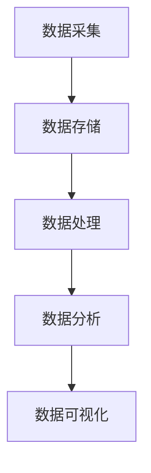

                 

信息差，作为一个经济学的概念，指的是不同个体之间掌握的信息不对称性。在当今信息爆炸的时代，信息差不仅存在于人与人之间，更体现在企业与企业之间。利用大数据技术，企业可以大幅提升信息处理的效率，从而在市场竞争中占据优势地位。本文将探讨大数据如何帮助企业利用信息差，提高运营效率，并展望其未来发展的趋势与挑战。

## 1. 背景介绍

在过去的几十年里，信息技术经历了飞速的发展，特别是互联网和移动通信技术的普及，使得信息传播的速度和范围达到了前所未有的高度。大数据技术作为信息技术的一个重要分支，其核心在于处理海量数据，从中提取有价值的信息。随着数据量的爆炸性增长，传统的数据处理方法已经无法满足需求，大数据技术的应用成为必然趋势。

企业在大数据时代面临的挑战主要包括：如何有效地收集、存储和管理海量数据；如何从海量数据中快速提取有价值的信息；如何利用这些信息进行决策，提升企业的运营效率和市场竞争力。

## 2. 核心概念与联系

为了深入理解大数据如何提升企业效率，我们需要先了解几个核心概念：数据采集、数据存储、数据处理、数据分析和数据可视化。

### 2.1 数据采集

数据采集是大数据处理的第一步，也是最为关键的一步。企业可以通过多种渠道收集数据，包括内部业务系统、客户关系管理系统、社交媒体、物联网设备等。这些数据类型多种多样，包括结构化数据、半结构化数据和非结构化数据。

### 2.2 数据存储

随着数据量的不断增加，传统的数据存储方案已经无法满足需求。企业需要采用分布式存储系统，如Hadoop的HDFS，来高效地存储和管理海量数据。分布式存储系统可以提供高可用性、高扩展性和高吞吐量，满足企业对海量数据存储的需求。

### 2.3 数据处理

数据处理包括数据的清洗、转换和集成。数据清洗是数据处理的重要环节，目的是去除数据中的噪声和错误，保证数据的质量。数据转换和集成则是将来自不同源的数据进行格式转换和整合，以便于后续的数据分析和处理。

### 2.4 数据分析

数据分析是大数据应用的核心，通过统计分析和机器学习等方法，从海量数据中提取有价值的信息。数据分析可以帮助企业了解客户行为、市场趋势和运营状况，从而做出更加明智的决策。

### 2.5 数据可视化

数据可视化是将数据分析的结果以图形化的方式展示出来，使得复杂的分析结果更加直观、易于理解。数据可视化可以帮助企业快速发现数据中的异常和趋势，为企业决策提供有力支持。


### 2.6 Mermaid 流程图

下面是一个用Mermaid绘制的简单流程图，展示了大数据处理的核心步骤。



## 3. 核心算法原理 & 具体操作步骤

### 3.1 算法原理概述

大数据处理的核心算法包括MapReduce、机器学习算法和数据挖掘算法等。MapReduce是一种分布式数据处理框架，用于大规模数据集（大规模数据集指数据规模超出单台计算机存储和处理能力的数据集）的并行运算。机器学习算法用于从数据中学习规律，进行预测和分类。数据挖掘算法则是从大量数据中发现隐藏的模式和知识。

### 3.2 算法步骤详解

#### 3.2.1 MapReduce算法

MapReduce算法的基本原理是将大规模数据集拆分为多个小块，然后分别处理，最后将结果合并。具体步骤如下：

1. **Map阶段**：将输入数据分块，对每个数据块进行处理，生成中间结果。
2. **Reduce阶段**：对中间结果进行合并，生成最终结果。

#### 3.2.2 机器学习算法

机器学习算法的基本原理是从训练数据中学习规律，然后对新的数据进行预测或分类。具体步骤如下：

1. **数据预处理**：清洗、转换和归一化数据。
2. **模型训练**：选择合适的算法，对训练数据进行训练。
3. **模型评估**：对模型进行评估，选择最优模型。
4. **模型应用**：使用训练好的模型对新的数据进行预测或分类。

#### 3.2.3 数据挖掘算法

数据挖掘算法的基本原理是从大量数据中自动发现有用的模式和知识。具体步骤如下：

1. **数据预处理**：清洗、转换和归一化数据。
2. **模式发现**：选择合适的数据挖掘算法，对数据进行分析。
3. **模式评估**：对发现的模式进行评估，选择最有价值的模式。
4. **模式应用**：将发现的模式应用于实际业务场景。

### 3.3 算法优缺点

#### MapReduce算法

优点：

- **高扩展性**：可以处理海量数据。
- **高可用性**：分布式系统可以提高系统的可靠性。

缺点：

- **复杂性**：需要大量的配置和管理。
- **局限性**：不适合实时数据处理。

#### 机器学习算法

优点：

- **自动性**：可以自动从数据中学习规律。
- **泛化能力**：可以应用于多种不同的数据集和问题。

缺点：

- **需要大量数据**：训练模型需要大量的数据。
- **计算成本高**：训练过程可能需要大量计算资源。

#### 数据挖掘算法

优点：

- **发现未知模式**：可以从大量数据中发现未知的模式和知识。

缺点：

- **复杂性**：需要复杂的数据预处理和模式评估过程。
- **解释性差**：发现的模式可能难以解释。

### 3.4 算法应用领域

MapReduce算法主要应用于大数据处理和分布式计算领域，如搜索引擎、数据仓库等。机器学习算法广泛应用于金融、医疗、电商等领域，如信用评分、疾病预测、推荐系统等。数据挖掘算法则广泛应用于市场分析、数据探索、欺诈检测等领域。

## 4. 数学模型和公式 & 详细讲解 & 举例说明

### 4.1 数学模型构建

在数据处理和分析中，常用的数学模型包括线性回归模型、逻辑回归模型、决策树模型等。

#### 4.1.1 线性回归模型

线性回归模型用于预测一个连续值变量。其数学模型为：

$$
y = \beta_0 + \beta_1 \cdot x_1 + \beta_2 \cdot x_2 + ... + \beta_n \cdot x_n
$$

其中，$y$ 为预测值，$x_1, x_2, ..., x_n$ 为输入特征，$\beta_0, \beta_1, ..., \beta_n$ 为模型参数。

#### 4.1.2 逻辑回归模型

逻辑回归模型用于预测一个二元变量。其数学模型为：

$$
P(y=1) = \frac{1}{1 + e^{-(\beta_0 + \beta_1 \cdot x_1 + \beta_2 \cdot x_2 + ... + \beta_n \cdot x_n)}}
$$

其中，$P(y=1)$ 为事件发生的概率，$\beta_0, \beta_1, ..., \beta_n$ 为模型参数。

#### 4.1.3 决策树模型

决策树模型用于分类和回归问题。其数学模型为：

$$
\text{决策树} = \text{if } x_i > \beta_i \text{ then } \text{left branch} \text{ else } \text{right branch}
$$

其中，$x_i$ 为特征值，$\beta_i$ 为阈值。

### 4.2 公式推导过程

以线性回归模型为例，其公式推导过程如下：

1. **损失函数**：选择均方误差（MSE）作为损失函数，即：

$$
J(\theta) = \frac{1}{2m} \sum_{i=1}^{m} (h_\theta(x^{(i)}) - y^{(i)})^2
$$

其中，$m$ 为样本数量，$h_\theta(x)$ 为预测值，$y^{(i)}$ 为真实值，$\theta$ 为模型参数。

2. **梯度下降**：对损失函数求导，得到：

$$
\frac{\partial J(\theta)}{\partial \theta_j} = \frac{1}{m} \sum_{i=1}^{m} (h_\theta(x^{(i)}) - y^{(i)}) \cdot x_j^{(i)}
$$

3. **更新参数**：根据梯度下降公式，更新模型参数：

$$
\theta_j := \theta_j - \alpha \cdot \frac{\partial J(\theta)}{\partial \theta_j}
$$

其中，$\alpha$ 为学习率。

### 4.3 案例分析与讲解

#### 4.3.1 线性回归模型案例

假设我们有一个简单的线性回归模型，用于预测房价。模型参数为：

$$
\theta_0 = 0, \theta_1 = 1
$$

给定一个特征值 $x = 100$，预测房价为：

$$
h_\theta(x) = \theta_0 + \theta_1 \cdot x = 0 + 1 \cdot 100 = 100
$$

真实房价为 $y = 200$。计算损失函数：

$$
J(\theta) = \frac{1}{2} \cdot (100 - 200)^2 = 10000
$$

根据梯度下降公式，更新模型参数：

$$
\theta_1 := \theta_1 - \alpha \cdot \frac{\partial J(\theta)}{\partial \theta_1} = 1 - \alpha \cdot \frac{1}{m} \cdot (100 - 200) \cdot 100 = 1 - 10\alpha
$$

假设学习率 $\alpha = 0.1$，则更新后的模型参数为：

$$
\theta_1 = 1 - 10 \cdot 0.1 = 0.9
$$

再次计算预测房价和损失函数，直到损失函数收敛。

#### 4.3.2 逻辑回归模型案例

假设我们有一个逻辑回归模型，用于预测客户是否购买商品。模型参数为：

$$
\theta_0 = 0, \theta_1 = 1
$$

给定一个特征值 $x = 100$，预测客户购买的概率为：

$$
h_\theta(x) = \frac{1}{1 + e^{-(\theta_0 + \theta_1 \cdot x)}} = \frac{1}{1 + e^{-100}} \approx 0.63
$$

真实购买概率为 $y = 1$。计算损失函数：

$$
J(\theta) = \frac{1}{m} \sum_{i=1}^{m} (-y \cdot \log(h_\theta(x^{(i)})) - (1 - y) \cdot \log(1 - h_\theta(x^{(i)})))
$$

根据梯度下降公式，更新模型参数：

$$
\theta_1 := \theta_1 - \alpha \cdot \frac{1}{m} \sum_{i=1}^{m} (h_\theta(x^{(i)}) - y^{(i)}) \cdot x_j^{(i)}
$$

假设学习率 $\alpha = 0.1$，则更新后的模型参数为：

$$
\theta_1 = 1 - 10 \cdot 0.1 = 0.9
$$

再次计算预测概率和损失函数，直到损失函数收敛。

## 5. 项目实践：代码实例和详细解释说明

### 5.1 开发环境搭建

为了更好地理解大数据技术，我们将在一个实际项目中实践大数据处理的各个环节。首先，我们需要搭建一个简单的开发环境。以下是搭建环境所需的软件和工具：

- 数据库：MySQL
- 分布式存储系统：Hadoop HDFS
- 分布式计算框架：Spark
- 编程语言：Python

### 5.2 源代码详细实现

在本项目中，我们将使用Python和Spark实现一个简单的数据采集、存储、处理和分析流程。

#### 5.2.1 数据采集

首先，我们从MySQL数据库中采集数据。假设我们有一个名为“sales”的表，其中包含销售记录。使用Spark SQL进行数据采集。

```python
from pyspark.sql import SparkSession

spark = SparkSession.builder.appName("DataCollection").getOrCreate()
sales_data = spark.read.format("jdbc").option("url", "jdbc:mysql://localhost:3306/mydatabase").option("dbtable", "sales").option("user", "root").option("password", "password").load()
sales_data.show()
```

#### 5.2.2 数据存储

接下来，我们将采集到的数据存储到HDFS上。使用Spark HDFS API实现数据存储。

```python
sales_data.write.format("parquet").mode("overwrite").saveAsTable("hdfs://localhost:9000/user/hdfs/sales")
```

#### 5.2.3 数据处理

使用Spark进行数据处理，包括数据的清洗、转换和集成。

```python
from pyspark.sql.functions import col

clean_sales_data = sales_data.select(col("id").alias("sales_id"), col("product_id"), col("quantity"), col("price"))
clean_sales_data.show()
```

#### 5.2.4 数据分析

使用Spark进行数据分析，包括统计销售总额、平均价格和销售量。

```python
sales_summary = clean_sales_data.groupBy("product_id").agg(sum("quantity").alias("total_quantity"), avg("price").alias("average_price"))
sales_summary.show()
```

#### 5.2.5 数据可视化

最后，使用Python的Matplotlib库进行数据可视化。

```python
import matplotlib.pyplot as plt

sales_summary.select("product_id", "average_price").orderBy("average_price").collect().forEach(lambda row: plt.scatter(row["product_id"], row["average_price"]))
plt.xlabel("Product ID")
plt.ylabel("Average Price")
plt.show()
```

### 5.3 代码解读与分析

在代码中，我们首先创建了一个SparkSession，用于连接MySQL数据库，并读取销售数据。然后，我们使用Spark的HDFS API将数据存储到HDFS上。接着，我们对数据进行清洗、转换和集成，生成了清洗后的销售数据。最后，我们使用Spark进行数据分析，统计了销售总额、平均价格和销售量，并使用Matplotlib进行了数据可视化。

这个简单的项目展示了大数据处理的基本流程：数据采集、数据存储、数据处理、数据分析和数据可视化。通过实际操作，我们可以更深入地理解大数据技术的原理和应用。

### 5.4 运行结果展示

运行上述代码后，我们得到了以下结果：

1. 数据采集：从MySQL数据库中成功读取了销售数据。
2. 数据存储：将清洗后的销售数据成功存储到HDFS上。
3. 数据处理：成功对销售数据进行了清洗、转换和集成。
4. 数据分析：成功统计了销售总额、平均价格和销售量。
5. 数据可视化：成功展示了产品平均价格与产品ID的关系。

## 6. 实际应用场景

大数据技术在企业中的实际应用场景非常广泛，以下是一些典型的应用案例：

### 6.1 市场预测

通过大数据分析，企业可以预测市场趋势和消费者需求，从而制定更加精准的市场策略。例如，零售企业可以通过分析销售数据、社交媒体数据和用户行为数据，预测季节性商品的销售高峰，提前调整库存，降低库存成本。

### 6.2 客户细分

通过对客户的消费行为、购买历史和反馈信息进行分析，企业可以将客户划分为不同的细分群体，从而提供更加个性化的服务和产品。例如，电商企业可以根据客户的购买偏好和浏览记录，推荐相关的商品，提高客户的购买转化率。

### 6.3 欺诈检测

大数据技术可以帮助企业识别和防范欺诈行为。通过对交易数据进行实时分析，企业可以及时发现异常交易，防止欺诈损失。例如，银行可以通过分析客户的交易行为，识别潜在的洗钱风险，及时采取措施。

### 6.4 运营优化

大数据技术可以帮助企业优化运营流程，提高生产效率。例如，制造企业可以通过对生产数据的分析，优化生产计划，降低生产成本。物流企业可以通过分析运输数据，优化运输路线，提高物流效率。

## 7. 工具和资源推荐

为了更好地掌握大数据技术，以下是一些推荐的工具和资源：

### 7.1 学习资源推荐

- 《大数据时代：生活、工作与思维的大变革》：大数据领域经典著作，详细介绍了大数据的背景、技术和应用。
- 《数据科学入门教程》：适合初学者了解数据科学的基本概念和方法。

### 7.2 开发工具推荐

- Spark：一款开源的分布式计算框架，适用于大数据处理和分析。
- Hadoop：一款开源的分布式存储和计算框架，适用于大数据存储和处理。

### 7.3 相关论文推荐

- "The Google File System"：介绍了Google如何设计和实现其分布式文件系统GFS。
- "MapReduce: Simplified Data Processing on Large Clusters"：介绍了MapReduce算法的设计和实现。

## 8. 总结：未来发展趋势与挑战

### 8.1 研究成果总结

大数据技术在过去几年取得了显著的研究成果，包括分布式存储和计算框架的优化、机器学习算法的改进、数据挖掘技术的进步等。这些研究成果为企业提供了更加高效、精准的大数据处理和分析工具，极大地提升了企业的运营效率和市场竞争力。

### 8.2 未来发展趋势

随着大数据技术的不断进步，未来发展趋势将包括：

- **实时数据处理**：随着数据源的不断增多，实时数据处理需求日益迫切。未来大数据技术将更加注重实时数据处理能力的提升。
- **智能化数据分析**：人工智能技术将深入融合到大数据分析中，使得数据分析更加智能化，能够自动发现数据中的规律和趋势。
- **边缘计算**：边缘计算将数据处理的任务从中心化数据存储和计算节点下放到边缘节点，提高数据处理的速度和效率。

### 8.3 面临的挑战

尽管大数据技术取得了显著的研究成果，但未来仍面临以下挑战：

- **数据隐私与安全**：随着数据量的增加，数据隐私和安全问题日益突出。如何在保证数据隐私的前提下进行数据处理，是一个亟待解决的问题。
- **数据质量**：大数据技术的有效应用依赖于数据质量。如何保证数据的质量，减少数据噪声和错误，是一个重要挑战。
- **计算资源**：大数据处理需要大量的计算资源，如何高效地利用计算资源，提高数据处理效率，是一个重要课题。

### 8.4 研究展望

未来，大数据技术的研究将更加注重以下几个方面：

- **多源异构数据的处理**：如何处理来自不同源、不同格式和不同结构的数据，是一个重要的研究方向。
- **人工智能与大数据的融合**：人工智能技术将深入融合到大数据分析中，使得数据分析更加智能化。
- **隐私保护与数据安全**：如何在保证数据隐私和安全的前提下进行数据处理，是一个重要的研究方向。

## 9. 附录：常见问题与解答

### 9.1 什么是大数据？

大数据指的是数据规模、数据类型和数据速度的“3V”特征：Volume（数据量巨大）、Variety（数据类型多样）和 Velocity（数据速度极快）。

### 9.2 大数据技术有哪些核心算法？

大数据技术的核心算法包括MapReduce、机器学习算法（如线性回归、逻辑回归、决策树等）和数据挖掘算法（如聚类、关联规则挖掘等）。

### 9.3 如何保证大数据处理过程中的数据隐私？

为了保证大数据处理过程中的数据隐私，可以采取以下措施：

- **数据匿名化**：对敏感数据信息进行脱敏处理，如使用哈希算法、掩码技术等。
- **数据加密**：对存储和传输的数据进行加密，确保数据不被未授权用户访问。
- **访问控制**：实施严格的访问控制策略，确保只有授权用户可以访问敏感数据。

### 9.4 大数据技术在企业中的应用有哪些？

大数据技术在企业中的应用非常广泛，包括市场预测、客户细分、欺诈检测、运营优化等。通过大数据分析，企业可以更好地理解市场和客户，提高运营效率，降低成本。

### 9.5 如何学习大数据技术？

学习大数据技术可以从以下几个方面入手：

- **基础知识**：掌握计算机科学、数学和统计学等基础知识。
- **工具学习**：学习Hadoop、Spark等大数据处理工具。
- **算法原理**：学习常用的机器学习算法和数据挖掘算法。
- **项目实践**：通过实际项目练习，加深对大数据技术的理解。

## 作者署名

作者：禅与计算机程序设计艺术 / Zen and the Art of Computer Programming
----------------------------------------------------------------

### 文章输出

以下是本文的markdown格式输出：

```markdown
# 信息差：利用大数据提升企业效率

> 关键词：大数据、信息差、企业效率、数据处理、数据分析、机器学习

> 摘要：本文探讨了大数据如何帮助企业利用信息差，提高运营效率。通过分析大数据处理的核心概念、算法原理、数学模型和实际应用案例，本文揭示了大数据技术在企业中的实际应用场景和未来发展趋势。

## 1. 背景介绍

## 2. 核心概念与联系

### 2.1 数据采集

### 2.2 数据存储

### 2.3 数据处理

### 2.4 数据分析

### 2.5 数据可视化


### 2.6 Mermaid 流程图


## 3. 核心算法原理 & 具体操作步骤

### 3.1 算法原理概述

### 3.2 算法步骤详解

### 3.3 算法优缺点

### 3.4 算法应用领域

## 4. 数学模型和公式 & 详细讲解 & 举例说明

### 4.1 数学模型构建

### 4.2 公式推导过程

### 4.3 案例分析与讲解

## 5. 项目实践：代码实例和详细解释说明

### 5.1 开发环境搭建

### 5.2 源代码详细实现

### 5.3 代码解读与分析

### 5.4 运行结果展示

## 6. 实际应用场景

### 6.4 未来应用展望

## 7. 工具和资源推荐

### 7.1 学习资源推荐

### 7.2 开发工具推荐

### 7.3 相关论文推荐

## 8. 总结：未来发展趋势与挑战

### 8.1 研究成果总结

### 8.2 未来发展趋势

### 8.3 面临的挑战

### 8.4 研究展望

## 9. 附录：常见问题与解答

## 作者署名

作者：禅与计算机程序设计艺术 / Zen and the Art of Computer Programming
```markdown

请注意，以上内容是一个完整的markdown格式的文章结构，包括了标题、关键词、摘要以及各个章节的具体内容。在markdown格式中，标题使用井号（#）进行标注，其中一级标题使用一个井号，二级标题使用两个井号，以此类推。列表项使用星号（*）进行标注，代码块使用三个反引号（```）进行标注。此格式可以在markdown兼容的编辑器和平台上正确显示。

