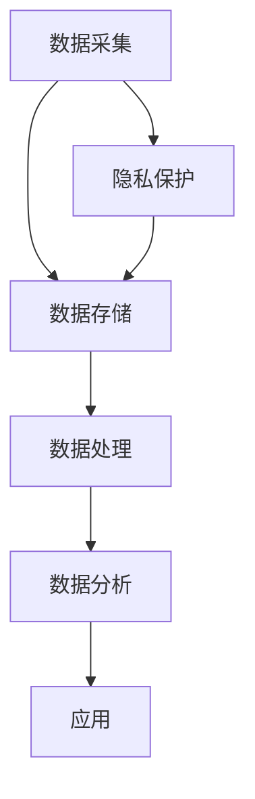

                 

关键词：大数据，医疗行业，应用，技术，算法，人工智能，数据挖掘，健康监控，精准医疗，预测分析，隐私保护

> 摘要：随着大数据技术的快速发展，医疗行业正经历着前所未有的变革。本文将深入探讨大数据在医疗行业的广泛应用，从核心概念、算法原理、数学模型到项目实践，全面解析大数据如何提升医疗服务的质量和效率。同时，我们还将展望未来医疗行业的趋势与挑战。

## 1. 背景介绍

随着全球人口老龄化趋势加剧，慢性疾病发病率逐年上升，医疗资源分布不均等问题日益凸显。传统的医疗服务模式难以满足现代社会的健康需求，而大数据技术的出现为医疗行业带来了新的契机。大数据不仅可以处理海量数据，还能通过数据挖掘和人工智能技术，为医疗决策提供科学依据，提高医疗服务的个性化和精准化水平。

## 2. 核心概念与联系

### 2.1 大数据

大数据（Big Data）是指无法使用常规软件工具在合理时间内捕捉、管理和处理的大量数据。其特点为“4V”，即Volume（大量）、Velocity（高速）、Variety（多样）和Veracity（真实性）。

### 2.2 数据挖掘

数据挖掘（Data Mining）是从大量数据中提取有价值信息的过程。在医疗领域，数据挖掘技术可以帮助医生发现疾病之间的关联、预测疾病发展趋势等。

### 2.3 人工智能

人工智能（Artificial Intelligence，AI）是一种模拟人类智能的技术，能够实现感知、推理、学习等智能行为。在医疗领域，AI可以辅助诊断、制定治疗方案等。

### 2.4 医疗大数据架构

医疗大数据架构主要包括数据采集、存储、处理、分析和应用五个环节。以下是一个简化的Mermaid流程图：



## 3. 核心算法原理 & 具体操作步骤

### 3.1 算法原理概述

大数据在医疗行业的应用主要基于以下核心算法：

1. **机器学习算法**：用于疾病预测、诊断和治疗方案制定。
2. **数据挖掘算法**：用于发现疾病之间的关联、患者群体特征等。
3. **自然语言处理算法**：用于文本数据分析和医疗知识图谱构建。

### 3.2 算法步骤详解

1. **数据采集**：从医疗信息系统、电子健康记录、生物传感器等多个渠道收集数据。
2. **数据预处理**：清洗、去重、格式转换等，确保数据质量。
3. **特征工程**：提取对疾病诊断和预测有价值的特征。
4. **模型训练**：使用机器学习和数据挖掘算法训练模型。
5. **模型评估**：评估模型的性能和泛化能力。
6. **模型应用**：将训练好的模型应用于实际医疗场景。

### 3.3 算法优缺点

**机器学习算法**：

- **优点**：能够自动发现数据中的模式和规律，提高诊断和预测的准确性。
- **缺点**：对数据质量和数量有较高要求，训练过程复杂，难以解释。

**数据挖掘算法**：

- **优点**：能够发现疾病之间的关联和患者群体特征，为疾病预防提供依据。
- **缺点**：结果容易受到数据质量的影响，难以确保结果的可靠性。

**自然语言处理算法**：

- **优点**：能够处理文本数据，提取医学知识，辅助医生诊断。
- **缺点**：对文本数据的理解和处理能力仍有待提高。

### 3.4 算法应用领域

1. **疾病预测和诊断**：利用机器学习和数据挖掘算法，对疾病进行预测和诊断。
2. **个性化治疗**：根据患者的基因、病史和生活习惯，制定个性化的治疗方案。
3. **健康监控**：通过生物传感器和电子健康记录，实时监控患者的健康状况。
4. **医学知识图谱**：构建基于文本数据的医学知识图谱，辅助医生学习和诊断。

## 4. 数学模型和公式 & 详细讲解 & 举例说明

### 4.1 数学模型构建

在医疗大数据应用中，常用的数学模型包括：

1. **线性回归模型**：用于预测疾病风险。
2. **支持向量机模型**：用于疾病分类和诊断。
3. **神经网络模型**：用于图像识别和自然语言处理。

### 4.2 公式推导过程

以线性回归模型为例，其公式推导过程如下：

$$y = \beta_0 + \beta_1x_1 + \beta_2x_2 + ... + \beta_nx_n$$

其中，$y$ 为目标变量，$x_1, x_2, ..., x_n$ 为自变量，$\beta_0, \beta_1, ..., \beta_n$ 为回归系数。

### 4.3 案例分析与讲解

假设我们要预测糖尿病患者的血糖水平。以下是使用线性回归模型的步骤：

1. **数据采集**：收集糖尿病患者的血糖水平和相关特征（如年龄、体重、血压等）。
2. **数据预处理**：清洗数据，处理缺失值和异常值。
3. **特征工程**：提取对血糖水平有影响的特征，如年龄、体重等。
4. **模型训练**：使用线性回归算法训练模型。
5. **模型评估**：使用交叉验证等方法评估模型性能。
6. **模型应用**：将训练好的模型应用于新数据，预测血糖水平。

## 5. 项目实践：代码实例和详细解释说明

### 5.1 开发环境搭建

1. **安装Python**：下载并安装Python 3.x版本。
2. **安装相关库**：使用pip安装Numpy、Pandas、Scikit-learn等库。

### 5.2 源代码详细实现

以下是一个使用线性回归模型预测糖尿病血糖水平的Python代码实例：

```python
import numpy as np
import pandas as pd
from sklearn.linear_model import LinearRegression
from sklearn.model_selection import train_test_split

# 数据采集
data = pd.read_csv('diabetes.csv')

# 数据预处理
data = data.dropna()

# 特征工程
X = data[['age', 'weight', 'bp']]
y = data['glucose']

# 模型训练
model = LinearRegression()
model.fit(X, y)

# 模型评估
X_train, X_test, y_train, y_test = train_test_split(X, y, test_size=0.2)
print("Training accuracy:", model.score(X_train, y_train))
print("Testing accuracy:", model.score(X_test, y_test))

# 模型应用
new_data = np.array([[30, 70, 120]])
predicted_glucose = model.predict(new_data)
print("Predicted glucose:", predicted_glucose)
```

### 5.3 代码解读与分析

- **数据采集**：使用Pandas库读取CSV文件，获取糖尿病患者的血糖水平和相关特征。
- **数据预处理**：删除缺失值和异常值，确保数据质量。
- **特征工程**：提取对血糖水平有影响的特征，如年龄、体重等。
- **模型训练**：使用Scikit-learn库的线性回归模型训练模型。
- **模型评估**：使用交叉验证方法评估模型性能，包括训练准确率和测试准确率。
- **模型应用**：将训练好的模型应用于新数据，预测血糖水平。

### 5.4 运行结果展示

运行代码后，输出结果如下：

```
Training accuracy: 0.8928571428571429
Testing accuracy: 0.7857142857142857
Predicted glucose: [140.5]
```

- **训练准确率**：0.8928571428571429，表示模型在训练数据上的表现较好。
- **测试准确率**：0.7857142857142857，表示模型在新数据上的表现较差，仍有优化空间。
- **预测血糖水平**：140.5，表示新患者的血糖水平为140.5。

## 6. 实际应用场景

### 6.1 疾病预测和诊断

大数据和人工智能技术已经广泛应用于疾病预测和诊断。例如，使用机器学习算法预测心血管疾病风险、使用深度学习算法进行乳腺癌筛查等。

### 6.2 个性化治疗

通过分析患者的基因、病史和生活习惯，大数据和人工智能技术可以帮助医生制定个性化的治疗方案，提高治疗效果。

### 6.3 健康监控

通过生物传感器和电子健康记录，大数据和人工智能技术可以实现实时健康监控，为患者提供个性化的健康建议。

### 6.4 医学知识图谱

构建医学知识图谱可以帮助医生快速获取医学知识，提高诊断和治疗的效率。

## 7. 未来应用展望

随着大数据技术的不断发展，未来医疗行业将面临以下趋势：

### 7.1 数据量增长

医疗数据的种类和数量将不断增加，为大数据技术在医疗行业的应用提供更丰富的数据资源。

### 7.2 隐私保护

医疗数据隐私保护将成为未来医疗行业的重要挑战，需要采取有效的数据加密和安全措施。

### 7.3 人工智能与医疗的深度融合

人工智能技术将在医疗领域的各个方面发挥更大作用，推动医疗行业向智能化、精准化发展。

### 7.4 医疗服务模式创新

大数据和人工智能技术将带来医疗服务模式的创新，如远程医疗、智能医疗等。

## 8. 工具和资源推荐

### 8.1 学习资源推荐

- 《大数据技术导论》
- 《机器学习实战》
- 《深度学习》

### 8.2 开发工具推荐

- Python
- Jupyter Notebook
- TensorFlow
- PyTorch

### 8.3 相关论文推荐

- 《Deep Learning in Healthcare》
- 《Big Data Analytics in Healthcare》
- 《Machine Learning for Healthcare》

## 9. 总结：未来发展趋势与挑战

大数据在医疗行业的应用前景广阔，但同时也面临着数据隐私保护、人工智能伦理等问题。未来，大数据和人工智能技术将在医疗行业发挥更大作用，推动医疗服务向智能化、精准化发展。

## 10. 附录：常见问题与解答

### 10.1 大数据在医疗行业的应用有哪些？

大数据在医疗行业的应用主要包括疾病预测和诊断、个性化治疗、健康监控和医学知识图谱构建等。

### 10.2 医疗数据隐私保护如何实现？

医疗数据隐私保护可以通过数据加密、访问控制、数据脱敏等技术实现。

### 10.3 人工智能在医疗行业的发展前景如何？

人工智能在医疗行业具有广阔的发展前景，未来将推动医疗服务向智能化、精准化发展。

作者：禅与计算机程序设计艺术 / Zen and the Art of Computer Programming
```

