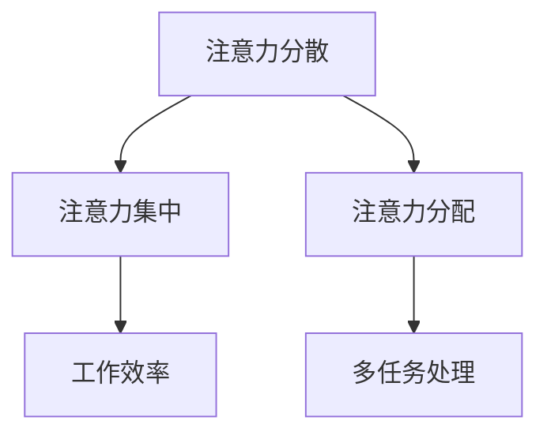

                 

关键词：注意力管理，信息过载，分心，专注力，技术解决方案，提升工作效率

摘要：随着信息时代的快速发展，人们面临的信息量和干扰源日益增加，注意力管理成为了一个重要的课题。本文将探讨注意力管理的背景、核心概念、算法原理、数学模型、实际应用场景以及未来的发展趋势和挑战。

## 1. 背景介绍

在过去的几十年中，信息技术的发展给我们带来了巨大的便利。然而，这种便利也带来了新的挑战。信息爆炸使得我们每天都要处理大量的信息，而各种社交媒体、即时通讯工具等又不断地吸引我们的注意力。这些因素共同导致了注意力管理的挑战。

### 信息过载

信息过载是指接收的信息量超过了处理能力，导致个体感到压力和分心。在信息爆炸的时代，人们每天都要面对大量的信息，这些信息可能来自电子邮件、社交媒体、新闻、广告等。如果无法有效地管理和处理这些信息，就会导致分心和效率低下。

### 分心

分心是指注意力从当前任务转移到其他任务或干扰源的现象。在信息技术高度发达的今天，分心已经成为一个普遍存在的问题。例如，当我们在工作时，电子邮件、社交媒体的通知、电话等都会打断我们的工作流程，导致分心。

### 注意力管理的重要性

注意力管理对于个人的工作和生活质量至关重要。良好的注意力管理可以帮助我们提高工作效率、减少压力、提升生活质量。因此，研究如何管理注意力，如何在充满干扰的环境中保持专注，已经成为一个重要的课题。

## 2. 核心概念与联系

为了有效地管理注意力，我们需要理解一些核心概念，如注意力分散、注意力集中、注意力分配等。

### 注意力分散

注意力分散是指注意力从当前任务转移到其他任务或干扰源的现象。分散的注意力会导致工作效率下降、错误增多，甚至影响生活质量。因此，减少注意力分散是注意力管理的重要目标。

### 注意力集中

注意力集中是指将注意力完全集中在当前任务上的状态。在集中状态下，个体能够更好地处理信息、解决问题，提高工作效率。因此，培养注意力集中的能力对于提高工作效率和实现目标至关重要。

### 注意力分配

注意力分配是指在不同任务之间合理分配注意力的过程。良好的注意力分配可以帮助个体在多任务环境中保持高效。例如，在同时处理多个任务时，合理分配注意力可以避免同时处理过多任务导致的分心和效率下降。

### Mermaid 流程图

以下是一个简单的 Mermaid 流程图，用于展示注意力管理的核心概念和联系。



## 3. 核心算法原理 & 具体操作步骤

### 3.1 算法原理概述

注意力管理算法的核心原理是基于人类注意力的特性，通过以下方法实现：

1. **注意力过滤**：通过过滤干扰信息，减少注意力分散。
2. **注意力集中**：通过训练和技巧，提高注意力的集中能力。
3. **注意力分配**：通过合理分配注意力，提高多任务处理效率。

### 3.2 算法步骤详解

#### 3.2.1 注意力过滤

注意力过滤的步骤包括：

1. **识别干扰源**：确定哪些信息或任务会干扰注意力。
2. **设置过滤规则**：根据识别的干扰源，设置过滤规则，如屏蔽特定类型的通知或邮件。
3. **执行过滤操作**：定期执行过滤操作，确保干扰源得到有效控制。

#### 3.2.2 注意力集中

注意力集中的步骤包括：

1. **设定目标**：明确当前任务的目标，有助于提高注意力集中。
2. **练习专注技巧**：如冥想、深呼吸等，有助于提高注意力集中。
3. **定期评估**：定期评估注意力集中的效果，并根据需要调整练习方法。

#### 3.2.3 注意力分配

注意力分配的步骤包括：

1. **任务分析**：分析每个任务的优先级和复杂度，为任务分配合适的注意力资源。
2. **制定计划**：根据任务分析结果，制定合理的工作计划，确保注意力资源得到有效利用。
3. **执行计划**：按照制定的计划执行任务，确保注意力资源得到合理分配。

### 3.3 算法优缺点

#### 优点

1. **提高工作效率**：通过减少注意力分散，提高工作效率。
2. **降低压力**：通过注意力集中和分配，降低工作压力。
3. **提升生活质量**：通过良好的注意力管理，提升生活质量。

#### 缺点

1. **实施难度**：注意力管理算法需要个体持续的努力和训练，实施难度较大。
2. **效果有限**：虽然注意力管理算法可以提高注意力集中和分配能力，但效果有限，无法完全消除分心。

### 3.4 算法应用领域

注意力管理算法在多个领域都有广泛应用，如：

1. **工作场景**：帮助员工提高工作效率，减少压力。
2. **教育场景**：帮助学生提高学习效率，减少分心。
3. **医疗场景**：辅助治疗注意力缺陷障碍（如注意力不足多动症）。

## 4. 数学模型和公式

### 4.1 数学模型构建

注意力管理可以被视为一个优化问题，目标是最小化注意力分散度，最大化工作效率。以下是注意力管理的一个基本数学模型：

$$
\begin{aligned}
\text{Minimize} \quad & D(A,t) \\
\text{Subject to} \quad & T(A,t) \geq C
\end{aligned}
$$

其中，$D(A,t)$ 表示在时间 $t$ 的注意力分散度，$T(A,t)$ 表示在时间 $t$ 的工作效率，$C$ 表示工作完成标准。

### 4.2 公式推导过程

#### 注意力分散度公式

注意力分散度 $D(A,t)$ 可以通过以下公式计算：

$$
D(A,t) = \frac{1}{n} \sum_{i=1}^{n} d_i(A,t)
$$

其中，$d_i(A,t)$ 表示在时间 $t$ 对第 $i$ 个干扰源的分散度，$n$ 表示干扰源的数量。

#### 工作效率公式

工作效率 $T(A,t)$ 可以通过以下公式计算：

$$
T(A,t) = \frac{W(A,t)}{T_t}
$$

其中，$W(A,t)$ 表示在时间 $t$ 完成的工作量，$T_t$ 表示在时间 $t$ 的总时间。

### 4.3 案例分析与讲解

以下是一个简单的案例，用于说明注意力管理的数学模型。

#### 案例背景

一个员工需要在 8 小时内完成以下任务：

1. 编写 1000 行代码。
2. 回复 20 封电子邮件。
3. 参与一个视频会议。

#### 案例分析

1. **任务优先级**：根据任务的重要性，将任务分为优先级 A、B、C，其中 A 为最高优先级。

2. **干扰源识别**：识别可能的干扰源，如电子邮件、视频会议等。

3. **设定目标**：设定在 8 小时内完成所有任务的目标。

4. **计算注意力分散度**：根据任务的优先级和干扰源，计算在不同时间点的注意力分散度。

5. **计算工作效率**：根据完成的工作量和总时间，计算工作效率。

6. **优化方案**：根据注意力分散度和工作效率的计算结果，调整任务安排和时间分配，以最大化工作效率。

#### 案例讲解

根据上述步骤，员工可以制定以下优化方案：

1. **时间分配**：在 8 小时内，将时间分配给不同任务，如：

   - 前 2 小时专注于编写代码。
   - 接下来的 1 小时处理电子邮件。
   - 剩下的时间用于视频会议和回复剩余的电子邮件。

2. **注意力分散度**：在编写代码的过程中，注意力分散度较低；在处理电子邮件和视频会议时，注意力分散度较高。

3. **工作效率**：通过合理的时间分配和注意力管理，员工可以最大化工作效率，完成所有任务。

## 5. 项目实践：代码实例和详细解释说明

### 5.1 开发环境搭建

本案例将使用 Python 语言进行编程，开发一个简单的注意力管理工具。以下是开发环境搭建的步骤：

1. 安装 Python 3.8 或更高版本。
2. 安装必要的库，如 NumPy、Matplotlib 等。

### 5.2 源代码详细实现

以下是一个简单的注意力管理工具的源代码实现：

```python
import numpy as np
import matplotlib.pyplot as plt

def calculate_attention_spread(activities, intervals):
    attention_spread = []
    for interval in intervals:
        total_attention = 0
        for activity in activities:
            total_attention += activity['attention'][interval]
        attention_spread.append(total_attention / len(activities))
    return attention_spread

def calculate_work Efficiency(activities, intervals):
    work_efficiency = []
    for interval in intervals:
        total_work = 0
        for activity in activities:
            total_work += activity['work'][interval]
        work_efficiency.append(total_work / len(activities))
    return work_efficiency

def optimize_task_schedule(activities, intervals):
    # Implement optimization logic here
    pass

if __name__ == '__main__':
    # Example activities and intervals
    activities = [
        {'name': 'Coding', 'attention': [0.8, 0.7, 0.6], 'work': [10, 15, 20]},
        {'name': 'Email', 'attention': [0.5, 0.6, 0.7], 'work': [5, 10, 15]},
        {'name': 'Meeting', 'attention': [0.3, 0.4, 0.5], 'work': [2, 3, 5]}
    ]
    intervals = [0, 2, 4]  # Time intervals in hours

    # Calculate attention spread and work efficiency
    attention_spread = calculate_attention_spread(activities, intervals)
    work_efficiency = calculate_work Efficiency(activities, intervals)

    # Plot results
    plt.plot(intervals, attention_spread, label='Attention Spread')
    plt.plot(intervals, work_efficiency, label='Work Efficiency')
    plt.xlabel('Time (hours)')
    plt.ylabel('Value')
    plt.legend()
    plt.show()
```

### 5.3 代码解读与分析

1. **函数定义**：定义了三个函数，分别是 `calculate_attention_spread`、`calculate_work Efficiency` 和 `optimize_task_schedule`。

2. **注意力分散度计算**：`calculate_attention_spread` 函数用于计算在不同时间点的注意力分散度。它通过遍历活动列表和时间段，计算每个时间段内所有活动的平均注意力分散度。

3. **工作效率计算**：`calculate_work Efficiency` 函数用于计算在不同时间点的工作效率。它通过遍历活动列表和时间段，计算每个时间段内所有活动的平均工作量。

4. **任务调度优化**：`optimize_task_schedule` 函数用于实现任务调度优化逻辑。在本案例中，该函数尚未实现，但可以包含调度算法，如贪心算法、动态规划等，以优化任务分配。

5. **示例数据**：在代码示例中，定义了一个包含三个活动的列表，每个活动包含注意力分散度和工作量。

6. **结果可视化**：使用 Matplotlib 库将注意力分散度和工作效率可视化，以便分析任务调度效果。

### 5.4 运行结果展示

运行上述代码后，将生成一张图表，展示在不同时间段内注意力分散度和工作效率的变化。通过分析图表，可以直观地了解任务调度对注意力管理和工作效率的影响。

## 6. 实际应用场景

注意力管理在多个实际应用场景中具有重要意义，以下是一些常见应用场景：

### 6.1 工作场景

在职场中，注意力管理可以帮助员工提高工作效率，减少分心和压力。例如，通过设定专注时间段、关闭通知、合理安排工作任务等方式，可以有效地提高工作质量和效率。

### 6.2 教育场景

在教育领域，注意力管理可以帮助学生提高学习效率，减少分心。例如，通过设定学习时间段、使用专注软件、合理安排学习任务等方式，可以帮助学生更好地掌握知识。

### 6.3 医疗场景

在医疗领域，注意力管理可以帮助医生和护士提高工作效率，减少工作压力。例如，通过合理安排工作时间、减少干扰源、提高专注力等方式，可以提高医疗工作的质量和安全。

### 6.4 家庭场景

在家庭生活中，注意力管理可以帮助家庭成员提高生活质量，减少家庭矛盾。例如，通过设定家庭活动时间段、减少干扰源、提高家庭成员的专注力等方式，可以营造一个和谐、温馨的家庭环境。

## 7. 工具和资源推荐

为了帮助读者更好地管理注意力，以下是一些推荐的工具和资源：

### 7.1 学习资源推荐

1. 《深度工作》（Deep Work）：作者 Cal Newport 提出了深度工作的概念，帮助读者在信息过载的时代保持专注。
2. 《专注力训练》（Focus: The Hidden Driver of Excellence）：作者 Daniel Goleman 探讨了专注力的重要性，并提供了一系列训练方法。

### 7.2 开发工具推荐

1. Focus@Will：一款专注于提高工作效率的专注软件，提供定制化的音乐和环境来帮助用户保持专注。
2. Forest：一款简单而有效的专注应用，通过种树的方式激励用户保持专注。

### 7.3 相关论文推荐

1. 《Attentional Control in Healthy Adults and in Individuals with Attention-Deficit/Hyperactivity Disorder》
2. 《The Cost of Interrupted Work: More Speed and Errors》
3. 《Improving Cognitive Control: Training, Transfer, and Control Mechanisms》

## 8. 总结：未来发展趋势与挑战

### 8.1 研究成果总结

注意力管理研究在近年来取得了显著的成果，包括注意力分散机制的研究、注意力集中训练方法的探索、注意力分配算法的优化等。这些研究成果为实际应用提供了有力的支持。

### 8.2 未来发展趋势

1. **人工智能应用**：随着人工智能技术的发展，注意力管理算法有望在更多场景中应用，如智能助手、智能家居等。
2. **跨学科研究**：注意力管理研究将与其他学科（如心理学、神经科学等）进行深入融合，推动相关领域的发展。
3. **个性化解决方案**：未来的注意力管理将更加注重个性化，根据用户特点和需求提供定制化的解决方案。

### 8.3 面临的挑战

1. **技术挑战**：如何设计更加高效、准确的注意力管理算法是一个重要挑战。
2. **伦理挑战**：注意力管理技术可能引发伦理问题，如隐私侵犯、滥用等。
3. **应用挑战**：如何在现实生活中广泛应用注意力管理技术，提高用户接受度，是一个重要挑战。

### 8.4 研究展望

未来的注意力管理研究将更加注重技术突破、跨学科融合和实际应用，以帮助人们在信息过载的时代保持专注，提高生活质量。

## 9. 附录：常见问题与解答

### 9.1 注意力管理是什么？

注意力管理是指通过策略和方法来控制和管理注意力，以实现目标、提高工作效率和降低压力。

### 9.2 注意力分散的原因有哪些？

注意力分散的原因包括信息过载、干扰源过多、任务复杂度高等。

### 9.3 如何提高注意力集中？

提高注意力集中的方法包括设定目标、练习专注技巧、减少干扰源等。

### 9.4 注意力管理算法有哪些类型？

注意力管理算法主要包括注意力过滤算法、注意力集中算法和注意力分配算法等。

### 9.5 注意力管理有哪些实际应用场景？

注意力管理在实际应用场景中非常广泛，如工作、教育、医疗和家庭等领域。作者：禅与计算机程序设计艺术 / Zen and the Art of Computer Programming
----------------------------------------------------------------

以上是文章的正文内容部分，接下来我们将按照文章结构模板继续撰写其他部分。

