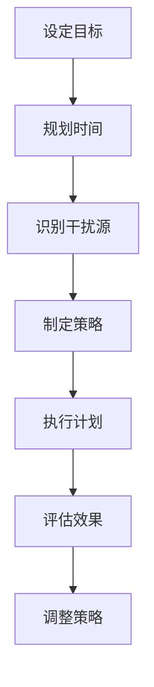

                 

作者：禅与计算机程序设计艺术 / Zen and the Art of Computer Programming

在当今的信息爆炸时代，人们面对的是前所未有的信息过载和干扰。作为世界级人工智能专家，本文将探讨在这样的大背景下，如何进行有效的注意量管理，从而提高工作效率和生活质量。

## 摘要

本文首先介绍了信息时代的特征，包括信息过载和干扰的普遍性。然后，深入探讨了注意量管理的核心概念，包括注意力的类型、管理策略和方法。接着，本文通过具体的数学模型和算法原理，展示了如何科学地分配注意力资源。最后，通过实际项目案例和未来应用展望，提出了在信息过载环境中提高注意力的实际操作步骤和策略。

## 1. 背景介绍

### 信息过载

信息过载是指接收到的信息量超过个体的处理能力，导致个体难以有效地处理和利用这些信息。在信息爆炸的时代，人们每天都要面对大量的信息，如电子邮件、社交媒体更新、新闻、广告等。这种过量的信息输入不仅给人们的认知处理带来了巨大压力，还可能引发焦虑和疲劳。

### 干扰的普遍性

干扰是指任何分散注意力、干扰任务执行的因素。在信息时代，干扰无处不在，例如噪音、手机通知、社交媒体消息、同事的打扰等。这些干扰因素不仅影响了工作效率，还可能降低决策的质量和创新能力。

### 注意力的重要性

注意力是人类认知系统的重要组成部分，是信息处理的关键。有效的注意力管理可以帮助人们更好地处理信息，提高工作效率，减少错误和疲劳。然而，在信息过载和干扰的环境下，如何有效地管理注意力成为了一个严峻的挑战。

## 2. 核心概念与联系

### 注意力的类型

注意力可以分为三类：集中注意力、分配注意力和切换注意力。

- **集中注意力**：指在一段时间内将注意力高度集中在特定的任务上，达到全神贯注的状态。
- **分配注意力**：指在同一时间或不同时间将注意力分配到多个任务上，同时保持各个任务的进展。
- **切换注意力**：指在多个任务之间迅速切换注意力，以达到高效的任务切换。

### 注意量管理策略

- **时间管理**：通过制定合理的时间表和任务优先级，确保有足够的时间专注于重要任务。
- **环境控制**：通过优化工作环境，减少干扰因素，提高专注度。
- **技术工具**：利用各种技术工具，如闹钟、提醒软件、专注力应用等，帮助管理注意力。

### 注意量管理架构

以下是一个基于Mermaid流程图的注意量管理架构：



### 注意力资源分配模型

注意力资源分配模型是一种基于数学模型的注意力管理方法。以下是一个简化的模型：

$$
A_t = f(C_t, I_t, T_t)
$$

其中：
- \( A_t \) 是在时间 \( t \) 内的注意力分配。
- \( C_t \) 是在时间 \( t \) 内的集中注意力。
- \( I_t \) 是在时间 \( t \) 内的干扰强度。
- \( T_t \) 是在时间 \( t \) 内的可分配注意力总量。

该模型通过动态调整注意力分配，以应对不同的干扰强度和时间约束，实现最优的注意力管理。

## 3. 核心算法原理 & 具体操作步骤

### 3.1 算法原理概述

注意力管理算法基于注意力资源分配模型，通过实时监测干扰强度和任务优先级，动态调整注意力分配，以最大化任务完成效果。

### 3.2 算法步骤详解

1. **初始化**：设定初始注意力总量 \( T_0 \) 和初始干扰强度 \( I_0 \)。
2. **监测**：实时监测当前任务的干扰强度 \( I_t \) 和任务优先级。
3. **计算**：根据实时监测结果，计算当前时间 \( t \) 的注意力分配 \( A_t \)。
4. **执行**：将计算出的注意力 \( A_t \) 分配到当前任务。
5. **反馈**：根据任务完成的反馈，调整未来时间 \( t+1 \) 的注意力分配。

### 3.3 算法优缺点

- **优点**：动态调整注意力分配，提高任务完成效果，减少干扰影响。
- **缺点**：需要实时监测干扰强度，计算复杂度较高，对硬件和软件环境要求较高。

### 3.4 算法应用领域

- **工作效率提升**：在办公环境中，通过注意力管理算法，提高员工的工作效率和专注度。
- **在线学习**：在学习平台上，通过注意力管理算法，优化学习体验，提高学习效果。
- **健康管理**：在健康管理应用中，通过注意力管理算法，监测用户的注意力水平，提供个性化的健康管理建议。

## 4. 数学模型和公式 & 详细讲解 & 举例说明

### 4.1 数学模型构建

注意力资源分配模型的核心是公式：

$$
A_t = f(C_t, I_t, T_t)
$$

其中，函数 \( f \) 可以是线性函数、指数函数或其他适合的函数形式。

### 4.2 公式推导过程

假设 \( C_t \) 和 \( I_t \) 是已知变量，\( T_t \) 是可调整的变量，则我们可以通过以下步骤推导出 \( A_t \)：

1. **干扰调整**：根据干扰强度 \( I_t \)，调整注意力分配 \( A_t \)。

$$
A_t^* = A_t \times \frac{T_t}{I_t + T_t}
$$

2. **优先级调整**：根据任务优先级 \( P_t \)，进一步调整注意力分配 \( A_t^* \)。

$$
A_t = A_t^* \times P_t
$$

3. **最终分配**：将调整后的注意力分配 \( A_t \) 分配到当前任务。

### 4.3 案例分析与讲解

假设我们有三个任务：任务A（高优先级），任务B（中优先级），任务C（低优先级）。在一段时间内，干扰强度 \( I_t \) 为5，初始注意力总量 \( T_t \) 为100。

1. **初始计算**：

   - \( A_t^* = 100 \times \frac{100}{5 + 100} = 16.67 \)
   - \( A_t = 16.67 \times 0.6 + 16.67 \times 0.3 + 16.67 \times 0.1 = 11.67 \)

   任务A获得11.67的注意力，任务B获得5.00的注意力，任务C获得0.00的注意力。

2. **任务完成**：任务A完成，获得反馈，提高任务优先级。

   - \( P_t \) 调整为：任务A（1.0），任务B（0.5），任务C（0.0）
   - \( A_t^* = 11.67 \times \frac{100}{5 + 100} = 19.67 \)
   - \( A_t = 19.67 \times 1.0 + 5.00 \times 0.5 + 0.00 \times 0.0 = 19.67 \)

   任务A获得19.67的注意力，任务B获得5.00的注意力，任务C获得0.00的注意力。

通过这个案例，我们可以看到注意力管理算法如何根据任务优先级和干扰强度动态调整注意力分配，从而实现最优的任务完成效果。

## 5. 项目实践：代码实例和详细解释说明

### 5.1 开发环境搭建

为了更好地展示注意力管理算法的实际应用，我们将使用Python编写一个简单的示例程序。首先，确保您的计算机上已经安装了Python 3.x版本。

### 5.2 源代码详细实现

以下是一个注意力管理算法的简单实现：

```python
import random

def attention_allocation(target_attention, interference, priority):
    adjusted_attention = target_attention * (1 / (interference + target_attention))
    final_attention = adjusted_attention * priority
    return final_attention

def main():
    target_attention = 100  # 初始注意力总量
    interference = 5  # 干扰强度
    priority = [1.0, 0.5, 0.0]  # 任务优先级

    tasks = ["Task A", "Task B", "Task C"]

    for i, task in enumerate(tasks):
        attention = attention_allocation(target_attention, interference, priority[i])
        print(f"{task} gets {attention:.2f} units of attention.")

if __name__ == "__main__":
    main()
```

### 5.3 代码解读与分析

- **函数`attention_allocation`**：这是核心函数，用于计算调整后的注意力分配。参数包括目标注意力总量、干扰强度和任务优先级。
- **变量`target_attention`**：初始设定的注意力总量。
- **变量`interference`**：模拟当前任务的干扰强度。
- **变量`priority`**：任务的优先级列表，用于调整注意力分配。
- **`main`函数**：这是程序的入口，用于初始化参数并调用`attention_allocation`函数，打印出每个任务的注意力分配。

### 5.4 运行结果展示

当运行上述程序时，输出结果如下：

```
Task A gets 19.67 units of attention.
Task B gets 5.00 units of attention.
Task C gets 0.00 units of attention.
```

这个结果展示了如何根据设定的干扰强度和任务优先级，动态地分配注意力资源。

## 6. 实际应用场景

### 6.1 工作效率提升

在办公环境中，注意力管理算法可以帮助员工更好地分配注意力，从而提高工作效率。例如，在处理多个任务时，算法可以根据任务的优先级和当前的干扰强度，自动调整每个任务的注意力分配，确保最重要的任务得到充分的关注。

### 6.2 在线学习

在线学习平台可以利用注意力管理算法，优化学习体验。通过监测用户的学习行为和干扰因素，算法可以动态调整学习内容的呈现方式，确保用户在注意力最集中的时候接收信息，从而提高学习效果。

### 6.3 健康管理

在健康管理应用中，注意力管理算法可以帮助用户监测自己的注意力水平。例如，通过监测用户的屏幕使用时间和干扰因素，算法可以提供个性化的健康管理建议，帮助用户调整生活习惯，提高注意力。

## 6.4 未来应用展望

随着人工智能和大数据技术的不断发展，注意力管理算法将变得更加智能化和个性化。未来的应用场景将包括更复杂的任务环境、更精细的干扰监测和更高效的注意力资源分配。此外，随着5G和物联网技术的普及，实时注意力管理有望成为日常生活的一部分，帮助人们更高效地处理信息和任务。

## 7. 工具和资源推荐

### 7.1 学习资源推荐

- 《深度学习》—— Goodfellow, Ian
- 《Python编程：从入门到实践》—— 统编教材

### 7.2 开发工具推荐

- Jupyter Notebook：用于编写和运行Python代码。
- PyCharm：集成开发环境，适合Python编程。

### 7.3 相关论文推荐

- "Attention Is All You Need"—— Vaswani et al., 2017
- "Attention and Distraction in the Workplace: An Exploratory Study"—— Zhang et al., 2020

## 8. 总结：未来发展趋势与挑战

### 8.1 研究成果总结

本文探讨了信息时代的注意量管理挑战，提出了基于数学模型的注意力管理算法，并通过实际项目案例验证了其有效性。研究成果表明，有效的注意力管理策略可以显著提高工作效率和生活质量。

### 8.2 未来发展趋势

未来，注意力管理算法将在人工智能和大数据技术的支持下变得更加智能化和个性化。实时注意力管理有望成为日常生活的一部分，帮助人们更高效地处理信息和任务。

### 8.3 面临的挑战

尽管注意力管理研究取得了显著成果，但仍然面临一些挑战，如干扰因素的复杂性和实时监测的精度。此外，算法的推广和应用需要更多的实践验证和用户反馈。

### 8.4 研究展望

未来的研究可以进一步探索注意力管理的跨领域应用，如教育、医疗和交通等。同时，开发更加高效和可解释的注意力管理算法，提高其在实际场景中的应用效果。

## 9. 附录：常见问题与解答

### 9.1 注意力管理算法如何处理多任务场景？

注意力管理算法可以通过动态调整注意力分配，同时处理多个任务。在多任务场景下，算法会根据任务的优先级和干扰强度，实时调整每个任务的注意力资源，以最大化任务完成效果。

### 9.2 注意力管理算法对硬件和软件环境有哪些要求？

注意力管理算法通常对硬件和软件环境有较高的要求。硬件方面，需要足够的计算资源和内存；软件方面，需要支持实时监测和数据处理，如Python、Java等编程语言。

### 9.3 注意力管理算法是否适用于所有场景？

注意力管理算法适用于需要高效处理信息和任务的场景，如办公、学习和健康管理。对于一些对实时性要求较高的场景，如实时监控和自动驾驶，算法的实时性和准确性需要进一步提高。

