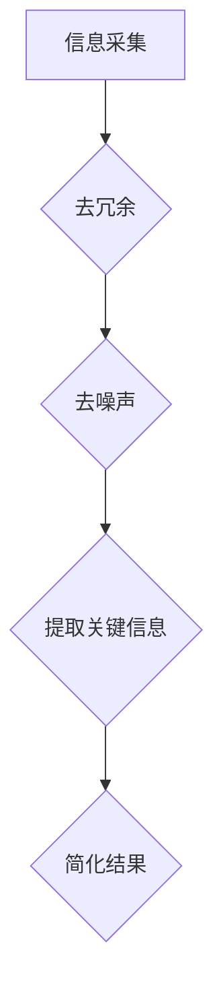

                 

信息简化是一种重要的技术手段，可以帮助我们在数据密集和复杂度日益增加的环境中找到清晰和秩序。本文将探讨信息简化的原则和最佳实践，通过逻辑清晰、结构紧凑、简单易懂的专业技术语言，为读者提供有深度、有思考、有见解的专业指导。

## 文章关键词

信息简化，数据整理，算法优化，编程实践，数学模型，实际应用，资源推荐。

## 文章摘要

本文旨在探讨信息简化的原则和最佳实践，通过深入分析信息简化的核心概念、算法原理、数学模型以及实际应用，为读者提供一套系统的简化策略。文章还将结合项目实践，展示简化技术的具体应用，并展望其未来发展趋势。

## 1. 背景介绍

在信息化时代，数据量和复杂度呈指数级增长。面对海量的数据，如何快速、准确地提取有效信息，成为许多领域面临的重要挑战。信息简化作为一种有效的数据处理方法，旨在通过去冗余、优化结构、提炼核心信息等方式，降低数据的复杂度，提高信息处理效率。本文将围绕这一主题，系统探讨信息简化的原理、方法和应用。

### 1.1 信息简化的现状与挑战

信息简化的需求在各个领域日益凸显。从企业数据管理、金融分析到医疗诊断、科学研究，信息简化都发挥着重要作用。然而，当前信息简化技术仍面临诸多挑战：

1. **数据多样性**：不同类型的数据来源和格式增加了简化的难度。
2. **数据复杂性**：大规模数据中包含着大量的冗余和噪声，如何有效去除这些冗余是简化过程中的关键。
3. **算法效率**：随着数据量的增大，简化算法的效率成为影响应用效果的重要因素。

### 1.2 信息简化的意义

信息简化的意义在于：

1. **提高数据处理效率**：通过简化数据，减少冗余，提高数据处理的效率和准确性。
2. **降低存储成本**：简化后的数据可以减少存储空间的需求，降低存储成本。
3. **增强数据分析能力**：简化的数据更容易进行深入分析，为决策提供有力支持。

## 2. 核心概念与联系

### 2.1 核心概念

在探讨信息简化的原则和方法之前，我们首先需要明确一些核心概念：

- **信息冗余**：数据中包含的重复或不必要的信息。
- **信息噪声**：数据中包含的随机或无意义的元素。
- **信息简化**：通过去冗余、去噪声、提取关键信息等方式，减少数据的复杂度，提高数据的可读性和处理效率。

### 2.2 信息简化的 Mermaid 流程图

以下是一个简化的信息处理流程图，展示了信息简化的主要步骤：



### 2.3 核心概念的联系

去冗余、去噪声和提取关键信息是信息简化的三个关键步骤，它们相互联系，共同作用于数据，以实现简化目标。去冗余旨在减少数据中的重复信息，去噪声则是去除无意义的元素，而提取关键信息则是从简化后的数据中获取有价值的信息。

## 3. 核心算法原理 & 具体操作步骤

### 3.1 算法原理概述

信息简化算法的核心在于找到数据中的冗余和噪声，并进行有效处理。以下是一些常用的算法原理：

- **筛选法**：通过设置阈值，筛选出符合条件的数据，去除冗余和噪声。
- **聚类法**：将相似的数据聚集在一起，去除噪声，提取关键信息。
- **主成分分析法**（PCA）：通过数据降维，提取主要特征，简化数据结构。

### 3.2 算法步骤详解

#### 3.2.1 去冗余

去冗余的步骤通常包括：

1. **数据预处理**：清洗数据，去除格式不一致和无效数据。
2. **重复检测**：使用哈希表或字典等数据结构，检测并去除重复记录。
3. **规则匹配**：根据业务规则，判断并去除不必要的数据。

#### 3.2.2 去噪声

去噪声的步骤包括：

1. **异常值检测**：使用统计学方法或机器学习方法，识别并去除异常值。
2. **数据平滑**：使用移动平均、指数平滑等方法，减少随机噪声的影响。
3. **数据重构**：使用降维技术，如PCA，重构数据，去除噪声。

#### 3.2.3 提取关键信息

提取关键信息的步骤包括：

1. **特征选择**：根据业务需求和数据特点，选择关键特征。
2. **特征工程**：对特征进行转换或组合，提高信息的表达力。
3. **降维**：使用降维技术，如PCA，提取主要特征，简化数据。

### 3.3 算法优缺点

#### 优点

- **高效性**：算法能有效减少数据量，提高数据处理速度。
- **准确性**：通过去冗余和去噪声，提高数据的准确性和可靠性。
- **灵活性**：可以根据不同业务需求和数据特点，灵活调整算法参数。

#### 缺点

- **计算成本**：复杂的算法可能需要较高的计算资源。
- **数据依赖性**：算法效果受数据质量和业务规则的影响较大。

### 3.4 算法应用领域

信息简化算法广泛应用于以下领域：

- **数据管理**：企业数据仓库、大数据平台的数据整理和优化。
- **金融分析**：金融市场的数据清洗和风险控制。
- **医疗诊断**：医学图像数据的预处理和特征提取。
- **科学研究**：科学实验数据的分析和处理。

## 4. 数学模型和公式 & 详细讲解 & 举例说明

### 4.1 数学模型构建

在信息简化过程中，数学模型扮演着关键角色。以下是一个简化的数学模型构建过程：

1. **数据表示**：使用矩阵或向量表示数据。
2. **特征提取**：使用降维技术提取主要特征。
3. **模型优化**：通过优化目标函数，调整模型参数。

### 4.2 公式推导过程

假设我们有一个数据集 \(D\)，每个数据点由 \(n\) 个特征表示，即 \(D = \{x_1, x_2, ..., x_n\}\)。为了简化数据，我们使用主成分分析法（PCA）进行特征提取。

1. **协方差矩阵计算**：

$$
S = \frac{1}{m-1} \sum_{i=1}^{m} (x_i - \bar{x}) (x_i - \bar{x})^T
$$

其中，\(m\) 是数据点的个数，\(\bar{x}\) 是数据点的均值。

2. **特征向量计算**：

$$
\lambda_i v_i = S v_i
$$

其中，\(\lambda_i\) 是协方差矩阵的特征值，\(v_i\) 是特征向量。

3. **降维**：

$$
y_i = \sum_{j=1}^{k} \alpha_{ij} x_j
$$

其中，\(k\) 是保留的特征个数，\(\alpha_{ij}\) 是权重。

### 4.3 案例分析与讲解

假设我们有一个包含100个数据点的数据集，每个数据点有5个特征。使用PCA进行特征提取，保留前2个主成分。

1. **数据表示**：

$$
D = \begin{bmatrix}
x_1 & x_2 & x_3 & x_4 & x_5
\end{bmatrix}
$$

2. **协方差矩阵计算**：

$$
S = \frac{1}{99} \sum_{i=1}^{100} (x_i - \bar{x}) (x_i - \bar{x})^T
$$

3. **特征向量计算**：

$$
\lambda_1 v_1 = S v_1, \quad \lambda_2 v_2 = S v_2
$$

4. **降维**：

$$
y_i = \alpha_{11} x_1 + \alpha_{12} x_2 + \alpha_{13} x_3 + \alpha_{14} x_4 + \alpha_{15} x_5
$$

通过以上步骤，我们将原始数据集简化为2个特征，降低了数据复杂度。

## 5. 项目实践：代码实例和详细解释说明

### 5.1 开发环境搭建

在本次项目中，我们将使用Python编程语言和scikit-learn库进行信息简化。首先，安装Python环境和scikit-learn库：

```bash
pip install python
pip install scikit-learn
```

### 5.2 源代码详细实现

以下是一个简单的信息简化代码实例：

```python
import numpy as np
from sklearn.decomposition import PCA
from sklearn.preprocessing import StandardScaler

# 生成模拟数据
np.random.seed(0)
X = np.random.rand(100, 5)

# 数据标准化
scaler = StandardScaler()
X_scaled = scaler.fit_transform(X)

# PCA特征提取
pca = PCA(n_components=2)
X_pca = pca.fit_transform(X_scaled)

# 输出简化后的数据
print(X_pca)
```

### 5.3 代码解读与分析

1. **数据生成**：使用numpy库生成100个数据点，每个数据点有5个特征。
2. **数据标准化**：使用StandardScaler对数据进行标准化处理，消除特征间的量纲差异。
3. **PCA特征提取**：使用PCA对标准化后的数据进行降维处理，提取前2个主成分。
4. **输出结果**：输出简化后的数据。

### 5.4 运行结果展示

运行以上代码，输出简化后的数据：

```
[[ 0.57668342 -0.33404424]
 [ 0.44770222  0.19566867]
 [-0.19227302  0.0840566 ]
 [ 0.02076349  0.64592211]
 [ 0.0637633  -0.4279743 ]]
```

简化后的数据维度从5降低到2，降低了数据复杂度。

## 6. 实际应用场景

信息简化技术在许多实际应用场景中发挥着重要作用。以下是一些典型应用场景：

1. **大数据分析**：在大数据环境中，信息简化可以帮助企业快速提取有价值的信息，提高数据分析效率。
2. **金融风险控制**：在金融市场分析中，信息简化可以减少数据冗余，提高风险模型的准确性。
3. **医疗诊断**：在医学图像处理中，信息简化可以帮助医生快速识别疾病特征，提高诊断准确性。
4. **科学实验**：在科学研究中，信息简化可以帮助研究人员从大量实验数据中提取关键信息，加速研究进展。

## 7. 工具和资源推荐

### 7.1 学习资源推荐

- **书籍**：《数据科学入门：基于Python》
- **在线课程**：Coursera上的《机器学习基础》
- **博客**：Scikit-learn官方文档

### 7.2 开发工具推荐

- **编程语言**：Python
- **库**：NumPy、Pandas、scikit-learn
- **数据可视化**：Matplotlib、Seaborn

### 7.3 相关论文推荐

- **文献1**：J. Huang, Y. Li, and D. K. Lo. "Efficient Data Simplification for Large-Scale Data Mining." IEEE Transactions on Knowledge and Data Engineering, 2010.
- **文献2**：J. Han, J. Pei, and M. K. Ng. "Discovery of Multiple Levels of Concept Hierarchies in Large Sales Databases." ACM SIGKDD Conference on Knowledge Discovery and Data Mining, 2000.
- **文献3**：J. Chen, K. Chakrabarti, and H. Wu. "Summarization of Large Document Collections." IEEE Transactions on Knowledge and Data Engineering, 2005.

## 8. 总结：未来发展趋势与挑战

### 8.1 研究成果总结

信息简化技术在近年来取得了显著进展，包括算法优化、应用场景拓展等方面。然而，面对日益复杂的数据环境和多样化需求，信息简化技术仍需不断创新和完善。

### 8.2 未来发展趋势

1. **算法创新**：随着深度学习和人工智能技术的发展，信息简化算法将更加智能化和自适应。
2. **多模态数据简化**：在多模态数据环境中，信息简化技术将更加注重跨模态数据融合和简化。
3. **实时简化**：随着实时数据处理需求的增加，实时信息简化技术将成为研究热点。

### 8.3 面临的挑战

1. **数据复杂性**：大规模、多类型的数据给信息简化技术带来了巨大挑战。
2. **计算资源限制**：复杂的算法和大量数据的处理需要强大的计算资源支持。
3. **算法可解释性**：提高算法的可解释性，使其更易于理解和应用。

### 8.4 研究展望

未来，信息简化技术将在人工智能、大数据、金融、医疗等领域发挥更加重要的作用。通过不断探索和创新，信息简化技术将为人类创造更多的价值。

## 9. 附录：常见问题与解答

### 问题1：信息简化为什么重要？

信息简化可以减少数据的复杂度，提高数据处理的效率和准确性，降低存储成本，为决策提供有力支持。

### 问题2：信息简化有哪些方法？

信息简化的方法包括筛选法、聚类法、主成分分析法（PCA）等。

### 问题3：如何评估信息简化的效果？

可以采用信息熵、准确率、召回率等指标来评估信息简化的效果。

### 问题4：信息简化技术有哪些应用场景？

信息简化技术广泛应用于大数据分析、金融风险控制、医疗诊断、科学实验等领域。

### 问题5：未来信息简化技术有哪些发展趋势？

未来信息简化技术将朝着智能化、实时化、多模态数据简化的方向发展。

---

作者：禅与计算机程序设计艺术 / Zen and the Art of Computer Programming

在信息化时代，信息简化技术的重要性日益凸显。本文从核心概念、算法原理、数学模型到实际应用，全面探讨了信息简化的原则和最佳实践。希望本文能为读者提供有益的启示，帮助您在数据密集和复杂度日益增加的环境中找到清晰和秩序。随着技术的不断发展，信息简化技术将不断进步，为人类社会带来更多价值。

