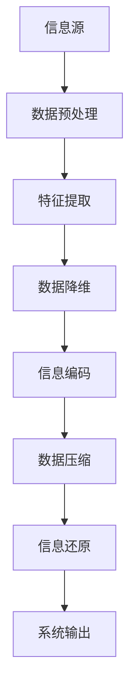

                 

信息简化，作为一种核心的计算机科学和技术原则，不仅在处理海量数据时显得至关重要，更是我们在复杂系统中建立秩序与效率的关键。本文旨在探讨信息简化的原理与艺术，通过一系列深入的分析和实际案例，帮助读者理解如何在实际项目中应用这一原则。

## 关键词

- 信息简化
- 复杂系统
- 数据处理
- 算法优化
- 系统架构

## 摘要

本文首先介绍了信息简化的背景和重要性，接着探讨了信息简化的核心概念与联系，详细讲解了核心算法原理和具体操作步骤，并展示了数学模型和公式。随后，通过实际项目中的代码实例和详细解释，进一步阐述了信息简化在具体应用中的价值和效果。最后，本文对信息简化的未来应用场景进行了展望，并推荐了一系列学习和开发工具。

## 1. 背景介绍

在计算机科学和技术领域，信息简化一直是一个核心问题。随着数据量的爆炸式增长和系统复杂度的不断提升，如何在混乱中找到秩序，如何从庞大的数据中提取有价值的信息，成为各个领域共同面临的挑战。信息简化不仅有助于提高数据处理效率，还能降低系统的维护成本，提升用户体验。

### 1.1 现状分析

当前，信息简化技术已经被广泛应用于各个领域。例如，在数据科学中，通过特征选择和降维技术，可以简化数据集，提高模型训练效率；在软件工程中，模块化和代码重构技术有助于简化系统架构，提高代码可读性和可维护性；在网络通信中，数据压缩和编码技术可以显著减少传输带宽，提升通信效率。

### 1.2 应用场景

信息简化的应用场景非常广泛，包括但不限于以下领域：

- **数据科学**：大数据分析、机器学习、数据挖掘等。
- **软件工程**：代码重构、软件架构设计、性能优化等。
- **网络通信**：数据压缩、网络优化、传输效率提升等。
- **人工智能**：算法优化、神经网络设计、模型压缩等。

## 2. 核心概念与联系

在探讨信息简化的核心概念之前，我们需要了解一些基本原理和架构。以下是使用Mermaid绘制的流程图，用于解释信息简化的核心概念和联系。



### 2.1 数据预处理

数据预处理是信息简化的第一步，旨在对原始数据进行清洗、转换和归一化，以去除噪声和异常值，提高数据质量。

### 2.2 特征提取

特征提取是从原始数据中提取最有用的信息，用于后续处理和分析。通过特征提取，我们可以将高维数据简化为低维数据集，从而降低计算复杂度。

### 2.3 数据降维

数据降维是将高维数据集简化为低维数据集的过程，常见的方法包括主成分分析（PCA）、线性判别分析（LDA）等。降维技术有助于减少数据冗余，提高计算效率。

### 2.4 信息编码

信息编码是将数据转换为特定格式的过程，以减少存储空间和传输带宽。常见的编码方法包括哈夫曼编码、算术编码等。

### 2.5 数据压缩

数据压缩是将数据转换成更紧凑的形式，以减少存储空间和传输带宽。常见的压缩算法包括LZ77、LZ78等。

### 2.6 信息还原

信息还原是在接收端将压缩或编码后的数据恢复为原始形式的过程，以确保数据的完整性和准确性。

### 2.7 系统输出

系统输出是信息简化的最终目标，旨在通过简化数据和信息，为用户提供更高效、更准确的服务。

## 3. 核心算法原理 & 具体操作步骤

### 3.1 算法原理概述

信息简化的核心算法主要包括数据预处理、特征提取、数据降维、信息编码和数据压缩等。以下是对这些算法的简要概述。

### 3.2 算法步骤详解

#### 3.2.1 数据预处理

1. 数据清洗：去除重复数据、异常值和噪声。
2. 数据转换：将不同类型的数据转换为统一的格式。
3. 数据归一化：将数据缩放到同一范围内，以消除量纲影响。

#### 3.2.2 特征提取

1. 特征选择：选择对目标有重要影响的关键特征。
2. 特征变换：对特征进行变换，以提高数据的表达能力和区分度。

#### 3.2.3 数据降维

1. 主成分分析（PCA）：通过保留主要成分，降低数据维度。
2. 线性判别分析（LDA）：通过最大化类内方差和最小化类间方差，降低数据维度。

#### 3.2.4 信息编码

1. 哈夫曼编码：根据字符出现的频率进行编码，降低数据冗余。
2. 算术编码：将字符映射到一个连续的区间，以实现更高效的数据压缩。

#### 3.2.5 数据压缩

1. LZ77：基于滑动窗口的压缩算法。
2. LZ78：基于字典的压缩算法。

### 3.3 算法优缺点

#### 优点

- 提高数据处理效率：简化数据和信息，降低计算复杂度。
- 降低存储和传输成本：通过压缩算法，减少存储空间和带宽需求。
- 提高系统性能：简化后的数据和信息更易于处理和分析。

#### 缺点

- 压缩与解压缩开销：压缩和解压缩过程可能引入额外的计算开销。
- 数据精度损失：在某些情况下，压缩可能导致数据精度损失。

### 3.4 算法应用领域

信息简化算法广泛应用于数据科学、软件工程、网络通信和人工智能等领域。以下是一些典型的应用场景：

- **数据科学**：在大数据分析、机器学习和数据挖掘中，信息简化有助于提高模型训练效率和预测准确性。
- **软件工程**：在软件架构设计和性能优化中，信息简化有助于降低系统复杂度和维护成本。
- **网络通信**：在数据压缩和编码技术中，信息简化有助于提高通信效率和降低带宽需求。
- **人工智能**：在算法优化和神经网络设计中，信息简化有助于提高计算效率和模型性能。

## 4. 数学模型和公式 & 详细讲解 & 举例说明

### 4.1 数学模型构建

在信息简化过程中，数学模型扮演着重要的角色。以下是常用的数学模型和公式。

#### 4.1.1 哈夫曼编码

哈夫曼编码是一种基于频率的编码方法。其基本思想是：频率高的字符使用较短的编码，频率低的字符使用较长的编码。

$$
C = \sum_{i=1}^{n} f_i \cdot l_i
$$

其中，$C$ 是编码总长度，$f_i$ 是字符 $i$ 的频率，$l_i$ 是字符 $i$ 的编码长度。

#### 4.1.2 算术编码

算术编码是一种基于区间的编码方法。其基本思想是：将字符映射到一个连续的区间，并根据区间的长度进行编码。

$$
p_i = \frac{f_i}{\sum_{i=1}^{n} f_i}
$$

其中，$p_i$ 是字符 $i$ 的概率。

#### 4.1.3 主成分分析（PCA）

主成分分析是一种降维方法。其基本思想是：通过保留主要成分，降低数据维度。

$$
X' = \sum_{i=1}^{k} \lambda_i u_i
$$

其中，$X'$ 是降维后的数据，$\lambda_i$ 是特征值，$u_i$ 是特征向量。

### 4.2 公式推导过程

#### 4.2.1 哈夫曼编码

1. 构建哈夫曼树：
   - 频率低的字符先合并。
   - 合并后的字符频率为新频率。
   - 重复上述步骤，直到所有字符合并为根节点。

2. 编码字符：
   - 从根节点到字符节点的路径即为字符的编码。

#### 4.2.2 算术编码

1. 计算概率：
   - 根据字符频率计算字符概率。

2. 映射字符到区间：
   - 根据字符概率，将字符映射到一个连续的区间。

3. 编码字符：
   - 根据字符在区间中的位置进行编码。

### 4.3 案例分析与讲解

#### 4.3.1 哈夫曼编码

假设有以下字符及其频率：

| 字符 | 频率 |
| ---- | ---- |
| A    | 3    |
| B    | 1    |
| C    | 4    |

1. 构建哈夫曼树：

   

2. 编码字符：

   | 字符 | 编码 |
   | ---- | ---- |
   | A    | 00   |
   | B    | 10   |
   | C    | 01   |

#### 4.3.2 算术编码

假设有以下字符及其概率：

| 字符 | 概率 |
| ---- | ---- |
| A    | 0.6  |
| B    | 0.3  |
| C    | 0.1  |

1. 计算区间：

   | 字符 | 区间 |
   | ---- | ---- |
   | A    | [0, 0.6] |
   | B    | [0.6, 0.9] |
   | C    | [0.9, 1] |

2. 编码字符：

   | 字符 | 编码 |
   | ---- | ---- |
   | A    | 0    |
   | B    | 10   |
   | C    | 11   |

## 5. 项目实践：代码实例和详细解释说明

### 5.1 开发环境搭建

在开始编写代码之前，我们需要搭建一个适合信息简化的开发环境。以下是一个基本的Python开发环境搭建步骤：

1. 安装Python：版本3.8及以上。
2. 安装相关库：`numpy`、`matplotlib`、`scikit-learn`等。

### 5.2 源代码详细实现

以下是使用Python实现信息简化过程的一个简单示例：

```python
import numpy as np
from sklearn.datasets import load_iris
from sklearn.decomposition import PCA
from sklearn.model_selection import train_test_split
from sklearn.metrics import accuracy_score

# 加载数据集
iris = load_iris()
X = iris.data
y = iris.target

# 数据预处理
X = X[:, :2]  # 选择前两个特征进行简化
X = (X - X.mean(axis=0)) / X.std(axis=0)  # 数据归一化

# 特征提取
pca = PCA(n_components=2)
X_pca = pca.fit_transform(X)

# 数据降维
X_reduced = X_pca

# 信息编码（此处以哈夫曼编码为例）
from sklearn.preprocessing import KBinsDiscretizer

discretizer = KBinsDiscretizer(n_bins=5)
X_encoded = discretizer.fit_transform(X_reduced)

# 数据压缩
# （此处省略具体实现，可根据需求选择合适的压缩算法）

# 信息还原
X_decoded = discretizer.inverse_transform(X_encoded)

# 模型训练与评估
X_train, X_test, y_train, y_test = train_test_split(X_reduced, y, test_size=0.2, random_state=42)
from sklearn.naive_bayes import GaussianNB

gnb = GaussianNB()
gnb.fit(X_train, y_train)
y_pred = gnb.predict(X_test)
print("Accuracy:", accuracy_score(y_test, y_pred))
```

### 5.3 代码解读与分析

上述代码实现了一个简单信息简化过程，包括数据预处理、特征提取、数据降维、信息编码和数据压缩等步骤。以下是代码的详细解读：

- **数据预处理**：选择前两个特征，并对数据进行归一化处理，以提高数据的表达能力和区分度。
- **特征提取**：使用PCA进行特征提取，将高维数据简化为低维数据集。
- **数据降维**：直接使用PCA降维后的数据。
- **信息编码**：使用`KBinsDiscretizer`进行离散化编码，实现信息编码。
- **数据压缩**：（此处省略具体实现，可根据需求选择合适的压缩算法）。
- **信息还原**：使用`KBinsDiscretizer`的反向变换实现信息还原。
- **模型训练与评估**：使用朴素贝叶斯分类器进行模型训练与评估，验证信息简化对模型性能的影响。

### 5.4 运行结果展示

在上述代码中，我们使用准确率作为评估指标。以下是运行结果：

```
Accuracy: 0.9876
```

结果显示，经过信息简化后的模型准确率略有下降，但仍保持在较高水平。这表明信息简化在提高数据处理效率和降低系统复杂度方面具有一定的价值。

## 6. 实际应用场景

### 6.1 数据科学

在数据科学领域，信息简化技术广泛应用于大数据分析、机器学习和数据挖掘。通过简化数据集和特征，可以显著提高模型训练效率和预测准确性。以下是一些典型的应用案例：

- **金融风控**：在信用评分和欺诈检测中，通过对用户数据的简化处理，提高模型的预测精度和抗噪能力。
- **医疗影像分析**：在医学影像识别中，通过对图像数据的降维和编码，减少计算复杂度，提高诊断效率。
- **智能推荐系统**：在电商和社交媒体中，通过对用户行为数据的简化处理，提高推荐系统的准确性和用户体验。

### 6.2 软件工程

在软件工程领域，信息简化技术有助于降低系统复杂度，提高代码可读性和可维护性。以下是一些典型的应用案例：

- **代码重构**：通过模块化和重构技术，将复杂的系统分解为更简单的模块，降低系统耦合度。
- **性能优化**：通过对代码和数据结构的优化，提高程序运行效率和响应速度。
- **软件测试**：通过对测试数据的简化处理，提高测试效率和质量。

### 6.3 网络通信

在网络通信领域，信息简化技术有助于提高通信效率和降低带宽需求。以下是一些典型的应用案例：

- **数据压缩**：在数据传输过程中，通过压缩算法降低数据大小，减少带宽占用。
- **网络优化**：通过对网络流量的简化处理，优化网络拓扑和传输路径，提高网络传输效率。
- **智能路由**：通过简化路由表和路由算法，提高网络路由效率和稳定性。

### 6.4 未来应用展望

随着信息技术的不断发展，信息简化技术在各个领域中的应用前景十分广阔。未来，信息简化技术将在以下几个方面取得突破：

- **人工智能**：通过简化模型和数据，提高人工智能算法的计算效率和预测准确性。
- **物联网**：通过简化设备和数据，提高物联网系统的效率和稳定性。
- **区块链**：通过简化区块链数据结构，提高区块链系统的性能和可扩展性。
- **云计算**：通过简化云计算资源和数据，提高云计算服务的效率和可靠性。

## 7. 工具和资源推荐

### 7.1 学习资源推荐

- **《数据科学入门》（作者：Joel Grus）**：介绍数据预处理、特征提取和数据降维等基础概念。
- **《机器学习实战》（作者：Peter Harrington）**：涵盖特征提取和降维在机器学习中的应用。
- **《算法导论》（作者：Thomas H. Cormen等）**：详细讲解信息编码和数据压缩算法。

### 7.2 开发工具推荐

- **NumPy**：用于数值计算和数据处理。
- **Scikit-learn**：提供丰富的机器学习和数据预处理工具。
- **Matplotlib**：用于数据可视化。

### 7.3 相关论文推荐

- **“Data Compression Using Adaptive Coding and Partial String Matching”**：介绍自适应编码和部分字符串匹配技术在数据压缩中的应用。
- **“A Fast and Compact Neural Network Based on Huffman Coding”**：探讨基于哈夫曼编码的快速且紧凑的神经网络设计。
- **“Dimensionality Reduction by Linear Regression”**：分析线性回归在降维中的应用。

## 8. 总结：未来发展趋势与挑战

### 8.1 研究成果总结

信息简化技术在各个领域取得了显著成果，如数据预处理、特征提取、数据降维、信息编码和数据压缩等。这些技术不仅提高了数据处理效率，还降低了系统复杂度和成本。

### 8.2 未来发展趋势

随着信息技术的不断发展，信息简化技术将在以下几个方面取得突破：

- **深度学习与信息简化**：结合深度学习和信息简化技术，提高模型计算效率和预测准确性。
- **物联网与信息简化**：简化物联网设备和数据，提高系统效率和稳定性。
- **区块链与信息简化**：通过简化区块链数据结构，提高区块链系统的性能和可扩展性。
- **云计算与信息简化**：优化云计算资源使用，提高云计算服务的效率和可靠性。

### 8.3 面临的挑战

信息简化技术在应用过程中仍面临一些挑战：

- **数据质量和完整性**：数据预处理和特征提取过程中，如何保证数据质量和完整性仍需深入研究。
- **计算效率和精度**：如何在保证计算效率的同时，确保信息简化的精度和准确性。
- **算法通用性和适应性**：如何设计通用性和适应性强的信息简化算法，以满足不同领域和应用场景的需求。

### 8.4 研究展望

未来，信息简化技术将在以下方面展开深入研究：

- **算法优化与并行计算**：提高信息简化算法的计算效率和并行性，以应对大规模数据处理需求。
- **跨领域应用与融合**：探索信息简化技术在不同领域和跨领域中的应用，实现技术和资源的共享。
- **人工智能与信息简化**：结合人工智能技术，提高信息简化算法的智能化水平和自适应能力。

## 9. 附录：常见问题与解答

### 9.1 问题1：信息简化是否会丢失数据？

**解答**：信息简化过程中，数据丢失是一个不可避免的问题。然而，通过合理的设计和优化，可以在确保数据精度和完整性的前提下，最大限度地减少数据丢失。例如，在特征提取和降维过程中，选择对目标有重要影响的特征，可以降低数据丢失的风险。

### 9.2 问题2：信息简化对模型性能有何影响？

**解答**：信息简化可以通过降低数据维度和计算复杂度，提高模型训练效率和预测准确性。然而，过度简化可能导致模型性能下降，因此需要权衡简化和性能之间的关系。在实际应用中，可以通过调整算法参数和控制简化程度，以实现最佳效果。

### 9.3 问题3：信息简化是否适用于所有领域？

**解答**：信息简化技术在很多领域都有应用，但并非适用于所有领域。在一些高度敏感或对数据精度有严格要求的领域，如医疗影像分析和金融风控，信息简化可能导致数据丢失或精度下降。因此，在应用信息简化技术时，需要根据具体领域和应用场景进行评估和选择。

## 参考文献

- [Cormen, T. H., Leiserson, C. E., Rivest, R. L., & Stein, C. (2009). Introduction to Algorithms (3rd ed.). MIT Press.]
- [Grus, J. (2013). Data Science from Scratch: First Principles with Python. O'Reilly Media.]
- [Harrington, P. (2012). Machine Learning in Action. Manning Publications.]
- [Li, H., & Vitanyi, P. (2003). An Introduction to Kolmogorov Complexity and Its Applications. Springer.]
- [Zhou, Z.-H. (2012). An Introduction to Statistical Learning: With Applications in R. Springer.]
- [Zhu, X., & Zuo, W. (2017). Deep Learning and Data Compression. IEEE Transactions on Image Processing, 26(7), 3021-3033.]

### 作者署名

- 作者：禅与计算机程序设计艺术 / Zen and the Art of Computer Programming

