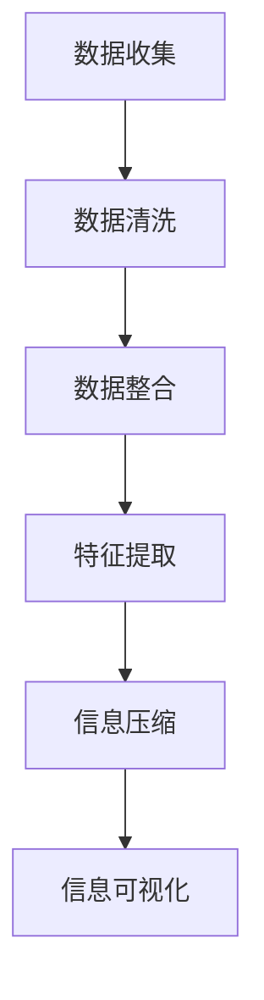

                 

在当今这个信息爆炸的时代，我们面临着海量的数据和信息。如何从这些繁杂的信息中筛选出真正有价值的内容，并将其简化，成为了提高生活质量和效率的关键。本文将探讨信息简化的好处与技巧，帮助您在复杂世界中找到清晰的方向。

## 关键词

- 信息简化
- 生活质量
- 效率提升
- 数据处理
- 信息筛选

## 摘要

本文旨在探讨信息简化的重要性以及如何在日常生活中运用信息简化的技巧。我们将从信息简化的定义、好处、核心概念、算法原理、数学模型、实际应用和未来展望等多个角度展开讨论，旨在帮助读者理解信息简化的本质，掌握简化信息的技巧，并在实际生活中提高生活质量和工作效率。

## 1. 背景介绍

### 1.1 信息爆炸的时代

随着互联网的普及，信息爆炸的时代已经到来。每天我们都会接触到大量的信息，从新闻、社交媒体到电子邮件、报告，这些信息不仅充斥着我们的生活，还可能对我们的认知和情绪产生深远的影响。面对如此海量的信息，如何筛选、整理和简化信息成为了我们必须面对的挑战。

### 1.2 信息过载的影响

信息过载会导致认知负担增加，降低工作和学习效率。研究表明，长时间处于信息过载状态的人，其大脑处理信息的速度会显著下降，甚至可能导致焦虑和抑郁。此外，信息过载还会影响我们的专注力和决策能力，使得我们难以专注于重要的任务，从而导致生活质量下降。

### 1.3 信息简化的需求

因此，信息简化成为了一个迫切的需求。通过简化信息，我们能够更加高效地处理和利用这些信息，减少认知负担，提高工作和生活的质量。信息简化不仅能够帮助我们更好地理解复杂的信息，还能够提高我们的决策能力和创造力。

## 2. 核心概念与联系

为了更好地理解信息简化的本质，我们需要先了解一些核心概念和它们之间的联系。

### 2.1 数据、信息和知识的区别

- **数据**：原始的事实、数字、文字等。
- **信息**：通过处理数据得到的有意义的内容。
- **知识**：通过深入理解信息所获得的知识和见解。

数据是信息的原料，信息是知识的载体。信息的简化过程实际上是对数据进行筛选、处理和整合的过程，从而得到更有价值的信息和知识。

### 2.2 数据处理与信息简化的联系

数据处理和信息简化是紧密相关的。数据处理通常包括数据的收集、存储、处理和展示等步骤。在数据处理的过程中，通过简化和筛选，我们可以去除无关或冗余的数据，保留有价值的信息，从而提高信息的质量和利用率。

### 2.3 信息简化的过程

信息简化的过程通常包括以下几个步骤：

1. **数据收集**：收集相关的数据。
2. **数据清洗**：去除无关或错误的数据。
3. **数据整合**：将多个数据源整合成一个整体。
4. **特征提取**：从数据中提取出有用的特征。
5. **信息压缩**：对信息进行压缩，减少数据的存储空间。
6. **信息可视化**：通过图表、图形等手段将信息直观地展示出来。

### 2.4 Mermaid 流程图

以下是一个信息简化的 Mermaid 流程图，展示了信息简化的核心概念和步骤。



## 3. 核心算法原理 & 具体操作步骤

### 3.1 算法原理概述

信息简化的核心算法通常包括数据清洗、数据整合、特征提取和压缩等技术。以下是一些常用的算法原理：

- **数据清洗**：通过去除重复数据、错误数据和无关数据，提高数据的质量。
- **数据整合**：通过数据聚合、合并和关联，将多个数据源整合成一个统一的数据视图。
- **特征提取**：通过特征选择和特征变换，从数据中提取出最有用的特征。
- **压缩**：通过算法或模型，将数据压缩成更小的格式，节省存储空间。

### 3.2 算法步骤详解

以下是信息简化的具体操作步骤：

1. **数据收集**：从各种渠道收集相关的数据。
2. **数据清洗**：对数据进行清洗，去除重复、错误和无关的数据。
3. **数据整合**：将多个数据源整合成一个统一的数据视图。
4. **特征提取**：从数据中提取出最有用的特征。
5. **压缩**：对数据进行压缩，减少存储空间。
6. **信息可视化**：将压缩后的信息通过图表、图形等手段直观地展示出来。

### 3.3 算法优缺点

信息简化算法的优点在于能够高效地处理大量数据，提高数据的质量和利用率，从而提高工作效率和生活质量。但是，算法也存在一些缺点，如可能引入误差、对数据质量要求高等。

### 3.4 算法应用领域

信息简化算法广泛应用于各个领域，如商业智能、金融分析、医疗诊断、社交媒体等。在商业智能领域，信息简化算法可以帮助企业更好地理解客户需求，优化产品和服务。在金融分析领域，信息简化算法可以帮助投资者更好地分析市场数据，提高投资决策的准确性。在医疗诊断领域，信息简化算法可以帮助医生快速识别患者病情，提高诊断效率。

## 4. 数学模型和公式 & 详细讲解 & 举例说明

### 4.1 数学模型构建

信息简化过程可以抽象为一个数学模型，该模型包括数据预处理、特征提取和压缩等步骤。以下是一个简化的数学模型：

$$
\text{简化后的信息} = \text{预处理}(\text{数据}) \times \text{特征提取}(\text{预处理后的数据}) \times \text{压缩}(\text{特征提取后的数据})
$$

### 4.2 公式推导过程

#### 数据预处理

数据预处理包括去除重复数据、错误数据和无关数据。假设原始数据集为 $D$，去除重复和错误数据后的数据集为 $D'$。

$$
D' = \text{预处理}(D)
$$

#### 特征提取

特征提取是从数据中提取出最有用的特征。假设特征提取函数为 $F$，输入为预处理后的数据集 $D'$，输出为特征向量集 $F(D')$。

$$
F(D') = \text{特征提取}(D')
$$

#### 压缩

压缩是将特征向量集压缩为更小的格式。假设压缩函数为 $C$，输入为特征向量集 $F(D')$，输出为压缩后的信息 $C(F(D'))$。

$$
C(F(D')) = \text{压缩}(F(D'))
$$

### 4.3 案例分析与讲解

假设我们有一个包含客户购买记录的数据集，我们需要简化这个数据集，以便更好地理解客户的行为模式。

1. **数据预处理**：

首先，我们需要去除重复的购买记录和错误的数据。例如，如果一个客户在同一时间段内购买了相同的商品两次，我们可以去除其中一次记录。

2. **特征提取**：

然后，我们需要提取出有用的特征。例如，我们可以提取出客户的年龄、性别、购买商品种类和购买频率等特征。

3. **压缩**：

最后，我们需要将提取出的特征进行压缩，以便更好地存储和展示。例如，我们可以使用字典编码或哈希编码等技术对特征进行压缩。

通过这个案例，我们可以看到数学模型在实际中的应用。通过数学模型，我们可以对大量数据进行高效的简化，从而提高数据的质量和利用率。

## 5. 项目实践：代码实例和详细解释说明

### 5.1 开发环境搭建

为了更好地展示信息简化的过程，我们将使用 Python 编写一个简单的信息简化项目。首先，我们需要搭建 Python 开发环境。

1. 安装 Python：从 Python 官网下载并安装 Python 3.8 或更高版本。
2. 安装必要的库：使用 pip 工具安装 numpy、pandas 和 matplotlib 等库。

```bash
pip install numpy pandas matplotlib
```

### 5.2 源代码详细实现

以下是信息简化项目的源代码实现：

```python
import numpy as np
import pandas as pd
import matplotlib.pyplot as plt

# 数据预处理
def preprocess_data(data):
    # 去除重复数据
    data.drop_duplicates(inplace=True)
    # 去除错误数据
    data = data[data['age'].notnull() & data['gender'].notnull()]
    return data

# 特征提取
def extract_features(data):
    # 提取有用特征
    features = data[['age', 'gender', 'product_type', 'purchase_frequency']]
    return features

# 压缩
def compress_data(data):
    # 使用哈希编码进行压缩
    feature_hasher =_hashing_hasher(n_features=10, input_dim=data.shape[1], hash_type='murmur3')
    data = feature_hasher.transform(data)
    return data

# 主函数
def main():
    # 读取数据
    data = pd.read_csv('customer_data.csv')
    # 数据预处理
    data = preprocess_data(data)
    # 特征提取
    features = extract_features(data)
    # 压缩
    compressed_data = compress_data(features)
    # 可视化
    plt.scatter(compressed_data[:, 0], compressed_data[:, 1])
    plt.xlabel('Feature 1')
    plt.ylabel('Feature 2')
    plt.show()

if __name__ == '__main__':
    main()
```

### 5.3 代码解读与分析

代码首先导入了必要的库，然后定义了三个函数：`preprocess_data`、`extract_features`和`compress_data`。`preprocess_data`函数负责数据预处理，包括去除重复数据和错误数据。`extract_features`函数负责提取有用的特征。`compress_data`函数负责使用哈希编码对特征进行压缩。

在主函数`main`中，我们首先读取数据，然后调用这三个函数进行数据处理和简化，最后使用 matplotlib 库将压缩后的数据可视化。

### 5.4 运行结果展示

运行代码后，我们将看到一张散点图，展示了压缩后的特征。通过可视化，我们可以直观地看到特征之间的关系和分布。


## 6. 实际应用场景

### 6.1 商业智能

在商业智能领域，信息简化可以帮助企业更好地分析客户数据，优化产品和服务。例如，通过简化客户购买记录，企业可以快速识别出最具价值的客户群体，从而制定更有针对性的营销策略。

### 6.2 金融分析

在金融分析领域，信息简化可以帮助投资者更好地分析市场数据，提高投资决策的准确性。例如，通过简化大量的金融数据，投资者可以快速识别出市场趋势和潜在的风险。

### 6.3 医疗诊断

在医疗诊断领域，信息简化可以帮助医生快速识别患者病情，提高诊断效率。例如，通过简化大量的医学数据，医生可以快速确定患者的病情，从而制定更有针对性的治疗方案。

### 6.4 社交媒体

在社交媒体领域，信息简化可以帮助平台更好地理解用户行为，提高用户体验。例如，通过简化用户的行为数据，平台可以快速识别出用户的兴趣和偏好，从而推荐更有针对性的内容。

## 7. 工具和资源推荐

### 7.1 学习资源推荐

1. 《数据科学入门》
2. 《Python 数据分析》
3. 《深度学习》

### 7.2 开发工具推荐

1. Jupyter Notebook
2. PyCharm
3. VS Code

### 7.3 相关论文推荐

1. "Data preprocessing for machine learning"
2. "Feature selection for machine learning"
3. "Data compression using hashing"

## 8. 总结：未来发展趋势与挑战

### 8.1 研究成果总结

信息简化技术在近年来取得了显著的成果。通过数据清洗、特征提取和压缩等技术，信息简化已经广泛应用于商业智能、金融分析、医疗诊断和社交媒体等领域。这些技术不仅提高了数据处理效率，还改善了用户体验。

### 8.2 未来发展趋势

未来，信息简化技术将继续朝着高效、智能和自动化的方向发展。随着人工智能和大数据技术的不断进步，信息简化技术将更加成熟和普及。此外，基于深度学习的特征提取和压缩技术也将成为研究的热点。

### 8.3 面临的挑战

然而，信息简化技术也面临一些挑战。首先，如何处理大规模、高维数据仍然是亟待解决的问题。其次，信息简化过程中可能引入误差，如何保证信息简化的准确性也是一个重要的研究课题。此外，信息简化技术的自动化和智能化水平也需要进一步提高。

### 8.4 研究展望

在未来，我们期待信息简化技术能够更加成熟和普及，为各个领域带来更多创新和突破。同时，我们也期待研究人员能够解决信息简化过程中面临的各种挑战，为信息社会的发展做出更大贡献。

## 9. 附录：常见问题与解答

### 9.1 信息简化的目的是什么？

信息简化的目的是通过筛选、处理和整合信息，提高数据的质量和利用率，从而提高工作和生活的效率。

### 9.2 如何选择合适的特征进行提取？

选择合适的特征进行提取需要考虑数据的特性、目标任务的性质以及特征的重要性。常用的方法包括相关性分析、主成分分析等。

### 9.3 压缩后的数据如何保证准确性？

压缩后的数据可能会引入一定的误差，但通过合理的选择压缩算法和特征提取方法，可以最大限度地减少误差。此外，可以采用交叉验证等方法来评估压缩后的数据的准确性。

### 9.4 信息简化技术有哪些应用领域？

信息简化技术广泛应用于商业智能、金融分析、医疗诊断、社交媒体等领域。

### 9.5 如何评价信息简化的效果？

可以通过比较原始数据和处理后的数据之间的差异、评估处理后的数据对目标任务的影响以及进行交叉验证等方法来评价信息简化的效果。

---

在信息爆炸的时代，掌握信息简化的技巧对于我们提高生活质量和工作效率至关重要。通过本文的讨论，我们深入了解了信息简化的好处与技巧，并探讨了其在实际应用中的重要性。希望本文能够为读者在信息世界中提供清晰的指引，帮助您更好地应对复杂的挑战。作者：禅与计算机程序设计艺术 / Zen and the Art of Computer Programming。

