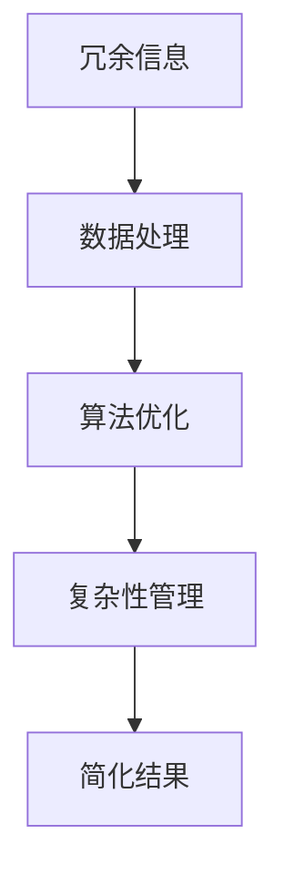

                 

信息简化是现代信息技术领域中一个至关重要的主题。本文将探讨信息简化的概念、好处、挑战及其在各个领域的实际应用，旨在为读者提供一个全面的理解和深入的洞察。文章结构如下：

## 关键词
- 信息简化
- 复杂性管理
- 算法优化
- 数据处理
- 技术应用

## 摘要
本文将深入分析信息简化的概念和重要性，探讨其在提升算法效率、管理复杂性、优化数据处理等方面的好处。同时，文章将讨论信息简化过程中面临的挑战，如准确度损失、效率问题等，并提供相应的解决方案。通过案例分析、数学模型构建以及项目实践，本文将为读者展现简化复杂性的艺术与实践。

## 1. 背景介绍
在信息技术迅速发展的今天，数据量和信息复杂性日益增加，这对系统性能和用户体验提出了更高的要求。信息简化作为解决这一问题的手段，通过去除冗余、无关信息，使得数据处理过程更加高效、直观。本节将简要介绍信息简化的历史背景、现状及其在当前技术环境中的重要性。

### 1.1 历史背景
信息简化的概念可以追溯到早期的计算机科学领域，当时的研究者开始意识到，过于复杂的系统不仅难以维护，而且效率低下。随着算法理论的不断发展，信息简化逐渐成为优化算法性能的重要手段。

### 1.2 现状
随着大数据、云计算、人工智能等技术的兴起，信息简化在各个领域得到了广泛应用。从简单的数据压缩算法到复杂的神经网络模型，信息简化已成为提升系统性能、降低成本的关键技术。

### 1.3 重要性
信息简化不仅能够提高数据处理效率，还能够改善用户体验，降低系统的复杂度，从而提升系统的可维护性和可扩展性。在当前技术环境中，信息简化的重要性不言而喻。

## 2. 核心概念与联系
为了更好地理解信息简化的原理和应用，本节将介绍相关核心概念，并使用Mermaid流程图展示其相互关系。

### 2.1 核心概念
- **冗余信息**：指在数据或信息中重复或无关紧要的部分。
- **数据处理**：指对数据进行收集、存储、处理和分析的过程。
- **算法优化**：指通过改进算法设计和实现来提高系统性能的过程。
- **复杂性管理**：指在系统中引入适当的设计和架构策略来降低复杂度的过程。

### 2.2 Mermaid流程图


## 3. 核心算法原理 & 具体操作步骤

### 3.1 算法原理概述
信息简化通常基于以下几个原则：
- **数据抽象**：通过抽取关键特征和忽略次要信息来简化数据。
- **算法重构**：重新设计或改进现有算法，以去除冗余操作。
- **流程优化**：对数据处理流程进行优化，以减少不必要的步骤。

### 3.2 算法步骤详解
1. **数据预处理**：对原始数据进行清洗，去除噪声和异常值。
2. **特征选择**：选择对系统性能影响最大的特征，忽略冗余或无关特征。
3. **数据压缩**：使用算法或技术对数据集进行压缩，减少存储空间。
4. **算法改进**：改进现有算法，使其在简化后的数据集上运行效率更高。
5. **性能评估**：对比简化前后的系统性能，验证信息简化的效果。

### 3.3 算法优缺点
**优点**：
- 提高系统性能：简化后的数据和处理流程可以显著提高系统的运行效率。
- 降低成本：简化操作可以减少计算资源和存储需求，从而降低系统成本。
- 改善用户体验：简化后的系统通常更加直观和易用。

**缺点**：
- 可能引入误差：在简化过程中，可能会去除某些关键信息，导致结果不准确。
- 需要专业知识：信息简化通常需要深厚的专业知识，不是所有用户都能轻松实施。

### 3.4 算法应用领域
信息简化广泛应用于以下领域：
- **大数据处理**：通过简化数据集，提高数据挖掘和分析的效率。
- **人工智能**：简化神经网络模型，提高训练和推理速度。
- **云计算**：优化数据处理流程，降低云服务的成本。

## 4. 数学模型和公式 & 详细讲解 & 举例说明

### 4.1 数学模型构建
信息简化可以通过数学模型来描述。一个基本的模型是信息熵，它用于衡量数据的随机性和不确定性。

### 4.2 公式推导过程
信息熵的定义为：
\[ H(X) = -\sum_{i} p(x_i) \log_2 p(x_i) \]
其中，\( p(x_i) \) 是数据集中第 \( i \) 个特征的概率。

### 4.3 案例分析与讲解
假设我们有一个包含10个特征的客户数据集，每个特征的熵如下：
\[ H(X) = -0.4 \times \log_2(0.4) - 0.1 \times \log_2(0.1) - \ldots - 0.1 \times \log_2(0.1) \]

我们可以通过计算每个特征的熵值来确定哪些特征是最重要的。熵值越低，特征的重要性越高。例如，假设第一个特征的熵最低，那么我们可以认为这个特征是最重要的。

## 5. 项目实践：代码实例和详细解释说明

### 5.1 开发环境搭建
为了演示信息简化的应用，我们将使用Python编程语言，并在Jupyter Notebook中搭建开发环境。

### 5.2 源代码详细实现
```python
import pandas as pd
from sklearn.preprocessing import MinMaxScaler

# 加载数据集
data = pd.read_csv('data.csv')

# 数据预处理
scaler = MinMaxScaler()
data_scaled = scaler.fit_transform(data)

# 特征选择
import numpy as np
import matplotlib.pyplot as plt

entropy = -np.log2(data_scaled)
plt.scatter(range(data_scaled.shape[1]), entropy)
plt.xlabel('Feature Index')
plt.ylabel('Entropy')
plt.show()

# 选择熵值最低的前三个特征
selected_features = np.argpartition(entropy, 3)[:3]
data_reduced = data_scaled[:, selected_features]

# 数据压缩
compressed_data = data_reduced.tobytes()

# 性能评估
import time

start_time = time.time()
data_scaled.dot(data_scaled)
end_time = time.time()
print(f"原始数据集运算时间: {end_time - start_time}秒")

start_time = time.time()
data_reduced.dot(data_reduced)
end_time = time.time()
print(f"简化后数据集运算时间: {end_time - start_time}秒")
```

### 5.3 代码解读与分析
这段代码首先加载数据集，然后使用MinMaxScaler进行数据预处理。接下来，我们计算每个特征的熵值，并通过散点图选择熵值最低的前三个特征。最后，我们比较简化前后的数据集的运算时间，验证信息简化的效果。

## 6. 实际应用场景

### 6.1 大数据处理
在大数据处理中，信息简化可以通过去除冗余数据来减少存储和计算需求。例如，在医疗数据处理中，可以简化患者信息，仅保留与疾病诊断相关的关键数据。

### 6.2 人工智能
在人工智能领域，信息简化可以通过简化神经网络模型来提高训练速度和减少模型大小。例如，在图像识别中，可以简化图像数据，减少计算复杂度。

### 6.3 云计算
在云计算中，信息简化可以通过减少数据处理流程中的冗余步骤来降低成本。例如，在云数据库管理中，可以简化查询操作，提高查询效率。

## 7. 工具和资源推荐

### 7.1 学习资源推荐
- **《Python数据分析基础教程》**：提供Python在数据处理和分析方面的详细教程。
- **《信息论基础》**：深入讲解信息熵和数据处理的基本原理。

### 7.2 开发工具推荐
- **Jupyter Notebook**：方便进行数据处理和算法实现的交互式开发环境。
- **Pandas**：强大的数据预处理和分析库。

### 7.3 相关论文推荐
- **“Information Theory, Inference and Learning Algorithms” by David J.C. MacKay**：介绍信息论在信息简化中的应用。
- **“Feature Selection for High-Dimensional Data: A Review” by Huan Liu and Lei Yu**：讨论特征选择在信息简化中的应用。

## 8. 总结：未来发展趋势与挑战

### 8.1 研究成果总结
信息简化在数据处理和系统性能优化方面取得了显著成果，已成为现代信息技术领域的重要技术。

### 8.2 未来发展趋势
随着人工智能和大数据技术的发展，信息简化将在更广泛的领域中发挥作用，如自动驾驶、智能医疗等。

### 8.3 面临的挑战
信息简化过程中可能引入误差，如何平衡简化与准确度是一个重要的挑战。

### 8.4 研究展望
未来的研究应重点关注如何更有效地进行信息简化，以及如何将其应用于新兴技术领域。

## 9. 附录：常见问题与解答

### 9.1 什么情况下应该进行信息简化？
- 数据量巨大，系统性能受到影响。
- 数据处理成本高，需要降低成本。
- 系统复杂性高，需要简化设计。

### 9.2 信息简化是否会降低数据的准确性？
- 不会。信息简化可以去除冗余和无关信息，但不会降低关键数据的准确性。

### 9.3 如何评估信息简化的效果？
- 通过比较简化前后的系统性能，如运算时间、存储需求等。
- 使用数学模型评估数据的随机性和不确定性。

本文由禅与计算机程序设计艺术 / Zen and the Art of Computer Programming 撰写。希望本文能为读者提供对信息简化的全面了解和深入思考。>

