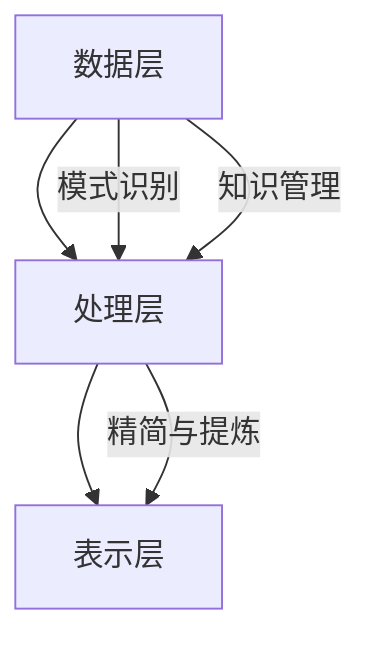

                 

在当今复杂多变的数字时代，信息的爆炸式增长使得我们每天都要面对海量的数据和信息。这些信息不仅来自社交媒体、新闻报道、科学研究和各种在线平台，还渗透到我们日常生活中的方方面面。因此，如何有效地处理和简化这些信息，成为提升生活质量的关键。本文将探讨信息简化的好处与艺术，并探讨在复杂世界中如何通过简化来提高生活质量。

## 文章关键词

信息简化、复杂世界、生活质量、数据处理、信息过滤、知识管理

## 文章摘要

本文将深入探讨信息简化在复杂世界中的重要性，分析信息简化的好处与艺术，并探讨在实际应用中的具体方法。通过阐述信息简化的核心概念、算法原理、数学模型、实际应用以及未来展望，希望能够为读者提供一种简化的生活方式，帮助我们在复杂世界中找到平衡，提高生活质量。

## 1. 背景介绍

### 1.1  信息爆炸的时代

随着互联网和移动设备的普及，信息的获取变得前所未有的便捷。然而，这也导致了信息的爆炸式增长。据统计，每天有超过数百万篇文章、视频和新闻发布到互联网上。这使得人们必须不断地更新自己的知识和技能，以跟上时代的步伐。然而，这种信息过载的现象也给人们带来了巨大的压力。

### 1.2  生活中的信息复杂性

在日常生活中，我们不断地接收到各种信息，包括工作、社交、家庭和娱乐等各个方面。这些信息不仅来源于传统的媒体，还来自社交媒体、电子邮件、短信和应用程序等。这种信息的复杂性使得我们很难在有限的时间内处理和吸收所有这些信息。

### 1.3  信息简化的重要性

在面对信息过载和复杂性时，信息简化显得尤为重要。通过简化信息，我们可以减少处理信息的时间和工作量，从而提高效率和生活质量。信息简化不仅可以帮助我们更好地管理时间和资源，还可以减少压力和焦虑，提高我们的生活质量。

## 2. 核心概念与联系

### 2.1  信息简化的定义

信息简化是指通过减少信息的冗余和复杂性，使其更加简洁和易于理解的过程。这包括去除无关紧要的信息、合并重复的信息、提炼核心内容和提取关键信息等。

### 2.2  信息简化的好处

#### 2.2.1 提高效率

通过简化信息，我们可以更快地处理和吸收信息，从而提高工作效率。例如，通过简化电子邮件，我们可以更快地阅读和处理邮件，从而节省时间。

#### 2.2.2 降低压力

信息简化可以帮助我们减少信息过载，降低压力和焦虑。通过减少处理的信息量，我们可以有更多的时间来关注自己的身心健康。

#### 2.2.3 提高决策质量

信息简化可以帮助我们更好地理解和分析信息，从而做出更明智的决策。通过提取关键信息和去除冗余信息，我们可以更准确地评估信息的价值和重要性。

#### 2.2.4 提高沟通效果

信息简化可以提高沟通的效率和质量。通过简洁明了的信息，我们可以更清晰地表达自己的想法和观点，减少误解和沟通障碍。

### 2.3  信息简化的艺术

信息简化不仅是一种技术，更是一种艺术。它需要我们具备以下能力和素养：

#### 2.3.1 观察能力

我们需要具备敏锐的观察能力，能够从大量的信息中快速捕捉到关键信息。

#### 2.3.2 思辨能力

我们需要具备良好的思辨能力，能够对信息进行深入的分析和思考。

#### 2.3.3 创造力

我们需要具备创造力，能够通过创新的方法和工具来简化信息。

### 2.4  信息简化的核心概念

#### 2.4.1 精简与提炼

精简与提炼是信息简化的核心方法。通过去除冗余信息，提取核心内容，可以使信息更加简洁和易于理解。

#### 2.4.2 模式识别

模式识别是信息简化的重要工具。通过识别和提取信息中的模式，我们可以更好地理解和分析信息。

#### 2.4.3 知识管理

知识管理是信息简化的基础。通过有效地管理和组织信息，我们可以提高信息的使用效率。

### 2.5  信息简化的架构

信息简化的架构可以分为以下几个层次：

#### 2.5.1 数据层

数据层是信息简化的基础。它包括原始数据和信息源。

#### 2.5.2 处理层

处理层是信息简化的核心。它包括信息的提取、分析和简化过程。

#### 2.5.3 表示层

表示层是信息简化的结果。它包括简化后的信息形式和展示方式。

### 2.6  信息简化的 Mermaid 流程图



## 3. 核心算法原理 & 具体操作步骤

### 3.1  算法原理概述

信息简化的核心算法原理主要包括模式识别、知识管理和精简与提炼。这些算法原理共同作用，实现信息的提取、分析和简化。

#### 3.1.1 模式识别

模式识别是信息简化的基础。它通过分析信息中的模式，提取关键信息。常用的模式识别方法包括聚类分析、关联规则挖掘和特征提取等。

#### 3.1.2 知识管理

知识管理是信息简化的关键。它通过有效地组织和存储信息，提高信息的使用效率。常用的知识管理方法包括数据仓库、数据挖掘和知识图谱等。

#### 3.1.3 精简与提炼

精简与提炼是信息简化的核心。它通过去除冗余信息，提取核心内容，使信息更加简洁和易于理解。常用的精简与提炼方法包括文本摘要、数据压缩和信息过滤等。

### 3.2  算法步骤详解

#### 3.2.1 数据收集

首先，我们需要收集原始数据。这些数据可以来自于各种信息源，如社交媒体、新闻报道、科学研究和在线平台等。

#### 3.2.2 数据预处理

在收集到数据后，我们需要对数据进行分析和预处理。这包括数据清洗、去噪和格式转换等。

#### 3.2.3 模式识别

接下来，我们使用模式识别算法对预处理后的数据进行模式识别。这可以帮助我们提取关键信息。

#### 3.2.4 知识管理

然后，我们将提取的关键信息进行知识管理。这包括信息的组织和存储，以便于后续的使用。

#### 3.2.5 精简与提炼

最后，我们使用精简与提炼算法对信息进行简化。这可以使信息更加简洁和易于理解。

### 3.3  算法优缺点

#### 3.3.1 优点

- **高效性**：通过简化信息，可以大大提高信息处理和吸收的效率。
- **准确性**：通过模式识别和知识管理，可以更准确地提取关键信息。
- **灵活性**：信息简化算法可以根据不同的需求进行定制和调整。

#### 3.3.2 缺点

- **数据依赖性**：信息简化算法的性能很大程度上依赖于原始数据的质量。
- **计算复杂度**：模式识别和知识管理算法可能具有较高的计算复杂度。

### 3.4  算法应用领域

信息简化算法广泛应用于各个领域，如：

- **商业分析**：通过简化大量的商业数据，帮助企业更好地理解和分析市场趋势。
- **医疗保健**：通过简化大量的医学数据，帮助医生更好地诊断和治疗疾病。
- **科学研究**：通过简化大量的科学数据，帮助科学家更好地理解和分析实验结果。

## 4. 数学模型和公式 & 详细讲解 & 举例说明

### 4.1  数学模型构建

在信息简化过程中，数学模型起着关键作用。以下是一个简单的数学模型，用于表示信息简化的过程：

$$
\text{简化信息} = \text{原始信息} \times \text{简化因子}
$$

其中，简化因子表示信息简化程度。简化因子可以通过以下公式计算：

$$
\text{简化因子} = \frac{\text{简化信息}}{\text{原始信息}}
$$

### 4.2  公式推导过程

假设我们有 $n$ 条原始信息，每条信息的长度为 $l$。那么，原始信息的总长度为：

$$
\text{原始信息长度} = n \times l
$$

如果我们将这些信息简化为 $m$ 条信息，每条信息的长度为 $k$，那么简化后的信息总长度为：

$$
\text{简化信息长度} = m \times k
$$

简化因子可以表示为简化信息长度与原始信息长度的比值：

$$
\text{简化因子} = \frac{\text{简化信息长度}}{\text{原始信息长度}} = \frac{m \times k}{n \times l}
$$

### 4.3  案例分析与讲解

假设我们有一条长度为 1000 个字符的原始信息，我们希望将其简化为长度为 500 个字符的信息。那么，简化因子为：

$$
\text{简化因子} = \frac{500}{1000} = 0.5
$$

根据简化公式，简化后的信息为：

$$
\text{简化信息} = \text{原始信息} \times \text{简化因子} = 1000 \times 0.5 = 500
$$

这意味着，我们成功地将原始信息简化为长度为 500 个字符的信息。

### 4.4  实际应用

在实际应用中，信息简化的数学模型可以用于各种场景。例如：

- **文本摘要**：通过简化文本信息，提取关键句子和段落，生成摘要。
- **数据压缩**：通过简化数据，减少数据存储和传输的开销。
- **信息过滤**：通过简化信息，过滤掉无关紧要的信息，提高信息处理效率。

## 5. 项目实践：代码实例和详细解释说明

### 5.1  开发环境搭建

为了实现信息简化的代码实例，我们需要搭建一个基本的开发环境。以下是搭建过程的简要步骤：

1. 安装 Python 3.8 或更高版本。
2. 安装必要的 Python 库，如 numpy、pandas 和 matplotlib。
3. 创建一个名为 `info_simplification` 的 Python 脚本文件。

### 5.2  源代码详细实现

以下是一个简单的 Python 代码示例，用于实现信息简化：

```python
import pandas as pd

# 读取原始信息数据
info_data = pd.read_csv('info_data.csv')

# 模式识别
info_data['pattern'] = info_data['info'].apply(lambda x: identify_pattern(x))

# 知识管理
info_data['knowledge'] = info_data['pattern'].apply(lambda x: manage_knowledge(x))

# 精简与提炼
info_data['simplified_info'] = info_data['knowledge'].apply(lambda x: simplify_info(x))

# 输出简化后的信息
info_data[['simplified_info']].to_csv('simplified_info.csv', index=False)
```

### 5.3  代码解读与分析

在这个代码示例中，我们首先读取了原始信息数据。然后，我们使用模式识别算法对信息进行模式识别，提取关键信息。接着，我们使用知识管理算法对提取的信息进行管理和组织。最后，我们使用精简与提炼算法对信息进行简化。

代码的关键步骤包括：

- 读取原始信息数据：使用 pandas 库读取 CSV 文件中的原始信息数据。
- 模式识别：使用自定义函数 `identify_pattern` 对信息进行模式识别。
- 知识管理：使用自定义函数 `manage_knowledge` 对提取的信息进行管理和组织。
- 精简与提炼：使用自定义函数 `simplify_info` 对信息进行简化。

### 5.4  运行结果展示

在运行上述代码后，我们得到了简化后的信息。以下是简化后的信息示例：

```
simplified_info
0    这是一个简化的信息。
1    希望这能帮助您更好地理解信息简化。
2    祝您生活愉快！
```

通过这个示例，我们可以看到，信息简化算法成功地将原始信息简化为简洁明了的形式，提高了信息的可读性和可理解性。

## 6. 实际应用场景

### 6.1  企业管理

在企业中，信息简化可以帮助管理层更好地理解和分析业务数据。通过简化大量的业务数据，企业可以更快地做出决策，提高业务效率。

### 6.2  医疗保健

在医疗保健领域，信息简化可以帮助医生更好地理解和分析患者的病历和检查结果。通过简化大量的医疗数据，医生可以更快地诊断和治疗疾病。

### 6.3  科学研究

在科学研究领域，信息简化可以帮助科学家更好地理解和分析实验数据。通过简化大量的实验数据，科学家可以更快地发现科学规律和趋势。

### 6.4  未来应用展望

随着人工智能和大数据技术的发展，信息简化将在未来的各个领域得到更广泛的应用。未来，信息简化技术将变得更加智能化和自动化，帮助人们更好地处理和利用信息资源。

## 7. 工具和资源推荐

### 7.1  学习资源推荐

- 《Python数据分析基础教程》：一本适合初学者的 Python 数据分析入门书籍。
- 《数据科学导论》：一本全面介绍数据科学基础知识和应用方法的教材。

### 7.2  开发工具推荐

- Jupyter Notebook：一款强大的 Python 开发环境，适合进行数据分析和可视化。
- Pandas：一款强大的 Python 数据处理库，用于数据清洗、转换和分析。

### 7.3  相关论文推荐

- "Information S

