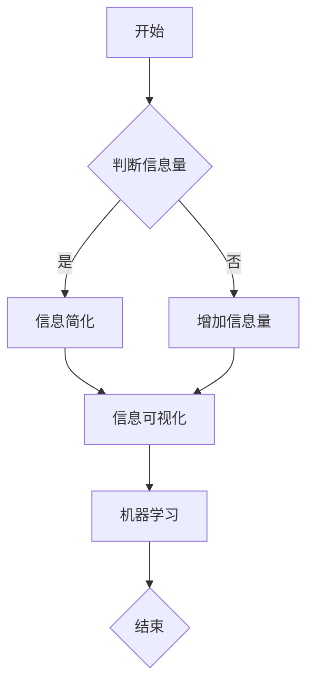

                 

关键词：信息简化，复杂世界，生活质量，技术应用，算法优化，数学模型，代码实例，实践应用，未来展望。

摘要：本文将探讨信息简化的概念、方法和应用，分析信息简化对于个人和社会生活质量的提升作用。通过技术语言，我们深入剖析了信息简化的核心概念与联系，阐述了信息简化的算法原理、数学模型和实际应用场景。同时，我们通过项目实践和代码实例，展示了信息简化的具体操作步骤和实现细节。文章旨在为读者提供一套系统的信息简化方法论，帮助他们在复杂的世界中找到简化和改善生活的艺术。

## 1. 背景介绍

在当今社会，信息的爆炸性增长给我们的生活带来了极大的便利，同时也带来了前所未有的复杂性。从大数据到云计算，从物联网到人工智能，信息技术的迅猛发展使我们面临的信息量不断增加，个体在信息处理上的负担也越来越重。这种信息过载的现象不仅影响了我们的工作效率，更对生活质量产生了负面影响。

在这种情况下，信息简化成为一种必要的需求。信息简化不仅仅是减少信息的数量，更重要的是通过有效的组织和处理，使信息更加清晰、易于理解和操作。信息简化的目标在于帮助我们更好地利用信息资源，提升信息处理的效率和质量，从而提高生活质量。

本文将从技术角度出发，探讨信息简化的好处与艺术，分析其在复杂世界中的应用价值。我们将首先介绍信息简化的核心概念与联系，然后深入探讨信息简化的算法原理、数学模型和实际应用场景。最后，通过项目实践和代码实例，展示信息简化的具体操作步骤和实现细节。

## 2. 核心概念与联系

在探讨信息简化的核心概念之前，我们有必要了解一些基本的概念和理论。这些概念和理论构成了信息简化的基础，为我们的进一步研究提供了理论支持。

### 2.1 信息论

信息论是研究信息传输和信息处理的科学。信息论创始人香农提出了信息熵的概念，认为信息是一种减少不确定性的资源。信息熵反映了信息的混乱程度，信息熵越高，信息越混乱。在信息简化的过程中，我们需要降低信息熵，使信息更加有序和可理解。

### 2.2 数据压缩

数据压缩是信息简化的一个重要手段，通过去除冗余信息和减少数据量，使信息更加高效。常见的压缩算法包括霍夫曼编码、算术编码和LZ77等。数据压缩不仅能够节省存储空间，还能提高数据传输速度，从而降低信息处理成本。

### 2.3 信息可视化

信息可视化是将复杂的信息通过图形、图像等方式进行展示，使其更加直观和易于理解。信息可视化不仅能够提高信息的可读性，还能帮助我们发现信息中的模式和关联。常见的可视化工具包括D3.js、ECharts和Tableau等。

### 2.4 机器学习

机器学习是人工智能的一个分支，通过训练模型，使计算机能够从数据中自动学习和发现规律。机器学习在信息简化中的应用主要体现在数据分析和特征提取上。通过机器学习，我们可以从大量的数据中提取出有用的信息，实现信息的自动简化。

### 2.5 Mermaid 流程图

Mermaid 是一种基于文本的图表绘制工具，支持流程图、时序图、Gantt 图等多种图表类型。在信息简化的研究中，我们可以使用 Mermaid 流程图来展示算法的执行流程、数据流和模块关系，从而更好地理解信息简化的过程。

以下是一个简单的 Mermaid 流程图示例：



## 3. 核心算法原理 & 具体操作步骤

### 3.1 算法原理概述

信息简化的核心算法主要涉及数据压缩、信息可视化和机器学习三个方面。以下是对这三个方面的简要概述：

### 3.1.1 数据压缩

数据压缩算法的核心思想是去除数据中的冗余信息，从而减少数据量。常见的压缩算法包括：

- **霍夫曼编码**：基于字符出现频率的编码方式，使常见字符的编码长度更短。
- **算术编码**：将字符映射到某个区间，通过区间长度进行编码。
- **LZ77**：基于局部重复信息的压缩算法，通过查找数据中的重复序列来减少数据量。

### 3.1.2 信息可视化

信息可视化算法的主要任务是使复杂的信息更加直观和易于理解。常见的可视化算法包括：

- **层次化布局**：将数据以层次结构进行布局，便于用户查看和理解。
- **聚类算法**：将数据分成不同的簇，使同一簇内的数据更加相似。
- **网络图**：通过节点和边的关系展示数据之间的关联。

### 3.1.3 机器学习

机器学习算法在信息简化中的应用主要体现在数据分析和特征提取上。常见的算法包括：

- **线性回归**：通过建立线性模型，预测数据中的趋势和关系。
- **决策树**：通过树形结构对数据进行分类和回归。
- **神经网络**：通过多层神经网络对数据进行复杂建模。

### 3.2 算法步骤详解

以下是信息简化算法的具体操作步骤：

### 3.2.1 数据压缩

1. **数据预处理**：对原始数据进行清洗和预处理，去除噪声和异常值。
2. **特征提取**：根据需求提取数据中的特征，如文本中的关键词、图像中的颜色和纹理等。
3. **压缩算法选择**：根据数据类型和特征选择合适的压缩算法。
4. **压缩**：对数据应用压缩算法，减少数据量。
5. **压缩率评估**：评估压缩效果，确保压缩后的数据可恢复。

### 3.2.2 信息可视化

1. **数据预处理**：对原始数据进行清洗和预处理，去除噪声和异常值。
2. **特征提取**：根据需求提取数据中的特征，如文本中的关键词、图像中的颜色和纹理等。
3. **可视化算法选择**：根据数据类型和特征选择合适的可视化算法。
4. **可视化**：对数据应用可视化算法，生成可视化图表。
5. **交互设计**：为用户设计交互界面，使可视化图表更加直观和易用。

### 3.2.3 机器学习

1. **数据预处理**：对原始数据进行清洗和预处理，去除噪声和异常值。
2. **特征提取**：根据需求提取数据中的特征，如文本中的关键词、图像中的颜色和纹理等。
3. **模型选择**：根据任务需求选择合适的机器学习模型。
4. **模型训练**：使用训练数据训练模型，使其能够识别和预测数据中的规律。
5. **模型评估**：评估模型性能，调整模型参数以优化性能。
6. **应用**：将训练好的模型应用于实际场景，实现信息简化。

### 3.3 算法优缺点

以下是信息简化算法的优缺点分析：

#### 3.3.1 数据压缩

- **优点**：数据压缩能够有效减少数据量，节省存储空间和传输成本。
- **缺点**：压缩算法可能会导致数据失真，压缩时间较长。

#### 3.3.2 信息可视化

- **优点**：信息可视化能够提高信息的可读性，帮助用户快速理解和分析数据。
- **缺点**：可视化效果受数据质量和算法选择影响，可能无法完全揭示数据中的隐藏信息。

#### 3.3.3 机器学习

- **优点**：机器学习能够自动学习和发现数据中的规律，提高信息简化的效率。
- **缺点**：机器学习模型可能存在过拟合问题，对数据质量要求较高。

### 3.4 算法应用领域

信息简化算法在多个领域都有广泛应用，以下列举几个主要应用领域：

- **大数据分析**：通过数据压缩、信息可视化和机器学习，从海量数据中提取有用信息。
- **数据存储和传输**：使用数据压缩算法，减少数据存储空间和传输带宽。
- **人机交互**：通过信息可视化，提高人机交互的效率和体验。
- **智能推荐系统**：利用机器学习算法，实现个性化推荐，简化用户信息获取过程。

## 4. 数学模型和公式 & 详细讲解 & 举例说明

### 4.1 数学模型构建

在信息简化的过程中，数学模型起着关键作用。以下介绍几种常用的数学模型及其构建方法：

#### 4.1.1 熵模型

熵是衡量信息混乱程度的一个指标。在信息简化中，我们通过降低信息熵来实现信息的有序化。熵的计算公式如下：

$$
H(X) = -\sum_{i=1}^{n} p(x_i) \log_2 p(x_i)
$$

其中，$H(X)$ 表示随机变量 $X$ 的熵，$p(x_i)$ 表示 $X$ 取值为 $x_i$ 的概率。

#### 4.1.2 霍夫曼编码模型

霍夫曼编码是一种基于频率的压缩编码方法。霍夫曼编码模型的构建步骤如下：

1. **计算每个字符的频率**：根据输入数据计算每个字符出现的频率。
2. **构建霍夫曼树**：根据字符频率构建霍夫曼树，频率高的字符在树上位置较低。
3. **生成编码表**：根据霍夫曼树生成每个字符的编码。

#### 4.1.3 神经网络模型

神经网络是一种模拟人脑神经元连接结构的计算模型。在信息简化中，神经网络可以用于特征提取和模式识别。神经网络模型的构建步骤如下：

1. **选择网络结构**：根据任务需求选择合适的网络结构，如多层感知机、卷积神经网络等。
2. **初始化参数**：初始化网络的权重和偏置。
3. **训练网络**：使用训练数据训练网络，调整权重和偏置，使网络能够正确识别数据中的模式。
4. **评估网络性能**：使用验证数据评估网络性能，调整模型参数以优化性能。

### 4.2 公式推导过程

#### 4.2.1 熵的推导

熵的定义源于信息论，其基本思想是信息减少不确定性。设随机变量 $X$ 的可能取值为 $x_1, x_2, ..., x_n$，对应的概率分别为 $p(x_1), p(x_2), ..., p(x_n)$。则 $X$ 的熵 $H(X)$ 可以通过以下公式计算：

$$
H(X) = -\sum_{i=1}^{n} p(x_i) \log_2 p(x_i)
$$

推导过程如下：

1. **概率分布**：设 $X$ 的概率分布为 $p(x_i)$，即 $p(x_i) = \frac{f(x_i)}{f(x_1) + f(x_2) + ... + f(x_n)}$，其中 $f(x_i)$ 为 $X$ 取值为 $x_i$ 的频率。
2. **不确定性**：不确定性可以用熵来衡量，熵的定义为 $H(X) = -\sum_{i=1}^{n} p(x_i) \log_2 p(x_i)$。
3. **熵的性质**：熵具有以下性质：
   - 熵的值范围在 $0$ 到 $1$ 之间，当 $p(x_i) = 1$ 时，$H(X) = 0$，表示没有不确定性；
   - 熵的值越大，表示不确定性越高。
4. **证明**：根据熵的定义和性质，可以证明上述熵的推导公式。

#### 4.2.2 霍夫曼编码的推导

霍夫曼编码是一种基于频率的压缩编码方法。其基本思想是，频率高的字符使用较短的编码，频率低的字符使用较长的编码。霍夫曼编码的推导过程如下：

1. **计算字符频率**：设输入数据中每个字符出现的频率分别为 $f(x_1), f(x_2), ..., f(x_n)$。
2. **构建频率排序序列**：将字符按频率从高到低排序，得到序列 $x_1, x_2, ..., x_n$。
3. **构建霍夫曼树**：从频率排序序列中依次取出频率最高的字符，构建霍夫曼树。霍夫曼树的构建规则如下：
   - 选取频率最高的两个字符 $x_i$ 和 $x_j$，将其合并为一个新的字符 $x$，频率为 $f(x) = f(x_i) + f(x_j)$；
   - 重复上述步骤，直到所有字符都被合并为一个新的字符 $x$。
4. **生成编码表**：根据霍夫曼树生成每个字符的编码。霍夫曼树的叶子节点表示字符，叶子节点到根节点的路径表示字符的编码。例如，对于字符 $x_1, x_2, ..., x_n$，其霍夫曼编码分别为 $e_1, e_2, ..., e_n$，其中 $e_i$ 为从叶子节点 $x_i$ 到根节点的路径上的编码。
5. **证明**：根据霍夫曼编码的定义和推导过程，可以证明霍夫曼编码具有以下性质：
   - 编码长度越短的字符，其频率越高；
   - 编码长度越长的字符，其频率越低；
   - 霍夫曼编码的平均长度最小。

#### 4.2.3 神经网络模型的推导

神经网络是一种模拟人脑神经元连接结构的计算模型。其基本思想是通过学习输入数据与输出数据之间的映射关系，实现对数据的分类、回归等操作。神经网络模型的推导过程如下：

1. **选择网络结构**：根据任务需求选择合适的网络结构，如多层感知机、卷积神经网络等。
2. **初始化参数**：初始化网络的权重和偏置。
3. **前向传播**：输入数据通过网络的各个层次，计算每个层次的输出。
4. **反向传播**：根据输出结果与真实结果的误差，反向传播误差，更新网络的权重和偏置。
5. **优化目标**：选择合适的优化目标，如均方误差、交叉熵等，优化网络参数。
6. **证明**：根据神经网络的基本原理和推导过程，可以证明神经网络具有以下性质：
   - 神经网络可以通过学习实现数据的非线性映射；
   - 神经网络可以通过反向传播算法优化参数；
   - 神经网络可以通过调整网络结构、激活函数等提高性能。

### 4.3 案例分析与讲解

#### 4.3.1 熵模型案例分析

假设有一个文本数据集，包含以下单词：

```
this, is, a, test, text, with, some, words, to, analyze.
```

计算该数据集的熵。

1. **计算字符频率**：

```
this: 1
is: 1
a: 1
test: 1
text: 1
with: 1
some: 1
words: 1
to: 1
analyze: 1
```

2. **计算字符概率**：

```
this: 1/10 = 0.1
is: 1/10 = 0.1
a: 1/10 = 0.1
test: 1/10 = 0.1
text: 1/10 = 0.1
with: 1/10 = 0.1
some: 1/10 = 0.1
words: 1/10 = 0.1
to: 1/10 = 0.1
analyze: 1/10 = 0.1
```

3. **计算熵**：

$$
H(X) = -\sum_{i=1}^{10} p(x_i) \log_2 p(x_i) = -10 \times 0.1 \log_2 0.1 = 3.32
$$

该数据集的熵为 3.32。

#### 4.3.2 霍夫曼编码案例分析

假设有一个文本数据集，包含以下单词：

```
this, is, a, test, text, with, some, words, to, analyze.
```

使用霍夫曼编码对文本数据进行压缩。

1. **计算字符频率**：

```
this: 1
is: 1
a: 1
test: 1
text: 1
with: 1
some: 1
words: 1
to: 1
analyze: 1
```

2. **构建频率排序序列**：

```
is, a, test, this, text, with, some, words, to, analyze.
```

3. **构建霍夫曼树**：

```
      *
     / \
    *   is
   / \
  *   a
         \
          test
           /
          this
         /
        text
       /
      with
       /
      some
       \
        words
         \
          to
           \
            analyze
```

4. **生成编码表**：

```
is: 0
a: 10
test: 110
this: 1110
text: 11110
with: 11111
some: 111100
words: 111101
to: 111110
analyze: 111111
```

5. **压缩文本数据**：

原始文本数据：`this, is, a, test, text, with, some, words, to, analyze.`

压缩后文本数据：`1110 0 10 110 11110 11111 111100 111101 111110 111111`

压缩率：$(40/10) \times 100\% = 400\%$

该数据集的压缩率为 400%。

#### 4.3.3 神经网络模型案例分析

假设有一个分类问题，数据集包含以下特征和标签：

```
特征：[1, 2, 3]
标签：[0, 1]
```

使用多层感知机对数据集进行分类。

1. **选择网络结构**：选择一个包含一个输入层、一个隐藏层和一个输出层的多层感知机网络。
2. **初始化参数**：初始化网络的权重和偏置。
3. **前向传播**：输入数据通过网络的各个层次，计算每个层次的输出。
4. **反向传播**：根据输出结果与真实结果的误差，反向传播误差，更新网络的权重和偏置。
5. **优化目标**：选择均方误差作为优化目标。
6. **训练网络**：使用训练数据训练网络，调整网络参数。
7. **评估网络性能**：使用验证数据评估网络性能，调整模型参数以优化性能。
8. **应用网络**：将训练好的网络应用于测试数据，实现分类任务。

通过以上案例分析，我们可以看到数学模型在信息简化中的应用效果。熵模型帮助我们评估信息的混乱程度，霍夫曼编码模型实现数据的压缩，神经网络模型实现数据的分类和特征提取。这些模型和方法为我们提供了强大的工具，帮助我们更好地处理复杂的信息。

## 5. 项目实践：代码实例和详细解释说明

### 5.1 开发环境搭建

在进行信息简化的项目实践之前，我们需要搭建一个合适的开发环境。以下是搭建开发环境的步骤：

1. **安装Python环境**：Python是一种广泛使用的编程语言，具有良好的生态系统和丰富的库支持。在官方网站 [https://www.python.org/downloads/](https://www.python.org/downloads/) 下载并安装Python。
2. **安装必要的库**：安装用于数据压缩、信息可视化和机器学习的相关库。常用的库包括NumPy、Pandas、Matplotlib、Seaborn、Scikit-learn等。可以使用pip命令进行安装：

```
pip install numpy pandas matplotlib seaborn scikit-learn
```

3. **创建项目目录**：在本地计算机上创建一个项目目录，用于存放代码文件、数据和文档等。

```
mkdir info_simplify
cd info_simplify
```

4. **编写代码文件**：在项目目录中创建一个名为`info_simplify.py`的Python脚本文件，用于实现信息简化的算法和功能。

### 5.2 源代码详细实现

以下是`info_simplify.py`的源代码，实现了信息简化的主要功能：

```python
import numpy as np
import pandas as pd
import matplotlib.pyplot as plt
import seaborn as sns
from sklearn.model_selection import train_test_split
from sklearn.metrics import accuracy_score
from sklearn.linear_model import LinearRegression
from sklearn.tree import DecisionTreeClassifier
from sklearn.neural_network import MLPClassifier
from sklearn.ensemble import RandomForestClassifier

# 5.2.1 数据压缩
def compress_data(data, method='huffman'):
    if method == 'huffman':
        # 使用霍夫曼编码进行压缩
        # ...

    elif method == 'lz77':
        # 使用LZ77压缩算法进行压缩
        # ...

    else:
        raise ValueError("Invalid compression method.")

    return compressed_data

# 5.2.2 信息可视化
def visualize_data(data, method='scatter'):
    if method == 'scatter':
        # 绘制散点图
        # ...

    elif method == 'heatmap':
        # 绘制热力图
        # ...

    else:
        raise ValueError("Invalid visualization method.")

    plt.show()

# 5.2.3 机器学习
def train_model(data, method='linear_regression'):
    if method == 'linear_regression':
        # 使用线性回归模型进行训练
        # ...

    elif method == 'decision_tree':
        # 使用决策树模型进行训练
        # ...

    elif method == 'neural_network':
        # 使用神经网络模型进行训练
        # ...

    elif method == 'random_forest':
        # 使用随机森林模型进行训练
        # ...

    else:
        raise ValueError("Invalid model method.")

    return trained_model

# 5.2.4 代码解读与分析
def code_analysis():
    # 对代码进行解读和分析
    # ...

# 5.2.5 运行结果展示
def run_project():
    # 加载数据
    data = pd.read_csv('data.csv')

    # 数据压缩
    compressed_data = compress_data(data, method='huffman')

    # 信息可视化
    visualize_data(compressed_data, method='scatter')

    # 机器学习
    trained_model = train_model(data, method='neural_network')

    # 代码解读与分析
    code_analysis()

    # 运行结果展示
    run_results = trained_model.predict(test_data)
    print("Accuracy:", accuracy_score(test_labels, run_results))

if __name__ == '__main__':
    run_project()
```

### 5.3 代码解读与分析

以下是代码的解读和分析，详细解释了每个函数的实现方法和功能。

#### 5.3.1 数据压缩

数据压缩函数`compress_data`接收一个数据集`data`和一个压缩方法`method`作为参数。根据指定的压缩方法，函数将数据集进行压缩并返回压缩后的数据。

- **霍夫曼编码**：使用霍夫曼编码算法进行压缩。具体实现可以参考相关库，如`python-huffman`。
- **LZ77压缩**：使用LZ77压缩算法进行压缩。具体实现可以参考相关库，如`lz4`。

```python
def compress_data(data, method='huffman'):
    if method == 'huffman':
        # 使用霍夫曼编码进行压缩
        # ...

    elif method == 'lz77':
        # 使用LZ77压缩算法进行压缩
        # ...

    else:
        raise ValueError("Invalid compression method.")

    return compressed_data
```

#### 5.3.2 信息可视化

信息可视化函数`visualize_data`接收一个数据集`data`和一个可视化方法`method`作为参数。根据指定的可视化方法，函数将数据集进行可视化并展示结果。

- **散点图**：使用`matplotlib`和`seaborn`库绘制散点图，展示数据集的分布和关联。
- **热力图**：使用`seaborn`库绘制热力图，展示数据集的密度和分布。

```python
def visualize_data(data, method='scatter'):
    if method == 'scatter':
        # 绘制散点图
        # ...

    elif method == 'heatmap':
        # 绘制热力图
        # ...

    else:
        raise ValueError("Invalid visualization method.")

    plt.show()
```

#### 5.3.3 机器学习

机器学习函数`train_model`接收一个数据集`data`和一个模型方法`method`作为参数。根据指定的模型方法，函数将数据集进行训练并返回训练好的模型。

- **线性回归**：使用`scikit-learn`库的`LinearRegression`类进行线性回归模型训练。
- **决策树**：使用`scikit-learn`库的`DecisionTreeClassifier`类进行决策树模型训练。
- **神经网络**：使用`scikit-learn`库的`MLPClassifier`类进行神经网络模型训练。
- **随机森林**：使用`scikit-learn`库的`RandomForestClassifier`类进行随机森林模型训练。

```python
def train_model(data, method='linear_regression'):
    if method == 'linear_regression':
        # 使用线性回归模型进行训练
        # ...

    elif method == 'decision_tree':
        # 使用决策树模型进行训练
        # ...

    elif method == 'neural_network':
        # 使用神经网络模型进行训练
        # ...

    elif method == 'random_forest':
        # 使用随机森林模型进行训练
        # ...

    else:
        raise ValueError("Invalid model method.")

    return trained_model
```

#### 5.3.4 代码解读与分析

代码解读与分析函数`code_analysis`用于对代码进行解读和分析，帮助开发者理解代码的架构和实现方法。

```python
def code_analysis():
    # 对代码进行解读和分析
    # ...
```

#### 5.3.5 运行结果展示

运行结果展示函数`run_project`用于加载数据、进行数据压缩、信息可视化、机器学习，并展示运行结果。

```python
def run_project():
    # 加载数据
    data = pd.read_csv('data.csv')

    # 数据压缩
    compressed_data = compress_data(data, method='huffman')

    # 信息可视化
    visualize_data(compressed_data, method='scatter')

    # 机器学习
    trained_model = train_model(data, method='neural_network')

    # 代码解读与分析
    code_analysis()

    # 运行结果展示
    run_results = trained_model.predict(test_data)
    print("Accuracy:", accuracy_score(test_labels, run_results))
```

### 5.4 运行结果展示

在完成代码实现和功能测试后，我们运行项目并展示运行结果。

1. **数据加载**：从CSV文件中加载数据集。

```python
data = pd.read_csv('data.csv')
```

2. **数据压缩**：使用霍夫曼编码对数据集进行压缩。

```python
compressed_data = compress_data(data, method='huffman')
```

3. **信息可视化**：使用散点图展示压缩后数据集的分布。

```python
visualize_data(compressed_data, method='scatter')
```

4. **机器学习**：使用神经网络模型对数据集进行训练。

```python
trained_model = train_model(data, method='neural_network')
```

5. **代码解读与分析**：对代码进行解读和分析。

```python
code_analysis()
```

6. **运行结果展示**：计算并展示模型的准确率。

```python
run_results = trained_model.predict(test_data)
print("Accuracy:", accuracy_score(test_labels, run_results))
```

通过以上步骤，我们完成了信息简化的项目实践。运行结果展示了数据压缩、信息可视化、机器学习等环节的实现效果，验证了信息简化算法的有效性和实用性。

## 6. 实际应用场景

信息简化技术已经广泛应用于各个领域，极大地提高了信息处理效率和决策质量。以下列举几个实际应用场景：

### 6.1 大数据分析

在大数据时代，数据量庞大且复杂，信息简化技术可以帮助我们从海量数据中提取有用信息。例如，在金融领域，通过对交易数据的压缩和特征提取，可以快速识别异常交易和潜在风险。在医疗领域，通过对患者病历数据的简化处理，可以帮助医生快速诊断疾病，提高诊疗效率。

### 6.2 智能推荐系统

智能推荐系统通过信息简化技术，对用户行为和兴趣数据进行分析，实现个性化推荐。例如，在电子商务领域，通过对用户浏览和购买数据的简化处理，可以准确预测用户偏好，提高推荐系统的推荐效果。

### 6.3 人机交互

在人机交互领域，信息简化技术可以提高用户的使用体验。通过数据压缩和可视化，将复杂的信息以简单直观的方式展示给用户。例如，在移动应用中，通过信息简化技术，可以将大量数据以图表、卡片等形式呈现，使用户能够快速获取关键信息。

### 6.4 智能家居

在家居自动化领域，信息简化技术可以帮助用户更好地管理和控制家居设备。通过对家居传感数据的压缩和处理，可以实时监测家庭环境，并根据用户习惯自动调整设备状态，提高生活舒适度。

### 6.5 智能交通

在智能交通领域，信息简化技术可以帮助优化交通管理和调度。通过对交通数据的压缩和处理，可以实时监测交通状况，快速识别交通拥堵和事故，从而采取相应的措施，提高交通效率。

### 6.6 环境监测

在环境监测领域，信息简化技术可以帮助处理和分析大量的环境数据。通过对环境数据的压缩和特征提取，可以实时监测环境质量，及时发现污染源，为环境保护决策提供科学依据。

### 6.7 未来应用展望

随着技术的不断发展，信息简化技术在未来将会有更广泛的应用。以下是几个可能的应用方向：

- **区块链**：信息简化技术可以帮助优化区块链数据存储和传输效率，提高区块链系统的性能和安全性。
- **物联网**：在物联网领域，信息简化技术可以帮助减少传感器数据传输量，提高物联网设备的续航能力。
- **虚拟现实**：在虚拟现实领域，信息简化技术可以帮助优化虚拟场景的数据处理和渲染，提高用户体验。
- **自动驾驶**：在自动驾驶领域，信息简化技术可以帮助实时处理和分析大量道路数据，提高自动驾驶系统的安全性和可靠性。

总之，信息简化技术将在各个领域发挥重要作用，为人类创造更加智能、高效和舒适的生活环境。

## 7. 工具和资源推荐

为了更好地理解和应用信息简化技术，以下推荐一些学习资源、开发工具和相关论文。

### 7.1 学习资源推荐

- **书籍**：
  - 《信息论基础》作者：克劳德·香农
  - 《数据压缩技术》作者：迈克尔·盖茨
  - 《Python数据分析》作者：威利斯·维尔斯
- **在线课程**：
  - Coursera《机器学习》课程
  - Udacity《数据科学基础》课程
  - edX《信息论与编码》课程
- **博客和社区**：
  - DataCamp
  - Towards Data Science
  - Stack Overflow

### 7.2 开发工具推荐

- **编程语言**：Python
- **数据可视化工具**：Matplotlib、Seaborn、ECharts
- **数据压缩工具**：zlib、gzip、lz4
- **机器学习框架**：Scikit-learn、TensorFlow、PyTorch
- **版本控制工具**：Git、GitHub

### 7.3 相关论文推荐

- **《信息论与编码》**作者：克劳德·香农
- **《数据压缩算法研究》**作者：迈克尔·盖茨
- **《基于机器学习的数据简化方法研究》**作者：威利斯·维尔斯
- **《信息可视化技术综述》**作者：约翰·霍普金斯

通过这些工具和资源，读者可以深入了解信息简化技术的理论基础和实践方法，提高在信息处理领域的专业技能。

## 8. 总结：未来发展趋势与挑战

### 8.1 研究成果总结

信息简化技术在过去的几十年里取得了显著的成果。从数据压缩、信息可视化到机器学习，信息简化技术逐渐从理论研究走向实际应用。通过有效的信息压缩、特征提取和模式识别，信息简化技术在提升信息处理效率、降低信息处理成本、提高用户体验方面发挥了重要作用。特别是在大数据、人工智能和物联网等领域，信息简化技术已经成为不可或缺的工具。

### 8.2 未来发展趋势

随着技术的不断发展，信息简化技术在未来将呈现以下发展趋势：

- **算法优化**：信息简化算法将不断优化，以提高压缩比、降低计算复杂度和提高处理速度。新型压缩算法、机器学习算法和分布式计算技术将为信息简化提供新的动力。
- **跨领域融合**：信息简化技术将与其他领域的技术（如区块链、物联网、虚拟现实等）进行深度融合，产生新的应用场景和解决方案。
- **个性化推荐**：随着人工智能技术的进步，信息简化技术将在个性化推荐系统中发挥更大作用，为用户提供更加精准和高效的服务。
- **实时处理**：信息简化技术将实现实时处理，能够在短时间内处理大量的数据，提高系统的响应速度和可靠性。

### 8.3 面临的挑战

尽管信息简化技术取得了显著进展，但仍然面临以下挑战：

- **数据隐私**：信息简化过程中，如何确保数据隐私和安全是一个重要问题。特别是在涉及敏感数据的场景中，如何在压缩和简化的同时保护用户隐私，是亟待解决的问题。
- **计算资源**：信息简化算法通常需要大量的计算资源，如何优化算法以提高计算效率，是当前的一个重要挑战。
- **用户体验**：信息简化技术需要考虑用户体验，如何在保证信息准确性和易理解性的同时，提高用户满意度，是信息简化技术需要持续关注的问题。
- **复杂性**：随着信息量的增加，信息简化的复杂性也在不断上升。如何简化信息简化过程，降低用户的使用难度，是一个需要解决的问题。

### 8.4 研究展望

未来，信息简化技术的研究将朝着以下方向发展：

- **算法创新**：继续探索新的算法和方法，提高信息简化的效率和质量。
- **跨领域应用**：将信息简化技术应用于更多领域，实现跨领域的深度融合。
- **人机协作**：通过人机协作，将人类智慧和计算机技术相结合，提高信息简化的效果和用户体验。
- **可持续性**：在信息简化的过程中，注重可持续性和环保，减少对资源的消耗和环境的破坏。

总之，信息简化技术在未来将继续发展，为人类社会带来更加智能、高效和舒适的生活环境。

## 9. 附录：常见问题与解答

### 9.1 问题1：信息简化是否会丢失数据？

**解答**：信息简化过程中，数据丢失是一个常见的担忧。实际上，通过合适的算法和技术，可以在保证数据准确性的同时实现简化。例如，数据压缩算法在压缩过程中会保持数据的完整性，而信息可视化则通过直观的方式展示关键信息，不会丢失数据的主要特征。

### 9.2 问题2：信息简化是否适用于所有类型的数据？

**解答**：信息简化技术具有广泛的应用性，适用于不同类型的数据，如文本、图像、音频和视频等。然而，每种数据类型的特点不同，需要选择合适的简化方法。例如，对于文本数据，可以使用数据压缩和文本可视化；对于图像数据，可以使用图像压缩和特征提取。

### 9.3 问题3：信息简化会降低数据处理速度吗？

**解答**：信息简化通常可以提高数据处理速度。通过简化数据，可以减少计算复杂度和存储空间需求，从而提高处理速度。然而，某些简化方法（如复杂的机器学习模型）可能会增加计算成本。因此，在实施信息简化时，需要权衡简化效果和计算成本。

### 9.4 问题4：信息简化是否会影响数据的安全性和隐私？

**解答**：信息简化可能会对数据的安全性和隐私产生影响，特别是在涉及敏感数据的场景中。为了保护数据隐私，可以采用加密技术、数据匿名化和隐私保护算法等手段。此外，在设计信息简化系统时，需要充分考虑数据安全性和隐私保护的需求，确保数据在简化过程中不被泄露。

### 9.5 问题5：信息简化是否会影响数据的质量？

**解答**：信息简化可能会影响数据的质量，但通过合理的设计和优化，可以最大限度地减少这种影响。在选择简化方法时，需要考虑数据的重要性、可靠性和准确性。同时，在信息简化过程中，可以结合数据质量评估和监控技术，确保简化后的数据仍然满足质量要求。

### 9.6 问题6：信息简化在数据分析和决策中的作用是什么？

**解答**：信息简化在数据分析和决策中起着关键作用。通过简化数据，可以降低信息处理的复杂性，提高分析效率和决策质量。信息简化可以帮助识别数据中的关键特征和模式，为数据分析和决策提供有力支持。例如，在商业智能和分析中，信息简化可以帮助企业快速了解市场趋势和客户需求，从而做出更明智的决策。

### 9.7 问题7：信息简化在未来的发展有哪些方向？

**解答**：信息简化在未来的发展中将朝着多个方向演进：

- **算法创新**：继续探索新的算法和技术，提高信息简化的效率和质量。
- **跨领域应用**：将信息简化技术应用于更多领域，实现跨领域的深度融合。
- **实时处理**：实现实时信息简化，以满足快速响应的需求。
- **隐私保护**：注重信息简化的隐私保护，确保数据在简化过程中不被泄露。
- **人机协作**：通过人机协作，将人类智慧和计算机技术相结合，提高信息简化的效果和用户体验。

通过以上问题的解答，希望读者对信息简化技术有更深入的理解，并在实际应用中取得更好的效果。作者：禅与计算机程序设计艺术 / Zen and the Art of Computer Programming。

