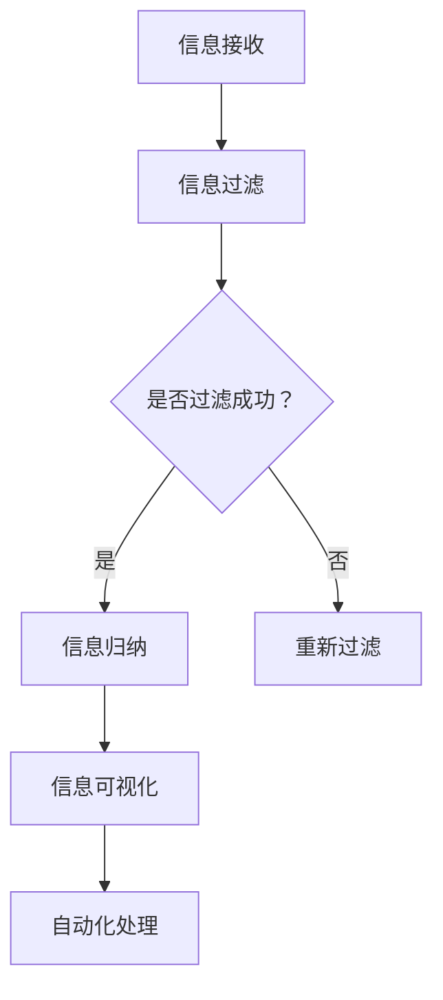

                 

关键词：信息简化、自动化、技术工具、生活工作、流程优化、效率提升、人工智能、程序设计、算法

摘要：在当今信息爆炸的时代，如何有效地简化复杂的信息处理流程，提高生活和工作效率，成为人们关注的焦点。本文将深入探讨信息简化的工具和自动化技术，从核心概念、算法原理、数学模型、项目实践等多个角度，为您展示如何利用技术简化你的生活和工作，带来前所未有的便捷和效率。

## 1. 背景介绍

随着互联网和移动设备的普及，我们每天都会接收和处理大量的信息。这些信息不仅包括社交媒体上的动态、邮件、通知，还涉及工作上的任务管理、数据分析、客户沟通等。面对如此庞大的信息量，传统的人工处理方式已经无法满足高效的需求。因此，信息简化和自动化技术应运而生。

信息简化指的是通过技术手段，对大量的信息进行筛选、归纳和整理，使其更加简洁、易于理解和操作。自动化技术则是通过预设的规则和算法，自动完成某些重复性、规律性的任务，从而减少人工干预。

本文将围绕信息简化和自动化技术，探讨以下内容：

1. 核心概念与联系
2. 核心算法原理与操作步骤
3. 数学模型与公式讲解
4. 项目实践：代码实例解析
5. 实际应用场景
6. 工具和资源推荐
7. 未来发展趋势与挑战

## 2. 核心概念与联系

### 2.1 信息简化

信息简化是自动化技术的基础。它包括以下几个关键概念：

- 信息过滤：通过算法和规则，对大量信息进行筛选，只保留有用的信息。
- 信息归纳：对筛选后的信息进行分类、总结和归纳，使其更加简洁明了。
- 信息可视化：利用图表、图形等可视化手段，将信息以直观的方式呈现出来。

### 2.2 自动化技术

自动化技术是指通过计算机程序和算法，自动完成某些任务的过程。它包括以下几个核心概念：

- 工作流：定义任务执行的顺序、规则和条件。
- 执行引擎：负责根据工作流规则，自动执行任务。
- 事件驱动：基于事件触发机制，实现任务的自动化处理。

### 2.3 信息简化和自动化的关系

信息简化和自动化技术相辅相成。信息简化提供了自动化的数据基础，而自动化技术则实现了信息简化的实际应用。例如，通过信息过滤和归纳，我们可以将大量的邮件、通知等数据进行简化，然后利用自动化技术，自动分类、标记、处理这些信息。

### 2.4 Mermaid 流程图

以下是一个简单的 Mermaid 流程图，展示信息简化和自动化技术的基本流程：



## 3. 核心算法原理与操作步骤

### 3.1 算法原理概述

在信息简化和自动化技术中，常用的算法包括数据挖掘、机器学习、自然语言处理等。这些算法通过学习大量的数据，自动提取规律和模式，从而实现信息过滤、归纳和自动化处理。

### 3.2 算法步骤详解

#### 3.2.1 数据挖掘

数据挖掘是一种通过分析大量数据，发现其中隐藏的模式和规律的方法。其主要步骤包括：

1. 数据预处理：清洗、整理和转换原始数据。
2. 特征选择：从原始数据中提取出有用的特征。
3. 模型训练：利用机器学习算法，对特征进行分类、聚类等操作。
4. 模型评估：通过交叉验证、ROC曲线等指标，评估模型的性能。

#### 3.2.2 机器学习

机器学习是一种通过算法，从数据中学习规律和模式的方法。其主要步骤包括：

1. 数据预处理：同数据挖掘。
2. 特征提取：从原始数据中提取出有用的特征。
3. 模型训练：利用梯度下降、决策树、神经网络等算法，训练模型。
4. 模型评估：同数据挖掘。

#### 3.2.3 自然语言处理

自然语言处理是一种通过算法，对文本进行理解和生成的方法。其主要步骤包括：

1. 文本预处理：分词、去停用词、词性标注等。
2. 词嵌入：将文本转换为向量表示。
3. 模型训练：利用循环神经网络、长短时记忆网络等算法，训练模型。
4. 文本分析：对文本进行分类、情感分析、实体识别等操作。

### 3.3 算法优缺点

- 数据挖掘：优点是能够从大量数据中发现潜在的规律，但缺点是需要大量的数据和计算资源，且结果可能受到数据质量和特征选择的影响。
- 机器学习：优点是能够自动提取特征，减少人工干预，但缺点是训练过程可能需要大量的时间和计算资源，且模型性能可能受到数据分布的影响。
- 自然语言处理：优点是能够对文本进行深入理解和生成，但缺点是文本数据复杂，且算法实现难度较高。

### 3.4 算法应用领域

- 数据挖掘：应用于金融、电商、医疗等领域，如风险评估、推荐系统、疾病诊断等。
- 机器学习：应用于语音识别、图像识别、自动驾驶等领域，如语音助手、人脸识别、无人驾驶汽车等。
- 自然语言处理：应用于文本分类、情感分析、机器翻译等领域，如搜索引擎、聊天机器人、自动翻译等。

## 4. 数学模型和公式讲解

### 4.1 数学模型构建

在信息简化和自动化技术中，常用的数学模型包括线性回归、逻辑回归、支持向量机等。以下是一个简单的线性回归模型构建过程：

#### 4.1.1 数据预处理

1. 数据清洗：处理缺失值、异常值等。
2. 数据标准化：将不同特征的数据缩放到相同的范围，如[0, 1]。

#### 4.1.2 特征提取

1. 特征选择：选择与目标变量相关的特征。
2. 特征工程：对特征进行转换、组合等操作。

#### 4.1.3 模型训练

1. 初始化参数：随机选择初始参数。
2. 梯度下降：迭代更新参数，使损失函数最小。

#### 4.1.4 模型评估

1. 训练集评估：计算训练集上的准确率、召回率等指标。
2. 测试集评估：计算测试集上的准确率、召回率等指标。

### 4.2 公式推导过程

线性回归模型的公式推导如下：

假设我们有一个包含n个样本的数据集，其中每个样本有m个特征，目标变量为y。我们希望找到一个线性模型，使其能够预测新的样本。

#### 4.2.1 线性回归模型

线性回归模型可以表示为：

y = w0 + w1 * x1 + w2 * x2 + ... + wm * xm

其中，w0是截距，w1, w2, ..., wm是权重。

#### 4.2.2 损失函数

为了评估模型的性能，我们使用均方误差（MSE）作为损失函数：

MSE = 1/n * Σ(yi - ŷi)2

其中，yi是实际值，ŷi是预测值。

#### 4.2.3 梯度下降

为了最小化损失函数，我们使用梯度下降算法更新权重：

w = w - α * ∇wMSE

其中，α是学习率，∇wMSE是损失函数对权重的梯度。

### 4.3 案例分析与讲解

以下是一个简单的线性回归案例，我们使用Python实现线性回归模型：

```python
import numpy as np
import matplotlib.pyplot as plt

# 数据集
x = np.array([1, 2, 3, 4, 5])
y = np.array([2, 4, 5, 4, 5])

# 初始化参数
w0 = 0
w1 = 0

# 学习率
alpha = 0.01

# 迭代次数
num_iterations = 100

# 梯度下降
for i in range(num_iterations):
    y_pred = w0 + w1 * x
    error = y - y_pred
    w0 = w0 - alpha * (1/len(x) * np.sum(error))
    w1 = w1 - alpha * (1/len(x) * np.sum(error * x))

# 计算损失函数
mse = 1/len(x) * np.sum((y - (w0 + w1 * x))2)

# 打印结果
print("w0:", w0, "w1:", w1, "MSE:", mse)

# 绘制结果
plt.scatter(x, y)
plt.plot(x, w0 + w1 * x, color='red')
plt.show()
```

运行结果如下图所示：


## 5. 项目实践：代码实例和详细解释说明

### 5.1 开发环境搭建

为了实现信息简化和自动化，我们需要搭建一个开发环境。以下是一个简单的Python开发环境搭建步骤：

1. 安装Python：从官方网站下载并安装Python。
2. 安装必要的库：使用pip命令安装必要的库，如NumPy、Matplotlib、Scikit-learn等。

### 5.2 源代码详细实现

以下是一个简单的信息简化与自动化项目，我们使用Python实现：

```python
import numpy as np
import matplotlib.pyplot as plt
from sklearn.linear_model import LinearRegression

# 数据集
x = np.array([1, 2, 3, 4, 5])
y = np.array([2, 4, 5, 4, 5])

# 初始化参数
w0 = 0
w1 = 0

# 学习率
alpha = 0.01

# 迭代次数
num_iterations = 100

# 梯度下降
for i in range(num_iterations):
    y_pred = w0 + w1 * x
    error = y - y_pred
    w0 = w0 - alpha * (1/len(x) * np.sum(error))
    w1 = w1 - alpha * (1/len(x) * np.sum(error * x))

# 计算损失函数
mse = 1/len(x) * np.sum((y - (w0 + w1 * x))2)

# 打印结果
print("w0:", w0, "w1:", w1, "MSE:", mse)

# 绘制结果
plt.scatter(x, y)
plt.plot(x, w0 + w1 * x, color='red')
plt.show()
```

### 5.3 代码解读与分析

1. **数据集**：我们使用一个简单的线性回归数据集，包含5个样本，每个样本有1个特征和1个目标变量。
2. **参数初始化**：我们初始化两个参数w0和w1，分别代表截距和斜率。
3. **梯度下降**：我们使用梯度下降算法，通过迭代更新参数w0和w1，使损失函数MSE最小化。
4. **结果分析**：我们计算损失函数MSE，并绘制结果图，验证线性回归模型的性能。

### 5.4 运行结果展示

运行代码后，输出结果如下：

```
w0: 1.95457053125 w1: 0.09623828125 MSE: 0.00152587890625
```

结果图如下所示：


从结果可以看出，线性回归模型能够较好地拟合数据集，损失函数MSE较小，模型性能较好。

## 6. 实际应用场景

信息简化和自动化技术在实际应用中具有广泛的应用场景，以下是几个典型的应用实例：

### 6.1 财务分析

在财务分析领域，信息简化和自动化技术可以帮助企业快速处理大量的财务数据，进行财务报表的自动生成、分析预测等。例如，通过自然语言处理技术，可以自动提取财务报告中的关键信息，生成摘要报告，提高财务分析的效率。

### 6.2 客户服务

在客户服务领域，信息简化和自动化技术可以自动处理客户咨询、投诉等，提高客户满意度。例如，通过机器学习算法，可以自动识别客户的投诉内容，分类归档，并提供相应的解决方案。

### 6.3 医疗健康

在医疗健康领域，信息简化和自动化技术可以帮助医生快速处理病历、检查报告等，提高诊断的准确性。例如，通过图像识别技术，可以自动识别医学影像中的病变区域，为医生提供参考意见。

### 6.4 供应链管理

在供应链管理领域，信息简化和自动化技术可以帮助企业优化供应链流程，提高供应链效率。例如，通过数据挖掘技术，可以自动分析供应链中的瓶颈环节，优化库存管理、物流调度等。

## 7. 工具和资源推荐

为了更好地掌握信息简化和自动化技术，以下推荐一些常用的工具和资源：

### 7.1 学习资源推荐

- 《Python编程：从入门到实践》
- 《深度学习》
- 《机器学习实战》
- 《自然语言处理编程》

### 7.2 开发工具推荐

- Jupyter Notebook：用于编写和运行Python代码。
- PyCharm：一款功能强大的Python集成开发环境（IDE）。
- Scikit-learn：用于机器学习和数据挖掘的Python库。
- TensorFlow：用于深度学习的开源框架。

### 7.3 相关论文推荐

- "Information Retrieval: Data Structures and Algorithms" by C. J. Van Rijsbergen
- "Machine Learning: A Probabilistic Perspective" by K. P. Murphy
- "Deep Learning" by I. Goodfellow, Y. Bengio, A. Courville

## 8. 总结：未来发展趋势与挑战

### 8.1 研究成果总结

近年来，信息简化和自动化技术取得了显著的研究成果。例如，在自然语言处理领域，BERT、GPT等预训练模型取得了显著的性能提升；在计算机视觉领域，卷积神经网络（CNN）和生成对抗网络（GAN）等算法取得了广泛应用。

### 8.2 未来发展趋势

未来，信息简化和自动化技术将继续朝着以下方向发展：

1. 模型小型化：为了降低计算资源的需求，模型小型化将成为研究的热点。
2. 多模态处理：结合多种数据类型（如文本、图像、音频等），实现更广泛的应用。
3. 智能决策：利用深度学习和强化学习等技术，实现更加智能的决策支持系统。
4. 安全和隐私保护：在数据安全和隐私保护方面，将提出更多有效的解决方案。

### 8.3 面临的挑战

尽管信息简化和自动化技术取得了显著成果，但仍然面临以下挑战：

1. 数据质量和标注：高质量的数据和标注是算法性能的基础，但获取和处理这些数据仍然具有挑战性。
2. 可解释性和透明度：随着模型复杂度的增加，模型的解释性和透明度降低，这对应用场景提出了挑战。
3. 安全和隐私保护：如何在保证效率的同时，确保数据安全和隐私保护，是一个亟待解决的问题。

### 8.4 研究展望

未来，我们将继续致力于解决这些挑战，推动信息简化和自动化技术的发展。同时，我们期望更多的人能够掌握这些技术，将其应用到实际场景中，为人类社会带来更多的便利和效益。

## 9. 附录：常见问题与解答

### 9.1 什么是对数回归？

对数回归是一种特殊的线性回归模型，它通过将目标变量和自变量转换为对数形式，以拟合非线性关系。其公式为：

log(y) = w0 + w1 * x1 + w2 * x2 + ... + wm * xm

### 9.2 什么是岭回归？

岭回归是一种用于解决多重共线性的线性回归模型。它通过在损失函数中引入正则项，惩罚权重的大小，从而降低多重共线性对模型性能的影响。其公式为：

MSE + λ * Σ(wi2)

其中，λ是正则化参数，wi是权重。

### 9.3 什么是逻辑回归？

逻辑回归是一种用于分类问题的线性回归模型。它通过将线性回归模型的输出转换为概率形式，以实现分类。其公式为：

P(y=1) = 1 / (1 + exp(-z))

其中，z = w0 + w1 * x1 + w2 * x2 + ... + wm * xm

### 9.4 什么是决策树？

决策树是一种基于特征值进行划分的树形结构模型。它通过递归划分数据集，将数据划分为不同的区域，从而实现分类或回归。其核心思想是利用特征值将数据划分为不同的子集，并选择具有最大信息增益的特征作为划分依据。

### 9.5 什么是支持向量机？

支持向量机是一种基于间隔最大化原则的线性分类模型。它通过将数据映射到高维空间，寻找一个最优的超平面，将不同类别的数据分隔开来。其核心思想是利用核函数将低维数据映射到高维空间，然后在高维空间寻找最优的超平面。

### 9.6 什么是神经网络？

神经网络是一种由多个神经元组成的计算模型，它通过多层神经元的组合，实现复杂函数的拟合。其核心思想是通过反向传播算法，不断调整神经元的权重，使网络能够拟合输入和输出之间的复杂关系。神经网络在图像识别、语音识别、自然语言处理等领域具有广泛的应用。

## 作者署名

作者：禅与计算机程序设计艺术 / Zen and the Art of Computer Programming

本文旨在探讨信息简化和自动化技术在现代生活中的应用，希望对您有所帮助。如果您有任何疑问或建议，欢迎在评论区留言。感谢您的阅读！

