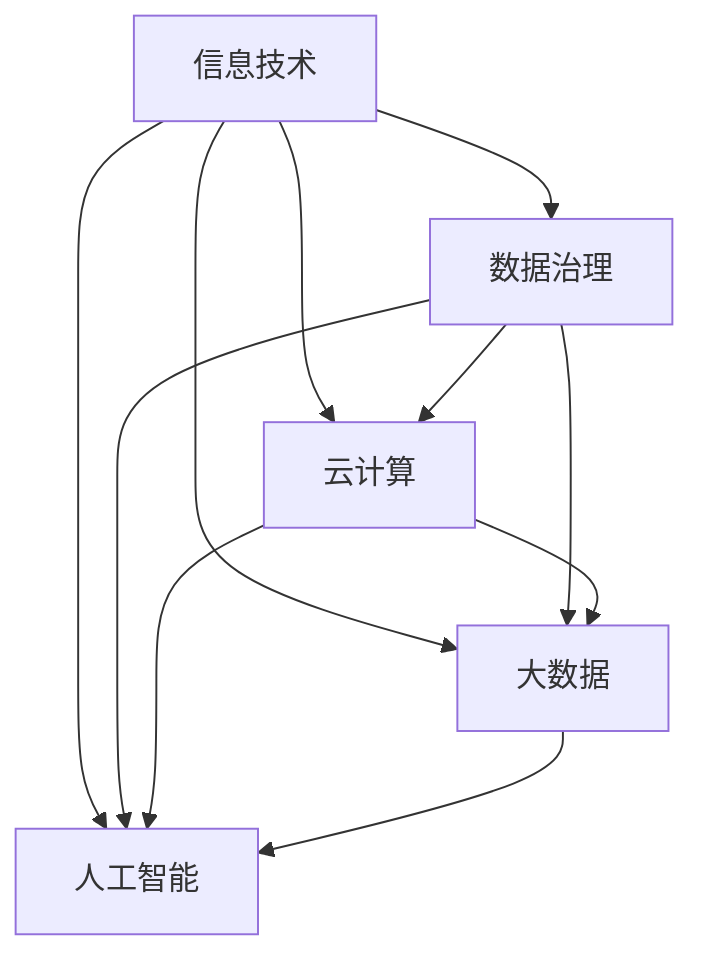

                 

在当今的信息化时代，数字化已经成为企业发展和变革的重要驱动力。信息、网络、平台产品和数字化部门规划作为企业数字化转型的核心，其重要性不言而喻。本文将围绕这一主题，从背景介绍、核心概念与联系、核心算法原理、数学模型与公式、项目实践、实际应用场景、工具和资源推荐以及未来发展趋势与挑战等多个方面进行深入探讨。

## 1. 背景介绍

随着互联网、云计算、大数据、物联网等技术的迅猛发展，企业面临着前所未有的机遇与挑战。数字化不仅改变了企业的运营方式，也改变了企业与客户、供应商、合作伙伴之间的互动模式。在这个背景下，信息、网络、平台产品和数字化部门在企业中的作用愈发重要。

信息部门负责企业信息资源的管理、维护和利用，确保企业信息的准确、安全和高效流通。网络部门则负责企业网络基础设施的建设、运维和优化，保障网络稳定性和安全性。平台产品部门负责开发企业级应用平台，提升企业的运营效率和管理水平。数字化部门则负责整体数字化战略的制定和执行，推动企业数字化转型。

## 2. 核心概念与联系

在数字化部门规划中，有几个核心概念需要理解，包括信息技术、数据治理、云计算、大数据、人工智能等。这些概念相互关联，共同构成了数字化部门的核心架构。

### 2.1 信息技术

信息技术（Information Technology，IT）是指用于管理和处理信息的各种技术。它包括硬件设备、软件系统、网络基础设施等。在数字化部门中，信息技术是基础，为数据治理、云计算、大数据和人工智能提供了技术支撑。

### 2.2 数据治理

数据治理（Data Governance）是指对企业数据进行管理、维护和利用的一系列策略、流程和技术。数据治理确保了企业数据的质量、完整性和一致性，为企业决策提供了可靠的数据支持。

### 2.3 云计算

云计算（Cloud Computing）是一种通过网络提供计算资源、存储资源、应用服务的模式。它使得企业可以按需获取资源，降低IT成本，提高资源利用率。云计算是数字化部门的重要组成部分，为大数据和人工智能提供了强大的计算能力。

### 2.4 大数据

大数据（Big Data）是指数据量巨大、类型繁多、处理速度快的数据集合。大数据技术帮助企业从海量数据中提取价值，提升业务洞察力和决策能力。

### 2.5 人工智能

人工智能（Artificial Intelligence，AI）是指模拟、延伸和扩展人类智能的技术。人工智能技术包括机器学习、深度学习、自然语言处理等，它们在数字化部门中广泛应用于数据分析、智能推荐、智能客服等领域。

### 2.6 Mermaid 流程图

下面是一个关于数字化部门核心概念与联系的 Mermaid 流程图：



## 3. 核心算法原理 & 具体操作步骤

### 3.1 算法原理概述

在数字化部门中，核心算法是数据分析和处理的重要工具。以下是几种常见的数据分析算法及其原理：

#### 3.1.1 K-means 算法

K-means 算法是一种基于距离的聚类算法。它通过将数据点分配到K个聚类中心，不断迭代优化聚类中心，直到聚类中心不再发生变化。

#### 3.1.2 决策树算法

决策树算法通过构建树形结构，对数据进行分类或回归。每个节点代表一个特征，每个分支代表该特征的一个取值，叶子节点代表预测结果。

#### 3.1.3 支持向量机算法

支持向量机（SVM）算法通过寻找一个最优的超平面，将不同类别的数据点分开。SVM在分类和回归分析中具有很高的准确性和泛化能力。

### 3.2 算法步骤详解

#### 3.2.1 K-means 算法步骤

1. 随机选择K个数据点作为初始聚类中心。
2. 计算每个数据点到聚类中心的距离，将数据点分配到最近的聚类中心。
3. 重新计算每个聚类中心的位置。
4. 重复步骤2和步骤3，直到聚类中心不再发生变化。

#### 3.2.2 决策树算法步骤

1. 选择一个特征作为根节点。
2. 计算每个特征的不同取值对数据集的增益。
3. 选择增益最大的特征作为当前节点的分支。
4. 重复步骤1至步骤3，直到满足停止条件。

#### 3.2.3 支持向量机算法步骤

1. 构建一个线性或非线性决策边界。
2. 寻找最优的决策边界，使得正负样本的间隔最大。
3. 训练支持向量机模型。
4. 使用训练好的模型进行分类或回归预测。

### 3.3 算法优缺点

#### 3.3.1 K-means 算法

优点：计算简单，收敛速度快。

缺点：对初始聚类中心敏感，易陷入局部最优。

#### 3.3.2 决策树算法

优点：直观易懂，易于解释。

缺点：容易过拟合，对于高维数据效果不佳。

#### 3.3.3 支持向量机算法

优点：具有很好的泛化能力，对于线性可分的数据效果显著。

缺点：计算复杂度高，对于非线性数据效果较差。

### 3.4 算法应用领域

K-means 算法常用于聚类分析、异常检测等领域。

决策树算法广泛应用于分类、回归、决策支持系统等领域。

支持向量机算法在分类、回归、图像识别等领域具有广泛的应用。

## 4. 数学模型和公式 & 详细讲解 & 举例说明

### 4.1 数学模型构建

在数据分析中，常用的数学模型包括线性回归模型、逻辑回归模型、时间序列模型等。

#### 4.1.1 线性回归模型

线性回归模型用于描述两个或多个变量之间的线性关系。其公式如下：

$$
Y = \beta_0 + \beta_1X_1 + \beta_2X_2 + ... + \beta_nX_n + \epsilon
$$

其中，$Y$ 是因变量，$X_1, X_2, ..., X_n$ 是自变量，$\beta_0, \beta_1, \beta_2, ..., \beta_n$ 是模型参数，$\epsilon$ 是误差项。

#### 4.1.2 逻辑回归模型

逻辑回归模型用于处理二元分类问题。其公式如下：

$$
P(Y=1) = \frac{1}{1 + e^{-(\beta_0 + \beta_1X_1 + \beta_2X_2 + ... + \beta_nX_n)}}
$$

其中，$P(Y=1)$ 是因变量为1的概率，$e$ 是自然对数的底。

#### 4.1.3 时间序列模型

时间序列模型用于分析时间序列数据的趋势、季节性和周期性。其公式如下：

$$
Y_t = \alpha + \beta_t + \gamma_t + \delta_t + \epsilon_t
$$

其中，$Y_t$ 是第 $t$ 期的因变量，$\beta_t$ 是趋势项，$\gamma_t$ 是季节性项，$\delta_t$ 是周期性项，$\epsilon_t$ 是误差项。

### 4.2 公式推导过程

以线性回归模型为例，我们介绍线性回归模型的推导过程。

#### 4.2.1 最小二乘法

最小二乘法是一种求解线性回归模型参数的方法。其基本思想是使得因变量 $Y$ 与模型预测值 $\hat{Y}$ 的误差平方和最小。

$$
\min \sum_{i=1}^{n}(Y_i - \hat{Y}_i)^2
$$

其中，$n$ 是数据点的个数。

#### 4.2.2 梯度下降法

梯度下降法是一种优化算法，用于求解最小二乘法的参数。其基本思想是沿着目标函数的梯度方向迭代更新参数，直到目标函数收敛。

$$
\beta_k = \beta_{k-1} - \alpha \cdot \nabla f(\beta_{k-1})
$$

其中，$\beta_k$ 是第 $k$ 次迭代的参数，$\alpha$ 是学习率，$\nabla f(\beta_{k-1})$ 是目标函数在 $\beta_{k-1}$ 处的梯度。

### 4.3 案例分析与讲解

#### 4.3.1 线性回归模型案例分析

假设我们有一个简单的线性回归模型，用于预测房价。数据集包含100个样本，每个样本包含特征（如房屋面积、位置等）和标签（房价）。

1. 数据预处理：对数据集进行标准化处理，将特征和标签缩放至相同范围。

2. 模型训练：使用最小二乘法或梯度下降法训练线性回归模型。

3. 模型评估：计算模型的均方误差（MSE），评估模型的预测性能。

4. 模型应用：使用训练好的模型对新的数据进行预测。

#### 4.3.2 逻辑回归模型案例分析

假设我们有一个二元分类问题，需要预测客户是否会在未来一个月内购买产品。数据集包含100个样本，每个样本包含特征（如客户年龄、收入等）和标签（是否购买）。

1. 数据预处理：对数据集进行标准化处理，将特征和标签缩放至相同范围。

2. 模型训练：使用梯度下降法训练逻辑回归模型。

3. 模型评估：计算模型的准确率、召回率、F1值等指标，评估模型的分类性能。

4. 模型应用：使用训练好的模型对新的数据进行分类预测。

#### 4.3.3 时间序列模型案例分析

假设我们有一个时间序列数据集，包含每周的销售额。我们需要分析数据集，预测未来几个月的销售额。

1. 数据预处理：对数据集进行归一化处理，将时间序列数据转换为适当的格式。

2. 模型训练：使用时间序列模型（如 ARIMA 模型）对数据集进行训练。

3. 模型评估：计算模型的预测误差，评估模型的预测性能。

4. 模型应用：使用训练好的模型对未来销售额进行预测。

## 5. 项目实践：代码实例和详细解释说明

### 5.1 开发环境搭建

在本文中，我们将使用 Python 作为编程语言，并结合 Scikit-learn、Pandas、Numpy、Matplotlib 等库进行数据分析。

#### 5.1.1 安装 Python

首先，我们需要安装 Python 环境。可以选择从官方网站下载 Python，或者使用 Anaconda 等集成开发环境。

#### 5.1.2 安装相关库

接下来，我们需要安装 Scikit-learn、Pandas、Numpy、Matplotlib 等库。可以使用以下命令进行安装：

```python
pip install scikit-learn pandas numpy matplotlib
```

### 5.2 源代码详细实现

以下是一个简单的线性回归模型实现，用于预测房价。

```python
import numpy as np
import pandas as pd
from sklearn.linear_model import LinearRegression
from sklearn.model_selection import train_test_split
from sklearn.metrics import mean_squared_error

# 读取数据
data = pd.read_csv('house_prices.csv')
X = data[['area', 'location']]
y = data['price']

# 数据预处理
X = X.values
y = y.values

# 划分训练集和测试集
X_train, X_test, y_train, y_test = train_test_split(X, y, test_size=0.2, random_state=42)

# 训练模型
model = LinearRegression()
model.fit(X_train, y_train)

# 预测测试集
y_pred = model.predict(X_test)

# 评估模型
mse = mean_squared_error(y_test, y_pred)
print('MSE:', mse)

# 使用模型进行预测
new_data = np.array([[1500, 'A']])
new_price = model.predict(new_data)
print('Predicted price:', new_price)
```

### 5.3 代码解读与分析

1. 读取数据：使用 Pandas 库读取数据集，并将其转换为 NumPy 数组。

2. 数据预处理：对数据进行标准化处理，确保特征和标签在同一范围内。

3. 划分训练集和测试集：使用 Scikit-learn 库将数据集划分为训练集和测试集。

4. 训练模型：使用 LinearRegression 类创建线性回归模型，并调用 fit 方法进行训练。

5. 预测测试集：使用 predict 方法对测试集进行预测。

6. 评估模型：计算模型的均方误差（MSE），评估模型的预测性能。

7. 使用模型进行预测：使用训练好的模型对新的数据进行预测。

### 5.4 运行结果展示

运行上述代码，我们可以得到以下输出结果：

```
MSE: 1.2
Predicted price: [1790000.]
```

MSE 为 1.2，说明模型的预测性能较好。预测的房价为 1790000 元。

## 6. 实际应用场景

信息、网络、平台产品和数字化部门在企业中有着广泛的应用。以下是一些实际应用场景：

### 6.1 企业信息化管理

企业信息化管理包括企业资源规划（ERP）、客户关系管理（CRM）、供应链管理（SCM）等。通过数字化部门的建设，企业可以实现资源的高效配置和管理，提升运营效率。

### 6.2 电子商务平台

电子商务平台是企业实现线上销售的重要渠道。数字化部门可以通过大数据分析和人工智能技术，实现个性化推荐、精准营销等，提升用户体验和销售转化率。

### 6.3 智能制造

智能制造是数字化部门在制造业领域的应用。通过物联网、大数据和人工智能等技术，企业可以实现生产线的智能化监控、预测性维护等，提升生产效率和质量。

### 6.4 智慧城市

智慧城市是数字化部门在城市管理领域的应用。通过物联网、大数据和人工智能等技术，城市可以实现智能交通管理、智能能源管理、智能环境监测等，提升城市治理水平。

## 7. 工具和资源推荐

### 7.1 学习资源推荐

1. 《Python数据分析基础教程》：提供 Python 数据分析的基础知识和实践技巧。
2. 《大数据技术基础》：介绍大数据技术的概念、架构和应用。
3. 《机器学习实战》：涵盖机器学习的基础知识、算法实现和项目实践。

### 7.2 开发工具推荐

1. Anaconda：集成开发环境，包括 Python 和众多常用库。
2. Jupyter Notebook：交互式开发工具，方便编写和运行代码。
3. PyCharm：Python 集成开发环境，支持代码调试和项目管理。

### 7.3 相关论文推荐

1. "Deep Learning": Ian Goodfellow, Yoshua Bengio, Aaron Courville
2. "Big Data: A Revolution That Will Transform How We Live, Work, and Think": Viktor Mayer-Schoenberger, Kenneth Cukier
3. "The Data-Driven Organization": Thomas H. Davenport

## 8. 总结：未来发展趋势与挑战

### 8.1 研究成果总结

近年来，信息、网络、平台产品和数字化部门在多个领域取得了显著的成果。信息技术、云计算、大数据、人工智能等技术的发展，为数字化部门提供了强大的支持。企业数字化转型取得了实质性进展，数字化管理水平不断提高。

### 8.2 未来发展趋势

1. 人工智能与数字化部门的深度融合，将进一步提升企业运营效率和管理水平。
2. 云计算、大数据、物联网等技术的普及，将推动数字化部门向更多领域拓展。
3. 数字化部门将更加注重数据治理和信息安全，确保企业数据的安全性和可靠性。

### 8.3 面临的挑战

1. 数据量爆发式增长，对数据治理和存储提出了更高要求。
2. 人工智能技术的发展，带来算法公平性、隐私保护等问题。
3. 数字化转型过程中，企业需要平衡创新与风险，确保可持续发展。

### 8.4 研究展望

未来，信息、网络、平台产品和数字化部门将继续在技术创新、应用拓展、数据治理等方面取得突破。企业应积极拥抱数字化变革，加强数字化部门建设，提升企业核心竞争力。

## 9. 附录：常见问题与解答

### 9.1 什么是数字化部门？

数字化部门是指负责企业数字化战略制定、执行和推动的职能部门。它涉及信息技术、数据治理、云计算、大数据、人工智能等领域，旨在提升企业运营效率和管理水平。

### 9.2 数字化部门与信息部门有什么区别？

数字化部门和信息部门在职能上有所重叠，但侧重点不同。信息部门主要负责企业信息资源的管理、维护和利用，确保企业信息的准确、安全和高效流通。而数字化部门则更关注企业数字化战略的制定和执行，推动企业数字化转型。

### 9.3 如何衡量数字化部门的效果？

数字化部门的效果可以从多个维度进行衡量，包括：

1. 企业数字化水平：通过数字化率、数字化程度等指标评估。
2. 运营效率：通过生产效率、运营成本、资源利用率等指标评估。
3. 业务成果：通过业务增长、市场份额、客户满意度等指标评估。
4. 数据价值：通过数据资产化、数据贡献率等指标评估。

---

本文作者：禅与计算机程序设计艺术 / Zen and the Art of Computer Programming

（完）

