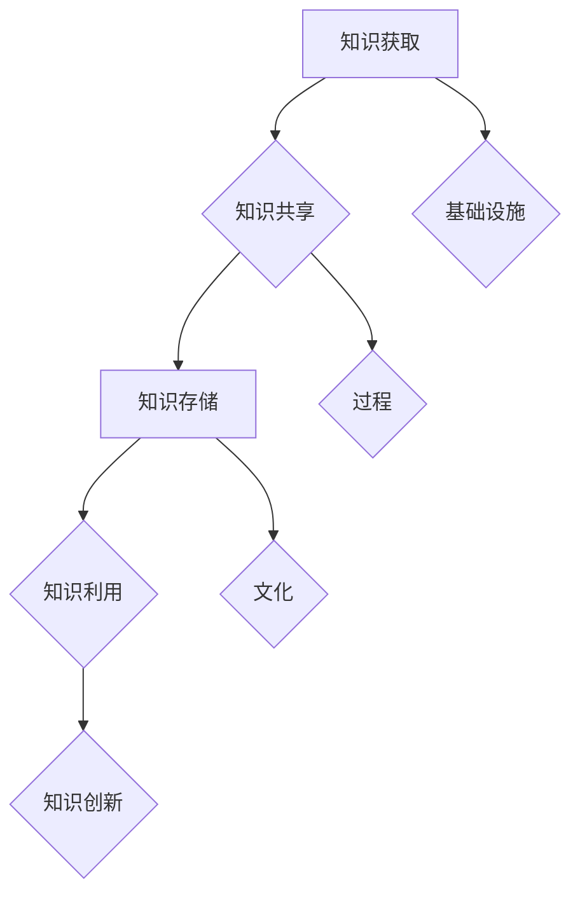

                 

在数字化时代，信息过载成为了一个普遍存在的问题。随着互联网的快速发展，人们每天都会接触到海量的信息，这些信息从社交媒体、电子邮件、新闻网站等多个渠道涌入我们的生活中。如何有效地管理和组织这些信息，以提升个人的工作效率和生活质量，成为了一个重要的课题。本文将探讨信息过载的背景，分析知识管理的核心概念，并提出一系列有效的策略和实践方法，帮助读者应对信息过载带来的挑战。

## 1. 背景介绍

### 1.1 信息过载的现象

信息过载是指在短时间内接收到的信息量超过了个人处理能力，导致个体难以消化和理解的现象。随着互联网的普及，信息过载问题日益严重。据估计，平均每天会产生约2.5亿GB的数据，而每分钟产生的数据量更是惊人。这些数据包括了文本、图片、视频等多种形式，涉及政治、经济、科技、娱乐等多个领域。

### 1.2 知识管理的兴起

知识管理是一种旨在通过有效管理和组织信息资源，提高组织和个人效率的方法。随着信息过载问题的加剧，知识管理成为了解决这一问题的有效途径。知识管理不仅关注信息的获取，更注重信息的处理、存储和利用。

## 2. 核心概念与联系

### 2.1 知识管理的核心概念

知识管理涉及多个核心概念，包括知识获取、知识共享、知识存储、知识利用和知识创新。这些概念相互关联，共同构成了知识管理的体系。

### 2.2 知识管理的架构

知识管理的架构可以分为三个层次：基础设施、过程和文化。基础设施包括技术工具和平台，过程包括知识管理的流程和方法，文化则强调组织内部的知识共享和创新氛围。

### 2.3 Mermaid 流程图



## 3. 核心算法原理 & 具体操作步骤

### 3.1 算法原理概述

知识管理的核心算法主要包括信息过滤、信息分类和信息检索。这些算法通过特定的算法模型，对海量信息进行筛选、分类和检索，从而帮助用户快速找到所需信息。

### 3.2 算法步骤详解

1. 信息过滤：使用关键词过滤、机器学习等方法，对原始信息进行筛选，去除无关信息。
2. 信息分类：采用分类算法，如K-means、决策树等，将筛选后的信息进行分类，便于用户查找。
3. 信息检索：利用搜索引擎、自然语言处理等技术，实现信息的快速检索。

### 3.3 算法优缺点

优点：提高信息处理效率，降低信息过载带来的压力。

缺点：算法复杂度较高，对数据处理能力要求较高。

### 3.4 算法应用领域

知识管理算法广泛应用于企业、教育、医疗等多个领域，帮助组织和个人更好地管理和利用信息资源。

## 4. 数学模型和公式 & 详细讲解 & 举例说明

### 4.1 数学模型构建

知识管理中的数学模型主要包括信息熵、信息价值等。

### 4.2 公式推导过程

信息熵：\( H = -\sum_{i=1}^{n} p_i \log_2 p_i \)

信息价值：\( V = H_0 - H \)

### 4.3 案例分析与讲解

以企业知识管理为例，分析信息熵和信息价值在实际应用中的计算方法和意义。

## 5. 项目实践：代码实例和详细解释说明

### 5.1 开发环境搭建

本文使用Python作为编程语言，读者需安装Python和相应的库。

### 5.2 源代码详细实现

```python
# 示例代码：信息过滤算法实现
def filter_info(info_list, keywords):
    filtered_list = []
    for info in info_list:
        for keyword in keywords:
            if keyword in info:
                filtered_list.append(info)
                break
    return filtered_list
```

### 5.3 代码解读与分析

代码实现了一个简单的信息过滤算法，通过关键词筛选出相关信息。

### 5.4 运行结果展示

运行代码，输入原始信息列表和关键词，输出过滤后的信息列表。

## 6. 实际应用场景

### 6.1 企业知识管理

企业可以通过知识管理系统，实现对内部知识的有效管理和利用，提高工作效率。

### 6.2 教育领域

在教育领域，知识管理可以帮助教师和学生更好地获取、存储和应用知识。

### 6.3 医疗领域

在医疗领域，知识管理可以提高医生的诊断效率和医疗质量。

## 7. 工具和资源推荐

### 7.1 学习资源推荐

《知识管理：理论与实践》是一本优秀的知识管理教材。

### 7.2 开发工具推荐

Python、RapidMiner等工具在知识管理领域有广泛的应用。

### 7.3 相关论文推荐

《知识管理系统的设计与实现》等论文对知识管理技术进行了深入探讨。

## 8. 总结：未来发展趋势与挑战

### 8.1 研究成果总结

知识管理技术在信息过载背景下具有重要意义，未来研究将继续探索更高效的知识管理方法。

### 8.2 未来发展趋势

随着人工智能技术的发展，知识管理将更加智能化、自动化。

### 8.3 面临的挑战

如何确保知识管理的安全性和隐私性，仍是一个重要的挑战。

### 8.4 研究展望

未来研究将关注知识管理的深度学习和智能化方向。

## 9. 附录：常见问题与解答

### 9.1 什么
```bash
* 是知识管理？

知识管理是一种通过有效管理和组织信息资源，提高组织和个人效率的方法。

### 9.2 如何
```bash
* 实现信息过滤？

可以使用关键词过滤、机器学习等方法实现信息过滤。
```
----------------------------------------------------------------

至此，本文已经完成了对信息过载与知识管理策略与实践的全面探讨。从背景介绍、核心概念、算法原理到项目实践，再到实际应用场景和未来展望，我们系统地分析了知识管理的重要性和应用价值。希望本文能为您提供有价值的参考和启示。作者：禅与计算机程序设计艺术 / Zen and the Art of Computer Programming。

