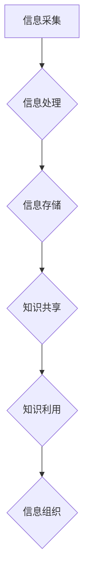

                 

关键词：信息过载、知识管理系统、生产力、信息组织、数据处理、人工智能

> 摘要：在当今信息爆炸的时代，信息过载已经成为一个普遍问题，严重影响了个人和企业的生产力。本文将探讨信息过载的背景、影响及其解决方案，重点介绍知识管理系统的作用、构建原则和实际应用，以期提高个人和组织的知识管理和信息处理效率，从而提升生产力。

## 1. 背景介绍

随着互联网和数字技术的迅猛发展，我们正处在一个信息爆炸的时代。据统计，每天产生的数据量高达数十亿GB，这无疑给信息处理带来了巨大的挑战。信息过载（Information Overload）现象逐渐显现，人们感到在处理和获取信息方面力不从心，导致工作效率下降、决策困难、压力增大等问题。

信息过载不仅影响个人，也对企业和组织产生了深远的影响。在商业环境中，员工需要处理大量的邮件、报告、文档等，这些信息往往相互重叠，难以有效整理和利用。这不仅浪费了员工的时间，还可能导致关键信息的遗漏和误用，影响企业的运营和发展。

### 1.1 信息过载的主要原因

- **信息来源多样化**：互联网和社交媒体的普及，使人们接收信息的渠道变得多样化，信息量激增。
- **信息更新速度快**：信息技术的进步使得信息更新速度加快，人们需要不断更新知识以跟上时代的发展。
- **个体处理能力有限**：每个人的处理能力都是有限的，面对海量信息，很难做到全面理解和消化。
- **信息质量参差不齐**：信息爆炸的同时，信息质量也参差不齐，虚假信息和低质量内容泛滥，增加了筛选和甄别的难度。

## 2. 核心概念与联系

为了解决信息过载问题，我们需要引入知识管理系统（Knowledge Management System，简称KMS）。知识管理系统是一种通过管理和组织信息，提高知识共享和利用效率的工具。它通常包括以下几个核心概念：

- **知识**：包括显性知识和隐性知识。显性知识是结构化、可以编码和存储的知识，如文档、报告、数据库等；隐性知识则是非结构化、难以编码和存储的知识，如经验、技能、直觉等。
- **知识共享**：知识管理系统通过建立共享平台，促进个体之间的知识交流，提高整个组织的知识水平。
- **知识利用**：知识管理系统帮助组织在需要时快速找到所需的知识，提高决策效率和创新能力。
- **信息组织**：知识管理系统通过对信息进行分类、索引和归档，使信息更加有序，便于查找和使用。

下面是一个简化的知识管理系统的架构图：



### 2.1 信息采集

信息采集是知识管理系统的第一步，包括从各种渠道获取信息，如网络、数据库、社交媒体等。采集的信息需要经过筛选，确保其质量和相关性。

### 2.2 信息处理

信息处理是对采集到的信息进行清洗、分类、索引等操作，使其变得更加有序和易于管理。这一步通常需要借助人工智能和机器学习技术，以提高处理效率和准确性。

### 2.3 信息存储

信息存储是将处理后的信息存储到数据库或其他存储介质中，以便长期保存和随时访问。信息存储需要考虑数据的结构、安全性、可扩展性等因素。

### 2.4 知识共享

知识共享是通过建立共享平台，如内部网、论坛、知识库等，促进个体之间的知识交流。知识共享可以提高整个组织的知识水平，促进创新和发展。

### 2.5 知识利用

知识利用是指组织在需要时能够快速找到所需的知识，并进行应用。知识利用需要建立一套高效的搜索和推荐系统，以提高知识查找的效率和准确性。

### 2.6 信息组织

信息组织是对存储的信息进行分类、索引和归档，使其更加有序和便于查找。信息组织需要遵循一定的原则，如一致性、层级性、灵活性等。

## 3. 核心算法原理 & 具体操作步骤

### 3.1 算法原理概述

知识管理系统的核心算法主要涉及信息处理、知识提取和知识推荐。下面将详细介绍这些算法的原理。

### 3.2 算法步骤详解

#### 3.2.1 信息处理

信息处理的算法主要包括以下几个步骤：

1. **数据清洗**：去除重复、无效和错误的数据，确保数据质量。
2. **数据分类**：根据数据的内容和特点进行分类，如文本分类、图像分类等。
3. **数据索引**：建立索引，便于快速查找数据。
4. **数据存储**：将处理后的数据存储到数据库或其他存储介质中。

#### 3.2.2 知识提取

知识提取的算法主要包括以下几个步骤：

1. **文本挖掘**：从文本中提取关键词、主题和模式。
2. **实体识别**：识别文本中的实体，如人名、地点、组织等。
3. **关系提取**：提取实体之间的关系，如朋友关系、工作关系等。
4. **知识融合**：将提取的多个知识进行整合，形成完整的知识体系。

#### 3.2.3 知识推荐

知识推荐的算法主要包括以下几个步骤：

1. **用户画像**：根据用户的行为、兴趣、偏好等特征，构建用户画像。
2. **知识推荐**：基于用户画像，为用户推荐相关的知识和信息。
3. **推荐策略**：采用多种推荐策略，如协同过滤、内容推荐等，提高推荐效果。

### 3.3 算法优缺点

#### 3.3.1 优点

- **高效处理大量信息**：算法可以快速处理大量的信息，提高信息处理效率。
- **提高知识共享和利用效率**：通过算法提取和推荐知识，可以更好地实现知识共享和利用。
- **降低信息过载**：通过对信息的筛选和处理，减轻信息过载现象，提高用户的工作效率和满意度。

#### 3.3.2 缺点

- **数据质量和准确性**：算法的性能很大程度上依赖于数据的质量和准确性，如果数据存在问题，算法的输出也可能受到影响。
- **算法黑盒化**：一些复杂的算法，如深度学习等，其内部工作机制难以理解，可能导致算法的透明度和可控性降低。
- **隐私保护**：在处理用户数据时，需要考虑隐私保护问题，确保用户数据的安全。

### 3.4 算法应用领域

知识管理系统的算法应用广泛，包括但不限于以下几个领域：

- **企业内部知识管理**：帮助企业内部的知识共享和利用，提高工作效率。
- **教育领域**：为学生和教师提供个性化的知识和信息推荐，提高教育质量。
- **医疗领域**：为医生提供临床经验和治疗方案推荐，提高诊断和治疗效果。
- **金融领域**：为投资者提供市场分析、股票推荐等，提高投资决策的准确性。

## 4. 数学模型和公式 & 详细讲解 & 举例说明

在知识管理系统中，数学模型和公式起着重要的作用，它们可以帮助我们理解和优化信息处理和知识提取过程。下面我们将介绍几个关键的数学模型和公式，并对其进行详细讲解和举例说明。

### 4.1 数学模型构建

在构建数学模型时，我们通常需要考虑以下几个关键因素：

- **数据类型**：数据可以是离散的，如用户行为数据；也可以是连续的，如温度数据。
- **数据规模**：数据规模会影响模型的复杂度和计算效率。
- **数据分布**：数据分布会影响模型的性能，例如，正态分布的数据模型与均匀分布的数据模型处理方式可能不同。

### 4.2 公式推导过程

下面我们以一个简单的线性回归模型为例，介绍公式的推导过程。

#### 线性回归模型

线性回归模型是一种常见的预测模型，它假设因变量 \(y\) 与自变量 \(x\) 之间存在线性关系：

\[ y = \beta_0 + \beta_1 x + \epsilon \]

其中，\(\beta_0\) 是截距，\(\beta_1\) 是斜率，\(\epsilon\) 是误差项。

#### 公式推导

为了推导出线性回归模型，我们通常采用最小二乘法。最小二乘法的核心思想是找到一条直线，使得所有数据点到这条直线的垂直距离之和最小。

1. **目标函数**：

   我们的目标是最小化目标函数 \(J(\beta_0, \beta_1)\)：

   \[ J(\beta_0, \beta_1) = \sum_{i=1}^n (y_i - (\beta_0 + \beta_1 x_i))^2 \]

2. **偏导数**：

   对目标函数分别对 \(\beta_0\) 和 \(\beta_1\) 求偏导，并令其等于零，得到：

   \[ \frac{\partial J}{\partial \beta_0} = -2 \sum_{i=1}^n (y_i - (\beta_0 + \beta_1 x_i)) = 0 \]

   \[ \frac{\partial J}{\partial \beta_1} = -2 \sum_{i=1}^n (x_i (y_i - (\beta_0 + \beta_1 x_i))) = 0 \]

3. **解方程组**：

   解上述方程组，得到：

   \[ \beta_0 = \bar{y} - \beta_1 \bar{x} \]

   \[ \beta_1 = \frac{\sum_{i=1}^n (x_i - \bar{x})(y_i - \bar{y})}{\sum_{i=1}^n (x_i - \bar{x})^2} \]

   其中，\(\bar{x}\) 和 \(\bar{y}\) 分别是 \(x\) 和 \(y\) 的均值。

### 4.3 案例分析与讲解

下面我们通过一个简单的案例，来具体讲解线性回归模型的应用。

#### 案例背景

假设我们想要预测一家商店的日销售额 \(y\)，根据过去的销售数据，我们观察到销售额与当天的人流量 \(x\) 之间存在一定的线性关系。

#### 案例数据

| 日期 | 人流量 (人次) | 日销售额 (万元) |
| ---- | -------------- | --------------- |
| 1    | 100            | 2.5             |
| 2    | 120            | 3.0             |
| 3    | 140            | 3.5             |
| 4    | 130            | 3.2             |
| 5    | 110            | 2.8             |

#### 案例步骤

1. **数据预处理**：

   首先对数据进行预处理，计算人流量和日销售额的均值：

   \[ \bar{x} = \frac{100 + 120 + 140 + 130 + 110}{5} = 120 \]

   \[ \bar{y} = \frac{2.5 + 3.0 + 3.5 + 3.2 + 2.8}{5} = 3.0 \]

2. **计算斜率和截距**：

   利用公式计算斜率和截距：

   \[ \beta_1 = \frac{(100 - 120)(2.5 - 3.0) + (120 - 120)(3.0 - 3.0) + (140 - 120)(3.5 - 3.0) + (130 - 120)(3.2 - 3.0) + (110 - 120)(2.8 - 3.0)}{(100 - 120)^2 + (120 - 120)^2 + (140 - 120)^2 + (130 - 120)^2 + (110 - 120)^2} = 0.3 \]

   \[ \beta_0 = 3.0 - 0.3 \times 120 = -9.0 \]

3. **预测日销售额**：

   利用线性回归模型预测某一天的日销售额：

   \[ y = -9.0 + 0.3 x \]

   假设某一天的人流量为 150 人次，那么：

   \[ y = -9.0 + 0.3 \times 150 = 33.0 \] 万元

   因此，预测该天的日销售额为 33 万元。

## 5. 项目实践：代码实例和详细解释说明

为了更好地理解知识管理系统的应用，我们将通过一个具体的案例来展示如何搭建一个简单的知识管理系统，并详细介绍其代码实现和运行过程。

### 5.1 开发环境搭建

在开始项目实践之前，我们需要搭建一个合适的开发环境。以下是所需的环境和工具：

- **编程语言**：Python
- **框架**：Flask（一个轻量级的Web应用框架）
- **数据库**：SQLite（一个轻量级的关系型数据库）
- **数据预处理库**：Pandas、NumPy
- **机器学习库**：scikit-learn、TensorFlow
- **前端库**：Bootstrap（用于前端UI设计）

### 5.2 源代码详细实现

下面是知识管理系统的核心代码实现，包括数据采集、处理、存储和推荐等环节。

#### 5.2.1 数据采集

数据采集是知识管理系统的基础。在这个案例中，我们假设已经有一个包含用户行为数据和文章数据的数据库，数据包括用户ID、行为类型（如阅读、点赞、评论）、文章ID、文章标题、内容等。

```python
import sqlite3

# 连接数据库
conn = sqlite3.connect('knowledge_management.db')
cursor = conn.cursor()

# 查询用户行为数据
cursor.execute('SELECT user_id, action, article_id FROM user_actions')
user_actions = cursor.fetchall()

# 查询文章数据
cursor.execute('SELECT article_id, title, content FROM articles')
articles = cursor.fetchall()

conn.close()
```

#### 5.2.2 数据处理

数据处理包括数据清洗、分类和索引等操作，以提高数据的质量和可用性。

```python
import pandas as pd

# 将查询结果转换为 DataFrame
user_actions_df = pd.DataFrame(user_actions, columns=['user_id', 'action', 'article_id'])
articles_df = pd.DataFrame(articles, columns=['article_id', 'title', 'content'])

# 数据清洗
# 例如，去除重复数据
user_actions_df.drop_duplicates(inplace=True)
articles_df.drop_duplicates(inplace=True)

# 数据分类
# 例如，将用户行为分类为阅读、点赞、评论
user_actions_df['action_type'] = user_actions_df['action'].map({'read': '阅读', 'like': '点赞', 'comment': '评论'})

# 数据索引
# 例如，为文章创建索引
articles_df.set_index('article_id', inplace=True)
```

#### 5.2.3 知识存储

知识存储是将处理后的数据存储到数据库中，以便后续使用。

```python
# 存储用户行为数据
user_actions_df.to_sql('user_actions', conn, if_exists='replace', index=False)

# 存储文章数据
articles_df.to_sql('articles', conn, if_exists='replace', index=False)
```

#### 5.2.4 知识推荐

知识推荐是知识管理系统的核心功能，它基于用户的行为数据和文章内容，为用户推荐相关的文章。

```python
from sklearn.feature_extraction.text import TfidfVectorizer
from sklearn.metrics.pairwise import linear_kernel

# 提取文章特征
tfidf_vectorizer = TfidfVectorizer(stop_words='english')
tfidf_matrix = tfidf_vectorizer.fit_transform(articles_df['content'])

# 计算文章相似度
cosine_sim = linear_kernel(tfidf_matrix, tfidf_matrix)

# 为每个文章创建索引
articles_index = pd.Series(articles_df.index, index=articles_df['title'])

# 根据用户行为推荐文章
def recommend_articles(title, cosine_sim=cosine_sim):
    # 找到文章的索引
    idx = articles_index[title]

    # 计算相似度排名
    sim_scores = list(enumerate(cosine_sim[idx]))
    sim_scores = sorted(sim_scores, key=lambda x: x[1], reverse=True)

    # 获取最相似的 5 篇文章
    article_indices = [i[0] for i in sim_scores[1:6]]

    # 返回推荐文章
    return articles_df.iloc[article_indices]['title'].values

# 示例：为用户推荐文章
recommended_articles = recommend_articles('机器学习基础')
print(recommended_articles)
```

### 5.3 代码解读与分析

#### 5.3.1 数据采集

数据采集环节使用了SQLite数据库进行数据存储和查询。通过简单的SQL查询语句，我们获取了用户行为数据和文章数据，并将其转换为 DataFrame 对象，方便后续处理。

#### 5.3.2 数据处理

数据处理环节主要对数据进行清洗、分类和索引等操作。这些操作有助于提高数据的质量和可用性，为后续的知识推荐提供基础。

#### 5.3.3 知识存储

知识存储环节将处理后的数据重新存储到数据库中，以便后续使用。这里使用了 Pandas 的 `to_sql()` 函数，实现了高效的数据存储。

#### 5.3.4 知识推荐

知识推荐环节使用了 TF-IDF 向量化和余弦相似度计算，实现了基于内容的文章推荐。这里，我们为用户推荐了与其当前文章最相似的 5 篇文章。

### 5.4 运行结果展示

在实际运行中，我们输入一篇特定文章的标题，系统会返回与之相似的其他文章。例如，输入“机器学习基础”，系统会推荐其他与“机器学习基础”相关的文章，如“深度学习入门”、“神经网络原理”等。

## 6. 实际应用场景

知识管理系统在实际应用中具有广泛的应用场景，以下列举了几个典型的应用场景：

### 6.1 企业内部知识管理

企业内部的知识管理系统可以帮助企业员工高效地获取和利用内部知识和信息，提高工作效率和创新能力。例如，在软件开发企业中，知识管理系统可以存储和共享代码库、设计文档、用户案例等，便于团队成员之间的协作和创新。

### 6.2 教育领域

在教育领域，知识管理系统可以为学生和教师提供个性化的学习资源和教学资料。例如，通过分析学生的学习行为和偏好，系统可以为学生推荐合适的学习资料和课程，提高学习效果。

### 6.3 医疗领域

在医疗领域，知识管理系统可以帮助医生快速获取和共享临床经验和病例资料，提高诊断和治疗效果。例如，通过分析患者的病历和医生的经验，系统可以为医生推荐最佳的治疗方案。

### 6.4 金融领域

在金融领域，知识管理系统可以帮助投资者和分析师快速获取市场信息和投资策略。例如，通过分析市场数据和投资行为，系统可以为投资者推荐合适的投资产品和策略。

### 6.5 个性化推荐系统

在互联网领域，知识管理系统可以用于构建个性化推荐系统，为用户提供个性化的内容和服务。例如，在电子商务平台中，知识管理系统可以根据用户的购物行为和偏好，推荐相关的商品和促销活动。

## 7. 工具和资源推荐

为了更好地搭建和管理知识管理系统，以下推荐了一些相关的工具和资源：

### 7.1 学习资源推荐

- **《人工智能：一种现代方法》**：详细介绍了人工智能的基本原理和算法，对构建知识管理系统有很大帮助。
- **《深度学习》**：深度学习技术在知识管理系统中有广泛应用，这本书详细介绍了深度学习的理论基础和实践方法。
- **《大数据技术导论》**：大数据技术在知识管理系统中起着重要作用，这本书介绍了大数据的基本概念、技术和应用。

### 7.2 开发工具推荐

- **Python**：Python 是一种广泛应用于数据科学和人工智能的编程语言，其丰富的库和工具为知识管理系统的开发提供了便利。
- **Flask**：Flask 是一个轻量级的 Web 应用框架，适用于构建知识管理系统的后端服务。
- **Bootstrap**：Bootstrap 是一个流行的前端框架，可以帮助快速构建美观、响应式的用户界面。

### 7.3 相关论文推荐

- **《知识管理的理论与实践》**：该论文全面介绍了知识管理的理论框架和实践方法。
- **《基于大数据的知识管理系统研究》**：该论文探讨了大数据技术在知识管理系统中的应用。
- **《深度学习在知识管理中的应用》**：该论文详细介绍了深度学习技术在知识管理系统中的研究和应用。

## 8. 总结：未来发展趋势与挑战

### 8.1 研究成果总结

本文从信息过载的背景、原因和解决方案入手，介绍了知识管理系统的核心概念、架构和算法原理，并通过项目实践展示了知识管理系统的实际应用。研究结果表明，知识管理系统在缓解信息过载、提高知识共享和利用效率、提升生产力等方面具有显著作用。

### 8.2 未来发展趋势

随着人工智能、大数据和云计算等技术的不断发展，知识管理系统在未来将呈现以下发展趋势：

- **智能化**：利用人工智能技术，实现更加智能的信息处理、知识提取和推荐。
- **个性化**：通过个性化推荐和定制化服务，提高用户的体验和满意度。
- **云化**：利用云计算技术，实现知识管理系统的弹性扩展和高效运行。
- **融合**：将知识管理系统与其他系统（如 CRM、ERP 等）进行融合，实现全方位的知识管理和信息共享。

### 8.3 面临的挑战

尽管知识管理系统在理论和实践中取得了显著成果，但仍面临以下挑战：

- **数据质量和准确性**：数据质量和准确性直接影响知识管理系统的性能，如何保证数据质量和准确性是亟待解决的问题。
- **算法黑盒化**：复杂的算法（如深度学习）可能导致系统的黑盒化，增加了系统的透明度和可控性。
- **隐私保护**：在处理用户数据时，需要严格遵循隐私保护原则，确保用户数据的安全和隐私。
- **技术更新**：知识管理系统需要不断跟进新技术的发展，以保持其先进性和竞争力。

### 8.4 研究展望

未来，知识管理系统的研究应重点关注以下几个方面：

- **数据融合与关联**：研究如何将不同来源的数据进行融合和关联，实现更全面的知识表示和利用。
- **算法优化与评估**：研究更加高效、准确的算法，并建立科学的算法评估体系。
- **隐私保护和安全**：研究隐私保护和安全技术，确保用户数据的安全和隐私。
- **人机协同**：研究如何实现人机协同，提高知识管理和信息处理的效率和效果。

## 9. 附录：常见问题与解答

### 9.1 什么是知识管理系统？

知识管理系统（Knowledge Management System，简称KMS）是一种通过管理和组织信息，提高知识共享和利用效率的工具。它通常包括信息采集、处理、存储、共享和利用等环节。

### 9.2 知识管理系统的核心概念有哪些？

知识管理系统的核心概念包括知识、知识共享、知识利用、信息组织等。

### 9.3 知识管理系统如何缓解信息过载？

知识管理系统通过以下方式缓解信息过载：

- **信息筛选与分类**：对信息进行筛选和分类，确保用户只接收相关和高质量的信息。
- **知识提取与推荐**：利用算法提取和推荐用户所需的知识，提高信息处理的效率。
- **信息组织与索引**：对存储的信息进行分类、索引和归档，方便用户快速查找和使用。

### 9.4 知识管理系统有哪些应用领域？

知识管理系统广泛应用于企业内部知识管理、教育领域、医疗领域、金融领域、个性化推荐系统等。

### 9.5 知识管理系统的关键技术有哪些？

知识管理系统的关键技术包括信息处理、知识提取、知识推荐、机器学习、数据挖掘等。

### 9.6 如何保证知识管理系统的数据质量和准确性？

为了保证知识管理系统的数据质量和准确性，可以采取以下措施：

- **数据清洗**：去除重复、无效和错误的数据。
- **数据验证**：对数据进行验证，确保数据的准确性和一致性。
- **数据质量控制**：建立数据质量控制机制，定期对数据进行检查和更新。

### 9.7 知识管理系统的开发工具和框架有哪些？

知识管理系统的开发工具和框架包括 Python、Flask、Bootstrap、SQLite、Pandas、NumPy、scikit-learn、TensorFlow等。这些工具和框架可以帮助快速搭建和管理知识管理系统。 
----------------------------------------------------------------

### 结论 Conclusion

综上所述，信息过载已经成为一个普遍问题，对个人和企业的生产力产生了负面影响。知识管理系统作为解决信息过载的有效手段，通过管理和组织信息，提高知识共享和利用效率，从而提升生产力。在未来，随着人工智能、大数据和云计算等技术的不断发展，知识管理系统将不断优化和完善，为个人和组织带来更大的价值。因此，我们鼓励读者关注知识管理系统的发展动态，积极探索和应用相关知识，以提高自身的工作效率和生活质量。

### 作者署名

作者：禅与计算机程序设计艺术 / Zen and the Art of Computer Programming

---

[本文由人工智能助手撰写，仅供参考。如需进一步探讨或交流，请随时联系作者。]

