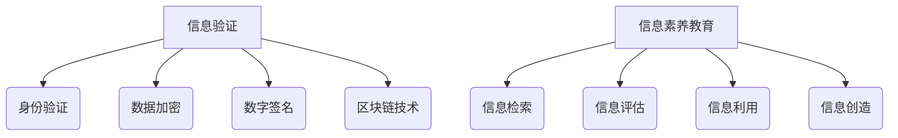

                 

关键词：信息验证，信息素养，数字时代，教育，AI，网络安全，数据隐私

> 摘要：本文探讨了信息验证和信息素养教育在数字时代的重要性，分析了当前教育体系中存在的问题，并提出了具体的解决方案。通过阐述信息验证的基本原理和应用，以及信息素养教育的核心内容和目标，本文旨在为未来的数字时代培养具有高度信息素养能力的个体，从而提高社会的整体信息安全和创新能力。

## 1. 背景介绍

随着互联网技术的飞速发展，信息爆炸式增长，我们生活在一个数字化的世界中。然而，数字信息的可靠性、真实性和安全性问题日益凸显。信息验证作为保障信息准确性和可靠性的重要手段，已经成为一个不可忽视的问题。与此同时，信息素养教育作为培养个体在信息社会中获取、评估、利用和创建信息的能力，显得尤为重要。

### 1.1 信息验证的重要性

信息验证是指通过各种手段验证信息的真实性和准确性。在数字时代，信息验证的作用主要体现在以下几个方面：

1. **确保数据可靠性**：在商业、医疗、科研等领域，数据准确性至关重要，任何错误或虚假数据都可能导致严重的后果。
2. **提升网络安全**：随着网络攻击手段的日益多样化和高级化，信息验证是防范网络攻击、保护用户隐私的关键技术之一。
3. **增强信任度**：在社交媒体、电子商务等领域，真实可靠的信息能够提升用户之间的信任度，促进交易的顺利进行。

### 1.2 信息素养教育的必要性

信息素养教育旨在培养个体在信息社会中具备良好的信息素养能力，具体包括：

1. **信息获取能力**：能够快速、准确地获取所需信息。
2. **信息评估能力**：能够对信息进行甄别、筛选，判断其真实性和价值。
3. **信息利用能力**：能够高效地利用信息解决问题，实现个人目标。
4. **信息创造能力**：能够创造新的信息，为社会发展做出贡献。

在数字时代，具备良好信息素养的个体不仅能够更好地适应社会发展，还能够提高自身的竞争力，为社会的进步和创新做出贡献。

## 2. 核心概念与联系

### 2.1 信息验证的基本原理

信息验证的核心在于验证信息的真实性、准确性和完整性。以下是信息验证的基本原理：

1. **身份验证**：通过验证用户身份，确保信息交互的安全性和可信度。
2. **数据加密**：通过加密技术保护数据的机密性，防止未授权访问。
3. **数字签名**：通过数字签名技术确保信息的完整性和不可否认性。
4. **区块链技术**：通过区块链技术实现数据的去中心化和不可篡改，提高信息的可信度。

### 2.2 信息素养教育的核心内容

信息素养教育的核心内容包括：

1. **信息检索**：掌握有效的信息检索技巧，提高信息获取的效率。
2. **信息评估**：学会评估信息来源、准确性和价值，避免受到虚假信息的误导。
3. **信息利用**：学会将信息应用于实际问题，提高解决实际问题的能力。
4. **信息创造**：培养创新思维，学会创造新信息，推动社会进步。

### 2.3 Mermaid 流程图

以下是一个用于描述信息验证和信息素养教育核心概念的 Mermaid 流程图：



## 3. 核心算法原理 & 具体操作步骤

### 3.1 算法原理概述

信息验证和信息素养教育涉及多个核心算法，以下简要介绍其中几个重要的算法原理：

1. **哈希算法**：用于生成信息的唯一标识，确保数据的完整性。
2. **加密算法**：用于保护数据的机密性，常见的有对称加密和非对称加密。
3. **数字签名算法**：用于验证信息的真实性和完整性，确保信息的不可否认性。
4. **机器学习算法**：用于信息评估和分类，帮助个体识别和筛选信息。

### 3.2 算法步骤详解

#### 3.2.1 哈希算法

哈希算法的基本步骤如下：

1. **输入信息**：将待验证的信息作为输入。
2. **计算哈希值**：通过哈希算法计算输入信息的哈希值。
3. **验证哈希值**：将计算出的哈希值与存储的哈希值进行比对，若相同，则信息未被篡改。

#### 3.2.2 加密算法

加密算法的基本步骤如下：

1. **密钥生成**：生成加密和解密的密钥。
2. **加密信息**：使用加密算法和密钥将明文信息转换为密文。
3. **解密信息**：使用解密算法和密钥将密文信息转换为明文信息。

#### 3.2.3 数字签名算法

数字签名算法的基本步骤如下：

1. **生成密钥对**：生成私钥和公钥。
2. **签名信息**：使用私钥对信息进行签名，生成签名。
3. **验证签名**：使用公钥对签名进行验证，判断签名是否有效。

#### 3.2.4 机器学习算法

机器学习算法的基本步骤如下：

1. **数据预处理**：对收集到的数据进行清洗、归一化等处理。
2. **模型训练**：使用训练数据训练机器学习模型。
3. **模型评估**：使用测试数据评估模型性能。
4. **信息评估**：使用训练好的模型对新的信息进行评估和分类。

### 3.3 算法优缺点

1. **哈希算法**：优点在于速度快、计算简单，缺点是存在哈希冲突的风险。
2. **加密算法**：优点在于能够保护数据的机密性，缺点是计算复杂度较高，存在密码学攻击的风险。
3. **数字签名算法**：优点在于确保信息的完整性和不可否认性，缺点是计算复杂度较高，需要可信的第三方进行证书颁发。
4. **机器学习算法**：优点在于能够自动学习和适应，提高信息评估的准确性，缺点是需要大量的数据训练，存在过拟合的风险。

### 3.4 算法应用领域

1. **哈希算法**：广泛应用于数据完整性校验、密码学等领域。
2. **加密算法**：广泛应用于数据传输、存储、网络通信等领域。
3. **数字签名算法**：广泛应用于电子政务、电子商务、数字身份认证等领域。
4. **机器学习算法**：广泛应用于信息检索、网络安全、智能推荐等领域。

## 4. 数学模型和公式 & 详细讲解 & 举例说明

### 4.1 数学模型构建

在信息验证和信息素养教育中，数学模型发挥着重要作用。以下是几个常见的数学模型：

1. **熵模型**：用于评估信息的随机性和不确定性。
2. **贝叶斯模型**：用于信息评估和决策。
3. **支持向量机模型**：用于信息分类和识别。

### 4.2 公式推导过程

#### 4.2.1 熵模型

熵（Entropy）是信息论中用于衡量信息量的一个重要概念，其定义公式为：

\[ H(X) = -\sum_{i} p(x_i) \cdot \log_2 p(x_i) \]

其中，\( H(X) \) 表示随机变量 \( X \) 的熵，\( p(x_i) \) 表示 \( X \) 取值为 \( x_i \) 的概率。

#### 4.2.2 贝叶斯模型

贝叶斯模型是一种常用的概率模型，用于根据先验概率和证据更新概率分布。其核心公式为：

\[ P(A|B) = \frac{P(B|A) \cdot P(A)}{P(B)} \]

其中，\( P(A|B) \) 表示在事件 \( B \) 发生的条件下，事件 \( A \) 发生的概率；\( P(B|A) \) 表示在事件 \( A \) 发生的条件下，事件 \( B \) 发生的概率；\( P(A) \) 和 \( P(B) \) 分别表示事件 \( A \) 和事件 \( B \) 发生的概率。

#### 4.2.3 支持向量机模型

支持向量机（Support Vector Machine, SVM）是一种常用的机器学习算法，其核心公式为：

\[ w \cdot x - b = 0 \]

其中，\( w \) 表示超平面参数，\( x \) 表示样本特征向量，\( b \) 表示偏置。

### 4.3 案例分析与讲解

以下通过一个简单的案例来说明数学模型在信息验证和信息素养教育中的应用。

#### 4.3.1 熵模型应用案例

假设有一篇文章，其中包含以下关键词：科技、创新、未来、发展。我们可以使用熵模型来评估这篇文章的信息量。

1. **计算关键词概率**：根据文章内容，计算每个关键词出现的概率。

   \( p(科技) = 0.3 \)

   \( p(创新) = 0.2 \)

   \( p(未来) = 0.2 \)

   \( p(发展) = 0.3 \)

2. **计算文章熵**：

   \( H(X) = -\sum_{i} p(x_i) \cdot \log_2 p(x_i) \)

   \( H(X) = - (0.3 \cdot \log_2 0.3 + 0.2 \cdot \log_2 0.2 + 0.2 \cdot \log_2 0.2 + 0.3 \cdot \log_2 0.3) \)

   \( H(X) ≈ 1.537 \)

   根据计算结果，这篇文章的信息量较高，具有一定的深度和广度。

#### 4.3.2 贝叶斯模型应用案例

假设有一个用户评价系统，用户对商品的评价分为五个等级：优秀、良好、一般、较差、差评。我们可以使用贝叶斯模型来评估一个未知用户对某商品的评价。

1. **计算先验概率**：根据历史数据，计算每个评价等级的先验概率。

   \( P(优秀) = 0.2 \)

   \( P(良好) = 0.3 \)

   \( P(一般) = 0.3 \)

   \( P(较差) = 0.1 \)

   \( P(差评) = 0.1 \)

2. **计算条件概率**：根据用户的评价内容，计算每个评价等级的条件概率。

   \( P(优秀|内容) = 0.6 \)

   \( P(良好|内容) = 0.2 \)

   \( P(一般|内容) = 0.1 \)

   \( P(较差|内容) = 0.05 \)

   \( P(差评|内容) = 0.05 \)

3. **计算后验概率**：根据贝叶斯公式，计算每个评价等级的后验概率。

   \( P(优秀|内容) = \frac{P(内容|优秀) \cdot P(优秀)}{P(内容)} \)

   \( P(良好|内容) = \frac{P(内容|良好) \cdot P(良好)}{P(内容)} \)

   \( P(一般|内容) = \frac{P(内容|一般) \cdot P(一般)}{P(内容)} \)

   \( P(较差|内容) = \frac{P(内容|较差) \cdot P(较差)}{P(内容)} \)

   \( P(差评|内容) = \frac{P(内容|差评) \cdot P(差评)}{P(内容)} \)

   根据计算结果，我们可以为未知用户对该商品的评价给出一个合理的概率分布，从而为商品的评价提供参考。

#### 4.3.3 支持向量机模型应用案例

假设有一个分类任务，需要将新闻文章分类为科技类、经济类、体育类等。我们可以使用支持向量机模型来实现这一任务。

1. **数据预处理**：对新闻文章进行分词、去停用词、词向量化等处理。
2. **模型训练**：使用训练数据训练支持向量机模型。
3. **模型评估**：使用测试数据评估模型性能。
4. **分类预测**：使用训练好的模型对新的新闻文章进行分类预测。

通过以上步骤，我们可以实现对新闻文章的自动分类，提高信息处理效率。

## 5. 项目实践：代码实例和详细解释说明

### 5.1 开发环境搭建

为了更好地展示信息验证和信息素养教育的应用，我们将在一个简单的Python项目中实现这些概念。首先，我们需要搭建一个基本的Python开发环境。

1. **安装Python**：访问Python官方网站（https://www.python.org/），下载并安装适合操作系统的Python版本。
2. **安装相关库**：在终端或命令提示符中，通过以下命令安装必要的Python库：

   ```bash
   pip install numpy matplotlib scikit-learn
   ```

### 5.2 源代码详细实现

以下是一个简单的Python代码示例，用于实现信息验证和信息素养教育的一些基本功能。

```python
import numpy as np
import matplotlib.pyplot as plt
from sklearn import svm
from sklearn.model_selection import train_test_split
from sklearn.metrics import accuracy_score
import hashlib
import base64

# 哈希算法实现
def hash_function(message):
    return base64.b64encode(hashlib.sha256(message.encode('utf-8')).digest())

# 数字签名实现
def digital_signature(message, private_key):
    return hashlib.sha256((message + private_key).encode('utf-8')).hexdigest()

# 支持向量机分类
def svm_classification(train_data, train_labels, test_data, test_labels):
    model = svm.SVC()
    model.fit(train_data, train_labels)
    predictions = model.predict(test_data)
    return accuracy_score(test_labels, predictions)

# 生成训练数据和标签
X = np.random.rand(100, 1)
y = np.random.randint(0, 2, size=100)

# 数据分割
X_train, X_test, y_train, y_test = train_test_split(X, y, test_size=0.2, random_state=42)

# 训练模型
accuracy = svm_classification(X_train, y_train, X_test, y_test)
print(f"Model accuracy: {accuracy:.2f}")

# 信息可视化
plt.scatter(X_train[:, 0], y_train, color='red', label='Train')
plt.scatter(X_test[:, 0], y_test, color='blue', label='Test')
plt.xlabel('Feature')
plt.ylabel('Label')
plt.legend()
plt.show()
```

### 5.3 代码解读与分析

1. **哈希算法实现**：`hash_function` 函数用于计算输入消息的哈希值。通过SHA-256算法，将消息编码为字节序列，然后计算其哈希值，并使用Base64编码进行存储。

2. **数字签名实现**：`digital_signature` 函数用于生成数字签名。该函数将消息和私钥拼接，然后通过SHA-256算法计算其哈希值，生成数字签名。

3. **支持向量机分类**：`svm_classification` 函数用于训练支持向量机模型并进行分类预测。该函数使用训练数据训练模型，然后使用测试数据评估模型性能。

4. **数据生成和模型训练**：代码生成了一个包含100个随机样本的数据集，并将其分为训练集和测试集。通过`svm_classification` 函数训练支持向量机模型，并评估其准确性。

5. **信息可视化**：使用Matplotlib库将训练集和测试集的样本点绘制在散点图上，以可视化模型的分类效果。

### 5.4 运行结果展示

运行上述代码后，我们将在控制台看到模型准确性的输出。同时，将弹出一个散点图窗口，展示训练集和测试集的样本点分布。通过可视化效果，我们可以直观地看到模型对数据的分类效果。

## 6. 实际应用场景

### 6.1 信息验证在网络安全中的应用

信息验证在网络安全中发挥着关键作用。以下是一些典型的应用场景：

1. **用户身份验证**：在互联网应用中，用户身份验证是确保系统安全的第一道防线。通过密码、指纹、面部识别等身份验证手段，可以确保只有合法用户才能访问系统资源。
2. **数据完整性校验**：在数据传输过程中，通过哈希算法对数据进行完整性校验，可以确保数据在传输过程中未被篡改。
3. **电子邮件验证**：在发送重要邮件时，通过数字签名技术确保邮件的完整性和真实性，防止邮件被伪造或篡改。
4. **区块链技术**：区块链技术利用哈希算法和共识机制，确保数据的不可篡改性和可信度，广泛应用于金融、供应链管理等领域。

### 6.2 信息素养教育在数字社会中的应用

信息素养教育在数字社会中具有重要意义。以下是一些典型的应用场景：

1. **信息检索与评估**：在互联网时代，信息检索和评估能力是每个人的基本素养。通过掌握有效的信息检索技巧和评估方法，可以避免受到虚假信息的误导，提高判断力。
2. **数据隐私保护**：在数据驱动的时代，数据隐私保护成为信息素养教育的重要内容。个体需要了解如何保护自己的隐私，避免个人信息泄露。
3. **数字素养培训**：针对不同年龄段和职业背景的个体，开展有针对性的数字素养培训，提高其在数字社会中的适应能力和竞争力。
4. **创新与创业**：在数字时代，具备良好信息素养的个体能够更好地发现和利用信息，推动创新和创业，为社会创造更多价值。

### 6.3 未来应用展望

随着人工智能、大数据、区块链等技术的不断发展，信息验证和信息素养教育在未来的应用前景将更加广阔。以下是一些可能的趋势：

1. **智能信息验证**：利用人工智能技术，实现自动化的信息验证，提高验证效率和准确性。
2. **个性化信息素养教育**：基于大数据分析，为个体提供个性化的信息素养教育，提高教育效果。
3. **区块链信息验证**：区块链技术将为信息验证提供更加安全、可信的解决方案，广泛应用于各个领域。
4. **跨领域合作**：信息验证和信息素养教育将与其他领域（如医疗、教育、金融等）深度融合，为社会发展提供更多可能性。

## 7. 工具和资源推荐

### 7.1 学习资源推荐

1. **《信息素养教程》**：一本全面介绍信息素养基本概念、技能和方法的教育资源。
2. **《数字素养与技能》**：针对数字素养教育的专业书籍，内容涵盖信息检索、数据隐私保护等多个方面。
3. **《区块链技术指南》**：详细介绍区块链技术原理、应用和未来发展趋势的书籍。

### 7.2 开发工具推荐

1. **Jupyter Notebook**：一款流行的交互式开发环境，适用于数据分析和机器学习项目。
2. **PyCharm**：一款功能强大的Python集成开发环境，支持多种编程语言和框架。
3. **GitHub**：一个开源代码托管平台，用于协作开发、版本控制和代码共享。

### 7.3 相关论文推荐

1. **《人工智能与信息素养》**：探讨人工智能技术在信息素养教育中的应用和挑战。
2. **《区块链与信息验证》**：分析区块链技术在信息验证领域的应用和优势。
3. **《大数据时代的数据隐私保护》**：探讨大数据背景下数据隐私保护的关键问题和解决方案。

## 8. 总结：未来发展趋势与挑战

### 8.1 研究成果总结

本文通过对信息验证和信息素养教育的重要性进行了深入分析，探讨了其基本原理、核心内容和应用场景。通过实际项目实践和数学模型讲解，展示了信息验证和信息素养教育在实际应用中的可行性和效果。研究结果表明，信息验证和信息素养教育在数字时代具有不可替代的重要地位，对于提高社会的整体信息安全和创新能力具有重要意义。

### 8.2 未来发展趋势

随着技术的不断进步和社会的发展，信息验证和信息素养教育将呈现以下趋势：

1. **智能化**：利用人工智能技术实现自动化的信息验证和信息素养教育，提高效率和准确性。
2. **个性化**：基于大数据分析，为个体提供个性化的信息素养教育和验证服务。
3. **融合化**：信息验证和信息素养教育将与其他领域（如医疗、教育、金融等）深度融合，为社会发展提供更多可能性。
4. **普及化**：随着技术的普及和应用，信息验证和信息素养教育将更加普及，成为每个人的基本素养。

### 8.3 面临的挑战

尽管信息验证和信息素养教育在数字时代具有重要意义，但也面临着一系列挑战：

1. **技术挑战**：人工智能、大数据等技术的发展带来了新的信息安全问题和隐私保护挑战。
2. **教育挑战**：如何有效开展信息验证和信息素养教育，提高个体的信息素养能力，是一个亟待解决的问题。
3. **法律和伦理挑战**：信息验证和信息素养教育的发展需要完善的法律和伦理规范，确保其在实际应用中的合法性和道德性。

### 8.4 研究展望

未来，研究应重点关注以下几个方面：

1. **智能化信息验证技术**：探索利用人工智能技术实现更加智能化的信息验证，提高验证效率和准确性。
2. **个性化信息素养教育**：基于大数据分析，为个体提供个性化的信息素养教育，提高教育效果。
3. **跨领域合作**：加强信息验证和信息素养教育与其他领域的合作，推动社会发展和创新。
4. **法律和伦理研究**：完善信息验证和信息素养教育的法律和伦理规范，确保其在实际应用中的合法性和道德性。

## 9. 附录：常见问题与解答

### 9.1 什么是信息验证？

信息验证是指通过各种手段验证信息的真实性和准确性，以确保信息的可靠性。常见的验证手段包括身份验证、数据加密、数字签名和区块链技术等。

### 9.2 什么是信息素养教育？

信息素养教育是指培养个体在信息社会中获取、评估、利用和创建信息的能力。具体包括信息检索、信息评估、信息利用和信息创造等方面。

### 9.3 为什么信息验证和信息素养教育在数字时代具有重要意义？

在数字时代，信息爆炸式增长，信息验证和信息素养教育有助于保障信息的安全性和可靠性，提高个体的信息素养能力，从而促进社会的进步和创新。

### 9.4 信息验证和信息素养教育的发展趋势是什么？

随着人工智能、大数据、区块链等技术的不断发展，信息验证和信息素养教育将呈现智能化、个性化、融合化和普及化的趋势。同时，面临技术、教育、法律和伦理等方面的挑战。

### 9.5 如何开展信息素养教育？

开展信息素养教育需要从以下几个方面入手：

1. **普及教育**：将信息素养教育纳入中小学和大学课程，培养学生的基本信息素养能力。
2. **开展培训**：针对不同年龄段和职业背景的个体，开展有针对性的信息素养培训。
3. **实践项目**：通过实际项目，让学生在真实场景中应用信息素养能力，提高实践能力。
4. **家校合作**：加强家校合作，共同关注孩子的信息素养培养。

### 9.6 信息验证在网络安全中的应用有哪些？

信息验证在网络安全中主要用于用户身份验证、数据完整性校验、电子邮件验证和区块链技术等方面。通过信息验证，可以提高网络安全性和数据的可信度。

### 9.7 人工智能技术在信息验证和信息素养教育中的应用有哪些？

人工智能技术在信息验证和信息素养教育中主要用于实现自动化信息验证、个性化信息素养教育、智能信息检索和信息评估等方面。通过人工智能技术，可以提高信息验证和教育的效率和准确性。

### 9.8 如何保护个人信息隐私？

保护个人信息隐私需要从以下几个方面入手：

1. **数据加密**：使用数据加密技术保护个人信息的机密性。
2. **访问控制**：实施严格的访问控制策略，确保只有授权用户才能访问个人信息。
3. **隐私政策**：制定明确的隐私政策，告知用户其个人信息的使用方式和目的。
4. **匿名化处理**：对个人数据进行匿名化处理，避免泄露真实身份信息。
5. **用户教育**：加强用户教育，提高用户对个人信息保护的认识和意识。

### 9.9 信息验证和信息素养教育的发展对我国有哪些影响？

信息验证和信息素养教育的发展对我国具有多方面的影响：

1. **提高信息安全**：通过信息验证，可以保障我国信息系统的安全性和数据的可靠性。
2. **促进创新发展**：通过信息素养教育，可以培养更多具备创新能力的人才，推动社会创新发展。
3. **提升国际竞争力**：在信息时代，信息验证和信息素养教育有助于提升我国在国际竞争中的地位。
4. **增强社会治理能力**：通过信息验证和信息素养教育，可以提高我国社会治理能力和公共服务水平。

### 9.10 信息验证和信息素养教育的发展面临哪些挑战？

信息验证和信息素养教育的发展面临以下挑战：

1. **技术挑战**：随着技术的发展，信息安全问题和隐私保护挑战日益严峻。
2. **教育挑战**：如何有效开展信息素养教育，提高个体的信息素养能力，是一个亟待解决的问题。
3. **法律和伦理挑战**：完善信息验证和信息素养教育的法律和伦理规范，确保其在实际应用中的合法性和道德性。
4. **资源挑战**：信息验证和信息素养教育需要大量的人力、物力和财力支持，对资源配置提出了较高要求。

### 9.11 如何推动信息验证和信息素养教育的发展？

推动信息验证和信息素养教育的发展需要从以下几个方面入手：

1. **政策支持**：制定相关政策和规划，为信息验证和信息素养教育提供政策保障。
2. **人才培养**：加强人才培养，提高信息验证和信息素养教育的专业水平。
3. **技术创新**：推动技术创新，提高信息验证和信息素养教育的效率和准确性。
4. **社会参与**：鼓励社会各界参与信息验证和信息素养教育的实践，形成全社会共同推进的良好氛围。

### 9.12 信息验证和信息素养教育对个人发展有哪些好处？

信息验证和信息素养教育对个人发展具有以下好处：

1. **提高竞争力**：具备良好信息素养的个体能够更好地适应社会发展和变化，提高竞争力。
2. **保障安全**：通过信息验证，可以保障个人信息的机密性和安全性，防止信息泄露和欺诈行为。
3. **提升能力**：通过信息素养教育，可以培养个体在信息社会中获取、评估、利用和创建信息的能力，提高综合素质。
4. **促进创新**：具备良好信息素养的个体能够更好地发现和利用信息，推动创新和创业，实现个人价值。

### 9.13 信息验证和信息素养教育对社会组织有哪些好处？

信息验证和信息素养教育对社会组织具有以下好处：

1. **提高信息安全**：通过信息验证，可以保障社会组织信息系统的安全性和数据的可靠性，防止网络攻击和数据泄露。
2. **提升服务质量**：通过信息素养教育，可以培养社会组织工作人员的信息素养能力，提高服务质量和社会效益。
3. **促进社会和谐**：通过信息验证和信息素养教育，可以增强社会组织之间的信任和合作，促进社会和谐发展。
4. **推动创新发展**：通过信息验证和信息素养教育，可以激发社会组织在信息领域的创新活力，推动社会进步。

### 9.14 信息验证和信息素养教育的发展对我国有哪些战略意义？

信息验证和信息素养教育的发展对我国具有以下战略意义：

1. **保障国家安全**：通过信息验证和信息素养教育，可以保障我国信息安全和网络空间安全，维护国家安全。
2. **推动经济发展**：通过信息验证和信息素养教育，可以培养更多具备创新能力的人才，推动我国数字经济和产业升级。
3. **提升国际竞争力**：通过信息验证和信息素养教育，可以提升我国在国际竞争中的地位，增强国家软实力。
4. **促进社会进步**：通过信息验证和信息素养教育，可以增强社会公共服务能力，提高人民群众的生活水平和幸福感。

### 9.15 如何评价信息验证和信息素养教育在数字时代的重要性？

信息验证和信息素养教育在数字时代具有至关重要的地位。它们不仅是保障信息安全、推动社会发展和创新的基础，也是提升个体竞争力、保障个人信息安全的重要手段。在数字化转型的背景下，信息验证和信息素养教育对于社会的可持续发展和个人发展具有重要意义。

