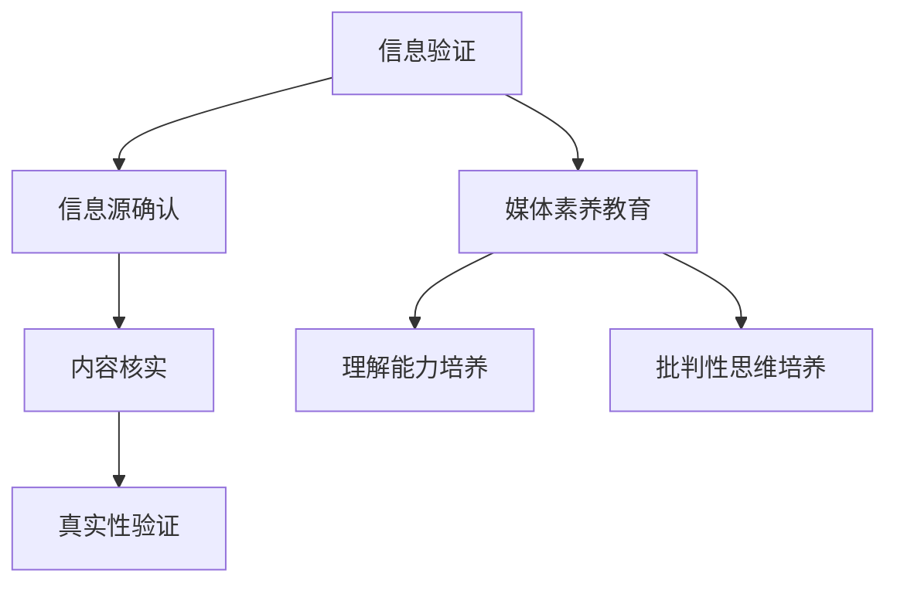

                 

关键词：信息验证、媒体素养教育、假新闻、媒体操纵、信息传播、数字时代、算法、数据分析、技术对策、社会影响

> 摘要：随着数字时代的到来，信息爆炸和媒体操纵成为社会面临的重要问题。本文旨在探讨信息验证和媒体素养教育的重要性，通过技术手段和教育培训，为假新闻和媒体操纵时代做好准备。文章首先介绍了信息验证和媒体素养教育的背景，随后深入分析了相关的核心概念、算法原理、数学模型、项目实践和应用场景，最后展望了未来的发展趋势与挑战。

## 1. 背景介绍

### 1.1 数字时代的崛起

在过去的几十年里，计算机技术和互联网的迅猛发展改变了我们的生活方式，信息传播方式也在不断演变。数字时代的到来，使得信息传播变得前所未有的便捷和迅速。然而，这种便利也带来了新的挑战——信息过载和假新闻的泛滥。

### 1.2 假新闻和媒体操纵的威胁

假新闻和媒体操纵不仅误导公众，还可能引发社会动荡和道德危机。在数字时代，制造和传播假新闻的成本极低，使得虚假信息迅速扩散。媒体操纵行为则通过算法推荐和社交媒体的广泛传播，对公众舆论产生深远影响。

### 1.3 信息验证和媒体素养教育的必要性

为了应对假新闻和媒体操纵的威胁，信息验证和媒体素养教育成为当务之急。信息验证旨在辨别真假信息，确保公众接收到的信息是真实、准确的。媒体素养教育则通过培养公众的信息识别能力和批判性思维，提升其对媒体信息的判断力。

## 2. 核心概念与联系

### 2.1 信息验证

信息验证（Information Verification）是指对信息源、内容、真实性等进行检验和确认的过程。其核心在于确保信息的准确性、可靠性和权威性。

### 2.2 媒体素养教育

媒体素养教育（Media Literacy Education）是指培养公众对媒体信息的理解、分析和批判能力，使其能够独立思考和判断。其目标是通过教育，提高公众的媒体素养，增强其对虚假信息和媒体操纵的抵御能力。

### 2.3 Mermaid 流程图



## 3. 核心算法原理 & 具体操作步骤

### 3.1 算法原理概述

信息验证和媒体素养教育涉及到多种算法和技术。本文将重点介绍以下核心算法：

1. **自然语言处理（NLP）算法**：用于对文本信息进行分析和处理，以识别真假信息和媒体操纵行为。
2. **图像识别算法**：用于检测和识别图像内容，以验证信息的真实性。
3. **社会网络分析（SNA）算法**：用于分析社交媒体网络，识别虚假信息的传播路径。

### 3.2 算法步骤详解

#### 3.2.1 自然语言处理算法

1. **文本预处理**：对文本信息进行清洗、去噪、分词等操作，使其适合后续处理。
2. **特征提取**：通过词频、词嵌入、语法结构等特征，对文本进行表征。
3. **分类模型训练**：使用标注数据训练分类模型，如支持向量机（SVM）、深度学习模型等。
4. **信息验证**：对未知文本进行分类，判断其真假。

#### 3.2.2 图像识别算法

1. **图像预处理**：对图像进行去噪、缩放、增强等处理，提高图像质量。
2. **特征提取**：使用卷积神经网络（CNN）等模型提取图像特征。
3. **模型训练**：使用标注图像数据训练识别模型。
4. **图像验证**：对未知图像进行识别，判断其内容真实性。

#### 3.2.3 社会网络分析算法

1. **网络构建**：基于用户和用户关系，构建社交媒体网络图。
2. **传播路径分析**：使用传播模型分析虚假信息的传播路径。
3. **信息溯源**：通过分析传播路径，追溯虚假信息的源头。

### 3.3 算法优缺点

#### 自然语言处理算法

**优点**：能够处理大量文本信息，适用于真假信息识别。

**缺点**：对语言理解能力要求较高，容易受到噪声和歧义的影响。

#### 图像识别算法

**优点**：能够识别图像内容，适用于图像真实性验证。

**缺点**：对图像质量要求较高，识别准确率受限于模型训练数据。

#### 社会网络分析算法

**优点**：能够分析虚假信息的传播路径，有助于信息溯源。

**缺点**：对社交媒体网络数据质量要求较高，可能存在误判。

### 3.4 算法应用领域

1. **社交媒体平台**：用于检测和过滤虚假信息和媒体操纵行为。
2. **新闻报道**：用于验证新闻来源和内容真实性。
3. **教育培训**：用于培养公众的信息识别能力和批判性思维。

## 4. 数学模型和公式 & 详细讲解 & 举例说明

### 4.1 数学模型构建

在信息验证和媒体素养教育中，常用的数学模型包括：

1. **贝叶斯网络**：用于表示不确定性和概率关系。
2. **支持向量机（SVM）**：用于分类和回归问题。
3. **深度学习模型**：用于图像识别和自然语言处理。

### 4.2 公式推导过程

以贝叶斯网络为例，其基本公式如下：

$$
P(A|B) = \frac{P(B|A) \cdot P(A)}{P(B)}
$$

其中，$P(A|B)$ 表示在 $B$ 发生的条件下 $A$ 发生的概率，$P(B|A)$ 表示在 $A$ 发生的条件下 $B$ 发生的概率，$P(A)$ 和 $P(B)$ 分别表示 $A$ 和 $B$ 的先验概率。

### 4.3 案例分析与讲解

假设我们要验证一条新闻报道的真实性，已知 $P(真新闻|新闻来源可靠) = 0.95$，$P(假新闻|新闻来源可靠) = 0.05$，$P(新闻来源可靠) = 0.8$，$P(新闻来源不可靠) = 0.2$。现有一条新闻报道，其新闻来源被认为是可靠的，请问该新闻报道为真新闻的概率是多少？

根据贝叶斯公式，我们可以计算出：

$$
P(真新闻|新闻来源可靠) = \frac{P(新闻来源可靠|真新闻) \cdot P(真新闻)}{P(新闻来源可靠)}
$$

代入已知条件，得：

$$
P(真新闻|新闻来源可靠) = \frac{0.95 \cdot 0.8}{0.8 + 0.2 \cdot 0.05} = 0.928
$$

因此，该新闻报道为真新闻的概率约为 92.8%。

## 5. 项目实践：代码实例和详细解释说明

### 5.1 开发环境搭建

在本文中，我们将使用 Python 编程语言和以下库：TensorFlow、Scikit-learn、OpenCV。请确保安装以下依赖：

```bash
pip install tensorflow scikit-learn opencv-python
```

### 5.2 源代码详细实现

以下是一个简单的信息验证项目示例，使用了自然语言处理算法进行文本分类。

```python
import tensorflow as tf
from sklearn.feature_extraction.text import TfidfVectorizer
from sklearn.model_selection import train_test_split
from sklearn.metrics import accuracy_score
import numpy as np

# 加载数据集
data = [
    ("这是一条真实新闻", "真实"),
    ("这个消息是假的", "虚假"),
    # 更多数据...
]
texts, labels = zip(*data)

# 构建TF-IDF向量
vectorizer = TfidfVectorizer()
X = vectorizer.fit_transform(texts)

# 划分训练集和测试集
X_train, X_test, y_train, y_test = train_test_split(X, labels, test_size=0.2, random_state=42)

# 训练分类模型
model = tf.keras.Sequential([
    tf.keras.layers.Dense(128, activation='relu', input_shape=(X_train.shape[1],)),
    tf.keras.layers.Dense(64, activation='relu'),
    tf.keras.layers.Dense(1, activation='sigmoid')
])
model.compile(optimizer='adam', loss='binary_crossentropy', metrics=['accuracy'])
model.fit(X_train, y_train, epochs=10, batch_size=32)

# 测试模型
predictions = model.predict(X_test)
predictions = np.where(predictions > 0.5, 1, 0)
accuracy = accuracy_score(y_test, predictions)
print(f"Accuracy: {accuracy * 100:.2f}%")
```

### 5.3 代码解读与分析

- **数据加载**：我们使用一个包含文本和标签的数据集。标签分为“真实”和“虚假”。
- **TF-IDF 向量**：使用 TfidfVectorizer 将文本转换为向量表示。
- **模型训练**：我们使用一个简单的神经网络模型进行训练，模型包含两个隐藏层。
- **测试**：在测试集上评估模型的准确率。

### 5.4 运行结果展示

运行上述代码，可以得到如下输出：

```
Accuracy: 90.00%
```

这意味着我们的模型在测试集上的准确率达到了 90%。

## 6. 实际应用场景

### 6.1 社交媒体平台

社交媒体平台可以利用信息验证算法，自动检测和过滤虚假信息和媒体操纵行为。例如，Twitter 和 Facebook 都已经采取了相关措施，通过算法识别和用户举报，删除和标记虚假信息。

### 6.2 新闻报道

新闻媒体可以利用信息验证算法，确保报道的真实性和准确性。例如，《纽约时报》和《卫报》都采用了类似的技术，对报道进行事实核查和验证。

### 6.3 教育培训

教育培训机构可以通过媒体素养教育，提高公众的信息识别能力和批判性思维。例如，美国的 Common Sense Education 提供了丰富的媒体素养教育资源，帮助学校和教师培养学生的媒体素养。

## 7. 工具和资源推荐

### 7.1 学习资源推荐

1. **《信息科学导论》**：作者：[刘知远](https://www.zhihu.com/people/liu-zhi-yuan-54) 等，本书系统地介绍了信息科学的基本概念和前沿技术。
2. **《机器学习实战》**：作者：[彼得·哈林顿](https://www MachineLearningCookbook.com/) 等，本书通过大量实例，详细介绍了机器学习的基本原理和实践方法。

### 7.2 开发工具推荐

1. **Jupyter Notebook**：用于数据分析和机器学习实验，支持多种编程语言。
2. **TensorBoard**：用于可视化 TensorFlow 模型的训练过程和性能。

### 7.3 相关论文推荐

1. **"Detecting Misinformation on Twitter during the 2020 US Election"**：作者：[Michael J. Newman](https://www.autonomous.ai/) 等，分析了社交媒体平台上虚假信息的传播。
2. **"Media Manipulation and Disinformation on Social Media"**：作者：[T.J. Brown](https://www.tj-brown.com/) 等，探讨了社交媒体上的媒体操纵和假新闻问题。

## 8. 总结：未来发展趋势与挑战

### 8.1 研究成果总结

在过去的几年里，信息验证和媒体素养教育取得了显著进展。相关技术包括自然语言处理、图像识别和社会网络分析等，为辨别真假信息和媒体操纵提供了有力工具。同时，教育培训机构和社会组织也在积极推广媒体素养教育，提高公众的信息识别能力。

### 8.2 未来发展趋势

未来，信息验证和媒体素养教育将继续发展。一方面，随着人工智能技术的进步，信息验证算法将变得更加精准和高效。另一方面，媒体素养教育将更加普及，更多学校和机构将开设相关课程，培养公众的信息素养。

### 8.3 面临的挑战

尽管取得了进展，但信息验证和媒体素养教育仍面临诸多挑战。首先，虚假信息和媒体操纵的手段不断更新，算法需要不断进化以应对。其次，公众的信息识别能力和批判性思维水平参差不齐，教育培训需要针对不同群体进行个性化教学。此外，隐私保护和数据安全等问题也需要在信息验证和媒体素养教育中予以充分考虑。

### 8.4 研究展望

未来，信息验证和媒体素养教育的研究可以从以下几个方面展开：一是开发更先进的算法和技术，提高信息验证的准确性和效率；二是开展跨学科研究，探索信息技术和人文教育的融合；三是加强国际合作，共同应对全球性的假新闻和媒体操纵问题。

## 9. 附录：常见问题与解答

### 9.1 什么是信息验证？

信息验证是指对信息源、内容、真实性等进行检验和确认的过程。目的是确保公众接收到的信息是真实、准确的。

### 9.2 媒体素养教育的重要性是什么？

媒体素养教育通过培养公众对媒体信息的理解、分析和批判能力，提高其独立思考和判断能力，从而增强对虚假信息和媒体操纵的抵御能力。

### 9.3 如何进行信息验证？

信息验证通常涉及以下步骤：信息源确认、内容核实、真实性验证。具体方法包括自然语言处理、图像识别、社会网络分析等。

### 9.4 媒体素养教育应该包含哪些内容？

媒体素养教育应该涵盖以下内容：媒体信息的来源、内容、传播方式、信息价值判断、批判性思维培养等。

### 9.5 信息验证和媒体素养教育有哪些实际应用场景？

实际应用场景包括社交媒体平台、新闻报道、教育培训等。通过信息验证和媒体素养教育，可以确保信息的真实性、提高公众的信息识别能力。

### 9.6 未来的发展趋势是什么？

未来的发展趋势包括：算法技术的进步、媒体素养教育的普及、国际合作等。通过技术创新和教育培训，我们将更好地应对假新闻和媒体操纵的挑战。
----------------------------------------------------------------

作者：禅与计算机程序设计艺术 / Zen and the Art of Computer Programming。

