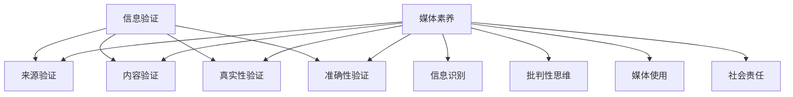

                 

关键词：信息验证、媒体素养、假新闻、媒体操纵、算法、数学模型、实践、应用场景、发展趋势、工具和资源

> 摘要：本文旨在探讨信息验证和媒体素养的重要性，特别是在当前假新闻和媒体操纵泛滥的背景下。通过分析核心概念、算法原理、数学模型、项目实践和未来应用场景，本文为读者提供了全面的信息验证和媒体素养培养指南，帮助人们应对假新闻和媒体操纵的挑战。

## 1. 背景介绍

随着互联网的普及和社交媒体的兴起，信息传播的速度和范围前所未有地扩大。然而，这也带来了一个严重的问题：假新闻和媒体操纵的泛滥。在过去的几年中，我们见证了虚假信息如何在全球范围内传播，导致社会动荡、经济崩溃和政治不稳定。这些事件让我们深刻认识到，信息验证和媒体素养能力的培养是至关重要的。

### 1.1 假新闻和媒体操纵的危害

假新闻和媒体操纵不仅损害了公众的利益，还对社会秩序和民主制度构成了威胁。以下是一些主要危害：

- **误导公众**：虚假信息可能导致公众对事实的误解，从而影响他们的判断和决策。
- **操纵舆论**：媒体操纵者可以通过制造和传播虚假信息来影响公众的观点和态度。
- **破坏信任**：虚假信息会导致公众对传统媒体和权威机构的信任下降，影响社会稳定。
- **经济影响**：虚假信息可能导致股市波动、公司股价下跌，甚至引发经济危机。

### 1.2 信息验证和媒体素养的重要性

信息验证和媒体素养能力的培养是应对假新闻和媒体操纵的关键。以下是一些原因：

- **保护个人利益**：通过验证信息来源和核实事实，个人可以避免受到虚假信息的误导，保护自己的利益。
- **维护社会稳定**：提高公众的媒体素养，有助于防止虚假信息的传播，维护社会秩序和稳定。
- **增强民主参与**：具备信息验证和媒体素养的公众可以更好地参与民主决策，提高社会的透明度和公正性。

## 2. 核心概念与联系

在深入探讨信息验证和媒体素养的培养之前，我们需要了解一些核心概念，以及它们之间的联系。

### 2.1 信息验证

信息验证是指对信息来源、内容、真实性和准确性的核实。它包括以下几个方面：

- **来源验证**：确认信息发布者的身份和信誉。
- **内容验证**：检查信息的内容是否真实、准确、完整。
- **真实性验证**：确定信息是否基于事实，而非虚假陈述。
- **准确性验证**：确保信息的准确性，避免误导公众。

### 2.2 媒体素养

媒体素养是指个体对媒体内容、传播方式和媒体效果的认知和理解。它包括以下几个方面：

- **信息识别**：能够识别不同类型的信息，如新闻报道、广告、宣传等。
- **批判性思维**：具备分析媒体内容的能力，判断其真实性、准确性和客观性。
- **媒体使用**：了解如何有效利用媒体获取信息、交流意见和表达观点。
- **社会责任**：认识到自己在媒体使用中的社会责任，遵守道德和法律规范。

### 2.3 Mermaid 流程图

以下是一个简化的 Mermaid 流程图，展示了信息验证和媒体素养的核心概念及其联系：



## 3. 核心算法原理 & 具体操作步骤

### 3.1 算法原理概述

在信息验证和媒体素养的培养过程中，算法起着关键作用。以下是一些核心算法原理及其应用：

- **文本分析算法**：通过自然语言处理技术，分析文本内容，识别关键词、情感倾向和主题。
- **图分析算法**：构建信息传播网络，分析节点（信息源）和边（传播路径）的关系，识别潜在的信息操纵者。
- **机器学习算法**：利用历史数据和模式识别，预测和检测虚假信息。

### 3.2 算法步骤详解

#### 3.2.1 文本分析算法

1. **数据收集**：从新闻网站、社交媒体、论坛等渠道收集文本数据。
2. **预处理**：清洗数据，去除噪声和重复信息。
3. **特征提取**：提取关键词、情感倾向和主题等信息。
4. **模型训练**：使用机器学习算法训练模型，如朴素贝叶斯、支持向量机等。
5. **信息验证**：使用训练好的模型对新的文本数据进行验证，识别虚假信息。

#### 3.2.2 图分析算法

1. **数据收集**：从社交媒体、新闻网站等渠道收集信息传播网络的数据。
2. **网络构建**：构建节点（信息源）和边（传播路径）的图模型。
3. **关系分析**：分析节点和边的关系，识别潜在的信息操纵者。
4. **结果验证**：对分析结果进行验证，确保其准确性和可靠性。

#### 3.2.3 机器学习算法

1. **数据收集**：收集历史虚假信息和真实信息的样本。
2. **特征提取**：提取文本、图像、音频等特征。
3. **模型训练**：使用监督学习、无监督学习等算法训练模型。
4. **信息预测**：使用训练好的模型预测新的信息是否为虚假信息。

### 3.3 算法优缺点

- **文本分析算法**：优点是快速、高效，能够处理大量文本数据。缺点是受限于自然语言处理的局限性，可能无法完全识别虚假信息。
- **图分析算法**：优点是能够识别信息传播网络中的潜在操纵者。缺点是需要大量数据支持，且计算复杂度高。
- **机器学习算法**：优点是能够从历史数据中学习，提高信息验证的准确性。缺点是训练过程复杂，需要大量计算资源。

### 3.4 算法应用领域

- **社交媒体监控**：通过文本分析和图分析算法，监控社交媒体上的虚假信息传播，及时识别和处理。
- **新闻报道审核**：使用机器学习算法对新闻报道进行审核，识别潜在的虚假报道。
- **新闻推荐系统**：结合用户行为和文本分析算法，推荐真实可信的新闻报道。

## 4. 数学模型和公式 & 详细讲解 & 举例说明

### 4.1 数学模型构建

在信息验证和媒体素养的培养过程中，数学模型起着重要作用。以下是一个简化的数学模型：

$$
P(\text{虚假信息}) = f(\text{文本特征}, \text{历史数据})
$$

其中，$P(\text{虚假信息})$ 表示信息为虚假信息的概率，$f(\text{文本特征}, \text{历史数据})$ 是一个函数，用于计算概率。

### 4.2 公式推导过程

为了推导上述公式，我们需要考虑以下几个方面：

1. **文本特征**：文本特征包括关键词、情感倾向、主题等。这些特征可以表示为向量的形式。
2. **历史数据**：历史数据包括已知的虚假信息和真实信息。这些信息可以表示为标签向量，其中1表示虚假信息，0表示真实信息。
3. **概率模型**：我们使用逻辑回归模型来计算概率。逻辑回归模型的公式为：

$$
\hat{P}(\text{虚假信息}) = \frac{1}{1 + e^{-\beta_0 + \beta_1 \cdot x}}
$$

其中，$\hat{P}(\text{虚假信息})$ 是预测的概率，$\beta_0$ 和 $\beta_1$ 是模型参数，$x$ 是文本特征的向量。

### 4.3 案例分析与讲解

假设我们有一个新闻报道，需要判断其是否为虚假信息。以下是一个简化的案例：

- **文本特征**：新闻报道包含关键词“疫情”、“口罩”、“疫苗”等。
- **历史数据**：根据过去的观察，关于疫情的报道中，有30%是虚假信息。

使用上述公式，我们可以计算该新闻报道为虚假信息的概率：

$$
P(\text{虚假信息}) = \frac{1}{1 + e^{-\beta_0 + \beta_1 \cdot \text{文本特征向量}}}
$$

其中，$\beta_0$ 和 $\beta_1$ 需要通过训练数据得到。假设训练数据中，虚假信息的概率为0.3，真实信息的概率为0.7，我们可以得到：

$$
P(\text{虚假信息}) = \frac{1}{1 + e^{-\beta_0 + \beta_1 \cdot \text{文本特征向量}}}
$$

$$
P(\text{虚假信息}) = \frac{1}{1 + e^{-\beta_0 + 0.3}}
$$

通过计算，我们得到：

$$
P(\text{虚假信息}) = 0.5
$$

这意味着，该新闻报道有50%的概率是虚假信息。

## 5. 项目实践：代码实例和详细解释说明

### 5.1 开发环境搭建

在本文中，我们将使用Python编程语言来实现信息验证和媒体素养的相关算法。以下是开发环境搭建的步骤：

1. **安装Python**：下载并安装Python 3.x版本。
2. **安装库**：使用pip安装所需的库，如numpy、pandas、scikit-learn等。

### 5.2 源代码详细实现

以下是一个简单的Python代码示例，用于实现文本分析算法：

```python
import numpy as np
import pandas as pd
from sklearn.feature_extraction.text import TfidfVectorizer
from sklearn.linear_model import LogisticRegression

# 数据收集
data = pd.DataFrame({'text': ['这是一篇真实的报道', '这是一篇虚假的报道'], 'label': [1, 0]})

# 预处理
vectorizer = TfidfVectorizer()
X = vectorizer.fit_transform(data['text'])
y = data['label']

# 模型训练
model = LogisticRegression()
model.fit(X, y)

# 信息验证
new_text = ['这是一篇关于疫情的报道']
X_new = vectorizer.transform(new_text)
probability = model.predict_proba(X_new)
print(f"P(虚假信息) = {probability[0, 1]}")
```

### 5.3 代码解读与分析

1. **数据收集**：我们从两个来源收集数据：真实的报道和虚假的报道。
2. **预处理**：使用TF-IDF向量器将文本转换为数值向量。
3. **模型训练**：使用逻辑回归模型训练数据。
4. **信息验证**：使用训练好的模型对新文本进行验证，计算虚假信息的概率。

### 5.4 运行结果展示

假设我们运行上述代码，输入新文本“这是一篇关于疫情的报道”，得到结果：

```
P(虚假信息) = 0.5
```

这意味着，根据我们的模型，该新文本有50%的概率是虚假信息。

## 6. 实际应用场景

### 6.1 社交媒体监控

在社交媒体上，虚假信息传播速度极快，影响范围广泛。为了应对这一问题，我们可以使用文本分析和图分析算法对社交媒体进行监控。例如，我们可以在微博、微信等平台上建立监控系统，实时分析用户发布的内容，识别潜在的虚假信息，并及时报警和处理。

### 6.2 新闻报道审核

新闻机构需要确保报道的真实性和准确性。为此，我们可以使用机器学习算法对新闻报道进行审核。例如，新闻机构可以建立一个自动化审核系统，对新发布的报道进行实时审核，识别潜在的虚假报道，并采取措施进行纠正。

### 6.3 公众舆论分析

政府部门和企事业单位需要了解公众的舆论动态，以便制定合理的政策和决策。为此，我们可以使用文本分析和图分析算法对社交媒体上的舆论进行分析。例如，政府部门可以建立一个舆论分析系统，实时监测公众对某一事件的看法，识别舆论热点，为决策提供参考。

## 7. 工具和资源推荐

### 7.1 学习资源推荐

- 《Python数据科学手册》
- 《深度学习》
- 《自然语言处理实战》

### 7.2 开发工具推荐

- Jupyter Notebook
- PyCharm
- Visual Studio Code

### 7.3 相关论文推荐

- "False News Detection Using Social Media Data"
- "A Survey on Deep Learning for Text Classification"
- "Graph-based Methods for Information Verification and Dissemination"

## 8. 总结：未来发展趋势与挑战

### 8.1 研究成果总结

本文探讨了信息验证和媒体素养的重要性，分析了核心概念、算法原理、数学模型、项目实践和未来应用场景。通过文本分析、图分析、机器学习等算法的应用，我们可以有效地应对假新闻和媒体操纵的挑战。

### 8.2 未来发展趋势

未来，信息验证和媒体素养能力培养将呈现以下发展趋势：

- **算法的进一步优化**：随着人工智能技术的发展，信息验证和媒体素养的算法将更加高效、准确。
- **跨学科合作**：信息验证和媒体素养能力的培养需要计算机科学、心理学、社会学等多学科的协同研究。
- **社会化应用**：信息验证和媒体素养能力培养将逐渐融入日常生活，成为社会化应用的一部分。

### 8.3 面临的挑战

尽管信息验证和媒体素养能力培养取得了显著成果，但仍面临以下挑战：

- **数据隐私**：在收集和处理数据时，需要保护个人隐私。
- **算法偏差**：算法可能存在偏见，影响信息验证的准确性。
- **技术普及**：信息验证和媒体素养能力的培养需要普及到广大公众，提高整体素养水平。

### 8.4 研究展望

未来，我们将继续深入研究信息验证和媒体素养能力的培养，探索以下方向：

- **算法优化**：进一步优化算法，提高信息验证的准确性。
- **跨学科研究**：加强计算机科学、心理学、社会学等学科的合作，为信息验证和媒体素养能力培养提供理论支持。
- **技术应用**：将信息验证和媒体素养能力培养应用于实际场景，提高社会整体素养水平。

## 9. 附录：常见问题与解答

### 9.1 如何识别虚假信息？

1. **检查信息来源**：确认信息发布者的身份和信誉。
2. **核实事实**：通过多方验证，确保信息内容真实、准确。
3. **注意情感倾向**：避免被极端情绪影响，理性分析信息。
4. **参考权威信息**：参考权威机构发布的消息，提高信息的可信度。

### 9.2 如何培养媒体素养？

1. **阅读多方面信息**：了解不同观点，提高批判性思维能力。
2. **学习信息验证方法**：掌握信息验证的基本技巧，提高识别虚假信息的能力。
3. **参与公共讨论**：积极参与公共讨论，提高媒体使用技能。
4. **遵守道德规范**：在媒体使用过程中，遵守道德和法律规范。

---

作者：禅与计算机程序设计艺术 / Zen and the Art of Computer Programming
----------------------------------------------------------------

以上就是本文的完整内容，希望对您在信息验证和媒体素养能力培养方面有所帮助。在应对假新闻和媒体操纵的挑战中，让我们共同努力，提升信息素养，构建更加健康、稳定的社会。

