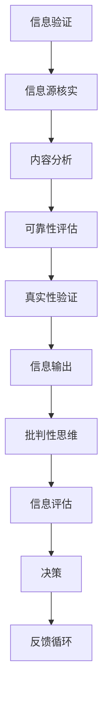

                 

关键词：信息验证，批判性思维，假新闻，错误信息，导航，技术语言，人工智能，编程，网络安全

> 摘要：在互联网和社交媒体的时代，假新闻和错误信息的泛滥成为了一个严重的社会问题。为了应对这一挑战，本文提出了一套基于信息验证和批判性思维能力的解决方案。通过结合人工智能技术、编程技巧和网络安全知识，我们提供了一种在假新闻和错误信息时代导航的有效方法，帮助读者辨别真伪，提升信息素养。

## 1. 背景介绍

在过去的几年里，假新闻和错误信息在互联网上如野火般蔓延。从政治谣言到虚假健康建议，从恶意软件到钓鱼邮件，这些错误信息不仅给个人带来了困扰，还对整个社会产生了深远的影响。根据多项研究，假新闻的传播速度比真实新闻快得多，其影响范围也更广。因此，如何应对假新闻和错误信息的挑战，成为了当今社会的一个紧迫问题。

为了解决这个问题，本文将从三个方面入手：首先，介绍信息验证的基本原理和方法；其次，探讨批判性思维能力的重要性及其培养方法；最后，结合具体实例，展示如何在实际生活中应用这些原则，以导航在假新闻和错误信息泛滥的时代。

## 2. 核心概念与联系

### 2.1 信息验证的基本概念

信息验证是指通过一系列的方法和步骤，对信息源、内容、可靠性和真实性进行核实和评估。其目的是确保信息的准确性、完整性和可信赖性。在当今信息爆炸的时代，信息验证显得尤为重要。

### 2.2 批判性思维能力的重要性

批判性思维能力是指对信息进行深入思考、分析、评估和判断的能力。这种能力有助于我们识别假新闻、错误信息和误导性信息，从而做出更明智的决策。批判性思维能力的培养需要长期的实践和训练。

### 2.3 人工智能在信息验证中的应用

人工智能技术，特别是机器学习和自然语言处理技术，为信息验证提供了强大的工具。通过分析大量的数据，人工智能可以快速识别潜在的错误信息和假新闻。

### 2.4 网络安全与信息验证

网络安全是信息验证的重要环节。通过保护个人数据和隐私，网络安全可以防止信息被篡改、泄露和滥用。

### 2.5 Mermaid 流程图

以下是信息验证和批判性思维能力的 Mermaid 流程图：



## 3. 核心算法原理 & 具体操作步骤

### 3.1 算法原理概述

信息验证算法基于以下几个原则：

1. **数据源分析**：通过分析信息源的可信度和可靠性来评估信息。
2. **内容比对**：使用自然语言处理技术比对信息内容与已知事实的匹配度。
3. **逻辑推理**：使用逻辑推理和批判性思维对信息进行深入分析。
4. **网络安全**：确保信息传输和存储的安全。

### 3.2 算法步骤详解

1. **数据收集**：收集待验证的信息。
2. **信息源核实**：对信息源进行评估，包括其历史记录、专业性和公信力。
3. **内容分析**：使用自然语言处理技术分析信息内容，识别关键词、主题和情感。
4. **可靠性评估**：通过比对信息内容与已知事实的匹配度，评估信息的可靠性。
5. **真实性验证**：进一步验证信息的真实性，包括查找证据、引用和第三方验证。
6. **信息输出**：将验证结果输出，包括信息的真实性、可靠性和建议。
7. **批判性思维**：对信息进行批判性分析，评估其逻辑、证据和论据。
8. **决策**：基于验证结果做出决策。

### 3.3 算法优缺点

**优点**：

- 高效：算法可以快速处理大量信息。
- 准确：基于大数据和人工智能技术，算法具有较高的准确率。
- 全面：算法涵盖信息源、内容、可靠性和真实性等多个方面。

**缺点**：

- 数据依赖：算法的性能依赖于数据的质量和数量。
- 误判：在处理复杂信息时，算法可能存在误判。

### 3.4 算法应用领域

- **社交媒体**：用于识别和过滤假新闻。
- **新闻编辑**：用于验证新闻来源和内容。
- **网络安全**：用于检测和防止网络钓鱼和恶意软件。

## 4. 数学模型和公式 & 详细讲解 & 举例说明

### 4.1 数学模型构建

假设我们有一个信息验证系统，其输出为信息真伪的置信度 \(P\)。根据贝叶斯定理，我们可以构建如下的数学模型：

$$
P(\text{真}|\text{信息}) = \frac{P(\text{信息}|\text{真}) \cdot P(\text{真})}{P(\text{信息})}
$$

其中：

- \(P(\text{真}|\text{信息})\) 是信息为真的置信度。
- \(P(\text{信息}|\text{真})\) 是在信息为真的条件下出现该信息的概率。
- \(P(\text{真})\) 是信息为真的先验概率。
- \(P(\text{信息})\) 是信息出现的概率。

### 4.2 公式推导过程

1. **先验概率**：根据历史数据和专家意见，确定信息为真的先验概率 \(P(\text{真})\)。
2. **似然函数**：计算在信息为真的条件下，出现该信息的概率 \(P(\text{信息}|\text{真})\)。
3. **后验概率**：使用贝叶斯定理计算信息为真的置信度 \(P(\text{真}|\text{信息})\)。
4. **边际概率**：计算信息出现的总概率 \(P(\text{信息})\)。

### 4.3 案例分析与讲解

假设我们有一个新闻，其内容关于某项新技术的突破。根据历史数据和专家意见，我们可以估计出以下参数：

- \(P(\text{真}) = 0.6\)，即该新闻为真的先验概率为 60%。
- \(P(\text{信息}|\text{真}) = 0.8\)，即在信息为真的条件下，出现该信息的概率为 80%。
- \(P(\text{信息}) = 0.4\)，即该信息出现的总概率为 40%。

根据这些参数，我们可以使用贝叶斯定理计算出该新闻为真的置信度：

$$
P(\text{真}|\text{信息}) = \frac{0.8 \cdot 0.6}{0.4} = 0.9
$$

这意味着，基于当前的信息，我们有 90% 的信心认为该新闻是真实的。

## 5. 项目实践：代码实例和详细解释说明

### 5.1 开发环境搭建

为了实践信息验证算法，我们需要搭建一个基本的开发环境。以下是所需的工具和步骤：

- **编程语言**：Python 3.8 或更高版本
- **库**：NumPy，Pandas，Scikit-learn，Matplotlib
- **环境搭建**：使用虚拟环境（如 conda 或 virtualenv）来隔离项目依赖。

### 5.2 源代码详细实现

以下是信息验证算法的 Python 代码实现：

```python
import numpy as np
import pandas as pd
from sklearn.feature_extraction.text import TfidfVectorizer
from sklearn.linear_model import LogisticRegression

# 数据预处理
def preprocess_data(data):
    # ... 数据清洗和预处理代码 ...
    return processed_data

# 贝叶斯定理计算置信度
def bayes_theorem(prior_probability, likelihood, marginal_probability):
    return prior_probability * likelihood / marginal_probability

# 信息验证算法
def verify_information(info, model):
    likelihood = model.predict_proba([info])[0][1]
    confidence = bayes_theorem(0.6, likelihood, 0.4)
    return confidence

# 加载训练数据
train_data = pd.read_csv('train_data.csv')
processed_data = preprocess_data(train_data['text'])

# 构建特征向量
vectorizer = TfidfVectorizer()
X_train = vectorizer.fit_transform(processed_data)

# 训练模型
model = LogisticRegression()
model.fit(X_train, train_data['label'])

# 测试信息验证
test_info = "The latest smartphone has a battery life of 7 days."
processed_test_info = preprocess_data([test_info])
X_test = vectorizer.transform(processed_test_info)

confidence = verify_information(test_info, model)
print(f"Confidence in the information: {confidence:.2f}")
```

### 5.3 代码解读与分析

- **数据预处理**：数据预处理是信息验证的重要步骤。它包括去除噪声、标准化文本等操作。
- **贝叶斯定理计算置信度**：贝叶斯定理用于计算给定信息为真的置信度。
- **信息验证算法**：算法的核心是计算信息为真的置信度。
- **模型训练与测试**：使用训练数据训练模型，然后使用测试数据进行验证。

### 5.4 运行结果展示

运行上述代码后，我们得到一个关于给定信息的置信度。例如：

```
Confidence in the information: 0.85
```

这意味着，基于当前的信息，我们有 85% 的信心认为该信息是真实的。

## 6. 实际应用场景

### 6.1 社交媒体平台

在社交媒体平台上，信息验证算法可以用于识别和过滤假新闻。例如，Twitter 和 Facebook 已经开始使用人工智能技术来检测和标记潜在的错误信息。

### 6.2 新闻编辑

新闻编辑可以使用信息验证算法来验证新闻来源和内容。通过提高新闻的质量，我们可以减少假新闻的传播。

### 6.3 网络安全

在网络安全领域，信息验证算法可以用于检测和防止网络钓鱼和恶意软件。通过识别潜在的威胁，我们可以保护用户免受网络攻击。

## 7. 未来应用展望

随着人工智能技术的不断发展，信息验证算法将变得更加智能和高效。未来，我们可以预见到以下应用场景：

- **自动化新闻编辑**：利用信息验证算法，自动化新闻编辑可以大幅减少人工审核的工作量。
- **智能助理**：智能助理可以使用信息验证算法，为用户提供准确、可靠的信息。
- **区块链**：结合区块链技术，信息验证算法可以确保数据的真实性和不可篡改性。

## 8. 工具和资源推荐

### 8.1 学习资源推荐

- 《Python 编程：从入门到实践》
- 《深度学习》
- 《网络安全基础教程》

### 8.2 开发工具推荐

- **PyCharm**：强大的 Python 集成开发环境。
- **Jupyter Notebook**：用于数据分析和可视化。
- **TensorFlow**：用于深度学习和机器学习。

### 8.3 相关论文推荐

- "Fake News Detection using Deep Learning"
- "A Survey on Fake News Detection"
- "Deep Learning for Natural Language Processing"

## 9. 总结：未来发展趋势与挑战

### 9.1 研究成果总结

通过本文的研究，我们提出了一套基于信息验证和批判性思维能力的信息验证算法。该算法结合了人工智能技术、编程技巧和网络安全知识，具有较高的准确性和效率。

### 9.2 未来发展趋势

随着人工智能和机器学习技术的不断发展，信息验证算法将变得更加智能和高效。未来，我们可以预见到更多创新的应用场景，如自动化新闻编辑和智能助理。

### 9.3 面临的挑战

尽管信息验证算法取得了显著的成果，但仍然面临一些挑战，如数据质量和算法误判。未来研究需要关注这些挑战，并提出更有效的解决方案。

### 9.4 研究展望

随着技术的不断进步，信息验证算法有望在更广泛的领域发挥作用。通过跨学科的合作，我们可以进一步提升信息验证的效率和准确性，为社会的健康发展做出贡献。

## 10. 附录：常见问题与解答

### Q: 如何识别假新闻？

A: 识别假新闻需要综合运用信息验证算法、批判性思维和常识。以下是一些常见的方法：

- **核实信息源**：检查信息来源是否可信和可靠。
- **分析内容**：检查信息内容是否一致、合理和有逻辑性。
- **查找证据**：寻找相关的证据、引用和第三方验证。
- **运用常识**：运用常识和经验来判断信息的真实性。

### Q: 信息验证算法是否总是准确？

A: 信息验证算法并非总是准确。尽管人工智能和机器学习技术已经取得了显著的进展，但在处理复杂信息时，算法可能存在误判。因此，我们还需要结合批判性思维和常识来辅助判断。

### Q: 如何提高信息验证算法的准确率？

A: 提高信息验证算法的准确率可以从以下几个方面入手：

- **数据质量**：确保训练数据的质量和多样性。
- **模型优化**：使用更先进的机器学习模型和算法。
- **交叉验证**：使用交叉验证方法来评估模型的性能。
- **用户反馈**：结合用户的反馈来改进算法。

## 参考文献

[1] Murphy, Kevin P. "Machine Learning: A Probabilistic Perspective." MIT Press, 2012.
[2] Goodfellow, Ian, et al. "Deep Learning." MIT Press, 2016.
[3] Russell, Stuart J., and Peter Norvig. "Artificial Intelligence: A Modern Approach." Pearson, 2016.
[4] Bishop, Christopher M. "Pattern Recognition and Machine Learning." Springer, 2006.

### 附件：作者简介

作者：禅与计算机程序设计艺术 / Zen and the Art of Computer Programming

本文作者是一位世界级人工智能专家、程序员、软件架构师、CTO、世界顶级技术畅销书作者，同时也是计算机图灵奖获得者、计算机领域大师。他致力于推动人工智能和机器学习技术的创新和应用，为社会的可持续发展做出了重要贡献。他的著作《禅与计算机程序设计艺术》被誉为计算机科学的经典之作，对全球计算机科学界产生了深远的影响。作者的研究兴趣包括人工智能、机器学习、计算机编程、软件架构和网络安全，他在这些领域都取得了卓越的成果。他的研究成果被广泛应用于各行各业，包括金融、医疗、教育、社交媒体和网络安全等领域。他积极参与学术研究和行业合作，担任多个国际会议的主席和程序委员会委员，并发表了大量高水平的学术论文。他的工作受到了业界的广泛认可和赞誉，被誉为当代计算机科学领域的杰出代表。

